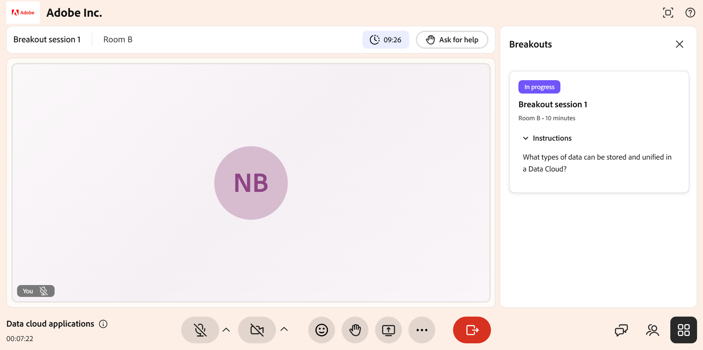

# Participer à une séance en petits groupes

Au cours d&#39;une session Live Hub, votre instructeur peut diviser la session en petites salles de réunion pour une discussion ciblée et des activités pratiques.

Lorsqu’une session en petits groupes commence, vous êtes automatiquement déplacé vers la salle qui vous a été attribuée, où vous pouvez collaborer avec votre groupe, suivre les instructions sur l’activité et demander de l’aide lorsque vous en avez besoin. Une fois la session terminée, vous pouvez consulter un résumé généré par l’IA de la discussion qui s’est tenue dans votre salle de petit déjeuner. Ce guide explique ce à quoi vous devez vous attendre et ce que vous pouvez faire en tant qu’élève pendant une session en petits groupes.

## Rejoignez votre salle de réunion

Lorsque votre instructeur commence une session de petits groupes, vous êtes automatiquement déplacé de la salle principale vers la salle de petits groupes qui vous a été affectée. Vous n&#39;avez rien à faire pour vous joindre. La partie supérieure de l’écran affiche le nom de la session et votre salle, ainsi qu’un compte à rebours indiquant le temps restant dans l’activité.

>[!NOTE]
>
>Les conversations dans les salles de réunion sont transcrites et traitées à l&#39;aide de l&#39;IA pour générer des résumés. Les instructeurs peuvent consulter ces résumés pour suivre la progression de la salle et identifier les lacunes des discussions.

*Vue par l’élève d’une salle d’atelier active, avec le nom de la salle, le compte à rebours et les outils de session*

## Afficher les instructions d’activité

Votre instructeur définit une invite d&#39;activité ou de discussion pour l&#39;éclatement. Le panneau **Répartitions** sur la droite affiche l&#39;état de la session (**En cours**), votre salle et la durée de la session.

Pour afficher l’invite d’activité :

1. Si le panneau **Répartitions** est fermé, sélectionnez l&#39;icône **Répartitions** (grille) en bas à droite de l&#39;écran.

2. Sélectionnez **Instructions** pour développer l&#39;invite d&#39;activité, par exemple, « Quels types de données peuvent être stockés et unifiés dans un Data Cloud ? »

Reportez-vous à ces instructions tout au long de la présentation pour conserver votre
discussion alignée sur l&#39;activité.

## Collaborer avec votre groupe

Dans votre salle de réunion, vous pouvez travailler avec les autres élèves de la salle à l’aide des outils de la barre de contrôle :

- **Microphone** : désactivez ou désactivez votre micro pour parler avec votre groupe.

- **Appareil photo** : activez ou désactivez votre vidéo.

- **Réactions** : envoyez une réaction émoji rapide.

- **Lever la main** : signalez que vous souhaitez parler ou attirer l&#39;attention.

- **Partager l&#39;écran** : partagez votre écran ou une présentation avec la salle.

- **Conversation** : ouvre le panneau de conversation pour envoyer des messages aux autres personnes de votre salle.

- **Participants** : découvrez qui se trouve dans votre salle de réunion.

Seuls les utilisateurs de votre salle peuvent vous voir et vous entendre, de sorte que vous pouvez discuter librement sans interrompre les autres salles de réunion.

## Recevoir des messages de votre instructeur

Votre instructeur peut envoyer un message de diffusion à chaque salle à la fois, par exemple un rappel d’activité ou une vérification de l’heure. Lorsque c’est le cas, le message s’affiche sur votre écran. Lisez le message, puis fermez-le pour revenir à votre activité.

*Message de diffusion de l’instructeur affiché dans la salle de réunion de l’élève*

## Demander de l’aide

Si votre groupe a une question ou a besoin de l&#39;instructeur pour rejoindre votre salle, sélectionnez **Demander de l&#39;aide** en haut de la salle de réunion. L’instructeur est alors averti et peut rejoindre la salle pour vous aider. Vous pouvez continuer la discussion en attendant la réponse de l&#39;instructeur.

*L’option Demander de l’aide est utilisée pour demander l’aide de l’instructeur*

Après avoir envoyé une demande, le bouton se transforme en **Annuler l&#39;appel à l&#39;aide**. Si vous n&#39;avez plus besoin d&#39;aide, par exemple, si votre groupe a résolu la question lui-même, sélectionnez **Annuler l&#39;appel à l&#39;aide** pour retirer la demande.

*L&#39;option Annuler l&#39;appel à l&#39;aide utilisée pour retirer une demande d&#39;aide*

## Retour à la pièce principale

La session d’éclatement s’exécute pendant la durée indiquée sur le minuteur et votre instructeur peut la prolonger si nécessaire. Lorsque la session se termine, que ce soit lorsque le minuteur arrive à expiration ou lorsque l’instructeur la termine prématurément, vous êtes automatiquement redirigé vers la salle principale pour continuer la session avec tout le monde.

## Afficher le résumé de votre salle

À la fin d’une session en petits groupes, vous pouvez afficher un résumé généré par l’IA de la conversation qui a eu lieu dans votre salle. Le résumé comprend les points clés abordés par votre groupe.

Un résumé n&#39;est généré que si la salle dispose d&#39;au moins 60 secondes de conversation. Si l&#39;activité de la salle est inférieure à 60 secondes, aucun résumé n&#39;est disponible.

>[!NOTE]
>
>Vous ne pouvez afficher le rapport que pour la salle dans laquelle vous vous trouviez. Les rapports provenant d&#39;autres salles de réunion ne sont pas visibles.

Si votre instructeur vous déplace dans une autre salle au cours de la même session de petits groupes, par exemple de la salle A à la salle B, seul le résumé de la salle la plus récente s’affiche. Les résumés des salles où vous vous trouviez auparavant ne sont pas conservés.

Pour consulter le récapitulatif de votre salle :

1. Sélectionnez l&#39; dans la barre de contrôle.   Le panneau des sous-groupes s’affiche.
1. Accédez à la carte de la session de petits groupes pour laquelle vous souhaitez afficher le résumé.
1. Sélectionnez la session d&#39;éclatement, puis sélectionnez **Résumé**.  Le résumé généré par l’IA pour votre salle s’affiche.

   
   *Sélectionnez Résumé pour afficher le résumé de votre salle.*