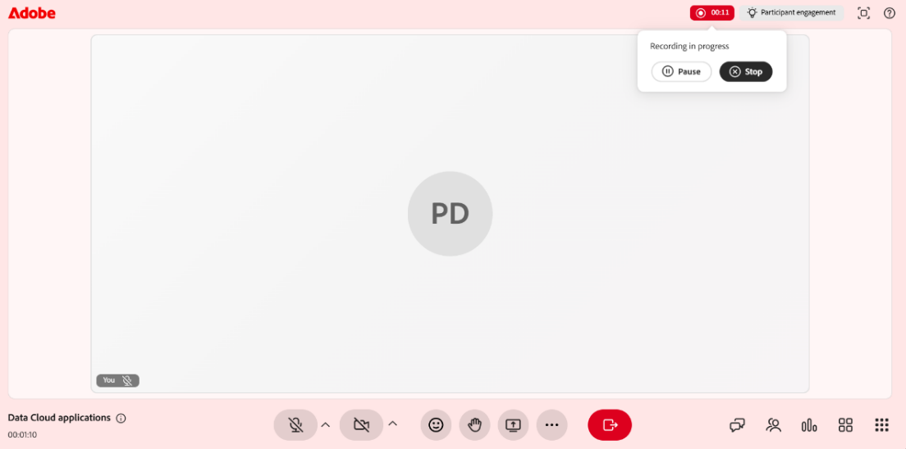

# Enregistrer une session

En tant qu’instructeur, vous avez un contrôle total sur la façon dont une session est capturée, affinée et partagée. Vous pouvez démarrer un enregistrement pendant une session en direct, le gérer pendant son exécution et consulter les rubriques, le résumé et la transcription générés automatiquement une fois la session terminée.

En plus de capturer la session, vous pouvez modifier l’enregistrement pour supprimer les sections inutiles, activer les sous-titres et les transcriptions. Les sections suivantes présentent chacune de ces actions en détail.

>[!NOTE]
>
>Lorsque vous enregistrez une session, seule la session principale est incluse dans l’enregistrement. L’enregistrement s’interrompt automatiquement lorsque les participants se déplacent dans les salles de réunion et reprend lorsque tout le monde revient à la session principale. Par conséquent, les activités des salles de petits groupes ne sont pas enregistrées.

## Enregistrer une session

1. Accédez au menu **Autres actions**.

1. Sélectionnez **Démarrer l&#39;enregistrement**.   Une fenêtre contextuelle de confirmation s&#39;affiche, indiquant que « **La session est en cours d&#39;enregistrement** ».

   
   *Sélectionnez Enregistrer dans le menu Autres actions pour commencer à capturer la session.*

## Arrêter, suspendre et reprendre l’enregistrement

Lorsqu’une session est enregistrée, un indicateur d’enregistrement apparaît dans le coin supérieur de la salle de classe virtuelle. Vous pouvez démarrer, arrêter et reprendre l’enregistrement.

### Arrêter l’enregistrement

1. Sélectionnez l’indicateur d’enregistrement.   Une fenêtre contextuelle s’ouvre avec des actions d’enregistrement.

   
   *Lors de l’enregistrement, utilisez les options Enregistrement en cours pour suspendre ou arrêter la session.*

1. Sélectionnez **Arrêter l&#39;enregistrement**.   Un message de confirmation s’affiche pour indiquer que la session n’est plus enregistrée.

### Suspendre l’enregistrement

Pour mettre l’enregistrement en pause :

1. Sélectionnez l’indicateur d’enregistrement.

1. Sélectionnez **Suspendre l’enregistrement**.   Un message de confirmation s&#39;affiche. **Enregistrement et transcription suspendus**.

### Reprendre l’enregistrement

Une fois l’enregistrement interrompu, une option de reprise de l’enregistrement s’affiche. Sélectionnez **Reprendre l&#39;enregistrement** pour continuer l&#39;enregistrement en pause.

*En pause, les options Enregistrement en pause vous permettent de reprendre ou d’arrêter l’enregistrement.*

## Accès à un enregistrement

Les sessions enregistrées sont disponibles sur la page **Présentation de la session** pour chaque session. À partir de là, vous pouvez lire un enregistrement ou l’ouvrir en mode de modification pour affiner le montage et la transcription.

Pour accéder à un enregistrement :

1. Accédez au cours requis et ouvrez la session.

1. Accédez à la section **Concentrateur en direct** sur la page **Présentation de la session**.

1. Dans la carte **Afficher l&#39;enregistrement**, effectuez l&#39;une des opérations suivantes :

   * Sélectionnez **Afficher l&#39;enregistrement** pour ouvrir l&#39;enregistrement en mode de lecture.

   * Sélectionnez **Modifier** pour ouvrir l’enregistrement en mode de modification.

   
   *Afficher la carte d’enregistrement dans la section Live Hub, où vous lisez ou modifiez un enregistrement.*

## Lecture d’un enregistrement

Sélectionnez Afficher l’enregistrement pour ouvrir l’enregistrement dans le lecteur d’enregistrement. Le lecteur affiche la vidéo de la session, les vignettes des participants et la transcription.

Pour lire un enregistrement :

1. Accédez à la page **Présentation de la session**.

1. Sélectionnez **Afficher l&#39;enregistrement** dans la section **Live hub**.   L’enregistrement s’ouvre en mode de lecture.

   
   *Le lecteur d’enregistrement est en mode de lecture, affichant la vidéo de la session et le panneau de transcription.*

1. Utilisez les commandes de lecture suivantes pour régler votre expérience de visionnage :

| **Contrôle** | **Description** |
|----|----|
| Lecture ou Pause | Démarre ou interrompt la lecture. |
| Volume | Règle le niveau audio. |
| Barre de progression | Faites glisser le pointeur pour atteindre un point spécifique de l’enregistrement. Le temps écoulé et le temps total sont affichés en regard des commandes. |
| Vitesse de lecture | Ralentit ou accélère la lecture. Les options disponibles sont **0.25x**, **0.5x**, **0.75x**, **1x**, **1.25x**, **1.5x** et **2x**. |
| CC (sous-titres) | Active ou désactive les sous-titres pendant la lecture. Sélectionnez la flèche en regard du bouton CC pour personnaliser les sous-titres. Choisissez une taille de police parmi **Petite**, **Moyenne** ou **Grande** et un style de légende parmi **Noir sur Blanc**, **Jaune sur Noir**, **Blanc sur Noir**, **Sombre sur Jaune** ou **Jaune sur Bleu**. |
| Plein écran | Développe le lecteur d’enregistrement. |

## Génération de rubriques dans l’enregistrement

Les rubriques divisent automatiquement les enregistrements en sections significatives en fonction du flux de la discussion de la session. Ils aident à organiser des enregistrements plus longs et à améliorer la navigation. Vous pouvez également rechercher une rubrique à l’aide de mots-clés pour naviguer rapidement vers la section pertinente de l’enregistrement.

## Afficher les rubriques dans l’enregistrement

Une fois les rubriques générées, vous pouvez les parcourir et les parcourir. Les rubriques sont marquées comme **Générées à l&#39;aide d&#39;AI**. Vérifiez le contenu, car les réponses générées par l’IA doivent être vérifiées deux fois.

Pour afficher et parcourir les rubriques :

1. Dans le panneau **Rubriques**, parcourez la liste des rubriques ou utilisez la zone **Rechercher** pour trouver une rubrique à l&#39;aide de mots-clés.

1. Sélectionnez une rubrique pour la développer et afficher son résumé, ses détails et sa durée totale.

1. Sélectionnez **Lire la rubrique**.   La lecture de l’enregistrement démarre à partir de la section de rubrique sélectionnée.

   
   *Le panneau Rubriques, où les rubriques générées par l’IA vous aident à naviguer dans l’enregistrement.*

## Afficher la transcription

La transcription fournit une version texte horodatée de la session que vous pouvez lire en même temps que l’enregistrement. Chaque entrée comprend le nom de l’intervenant et l’heure à laquelle le texte a été prononcé.

Pour afficher la transcription :

1. Sélectionnez l&#39;icône **Transcription** dans le panneau qui s&#39;affiche sur le côté droit du lecteur.   Le panneau **Transcription** s&#39;ouvre et affiche la transcription horodatée.

1. (Facultatif) Utilisez la zone **Rechercher** pour trouver des mots ou des expressions spécifiques dans la transcription.

Pour accéder à une partie spécifique de l’enregistrement, sélectionnez une entrée de transcription. L’enregistrement passe à l’horodatage correspondant et commence la lecture à partir de ce point.

*Le panneau Transcription, où chaque entrée renvoie à son point dans l’enregistrement.*

### Modification de la taille du texte de la transcription

Vous pouvez ajuster la taille du texte de la transcription pour le rendre plus facile à lire.

Pour modifier la taille du texte :

1. Dans le panneau **Transcription**, sélectionnez l’icône **Taille du texte** en regard de l’en-tête **Transcription**.

1. Sélectionnez une taille de texte dans la liste. Les tailles disponibles sont 12, 14, 16, 18, 20, 24, 30 et 36. La taille par défaut est 14. Le texte de la transcription est mis à jour à la taille sélectionnée.

   
   *Choisissez une taille de texte de transcription pour faciliter la lecture des entrées.*

## Modification d’un enregistrement

La modification d’un enregistrement dans Live Hub vous permet d’affiner le contenu avant de le partager avec les élèves. Vous pouvez rogner le montage pour supprimer les sections inutiles et améliorer la clarté. Les modifications ne modifient pas l’enregistrement d’origine tant que vous ne les avez pas enregistrées.

Pour modifier un enregistrement :

1. Accédez à **Présentation de la session** > **Concentrateur en direct** > **Afficher l&#39;enregistrement** et sélectionnez **Modifier**.   L’enregistrement s’ouvre en mode de modification.

1. (Facultatif) Pour renommer l’enregistrement, sélectionnez l’icône **Modifier (crayon)** en regard du titre de l’enregistrement et saisissez un nouveau nom.

1. Sélectionnez **Modifier le montage** en bas du lecteur d&#39;enregistrement.   Une barre de progression déplaçable apparaît dans le montage de l’enregistrement.

1. Positionnez le marqueur sur la barre de progression pour sélectionner le segment que vous souhaitez supprimer.

1. Faites glisser le marqueur ou utilisez les touches fléchées gauche et droite pour le déplacer avec précision. Une vignette d’aperçu et un horodatage vous aident à trouver le point exact.

   
   *Positionnez la marque pour sélectionner le segment de montage que vous souhaitez supprimer.*

1. Sélectionnez **Couper la sélection**. La section sélectionnée de l’enregistrement est supprimée.

1. (Facultatif) Utilisez **Annuler** ou **Rétablir** pour annuler ou réappliquer une action ou sélectionnez **Annuler** pour ignorer la sélection actuelle.

1. Sélectionnez **Enregistrer les modifications**.   Les modifications sont appliquées à votre enregistrement.

   
   *Une fois que vous avez coupé une sélection, l’option Enregistrer les modifications devient active afin que vous puissiez appliquer la modification.*

Vous pouvez également modifier un enregistrement à partir du **tableau de bord de session**. Voir [Composants du tableau de bord de session](../getting-started-with-live-hub/components-of-the-session-dashboard.md#recordings) pour plus d&#39;informations.

## Régénérer les rubriques

Lorsque vous modifiez le journal d’enregistrement, les rubriques existantes ne correspondent plus à l’enregistrement mis à jour. Vous pouvez régénérer les rubriques pour qu’elles restent synchronisées avec le nouveau montage.

Pour régénérer les rubriques :

1. Sélectionnez l&#39;icône **Rubriques** dans le panneau qui s&#39;affiche à droite du lecteur.   Le panneau Rubriques s’affiche.

1. Sélectionnez **Régénérer**.   Un message **Génération des rubriques** s&#39;affiche pendant l&#39;identification des rubriques. L’identification des rubriques peut prendre un certain temps.

   
   *Après avoir modifié le montage, utilisez l’invite pour régénérer les rubriques en synchronisation avec l’enregistrement.*

## Rétablissement de l’original

Si vous souhaitez annuler toutes les modifications et restaurer l’enregistrement à son état d’origine, utilisez l’option Rétablir l’état d’origine.

Pour revenir à l’enregistrement d’origine :

1. Sélectionnez l&#39;icône **Revenir à l&#39;original** en haut du lecteur.   Une fenêtre contextuelle de confirmation **Revenir à l&#39;original** s&#39;affiche.

   
   *La fenêtre contextuelle de confirmation vous avertit que le retour à l&#39;original ne peut pas être annulé.*

1. Sélectionnez **Rétablir**. Cette opération annule toutes les modifications apportées à l’enregistrement et à la transcription. Il s’agit d’une action irréversible qui ne peut être annulée.

1. (Facultatif) Sélectionnez **Annuler** si vous ne souhaitez pas rétablir.

## Téléchargement d’un enregistrement

Vous pouvez télécharger un enregistrement pour y accéder hors ligne ou le partager en dehors de la plateforme.

Le téléchargement d’un enregistrement est géré à partir du tableau de bord de session. Voir [Composants du tableau de bord de session](./components-of-the-session-dashboard.md) pour plus d&#39;informations.
