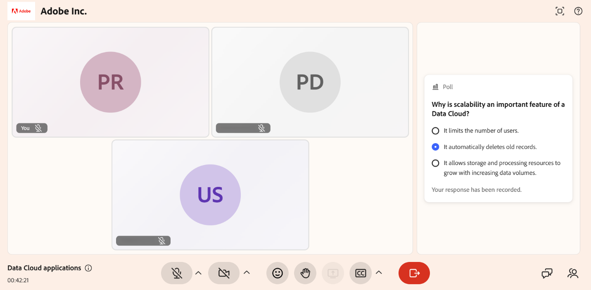

# Répondre à un sondage

En tant qu’élève, les sondages vous aident à participer activement à une session Live Hub. Lorsqu&#39;un instructeur lance un sondage, celui-ci apparaît dans le panneau **Sondages et questionnaires**, où vous pouvez soumettre votre réponse en sélectionnant une ou plusieurs options ou en saisissant une réponse textuelle courte, selon le type de sondage. Vous pouvez mettre à jour votre réponse pendant que le sondage reste ouvert. Si l’instructeur partage les résultats, vous pouvez afficher les résultats du sondage en temps réel. Cet article explique comment répondre aux sondages et afficher les résultats partagés au cours d’une session.

## Envoyer votre réponse

Lorsqu’un instructeur lance un sondage au cours d’une session, celui-ci s’affiche sur votre écran. Pour répondre à un sondage, effectuez l’une des opérations suivantes en fonction du type de sondage :

1. **Sondage à choix multiples ou à réponses multiples** : sélectionnez la ou les options de réponse applicables.

1. **Sondage à réponse courte** : saisissez votre réponse dans le champ de texte.

Après l&#39;envoi, le message **Votre réponse a été enregistrée** s&#39;affiche.

*Après avoir envoyé une réponse à un sondage, le message Votre réponse a été enregistrée apparaît.*

## Mettre à jour votre réponse

Vous pouvez modifier votre réponse pendant que le sondage est toujours en ligne. Le sondage reste sur votre écran.

Pour mettre à jour votre réponse, sélectionnez une autre option de réponse ou modifiez votre réponse textuelle. Votre sélection mise à jour est enregistrée automatiquement.
