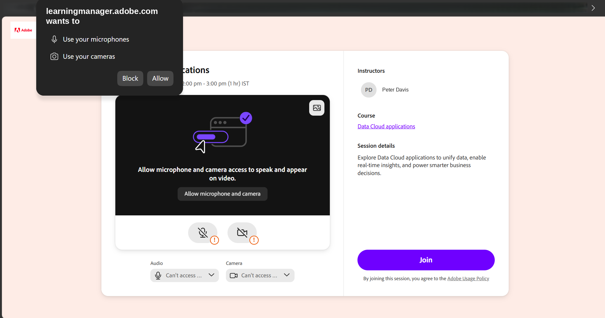
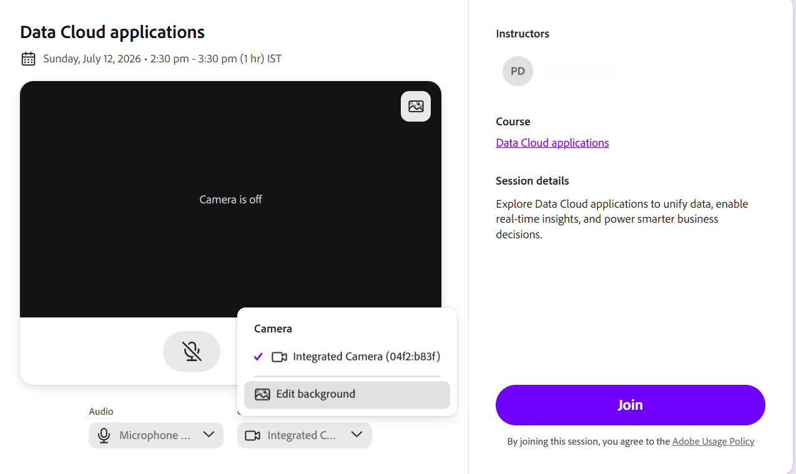

# Configuration de l’écran de pré-jointure

Une session Live Hub dans Adobe Learning Manager est une formation en direct, dirigée par un instructeur, à laquelle les instructeurs et les élèves participent ensemble dans une salle de classe virtuelle. Au cours d&#39;une séance, les participants peuvent discuter, discuter, répondre aux sondages et aux questionnaires, collaborer sur un tableau blanc et participer à des ateliers pour des discussions en petits groupes.

Cet article explique comment une session fonctionne du début à la fin et passe en revue la configuration partagée qui s’applique à tout le monde, quel que soit le rôle.

## Ce que vous verrez sur l’écran de pré-jointure

L’écran de pré-inscription est l’endroit où l’instructeur et l’élève atterrissent avant d’entrer dans la salle de classe. Il affiche les détails de la session et vous fournit les commandes audio et de caméra afin que vous puissiez vérifier tout ce qui fonctionne en premier. Lorsque l’écran se charge, un indicateur de chargement bref peut apparaître pendant la récupération des informations de session. Vous pouvez consulter le titre de la session ou le nom du module, l’instructeur, le cours et la description de la session.

### Autoriser les autorisations du navigateur

La première fois que vous rejoignez une session à partir d’un nouveau navigateur ou appareil, celui-ci vous invite à accorder l’accès à votre microphone et à votre caméra. Cette invite s’affiche avant le chargement de l’aperçu audio et vidéo de pré-jointure. Tant que vous n&#39;autorisez pas l&#39;accès, les commandes audio et de caméra peuvent afficher **Impossible d&#39;accéder au microphone** ou **Impossible d&#39;accéder à la caméra**.

Lorsque votre navigateur vous y invite, sélectionnez **Autoriser** pour activer l&#39;accès à votre microphone et à votre caméra. Une fois l’autorisation accordée, vous pouvez prévisualiser et configurer vos paramètres audio et vidéo avant de rejoindre la session.

*Sélectionnez Autoriser lorsque votre navigateur vous invite à accéder au microphone et à la caméra.*

### Configuration des commandes audio

Votre microphone et votre haut-parleur sont sélectionnés automatiquement. Utilisez la commande audio de l’écran de pré-jointure pour confirmer leur bon fonctionnement ou passez à un autre appareil.

Pour tester le microphone et le haut-parleur :

1. Sélectionnez le **microphone** à partir de l&#39;écran de pré-jointure. La liste déroulante **Microphone** s&#39;affiche.

   
   *Sélectionnez le menu déroulant Microphone pour changer d’appareil ou testez votre microphone et votre haut-parleur.*

1. (Facultatif) Sélectionnez **Tester le microphone** pour vérifier que votre microphone fonctionne.

1. (Facultatif) Sélectionnez **Tester l&#39;enceinte** pour vérifier la sortie de l&#39;enceinte.

### Modification de l’arrière-plan de l’appareil photo

Utilisez le menu **Caméra** dans l&#39;écran de pré-jointure pour appliquer un arrière-plan virtuel.

Pour modifier l’arrière-plan :

1. Sélectionnez la liste déroulante **Caméra**. La liste déroulante **Caméra** s&#39;affiche.

   
   *Sélectionnez la liste déroulante Caméra, puis sélectionnez Modifier l’arrière-plan pour choisir un arrière-plan virtuel.*

1. Sélectionnez **Modifier l&#39;arrière-plan** et choisissez un arrière-plan virtuel. L’aperçu est immédiatement mis à jour.
