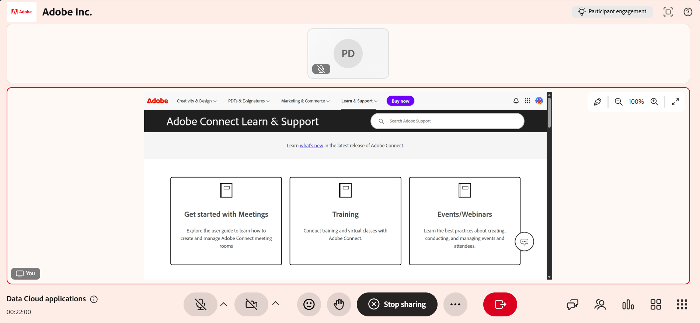
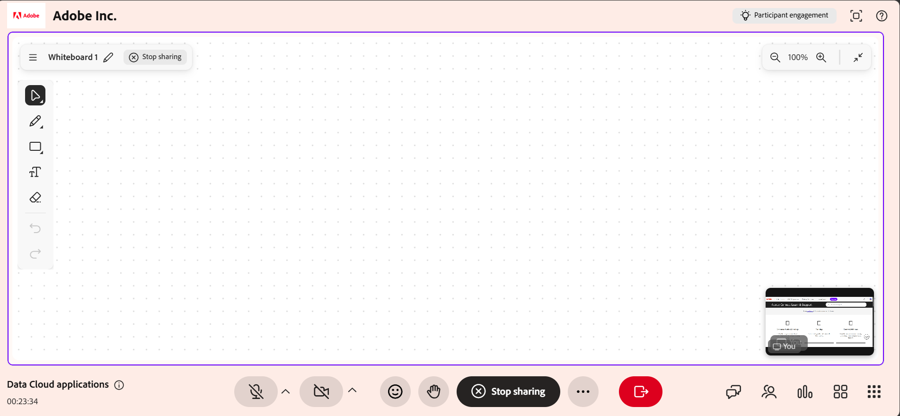

# Partager votre écran en tant qu’instructeur

Le partage d’écran vous permet de présenter du contenu de votre appareil aux participants pendant une session Live Hub. Partagez un onglet de navigateur, une fenêtre d’application ou l’ensemble de votre écran pour présenter des workflows, des présentations et guider les élèves dans les tâches en temps réel.

Vous pouvez améliorer les présentations en affichant jusqu’à deux contenus côte à côte en mode Fractionner, en utilisant un tableau blanc à côté du contenu partagé et en annotant directement à l’écran pour mettre en valeur les informations clés. Vous pouvez également permettre aux élèves de partager leurs écrans tout en gardant le contrôle sur la session.

Cet article explique comment partager votre écran, annoter du contenu, utiliser le mode Fractionner et gérer le partage d’écran des élèves dans Live Hub.

## Partage de votre écran dans une session

Vous pouvez commencer le partage d’écran au cours d’une session pour présenter le contenu à tous les participants en temps réel. Cela vous permet de faire la démonstration d’applications, de parcourir des workflows ou de livrer des présentations directement à partir de votre appareil.

Procédez comme suit pour partager votre écran :

1. Sélectionnez  dans la barre de contrôle. Une fenêtre contextuelle s’affiche.

1. Sélectionnez l’une des options suivantes :

   1. **Onglet Chrome** : partagez un onglet de navigateur.

   1. **Fenêtre** : partagez une application spécifique.

   1. **Écran entier** : partagez votre plein écran.

   Option 
   *La fenêtre contextuelle de partage d’écran affiche plusieurs options de partage de votre écran.*

1. (Facultatif) Activez **Partager également l&#39;audio de l&#39;onglet** pour inclure l&#39;audio de l&#39;onglet partagé.

1. Sélectionnez le contenu à partager.

1. Sélectionnez **Partager**. Le contenu sélectionné est affiché pour tous les élèves.

Vous pouvez partager jusqu’à deux contenus au cours d’une session. Lorsque du contenu supplémentaire est partagé, la mise en page s’ajuste automatiquement pour les afficher ensemble.

### Arrêter le partage d’écran

Pour arrêter le partage de votre écran, sélectionnez **Arrêter le partage** à partir de l&#39;interface d&#39;écran partagé.

*La barre de contrôle affiche l’option permettant d’arrêter le partage d’écran.*

Le partage d’écran dans la session se termine et le contenu partagé est supprimé de l’interface de la salle.

## Partage de plusieurs contenus dans une session

La salle de classe virtuelle prend en charge le mode Fractionner lorsque plusieurs types de contenu sont partagés au cours d’une session. Cela permet aux instructeurs de présenter plusieurs types de contenu en même temps, tels qu’un partage d’écran, un tableau blanc ou un panneau d’engagement.

### Fonctionnement du mode fractionnement

Lorsque plusieurs contenus sont actifs :

* Deux contenus au maximum peuvent être affichés à la fois.

* Un contenu apparaît sur la zone principale de la scène.

* L’autre contenu apparaît dans une vue secondaire.

* Lorsque du nouveau contenu est partagé, le contenu existant peut passer à la vue secondaire.

>[!NOTE]
>
> Les panneaux d’engagement, tels que les sondages, sont prioritaires et apparaissent en premier dans la vue fractionnée.

### Basculer vers une vue unique

Lorsque plusieurs contenus sont affichés, les instructeurs peuvent se concentrer sur un seul contenu.

Pour passer à une vue unique :

1. Sélectionnez le contenu que vous souhaitez mettre en avant.

1. Choisissez **Agrandir**. Le contenu sélectionné apparaît sur la scène principale, tandis que le contenu restant passe dans une vue secondaire.

## Utilisation du partage d’écran avec un tableau blanc

Vous pouvez exécuter le partage d’écran avec un tableau blanc au cours d’une session pour présenter du contenu tout en ajoutant des explications ou des annotations.

Lorsqu’un tableau blanc est partagé pendant un partage d’écran actif ou lorsque le partage d’écran commence alors qu’un tableau blanc est déjà actif, la session passe automatiquement en mode Fractionner.

Pour utiliser le partage d’écran avec un tableau blanc :

1. Partagez votre écran.

1. Sélectionnez l’icône Tableau blanc dans la barre de contrôle.

1. Sélectionnez **Partager le tableau blanc**. Les deux contenus s’affichent en mode Fractionner.

   
   *L&#39;interface Live Hub affiche une vue fractionnée avec le tableau blanc à gauche et le contenu partagé à droite.*

Pour basculer entre le tableau blanc et l’écran partagé :

1. Sélectionnez le contenu à afficher.

1. Sélectionnez **Agrandir**. Le contenu sélectionné passe à la scène principale. L’autre contenu passe dans une vue secondaire.

   
   *L&#39;interface Live Hub affiche une vue divisée avec le tableau blanc agrandi et le contenu partagé en bas de l&#39;interface.*

## Annoter du contenu partagé

Vous pouvez annoter du contenu partagé au cours d’une session pour mettre en évidence des informations importantes, expliquer des concepts ou guider visuellement les élèves. Les annotations sont appliquées à un instantané de l’écran partagé. Ils sont conçus pour des explications en temps réel et offrent une expérience ciblée et sans distraction.

Lors du partage de votre écran, sélectionnez l’icône d’annotation (stylet) dans le coin supérieur droit de l’interface de partage d’écran. Les outils d’annotation apparaissent automatiquement dans l’interface de partage d’écran.

### Utilisation des outils d’annotation

Une barre d&#39;outils d&#39;annotation apparaît lorsque vous commencez à annoter.

*Interface Live Hub affichant la barre d&#39;outils d&#39;annotation pour interagir avec le contenu partagé.*

La barre d&#39;outils d&#39;annotation fournit les options suivantes :

| **Outil** | **Description** |
|----|----|
| **Sélectionner** | Gérer les annotations existantes. Vous pouvez déplacer, redimensionner, dupliquer ou supprimer des éléments d&#39;annotation. |
| **Dessiner** | Créez des dessins à main levée. Vous pouvez régler le thickness et la couleur du contour. |
| **Formes** | Ajoutez des formes structurées telles que des rectangles ou des cercles. Vous pouvez personnaliser les propriétés de contour et de fond. |
| **Texte** | Ajoutez des libellés ou des explications. Vous pouvez formater le texte et ajuster sa position. |
| **Gomme** | Supprimer les annotations de l’écran. Vous pouvez effacer des éléments individuels ou effacer toutes les annotations. |
| **Arrêter l&#39;annotation** | Quitter le mode d’annotation et reprendre le partage d’écran. Toutes les annotations sont supprimées. |
| **Annuler** | Inverse l’action la plus récente. |
| **Rétablir** | Réappliquez l’action précédemment annulée. |

## Autoriser les participants à partager leur écran

Vous pouvez autoriser les participants à partager leur écran au cours d’une session. Cela leur permet de présenter du contenu, de démontrer des workflows ou de prendre en charge les discussions.

Lorsque le partage d’écran est activé pour les élèves :

* Les élèves peuvent démarrer le partage d’écran à partir des commandes de session.

* Un seul partage d’écran peut être actif à la fois.

* Les instructeurs conservent un contrôle total sur le partage d’écran pendant la session.
