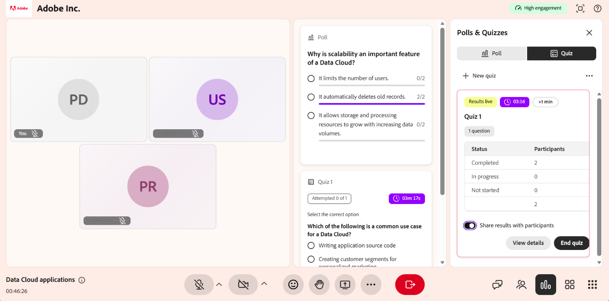

# Suivi de l’engagement des participants

L’engagement des participants dans le hub en direct donne aux instructeurs une vue en temps réel de l’engagement des élèves pendant une session en direct. Il combine la mise au point du navigateur, l’activité de chat et la participation aux sondages dans un seul niveau d’engagement, affiché sous la forme d’un indicateur vert, jaune ou rouge. Utilisez-le pour repérer les trempettes et ajuster votre livraison en temps réel.

L’engagement du participant affiche le niveau d’engagement moyen de tous les élèves dans la salle principale à un moment donné. Le niveau est actualisé dès qu’un élève rejoint la session.

L’engagement du participant est calculé et affiché uniquement pendant une session en direct.

>[!NOTE]
>
> Seuls les instructeurs peuvent voir l’indicateur d’engagement. Les élèves n&#39;y ont pas accès.

## Comprendre les calculs du niveau d’engagement

Vous pouvez afficher le niveau d’engagement en haut à droite de l’interface de la session Live Hub. Il s’affiche comme un indicateur en temps réel de la participation des élèves.

*L’interface Live Hub affiche l’engagement du participant dans le coin supérieur droit.*

Le système calcule le niveau d’engagement à l’aide des trois facteurs suivants :

* **Focus du navigateur** : indique si l’onglet ou la fenêtre de la salle de classe virtuelle est actif sur l’écran de l’élève.

* **Activité de conversation** : participation de l&#39;élève par le biais de messages dans la conversation de session.

* **Participation aux sondages** : réponses envoyées aux sondages pendant la session.

## Identification des niveaux d’engagement et des indicateurs

L’engagement des participants utilise des indicateurs codés par couleur en fonction des interactions de l’élève. Voici ce que signifie chaque niveau :

| **Niveau d&#39;engagement** | **Indicateur de couleur** | **Description** |
|----|----|----|
| Elevé | Vert | Les élèves participent activement à la session. |
| Moyen | Jaune | Les élèves montrent des interactions occasionnelles avec une participation modérée. |
| Faible | Rouge | Les élèves montrent peu ou pas d&#39;interaction ou une mise au point réduite pendant la session. |
