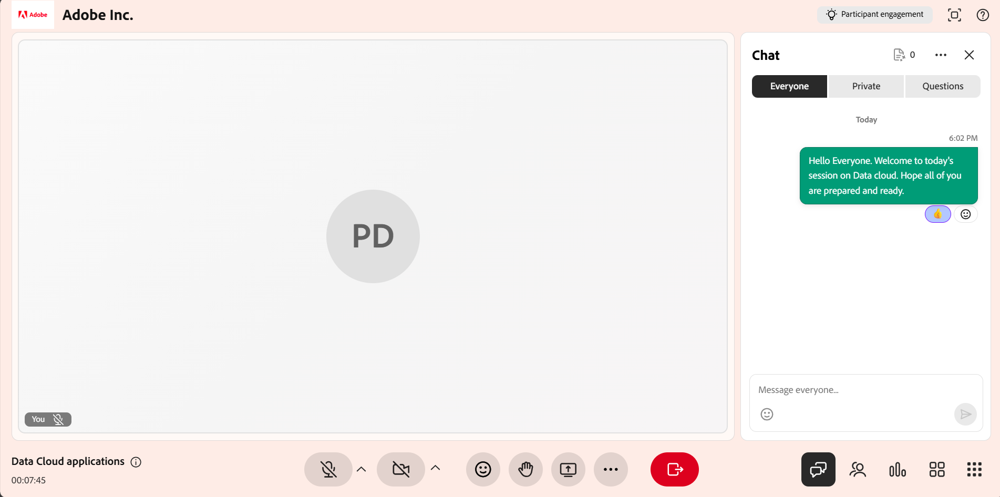
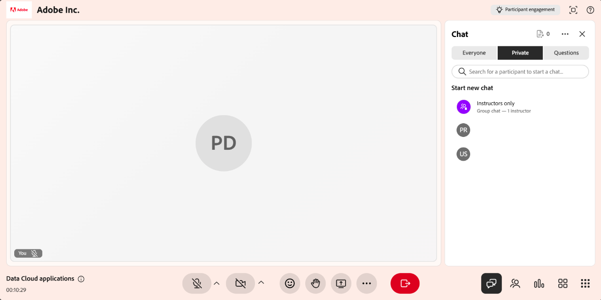
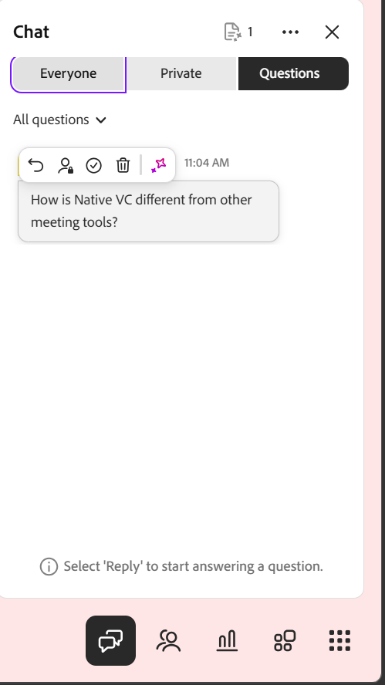
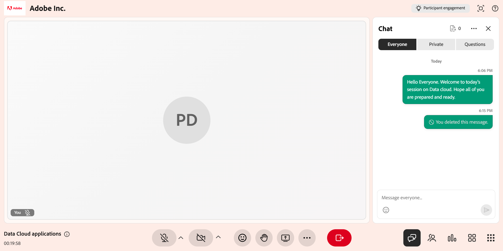

# Utilisation du panneau Conversation en tant qu’instructeur

En tant qu’instructeur, le panneau Conversation est votre point central pour gérer la communication pendant une session Live Hub. À partir d&#39;un seul panneau, vous pouvez suivre la discussion publique, tenir des conversations privées et examiner les questions que l&#39;IA détecte à partir du chat. Vous pouvez également modérer la conversation et répondre avec l&#39;aide de l&#39;IA.

Cet article présente les actions disponibles pour les instructeurs dans le panneau Conversation, de l’accès au panneau à la gestion des messages et des paramètres.

## Accès au panneau Conversation

Utilisez le panneau Conversation pour gérer les conversations, répondre aux élèves et surveiller les questions pendant une session. Le panel permet d’accéder à des discussions publiques, privées et basées sur des questions en un seul endroit.

Procédez comme suit pour accéder au panneau Conversation :

1. Rejoignez la session Live Hub.

1. Sélectionnez  dans la barre de contrôle. Le panneau Conversation s&#39;ouvre avec l&#39;onglet **Tout le monde** sélectionné par défaut, ce qui vous permet de démarrer ou de participer à une conversation en cours.

1. Sélectionnez l’une des options suivantes selon vos besoins :

   1. Tout le monde

   1. Privé

   1. Questions

   
   *Le panneau Conversation s&#39;ouvre sur l&#39;onglet Tout le monde, où vous pouvez suivre la conversation publique et passer aux onglets Privé et Questions.*

1. Saisissez votre message et sélectionnez **Envoyer**.

## Paramètres du panneau Conversation

Le panneau Conversation fournit des options pour gérer les conversations et personnaliser votre expérience de conversation au cours d’une session. Vous pouvez effacer des messages, contrôler les notifications et ajuster la taille du texte selon vos besoins.

*Menu des paramètres du panneau Conversation.*

Les options suivantes sont disponibles dans les paramètres du panneau de conversation :

| **Option** | **Description** |
|----|----|
| **Effacer toutes les conversations** | Supprime tous les messages du panneau de conversation. |
| **Désactiver les notifications de conversation** | Désactive les notifications de conversation pour la session. |
| **Taille du texte** | Ajuste la taille des messages de conversation pour une meilleure lisibilité. Les options disponibles sont **Petit**, **Moyen** et **Grand**. |

## Répondre aux messages de chat

La fonction de réponse vous permet de répondre directement à un message spécifique, ce qui vous aide à conserver le contexte pendant les discussions et à faciliter le suivi des conversations.

Pour répondre à un message dans la conversation :

1. Passez la souris sur le message auquel vous souhaitez répondre.

1. Sélectionnez **Répondre**.

   
   *Sélectionnez Répondre à un message pour y répondre directement et garder la conversation en contexte.*

1. Saisissez votre réponse dans le champ de saisie du message.

1. Sélectionnez **Envoyer**.

La réponse affiche un extrait du message d’origine en plus de votre réponse, ce qui aide les participants à comprendre le contexte de la conversation.

### Réagir à un message

Vous pouvez également réagir aux messages pour accuser réception ou répondre rapidement sans taper de réponse. Survolez un message et sélectionnez une réaction. La réaction sélectionnée apparaît sous le message et est visible par les autres participants à la conversation.

*Une réaction apparaît sous le message et est visible par tout le monde dans la conversation.*

## Modifier les messages de conversation

La fonctionnalité Modifier le message vous permet de mettre à jour un message après l’avoir envoyé, ce qui vous aide à corriger ou à affiner votre réponse.

Pour modifier un message dans la conversation :

1. Passez la souris sur le message que vous souhaitez modifier.

1. Sélectionnez **Modifier**.

   
   *Sélectionnez Modifier pour mettre à jour un message que vous avez déjà envoyé.*

1. Mettez à jour le message dans le champ de saisie.

1. Sélectionnez **Enregistrer** pour appliquer les modifications ou **Annuler** pour les ignorer.

Le message mis à jour remplace le message d&#39;origine dans la conversation et est marqué comme **Modifié**.

## Mentionner les participants dans les messages de chat

La fonction de balisage du panneau Conversation vous permet de vous adresser directement à un élève spécifique au cours d’une session. L’utilisation de balises attire l’attention sur votre message et améliore la visibilité de l’élève que vous mentionnez, en particulier pendant les discussions actives.

Pour mentionner un élève dans la conversation :

1. Dans le champ de saisie de message, saisissez **@**.

1. Sélectionnez le nom du participant dans la liste.

   
   *Tapez @ pour remplir la liste des participants et sélectionner le nom dans la liste.*

1. Saisissez votre message.

1. Sélectionnez **Envoyer**.

L’élève balisé reçoit une notification et son nom est mis en surbrillance dans le message pour une meilleure visibilité.

## Démarrer une conversation privée

L&#39;onglet **Privé** du panneau de conversation vous permet d&#39;avoir des messages privés sans interrompre la discussion publique. Vous pouvez commencer une nouvelle conversation, poursuivre des conversations existantes ou communiquer avec des élèves spécifiques.

Pour démarrer une conversation privée :

1. Sélectionnez l&#39;onglet **Privé**. Une liste des participants s’affiche.

   
   *L’onglet Privé répertorie les participants afin que vous puissiez envoyer un message aux instructeurs uniquement ou à un élève individuel.*

1. Vous pouvez effectuer les opérations suivantes :

   1. Sélectionnez **Instructeurs uniquement** en haut de la liste pour envoyer des messages à d&#39;autres instructeurs. Les messages sont visibles uniquement par les instructeurs.

   1. Sélectionnez un élève pour démarrer une conversation privée.

1. Saisissez votre message et sélectionnez **Envoyer**. Les messages ne sont visibles que par vous et le participant sélectionné.

### Désactiver la conversation privée pour les élèves

Par défaut, les élèves peuvent discuter en privé avec d’autres participants. En tant qu’instructeur, vous pouvez contrôler si les élèves peuvent utiliser la conversation privée pendant une session.

Pour désactiver la conversation privée pour les élèves :

1. Ouvrez **Paramètres de la salle**.

1. Sélectionnez **Autorisations des participants**.

   
   *Désactivez Envoyer des messages privés dans les autorisations des participants pour empêcher les élèves de discuter en privé.*

1. Désactivez **Envoyer des messages privés**.

1. Sélectionnez **Terminé**.

Une fois désactivés, les élèves ne pourront plus démarrer ni participer à des conversations privées.

## Brouillon de réponses aux questions des participants avec l’IA

L’onglet **Questions** permet aux instructeurs de gérer et de répondre aux questions des élèves plus efficacement. L&#39;IA détecte automatiquement les questions du chat et fournit des réponses suggérées pour aider les instructeurs pendant la session.

Pour générer une réponse assistée par l’IA :

1. Accédez à l&#39;onglet **Questions**.

1. Survolez la question détectée.

1. Sélectionnez **Brouillon de réponse à l&#39;aide d&#39;AI**.

   
   *Sélectionnez Brouillon de réponse à l&#39;aide de l&#39;IA pour générer une suggestion de réponse à une question détectée.*

1. (Facultatif) Vérifiez et modifiez la réponse suggérée.

1. Sélectionnez **Envoyer**.

La réponse générée par l’IA est ajoutée à la conversation et peut être modifiée avant l’envoi pour en assurer l’exactitude et la pertinence.

>[!NOTE]
>Si la question n’est pas couverte par le contenu de référence chargé, l’assistant IA peut indiquer un message d’erreur au lieu de générer une réponse. Voir [Guide de dépannage pour Live Hub](../kb/troubleshooting-guide-for-live-hub.md#answer-generation-toast-issues) pour plus de détails.

### Chargement de fichiers pour de meilleures réponses

Vous pouvez également charger des fichiers de référence pour améliorer la précision et la pertinence des réponses générées par l&#39;IA.

Pour charger un fichier :

1. Accédez au coin supérieur droit du panneau Conversation.

   
   *Ouvrez Charger des références de contenu pour ajouter des fichiers qui aident l&#39;IA à générer des réponses plus précises.*

1. Sélectionnez **Charger des références de contenu**. Une fenêtre contextuelle de **contenu de référence QnA** s&#39;affiche.

1. Sélectionnez **Parcourir les fichiers**.

   
   *Sélectionnez Parcourir les fichiers dans la fenêtre de contenu de référence QnA pour télécharger un fichier de référence à partir de votre système.*

1. Chargez le fichier depuis votre système.

L&#39;IA utilise le contenu chargé pour générer des réponses plus précises et pertinentes aux questions dans l&#39;onglet **Tout le monde**.

>[!NOTE]
>Si le téléchargement échoue ou si le fichier est rejeté, consultez le [Guide de dépannage pour Live Hub](../kb/troubleshooting-guide-for-live-hub.md#upload-content-issues) pour obtenir une liste des messages d&#39;erreur courants et savoir comment les résoudre.

## Supprimer les messages

L&#39;option Supprimer le message vous permet de supprimer des messages de la conversation pour que les discussions restent ciblées et pertinentes. Vous pouvez supprimer vos propres messages qui ne sont pas pertinents pour le sujet ou qui perturbent la discussion.

*Supprimez vos propres messages pour que la discussion reste ciblée et pertinente.*
