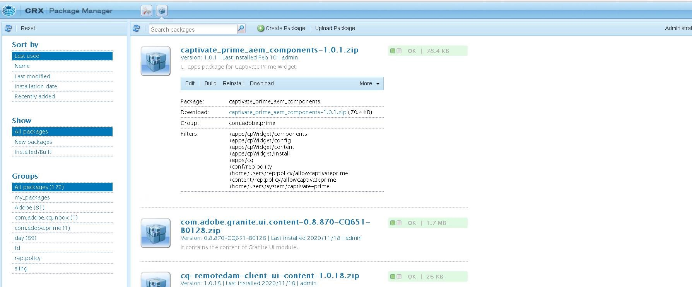
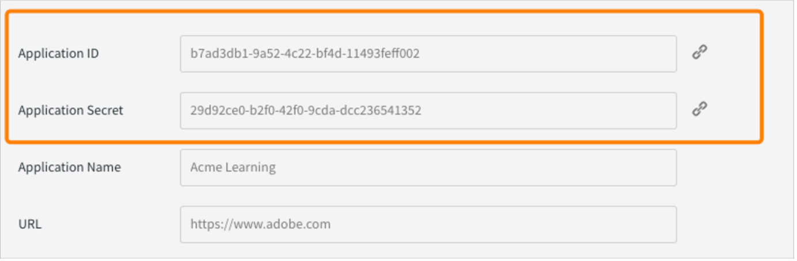
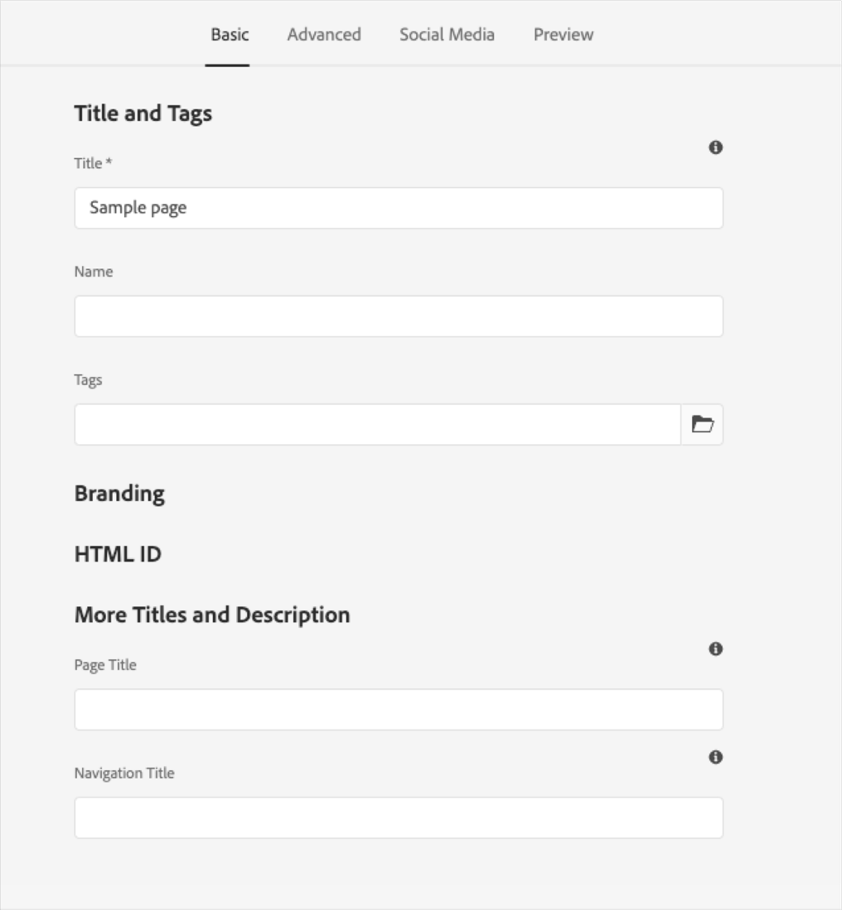
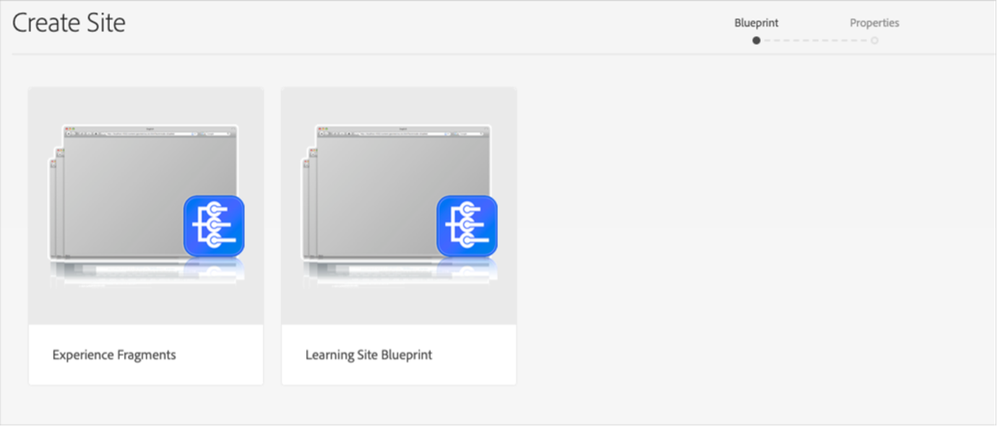
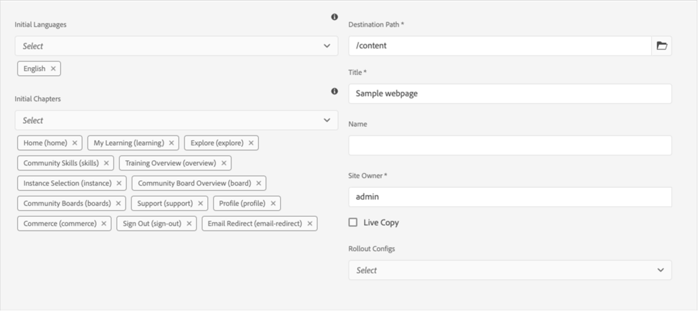

# Intégration de Adobe Learning Manager à AEM

Adobe Learning Manager (ALM) s’intègre aux sites Adobe Experience Manager (AEM). Cela vous permet de créer votre propre site web et des interfaces mobiles réactives pour Adobe Learning Manager avec un minimum d’effort de codage. Grâce à cette intégration, vous pouvez créer des expériences d&#39;apprentissage personnalisées pour vos utilisateurs.

Pour créer une telle expérience, ALM fournit un package de site de référence Adobe Learning Manager (package de site de référence ALM) pour AEM Sites sous la forme d’un fichier ZIP que vous pouvez installer sur votre instance AEM Sites.

Le pack comprend des modèles de page web et des composants de site web AEM Sites, ainsi que des widgets incorporables. Par exemple, Catalogue d’apprentissage, Calendrier, Conformité, Catégories, Cours et parcours, etc.

Après avoir installé le package du site de référence ALM, vous pouvez commencer à créer un site Web pour Adobe Learning Manager que vous pouvez héberger sur votre instance AEM Sites. Vos utilisateurs peuvent ensuite faire glisser et déposer les composants sur le site Web.

>[!IMPORTANT]
>
>Les packs Adobe Learning Manager (ALM) pour AEM Sites fournissent un bloc de code de démarrage rapide pour la mise en œuvre. Ce pack est conçu pour les déploiements sans interface utilisateur. Lors de la mise en œuvre de la base de code fournie, la maintenance continue et le développement ultérieur relèvent de la responsabilité de l’entité chargée de la mise en œuvre, comme c’est le cas habituellement pour les applications sans interface graphique basées sur Adobe Learning Manager.

## Installation du package de site de référence ALM

### Prérequis

* Licences pour AEM Sites et Adobe Commerce.
* AEM on-premise 6.5 ou Adobe Experience Manager - Cloud Service
* Adobe Commerce 2.4.3

Après avoir sécurisé votre environnement AEM Sites, vous devez installer le package du site de référence ALM. Ce package comprend des pages Web et des composants de site Web AEM qui aident à construire la plateforme d&#39;apprentissage.

Le package du site de référence est hébergé sur le [**référentiel GitHub**](https://github.com/adobe/adobe-learning-manager-reference-site/releases).

Pour plus d’informations, consultez la section LISEZ-MOI.

## Téléchargement du package de contenu {#downloadthecontentpackage}

Le programme d’installation est livré sous la forme d’un package de contenu AEM. [***Téléchargez le package***](https://github.com/adobe/adobe-learning-manager-reference-site).

Le package de contenu est disponible sous forme de fichier zip et est compatible avec AEM 6.4 et AEM 6.5.

## Installation du composant Learning Manager {#installcaptivateprimecomponent}

Installez le package de contenu Learning Manager à l’aide du Gestionnaire de packages AEM :

>[!NOTE]
>
>Pour plus d&#39;informations sur l&#39;installation des packs, voir [***Utilisation des packs***](https://experienceleague.adobe.com/docs/experience-manager-65/administering/contentmanagement/package-manager.html?lang=en#how-to-work-with-packages).

1. En tant qu’auteur AEM, ouvrez le Gestionnaire de packages AEM.
1. Cliquez sur le bouton **[!UICONTROL Charger le package]**.
1. Cliquez sur **[!UICONTROL Parcourir]** et chargez le package de contenu.
1. Cliquez sur **[!UICONTROL Charger]**.
1. Une fois le package chargé, installez le package de contenu en le sélectionnant et en cliquant sur **[!UICONTROL Installer]**.

   

   *Installer le package de contenu*

## Créer une application dans [!DNL Adobe Learning Manager]

Après avoir installé le package du site AEM, vous devez configurer une application ALM pour connecter votre portail d&#39;apprentissage au site AEM.

Ce scénario s&#39;applique lorsqu&#39;AEM est utilisé avec [!DNL Adobe Learning Manager].

Procédez comme suit :

1. En tant qu’administrateur d’intégration, cliquez sur **[!UICONTROL Applications]**.
1. Pour créer une nouvelle application, cliquez sur **[!UICONTROL Inscrire]** dans le coin supérieur droit de la page.
1. Dans l’écran Enregistrer une nouvelle application, entrez les informations suivantes :

   1. **Nom de l&#39;application :** nom de l&#39;application que vous créez.
   1. **URL :** URL de votre organisation.
   1. **Rediriger les domaines :** domaines d&#39;hébergement du site Web AEM. Vous pouvez également spécifier des caractères génériques.
   1. **Description :** description de l&#39;application.
   1. **Étendues :** sélectionnez Accès en lecture au rôle Élève et Accès en écriture au rôle Élève.
   1. **Pour ce compte uniquement ?:** Sélectionnez Oui si vous souhaitez utiliser l&#39;application pour le compte ALM existant.

1. Après avoir apporté les modifications, cliquez sur **Enregistrer**.

Notez les informations d’identification de l’application depuis l’écran.


*Informations d&#39;identification de l&#39;application*

Pour approuver l’application, cliquez sur **[!UICONTROL Approuver]**.

## Obtention des jetons

1. Dans l&#39;onglet Ressources pour les développeurs, cliquez sur **[!UICONTROL Jetons d&#39;accès pour le test et le développement]**.

   

   *Sélectionner des jetons d&#39;accès pour le test et le développement*

1. Saisissez les détails suivants :

   
   *Saisissez les détails du jeton*

   1. **Obtenir le code OAuth :** entrez l&#39;ID client de la section précédente et modifiez l&#39;étendue. Cliquez sur Envoyer pour obtenir le code Oauth.
   1. **Obtenir le jeton d&#39;actualisation :** Entrez l&#39;ID client et le secret de la section précédente. Saisissez également le code OAuth obtenu à l’étape précédente. Cliquez sur **Envoyer**.
   1. **Obtenir le jeton d&#39;accès :** Entrez l&#39;ID et le secret du client de la section précédente. Saisissez également le jeton d’actualisation obtenu à l’étape précédente. Cliquez sur **Envoyer**.
   1. **Obtenir les détails du jeton d&#39;accès :** entrez le jeton d&#39;accès que vous avez obtenu à l&#39;étape précédente. Cliquez sur **Envoyer**.

1. Vous pouvez obtenir les détails de la réponse JSON qui suit. La réponse comprend le jeton d’accès, le jeton d’actualisation, le rôle d’utilisateur, l’ID de compte, l’ID d’utilisateur et l’heure d’expiration. Notez le jeton d’actualisation, car vous le réutiliserez.

## Configuration d’un compte ALM dans AEM

1. Lancez votre instance AEM.
1. Cliquez sur **Paramètres** > **Cloud Service**.
1. Cliquez sur **Configuration Adobe Learning Manager**.

   
   *Sélectionner la configuration Adobe Learning Manager*

1. Cliquez sur **Créer** > **Dossier de configuration**. Nommez votre dossier.

   
   *Créer une configuration*

1. Dans le projet d’apprentissage, sélectionnez la configuration que vous avez créée.

1. Entrez les détails de la configuration.

   
   *Créer un dossier de configuration*

   1. **Mode Adobe Learning Manager :** Choisissez la façon dont vous souhaitez que l&#39;expérience d&#39;apprentissage soit disponible pour les élèves connectés et non connectés.
   2. **URL Adobe Learning Manager :** Entrez l&#39;URL de l&#39;instance ALM où les services d&#39;apprentissage sont hébergés.
   3. **ID de compte :** ID du compte ALM.
   4. **ID client, secret client et jeton d&#39;actualisation de l&#39;auteur :** Entrez les informations d&#39;identification obtenues lors de la création de l&#39;application dans ALM.
   5. **Personnalisation du widget :** Pour plus d&#39;informations, voir [Intégration à AEM](/help/migrated/integrate-aem-learning-manager.md) `.`

1. Enregistrez et fermez la configuration.

### AEM + Adobe Learning Manager (utilisateurs connectés/non connectés)

Adobe Learning Manager vous permet désormais de présenter vos produits et formations à vos clients et partenaires existants et potentiels, sans création de compte ni connexion. Cette fonctionnalité vous aidera à favoriser l’adoption des produits et des formations en fournissant aux élèves un aperçu rapide et facile des formations, ce qui permet de mettre en évidence et de promouvoir les fonctionnalités des produits. Par conséquent, vous pouvez présenter efficacement vos produits et offres, en particulier aux clients et partenaires potentiels, ce qui a pour effet d’accroître la sensibilisation aux produits. La facilité d’accès et l’accessibilité accrue suscitent un intérêt conséquent, ce qui contribue à stimuler les inscriptions à la formation et l’adoption de l’apprentissage.

À l’aide de ce workflow, un élève peut prévisualiser une formation, accéder aux informations sur la formation ou rechercher une formation sans se connecter à Adobe Learning Manager. Ce workflow ne s’applique pas à l’interface Learning Manager native (applicable UNIQUEMENT à AEM Sites et à d’autres interfaces sans tête).

**Configurer et activer le connecteur de plateforme d&#39;apprentissage**

Cette section souligne les étapes nécessaires pour configurer et activer le connecteur suivant :

**Accès aux données de formation**

Ce connecteur permet à votre interface utilisateur sans tête basée sur AEM Sites ou toute autre interface utilisateur personnalisée d’extraire et de restituer des informations de formation aux élèves et d’effectuer une recherche transparente des informations de formation avant ou après la connexion d’un élève.

Ce connecteur n’est requis que si vous utilisez des interfaces AEM Sites ou d’autres interfaces sans tête.

Le connecteur exporte des métadonnées de formation vers une solution de stockage et d&#39;extraction de données ainsi qu&#39;un système d&#39;activation de recherche. Par conséquent, vous pouvez configurer votre interface utilisateur sans tête basée sur AEM Sites ou toute autre interface utilisateur personnalisée pour utiliser ces deux services afin de récupérer les données de formation, de rendre des pages Web et de fournir aux élèves une fonctionnalité de recherche de formation optimisée. Par exemple, une interface AEM Sites non connectée peut utiliser les métadonnées exportées pour aider un élève à rechercher, parcourir et accéder aux pages de formation qui affichent des informations de formation.

Activez ce connecteur pour créer et générer le rendu de vos pages Web AEM Sites et offrir des expériences personnalisées à vos élèves avant et après la connexion. Activez ce connecteur pour créer et générer le rendu de vos pages Web AEM Sites et offrir des expériences personnalisées à vos élèves avant et après la connexion.

* **URL de base du réseau CDN Adobe Learning Manager :** Entrez l&#39;URL de base du chemin d&#39;accès du service CDN de récupération de données à partir de la page de connexion Accès aux données de formation.
* **Jeton d&#39;actualisation d&#39;administrateur :** entrez le jeton d&#39;actualisation que vous avez déterminé dans la section précédente.
* **URL de base des métadonnées de formation :** entrez l&#39;URL de base du chemin du service d&#39;activation de la recherche et de récupération des données de recherche à partir de la page de connexion Accès aux données de formation.
* **URL d&#39;inscription Adobe Learning Manager :** entrez l&#39;URL d&#39;inscription automatique générée par l&#39;administrateur d&#39;intégration pour le compte, qui est utilisée par les élèves pour s&#39;inscrire à la formation.

### AEM + Adobe Learning Manager + Adobe Commerce (utilisateurs connectés/non connectés)

Adobe Learning Manager fournit désormais des solutions pour vous aider à intégrer de manière transparente la plateforme d’apprentissage à Adobe Commerce. Cette version vous permet de connecter facilement vos interfaces de gestion de formation natives, basées sur des sites AEM ou d&#39;autres interfaces sans tête à Adobe Commerce. Cette intégration vous permet de tirer parti des fonctionnalités d&#39;e-commerce de votre plateforme d&#39;apprentissage. Vous pouvez désormais proposer des formations payantes à vos clients et partenaires commerciaux et faciliter l&#39;achat de formations sur des interfaces Learning Manager natives et non natives. Un élève peut également prévisualiser une formation, accéder aux informations sur la formation ou rechercher une formation sans se connecter à Adobe Learning Manager.

Un utilisateur peut utiliser l’application AEM déjà existante et l’approuver au lieu d’en créer une.

* **URL de base du réseau CDN Adobe Learning Manager :** Entrez l&#39;URL de base du chemin d&#39;accès du service CDN de récupération de données à partir de la page de connexion Adobe Commerce.
* **URL Adobe Commerce :** entrez l&#39;URL de l&#39;instance Adobe Commerce que vous utilisez.
* **Chemin du proxy GraphQL :** les composants Learning Manager côté client accèdent directement au point de terminaison Adobe Commerce GraphQL et une erreur CORS peut donc se produire. Pour éviter cette erreur, tous les appels doivent être servis à partir du même point de terminaison qu’AEM ou via un proxy qui ajoute des en-têtes CORS.
* **Nom de la boutique Adobe Commerce :** Entrez le nom de la boutique Adobe Commerce que vous avez déterminé dans la section précédente.
* **Durée de vie du jeton client Adobe Commerce (en secondes) :** entrez la durée de vie du jeton client indiquant la période prédéterminée pour une session de connexion.
* **Jeton d&#39;actualisation d&#39;administrateur :** entrez le jeton d&#39;actualisation que vous avez déterminé dans la section précédente.

## Personnalisation des pages Web

Personnalisez vos pages Web à l’aide du site de références AEM et des widgets disponibles.

1. Lancez votre instance AEM.
1. Cliquez sur **Sites** et ouvrez la page de configuration.
1. Cliquez sur **[!UICONTROL Site d&#39;apprentissage]** > **[!UICONTROL Maîtres linguistiques]** > **[!UICONTROL Anglais]**. Toutes les pages Web du projet sont incluses dans le dossier.

   
   *Afficher toutes les pages web*

1. Sélectionnez un modèle et cliquez sur **[!UICONTROL Modifier]**.

1. Sur la page, cliquez sur le bouton Paramètres du composant et modifiez les propriétés du composant.

   
   *Bouton Sélectionner les paramètres*

1. Affichez un aperçu des modifications ou publiez la page.

## Création de pages Web

Outre les modèles que vous pouvez utiliser et qui sont fournis par le package du site de référence, vous pouvez également créer des pages Web basées sur les modèles dans AEM.

1. Sur la page AEM principale, cliquez sur **Créer** > **Page**.

2. Choisissez le modèle que vous souhaitez personnaliser. Cliquez sur **Suivant**.

3. Saisissez les propriétés de la page.

   
   *Propriétés de page*

4. Pour créer la page, cliquez sur **[!UICONTROL Créer]**.

5. Sélectionnez la nouvelle page et cliquez sur **[!UICONTROL Modifier]**.

6. Ajoutez un composant à la page. Par exemple, **Widget Adobe Learning Manager**.

   
   *Filtrer par site*

7. Faites glisser et déposez le **widget Adobe Learning Manager** sur la page où vous souhaitez qu&#39;il réside.
8. Sélectionnez l’icône des paramètres. La fenêtre contextuelle **Propriétés** s&#39;ouvre.
9. Sélectionnez un widget dans le menu déroulant, saisissez un titre et une description, puis sélectionnez **Terminé**. Le widget sélectionné est ensuite ajouté à la page.

## widget Adobe Learning Manager

Le widget Adobe Learning Manager est disponible dans les versions 2.0.0 et ultérieures du groupe de composants **Apprentissage - Contenu**. Un seul composant héberge tous les widgets de page d’accueil d’ALM, sélectionnables à partir d’une liste déroulante dans la boîte de dialogue de création.

Avec l&#39;ajout du nouveau **widget Adobe Learning Manager**, vous pouvez créer des expériences sur AEM Sites qui sont à parité avec les pages Adobe Learning Manager natives : accueil, catalogue, présentation des objets d&#39;apprentissage et pages personnalisées créées avec des widgets tels que des catégories, des cours et des parcours.

**Widgets disponibles :**

* **Mon apprentissage** — Apprentissages actuellement inscrits
* **Tableau des scores** — Tableau des points de ludification
* **Calendrier** : sessions à venir et terminées, organisées par mois
* **Conformité** : cours avec des échéances en retard ou à venir
* **Apprentissage par les réseaux sociaux** — publications dans l&#39;apprentissage par les réseaux sociaux
* **Catégories** — Cartes pour catalogues, produits ou rôles
* **Cours et parcours** : listes sélectionnées, basées sur la source ou triées sur le volet
* **Signets** : cours enregistrés de l’élève
* **Recommendations d&#39;administration** — contenu défini par les administrateurs
* **Zones d&#39;intérêt, tendances et Recommendations de découverte** : piloté par les paramètres de recommandation au niveau du compte

### Fonctionnalités de création

* Les catalogues, produits, rôles et cours peuvent être sélectionnés à partir des listes déroulantes de recherche dans la boîte de dialogue.
* Les champs à sélection multiple prennent en charge jusqu’à 25 éléments avec un affichage par glisser-déplacer et basé sur les balises.
* La terminologie au niveau du compte (par exemple, les noms personnalisés pour le **catalogue** ou le **rôle**) est automatiquement reflétée dans les étiquettes de boîte de dialogue.

### Personnalisation des vignettes de cours

Les personnalisations des vignettes de cours effectuées dans l’application d’administration ALM (sous **Administrateur** > **Identité visuelle** > **Vignette de cours**) s’appliquent à chaque widget affichant des vignettes pour les cours, les parcours d’apprentissage, les certifications et les assistances à la tâche. Utilisez-le pour contrôler les détails (format, durée, compétence, évaluation, nom de l’auteur, description, état d’achèvement, etc.) qui sont affichés aux élèves sur les nouveaux widgets avec une configuration unique qui se propage partout dans votre académie d’apprentissage AEM Sites.

Pour personnaliser le widget Adobe Learning Manager, voir [Intégration à AEM](/help/migrated/integrate-aem-learning-manager.md).


## Créer un site à partir de Blueprint

Le package du site de référence ALM fournit un « Plan du site d’apprentissage », qui vous permet de créer un site Web pour votre plate-forme d’apprentissage. Les plans AEM vous permettent de créer des pages Web directement à partir de composants AEM Sites. Vous n’avez pas besoin d’utiliser de modèles.

1. Sur la page de démarrage AEM, cliquez sur **[!UICONTROL Sites]**.

1. Cliquez sur **[!UICONTROL Créer]** > **[!UICONTROL Site]**.

1. Cliquez sur **Plan du site d&#39;apprentissage**.

   

   *Créer un site à partir d&#39;un plan directeur*

1. Cliquez sur **Suivant**.

1. Sur la page des propriétés, saisissez les métadonnées de page. Cliquez sur **Créer**.

   
   *Sélectionner le plan du site d&#39;apprentissage*

1. Cliquez sur l&#39;hyperlien **Accueil** pour accéder à la page d&#39;accueil du site que vous avez créé. Sur cette page, vous pouvez personnaliser les widgets et les composants de catalogue.

## Programmation de votre site Web

En plus d’utiliser les modèles intégrés et de créer votre site Web à partir de zéro à l’aide des composants WYSIWYG, vous pouvez également écrire du code et créer le site.

Le code se trouve dans le [Référentiel GitHub du site de référence](https://github.com/adobe/adobe-learning-manager-reference-site) pour que vous puissiez commencer.

Les principales parties du modèle sont les suivantes :

* Offre groupée Java `core:` contenant toutes les fonctionnalités de base telles que les services OSGi, les écouteurs ou les planificateurs, ainsi que le code Java associé aux composants tels que les servlets ou les filtres de requête.
* `ui.apps:` contient les parties /apps (et /etc) du projet, c&#39;est-à-dire les clients JS&amp;CSS, les composants et les modèles.
* `ui.content:` contient un exemple de contenu à l&#39;aide des composants de l&#39;interface utilisateur.apps
* `ui.frontend:` contient des composants React.

### Personnalisation des widgets Adobe Learning Manager à l’aide du code

Le composant **Adobe Learning Manager Widget** effectue le rendu directement dans le DOM de page à l&#39;aide des composants React.

**Qu’est-ce que cela signifie pour votre projet ?**

* Le balisage de widget, les styles et la source React font partie du package AEM et sont accessibles à votre projet
* Remplacer le code CSS à l&#39;aide de votre propre clientlib sans toucher au package
* Pour les changements de comportement, le ré-étiquetage des boutons, la logique conditionnelle et la personnalisation de la sortie du composant, modifiez la source React dans le module ui.frontend et reconstruisez

### Classes CSS prédéfinies pour les widgets

Les classes CSS prédéfinies suivantes sont disponibles comme cibles pour le style au niveau du widget :

| Nom du widget | Conteneur CSS |
|------------|---------------|
| Calendrier | `alm-calendar-widget-container` |
| Catégorie | `alm-category-widget-container` |
| Cartes de catégorie | `alm-category-card-container` |
| Conformité | `alm-compliance-container` |
| Cours et parcours | `alm-course-path-widget-container` |
| Cartes LO Cours et parcours | `alm-training-card-v2-card` |
| Recommendations (tous) | `alm-course-path-widget-container` |
| Ludification | `alm-leaderboard-container` |
| Apprentissage par les réseaux sociaux | `alm-social-learning-container` |

Tout le code est dans le référentiel pour vous mettre en route.

## Importer et ajouter des composants du gestionnaire d&#39;apprentissage à une page Web ou un modèle existant

L’installation du package de site de référence AEM ajoute les composants Learning Manager à votre instance AEM Sites. Par défaut, vous pouvez ajouter ces composants au site d’apprentissage du projet Web (site Web) que nous fournissons prêts à l’emploi. Ces composants sont également disponibles dans le site Web que vous créez à partir de Learning Site Blueprint.

Toutefois, si vous souhaitez utiliser ces nouveaux composants Learning Manager dans votre projet Web ou site Web existant, vous devez les importer à l’aide de la procédure suivante.

1. Installez le package du site de référence ALM.

1. Ouvrez le projet Web et accédez au fichier HTML (pour la page Web ou le modèle Web auquel vous souhaitez ajouter les composants Learning Manager).
1. Ouvrez le fichier HTML et ajoutez les fragments de code ci-après au composant de page afin que le code s’exécute avant les composants d’apprentissage présents dans le rendu de page.

   *`<sly data-sly-use.configModel="com.adobe.learning.core.models.GlobalConfigurationModel"/>`*
   *`<meta name="cp-config" content="${configModel.config}" />`*

   Le code précédent ajoute la configuration mappée dans la balise meta de la page, ce qui est requis pour le rendu des composants d’apprentissage. Pour plus d&#39;informations, voir [Site de référence Adobe Learning Manager](https://github.com/adobe/adobe-learning-manager-reference-site/blob/master/ui.apps/src/main/content/jcr_root/apps/learning/components/page/customheaderlibs.html).

1. Assurez-vous d’avoir mappé la configuration avec le projet Web.
1. Ouvrez le modèle **AEM Sites** dans lequel importer les composants Learning Manager.
1. Dans l&#39;éditeur de page de modèle, accédez au conteneur **Composants autorisés** et sélectionnez **Stratégie**.
1. Dans la page **Stratégie**, accédez à **Propriétés** > **Composants autorisés** et sélectionnez les composants suivants « **Apprentissage - Contenu,** » « **Apprentissage - Formulaire** » et « **Apprentissage - Structure** »

La procédure suivante permet au modèle de remplir les dépendances de bibliothèque client des composants Learning Manager importés.

Les pages Web qui incluent ces composants doivent charger ces bibliothèques pour effectuer le rendu et utiliser les composants.

1. Dans l&#39;éditeur de page de modèle, cliquez sur **Informations sur la page**, puis sur **Stratégie de page**.
1. Dans la page **Stratégie**, accédez à **Propriétés** > **Bibliothèques clientes** et ajoutez-les à votre page de modèle :

   1. learning.site
   1. learning.ui
   1. learning.commerce

Après avoir enregistré ce modèle, vous pouvez ajouter les composants Learning Manager dans toutes les pages Web dérivées de ce modèle.

## Configuration du widget dans AEM {#configurethewidgetinaem}

Pour la configuration du widget, l’auteur AEM n’a besoin que du jeton d’actualisation fourni par l’administrateur de l’intégration de Learning Manager.

Vous pouvez également définir plusieurs configurations de compte dans plusieurs pages.

1. Cliquez sur **[!UICONTROL Outils]** > **[!UICONTROL Cloud Service]** > **[!UICONTROL Configuration du widget Learning Manager]**.
1. Cliquez sur **[!UICONTROL Créer]**.
1. Entrez ici le jeton d’actualisation. Configurez les autres paramètres.
1. Le nom d&#39;hôte doit être remplacé par **learningmanagereu** pour les régions de l&#39;UE.
1. Enregistrez et fermez la configuration.
1. Sélectionnez une configuration et publiez-la.

## Auteur AEM {#aemauthor}

L’auteur AEM doit d’abord ajouter le composant dans un modèle AEM

L’auteur AEM peut ensuite faire glisser et déposer le composant Adobe Learning Manager et le configurer correctement.

Le composant Learning Manager nécessite que la configuration créée à l&#39;étape ci-dessus soit mappée à la **page**.  L&#39;auteur peut mapper la configuration en modifiant les propriétés de la page sous **[!UICONTROL Avancé]** > **[!UICONTROL Configuration]** > **[!UICONTROL Configuration du cloud]** et fournir le chemin de configuration. De cette façon, l’auteur peut créer des configurations pour plusieurs comptes Learning Manager et les mapper à différentes pages Sites. Si une configuration n&#39;est pas mappée à la page, le composant lit la configuration de la page parent de manière récursive jusqu&#39;à ce qu&#39;il en trouve une.

## Un élève {#learner}

L’élève peut suivre les cours sur la page.

Pour pouvoir accéder au widget Learning Manager, l’élève doit être un utilisateur AEM connecté. En outre, la propriété **email** doit être présente dans le nœud « /profile » du nœud rep:User de l’élève. Cet e-mail doit être identique à celui indiqué dans le compte Learning Manager.

L’élève peut suivre les cours sur la page.

La progression du cours est également enregistrée.

Les widgets suivants sont fournis :

1. Ludification
1. Calendrier d’apprentissage
1. Widget social
1. Widget Catalogue
1. Mon apprentissage
1. Recommandation sur la base de l’apprentissage des pairs
1. Recommandations par l’administrateur
1. Recommandation sur la base des intérêts des élèves

S’il n’existe aucune recommandation, le widget est vide.

## Prise en charge de Skyline

Skyline est la version cloud d’AEM. Vous devez d’abord installer Skyline à partir du gestionnaire de package. Pour utiliser le composant Skyline dans AEM, un utilisateur doit être présent dans le compte Learning Manager. En d’autres termes, l’adresse électronique de l’utilisateur doit exister dans le compte.

### Déployer Skyline

Les étapes de configuration de Skyline sont mentionnées dans le [référentiel GitHub](https://github.com/adobe/captivate-prime-aem-components).

## Widget Mon apprentissage

Le widget **[!UICONTROL Mon apprentissage]** vous permet d&#39;afficher la formation à partir d&#39;un catalogue spécifique ou d&#39;un ensemble de catalogues pour un utilisateur.

Dans la section **[!UICONTROL Propriétés]** des propriétés de la page, sélectionnez **[!UICONTROL Catalogue]** dans les options répertoriées.

<!---->

Les options du catalogue contiennent les options suivantes :

* **[!UICONTROL ID de catalogue]:** ID de catalogue séparés par des virgules pour lesquels la formation doit être affichée.
* **[!UICONTROL Trier]:** ordre de tri pour la formation. Les options de tri suivantes sont disponibles :
   * name : trie les objets d&#39;apprentissage par ordre alphabétique de A à Z.
   * -name : Trie les objets d&#39;apprentissage par ordre alphabétique de Z à A.
   * date : trie par date par ordre croissant.
   * -date : trie par date dans l’ordre décroissant (au plus tard en premier).
   * dateCreated : trie par date de création de l&#39;objet d&#39;apprentissage (le plus ancien en premier).
   * -dateCreated : Trie par date de création (la plus récente en premier).
   * dateEnrolled : trie les données par date d’inscription de l’élève (au plus tôt).
   * -dateEnrolled : trie par date d’inscription (la plus récente en premier).
   * Évaluation : Trie les données par évaluation de l’élève (de la plus basse à la plus élevée).
   * -rating : Trie par notes (du plus haut au plus bas).
   * dueDate : Trie les données par date d&#39;échéance du cours (première échéance).
   * efficacité : trie par scores d&#39;efficacité en fonction des commentaires des élèves.
   * progression : trie par progression de l’élève (de la plus faible à la plus élevée).
* **[!UICONTROL État de l’élève]:** renvoie toutes les formations qui utilisent les éléments suivants en tant que filtres : inscrit, démarré, terminé et non inscrit. Les résultats de la recherche ne s’affichent pas si l’option de tri est dateEnrolled (date d’inscription), dueDate (date d’échéance) ou dateEnrolled.
* **[!UICONTROL Nom de la compétence]:** Compétence utilisée pour filtrer la formation exacte.
* **[!UICONTROL Nom de la balise]:** La balise utilisée pour filtrer les résultats exacts.

Voici quelques composants supplémentaires que vous pouvez personnaliser :

**[!UICONTROL Types d&#39;objets d&#39;apprentissage]:** Filtrer selon le type de l&#39;objet d&#39;apprentissage. Les types pris en charge sont : cours, certification, assistance à la tâche et programme d’apprentissage.

Dans AEM, le titre d’une carte dans une pellicule est initialement vide. Dans les propriétés, saisissez le nom du titre dans widgets.html.

**Personnalisation**

Vous pouvez personnaliser l’apparence de la disposition avec widgets.html. Vous pouvez changer l’apparence des cartes qui s’affichent et personnaliser le thème.

Dans la section **[!UICONTROL Paramètres généraux]**, vous pouvez choisir les couleurs primaire et secondaire pour les cartes et spécifier les propriétés pour personnaliser le thème.

```
{ 
 "globalCssText":"@import url('https://fonts.googleapis.com/css2?family=Grandstander:ital,wght@0,100;0,200;0,300;0,400;0,500;0,600;0,700;0,800;0,900;1,100;1,200;1,300;1,400;1,500;1,600;1,700;1,800;1,900&family=Montserrat:ital,wght@0,100;0,200;0,300;0,400;0,500;0,600;0,700;0,800;0,900;1,100;1,200;1,300;1,400;1,500;1,600;1,700;1,800;1,900&display=swap');", 
 "fontNames":"Grandstander", 
 "cardLayout":{ 
 "cardLayoutName":"compact", 
 "cardPrimaryColor":"#376BA4", 
 "cardSecondaryColor":"#F98EB0", 
 "startedStateTextColor":"#ffffff", 
 "continueStateTextColor":"#ffffff", 
 "revisitStateTextColor":"#ffffff", 
 "startedStateColor":"#a0a0a0", 
 "continueStateColor":"#f9a122", 
 "revisitedStateColor":"#7fbc64", 
 "textPrimaryColor":"#ffffff", 
 "textSecondaryColor":"#d93f3f", 
 "navIconColor":"#a0a0a0" 
 } 
}
```

### Configuration des widgets de cours enregistrés dans les sites AEM

Le widget Mes cours enregistrés permet aux élèves d’afficher leurs cours enregistrés ou marqués d’un signet directement sur leurs pages d’apprentissage, ce qui facilite l’accès aux cours qu’ils souhaitent consulter ou terminer ultérieurement.

Pour configurer le widget **Mes cours enregistrés** dans AEM Sites :

1. Lancez **AEM Sites**.
2. Ouvrez la page en mode **[!UICONTROL Modifier]**.
3. Accédez à l&#39;**[!UICONTROL Explorateur de composants]** et ajoutez **[!UICONTROL widget Mon apprentissage]** à la page.
4. Sélectionnez le composant, puis sélectionnez **[!UICONTROL Configurer]**.
5. Sélectionnez **[!UICONTROL Mes cours enregistrés]** dans le menu déroulant des **[!UICONTROL Propriétés]**.
6. Sélectionnez **[!UICONTROL Terminé]**, puis actualisez la page en mode **[!UICONTROL Aperçu]** ou **[!UICONTROL Publish]**.

Les élèves peuvent afficher leurs cours enregistrés dans la bande **[!UICONTROL Enregistrés par moi]** sur la page d&#39;accueil de l&#39;élève. En sélectionnant la bande **[!UICONTROL Enregistré par moi]**, les élèves accèdent à la page du catalogue et affichent le nombre exact de cours marqués d&#39;un signet.

Lorsque vous appliquez un autre filtre dans le **catalogue**, seuls les résultats correspondant à ce filtre s&#39;affichent. Les éléments marqués d&#39;un signet ne sont pas inclus automatiquement.

### Ignorer l’inscription LO de niveau supérieur

Si la case **Ignorer l’inscription LO de niveau supérieur** est activée et qu’un utilisateur est inscrit directement dans un programme d’apprentissage ou une certification, les cours de cette certification ou de ce programme d’apprentissage s’affichent pour l’utilisateur dans les widgets.

Si la case à cocher est désactivée, les cours présents dans le programme d’apprentissage ou la certification où l’utilisateur n’est pas inscrit directement ne s’affichent pas.


*Cochez la case Ignorer l’inscription LO de niveau supérieur.

Le paramètre est alors appliqué au widget.

### Protection

Les champs **Client ID** et **Client Secret** sont ajoutés. En outre, le jeton d’actualisation est masqué. Après qu’un utilisateur a créé la configuration entière, s’il ouvre à nouveau la configuration pour la modifier ou si un autre utilisateur ouvre cette configuration, le jeton d’actualisation est masqué.
