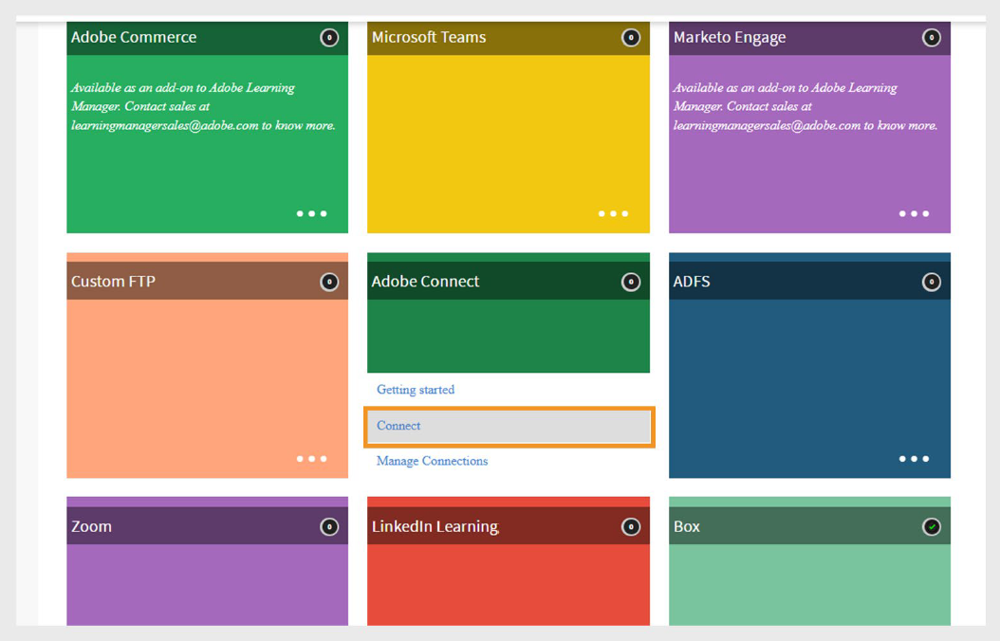

# Connecteur Adobe Connect dans Adobe Learning Manager

## Introduction

Adobe Learning Manager s’intègre à Adobe Connect pour vous aider à fournir et à gérer des formations en classe virtuelle. Grâce à cette intégration, vous pouvez planifier des sessions, utiliser des salles de réunion persistantes ou dynamiques, capturer la présence, importer des résultats de quiz et fournir aux élèves des enregistrements de session.

## Configurer Adobe Connect

Pour configurer Adobe Connect :

1. Connectez-vous à Adobe Learning Manager en tant qu’administrateur d’intégration.
2. Passez le curseur de la souris sur la vignette **Adobe Connect** et sélectionnez **Se connecter**.

   
   _Sélectionnez Se connecter pour configurer Adobe Connect Connector_

3. Saisissez les informations suivantes :

   - **Nom de la connexion**
   - **URL Adobe Connect**
   - **E-Mail De L&#39;Administrateur Connect**
4. Saisissez l&#39;**ID de connexion de l&#39;administrateur Connect** (requis si la connexion par e-mail pour Adobe Connect n&#39;est pas utilisée).

   
   _Tapez les détails requis pour la configuration d&#39;Adobe Connect_

5. Sélectionnez **Activer l&#39;authentification Connect**.

   >[!NOTE]
   >
   >Seuls les comptes Connect hébergés par Adobe sont pris en charge. (Le domaine doit se terminer par .adobeconnect.com)

6. Sélectionnez **Se connecter**.

Après avoir authentifié l’ID de messagerie de l’administrateur :

- Adobe Learning Manager affiche un message de réussite confirmant que Connect est intégré.
- La demande est transmise à l’équipe principale d’Adobe Connect pour approbation. Cela prend généralement un à deux jours.

>[!IMPORTANT]
>
>L’administrateur de compte Adobe Connect doit accepter les conditions générales lorsqu’il se connecte pour la première fois. Si ce n’est pas le cas, l’authentification de connexion peut échouer.

## Ajouter des informations relatives à la session de classe virtuelle

Si un auteur n’a pas fourni de détails de session pour un cours de classe virtuelle, l’administrateur peut les ajouter :

1. Connectez-vous en tant qu’administrateur.
2. Sélectionnez le cours VC.
3. Sélectionnez **Instances**, puis **Détails de la session**.
4. Sélectionnez l&#39;icône **Modifier** pour ajouter ou mettre à jour les informations de session.

>[!NOTE]
>
>Votre compte Connect doit disposer de suffisamment de salles de réunion et de capacités pour permettre aux utilisateurs simultanés d’exécuter des salles de classe virtuelles. Chaque session de classe virtuelle Adobe Learning Manager crée automatiquement une nouvelle salle de réunion Connect, sauf si vous utilisez une salle persistante.

## Salles de réunion persistantes

Adobe Connect prend en charge les salles de réunion persistantes, qui restent disponibles pour la réutilisation.

- Vous pouvez créer une session de classe virtuelle à l’aide d’une salle de classe permanente existante dans Connect.
- Vous pouvez également demander à Adobe Learning Manager de créer une salle dynamique pour chaque session.

Lorsque les élèves assistent à une session à l’aide d’Adobe Connect, ils entrent dans la salle via Learning Manager à l’aide de l’authentification sécurisée.

Après avoir terminé une session, les élèves peuvent accéder à l’enregistrement de la session et au code secret dans leur application Learning Manager.

## Importer les scores de quiz à partir d’Adobe Connect

Adobe Learning Manager peut importer des données de quiz à partir de sessions Adobe Connect et les combiner avec d’autres workflows de création de rapports. Cela inclut les scores du quiz, les réponses de l’élève et les données d’achèvement, comme le fonctionnement des modules individualisés.

### Workflow d’importation de quiz

#### Adobe Connect (hôte)

- L’hôte Connect crée un cours et télécharge un contenu qui inclut un quiz interactif.
- L&#39;hôte configure une formation en salle de classe virtuelle (VC) et lie le cours au VC ou utilise l&#39;option **Partager le cours** pour le partager pendant la session.

#### Adobe Learning Manager (Auteur)

- L&#39;auteur crée un cours dans Adobe Learning Manager avec le type de module défini sur **Classe virtuelle**.
- Dans la liste déroulante **Système de conférence**, sélectionnez **Se connecter** en tant que fournisseur VC.
- Choisissez la **salle de réunion permanente** créée par l&#39;hôte dans Connect.
- Attribuez un instructeur, enregistrez et publiez le cours.

#### Adobe Learning Manager (élève)

- L’élève s’inscrit au cours et rejoint la session Connect VC.
- L’hôte Connect permet à l’élève d’accéder à la session.

### Adobe Connect (hôte et élève)

- L’hôte partage le quiz dans la session.
- L’élève termine le quiz et quitte la session.

### Adobe Learning Manager (Synchronisation et administration)

- Une fois la session terminée, Adobe Learning Manager synchronise automatiquement les données du quiz.
- Le workflow d’importation du quiz commence après la fin de la durée planifiée.
- Pour suivre la progression, l&#39;administrateur d&#39;intégration peut vérifier l&#39;**état d&#39;exécution** dans le connecteur Adobe Connect.
- Une fois l&#39;importation terminée, l&#39;état passe à **Terminé**.

L’administrateur peut alors consulter les résultats importés :

- **Présence et score :** affichez les scores et la présence du quiz final.
- **Score du quiz L2 :**
   - **Par utilisateur :** affiche les scores individuels en points et en pourcentages.
   - **Par question :** affiche les résultats du quiz dans un graphique de rapport.
