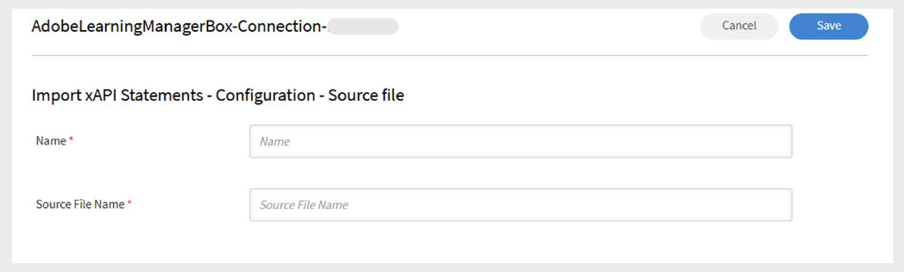
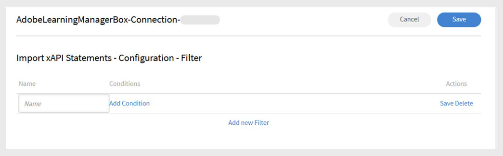

# Connecteur Box dans Adobe Learning Manager

## Introduction

Le **connecteur Box** de Adobe Learning Manager permet une intégration transparente avec les systèmes externes en automatisant l&#39;importation et l&#39;exportation des données utilisateur et d&#39;apprentissage via des fichiers CSV. Les systèmes externes peuvent placer des fichiers CSV dans des dossiers désignés du compte Box géré par Adobe Learning Manager, où ils sont automatiquement traités selon un calendrier défini.

Avec ce connecteur, les administrateurs peuvent :

- Importez des utilisateurs internes à partir de fichiers CSV.
- Exportez les données de compétence utilisateur et les relevés de notes des élèves vers des systèmes externes.
- Importez des instructions d’activité xAPI à partir de systèmes tiers pris en charge.

Le connecteur prend en charge le mappage des attributs, la synchronisation planifiée et l’exécution à la demande, ce qui aide les organisations à maintenir à jour les données utilisateur et d’apprentissage sur toutes les plateformes.

## Configuration du connecteur Box

Pour configurer le connecteur Box dans Adobe Learning Manager :

1. Connectez-vous à Adobe Learning Manager en tant qu’administrateur d’intégration.
2. Survolez la vignette **Box**.
3. Sélectionnez **Se connecter**.

   
   _Sélectionnez Connexion pour configurer le connecteur BoxSélectionnez Connexion pour configurer le connecteur Box_

4. Saisissez l’adresse e-mail de la personne qui gérera le compte Adobe Learning Manager Box pour votre organisation.
5. Sélectionnez **Se connecter**.

### Activation du compte

1. Adobe Learning Manager envoie un lien de réinitialisation de mot de passe à l’ID de messagerie fourni.
2. L’utilisateur doit réinitialiser le mot de passe avant d’accéder au compte Box pour la première fois.

>[!NOTE]
>
>Un seul compte Box peut être configuré par compte Adobe Learning Manager.

Dans la page **Aperçu**, sélectionnez l&#39;une des actions suivantes :

- **Importer l&#39;utilisation interne**
- **Importer le rapport d&#39;activité xAPI**
- **Exporter les compétences des utilisateurs**
- **Exporter le relevé de notes de l’élève**
- **Exporter le rapport d&#39;activité xAPI**

Une fois connecté, Box Connector est prêt à synchroniser les données entre Adobe Learning Manager et vos systèmes externes.

## Importer les utilisateurs internes

La fonctionnalité d’importation des utilisateurs permet la synchronisation automatisée des données des employés des systèmes de RH et d’autres sources externes dans Adobe Learning Manager.

### Attributs de mappage

Le mappage d’attributs établit la connexion entre vos données externes et la structure de données prise en charge par Adobe Learning Manager, en veillant à ce que les données soient placées dans les champs appropriés. Cette étape est obligatoire.

Pour mapper les attributs :

1. Sélectionnez **Utilisateurs internes** dans la page du connecteur Box.
2. Sélectionnez **Mappage de colonnes**.
3. Dans la page **Attributs de mappage** :
   - Le côté gauche affiche les champs requis dans Adobe Learning Manager.
   - Le côté droit affiche les noms des colonnes CSV. Initialement, ce côté contient des listes déroulantes vides.
   - Sélectionnez **Choisir CSV** pour charger un exemple de fichier CSV. Cette opération renseigne la liste déroulante de droite avec les noms de colonne de votre fichier CSV. Reportez-vous à [cet article](https://experienceleague.adobe.com/fr/docs/learning-manager/using/integration/migration-manual#csv) pour obtenir des exemples de fichiers CSV.
   - Mappez chaque champ Adobe Learning Manager à la colonne CSV correspondante.

   
   _L’interface de mappage des attributs affiche les champs Adobe Learning Manager dans les menus déroulants des colonnes de gauche et CSV à droite_

4. Sélectionnez **Enregistrer** pour terminer le mappage.

Après l’enregistrement, le compte configuré apparaît en tant que source de données dans l’application Administrateur. Les administrateurs peuvent ensuite planifier une importation ou déclencher une synchronisation manuelle.

### Importation d’instructions xAPI

L’importation d’instructions xAPI permet un suivi détaillé des activités d’apprentissage en intégrant des données d’apprentissage externes dans Adobe Learning Manager.

_Configurer la source_

La configuration de la source xAPI établit la connexion entre les systèmes d’apprentissage externes et le suivi d’activité de Adobe Learning Manager.

Pour configurer une source :

1. Accédez à la section de configuration xAPI.
2. Sélectionnez **Ajouter une nouvelle configuration** dans la liste de configuration.
3. Saisissez le **nom** et le **nom du fichier source**.
   - Nom : identificateur descriptif de cette source xAPI (par exemple, Intégration LMS ou Système de formation externe).
   - Nom du fichier source : nom de fichier exact qui sera chargé dans votre dossier Box (doit correspondre exactement, y compris l’extension de fichier).

   
   _Formulaire de configuration affichant le champ de nom et le champ de nom de fichier source_

4. Sélectionnez **Enregistrer** pour créer la configuration de base.

_Ajouter des filtres (facultatif)_

Les filtres vous permettent d’importer de manière sélective des instructions xAPI en fonction de critères spécifiques.

Pour ajouter un filtre pour la source :

1. Sélectionnez **Filtre** dans le volet de gauche.
2. Sélectionnez **Ajouter un nouveau filtre**.
3. Configurez les éléments suivants :
   - **Nom :** Nom descriptif de la règle de filtrage.
   - **Condition :** opérateur de comparaison (égal à, contient, supérieur à, etc.).

   
   _Boîte de dialogue de création de filtre affichant les champs Nom et Conditions_

4. Sélectionnez **Ajouter un nouveau filtre** pour ajouter d&#39;autres filtres.
5. Sélectionnez **Enregistrer** ou **Supprimer** selon vos besoins sous la colonne **Actions**.
6. Après avoir ajouté les filtres, sélectionnez **Enregistrer**.

## Planification de l’importation

La planification automatisée garantit une synchronisation cohérente des données sans intervention manuelle, tout en conservant les enregistrements actuels des activités d’apprentissage.

Pour planifier l’importation :

1. Sélectionnez **Configurer la planification** dans le volet de gauche.

   
   _Page de configuration de la planification affichant les options d&#39;activation et les commandes de synchronisation_

2. Sélectionnez **Activer l&#39;importation des instructions xAPI à l&#39;aide de cette connexion**.
3. Sélectionnez **Activer la planification** pour configurer les importations automatiques.
4. Définissez les paramètres de planification suivants :

   - **Date de début :** heure à laquelle les importations planifiées doivent commencer.
   - **Heure :** heure de la journée pour l&#39;exécution de l&#39;importation.
   - **Répéter après :** la fréquence à laquelle les importations doivent être exécutées (quotidiennement, hebdomadairement, intervalles personnalisés).
5. Sélectionnez **Enregistrer**.

## Exécuter à la demande (facultatif)

L’exécution à la demande permet d’importer immédiatement des données en dehors des opérations planifiées.

Quand utiliser les importations à la demande :

- Test de nouvelles configurations avant la planification.
- Traitement des mises à jour de données urgentes ou sensibles au temps.
- Gestion des migrations ou corrections de données ponctuelles.
- Résolution des problèmes d’importation.

Pour importer manuellement des instructions xAPI :

1. Sélectionnez **À la demande** dans le volet de gauche.
2. Sélectionnez **Exécuter**.

## Afficher l’état d’exécution

La surveillance du statut permet une gestion proactive des opérations d’importation et une identification rapide des problèmes.

Pour afficher l’état d’exécution :

1. Sélectionnez **État d&#39;exécution** pour afficher la liste de toutes les exécutions d&#39;importation.
2. La page d’état affiche :

   - **Date de début :** date de début de l&#39;opération d&#39;importation
   - **Durée :** temps total requis pour le traitement
   - **Type d&#39;importation :** si l&#39;importation a été planifiée ou à la demande
   - **État actuel :** informations d&#39;état en temps réel
      - **En cours :** importation en cours d&#39;exécution
      - **Terminé :** Terminé avec succès avec un nombre d&#39;enregistrements
      - **Échec :** une erreur s&#39;est produite avec les informations de diagnostic
