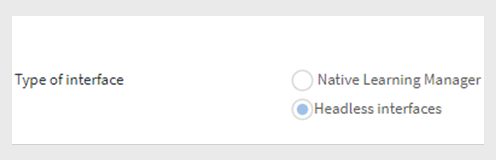

# Connecteurs Learning Manager

Les entreprises disposent d’autres applications et systèmes devant être intégrés à Learning Manager. Les connecteurs sont des utilitaires qui facilitent l’exécution d’intégrations basées sur des données, telles que l’importation de données dans Learning Manager à partir de systèmes externes.  Il effectue également l’exportation de données vers des systèmes externes à partir de Learning Manager.

Learning Manager fournit des connecteurs Salesforce et FTP. À l’aide du connecteur Salesforce, les administrateurs d’intégration d’une entreprise peuvent intégrer leurs applications Salesforce à Learning Manager. En tant qu’intégrateur, vous pouvez également utiliser le connecteur FTP pour importer automatiquement un groupe d’utilisateurs dans l’application de votre entreprise.

Learning Manager fournit également les connecteurs Lynda, getAbstract et Harvard Management System. Ces connecteurs permettent aux élèves d’accéder aux cours de Lynda.com, getAbstract et Harvard ManageMentor et de les suivre.

Lisez ce qui suit pour savoir comment configurer et utiliser chacun de ces connecteurs dans Learning Manager.

<!--
>[!NOTE]
>
>**Update:** December 2020 update of Learning Manager
>
>For **FTP**, **Box**, and **Custom FTP** connectors, while exporting Learner Transcript or xAPI, you can also export the data as a **zip** file, for:
>
>* Learner Transcripts
>* xAPI
-->

>[!NOTE]
>
>Avec la version de novembre 2022 de Adobe Learning Manager, Zoom a abandonné l&#39;[authentification JWT d&#39;ici juin 2023](https://marketplace.zoom.us/docs/guides/auth/jwt/). En conséquence, le connecteur Zoom avec JWT continuera de fonctionner jusqu’à la date mentionnée. Toutefois, nous recommandons aux utilisateurs de créer une application OAuth de serveur à serveur pour remplacer la fonctionnalité dans leur compte. Par défaut, l’authentification OAuth Zoom est appliquée aux nouvelles connexions.

## Connecteur Salesforce {#sfconnector}

Le connecteur Salesforce connecte les comptes Learning Manager et Salesforce pour automatiser la synchronisation des données. Les fonctionnalités du connecteur Salesforce sont les suivantes :

### Attributs de mappage

L’administrateur d’intégration peut choisir les colonnes Salesforce et les mapper à des attributs compatibles avec des groupes de Learning Manager correspondants. Une fois le mappage terminé, le même mappage est utilisé lors des prochaines importations de l’utilisateur. Il peut être reconfiguré si l’administrateur souhaite avoir un mappage différent pour importer des utilisateurs.

### Importation automatisée d’utilisateurs

L’importation des utilisateurs permet à l’administrateur de Learning Manager de récupérer les détails des employés à partir de Salesforce et de les importer dans Learning Manager automatiquement. Cette automatisation évite l’effort manuel lié à la création d’un fichier CSV et à son chargement dans Learning Manager.

### Planification automatique

L’utilisation de la fonctionnalité de planification automatique avec la fonctionnalité d’importation automatisée d’utilisateur peut être efficace. L’administrateur de Learning Manager peut configurer une planification en fonction des besoins de l’organisation. Les utilisateurs de l’application Learning Manager peuvent être à jour en fonction de la planification. La synchronisation peut être exécutée de façon quotidienne dans l’application Learning Manager.

### Filtrage des utilisateurs

L’administrateur de Learning Manager peut appliquer un filtrage sur les utilisateurs avant de les importer. Par exemple, l’administrateur de Learning Manager peut choisir d’importer tous les utilisateurs sous un ou plusieurs responsables spécifiques dans la hiérarchie.

### Configurer le connecteur Salesforce {#configuresalesforceconnector}

Pour intégrer Salesforce à Learning Manager, découvrez le processus

#### Prérequis {#prerequisites}

Assurez-vous de disposer de l’URL de votre organisation Salesforce. Par exemple, si le nom de votre organisation est **myorg**, l’URL Salesforce peut être `https://myorg.salesforce.com`. Il s’agit de la seule opération requise pour connecter le compte Salesforce à Learning Manager.

Veillez également à disposer des informations d’identification appropriées pour vous connecter au compte.

#### Créer une connexion {#createaconnection}

1. Dans la page d’accueil de Learning Manager, placez le curseur de la souris au-dessus de l’icône Salesforce. Un menu s’affiche. Cliquez sur l’élément **[!UICONTROL Connecter]** dans le menu.

   

   *Option de connexion*

1. Une boîte de dialogue s’affiche vous invitant à entrer l’URL de l’organisation. Cliquez sur **[!UICONTROL Se connecter]** après avoir fourni l&#39;URL.
1. En cas de réussite de la connexion, la page de présentation s’affiche.

### Attributs de mappage {#mapattributes}

Une fois la connexion établie, vous pouvez mapper les colonnes Salesforce aux attributs correspondants de Learning Manager. Cette étape est obligatoire.

1. Sur la gauche de la page de mappage, vous pouvez voir les colonnes de Learning Manager et sur la droite, les colonnes Salesforce. Sélectionnez le nom de colonne approprié qui correspond au nom de colonne de Learning Manager.

   
   *Attributs de mappage*

   >[!NOTE]
   >
   >Les données de la colonne Learning Manager affichées sur le côté gauche sont extraites des champs actifs. Le champ **responsable** doit être mappé à un champ d&#39;adresse e-mail. Le mappage de toutes les colonnes est obligatoire pour que le connecteur puisse être utilisé.

1. Cliquez sur **[!UICONTROL Enregistrer]** après avoir terminé le mappage.
1. Le connecteur est maintenant prêt à l’emploi. Le compte qui a été configuré s’affiche en tant que source de données dans l’application Administrateur. L’administrateur peut planifier l’importation ou la synchronisation à la demande.

## Utilisation du connecteur Salesforce {#usingsalesforceconnector}

Le connecteur Salesforce se connecte à Salesforce.com pour récupérer les utilisateurs selon la configuration et les ajouter à Learning Manager.

### Importer des utilisateurs à partir de contacts Salesforce {#import-salesforce-contacts}

Learning Manager améliore le connecteur Salesforce pour récupérer les contacts ainsi que les utilisateurs Salesforce et les importer automatiquement dans Learning Manager.

Sur la page du connecteur Salesforce, saisissez l’URL Salesforce et terminez l’authentification. Une fois que vous vous êtes authentifié, vous pouvez ensuite importer des utilisateurs ou des contacts. Si vous sélectionnez l’option Contacts, spécifiez le sous-ensemble de contacts à importer.

Sélectionnez les colonnes Salesforce et mappez-les à des attributs compatibles avec des groupes de Learning Manager. Une fois le mappage terminé, le même mappage est utilisé lors des prochaines importations de l’utilisateur.

1. Se connecter à Salesforce.
1. Sur la page de connexion, cliquez sur **[!UICONTROL Importer les utilisateurs internes]**.

   
   *Importer des utilisateurs internes*

1. Sur la page **Importer des utilisateurs**, une nouvelle option, Contacts, est disponible. Cliquez sur le bouton radio **Contacts** pour afficher les options suivantes.

   
   *Mapper les attributs de contact*

1. Si vous cliquez sur **[!UICONTROL Oui]**, vous pouvez effectuer les opérations suivantes :

   * **Choisir la colonne Contacts :** Sélectionnez le champ que vous souhaitez importer dans Learning Manager.
   * **Spécifier des valeurs :** Choisissez les valeurs qui représentent le champ sélectionné.

   
   *Spécifiez les valeurs*

   * Mappez les colonnes Salesforce à celle de Learning Manager.
   * Pour commencer l&#39;importation, cliquez sur **[!UICONTROL Enregistrer]**.

1. Si vous cliquez sur **[!UICONTROL Non. Importez tous les contacts]**, vous pouvez mapper les champs directement sans filtrer les contacts. Ici, vous importeriez tous les contacts de Salesforce.
1. Pour commencer l&#39;importation, cliquez sur **[!UICONTROL Enregistrer]**.

## Exporter les enregistrements d’apprentissage

Learning Manager permet d’exporter des enregistrements d’apprentissage tels que des transcriptions, des rapports d’utilisateur et des rapports de compétences vers Salesforce. Vous pouvez déterminer si les données exportées doivent être liées à la table « Utilisateur » ou à la table « Contacts » dans Salesforce.

*Exportation des enregistrements d’apprentissage*

### Objets personnalisés dans Salesforce

Avant d’exporter des enregistrements d’apprentissage à partir de Learning Manager, vous devez créer des objets personnalisés dans Salesforce. Les objets personnalisés sont des objets que vous créez pour stocker des informations spécifiques à votre entreprise ou secteur d’activité. Pour plus d’informations, voir [Objets personnalisés Salesforce](https://trailhead.salesforce.com/en/content/learn/modules/data_modeling/objects_intro).

Voici comment vous allez créer les objets :

1. Téléchargez et installez les packages pour créer les objets personnalisés.

   * [Package 1](https://test.salesforce.com/packaging/installPackage.apexp?p0=04t1k0000008WPJ)
   * [Package 2](https://test.salesforce.com/packaging/installPackage.apexp?p0=04t1k0000008WPT)
   * [Package 3](https://test.salesforce.com/packaging/installPackage.apexp?p0=04t1k0000008WPi)

1. Renommez les noms des objets personnalisés dans Salesforce.
1. Sélectionnez les événements et cliquez sur **[!UICONTROL Enregistrer]**.

>[!NOTE]
>
>Assurez-vous que l’accès administrateur système a été accordé à tous les champs actifs ajoutés après l’installation du pack.

**Lier les événements à :** Choisissez la section à exporter - Utilisateur ou Contact. Si vous choisissez l’objet Contact, les utilisateurs présents dans Learning Manager mais pas dans Salesforce seront créés dans Salesforce.

*Option Lier les événements*

>[!NOTE]
>
>Vous pouvez créer plusieurs connexions dans un même compte. Une seule connexion peut servir jusqu’à trois objets personnalisés dans Salesforce. Si vous souhaitez créer plusieurs connexions pour le même compte Salesforce, vous devez installer les trois packages. Nous fournissons une assistance pour trois packages maximum.
>
>Vous devez installer autant de packages que de connexions à créer.

>[!NOTE]
>
>Dans la page Statut d’exécution de Salesforce, le nombre d’enregistrements traités peut être consulté à partir de Salesforce uniquement. Learning Manager affiche l’état Terminé, même en cas d’exportation partielle ou d’échec dans tous les enregistrements traités.

## Installation du package Salesforce

Learning Manager propose un package d’application Salesforce. Une fois le package installé et configuré dans SFDC, les vendeurs peuvent effectuer leurs activités de formation sur le portail SFDC. Cette application permet aux utilisateurs de SFDC d’explorer les nouvelles formations, de consulter les recommandations et de les utiliser directement dans le portail SFDC. Les utilisateurs reçoivent également les annonces envoyées par les administrateurs sous la forme d’en-têtes directement dans l’application dans le portail SFDC.

### Configuration dans l’application Learning Manager

1. Connectez-vous à votre compte d’administrateur Learning Manager en tant qu’administrateur d’intégration.
1. Cliquez sur **[!UICONTROL Applications]** > **[!UICONTROL Applications phares]**.
1. Cliquez sur **[!UICONTROL Salesforce]**.
1. Sur la page de l’application Salesforce, notez l’ID d’application (également appelé ID client) et le secret client mentionné dans la description.
1. Cliquez sur **[!UICONTROL Approuver]** et votre application doit être approuvée.
1. Cliquez sur **[!UICONTROL Ressources pour les développeurs]** > **[!UICONTROL Jetons d&#39;accès pour le test et le développement]**.
1. Dans la section Obtenir le code OAuth, l’ID client et la portée doivent être définis sur - admin:read, admin:write. Cliquez sur **[!UICONTROL Envoyer]**.
1. Dans la section Obtenir le jeton d’actualisation, entrez l’ID client et le secret client. Cliquez sur **[!UICONTROL Envoyer]** et notez le jeton d’actualisation.

### Création d’un compte dans l’application Salesforce

1. Créez un compte sur la page d’inscription Salesforce. Vous devez créer un compte Salesforce dans l’édition pour développeurs ou entreprises.  [URL d&#39;inscription du développeur](https://developer.salesforce.com/signup). Pour vous inscrire à Salesforce, veillez à utiliser l’ID de messagerie que vous avez utilisé pour Learning Manager.
1. Validez votre compte via l’e-mail de vérification.
1. Créez un mot de passe et connectez-vous à Salesforce.
1. Notez l’URL Salesforce après la connexion (par exemple, site.lightning.force.com).

### Installation du package Learning Manager

Si vous souhaitez installer le package, vous devez d’abord supprimer le pack existant dans Salesforce. Avant de procéder à la désinstallation, vous devez activer les paramètres, comme indiqué ci-dessous. L’application de ces paramètres est obligatoire, sinon vous ne pourrez pas installer le package.

>[!NOTE]
>
>L’application Adobe Learning Manager est uniquement prise en charge dans la vue Salesforce Lightning.

1. Lancez l&#39;[URL du package Learning Manager](https://login.salesforce.com/packaging/installPackage.apexp?p0=04t1k0000008WOQ).
1. Dans la page **Connexion**, cliquez sur **[!UICONTROL Utiliser un domaine personnalisé]**.
1. Entrez l&#39;URL du package et cliquez sur **[!UICONTROL Continuer]**. L’option Installer pour les administrateurs uniquement doit être sélectionnée sur la page d’installation. Ne modifiez pas cette option.
1. Cliquez sur **[!UICONTROL Installer]**. Une fois le package installé, cliquez sur **[!UICONTROL Terminé]**. Vous êtes guidé vers la page Packages installés où vous pouvez voir le package Adobe Learning Manager installé.
1. Accédez au Lanceur d’applications (en regard de Configuration) et recherchez Adobe Learning Manager.
1. Pour configurer l&#39;application, cliquez sur **[!UICONTROL Configurer]**.
1. Cliquez sur **[!UICONTROL Nouveau]** et ajoutez les détails suivants :

   * **Config :** entrez le nom de votre choix.
   * **ClientID** : entrez la valeur que vous avez obtenue dans la première section.
   * **ClientSecret:** Entrez la valeur que vous avez obtenue à partir de la première section.
   * **RefreshToken:** Entrez la valeur que vous avez obtenue à partir de la première section.
   * **LearningManagerBaseURL :** URL du site où Learning Manager est hébergé.

### Ajout des paramètres du site distant

1. Dans le coin supérieur droit de la page, cliquez sur **[!UICONTROL Configuration]**.
1. Dans **[!UICONTROL Recherche rapide]**, recherchez Paramètres du site distant.
1. Cliquez sur **[!UICONTROL Nouveau site distant]**.
1. Saisissez les détails :

   * **Nom du site distant :** entrez le nom de votre choix.
   * **URL du site distance :** URL du site où Learning Manager est hébergé.

1. Lancez Learning Manager.

### Activation des notifications pour l’application Learning Manager

1. Dans le coin supérieur droit, cliquez sur **[!UICONTROL Configuration]**.
1. Recherchez Notifications personnalisées.
1. Cliquez sur **[!UICONTROL Nouveau]**.
1. Saisissez les détails suivants :

   1. **Nom de la notification personnalisée :** LearningManagerNotification
   1. **Nom de l’API :** LearningManagerNotification

1. Sélectionnez **Bureau** et **Mobile** comme canaux pris en charge.

1. Cliquez sur **[!UICONTROL Enregistrer]**.
1. Pour activer les notifications Push sur les appareils mobiles, procédez comme suit :

   1. Installez l’application mobile Salesforce sur votre téléphone mobile.
   1. Connectez-vous à l’application à l’aide de vos informations d’identification.
   1. Accédez à **Configuration** > **Paramètres de remise des notifications**.
   1. Ajoutez Salesforce pour iOS et Android.

### Désinstaller Learning Manager de Salesforce

1. Dans l’application Salesforce, accédez à Packages installés.
1. Cliquez sur **[!UICONTROL Désinstaller]**.

## Configuration de Learning Manager pour les utilisateurs Salesforce

L’application Learning Manager est également disponible pour les utilisateurs qui sont présents dans n’importe quel compte Salesforce. L’administrateur Salesforce peut ajouter des utilisateurs en fonction des profils. Les profils Salesforce sont similaires à ce qu’ils sont dans Learning Manager. Par exemple, Administrateur, Administrateur d’intégration, Instructeur, etc. L’administrateur Salesforce peut également créer un profil personnalisé.

En tant qu’administrateur Salesforce, vous pouvez affecter les profils aux utilisateurs ou créer un profil personnalisé.

Lors de l’installation du pack, vous pouvez affecter le profil Salesforce aux élèves.

Après avoir installé le pack, vous devez configurer le profil.

Cliquez sur **[!UICONTROL Configurer]** > **[!UICONTROL Nouveau]**, puis ajoutez les éléments suivants :

* Nom de la configuration
* ClientID
* ClientSecret
* LearningManagerBaseURL
* Désactiver la redirection

>[!NOTE]
>
>Pour que les élèves puissent afficher l’application Learning Manager, vous devez l’activer pour tous les élèves.

L’étape suivante consiste à fournir l’autorisation d’accéder à l’application Learning Manager.

*Définir les autorisations d&#39;accès à l&#39;application Learning Manager*

Sélectionnez les utilisateurs et attribuez les autorisations en conséquence. Les élèves peuvent désormais accéder à l’application Learning Manager.

Ensuite, sélectionnez un profil, par exemple Profil standard d’un utilisateur, puis cliquez sur le profil. Cliquez sur **[!UICONTROL Modifier]** et dans la section **Paramètres d&#39;application personnalisés**, activez la case à cocher **Adobe Learning Manager**. Cela rend l’application accessible à l’utilisateur.

Dans la section **Paramètres d’onglet personnalisés**, dans la liste déroulante **Page d’accueil de l’élève**, sélectionnez l’option **Par défaut sur**.

Vous devez rendre l’application visible à tous les profils.

Cliquez sur **[!UICONTROL Enregistrer]** pour que les élèves appartenant à tous les profils accèdent à l’application Learning Manager.

### Modifications liées à la fonction Parcours d’apprentissage

#### Connexions existantes

Si l’option Parcours d’apprentissage est désactivée dans le compte administrateur, aucune ligne ni colonne n’est ajoutée dans le rapport.

Si l’option Parcours d’apprentissage est activée dans le compte administrateur, la colonne « Type » sera remplie avec Parcours d’apprentissage si des élèves y sont inscrits.

>[!NOTE]
>
>Si l’indicateur est activé et que vous utilisez une connexion existante, quelques enregistrements peuvent être manqués.

#### Nouvelles connexions

Si l’option Parcours d’apprentissage est désactivée dans le compte administrateur, le rapport de formation se compose des colonnes suivantes, mais ne contient aucune donnée.

* **Parcours intégré :** affiche le nom du programme d’apprentissage.
* **ID du parcours intégré :** affiche les ID du programme d’apprentissage.
* **ID de cours intégré :** affiche les ID des cours qui se trouvent dans un parcours d’apprentissage.

Notez également que pour les nouvelles connexions dans les comptes où l’option Parcours d’apprentissage est activée, les trois nouvelles colonnes apparaissent et ne sont pas vides.

En outre, le rapport contiendra le type de colonne « Parcours d’apprentissage (niveau supérieur) » pour tous les élèves inscrits à un parcours d’apprentissage.

Dans la colonne Type, le programme d’apprentissage sera renommé « Parcours d’apprentissage ». Pour les connexions existantes, il n’y aura aucune modification.

## Connecteur FTP Learning Manager {#ftpconnector}

À l’aide du connecteur FTP, vous pouvez intégrer Learning Manager à des systèmes externes arbitraires pour automatiser la synchronisation des données. Les systèmes externes doivent pouvoir exporter des données au format CSV et les placer dans le dossier approprié du compte FTP de Learning Manager. Les fonctionnalités du connecteur FTP sont les suivantes :

Vous pouvez également utiliser le connecteur Box pour la migration de données, l’importation d’utilisateurs et l’exportation de données. Pour plus d&#39;informations, voir Connecteur Box.

### Importation de données {#dataimport}

Le processus d’importation des utilisateurs permet à l’administrateur de Learning Manager de récupérer les détails des employés à partir du service FTP de Learning Manager et de les importer dans Learning Manager automatiquement. Grâce à cette fonction, vous pouvez intégrer plusieurs systèmes en plaçant le fichier CSV généré par ces systèmes dans les dossiers appropriés des comptes FTP. Learning Manager récupère les fichiers CSV, les fusionne et importe les données en fonction de la planification. Reportez-vous à la fonction de planification pour plus d&#39;informations.

**Attributs de mappage**

L’administrateur d’intégration peut choisir les colonnes du fichier CSV et les mapper aux attributs compatibles avec des groupes de Learning Manager. Cette mise en correspondance demande du temps. Une fois le mappage terminé, le même mappage est utilisé lors des importations suivantes des utilisateurs. Il peut être reconfiguré si l’administrateur souhaite avoir un mappage différent pour importer des utilisateurs.

#### Exportation de données {#exportdata}

L’option Exportation de données permet aux utilisateurs d’exporter des compétences d’utilisateur et des relevés de notes des élèves vers un emplacement FTP à des fins d’intégration avec un système tiers.

#### Planification

Les administrateurs peuvent configurer des tâches de planification en fonction des besoins de l’organisation et les utilisateurs de l’application Learning Manager sont à jour en fonction de la planification. De même, l’administrateur d’intégration peut planifier l’exportation des compétences en temps opportun pour les intégrer à un système externe. La synchronisation peut être effectuée quotidiennement dans l’application Learning Manager.

### Configuration du connecteur FTP Learning Manager {#configurecaptivateprimeftpconnector}

Pour intégrer le connecteur FTP à Learning Manager, découvrez le processus.

#### Création d’une connexion {#Createaconnection-1}

1. Sur la page d’accueil de Learning Manager, placez le curseur de la souris sur la vignette ou la carte FTP. Un menu s’affiche. Sélectionnez l’élément Connexion dans le menu.

   

   *Option de connexion*

Pour vous connecter à un serveur FTP à l&#39;aide d&#39;un client FTP, vous aurez besoin des informations suivantes :

* **Domaine FTP** : il s&#39;agit de l&#39;adresse du serveur FTP auquel vous souhaitez vous connecter. Par exemple, ftp.example.com
* **Port** : le port FTP par défaut est le port 21, mais certains serveurs peuvent utiliser des ports différents pour des raisons de sécurité. Pour Adobe Learning Manager - Port 22
* **Nom d&#39;utilisateur FTP** : nom d&#39;utilisateur dont vous avez besoin pour accéder au serveur FTP.
* **Mot de passe FTP** : mot de passe associé au nom d&#39;utilisateur.

**FileZilla (Windows, macOS et Linux)**

**Étape 1 : téléchargement et installation de FileZilla**

Si vous n&#39;avez pas encore installé FileZilla, téléchargez-le à partir du site web officiel : [Télécharger](https://filezilla-project.org/) et installez-le sur votre ordinateur.

**Étape 2 : ouvrez FileZilla**

Après l’installation, lancez FileZilla sur votre ordinateur.

**Étape 3 : collecte des informations sur le serveur FTP**

**Étape 4 : entrez les informations du serveur FTP dans FileZilla**

Dans le menu supérieur, sélectionnez **[!UICONTROL Fichier]**, puis **[!UICONTROL Gestionnaire de site]** (ou utilisez le raccourci Ctrl+S).

**Étape 5 : ajout d&#39;un site FTP**

Dans le Gestionnaire de sites, sélectionnez **Nouveau site** et saisissez un nom (par exemple, Mon serveur FTP).

**Étape 6 : saisie des détails FTP**

Saisissez les informations suivantes :

* **Hôte** : saisissez l&#39;adresse de votre serveur FTP.
* **Port** : si le serveur utilise un port supérieur à 21, entrez le numéro de port correct.
* **Protocole** : sélectionnez **[!UICONTROL SFTP - SSH File Transfer Protocol]**.
* **Type d&#39;ouverture de session** : sélectionnez **[!UICONTROL Normal]**.
* **Utilisateur** : saisissez votre nom d&#39;utilisateur FTP.
* **Mot de passe** : saisissez votre mot de passe FTP.

**Étape 7 : connexion au serveur FTP**

Sélectionnez le bouton **[!UICONTROL Se connecter]** dans le Gestionnaire de site. FileZilla se connecte au serveur FTP si toutes les informations sont correctes.

**Étape 8 : parcourir et transférer des fichiers**

Une fois connecté, les fichiers distants s’affichent sur le côté droit et vos fichiers locaux sur le côté gauche. Vous pouvez parcourir les répertoires et transférer des fichiers en les faisant glisser entre les panneaux.

>[!CAUTION]
>
>Lors du transfert de fichiers, évitez de modifier les fichiers importants sur le serveur.

<!--1. A dialog appears prompting you to enter the email id. Provide the email id of the person responsible for managing the Learning Manager FTP account for the organization. Click **[!UICONTROL Connect]** after providing the email id. 
1. Learning Manager sends you an email prompting the user to reset the password before accessing the FTP for the first time. The user must reset the password and use it for accessing the Learning Manager FTP account.

   >[!NOTE]
   >
   >Only one Learning Manager FTP account can be created for a given Learning Manager account.

   In the overview page, you can specify the Connection Name for your integration. Choose what action you want to take  from  the following options:

   * Import Internal Users  
   * Import xAPI
   * Export User Skills - Configure a Schedule  
   * Export User Skills - OnDemand  
   * Export Learner Transcripts - Configure a Schedule
   * Export Learner Transcripts - OnDemand

   
   *Export options*-->

### Importation

+++Utilisateur interne

L’option Importer l’utilisateur interne vous permet d’importer les utilisateurs à partir d’un fichier .csv dans Learning Manager à la demande ou de manière planifiée.

+++

+++Attributs de mappage

Une fois la connexion établie, vous pouvez mapper les colonnes des fichiers CSV. Elles seront placées dans le dossier FTP aux attributs correspondants de Learning Manager. Cette étape est obligatoire.

1. Sur la gauche de la page Attributs de mappage, vous pouvez voir les colonnes attendues de Learning Manager et sur la droite, les noms des colonnes du fichier CSV. À droite, vous pouvez initialement voir une zone de sélection vide. Importez n&#39;importe quel modèle CSV en cliquant sur **Choisir un fichier**.
1. Les étapes ci-dessus permettent de compléter la liste déroulante de sélection de droite avec tous les noms de colonnes du fichier CSV. Sélectionnez le nom de colonne approprié qui correspond au nom de colonne de Learning Manager.

   >[!NOTE]
   >
   >Le champ du gestionnaire doit être mappé à un champ d’adresse électronique. Le mappage de toutes les colonnes est obligatoire pour que le connecteur puisse être utilisé.

1. Sélectionnez **[!UICONTROL Enregistrer]** après avoir terminé le mappage.

   Le connecteur est maintenant prêt à l’emploi. Le compte que vous venez de configurer s’affiche en tant que source de données dans l’application d’administrateur pour que l’administrateur programme l’importation ou pour une synchronisation à la demande.

+++

+++Utilisation du connecteur FTP Learning Manager

1. Les fichiers CSV de systèmes externes doivent être placés à l’emplacement suivant :

   `code $OPERATION$/$OBJECT_TYPE$/$SUB_OBJECT_TYPE$/data.csv`

   >[!NOTE]
   >
   >Dans la version de juillet 2016, seule l’importation d’utilisateurs est autorisée. Par conséquent, pour utiliser le connecteur FTP, assurez-vous que les fichiers CSV se trouvent dans le dossier suivant :

   `code Home/import/user/internal/*.csv`

1. Le connecteur FTP récupère toutes les lignes des fichiers CSV. Il est important que la ligne correspondant à l’utilisateur dans un fichier CSV n’apparaisse dans aucun autre fichier CSV.
1. Tous les fichiers CSV doivent contenir les colonnes spécifiées dans le mappage.
1. Tous les fichiers CSV requis doivent être présents dans le dossier avant que le processus ne commence.

>[!NOTE]
>
>Lors de l’importation des utilisateurs dans Learning Manager, l’administrateur doit également déterminer la gestion des utilisateurs dans Learning Manager. Reportez-vous à l&#39;[Aide sur la gestion des utilisateurs](migration-manual.md#usermanagement) pour en savoir plus.

+++

+++Importer xAPI

Les options d’importation xAPI vous permettent de planifier l’importation d’instructions xAPI provenant de services tiers dans Learning Manager à la demande.

+++

+++Configurations requises pour importer xAPI

1. Dans la page de configuration, sélectionnez une configuration existante disponible dans la liste de configuration pour importer des instructions xAPI à partir du fichier CSV. Cliquez sur le lien Modifier ou **Ajouter une nouvelle configuration** pour accéder à la page Configurer les sources d&#39;importation.

   **Configuration**

   * Dans la page Configurer les sources d’importation, renseignez les deux champs Nom et Nom du fichier source. Le nom du fichier source doit correspondre au nom de fichier fourni dans l’emplacement du dossier FTP.
   * Cliquez sur **[!UICONTROL Enregistrer]** pour enregistrer vos modifications.

   
   *Configurer*

   **Filtre**

   * Dans le volet de gauche, cliquez sur **[!UICONTROL Filtrer]**.
   * Dans la page de configuration du filtre d’importation, renseignez les champs Nom et Conditions pour filtrer les enregistrements. Cliquez sur **[!UICONTROL Ajouter un nouveau filtre]** pour ajouter un autre filtre. Vous pouvez enregistrer ou supprimer un filtre en cliquant sur **Enregistrer** ou **Supprimer** dans la colonne Actions.

   
   *Filtre*

   **Mappage**

   * Dans le volet de gauche, cliquez sur **[!UICONTROL Mappage]**.
   * Dans la page Importer les instructions xAPI-Configuration-Mappage, vous pouvez voir sur la gauche les noms des chemins d’accès aux champs JSON xAPI, qui doivent être mappés avec les noms de colonnes CSV.
   * Par défaut, les noms des trois chemins d’accès JSON qui doivent être mappés avec le nom des colonnes CSV est **actor.mbox**, **vers.id** et **object.id**. Vous pouvez ajouter d’autres champs à mapper en cliquant sur **Ajouter un nouveau mappage**.

   * Sélectionnez le type de nom de colonne que vous mappez avec le nom de chemin du champ Json (qu’il s’agisse d’une chaîne, d’un nombre, d’une valeur booléenne ou d’un type de donnée).
   * Cliquez sur Enregistrer après avoir terminé le mappage. L’importation xAPI peut maintenant être importée selon le planning ou à la demande.

   
   *Mappage*

1. Dans le volet de gauche, cliquez sur **[!UICONTROL Configurer le planning]**. Cliquez sur **[!UICONTROL Activer la planification]** pour planifier l’importation des instructions xAPI.

   Vous pouvez saisir l’heure et la date de début, puis saisir la fréquence de votre planning d’importation xAPI en nombre de jours. Par exemple, activez l’importation xAPI tous les 3 jours.

   
   *Importer des instructions xAPI - Configurer la planification*

1. Dans le volet de gauche, cliquez sur **[!UICONTROL Exécution à la demande]**.

   
   *Importer des instructions xAPI- À la demande*

1. Dans le volet de gauche, cliquez sur **[!UICONTROL Statut d’exécution]** pour afficher le résumé de toutes les exécutions pour ce connecteur, dans l’ordre chronologique. Vous pouvez afficher la date de début et la durée de l’importation du fichier xAPI, le type d’importation (à la demande ou planifiée) et l’état de l’importation (si l’importation est en cours, terminée ou a échoué).

   
   *Importer des instructions xAPI - État d&#39;exécution*

+++

<!--### Export

+++Skills

There are two options to export User skill reports.

**[!UICONTROL User Skills - On Demand]**: You can specify the  start date and export the report using the option. The report is extracted from the date entered until present.

*On demand export option*

**[!UICONTROL User Skills - Configure]**: This option let's you schedule the extraction of the report. Select the Enable Schedule check box and specify the start date and time. You can also specify the interval at which you want the report to be generated and sent.

*Configure export of report*

+++

To open the Export folder where the exported files are placed, open the link to FTP Folder provided in the User Skills page as shown below.

*FTP folder to view files*

The auto-exported files are present in the location **Home/export/&#42;FTP_location&#42;**

The auto-exported files are available with the title, **skill_achievements_&#42;date from&#42;_to_&#42;date to&#42;.csv**

*Exported .csv file*

+++Learner Transcript

**Configure**: This option  let's  you schedule the extraction of the report. Select the Enable Schedule check box and specify the start date and time. You can also specify the interval at which you want the report to be generated and sent.

+++

To open the Export folder where the exported files are placed in your FTP location, open the link to FTP Folder provided on the Learner Transcript page as shown below

The auto-exported files are present in the location **Home/export/&#42;FTP_location&#42;**

The auto-exported files are available with the title, **learner_transcript_&#42;date from&#42;_to_&#42;date to&#42;.csv**-->

### Prise en charge des champs csv manuels {#supportformanualcsvfields}

Lors de l’importation de données utilisateur par FTP, un administrateur doit mapper tous les champs actifs présents dans le système avec le champ correspondant dans le fichier csv.

Ceci est obligatoire pour tous les champs actifs csv. Pour les champs actifs manuels, l’administrateur d’intégration peut sélectionner l’option **PointImportFromSource**.

Avec cette option, les valeurs des champs actifs manuels ne sont pas renseignées à l’aide de l’importation csv. Les valeurs fournies par l’élève restent intactes.

>[!NOTE]
>
>Lors du mappage, si l&#39;option **DontImportFromSource** est sélectionnée pour le champ actif csv, ce champ sera supprimé du système.

*Connecteur FTP pour les champs actifs*

## Connecteur Lynda {#lyndaconnector}

Le connecteur Lynda est utilisé par les clients professionnels de Lynda.com qui souhaitent que leurs élèves découvrent et suivent les cours de Lynda dans Learning Manager. Il est possible de configurer le connecteur pour récupérer les cours de Lynda.com à intervalle régulier avec votre clé API. Une fois qu’un cours est créé dans Learning Manager, les utilisateurs peuvent le rechercher et le suivre. La progression des élèves peut alors être suivie dans Learning Manager.

### Configurer le connecteur Lynda {#configurethelyndaconnector}

1. Dans le tableau de bord intégré de l’administrateur, cliquez sur Lynda.

   Vous voyez la mosaïque contenant trois options : Prise en main, Connexion et Gérer les connexions.

1. Si vous configurez le connecteur Lynda pour la première fois, cliquez sur Connexion.

   <!--Configure the Exavault FTP account before you configure this connector.-->

1. À partir de la page de connexion, indiquez un nom pour votre connecteur. Saisissez l’Appkey et la clé secrète de votre connexion.

   >[!NOTE]
   >
   >Contactez votre fournisseur pour obtenir l’Appkey et la clé secrète.

1. Cliquez sur Enregistrer.

   La configuration est enregistrée et la connexion Lynda pour votre compte est ajoutée. Vous pouvez désormais cliquer sur Gérer les connexions à partir de la page d’accueil et modifier votre configuration à tout moment.

1. Si vous avez déjà créé une connexion, cliquez sur Gérer les connexions pour afficher l’ensemble de vos connexions.

   >[!NOTE]
   >
   >La fonction de migration doit être activée pour votre compte avant de configurer le connecteur.

1. Cliquez sur la connexion à modifier.
1. Dans le volet de gauche, cliquez sur **[!UICONTROL Configurer]**. Effectuez l’une des opérations suivantes :

   * Affichez ou modifiez les détails de votre compte et la planification de la synchronisation à partir de cette fenêtre. Cochez la case Activer la connexion si vous souhaitez activer ce compte.
   * Cliquez sur Modifier pour modifier vos informations d’identification. Pour annuler les modifications apportées à ce champ, cliquez sur Réinitialiser.
   * Cliquez sur Activer la planification pour planifier la synchronisation. Vous pouvez saisir l’heure et la date de début, puis saisir la fréquence de la synchronisation en nombre de jours. Par exemple, vous pouvez décider d’effectuer la synchronisation tous les trois jours.

   Cliquez sur **[!UICONTROL Enregistrer]** pour enregistrer vos modifications.

   

   *Configurer le connecteur Lynda pour Learning Manager*

1. Dans le volet de gauche, cliquez sur Exécution à la demande. Cette option vous permet d’importer les flux utilisateur et d’autres données pertinentes de Lynda. Entrez la date de début de l’exécution sur demande, et cliquez sur Exécuter pour exécuter la synchronisation. Toutes les données comprises entre la date de début et la date en cours sont importées.

   * Vous pouvez cliquer sur Désactiver l’accès à Learning Manager lors de l’exécution lorsque l’application subit un temps d’arrêt au cours de la synchronisation.
   * Si vous cliquez sur Activer l’accès à Learning Manager lors de l’exécution, aucune interruption de service ne se produit lors de la synchronisation.

   

   *Exécuter l&#39;exécution à la demande pour le connecteur Lynda*

1. Vous pouvez également cliquer sur État d’exécution dans le volet de gauche à tout moment pour afficher le résumé de toutes les exécutions pour ce connecteur, dans l’ordre chronologique. Vous pouvez afficher la date de début et la durée de la synchronisation, le type de synchronisation (s’il s’agit de synchronisation sur demande) et l’état de la synchronisation (si la synchronisation est en cours ou terminée).

   >[!NOTE]
   >
   >Lorsque vous supprimez et recréez une connexion, les exécutions précédentes du connecteur se produisent de nouveau. Vous pouvez afficher toutes les exécutions antérieures à la suppression de la connexion.

   Vous pouvez exécuter de nouveau la dernière synchronisation uniquement.

   

   *Afficher le résumé de toutes les exécutions cliquez sur État d&#39;exécution*

## Connecteur getAbstract {#getabstractconnector}

Le connecteur getAbstract est utilisé par les clients professionnels de getAbstract.com qui souhaitent que leurs élèves découvrent et lisent les résumés de getAbstract. Il est possible de configurer le connecteur pour récupérer les données d’utilisation à intervalle régulier, en se basant sur les enregistrements d’achèvements des élèves créés dans Learning Manager. Lisez ce qui suit pour savoir comment configurer ce connecteur dans Learning Manager.

### Configurer le connecteur getAbstract {#configurethegetabstractconnector}

1. Dans le tableau de bord intégré de l’administrateur, cliquez sur getAbstract.

   Depuis la mosaïque, vous voyez trois options : Prise en main, Connexion et Gérer les connexions.

1. Si vous configurez le connecteur getAbstract pour la première fois, cliquez sur Connexion.

   <!--Configure the Exavault FTP account before you configure this connector.

   Ensure that you share this FTP credentials with your content provider to access the feeds.-->

1. Saisissez un nom pour votre connexion dans le champ Nom de la connexion.

   Saisissez les clés appropriées dans les champs ID client et Secret client. Contactez votre fournisseur pour obtenir les clés appropriées pour ce connecteur.

   Des clés sont nécessaires pour obtenir les métadonnées des cours suivis par le client.

1. Si vous avez déjà établi une connexion, sur la page d’accueil, cliquez sur getAbstract > Gérer les connexions pour afficher et modifier la configuration existante.

   >[!NOTE]
   >
   >La fonction de migration doit être activée pour votre compte avant de configurer le connecteur.

1. Cliquez sur la connexion dont vous souhaitez consulter ou modifier la configuration.

   

   *Configurer le connecteur getAbstract pour Learning Manager*

1. Dans le volet de gauche, cliquez sur Configurer. Effectuez l’une des opérations suivantes :

   * Affichez ou modifiez les détails de votre compte et la planification de la synchronisation à partir de cette fenêtre. Cochez la case Activer la connexion si vous souhaitez activer ce compte.
   * Cliquez sur Modifier pour modifier vos informations d’identification. Pour annuler les modifications apportées à ce champ, cliquez sur Réinitialiser.
   * Cliquez sur Activer la planification pour planifier la synchronisation. Vous pouvez saisir l’heure et la date de début, puis saisir la fréquence de la synchronisation en nombre de jours. Par exemple, vous pouvez décider d’effectuer la synchronisation tous les trois jours.

1. Cliquez sur **[!UICONTROL Enregistrer]**.

   La configuration est enregistrée et la connexion getAbstract pour votre compte est ajoutée.

1. Dans le volet de gauche, cliquez sur Exécution à la demande. Cette option vous permet d’importer les flux utilisateur et d’autres données pertinentes de getAbstract. Entrez la date de début de l’exécution sur demande, et cliquez sur Exécuter pour exécuter la synchronisation. Toutes les données comprises entre la date de début et la date en cours sont importées.

   * Vous pouvez cliquer sur Désactiver l’accès à Learning Manager lors de l’exécution lorsque l’application subit un temps d’arrêt au cours de la synchronisation.
   * Si vous cliquez sur Activer l’accès à Learning Manager lors de l’exécution, aucune interruption de service ne se produit lors de la synchronisation.

1. Vous pouvez également cliquer sur État d’exécution dans le volet de gauche à tout moment pour afficher le résumé de toutes les exécutions pour ce connecteur, dans l’ordre chronologique. Vous pouvez afficher la date de début et la durée de la synchronisation, le type de synchronisation (s’il s’agit de synchronisation sur demande) et l’état de la synchronisation (si la synchronisation est en cours ou terminée).

   >[!NOTE]
   >
   >Lorsque vous supprimez et recréez une connexion, les exécutions précédentes du connecteur se produisent de nouveau. Vous pouvez afficher toutes les exécutions antérieures à la suppression de la connexion.

   Vous pouvez exécuter de nouveau la dernière synchronisation uniquement.

   Pour garantir le fonctionnement de tout type de synchronisation, assurez-vous que le flux utilisateur est présent dans le dossier FTP getAbstract pour les dates spécifiées dans la synchronisation.

   Consultez la feuille Excel suivante. Il s’agit d’un exemple de fichier de flux utilisateur getAbstract. Le nom de fichier doit être conforme au format suivant : **report_export_aaaa_MM_jj_HHmmss.xlsx** ou **report_export_aaaa_MM_jj.xlsx**.
   [Exemple de feuille Excel de flux utilisateur getAbstract](assets/report-export-20170401175342.xlsx)

## Connecteur Harvard ManageMentor {#hmmconnector}

Le connecteur Harvard ManageMentor est utilisé par les clients professionnels de Harvard ManageMentor qui aimeraient que leurs élèves découvrent et suivent les cours de Harvard ManageMentor. Ce connecteur aide à créer des cours dans Learning Manager et peut être configuré pour récupérer les données de progression des élèves à intervalle régulier. Procédez comme suit pour configurer ce connecteur :

### Configurer le connecteur Harvard ManageMentor {#configuretheharvardmanagermentorconnector}

1. Dans le tableau de bord intégré de l’administrateur, cliquez sur Harvard ManageMentor.

   Depuis la mosaïque, vous voyez trois options : Prise en main, Connexion et Gérer les connexions.

1. Si vous configurez le connecteur Harvard ManageMentor pour la première fois, cliquez sur Connexion.

   <!--Configure the Exavault FTP account before you configure this connector.

   Ensure that you share this FTP credentials with your content provider to access the feeds.-->

1. Saisissez un nom pour votre connexion dans le champ Nom de la connexion. Cliquez sur Connexion pour enregistrer cette connexion.
1. Si vous avez déjà établi une connexion, sur la page d’accueil, cliquez sur Harvard ManageMentor > Gérer les connexions. Cliquez sur la connexion à modifier pour modifier votre configuration existante.

   >[!NOTE]
   >
   >La fonction de migration doit être activée pour votre compte avant de configurer le connecteur.

   

   *Configurer le connecteur HarvardManage Mentor pour Learning Manager*

1. Dans le volet de gauche, cliquez sur Configurer. Effectuez l’une des opérations suivantes :

   * Affichez ou modifiez les détails de votre compte et la planification de la synchronisation à partir de cette fenêtre. Cochez la case Activer la connexion si vous souhaitez activer ce compte.
   * Cliquez sur Activer la planification pour planifier la synchronisation. Vous pouvez saisir l’heure et la date de début, puis saisir la fréquence de la synchronisation en nombre de jours. Par exemple, vous pouvez décider d’effectuer la synchronisation tous les trois jours.

1. Dans le volet de gauche, cliquez sur Exécution à la demande. Cette option vous permet d’importer les flux utilisateur et d’autres données pertinentes de Harvard ManageMentor. Entrez la date de début de l’exécution sur demande, et cliquez sur Exécuter pour exécuter la synchronisation. Toutes les données comprises entre la date de début et la date en cours sont importées pour cette connexion.

   * Vous pouvez cliquer sur Désactiver l’accès à Learning Manager lors de l’exécution lorsque l’application subit un temps d’arrêt au cours de la synchronisation.
   * Si vous cliquez sur Activer l’accès à Learning Manager lors de l’exécution, aucune interruption de service ne se produit lors de la synchronisation.

   Si vous voulez automatiser la synchronisation à intervalle régulier, indiquez le nombre de jours dans le champ Nombre de jours avant répétition. La synchronisation garantit que votre compte est mis à jour avec la dernière version des extraits et des résumés de Harvard ManageMentor.

1. Vous pouvez également cliquer sur État d’exécution dans le volet de gauche à tout moment pour afficher le résumé de toutes les exécutions pour ce connecteur, dans l’ordre chronologique. Vous pouvez afficher la date de début et la durée de la synchronisation, le type de synchronisation (s’il s’agit de synchronisation sur demande) et l’état de la synchronisation (si la synchronisation est en cours ou terminée).

   >[!NOTE]
   >
   >Lorsque vous supprimez et recréez une connexion, les exécutions précédentes du connecteur se produisent de nouveau. Vous pouvez afficher toutes les exécutions antérieures à la suppression de la connexion.

   Vous pouvez exécuter de nouveau la dernière synchronisation uniquement.

   Pour que la synchronisation soit effectuée correctement, assurez-vous qu’au moins un des fichiers suivants est présent dans le dossier FTP Harvard ManageMentor :

   hmm12_metadata.csv : Ce fichier fournit les métadonnées du cours pour le connecteur Harvard ManageMentor. Assurez-vous que vous respectez la convention de dénomination lorsque vous chargez le fichier.

   client_hmm12_20150125.csv : il s’agit du flux utilisateur pour le connecteur Harvard ManageMentor. La convention de dénomination de fichier qui suit est **client_hmm12_yyyyMMdd.csv.**

   Voir les exemples suivants de fichiers de flux utilisateur et de flux de cours :

   * [Fichier de métadonnées de cours pour le connecteur Harvard ManageMentor](assets/hmm12-metadata.csv)
   * [Flux utilisateur du connecteur Harvard ManageMentor](assets/client-hmm12-20170304.csv)

## Connecteur Workday {#workdayconnector}

À l’aide du connecteur Workday, vous pouvez intégrer Learning Manager à un locataire Workday pour automatiser la synchronisation des données.

### Importation

#### Attributs de mappage

L’administrateur d’intégration peut choisir les colonnes Salesforce et les mapper à des attributs compatibles avec des groupes de Learning Manager. Une fois le mappage terminé, le même mappage est utilisé lors des prochaines importations de l’utilisateur. Il peut être reconfiguré si l’administrateur souhaite avoir un mappage différent pour importer des utilisateurs.

#### Importation automatisée d’utilisateurs

L’importation des utilisateurs permet à l’administrateur de Learning Manager de récupérer les détails des employés à partir de Salesforce et de les importer dans Learning Manager automatiquement.

#### Filtrage des utilisateurs

L’administrateur de Learning Manager peut appliquer un filtrage sur les utilisateurs avant de les importer. Par exemple, l’administrateur de Learning Manager peut choisir d’importer tous les utilisateurs sous un ou plusieurs responsables spécifiques dans la hiérarchie.

### Exportation

L’exportation des compétences d’utilisateur permet aux utilisateurs d’exporter automatiquement les compétences d’utilisateur vers Workday.

>[!NOTE]
>
>Les compétences de plusieurs comptes Learning Manager ne peuvent pas être exportées simultanément à l’aide du même compte Workday.

#### Points importants

* Assurez-vous que l’UUID, l’adresse e-mail et le nom de l’employé sont uniques dans plusieurs intégrations Workday. Des valeurs incorrectes entraîneront l’échec de la connexion.
* Le champ UUID une fois renseigné via Workday le ne peut pas être supprimé par un client confronté à l’administrateur LMS. Si vous souhaitez modifier la valeur, contactez l’équipe d’intégration ou d’assistance de Adobe Learning Manager.
* L’option Purge utilisateur peut également ne pas fonctionner, car elle ne prend en charge que 50 utilisateurs à purger par exécution. Faites preuve d&#39;une extrême prudence lors du chargement des utilisateurs via les UUID.

### Planification {#Scheduling-1}

L’administrateur peut définir des tâches de planification en fonction des besoins de l’organisation et les utilisateurs de l’application Learning Manager sont à jour selon la planification. De même, l’administrateur d’intégration peut planifier l’exportation des compétences en temps opportun à des fins d’intégration avec un système tiers. La synchronisation peut être exécutée de façon quotidienne dans l’application Learning Manager.

### Configuration du connecteur Workday {#configureworkdayconnector}

>[!PREREQUISITES]
>
>Demandez à l’administrateur Workday de votre organisation de créer un utilisateur ISU (Integration System User) avec les autorisations définies dans le document ISU_Permissions. Téléchargez une copie à partir du lien ci-dessous.

[Téléchargez une copie de la sécurité de l&#39;utilisateur du système d&#39;intégration (ISU).](assets/isu-permissions-v1.pdf) Pour intégrer le connecteur Workday à Learning Manager, découvrez le processus.

1. Dans la page d’accueil de Learning Manager, placez le curseur de la souris sur la vignette Workday. Un menu s’affiche. Cliquez sur l’élément **[!UICONTROL Connecter]** dans le menu.

   

   *vignette Workday*

1. Une boîte de dialogue s’affiche et vous invite à saisir les informations d’identification correspondant à la nouvelle connexion. Voici les champs que vous devez renseigner avant d’établir la connexion.

   * Nom de la connexion : fournissez le nom de votre choix pour la connexion.
   * URL hôte : l’administrateur d’intégration peut obtenir les détails de l’URL hôte auprès de l’administrateur Workday correspondant.
   * Client : le client est interne à votre société. Votre administrateur Workday vous fournit les détails du locataire.
   * Nom d’utilisateur et mot de passe : l’administrateur Workday crée un utilisateur ISU (Integrated System User) avec les privilèges de sécurité requis et le partage avec l’administrateur d’intégration.

>[!NOTE]
>
>   Learning Manager utilise la version 40.1 de l’API Workday.

*Configurer le connecteur Workday*

1. Cliquez sur le bouton Connexion après avoir saisi les informations dans tous les champs pertinents.

   >[!NOTE]
   >
   >Vous pouvez également disposer de plusieurs connexions Workday synchronisées à votre compte Learning Manager.

Dans la page de présentation, vous pouvez spécifier le nom de connexion pour votre intégration. Sélectionnez les mesures à prendre parmi les options suivantes :

* Importer les utilisateurs internes
* Exporter les compétences des utilisateurs : configurer un calendrier
* Exporter les compétences des utilisateurs : sur demande

*Présentation de Workday*

### Importation

#### Attributs de mappage {#MapAttributes-1}

Vous pouvez utiliser le connecteur Workday pour intégrer Learning Manager et Workday afin d’automatiser la synchronisation des données. Vous pouvez importer tous les utilisateurs actifs de Workday vers Learning Manager. Les utilisateurs peuvent être importés depuis diverses sources de données, notamment FTP et Salesforce.

Les attributs de l’utilisateur de Learning Manager et Workday doivent être mappés avant d’importer des utilisateurs. Dans la page de présentation, utilisez l’option Utilisateurs internes sous Importer pour fournir des attributs de mappage.

Entrez les informations d’identification d’Adobe Learning Manager dans la colonne Adobe Learning Manager. Utilisez les menus déroulants pour sélectionner les informations d’identification appropriées pour les colonnes sous Workday.

>[!NOTE]
>
>Actuellement, Learning Manager prend en charge l’importation de 69 attributs utilisateur à partir de Workday. Ajoutez des attributs supplémentaires à l’aide des champs actifs de Learning Manager.

*Attributs de mappage*

Cochez la case **Exclure les travailleurs intérimaires** pour empêcher l&#39;importation des travailleurs intérimaires disponibles sous un responsable.

Workday comporte quatre niveaux hiérarchiques, tandis que Learning Manager en comporte deux. Les quatre niveaux dans Workday sont la catégorie de profil de compétence, le profil de compétence, la catégorie d’élément de compétence et l’élément de compétence. Votre nom de compétence et le niveau de Learning Manager sont mappés ensemble dans Workday sous l’élément de compétence.

>[!NOTE]
>
>Vous pouvez ajouter des attributs Workday supplémentaires. Contactez votre CSAM pour obtenir les attributs ajoutés.

+++Liste des attributs Workday pris en charge

wd:User_ID
wd:Worker_ID
manager
wd:Personal_Data.wd:Name_Data.wd:Preferred_Name_Data.wd:Name_Detail_Data.@wd:Nom_Formaté
wd:Personal_Data.wd:Name_Data.wd:Legal_Name_Data.wd:Name_Detail_Data.@wd:Nom_Formaté
wd:Personal_Data.wd:Name_Data.wd:Legal_Name_Data.wd:Name_Detail_Data.wd:Prefix_Data.wd:Title_Descriptor
wd:Personal_Data.wd:Name_Data.wd:Preferred_Name_Data.wd:Name_Detail_Data.wd:Prefix_Data.wd:Title_Descriptor
wd:Personal_Data.wd:Name_Data.wd:Preferred_Name_Data.wd:Name_Detail_Data.wd:First_Name
wd:Personal_Data.wd:Name_Data.wd:Preferred_Name_Data.wd:Name_Detail_Data.wd:Last_Name
wd:Personal_Data.wd:Name_Data.wd:Legal_Name_Data.wd:Name_Detail_Data.wd:First_Name
wd:Personal_Data.wd:Name_Data.wd:Legal_Name_Data.wd:Name_Detail_Data.wd:Last_Name
wd:Personal_Data.wd:Contact_Data.wd:Address_Data.0.@wd:Formatted_Address
wd:Personal_Data.wd:Contact_Data.wd:Address_Data.0.wd:Postal_Code
wd:Personal_Data.wd:Contact_Data.wd:Email_Address_Data.0.wd:Email_Address
wd:Personal_Data.wd:Contact_Data.wd:Address_Data.0.wd:Country_Region_Descriptor
wd:Personal_Data.wd:Contact_Data.wd:Phone_Data.0.@wd:Formatted_Phone
wd:Personal_Data.wd:Contact_Data.wd:Phone_Data.0.wd:Country_ISO_Code
wd:Personal_Data.wd:Contact_Data.wd:Phone_Data.0.wd:International_Phone_Code
wd:Personal_Data.wd:Contact_Data.wd:Phone_Data.0.wd:Phone_Number
wd:Personal_Data.wd:Primary_Nationality_Reference.wd:ID.1.$
wd:Personal_Data.wd:Gender_Reference.wd:ID.1.$
wd:Personal_Data.wd:Identification_Data.wd:National_ID.0.wd:National_ID_Data.wd:ID
wd:Personal_Data.wd:Identification_Data.wd:Custom_ID.0.wd:Custom_ID_Data.wd:ID
wd:User_Account_Data.wd:Default_Display_Language_Reference.wd:ID.1.$
wd:Role_Data.wd:Organization_Role_Data.wd:Organization_Role.0.wd:Organization_Role_Reference.wd:ID.1.$
wd:Employment_Data.wd:Worker_Job_Data.0.wd:Position_Data.wd:Position_Title
wd:Employment_Data.wd:Worker_Job_Data.0.wd:Position_Data.wd:Business_Title
wd:Employment_Data.wd:Worker_Job_Data.0.wd:Position_Data.wd:Business_Site_Summary_Data.wd:Name
wd:Employment_Data.wd:Worker_Job_Data.0.wd:Position_Data.wd:Business_Site_Summary_Data.wd:Address_Data.@wd:Formatted_Address
wd:Employment_Data.wd:Worker_Job_Data.0.wd:Position_Data.wd:Job_Classification_Summary_Data.0.wd:Job_Classification_Reference.wd:ID.1.$
wd:Employment_Data.wd:Worker_Job_Data.0.wd:Position_Data.wd:Job_Classification_Summary_Data.0.wd:Job_Group_Reference.wd:ID.1.$
wd:Employment_Data.wd:Worker_Job_Data.0.wd:Position_Data.wd:Work_Space__Reference.wd:ID.1.$
wd:Employment_Data.wd:Worker_Job_Data.0.wd:Position_Data.wd:Job_Profile_Summary_Data.wd:Job_Family_Reference.0.wd:ID.1.$
wd:Employment_Data.wd:Worker_Job_Data.0.wd:Position_Data.wd:Job_Profile_Summary_Data.wd:Job_Profile_Name
wd:Employment_Data.wd:Worker_Job_Data.0.wd:Position_Data.wd:Job_Profile_Summary_Data.wd:Job_Profile_Reference.wd:ID.1.$
wd:Employment_Data.wd:Worker_Job_Data.0.wd:Position_Data.wd:Business_Site_Summary_Data.wd:Address_Data.0.wd:Country_Reference.wd:ID.2.$
wd:Employment_Data.wd:Worker_Job_Data.0.wd:Position_Data.wd:Worker_Type_Reference.wd:ID.1.$
wd:Employment_Data.wd:Worker_Job_Data.0.wd:Position_Data.wd:Business_Site_Summary_Data.wd:Address_Data.0.@wd:Formatted_Address
wd:Employment_Data.wd:Worker_Job_Data.0.wd:Position_Data.wd:Job_Profile_Summary_Data.wd:Management_Level_Reference.wd:ID.1.$
wd:Employment_Data.wd:Worker_Status_Data.wd:Active
wd:Employment_Data.wd:Worker_Status_Data.wd:Active_Status_Date
wd:Employment_Data.wd:Worker_Status_Data.wd:Hire_Date
wd:Employment_Data.wd:Worker_Status_Data.wd:Original_Hire_Date
wd:Employment_Data.wd:Worker_Status_Data.wd:Retired
wd:Employment_Data.wd:Worker_Status_Data.wd:Retirement_Date
wd:Employment_Data.wd:Worker_Status_Data.wd:Terminated
wd:Employment_Data.wd:Worker_Status_Data.wd:Termination_Date
wd:Employment_Data.wd:Worker_Status_Data.wd:Termination_Last_Day_of_Work
wd:Organization_Data.wd:Worker_Organization_Data.0.wd:Organization_Data.wd:Organization_Code
wd:Organization_Data.wd:Worker_Organization_Data.0.wd:Organization_Data.wd:Organization_Name
wd:Organization_Data.wd:Worker_Organization_Data.0.wd:Organization_Data.wd:Organization_Type_Reference.wd:ID.1.$
wd:Organization_Data.wd:Worker_Organization_Data.0.wd:Organization_Data.wd:Organization_Subtype_Reference.wd:ID.1.$
wd:Qualification_Data.wd:Education.0.wd:School_Name
wd:Qualification_Data.wd:External_Job_History.0.wd:Job_History_Data.wd:Job_Title
wd:Qualification_Data.wd:External_Job_History.0.wd:Job_History_Data.wd:Company
wd:Management_Chain_Data.wd:Worker_Superonto_Management_Chain_Data.wd:Management_Chain_Data.0.wd:Manager.Employee_ID
Adresse e-mail du travail principal
wd:Organization_Type_Reference_Cost_Center_ID
wd:Organization_Type_Reference_Cost_Center_Name
wd:Organization_Type_Reference_Company
wd:Organization_Subtype_Reference_Department
wd:Organization_Subtype_Reference_Division
wd:Universal_ID
wd:Integration_Field_Override_Data.3.wd:Value
wd:Employment_Data.wd:Worker_Job_Data.0.wd:Position_Data.wd:Business_Site_Summary_Data.wd:Address_Data.0.wd:Country_Region_Descriptor
wd:Employment_Data.wd:Worker_Job_Data.0.wd:Position_Data.wd:Business_Site_Summary_Data.wd:Address_Data.0.wd:Country_Region_Reference.wd:ID.2.$
wd:Personal_Data.wd:Contact_Data.wd:Address_Data.0.wd:Municipality

+++

### Exportation

Vous pouvez exporter toutes les compétences terminées par un utilisateur de Learning Manager vers Workday. Seules toutes les compétences actives sont exportées et Learning Manager n’exporte pas les compétences retirées. Vous pouvez également connecter plusieurs Learning Manager\
vers le même connecteur Workday. Si les noms de compétence sont identiques dans deux comptes Learning Manager, ils sont mappés à la même compétence dans Workday. Avant de mettre à jour les compétences dans Workday, si deux comptes Learning Manager utilisent le même compte Workday, il est recommandé de mettre à jour les noms de compétences dans tous les comptes Learning Manager.

+++Compétences de l’utilisateur - Configuration

Cette option vous permet de planifier l’extraction du rapport. Assurez-vous que la case Activer l’exportation des compétences d’utilisateur à l’aide de cette connexion est sélectionnée. Cochez la case Activer le calendrier et précisez la date et l’heure de début. Vous pouvez également spécifier l’intervalle auquel vous souhaitez que le rapport soit généré et envoyé. Sélectionnez la case Activer la planification et indiquez la date de début, la durée et la répétition après le numéro « n » de jours. Une fois terminé, cliquez sur Enregistrer.

*Configurer le rapport de compétences des utilisateurs*

+++

+++Compétences des utilisateurs - À la demande

Vous pouvez spécifier la date de début et exporter le rapport à l’aide de l’option. Le rapport est extrait à partir de la date saisie jusqu’à la date du jour. Saisissez la date à partir de laquelle vous souhaitez commencer à générer le rapport et cliquez sur Exécuter.

*Rapport des compétences des utilisateurs à la demande*

+++

+++Compétences de l’utilisateur - Statut d’exécution

Ici, vous pouvez consulter le résumé de toutes les tâches et accéder à leur rapport d’état. Vous pouvez télécharger des rapports d’erreurs en cliquant sur le lien de rapport d’erreurs.

*Rapport d&#39;exécution des compétences de l&#39;utilisateur*

+++

## Connecteur miniOrange {#miniorangeconnector}

À l’aide du connecteur miniOrange, vous pouvez intégrer Learning Manager à un locataire miniOrange pour automatiser la synchronisation des données.

### Importation

#### Attributs de mappage

L’administrateur d’intégration peut choisir des attributs miniOrange et les mapper à des attributs compatibles avec des groupes de Learning Manager. Une fois le mappage terminé, le même mappage est utilisé lors des prochaines importations de l’utilisateur. Il peut être reconfiguré si l’administrateur souhaite avoir un mappage différent pour importer des utilisateurs.

#### Importation automatisée d’utilisateurs

L’importation des utilisateurs permet à l’administrateur de Learning Manager de récupérer les détails des employés à partir de miniOrange et de les importer dans Learning Manager automatiquement.

#### Filtrage des utilisateurs

L’administrateur de Learning Manager peut appliquer un filtrage sur les utilisateurs avant de les importer. Par exemple, l’administrateur de Learning Manager peut choisir d’importer tous les utilisateurs sous un ou plusieurs responsables spécifiques dans la hiérarchie.

Pour configurer   miniOrange   , contactez l’équipe CSM Learning Manager.

### Configurer le connecteur miniOrange {#configureminiorangeconnector}

1. Dans la page d’accueil de Learning Manager, placez le curseur de la souris sur la mini-vignette/carte orange. Un menu s’affiche. Cliquez sur l&#39;option **[!UICONTROL Connexion]** dans le menu.

   

   *mosaïque de connecteur miniOrange*

1. Cliquez sur **[!UICONTROL Se connecter]** pour établir une nouvelle connexion. La page du connecteur miniOrange s’affiche. Saisissez les détails de votre compte que vous souhaitez mapper.

   

   *Créer une connexion*

1. Si vous souhaitez importer un utilisateur miniOrange directement en tant qu’utilisateur interne Learning Manager, utilisez l’option **[!UICONTROL Importer les utilisateurs internes]**.

   

   *Importer des utilisateurs internes*

1. Dans la page de mappage, à gauche   sur le côté, vous pouvez voir les colonnes de Learning Manager et à droite   côté, vous pouvez voir les colonnes miniOrange. Sélectionnez le nom de colonne approprié qui correspond au nom de colonne de Learning Manager.

   

   *Attributs de mappage*

1. Pour afficher et modifier la source de données, en tant qu’administrateur, cliquez sur **[!UICONTROL Paramètres > Source de données]**.

   La source miniOrange établie serait répertoriée. Si vous devez modifier le filtre, cliquez sur **[!UICONTROL Modifier]**.

   

   *Afficher et modifier une source de données*

1. Vous recevez une notification une fois l’importation effectuée. Pour afficher ou modifier le journal des importations, cliquez sur **[!UICONTROL Utilisateurs > Journal des importations.]**

<!-- #### Delete a connection {#deleteaconnection}

To delete an established  miniOrange  connection, follow these steps. -->

## Connecteur Zoom {#zoom-connector}

Vous pouvez intégrer Learning Manager à des connecteurs Zoom et les utiliser pour héberger des classes.  Le connecteur vous permet de configurer des réunions/classes de vidéoconférence avec les élèves.

Suivez les étapes ci-dessous pour configurer et utiliser le connecteur.

1. Dans la page d’accueil de Learning Manager , passez le curseur de la souris sur la vignette Zoom. Un menu s’affiche. Cliquez sur l&#39;option **[!UICONTROL Se connecter]** dans le menu.

   <!-- 

   *Zoom connector tile* -->

1. La page du connecteur Zoom s’ouvre. Saisissez les détails de votre compte dans les champs respectifs pour intégrer et synchroniser le flux utilisateur. Vous pouvez obtenir ces détails auprès de l’administrateur de votre compte de connecteur.

   <!-- 
   *Connect to BlueJeans/ Zoom* -->

   >[!NOTE]
   >
   >En tant qu’élève, lors de l’activation du connecteur, utilisez le même ID de messagerie que celui utilisé pour votre compte Learning Manager afin de permettre aux flux utilisateurs d’être redirigés vers Learning Manager.

1. Une fois la connexion établie, en tant qu’auteur, créez un cours de classe virtuelle avec Zoom comme système de conférence.

   <!-- 
   
   *Create a VC course* -->

1. Les administrateurs, les responsables et les élèves peuvent inscrire des élèves au cours créé. Lors de l’inscription, l’élève reçoit un courrier électronique. L’élève peut se connecter à son compte Learning Manager pour voir les détails du programme et suivre le cours.
1. Une fois le cours terminé, le rapport d’achèvement est envoyé à Learning Manager. L’administrateur peut consulter le rapport d’achèvement afin de vérifier l’assiduité et le score des élèves.

   
   *Rapport de présence et de score*

### Création d’une application OAuth zoom de serveur à serveur

Lorsque vous créez une application OAuth Zoom de serveur à serveur à utiliser dans Adobe Learning Manager, vous devez ajouter les étendues requises par Adobe Learning Manager lors de la création de la connexion.

Adobe Learning Manager nécessite les étendues ci-dessous. Celles-ci doivent être sélectionnées dans l’application OAuth.

* Afficher toutes les réunions d&#39;utilisateurs `/meeting:read:admin`
* Afficher et gérer toutes les réunions utilisateur `/meeting:write:admin`
* Afficher les données du rapport `/report:read:admin`
* Afficher toutes les informations utilisateur `/user:read:admin`
* Afficher les informations des utilisateurs et gérer les utilisateurs `/user:write:admin`

## Connecteur Box {#boxconnector}

À l’aide du connecteur FTP, vous pouvez intégrer Learning Manager à des systèmes externes arbitraires pour automatiser la synchronisation des données. Les systèmes externes doivent pouvoir exporter des données au format CSV et les placer dans le dossier approprié du compte Box de Learning Manager. Les fonctionnalités du connecteur Box sont les suivantes :

Vous pouvez également utiliser le connecteur FTP pour la migration de données, l’importation d’utilisateurs et l’exportation de données. Pour plus d’informations, consultez [Connecteur FTP Learning Manager.](connectors.md#main-pars_header_1427405935)

### Importation de données {#DataImport-1}

L’importation des utilisateurs permet à l’administrateur de Learning Manager de récupérer les détails des employés à partir de Salesforce et de les importer dans Learning Manager automatiquement. Grâce à cette fonction, vous pouvez intégrer plusieurs systèmes en plaçant le fichier CSV généré par ces systèmes dans les dossiers appropriés des comptes Box. Learning Manager choisit les fichiers CSV, les fusionne et importe les données en fonction de la planification. Reportez-vous à la fonctionnalité de planification pour plus d’informations.

**Attributs de mappage**

L’administrateur d’intégration peut sélectionner les colonnes du fichier CSV et les mapper aux attributs compatibles avec les groupes de Learning Manager. Ce mappage est un effort unique. Une fois le mappage terminé, le même mappage est utilisé lors des importations suivantes des utilisateurs. Il peut être reconfiguré si l’administrateur souhaite avoir un mappage différent pour importer des utilisateurs.

## Exportation de données {#dataexport}

L’option Exportation des données permet aux utilisateurs d’exporter des compétences d’utilisateur et des relevés de notes des élèves vers un emplacement Box à des fins d’intégration avec un système tiers.

## Planification de rapports {#schedulereports}

L’administrateur peut définir des tâches de planification en fonction des besoins de l’organisation et les utilisateurs de l’application Learning Manager sont à jour selon la planification. De même, l’administrateur d’intégration peut planifier l’exportation des compétences en temps opportun à des fins d’intégration avec un système tiers. La synchronisation peut être exécutée de façon quotidienne dans l’application Learning Manager.

## Configuration du connecteur Box {#configureboxconnector}

Pour intégrer le connecteur Box à Learning Manager, découvrez le processus.

1. Dans la page d’accueil de Learning Manager, placez le curseur de la souris sur la vignette/carte Box. Un menu s’affiche. Cliquez sur l’élément Connecter dans le menu.

   

   *Se connecter à Box*

1. Une boîte de dialogue s’affiche vous invitant à entrer l’ID de messagerie. Indiquez l’ID de messagerie de la personne responsable de la gestion du compte Box de Learning Manager pour l’organisation. Cliquez sur Connecter après avoir renseigné l’ID de messagerie.
1. Learning Manager vous envoie un courrier électronique invitant l’utilisateur à réinitialiser le mot de passe avant d’accéder au Box pour la première fois. L’utilisateur doit réinitialiser le mot de passe et l’utiliser pour accéder au compte Box de Learning Manager.

   >[!NOTE]
   >
   >Un seul compte Box Learning Manager peut être créé pour un compte Learning Manager donné.

   Dans la page de présentation, vous pouvez spécifier le nom de connexion pour votre intégration. Choisissez l’action à effectuer parmi les options suivantes :

   * Importer les utilisateurs internes
   * Importer des rapports d’activité xAPI
   * Exporter les compétences des utilisateurs : configurer un calendrier
   * Exporter les compétences des utilisateurs : sur demande
   * Exporter le relevé de notes de l’élève - Configurer un planning
   * Exporter le relevé de notes de l’élève - À la demande

## Importation

+++Utilisateur interne

L’option d’importation d’utilisateur interne vous permet de planifier la génération du rapport d’importation d’utilisateur automatiquement. Les rapports générés vous sont envoyés au format CSV.

+++

Attributs +++Map

Une fois la connexion établie, vous pouvez mapper les colonnes des fichiers CSV placés dans le dossier Box aux attributs correspondants de Learning Manager. Cette étape est obligatoire.

1. Dans la page Attributs de mappage, à gauche   sur le côté, vous pouvez voir les colonnes attendues de Learning Manager et à droite   Vous pouvez voir les noms des colonnes CSV. À droite, vous pouvez initialement voir une zone de sélection vide. Importez n’importe quel modèle CSV en cliquant sur Sélectionner un fichier.
1. Les étapes ci-dessus permettent de compléter la liste déroulante de sélection de droite avec tous les noms de colonnes du fichier CSV. Sélectionnez le nom de colonne approprié qui correspond au nom de colonne de Learning Manager.

   *Le champ Responsable doit être mappé à un champ d&#39;adresse e-mail. Le mappage de toutes les colonnes est obligatoire pour que le connecteur puisse être utilisé.*

1. Cliquez sur Enregistrer après avoir terminé le mappage.

   Le connecteur est maintenant prêt à l’emploi. Le compte que vous venez de configurer s’affiche en tant que source de données dans l’application d’administrateur pour que l’administrateur programme l’importation ou pour une synchronisation à la demande.

+++

Rapport d’activité +++xAPI

L’option de rapport d’activité xAPI vous permet de planifier l’importation d’instructions xAPI provenant de services tiers. Les fichiers sont enregistrés en tant que fichiers .CSV, puis convertis en instructions xAPI lors de l’importation dans Learning Manager.

+++

+++Configurations requises pour importer xAPI

1. Dans la page de configuration, sélectionnez une configuration existante disponible dans la liste de configuration pour importer des instructions xAPI à partir du fichier CSV. Cliquez sur le lien Modifier ou A **Ajouter une nouvelle configuration** pour accéder à la page Importer des instructions xAPI - Configuration - Fichier source.

   

   *Modifier ou ajouter une nouvelle configuration*

   **Configuration**

   * Dans la page Configurer les sources d’importation, renseignez les deux champs Nom et Nom du fichier source. Le nom du fichier source doit correspondre au nom de fichier fourni dans l’emplacement du dossier FTP.
   * Cliquez sur **[!UICONTROL Enregistrer]** pour enregistrer vos modifications.

   

   *Configurer*

   **Filtre**

   * Dans le volet de gauche, cliquez sur Filtrer
   * Dans la page de configuration du filtre d’importation, renseignez les champs Nom et Conditions pour filtrer les enregistrements. Cliquez sur Ajouter un nouveau filtre pour ajouter un autre filtre. Vous pouvez enregistrer ou supprimer un filtre en cliquant sur Enregistrer ou Supprimer dans la colonne Actions.

   

   *Filtre*

   **Mappage**

   * Dans le volet de gauche, cliquez sur Mappage.
   * Dans la page Importer la configuration-mappage, vous pouvez voir sur la gauche les noms des chemins d’accès aux champs Json xAPI, qui doivent être mappés avec les noms de colonnes CSV.
   * Par défaut, les noms des trois chemins d’accès Json qui doivent être mappés avec le nom des colonnes CSV est **actor.mbox**, **vers.id** et **object.id**. Vous pouvez ajouter d’autres champs à mapper en cliquant sur Ajouter un nouveau mappage.
   * Sélectionnez le type de nom de colonne que vous mappez avec le nom de chemin du champ Json (qu’il s’agisse d’une chaîne, d’un nombre, d’une valeur booléenne ou d’un type de donnée).
   * Cliquez sur Enregistrer après avoir terminé le mappage. L’importation xAPI peut maintenant être importée selon le planning ou à la demande.

   
   *Mappage*

1. Dans le volet de gauche, cliquez sur **[!UICONTROL Configurer le planning]**. Cliquez sur Activer la planification pour planifier l’importation des instructions xAPI. Vous pouvez saisir l’heure et la date de début, puis saisir la fréquence de votre planning d’importation xAPI en nombre de jours. Par exemple, activez l’importation xAPI tous les 3 jours.

   
   *Importer des instructions xAPI - Configurer la planification*

1. Dans le volet de gauche, cliquez sur **[!UICONTROL Exécution à la demande]**.

   
   *Importer des instructions xAPI - À la demande*

1. Dans le volet de gauche, cliquez sur **[!UICONTROL Statut d’exécution]** pour afficher le résumé de toutes les exécutions pour ce connecteur, dans l’ordre chronologique. Vous pouvez afficher la date de début et la durée de l’importation du fichier xAPI, le type d’importation (à la demande ou planifiée) et l’état de l’importation (si l’importation est en cours, terminée ou a échoué).

   
   *Importer des instructions xAPI - État d&#39;exécution*

+++

+++Utilisation du connecteur Box de Learning Manager

1. Les fichiers CSV de systèmes externes doivent être placés à l’emplacement suivant :

   `code $OPERATION$/$OBJECT_TYPE$/$SUB_OBJECT_TYPE$/data.csv`

   >[!NOTE]
   >
   >Dans la version de juillet 2016, seule l’importation d’utilisateurs est autorisée. Par conséquent, pour utiliser le connecteur Box, assurez-vous que les fichiers CSV se trouvent dans le dossier suivant :

   `code Home/import/user/internal/*.csv`

1. Le connecteur Box prend toutes les lignes des fichiers CSV. Il est important que la ligne correspondant à l’utilisateur dans un fichier CSV n’apparaisse dans aucun autre fichier CSV.
1. Tous les fichiers CSV doivent contenir les colonnes spécifiées dans le mappage.
1. Tous les fichiers CSV requis doivent être présents dans le dossier avant que le processus ne commence.

Lors de l’importation des utilisateurs dans Learning Manager, l’administrateur doit également déterminer la gestion des utilisateurs dans Learning Manager. Reportez-vous à l&#39;[Aide sur la gestion des utilisateurs](migration-manual.md#usermanagement) pour en savoir plus.

+++

## Exportation

+++Compétences

Il existe deux options pour exporter les rapports de compétences des utilisateurs.

Compétences des utilisateurs - Sur demande : vous pouvez spécifier la date de début et exporter le rapport à l’aide de l’option. Le rapport est extrait de la date saisie jusqu’à présent

**[!UICONTROL Compétences des utilisateurs : Configurer]** : cette option vous permet de planifier l’extraction du rapport. Cochez la case Activer le calendrier et précisez la date et l’heure de début. Vous pouvez également spécifier l’intervalle auquel vous souhaitez que le rapport soit généré et envoyé.

+++

Pour ouvrir le dossier d’exportation dans lequel les fichiers exportés sont placés dans votre emplacement Box, ouvrez le lien vers le dossier Box fourni dans la page Compétences de l’utilisateur, comme indiqué ci-dessous.

Les fichiers exportés automatiquement sont présents à l&#39;emplacement **Accueil/Exportation/&#42;Emplacement_Box&#42;**

Les fichiers exportés automatiquement sont disponibles avec le titre **skill_results_&#42;date du &#42;_au_&#42;date du&#42;.csv**

>[!NOTE]
>
>Le client gère les autorisations d’accès et le contenu du dossier Box partagé par l’équipe Learning Manager.  De plus, le contenu du dossier serait stocké physiquement dans la région de Francfort.

### Prise en charge des champs csv manuels {#Supportformanualcsvfields-1}

Lors de l’importation de données utilisateur par Box, un administrateur doit mapper tous les champs actifs présents dans le système avec le champ correspondant dans le fichier csv.

Ceci est obligatoire pour tous les champs actifs csv. Pour les champs actifs manuels, l’administrateur d’intégration peut sélectionner l’option **PointImportFromSource**.

Avec cette option, les valeurs des champs actifs manuels ne sont pas renseignées à l’aide de l’importation csv. Les valeurs fournies par l’élève restent intactes.

>[!NOTE]
>
>Lors du mappage, si l&#39;option **DontImportFromSource** est sélectionnée pour le champ actif csv, ce champ sera supprimé du système.

*Connecteur Box pour les champs actifs*

>[!NOTE]
>
>Tout connecteur ou toute migration qui utilise FTP/Box comme source de données et tous les fichiers csv traités seront supprimés.
>
>Le fichier csv des connecteurs de contenu, par exemple LinkedIn, sera supprimé après sept jours, tandis que le fichier csv des utilisateurs d’importation sera immédiatement supprimé.

## Connecteur LinkedIn Learning {#linkedinlearningconnector}

Le connecteur LinkedIn Learning est utilisé par les clients professionnels de LinkedIn.com qui souhaitent que leurs élèves découvrent et suivent des cours dans Learning Manager. Il est possible de configurer le connecteur pour récupérer les cours avec votre clé API. Une fois qu’un cours est créé dans Learning Manager, les utilisateurs peuvent le rechercher et le suivre. La progression des élèves peut alors être suivie dans Learning Manager.

>[!NOTE]
>
>Vous obtiendrez les ID d’objet d’apprentissage uniques pour tous les cours importés à partir du connecteur LinkedIn Learning dans Adobe Learning Manager.

>[!NOTE]
>
>Le temps d’apprentissage consacré aux cours LinkedIn Learning est communiqué par le contenu/la plate-forme LinkedIn à la plate-forme d’apprentissage Learning Manager. Si LinkedIn Learning ne l’envoie pas, le temps d’apprentissage ne peut pas être enregistré par notre plate-forme d’apprentissage. Dans ce cas, le temps d’apprentissage passé affiché par Learning Manager est égal à zéro.

### Configuration des paramètres sur le portail Linkedln Learning {#configuresettingsinlinkedlnlearningportal}

1. Connectez-vous à LMS de Linkedln Learning en tant qu’administrateur.
1. Cliquez sur **[!UICONTROL Administrateur]** dans le panneau de navigation supérieur.
1. Cliquez sur l’onglet **[!UICONTROL Paramètres]** dans la fenêtre suivante.
1. Sélectionnez **[!UICONTROL Intégration de la lecture]** dans le panneau de navigation de gauche, puis cliquez sur l&#39;onglet **Intégration**.
1. Cliquez sur **[!UICONTROL Paramètres de lancement de contenu LMS]** pour développer ses paramètres.
1. Ajouter les trois noms d’hôte suivants : **captivateprime.adobe.com**, **captivateprimelrs.adobe.com**, **cpcontents.adobe.com**
1. Sélectionnez **[!UICONTROL Activer l’intégration AICC]**.

   

   *Configuration de LinkedIn Learning*

### Configuration du connecteur LinkedIn Learning {#configurelinkedinlearningconnector}

1. Dans le tableau de bord d’administration de l’intégration, cliquez sur [!UICONTROL LinkedIn Learning]. Les options Prise en main, Connexion et Gérer les connexions s’affichent.
1. Si vous configurez le connecteur LinkedIn Learning pour la première fois, cliquez sur [!UICONTROL Se connecter].

   <!--Configure the Exavault FTP account before you configure this connector.

   
   *Configure connection*-->

1. À partir de la page de connexion, indiquez un nom pour votre connecteur. Saisissez l’Appkey et la clé secrète de votre connexion.

   >[!NOTE]
   >
   >L’administrateur d’entreprise peut générer une nouvelle application à partir du portail d’administration de l’apprentissage LinkedIn pour obtenir la clé d’application et la clé secrète .

1. Cliquez sur **[!UICONTROL Enregistrer]**.

   La configuration est enregistrée et la connexion LinkedIn Learning pour votre compte est ajoutée. Vous pouvez désormais cliquer sur **[!UICONTROL Gérer les connexions]** à partir de la page d&#39;accueil et modifier votre configuration à tout moment.

1. Si vous avez déjà établi une connexion, cliquez sur **[!UICONTROL Gérer les connexions]** pour afficher toutes vos connexions.

   >[!NOTE]
   >
   >La fonction de migration doit être activée pour votre compte avant de configurer le connecteur.

1. Cliquez sur la connexion à modifier.
1. Dans le volet de gauche, cliquez sur Configurer. Effectuez l’une des opérations suivantes :

   * Affichez ou modifiez les détails de votre compte et la planification de la synchronisation à partir de cette fenêtre. Cochez la case **[!UICONTROL Activer la connexion]** si vous souhaitez activer ce compte.
   * Cliquez sur **[!UICONTROL Modifier]** et modifiez vos informations d&#39;identification. Pour annuler les modifications apportées à ce champ, cliquez sur Réinitialiser.
   * Cliquez sur **[!UICONTROL Activer la planification]** pour planifier votre synchronisation. Vous pouvez saisir l’heure et la date de début, puis saisir la fréquence de la synchronisation en nombre de jours. Par exemple, vous pouvez décider d’effectuer la synchronisation tous les trois jours.

   Cliquez sur **[!UICONTROL Enregistrer]** pour enregistrer vos modifications.

1. Dans le volet de gauche, cliquez sur **[!UICONTROL Exécution à la demande]**. Cette option vous permet d’importer les flux utilisateur et d’autres données pertinentes de LinkedIn. Saisissez la date de début de l&#39;exécution à la demande, puis cliquez sur Exécuter pour exécuter la synchronisation. Toutes les données comprises entre la date de début et la date en cours sont importées.

   * Vous pouvez cliquer sur **[!UICONTROL Désactiver l&#39;accès]** à Learning Manager lors de l&#39;exécution lorsque l&#39;application subit un temps d&#39;arrêt pendant la synchronisation.
   * Si vous cliquez sur **[!UICONTROL Activer l&#39;accès]** à Learning Manager pendant l&#39;exécution, il n&#39;y a aucune interruption de service pendant la synchronisation.

   

   *Exécution à la demande du rapport*

1. Vous pouvez également cliquer sur État d’exécution dans le volet de gauche à tout moment pour afficher le résumé de toutes les exécutions pour ce connecteur, dans l’ordre chronologique. Vous pouvez afficher la date de début et la durée de la synchronisation, le type de synchronisation (s’il s’agit de synchronisation sur demande) et l’état de la synchronisation (si la synchronisation est en cours ou terminée).

   

   *Signaler l&#39;état d&#39;exécution*

   >[!NOTE]
   >
   >Lorsque vous supprimez et recréez une connexion, les exécutions précédentes du connecteur se produisent de nouveau. Vous pouvez afficher toutes les exécutions antérieures à la suppression de la connexion.

   Vous pouvez exécuter de nouveau la dernière synchronisation uniquement.

### Filtrer le contenu d’apprentissage LinkedIn {#filter-linkedin}

Les connecteurs LinkedIn disposent de filtres permettant de séparer le contenu en fonction des bibliothèques LinkedIn Learning. En outre, vous pouvez également filtrer le contenu en fonction de la langue et de la bibliothèque, et importer uniquement les cours dans les langues requises. Une fois importé, le contenu est réparti dans plusieurs catalogues en fonction de la configuration d’importation.

Les filtres sont les suivants :

**Filtrer la formation avec :** filtre un sous-ensemble de cours de LinkedIn vers Learning Manager.

* **En fonction de la langue**

*Filtrer par langue*

* **D’après la bibliothèque de LinkedIn Learning**

*Filtrer par catalogue*

**Importer les formations dans**

*Importer la formation dans les catalogues*

**Importer des balises**

Il existe un type de balise, **Balise personnalisée**, que vous pouvez utiliser pour ajouter des balises personnalisées à vos cours LinkedIn Learning. Vous pouvez ajouter autant de balises que vous le souhaitez, en les séparant par des virgules.

*Ajouter des balises personnalisées*

Le contenu est enregistré uniquement après la migration. Le contenu sera enregistré dans les catalogues respectifs.

## Connecteur Power BI {#powerbiconnector}

>[!NOTE]
>
>Learning Manager prend en charge l’intégration uniquement avec la licence commerciale de Microsoft Power BI. Il ne s’intègre pas avec Microsoft Power BI sur Government Cloud.

Vous pouvez utiliser l’intégration avec ce connecteur pour tirer parti de vos comptes de Power BI existants afin d’analyser et de visualiser les données d’apprentissage de Learning Manager dans Power BI. Durant la configuration, l’administrateur d’intégration peut définir son espace de travail Power BI pour que les deux ensembles de données en direct soient remplis progressivement : le relevé de notes de l’élève et les rapports de compétence d’utilisateur. Vous pouvez alors utiliser toutes les fonctionnalités et la puissance de Power BI pour développer, déployer et distribuer des tableaux de bord personnalisés selon les besoins dans les entreprises.

### Configuration du connecteur {#configuringtheconnector}

Pour configurer le connecteur, dans la page **[!UICONTROL Connecteurs]**, passez le curseur de la souris sur la mosaïque **[!UICONTROL Power BI]** et cliquez sur **[!UICONTROL Connecter]**. La page Power BI s’ouvre. Pour établir une connexion, vous devez fournir l’ID du client de l’application, le secret du client de l’application, le nom du locataire et l’ID de l’espace de travail (facultatif). Pour obtenir ces informations d’identification, procédez comme suit.

*Configuration du connecteur de Power BI*

1. Lancez <https://app.powerbi.com/embedsetup>.
1. Cliquez sur **[!UICONTROL Intégrer pour votre organisation]** et connectez-vous à votre compte Microsoft.
1. Saisissez le nom de l’application.
1. Dans la section Type d’application, sélectionnez l’option Application Web côté serveur.
1. Dans la section **[!UICONTROL URL de redirection]**, sélectionnez l&#39;option **Utiliser une URL personnalisée** (choisissez cette option si vous connaissez l&#39;URL de l&#39;application cible). Entrez l’URL suivante :

   `https://learningmanager.adobe.com/ctr/app/azure/_callback` (mettre à jour le domaine en fonction de l&#39;environnement)

1. Dans le champ URL d&#39;accueil, saisissez l&#39;URL suivante, `https://learningmanager.adobe.com/`
1. Dans la section Autorisations, sélectionnez **Lire l&#39;ensemble de données** et **Lire et écrire l&#39;ensemble de données**.

   Obtention du locataire : demandez à votre administrateur Power BI le nom du locataire.

   Obtention de l’ID de l’espace de travail : seuls les utilisateurs Power BI Pro peuvent créer un espace de travail. Vous pouvez créer un espace de travail dans Power BI et obtenir l’ID depuis l’URL.

1. Cliquez sur **[!UICONTROL Enregistrer l&#39;application]** et stockez l&#39;ID client et le secret client.

>[!NOTE]
>
>Si vous souhaitez autoriser à nouveau la connexion, vous devez créer une autre application Power App et spécifier l’URL de redirection renommée.

Vous pouvez exporter les relevés de notes des élèves, les compétences d’utilisateur et du rapport d’activité xAPI de la même manière. Dans le volet de gauche, choisissez Relevés de notes des élèves/Compétences d’utilisateur. La page Exportation s’ouvre.

Activez l’option **[!UICONTROL Activer l’exportation des compétences d’utilisateur/relevé de notes de l’élève en cochant cette case de connexion]**. Enregistrez les modifications.

**Configuration de l’exportation** : si vous souhaitez planifier l’extraction du rapport. Cochez la case **[!UICONTROL Activer la planification]** et spécifiez la date et l&#39;heure de début. Vous pouvez également spécifier l’intervalle auquel vous souhaitez que le rapport soit généré et envoyé.

*Exporter et configurer pour planifier le rapport*

**Exporter à la demande :** vous pouvez spécifier la date de début et exporter le rapport à l&#39;aide de l&#39;option . Le rapport est extrait de la date saisie jusqu&#39;à présent.

*Exporter à la demande*

Vous pouvez afficher les données exportées en vous connectant à votre compte Power BI. Les données exportées sont répertoriées sous l’option Ensembles de données.

### Exportation des rapports d’activité xAPI dans Learning Manager {#exportxapiactivityreportsincaptivateprime}

Dans la page des fonctionnalités PowerBI-xAPI, cliquez sur **[!UICONTROL Exporter le rapport d&#39;activité xAPI]**.

*PowerBI - Exporter le rapport d&#39;activité xAPI*

Dans le volet de gauche, sélectionnez **Configuration** et suivez les étapes ci-dessous :

* Renseignez le champ du chemin JSON qui correspond au nom de la colonne et au type de chaîne.
* Pour ajouter d’autres chemins JSON, cliquez sur **[!UICONTROL Ajouter]**.
* Vous pouvez modifier les entrées dans les champs du chemin JSON en cliquant sur **[!UICONTROL Modifier]**.
* Cliquez sur **[!UICONTROL Enregistrer]** pour enregistrer vos modifications.

**Configurer le planning**

Dans le volet de gauche, cliquez sur **[!UICONTROL Configurer le planning]** et suivez les étapes ci-dessous :

* Cliquez sur Activer l’exportation d’instructions xAPI à l’aide de cette connexion.
* Cliquez sur la case **[!UICONTROL Activer le planning]** et précisez la date et l’heure de début. Vous pouvez également spécifier l’intervalle de jours auquel vous souhaitez que l’exportation soit répétée et envoyée.
* Cliquez sur le bouton **[!UICONTROL Enregistrer]** pour enregistrer des paramètres de planification.

*Planification de la configuration de l&#39;exportation xAPI*

**À la demande**

Dans le volet de gauche, cliquez sur **[!UICONTROL À la demande]** et indiquez la date de début sur la page Exporter des instructions xAPI-Sur demande.

*Exportation xAPI à la demande*

Toutes les données exportées iront dans un jeu de données créé par Adobe dans votre compte Power BI.

L’exportation xAPI dans Power BI échoue si certaines instructions xAPI dans la LRS n’ont pas de chemin d’accès JSON configuré pour l’exportation. Pour les instructions xAPI où le chemin d’accès JSON n’est pas disponible, la valeur constante N/A doit être ajoutée et affichée dans Power BI.

**Statut d’exécution**

Sélectionnez **Statut d’exécution** pour afficher le résumé de toutes les tâches dans un ordre chronologique. Le signe d’avertissement indique des échecs lors de l’exécution. Vous pouvez télécharger les rapports d&#39;erreur au format **CSV** en cliquant sur le lien du rapport d&#39;erreur.

*État d’exécution de l’exportation xAPI*

### Rapports unifiés {#unified-reports}

Learning Manager permet d’exporter vers un Power BI des rapports combinés comme Données utilisateur, Relevé de notes de l’élève, Ludification, Retour d’informations, etc.

Cela permet aux utilisateurs Power BI de fusionner les données de plusieurs rapports pour présenter des analyses et des visualisations très puissantes dans Power BI.

*Rapports de Power BI unifiés*

**Exportation à la demande**

Spécifiez la date de début et la date de fin, puis exportez le rapport à l’aide de l’option. Le rapport est extrait pour la plage de dates spécifiée.

*Exportation à la demande*

**Exportation planifiée**

Si vous souhaitez planifier l’extraction du rapport. Cochez la case **Activer le calendrier** et précisez la date et l’heure de début. Vous pouvez également spécifier l’intervalle auquel vous souhaitez que le rapport soit généré et envoyé.

*Configurer la planification*

Vous pouvez également exporter des rapports de formation vers Power BI.

Les rapports de formation peuvent être exportés vers Power BI dans le cadre de la fonctionnalité Rapports unifiés.

Le rapport de formation comporte deux champs supplémentaires :

* Nombre d&#39;utilisateurs qui ont partagé leurs commentaires sur un cours
* Nombre moyen d’étoiles d’un cours

### Filtrer le statut des relevés de notes des élèves {#lt-status}

Dans la section Rapports unifiés d’une connexion Power BI, une option permet d’exporter les relevés de notes des élèves en fonction du statut des objets d’apprentissage.

* **Tout sélectionner :** exporter tous les enregistrements ou toutes les activités au niveau du module dans la plage de dates spécifiée.
* **Terminé :** exporter tous les enregistrements terminés dans la plage de dates.
* **En cours :** exportez tous les enregistrements dont le statut est En cours.
* **Pas commencé :** excluez les enregistrements inscrits dans la période donnée, mais qui n&#39;ont pas commencé lors de la génération du rapport.

* **Non inscrit :** inclure tous les enregistrements qui ne sont pas inscrits dans la plage de dates.

*Filtrer l’état des relevés de notes d’apprentissage*

Vous pouvez exporter la liste requise, puis utiliser Power BI pour analyser le rapport ultérieurement.

### Télécharger des modèles Power BI {#template}

Learning Manager fournit également des modèles de Power BI prêts à l’emploi. Ces modèles offrent une meilleure capacité d’analyse aux administrateurs de comptes Adobe Learning Manager.

Vous pouvez facilement télécharger les modèles, exporter les rapports pertinents et tracer des rapports à l’aide des modèles disponibles.

*Télécharger des modèles de Power BI*

Cela permet aux utilisateurs de télécharger ces modèles et de les utiliser dans l’application de Power BI, de les personnaliser davantage et de faire en sorte que vos rapports racontent une histoire captivante.

[**Télécharger les modèles**](https://documentcloud.adobe.com/link/track?uri=urn:aaid:scds:US:842bb6a2-cd7d-4c3d-b968-da38bc1cc18a)

<!--<table> 
 <tbody>
  <tr> 
   <td></td> 
   <td>
 
 
<a disablelinktracking="false" href="https://documentcloud.adobe.com/link/track?uri=urn:aaid:scds:US:842bb6a2-cd7d-4c3d-b968-da38bc1cc18a"><strong><em>Download the templates</em></strong></a>
</td> 
  </tr> 
 </tbody>
</table>-->

Vous pouvez également télécharger les modèles manuellement via le lien ci-dessus. Utilisez les modèles et personnalisez vos rapports en conséquence.

### Exporter le rapport de formation

Les rapports de formation peuvent être exportés vers Power BI dans le cadre de la fonctionnalité Rapports unifiés.

Le rapport de formation comporte les champs suivants :

* Nombre d&#39;utilisateurs qui ont partagé leurs commentaires sur un cours
* Nombre moyen d’étoiles d’un cours

*Exporter le rapport de formation*

### Modifications liées à la fonction Parcours d’apprentissage

#### Administrateur : relevés de notes et rapport unifié

**Connexions existantes**

Si l’option Parcours d’apprentissage est désactivée dans le compte administrateur, aucune ligne ni colonne n’est ajoutée dans les rapports.

Si l’option Parcours d’apprentissage est activée dans le compte administrateur, le rapport contient le type de colonne « Parcours d’apprentissage (niveau supérieur) » pour tous les élèves inscrits à un parcours d’apprentissage.

**Nouvelles connexions**

Si l’option Parcours d’apprentissage est désactivée dans le compte administrateur, le rapport de formation se compose des colonnes suivantes :

* Parcours intégré : affiche le nom du programme d’apprentissage.
* ID du parcours intégré : affiche les ID du programme d’apprentissage.
* ID de cours intégré : affiche les ID des cours qui se trouvent dans un parcours d’apprentissage.

En outre, le rapport contiendra le type de colonne « Parcours d’apprentissage (niveau supérieur) » pour tous les élèves inscrits à un parcours d’apprentissage.

Dans la colonne « Type », « Programme d’apprentissage » sera renommé « Parcours d’apprentissage ». Pour les connexions existantes, il n’y aura aucune modification. Toutefois, pour les nouvelles connexions, les modifications seront reflétées après 30 jours.

#### Rapport de formation : rapport unifié

**Connexions existantes**

Si l’option Parcours d’apprentissage est désactivée dans le compte administrateur, aucune ligne ni colonne n’est ajoutée dans les rapports.

Si l’option Parcours d’apprentissage est activée dans le compte administrateur, le rapport contient la colonne « Type ». La colonne contient la nouvelle valeur « Parcours d’apprentissage (niveau supérieur), le cas échéant ».

**Nouvelles connexions**

Si l’option Parcours d’apprentissage est désactivée dans le compte administrateur, le rapport de formation se compose des colonnes suivantes :

* **Parcours intégré :** affiche le nom du programme d’apprentissage.
* **ID du parcours intégré :** affiche les ID du programme d’apprentissage.
* **ID de cours intégré :** affiche les ID des cours qui se trouvent dans un parcours d’apprentissage.

En outre, le rapport contiendra le type de colonne « Parcours d’apprentissage (niveau supérieur) » pour tous les élèves inscrits à un parcours d’apprentissage.

Dans la colonne « Type », « Programme d’apprentissage » sera renommé « Parcours d’apprentissage ». Pour les connexions existantes, il n’y aura aucune modification. Toutefois, pour les nouvelles connexions, les modifications seront reflétées après 30 jours.

## FTP personnalisé {#custom-ftp}

**Prérequis**

>[!NOTE]
>
>Pour configurer votre FTP personnalisé, contactez votre CSM. Le CSM vous fournira les informations requises pour configurer le FTP.
>
>La configuration du FTP implique un certain délai et nécessite l’assistance informatique pour autoriser la liste des adresses IP et des ports, ainsi que pour créer certains dossiers avec des autorisations spécifiques sur votre serveur FTP.

Learning Manager permet de se connecter à votre emplacement FTP personnalisé.

Votre FTP prendra en charge les éléments suivants :

### Importation de données

L’importation des utilisateurs permet à l’administrateur de Learning Manager de récupérer les détails des employés à partir de Salesforce et de les importer dans Learning Manager automatiquement. Grâce à cette fonction, vous pouvez intégrer plusieurs systèmes en plaçant le fichier CSV généré par ces systèmes dans les dossiers appropriés des comptes FTP. Learning Manager choisit les fichiers CSV, les fusionne et importe les données en fonction de la planification. Reportez-vous à la fonctionnalité de planification pour plus d’informations.

**Attributs de mappage**

L’administrateur d’intégration peut sélectionner les colonnes du fichier CSV et les mapper aux attributs compatibles avec les groupes de Learning Manager. Ce mappage est une opération unique. Une fois le mappage terminé, le même mappage est utilisé lors des importations suivantes des utilisateurs. Il peut être reconfiguré si l’administrateur souhaite avoir un mappage différent pour importer des utilisateurs.

### Exportation de données

L’option Exportation de données permet aux utilisateurs d’exporter des compétences d’utilisateur et des relevés de notes des élèves vers un emplacement FTP à des fins d’intégration avec un système tiers.

### Planification de rapports

L’administrateur peut définir des tâches de planification en fonction des besoins de l’organisation et les utilisateurs de l’application Learning Manager sont à jour selon la planification. De même, l’administrateur d’intégration peut planifier l’exportation des compétences en temps opportun à des fins d’intégration avec un système tiers. La synchronisation peut être exécutée de façon quotidienne dans l’application Learning Manager.

Pour configurer votre propre FTP, connectez-vous en tant qu’administrateur d’intégration, puis cliquez sur **[!UICONTROL FTP personnalisé]** > **[!UICONTROL Se connecter]**.

Il existe deux types d&#39;authentifications :

*Options d&#39;authentification FTP personnalisées*

* **De base :** lors de l&#39;authentification de base, il vous suffit de fournir l&#39;URL du domaine FTP, le nom d&#39;utilisateur et le mot de passe. Après avoir fourni les détails, cliquez sur Se connecter.
* **Certification :** si le client FTP prend en charge l&#39;authentification par certificat, il peut choisir cette option. Après avoir cliqué sur Générer la clé SSH, la clé SSH est téléchargée sur votre ordinateur local. Lorsque vous ouvrez le fichier, la clé ressemble à :

*Clé publique SSH*

Vous devez placer cette clé publique sur votre serveur FTP avant d’ajouter les détails ci-dessous. Une fois que vous avez défini la clé donnée comme clé publique de votre FTP, fournissez l&#39;URL du domaine FTP et le nom d&#39;utilisateur, puis cliquez sur le bouton **Se connecter** pour configurer la connexion.

Une fois la connexion établie, des dossiers d’importation et d’exportation sont automatiquement créés à l’emplacement ftp. Ensuite, cette fonctionnalité d’importation/exportation est fournie par FTP personnalisé.

>[!NOTE]
>
>Un connecteur FTP personnalisé peut être configuré avec des serveurs SFTP uniquement.

## Connecteur ADFS {#adfsconnector}

Configuration requise pour établir une connexion ADFS :

* Connectez-vous à votre portail Azure à l’aide de l’URL suivante : [https://portal.azure.com/](https://portal.azure.com/) avant d’enregistrer votre application.
* Ouvrez Azure Active Directory.

## Étapes pour enregistrer votre application {#stepstoregisteryourapplication}

* Cliquez sur Azure Active Directory. Cliquez sur **[!UICONTROL Ajouter]** > **[!UICONTROL Inscription d&#39;application]**.

  <!---->
  <!-- *Add app registration*-->

* Entrez le nom de l’application.

  <!---->
  <!--*Enter the name of the application*-->

  Cliquez sur **[!UICONTROL Enregistrer]**.

* Dans le volet de droite, sélectionnez **[!UICONTROL Certificats et secrets]**.

  <!---->

  <!--*Select Certificates and Secrets*-->

* Ajoutez un secret client.

  <!---->

  <!--*Add a client secret*-->

* Ajoutez une description au secret et fixez son expiration à 24 mois.

  <!-- -->

  <!--*Add description*-->

* Copiez la valeur et le secret dans, par exemple, le Presse-papiers.

  <!-- -->

  <!--*Copy value and secret key*-->

* Sélectionnez **Autorisations d’API**.

  <!---->

  <!-- *Left pane containing API Permissions*-->

* Sélectionnez **Ajouter des autorisations**. Activez également l’option **Accorder le consentement administrateur**.

  

  *Ajouter des autorisations*

* Sélectionnez **Microsoft Graph**.

  <!---->

  <!--*Select Microsoft Graph*-->

* Sélectionnez **Autorisations des applications**.

  

  *Sélectionner les autorisations de l&#39;application*

* Recherchez le *répertoire* et sélectionnez **Lire les données du répertoire**.

  

  *Sélectionner Lire les données du répertoire*

* Entrez *utilisateur* comme terme de recherche.

  

  *Entrez le terme de recherche*

* Sélectionnez **Lire les profils complets de tous les utilisateurs**.

  

  *Sélectionnez Lire les profils complets de tous les utilisateurs*

* Sélectionnez **Ajouter des autorisations**.

  <!---->

  <!-- *Select Add Permissions*-->

### Page Configuration ADFS

1. Dans la page de configuration ADFS d’Adobe Learning Manager, entrez l’ID client et le secret client que vous avez obtenus précédemment.

   Cliquez sur **[!UICONTROL Connexion]**.

1. Connectez-vous à **portal.azure.com**. Les valeurs seront renseignées dans les champs ID client et Domaine principal.

### Importation

#### Attributs de mappage

L’administrateur d’intégration peut choisir les attributs ADFS et les mapper à des attributs compatibles avec des groupes de Learning Manager. Une fois le mappage terminé, le même mappage est utilisé lors des prochaines importations de l’utilisateur. Il peut être reconfiguré si l’administrateur souhaite avoir un mappage différent pour l’importation des utilisateurs.

#### Importation automatisée d’utilisateurs

L’importation des utilisateurs permet à l’administrateur de Learning Manager de récupérer les détails des employés à partir d’ADFS et de les importer dans Learning Manager automatiquement.

#### Filtrage des utilisateurs

L’administrateur de Learning Manager peut appliquer un filtrage aux utilisateurs avant de les importer. Par exemple, l’administrateur de Learning Manager peut choisir d’importer tous les utilisateurs sous un ou plusieurs responsables spécifiques dans la hiérarchie.

Pour configurer le connecteur ADFS , contactez l’équipe CSM Learning Manager.

## Configuration du connecteur ADFS {#configureadfsconnector}

1. Dans la page d’accueil de Learning Manager, passez le curseur de la souris sur la carte/vignette ADFS. Un menu s’affiche. Cliquez sur l’option Connexion dans le menu.

   

   *Vignette ADFS*

1. Cliquez sur Connexion pour établir une nouvelle connexion. La page du connecteur ADFS s’affiche. Saisissez les détails de votre compte que vous souhaitez mapper.

   

   *Établir la connexion*

1. Si vous souhaitez importer un utilisateur ADFS directement en tant qu’utilisateur interne Learning Manager, utilisez l’option Importer les utilisateurs internes.

   

   *Importer l’utilisateur dans Learning Manager*

1. Dans la page de mappage, à gauche   sur le côté, vous pouvez voir les colonnes de Learning Manager et à droite   Les colonnes ADFS s’affichent sur le côté. Sélectionnez le nom de colonne approprié qui correspond au nom de colonne de Learning Manager.

   

   *Attributs de mappage*

1. Pour afficher et modifier la source de données, en tant qu&#39;administrateur, cliquez sur **[!UICONTROL Paramètres]** > **[!UICONTROL Source de données]**.

   La source ADFS établie sera répertoriée. Si vous devez modifier le filtre, cliquez sur **[!UICONTROL Modifier]**.

   
   *Paramètre de source de données*

1. Vous recevez une notification une fois l’importation effectuée. Pour afficher ou modifier le journal d&#39;importation, cliquez sur **[!UICONTROL Utilisateurs]** > **[!UICONTROL Journal d&#39;importation]**.

### Suppression d’une connexion {#Deleteaconnection-1}

Pour supprimer une connexion mini-Orange établie, procédez comme suit.

## Adobe Connect {#connect}

1. Dans Adobe Connect, cliquez sur les trois points sur la carte et sélectionnez **Connexion**.
1. Cliquez sur le lien **Configurer maintenant** dans la section Configuration Adobe Connect.
1. Fournissez le nom de domaine et les informations de connexion d’Adobe Connect de votre société.

   Exemple d’URL Adobe Connect : ***mycompany.adobeconnect.com***

   Vous devez fournir l’ID de messagerie de l’administrateur du compte Adobe Connect.

   >[!NOTE]
   >
   >Seuls les comptes Connect hébergés par Adobe sont pris en charge dans Learning Manager. Example : ’.adobeconnect.com’.

1. Cliquez sur **[!UICONTROL Intégrer]**.

   Après l’authentification de l’ID de messagerie, Learning Manager affiche le message comme Connect a été intégré avec succès. Vous pouvez commencer à visualiser automatiquement vos cours de classe virtuelle à l’aide d’Adobe Connect.

   **Une fois que l’administrateur du compte Connect a authentifié son identifiant d’adresse électronique, la demande est soumise à l’approbation de l’équipe principale d’Adobe Connect. Il faut généralement un jour ou deux pour que l’intégration soit approuvée et configurée.**

   >[!NOTE]
   >
   >L’administrateur de compte Adobe Connect doit accepter les termes et conditions d’utilisation d’Adobe Connect. Si cela n’est pas accepté, votre authentification de connexion peut échouer. Après avoir créé le compte Adobe Connect, connectez-vous au compte une fois. Lors de la première connexion, une page affichant les termes et conditions s’affiche.

### Ajouter des informations relatives à la session de classe virtuelle {#addvirtualclassroomsessioninformation}

Si l’auteur d’un cours de classe virtuelle n’a pas fourni les informations de session, l’administrateur peut inclure les détails de la session.

Dans Connexion administrateur, cliquez sur le nom du cours de classe virtuelle (VC). Cliquez sur Instances dans le volet de gauche et sur Détails de la session.  Cliquez sur l’icône Modifier dans le coin droit de la page Détails de la session pour ajouter les informations de session.

Grâce à l’intégration d’Adobe Learning Manager et d’Adobe Connect pour la création de modules ou sessions de classe virtuelle, votre compte Connect doit prendre en charge les salles de réunion avec un nombre de salles et d’utilisateurs simultanés adapté à votre scénario d’utilisation. Ces salles de réunion sont utilisées pour héberger des modules de classe virtuelle Learning Manager. Une nouvelle salle de réunion Connect est créée de manière dynamique par Learning Manager pour chaque module ou session de classe virtuelle dans Learning Manager.

>[!NOTE]
>
>Vous devez acheter Adobe Connect séparément d’Adobe Learning Manager.

### Salle de réunion persistante d’Adobe Connect {#persistent}

Dans Adobe Connect, les clients utilisent des salles de réunion existantes qu’ils ont déjà créées dans Connect. Toutes les salles de réunion de Connect sont persistantes et les modèles de salle de réunion sont soigneusement configurés pour fournir une expérience unifiée pour chaque salle persistante.

Vous pouvez créer une session de classe virtuelle en utilisant l’une des salles déjà créées dans Adobe Connect.

Learning Manager permet également aux élèves d’entrer dans la salle Connect pour leur session virtuelle à l’aide d’une méthode d’authentification.

*Authentification Adobe Connect*

Lors de la création d’un module de classe virtuelle (VC) à l’aide d’Adobe Connect, vous pouvez sélectionner une salle persistante. Si **Non** est sélectionné, une salle de réunion dynamique est créée comme précédemment.

*Sélection de salle persistante*

Une fois qu’un élève a suivi et terminé un cours via Adobe Connect, l’enregistrement de la session s’affiche avec le mot de passe sur l’application Learner après un certain temps.

*Connecter l&#39;enregistrement*

### Importer les scores de quiz à partir d’Adobe Connect {#quiz-adobe-connect}

Importez les données du quiz Connect dans Learning Manager et intégrez-les au workflow de création de rapports existant afin que les utilisateurs de Learning Manager puissent obtenir des données sur le quiz, les réponses des utilisateurs et les scores des sessions Adobe Connect dans le rapport, comme pour les modules individualisés comportant des quiz.

Dans la section Connect, si un élève répond à un quiz ou effectue une interaction prenant en charge la génération de rapports de quiz, toutes les interactions des élèves sont suivies, en plus d’être finalisées. Le cours doit être une formation Connect VC.

Voici le flux de production succinct du processus.

**Adobe Connect - Hôte**

* L’hôte dans Connect crée un cours et charge un contenu interactif incluant des quiz.
* L’hôte crée une formation **Classe virtuelle**, puis l’enregistre. L’hôte peut lier le cours créé ci-dessus à la classe virtuelle, ou utiliser l’option **Partager le cours** depuis l’application Connect pendant la session afin de partager le cours.

**Learning Manager - Auteur**

* L’auteur crée un cours dans Learning Manager avec le type de module **Salle de classe virtuelle**.
* Dans la liste déroulante **Système de conférence**, sélectionnez Connect comme fournisseur de classe virtuelle.
* Sélectionnez le cours Réunion persistante, puis la classe virtuelle créée par l’hôte dans Connect. Sélectionnez le formateur. Enregistrez puis publiez le cours.

**Learning Manager - Élève**

* Une fois le cours publié, l’élève s’inscrit au cours.
* L’élève est redirigé vers la classe virtuelle Connect et y accède (après autorisation de l&#39;hôte Connect).

**Adobe Connect - Hôte**

* Dans la classe virtuelle, l&#39;hôte Connect partage le quiz qui avait été partagé précédemment.

**Adobe Connect - Élève**

* L’élève répond au quiz puis ferme la session.

**Learning Manager - Élève**

* L’élève ferme la session, qui se synchronise automatiquement.

**Learning Manager - Administrateur**

* Une fois la session expirée, le flux d’importation du quiz se lancera après la durée planifiée.
* Attendez le lancement de la planification et la fin du processus. Pour vérifier le statut du processus du côté de l’administrateur d’intégration, vous pouvez afficher l’**état d’exécution** dans le connecteur Adobe Connect afin de suivre la progression. Une fois l&#39;exécution réussie, l&#39;état passe à **Terminé**.

* L’administrateur choisit ensuite le cours Learning Manager créé précédemment. L’administrateur voit les informations suivantes :

   * **Participation et score** : affiche le score final du quiz et la participation.
   * **Score du quiz L2**

      * **Par utilisateur** : affiche le score final du quiz sous forme de **points** et de **pourcentage**.
      * **Par question** : affiche les informations du quiz sous la forme d’un graphique.

## Connecteur Marketo Engage {#marketo}

Learning Manager s’intègre à Marketo Engage, un logiciel d’automatisation marketing qui facilite l’exécution des campagnes marketing.

Le connecteur de Marketo Engage est conçu pour ajouter (ou mettre à jour) des prospects dans la base de données du Marketo Engage, lorsqu’un nouvel utilisateur est ajouté au compte Learning Manager. Il associe également les comportements d’apprentissage de l’utilisateur dans Learning Manager (inscription au cours, achèvement du cours, affectation de compétences et achèvement de compétences) en tant qu’objets personnalisés avec les prospects correspondants dans le Marketo Engage. Cela permet à un spécialiste du marketing d’utiliser ces informations pour cibler des publics en fonction de leurs comportements d’apprentissage capturés à partir de Learning Manager et d’utiliser des fonctionnalités de Marketo Engage telles que « Smart Lists ».

En tant qu’administrateur d’intégration, vous pouvez intégrer Learning Manager à une instance Marketo Engage pour automatiser la synchronisation des données. Vous pouvez exporter des utilisateurs internes mais des inscriptions à des formations et des événements d’achèvement de niveau de compétence. Les opérations peuvent être effectuées selon un planning, et elles peuvent être configurées à la demande.

Pour que Learning Manager s’intègre à votre compte Marketo, votre compte Marketo doit pouvoir créer des schémas à l’aide des API.

Depuis l’application Marketo, vous pouvez télécharger ces trois rapports :

* Rapport d’utilisateur
* Relevés de notes
* Rapport des compétences d’utilisateur

Lors de la création d’une connexion par Marketo Engage, vous devez fournir les informations suivantes :

* Nom de la connexion
* ID du client
* Secret du client
* Domaine du Marketo Engage

*Saisir les informations d&#39;identification pour Marketo*

>[!NOTE]
>
>Vous pouvez obtenir l’ID et le secret du client à partir de l’application Marketo Engage. Sur l&#39;application Marketo, vous pouvez obtenir l&#39;ID et le secret du client à partir de la section **LaunchPoint** et le domaine Marketo à partir de la section **WebServices**.

Dans la section **Rapports unifiés** de la connexion Markeo Engage dans l’application Learning Manager, vous pouvez créer des campagnes basées sur les éléments suivants :

* Un nouvel utilisateur est ajouté à Learning Manager
* Un nouvel utilisateur est inscrit à un cours
* Un nouvel utilisateur a terminé un cours
* Un élève est inscrit à une compétence
* Un élève a acquis une compétence

Comme avec tout autre connecteur, vous pouvez planifier et exporter des données à la demande.

### Mappage de colonnes dans Marketo Engage {#columnmappinginmarketoengage}

Dans Marketo, il existe deux types de bases de données :

* Base de données de prospects
* Base de données d’objets personnalisée

Le mappage de colonnes sert à créer une base de données de prospects. Les prospects sont des utilisateurs que vous avez exportés à partir du rapport d’utilisateur.

Les champs du rapport d’utilisateur sont répertoriés sous la colonne Adobe Learning Manager. Les champs sous la colonne Marketo sont ceux fournis par Marketo. À l’aide des deux colonnes, vous pouvez mapper n’importe quel champ de Learning Manager à celui de Marketo. À partir d’une colonne Learning Manager, vous joignez une colonne associée à partir de Marketo. Une fois les colonnes jointes, une base de données de prospects est créée.

Vous pouvez ensuite afficher tous les utilisateurs exportés dans Marketo.

Dans la section **Objets personnalisés Marketo** de l’application Marketo, vous pouvez voir que les trois rapports, Relevé de notes de l’élève, Compétence de l’élève et Rapport d’utilisateur, sont présents. La chaîne **« cp_«** est ajoutée à chacun de ces rapports. Chaque nouvel utilisateur exporté vers Marketo est considéré comme un prospect.

### Événements

Exportez les données des événements Learning Manager vers une instance de Marketo Engage. Sélectionnez les événements à exporter vers la base de données du Marketo Engage, à la demande ou selon un programme.

* Ajout d’un nouvel utilisateur
* Mise à jour des métadonnées utilisateur
* Mise à jour de l’activité
* Inscription aux formations
* Auto-inscription
* Achèvement des compétences

<!--## BlueJeans Events {#bj-events}

BlueJeans Events connector connects Learning Manager and BlueJeans systems to automate data synchronization. Using this connector, you can:

* **Set up virtual sessions using BlueJeans Events:** Configure a new event in BlueJeans and setup a VC session in Learning Manager by selecting the appropriate BlueJeans event. Date and time details are picked automatically from the BlueJeans events.
* **Automated User Completion Syncing:** An Automated user completion syncing process allows the Learning Manager Administrator to fetch completion records for BlueJeans events automatically.

This new connector requires a separate set of credentials to configure the connector. The credentials of the existing BlueJeans Meetings connector will not work for BlueJeans Events connector.

 
*Credentials for BlueJeans Event Connector*

### Workflow {#workflow}

1. The BlueJeans Event moderator creates an event from within BlueJeans.
1. The author creates BlueJeans event course using the BlueJeans event url, which is created in future dates.
1. Since BlueJeans events have a similar title for multiple events, the author must append the event attendee url to the room name, so that he/she can choose the appropriate event.

   The format to enter event url: ***event name--event attendee url***

   For Dynamic rooms, the behavior is similar to that of Adobe Connect.

   
   *BlueJeans Events configuration*

1. Once the author enters the BlueJeans event url, the date and time will be auto populated.
1. Add an instructor to the event. The instructor will now have elevated privileges as a Presenter in a BlueJeans event.

Administrators, managers, and learners can enroll learners to the created course. Upon enrollment, the learner receives an email. The learner can sign in to their Learning Manager account to view the program details and take the course.

When the course is complete, the completion report gets triggered after a scheduled duration. The administrator can see the completion report to check the attendance and score of the learners.

If the BlueJeans Event moderator enables the recording during the session, after session ends, the recording is available in the learner app.

*BlueJeans Events configuration*

When you enable the check-box **Fetch Events created by the other users**, you can then add the list of BlueJeans event creators in the **Additional Event Creators** field. In the Author app, only events created by these users are searchable via the type-ahead field.

If the **Additional Event Creators** field is left blank, all events created in BlueJeans will be available for searching in the Author App.

The Author, in the Author app, then selects an event from the list of available events. In addition, the Author can add instructors to the event. These instructors in Learning Manager would become the presenters within BlueJeans events.

>[!NOTE]
>
>All users must belong to the same enterprise in BlueJeans Events App.

>[!NOTE]
>
>We've added a caching mechanism that improves the overall user experience. It is applicable when you select additional event creators. In this mode, the events are fetched the first time when an author searches for an event. The cache persists for 30 mins so that authors know how long they must wait to fetch the new events.-->

## Connecteur Microsoft Teams

Microsoft® Teams® est une plate-forme de collaboration basée sur le chat permanent qui prend en charge le partage de documents, les réunions en ligne, et d’autres fonctionnalités pour la communication en entreprise.

Adobe Learning Manager utilise un connecteur de salle de classe virtuelle qui peut être utilisé pour intégrer les réunions Microsoft Teams avec Learning Manager.

Le connecteur Microsoft Teams connecte les systèmes Learning Manager aux systèmes Microsoft Teams pour permettre la synchronisation automatique des données. La liste suivante décrit les fonctionnalités du connecteur Microsoft Teams :

**Configuration de sessions virtuelles à l&#39;aide de Microsofts Teams**

Ce connecteur vous aide à intégrer votre compte Adobe Learning Manager avec votre compte Microsoft Teams. Après intégration, le connecteur permet à un auteur dans Learning Manager d’utiliser Microsoft Teams comme fournisseur de services technologiques pour les modules de salle de classe virtuelle dans Learning Manager.

**Autoriser les Microsofts Teams à authentifier les élèves lorsqu&#39;elles entrent dans une salle de classe virtuelle**

Un organisateur de réunion peut gérer l’entrée pour restreindre ou autoriser l’entrée à une réunion, ainsi que contrôler d’autres options de réunion fournies par Microsoft Teams.

**Utiliser la synchronisation automatisée de l’achèvement des travaux des utilisateurs**

Le processus automatisé de synchronisation de l’achèvement des travaux des utilisateurs permet à un administrateur Learning Manager de récupérer automatiquement les enregistrements d’achèvement et l’URL d’enregistrement pour la réunion d’équipes.

Pour plus d&#39;informations, voir [**Installer le connecteur de Microsofts Teams dans Adobe Learning Manager**](install-microsoft-teams-connector.md).

## Connecteur d&#39;accès aux données de formation {#training-data-access-connector}

>[!IMPORTANT]
>
>Cette fonctionnalité spécifique est disponible uniquement si Adobe Learning Manager est vendu en tant que module complémentaire à Adobe Experience Manager. Les données du cours seraient périmées en 24 heures.

>[!NOTE]
>
>La section présente le fonctionnement de l’infrastructure, mais pour créer une expérience sans interface utilisateur ou AEM sans connexion, veuillez nous contacter. Nous vous proposerons la bonne approche en fonction de votre cas d’utilisation. Cette fonctionnalité n’est actuellement pas disponible en libre-service.

Le connecteur **[!UICONTROL Training Data Access]** vous permet de créer une expérience sans en-tête. Il peut s’agir d’une expérience autonome ou d’une interface utilisateur personnalisée basée sur AEM Sites. Il permet de récupérer et d’afficher les informations de formation pour les élèves et permet la recherche et le filtrage. Une fois le connecteur de données activé, un ensemble d’API publiques sera disponible pour créer l’interface, où les informations sur le cours/parcours d’apprentissage seront affichées aux élèves.

### Configuration du connecteur

Utilisez le connecteur **[!UICONTROL Training Data Access]** pour intégrer votre compte Adobe Learning Manager aux systèmes de stockage et de recherche de données. Cela permet à votre interface AEM Sites d’obtenir des données de formation, d’afficher des pages Web et d’offrir de meilleures options de recherche aux élèves.

Exportez les métadonnées de formation de Adobe Learning Manager vers les services d’extraction de données et d’activation de la recherche à l’aide des API. Vous pouvez également créer une planification pour automatiser ces exportations.

Pour configurer le connecteur d&#39;accès aux données de formation, procédez comme suit :

1. Dans l&#39;application d&#39;administration de l&#39;intégration, sélectionnez **[!UICONTROL Accès aux données de formation]** > **[!UICONTROL Prise en main]**.
1. Sélectionnez **[!UICONTROL Suivant]** sur la page **[!UICONTROL Prise en main]**.
1. Saisissez le nom de la connexion et les domaines autorisés.

   
Saisir le nom de connexion et le nom de domaine

1. Sélectionnez le **[!UICONTROL type d&#39;interface]** parmi les options suivantes :

   * **[!UICONTROL Learning Manager natif]** : il s’agit de l’offre standard, disponible uniquement pour l’interface native.
***[!UICONTROL Interfaces sans tête]** : il s&#39;agit de l&#39;offre Premium qui expose les API pour créer une expérience hors connexion.

   
Types d’interface

1. Sélectionnez **[!UICONTROL Se connecter]**. L&#39;URL de base et l&#39;URL CDN seront générées automatiquement.
Vous pouvez utiliser ces URL pour récupérer les données à l’aide des API.

   >[!NOTE]
   >
   >Les clients qui utilisent l’offre Premium recevront une URL différente de celles qui utilisent l’offre standard.

1. Sélectionnez **[!UICONTROL Exporter les métadonnées de formation]** sur la page du connecteur.
1. Sélectionnez **[!UICONTROL Activer l&#39;exportation des métadonnées de formation]** à l&#39;aide de cette connexion pour exporter les données de formation.
1. Une fois la connexion activée, les images de tous les cours, parcours d’apprentissage et certificats sont migrées vers le CDN.
1. Exportez les métadonnées des cours, des parcours d’apprentissage et des certificats dans le service de recherche et d’extraction.
1. Vous pouvez planifier l’exportation des métadonnées en sélectionnant l’option Activer la planification. La planification aura lieu automatiquement toutes les 3 heures pour la formule Premium.
1. Pour un rapport à la demande, accédez à **[!UICONTROL À la demande]**, sélectionnez la **[!UICONTROL date de début]**, puis **[!UICONTROL cliquez]** sur Exécuter.
Vous pouvez vérifier le statut de l&#39;exécution du rapport sur la page **[!UICONTROL Statut d&#39;exécution]**.

### Création d’un site web dans AEM

**Prérequis :** installez le package AEM à partir du [**référentiel GitHub**](https://github.com/adobe/adobe-learning-manager-reference-site/releases/tag/1.0.0).

1. Utilisez les URL de base et de récupération, l’ID client, le secret client et le jeton d’actualisation administrateur et créez une configuration dans AEM.
1. Créez le site web à l’aide des composants AEM.
1. Publiez le site web.

Pour plus d&#39;informations, consultez ce [**document**](../../adobe-learning-manager-integration-aem.md).

### Élèves

Le site web publié affiche une liste de tous les cours, certificats et parcours d’apprentissage migrés qui sont récupérés à partir du service de recherche pour les élèves non connectés.

Lorsqu’un élève clique sur Cours, Certificat ou Parcours d’apprentissage, la page Présentation s’ouvre. Sur la page, lorsque l’élève s’inscrit, il doit d’abord se connecter, puis suivre le cours.

### Expérience hors connexion

L’expérience hors connexion vous permet de créer une expérience en temps réel pour les utilisateurs non connectés. Par exemple, une expérience hors connexion sert de page de destination pour les campagnes marketing visant à encourager les inscriptions.

L&#39;expérience hors connexion dans Adobe Learning Manager peut être configurée à l&#39;aide du connecteur **[!UICONTROL Training Data Access]**. Le connecteur fournit les offres suivantes :

* Offre standard
* Offre Premium

**Offre standard**

L’offre standard consiste à créer la version native de Adobe Learning Manager. Les utilisateurs peuvent créer une expérience sans tête de démonstration uniquement et non connectée. L’expérience de démonstration sans en-tête est non évolutive et ne doit pas être utilisée dans un environnement de production.

**Offre Premium**

L&#39;offre Premium aide les utilisateurs à créer une interface sans en-tête configurée par le connecteur **[!UICONTROL Training Data Access]**. Cela permet aux utilisateurs d’obtenir des données en temps réel sur le cours et les détails du parcours d’apprentissage tels que le nom, la description, l’auteur, les compétences, la durée, etc. Pour les scénarios d’apprentissage fusionnés, vous bénéficiez également de limites de places en temps réel, de places occupées, de limites de listes d’attente et de nombres de listes d’attente. Les clients peuvent utiliser ces API pour créer des fonctionnalités de recherche et de filtrage et un résumé complet du cours pour les élèves non connectés.

Les clients peuvent acheter une formule Premium pour créer cette expérience hors connexion hautement évolutive.

>[!NOTE]
>
>Veuillez contacter l’équipe de support ou le CSM pour acheter la formule Premium.

Une fois qu’un utilisateur a acheté une formule, l’équipe CSM active la formule Premium pour lui. À l&#39;aide du connecteur Training Data Access, les utilisateurs peuvent configurer une expérience hors connexion avec les fonctionnalités mentionnées précédemment.

## Connecteur Adobe Commerce

>[!NOTE]
>
>Cette fonctionnalité spécifique est disponible uniquement si Adobe Learning Manager est vendu en tant que module complémentaire dans Adobe Experience Manager.

>[!NOTE]
>
>Ce connecteur peut également être activé pour les comptes d’évaluation.

Adobe Learning Manager s’intègre désormais avec Adobe Commerce, une plate-forme permettant de créer des expériences de e-commerce pour les clients B2B et B2C.

Adobe Commerce est une solution d’accompagnement du commerce évolutive et extensible qui vous permet de créer des expériences commerciales multicanales pour les clients B2B et B2C sur une plate-forme unique. Utilisez le connecteur Adobe Commerce pour connecter votre compte Adobe Learning Manager à Adobe Commerce et profiter des fonctionnalités de e-commerce de la plateforme d’apprentissage.

Activez ce connecteur et utilisez les fonctionnalités d’Adobe Commerce pour proposer des offres d’apprentissage sous forme de formations payantes. Notez que vous devez acheter Adobe Commerce séparément avant de pouvoir l’intégrer dans Adobe Learning Manager à l’aide de ce connecteur.

Le connecteur s’intègre dans Adobe Commerce en envoyant des données de formation à la plateforme commerciale, ce qui permet ensuite aux élèves d’effectuer un paiement et d’acheter une formation.

En plus de lancer un achat, le connecteur collecte également des détails d’achat à partir d’Adobe Commerce, qui est utilisé par Adobe Learning Manager pour valider l’achat et déverrouiller l’accès à la formation.

**Prérequis**

1. Activez [RabbitMq](https://devdocs.magento.com/cloud/project/services-rabbit.html) ou tout autre agent de messagerie.
1. Activez [CRON](https://devdocs.magento.com/cloud/env/variables-deploy.html#cron_consumers_runner).
1. Pour les étapes 1 et 2, modifiez les fichiers suivants :

   1. .magento.app.yaml
   1. .magento/services.yaml
   1. .magento.env.yaml

1. Limite des options de remplacement via un module personnalisé. Il s’agit d’une étape facultative, mais fortement recommandée pour les ensembles de données volumineux.
1. Activez toutes les API asynchrones sur la page. Comme il peut y avoir beaucoup de données, l’exportation s’effectue de manière asynchrone. Les API d’Adobe Commerce sont appelées et la payload de la demande est envoyée. La demande envoie les messages vers une file d&#39;attente et un consommateur y est placé, qui traite ces messages et crée des produits du côté du commerce. Adobe Commerce ne fournit pas ce traitement asynchrone par défaut. C’est pourquoi vous devez activer cette option.
1. Ajoutez un lien pour revenir à ALM sur la page de réussite du paiement. Cette URL de retour doit être configurée dans Adobe Commerce. URL à utiliser pour le lien. - `https://learningmanager.adobe.com/app/learner#/postPayment`
1. Remplacez l&#39;indexation « À l&#39;enregistrement » par « Programmé ».  Pour plus d&#39;informations, voir [Ko](https://support.magento.com/hc/en-us/articles/360040227191).
1. Appliquez les correctifs suivants. Pour plus d&#39;informations, voir [Appliquer des correctifs](https://devdocs.magento.com/cloud/project/project-patch.html).
1. Configurez Fastly.  Fastly est nécessaire pour Adobe Commerce sur l’infrastructure cloud et est utilisé dans les environnements de préparation et de production. Pour plus d’informations, voir [Configurer Fastly](https://devdocs.magento.com/cloud/cdn/configure-fastly.html).

### Configuration du connecteur

En tant qu’administrateur d’intégration, dans le connecteur Adobe Commerce, cliquez sur **[!UICONTROL Connect]**.

Dans la page de configuration, entrez les informations suivantes. Ces informations, qui sont les clés d’autorisation, sont disponibles dans Adobe Commerce. Une fois l’intégration créée dans Adobe Commerce, les informations d’identification y sont disponibles.

*Configurer le connecteur Adobe Commerce*

Une fois la connexion au connecteur Adobe Commerce activée, un auteur peut définir le prix d’un cours, d’un parcours d’apprentissage ou d’un certificat.

Une fois le cours, le parcours d’apprentissage ou le certificat publié, un élève peut acheter des cours dans l’application de l’élève.

* **Learning Manager natif :** l’élève peut acheter un cours, un plan d’apprentissage ou un certificat à partir de Learning Manager. Cela s’applique uniquement lorsque l’auteur a ajouté un prix.
* **Personnalisé à l’aide d’AEM Sites :** l’élève peut acheter un cours sur AEM Site.

### Workflow

L’administrateur Adobe Commerce configure Learning Manager en tant qu’intégration.

L’auteur marque les cours, les parcours d’apprentissage ou les certificats comme Premium et leur attribue des prix. Cette option est disponible uniquement si le e-commerce est activé pour le compte. Pour plus d’informations, consultez [Création de cours](../../authors/feature-summary/courses.md).

Le cours ou le parcours d’apprentissage ne sera pas disponible à l’achat tant que les données ne seront pas synchronisées dans Adobe Commerce.

### Exportation de cours vers Adobe Commerce

Une fois qu’un auteur a défini les prix de divers cours, cursus ou certifications, vous, en tant qu’administrateur d’intégration, exporterez les cours, cursus ou certifications dans Adobe Commerce.

>[!NOTE]
>
>Dans la version de mars 2024 de Adobe Learning Manager, nous avons introduit la prise en charge d&#39;[Adobe Commerce 2.4.6](https://experienceleague.adobe.com/docs/commerce-operations/release/notes/adobe-commerce/2-4-6.html?lang=en).

1. Cliquez sur **[!UICONTROL Exporter les métadonnées de formation]** > **[!UICONTROL À la demande]**.

1. Sélectionnez les dates.

1. Cliquez sur **[!UICONTROL Exécuter]**. Une fois l’exécution réussie, tous les cours ou parcours d’apprentissage facturés sont déplacés vers Adobe Commerce. L’élève peut ensuite acheter le cours auprès de Learning Manager.

### Learning Manager natif avec Adobe Commerce

#### Gestion

En tant qu’élève, vous devez être connecté pour acheter un cours, un certificat ou un cursus de formation.

Pour acheter le cours, cliquez sur Acheter maintenant. Vous êtes redirigé vers Adobe Commerce pour terminer l’achat. Une fois le paiement effectué, un message vous invite à revenir à Learning Manager et à commencer le cours. Vous devez également vous connecter à Adobe Commerce séparément pour finaliser l’achat.

Lorsque vous achetez un cours, un certificat ou un parcours d’apprentissage auprès d’ALM Native ou d’AEM, vous recevez des courriers électronique d’ALM ainsi que d’Adobe Commerce.

En outre, vous pouvez également activer/désactiver les e-mails à partir d’Adobe Commerce.

### Sites AEM avec Adobe Commerce

Lorsque l’option Personnalisé à l’aide d’AEM Sites est activée, vous pouvez, en tant qu’élève, acheter des cours à partir d’un AEM Site personnalisé.

AEM Site disposera de toutes les métadonnées de Learning Manager pour permettre la recherche dans Adobe Commerce. Les cours sont récupérés à partir d’Adobe Commerce dans des dossiers non enregistrés.

L’expérience de connexion et de non-connexion est possible. Les utilisateurs non connectés peuvent rechercher et parcourir le catalogue de cours, le plan d’apprentissage et les certificats. Cependant, si vous souhaitez acheter un cours, vous devez vous connecter à AEM Site.

Comme avec Learning Manager natif, après vous être connecté, vous pouvez ajouter un cours au panier, puis prévisualiser ou acheter le cours.

### Configuration du connecteur Adobe Commerce

#### Prérequis

L&#39;administrateur active la case à cocher **Activer la tarification des formations** dans **Paramètres > Général** dans l&#39;application d&#39;administration. Si l’option est activée, les auteurs peuvent spécifier des prix pour les formations. Lorsque vous ajoutez une connexion Adobe Commerce, cette case à cocher est automatiquement activée et activée.

Adobe Learning Manager prend en charge le e-commerce pour acheter et vendre des formations. Ici, les utilisateurs peuvent vendre des formations pour promouvoir la vente incitative et la vente croisée de leurs produits.

Grâce à l’intégration d’Adobe Commerce, Adobe Learning Manager prend en charge l’achat et la vente de formations pour offrir une expérience client plus complète dans les scénarios de formation des partenaires clients.

Les principaux objectifs de cette intégration sont les suivants :

* Les utilisateurs peuvent générer des revenus en vendant des cours sur Adobe Learning Manager ou sur une interface d’apprentissage sans tête.
* Activez l’intégration d’Adobe Commerce à la plateforme pour vendre des cours à l’aide de l’application native de Learning Manager et d’AEM.
* Permettez aux clients de Learning Manager de proposer un apprentissage formel sous la forme de cours payants.
* Permettez aux élèves de prévisualiser les cours avant de décider d’acheter la formation.

#### Adobe Learning Manager natif

**Administrateur d&#39;intégration**

1. Sur la page Administrateur d’intégration, ajoutez le connecteur Adobe Commerce. Obtenez les authentifications de l’application qui a été créée dans Adobe Commerce.
1. Une fois Adobe Commerce activé, eCommerce est activé sur Adobe Learning Manager. Les données de Learning Manager vers Adobe Commerce sont synchronisées en fonction d’un calendrier. Les données comprennent toutes les formations (payantes) ainsi que les métadonnées (utilisateurs, compétences, nom de l’auteur, prix, etc.).

>[!NOTE]
>
>Adobe Learning Manager et Adobe Commerce ont des connexions différentes.

### AEM

Dans ce mode, un élève suit le cours d’un site basé sur AEM, qui est créé à l’aide de modèles et de composants basés sur AEM.

Sur le site AEM, l’élève dispose d’une assistance pour le panier, le bouton Ajouter au panier, la suppression de cours du panier, etc.

Si l’utilisateur n’est pas connecté, il peut rechercher des catalogues de cours et consulter les détails du cours, mais il ne peut pas acheter un cours. En tant qu’élève, vous devez être connecté si vous souhaitez acheter un cours.

Une fois que l’élève a acheté le cours, il est redirigé vers la page de présentation du cours dans l’état inscrit, où il peut suivre la formation achetée.

#### Sans tête - Non connecté

Un élève peut :

* Rechercher une formation dans la barre de recherche.
* Filtrer une formation par fourchette de prix.

Un élève ne peut pas :

* Acheter un cours depuis la page Présentation.
* Prévisualiser du contenu payant.

#### Sans tête - Connecté

Un élève peut :

* Explorer, afficher, rechercher et filtrer des cours de formation payants ou gratuits.

* Ajouter un cours à un panier, puis l’acheter.
* Ajouter, mettre à jour ou supprimer des cours de formation dans le panier.
* Payer simultanément plusieurs cours de formation.
* Prévisualiser un cours payant dans le lecteur.
* Consulter les messages en cas d’erreur de paiement.

* Voir la facture en pièce jointe dans l’e-mail après l’achat du cours.

#### Synchronisation à la demande

La synchronisation entre Learning Manager et Adobe Commerce se produit deux fois par jour. Une fois que l&#39;administrateur a activé un compte pour l&#39;e-commerce, l&#39;option **Activer l&#39;exportation des métadonnées de formation à l&#39;aide de cette connexion**, lorsqu&#39;elle est activée, stocke les images du cours, du parcours d&#39;apprentissage et des certificats dans un CDN public.

Si les données ne sont pas synchronisées, les informations de tarification ne s’affichent pas pour un élève.

Pour Learning Manager natif, si l’e-commerce est activé et que la synchronisation entre Learning Manager et Adobe Commerce est terminée, les élèves peuvent afficher ou rechercher des formations gratuites ou payantes.

Pour AEM, il n&#39;y a pas d&#39;option Acheter maintenant, seulement un bouton **Ajouter au panier**. Ce bouton reste également désactivé si la synchronisation n’est pas effectuée.

#### Forum aux questions

+++Quels cours ne peuvent pas être achetés ?

Les cours tels que les certifications récurrentes, les formations du marché de contenus, la formation acquise, la formation à partir de connecteurs, les assistances à la tâche et les cours approuvés/nommés par le responsable ne peuvent pas être achetés par un élève.
+++

+++Y a-t-il des modifications dans le relevé de notes de l’élève et le rapport de formation ?

Ces états affichent le prix et la date d’achat de toutes les formations achetées dans le compte.
+++

+++ Un élève peut-il s’inscrire à une formation gratuite ?

Oui, un élève peut s’inscrire à une formation gratuite. La formation gratuite affiche le bouton Aperçu et inscription sur la page Présentation de la formation.
+++
