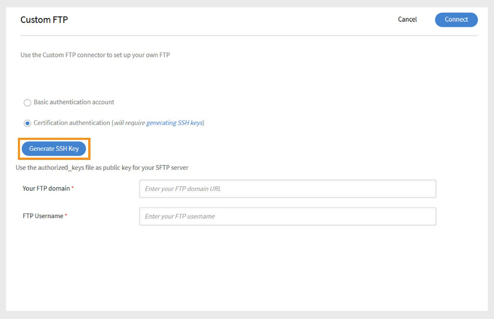

# Connecteur FTP personnalisé dans Adobe Learning Manager

## Introduction

Le connecteur FTP personnalisé de Adobe Learning Manager permet un exchange sécurisé et automatisé des données entre Adobe Learning Manager et le serveur FTP (SFTP) de votre organisation. Grâce à cette intégration, les administrateurs peuvent importer des données utilisateur à partir de systèmes externes et exporter les relevés de notes des élèves ou les données de compétence sur une base planifiée. Cette configuration rationalise la synchronisation des données, réduit le travail manuel et prend en charge l’intégration transparente avec les systèmes de RH ou de création de rapports tiers. La configuration nécessite la coordination de votre équipe informatique et l’assistance du gestionnaire de succès client (CSM) d’Adobe.

>[!NOTE]
>
>Pour configurer une connexion FTP personnalisée, contactez votre gestionnaire de succès client (CSM). Le processus de configuration peut impliquer l’assistance de votre équipe informatique pour ajouter des adresses IP à la liste d’autorisation, ouvrir les ports requis et créer des dossiers avec les autorisations d’accès nécessaires.

## Fonctionnalités prises en charge

Le connecteur FTP personnalisé prend en charge les actions suivantes :

### Importation de données

Le processus d’importation des utilisateurs récupère automatiquement les données des employés depuis votre serveur FTP et les importe dans Adobe Learning Manager. Ceci est utile lors de l’intégration de plusieurs systèmes qui génèrent des fichiers CSV contenant des données utilisateur.

- Placez les fichiers CSV dans le dossier **import** désigné sur votre serveur FTP.
- Adobe Learning Manager détecte les fichiers, les fusionne si nécessaire et importe les données utilisateur en fonction de la planification définie.

Reportez-vous à la section [Planification](/help/migrated/integration-admin/feature-summary/custom-ftp-connector.md#scheduling-reports) pour savoir comment automatiser ce processus.

### Mappage des attributs

En tant qu’administrateur d’intégration, vous pouvez mapper les colonnes de votre fichier CSV à des attributs regroupables dans Adobe Learning Manager.

- Le mappage est une configuration unique.
- Le même mappage est utilisé pour les importations ultérieures.
- Vous pouvez reconfigurer les mappages si votre structure de données change.

### Exportation de données

Adobe Learning Manager vous permet d’exporter :

- Compétences des utilisateurs
- Relevés de notes des élèves

Ces fichiers de rapport sont placés dans le dossier d’exportation sur votre FTP et peuvent être utilisés par des systèmes tiers pour la création de rapports, l’analyse ou d’autres processus en aval.

### Planification des rapports

Les administrateurs d’intégration peuvent planifier les deux opérations suivantes :

- Importations utilisateur
- Exportations du relevé de notes de l’élève

La planification garantit que votre environnement Adobe Learning Manager reste à jour avec vos systèmes sources. Vous pouvez configurer des synchronisations quotidiennes ou des intervalles personnalisés selon vos besoins.

## Configuration du connecteur FTP personnalisé

Pour configurer le connecteur FTP personnalisé :

1. Connectez-vous à Adobe Learning Manager en tant qu’administrateur d’intégration.
2. Survolez la vignette **FTP personnalisé** et sélectionnez **Se connecter**.

   
   _Sélectionnez Se connecter pour configurer le connecteur FTP personnalisé_

### Choisir la méthode d’authentification

Vous pouvez configurer la connexion FTP personnalisée en utilisant l’un des deux types d’authentification suivants :

#### Compte d’authentification de base

1. Saisissez les informations suivantes :

   - **Votre domaine FTP**
   - **Nom d&#39;utilisateur FTP**
   - **Mot de passe FTP**

   
   _Tapez le domaine FTP, le nom d&#39;utilisateur et le mot de passe pour la configuration._

2. Sélectionnez **Se connecter**.

#### Authentification par certificat

Si votre serveur FTP prend en charge l’authentification par clé SSH :

1. Sélectionnez **Générer la clé SSH**.

   
   _Sélectionnez Générer la clé SSH pour télécharger la clé_

2. La clé publique sera téléchargée sur votre ordinateur.
3. Ajoutez cette clé à la liste des clés autorisées de votre serveur FTP.
4. Saisissez les informations suivantes :

   - **Votre domaine FTP**
   - **Nom d&#39;utilisateur FTP**
5. Sélectionnez **Se connecter**.

>[!NOTE]
>
>Seuls les serveurs **SFTP** sont pris en charge pour la configuration FTP personnalisée.

## Configuration post-connexion

Une fois la connexion établie :

- Adobe Learning Manager crée automatiquement des dossiers pour l&#39;**importation** et l&#39;**exportation** sur votre serveur FTP.
- Vous pouvez commencer à importer et à exporter des données en fonction de vos paramètres de planification et de mappage.
