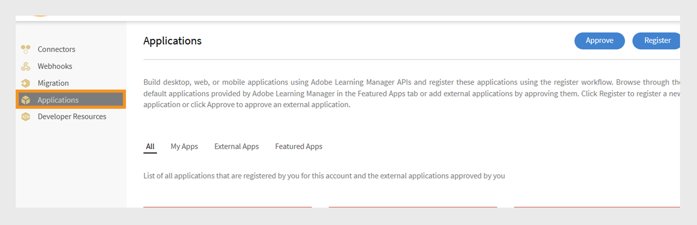
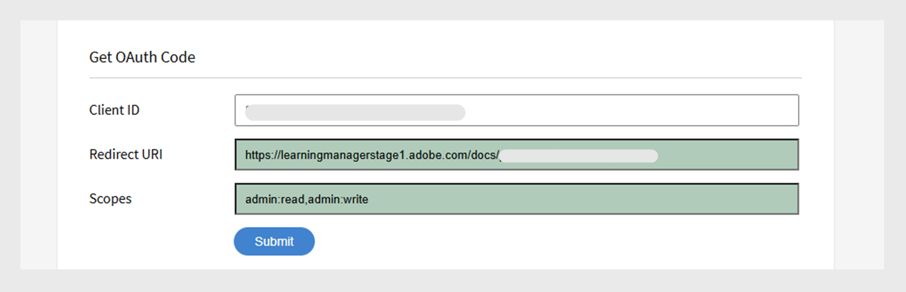

# Manuel du développeur Adobe Learning Manager

## Vue d’ensemble

Adobe Learning Manager fournit des API RESTful qui permettent aux développeurs d’intégrer et de personnaliser efficacement des applications ou des workflows. Le manuel du développeur fournit des conseils sur l’utilisation de ces API, couvrant des sujets tels que l’authentification, les modèles de données et l’intégration avec d’autres applications. En outre, ce guide [documentation de référence API](https://learningmanager.adobe.com/docs/primeapi/v2/) aide les développeurs à créer des applications externes ou des workflows principaux qui interagissent avec diverses fonctionnalités de Adobe Learning Manager, notamment la création de cours, le suivi de la progression des élèves, le mappage des compétences, la certification, la ludification et les transcriptions.

Ce manuel traite des points suivants :

* Authentification OAuth2.0
* Modèles d’objet API
* Inclure, champs et autres paramètres
* Cas d’utilisation réels

>[!IMPORTANT]
>
>Ce manuel du développeur couvre exclusivement les API V2 de Adobe Learning Manager. Tous les exemples, structures de requête et workflows d’authentification décrits dans ce guide sont spécifiques aux points d’entrée /primeapi/v2/. Pour plus d&#39;informations sur les anciennes versions ou les API obsolètes, consultez la [documentation de référence des API](https://learningmanager.adobe.com/docs/primeapi/v2/).

## Scénarios d’utilisation de l’API

Les développeurs peuvent utiliser les API Learning Manager pour améliorer ou intégrer Learning Manager à d’autres applications d’entreprise. Vous pouvez créer des applications web, de bureau ou mobiles à l’aide de n’importe quelle technologie. Les développeurs peuvent accéder aux données de Learning Manager, mais vous pouvez contrôler où et comment l’application est utilisée.

## Authentification à l’aide d’OAuth 2.0

Pour accéder aux API Adobe Learning Manager en toute sécurité, vous devez vous authentifier à l’aide du mécanisme OAuth 2.0 d’ALM. Ce processus comprend l’enregistrement de votre application, la génération d’un code d’autorisation, son échange contre un jeton d’actualisation, et enfin l’utilisation du jeton d’actualisation pour obtenir un jeton d’accès.

### Enregistrement d’une application

Intégrez Adobe Learning Manager à des applications externes pour une plus grande polyvalence. Les étapes impliquent l’accès à l’interface Integration Administrator, l’enregistrement de l’application et l’obtention de l’ID client et du secret. Générez des jetons d’authentification OAuth 2.0, y compris des jetons d’autorisation, d’actualisation et d’accès, à partir de Adobe Learning Manager. Utilisez le flux OAuth 2.0 pour authentifier et autoriser votre application en toute sécurité. Le jeton d’accès a une validité de sept jours.

1. Connectez-vous à Adobe Learning Manager en tant qu’administrateur d’intégration.
2. Sélectionnez **[!UICONTROL Applications]** dans le volet de gauche.

   

3. Sélectionnez **[!UICONTROL S&#39;inscrire]** et ajoutez les informations suivantes :

   * **[!UICONTROL Nom de l&#39;application]** : saisissez le nom de votre application (50 caractères maximum).
   * **[!UICONTROL URL]** : URL officielle de votre entreprise ou application. Utilisé pour l’identification et la référence.
   * **[!UICONTROL Rediriger les domaines]** : spécifiez les domaines (par exemple, [http://learningmanager.adobe.com](http://learningmanager.adobe.com)) vers lesquels ALM peut rediriger après autorisation.  Vous pouvez mentionner plusieurs URL, mais elles doivent être valides.
   * **[!UICONTROL Description]** : brève description de l&#39;action de l&#39;application.
   * **[!UICONTROL Domaines]** : sélectionnez l’une des six options disponibles pour définir la portée de votre application. En fonction de votre choix mentionné ici, les points de terminaison de l’API Learning Manager sont accessibles pour votre application. Par exemple, si vous avez choisi Accès en lecture au rôle d’élève, tous les points de terminaison de l’API de l’élève Learning Manager sont accessibles en lecture seule à votre application.

      * Accès en lecture/écriture au rôle d’administrateur : permet à l’application d’accéder aux données ou de les modifier en tant qu’administrateur.
      * Accès en lecture/écriture au rôle d’élève : permet à l’application d’accéder aux données des élèves ou de les modifier.
      * Accès en lecture/écriture xAPI : permet à l’application d’accéder aux instructions Experience API (xAPI) et de les envoyer.

   * **[!UICONTROL Pour ce compte uniquement ?]**

      * **[!UICONTROL Oui]** : si vous choisissez Oui, l&#39;application n&#39;est pas visible pour les autres administrateurs de compte.
      * **[!UICONTROL Non]** : si vous choisissez Non, les autres administrateurs de compte peuvent également accéder à cette application, mais ils doivent utiliser l’id de l’application pour y accéder. L’ID d’application est généré et affiché en mode de modification d’application Learning Manager.

     

4. Sélectionnez **[!UICONTROL Enregistrer]** pour enregistrer l&#39;application.

   * Une fois l’application enregistrée, elle est disponible dans la liste des applications créées dans le compte. Sélectionnez l’application et vous verrez les éléments suivants en plus des champs saisis précédemment :
   * ID de l’application : il s’agit de l’ID client. Cet ID indique à ALM l&#39;application qui demande l&#39;accès. Il est inclus dans les demandes d’API pour identifier l’application.
   * Secret d’application : permet d’authentifier votre application et de vérifier son identité lors des étapes d’exchange du jeton (par exemple, lors de la demande d’un jeton d’actualisation ou d’un jeton d’accès).

   

## Obtenir un jeton d’accès

### Obtenir le code d’autorisation de la redirection

Après avoir obtenu l’ID client et la clé secrète client, utilisez-les pour demander un jeton d’accès, qui est utilisé pour authentifier les appels API.

Pour commencer le flux de code d’autorisation, ajoutez l’URL suivante dans un navigateur :

```
GET https://learningmanager.adobe.com/oauth/o/authorize?client_id=<Enter your clientId>&redirect_uri=<Enter a url to redirect to>&state=<Any String data>&scope=<one or more comma separated scopes>&response_type=CODE 
```

Une fois que l’utilisateur a autorisé l’application, Adobe Learning Manager redirige vers l’URI_redirection spécifiée avec un paramètre de requête ajouté :

[https://yourapp.com/callback?code=abc123xyz](https://yourapp.com/callback?code=abc123xyz)

Un code de paramètre est ajouté avec l’URI de redirection.

### Obtenir le jeton d’actualisation à partir du code

Après avoir obtenu le code, utilisez n’importe quel outil API et ajoutez la demande de POST suivante :

```https://learningmanager.adobe.com/oauth/token ```

**Corps de la demande (x-www-form-urlencoded)** :

```
grant_type=authorization_code  
&code=abc123xyz  
&client_id=<your_client_id>  
&client_secret=<your_client_secret>  
&redirect_uri=<your_redirect_url> 
```

**Réponse**

```
{ 

  "access_token": "eyJhbGciOiJIUzI1...", 
  "refresh_token": "xTjlfz0jCk6gF1...", 
  "expires_in": 604800, 
  "token_type": "Bearer" 

} 
```

Utilisez access_token dans l’en-tête d’autorisation pour effectuer des demandes d’API authentifiées.

### Utilisation du jeton d’accès dans un appel API

Vérifiez le jeton d’accès à l’aide des éléments suivants :

```
GET https://learningmanager.adobe.com/oauth/token/check?access_token=<access_token> 
```

Un jeton d’accès est valide pendant sept jours. Après sept jours, vous devez générer un nouveau jeton d’accès à l’aide du jeton d’actualisation. Si vous générez un nouveau jeton d’accès à partir du jeton d’actualisation alors qu’un jeton d’accès existant est toujours valide, le jeton existant est renvoyé.

### Obtenir des jetons d’accès pour le test et le développement

Lorsque vous travaillez avec des API Adobe Learning Manager (ALM), les développeurs ont besoin d’un jeton d’accès OAuth 2.0 valide pour authentifier les demandes d’API. La génération de ce jeton via le flux OAuth standard peut être complexe et prendre du temps, en particulier pour des tests, un apprentissage ou un développement rapides. Adobe Learning Manager fournit un outil de génération de jeton pour simplifier ce processus.

Cet outil est idéal pendant :

* Versions de validation de principe

* Développement à un stade précoce

* Résolution des problèmes d’intégration d’API

Ces jetons sont destinés uniquement à votre usage personnel pendant les phases de développement et de débogage. Gardez à l’esprit que les jetons de test accordent l’accès à vos données ALM, il est donc essentiel de les gérer en toute sécurité. Ne partagez jamais vos jetons de test avec d’autres personnes, ne les utilisez jamais dans des applications de production et ne les incluez jamais dans des référentiels de code publics. Traitez-les comme des mots de passe pour assurer la sécurité de votre compte et de vos données.

1. Connectez-vous à Adobe Learning Manager en tant qu’administrateur d’intégration.
2. Sélectionnez **[!UICONTROL Ressources pour le développeur]**, puis **[!UICONTROL Sélectionner des jetons d’accès pour le test et le développement]**.

   

3. Tapez l&#39;**[!UICONTROL ID client]** que vous avez obtenu après la création d&#39;une application pour obtenir le code OAuth. Sélectionnez ensuite **[!UICONTROL Envoyer]**.

   

4. Ajoutez l&#39;**[!UICONTROL ID client]** et le **[!UICONTROL secret client]** pour obtenir le jeton d&#39;actualisation. Sélectionnez ensuite **[!UICONTROL Envoyer]**. OAuth est pré-rempli à partir de l’étape précédente.

   

5. Ajoutez l’ID client et le secret client pour obtenir le jeton d’accès. Sélectionnez ensuite **[!UICONTROL Envoyer]**.

   

6. Ajoutez le jeton d’accès et sélectionnez Envoyer pour obtenir les détails du jeton d’accès.

   

Lors de la sélection de **[!UICONTROL Envoyer]**, le jeton d’accès est vérifié et la réponse suivante apparaît :

```
{ 
  "access_token": "access token", 
  "refresh_token": "refresh token", 
  "user_role": "admin", 
  "account_id": "1234", 
  "user_id": "123456", 
  "expires_in": 604800 
} 
```

Comme précédemment, le jeton d’accès pour les tests expire dans sept jours.

### Utiliser un outil API pour tester les points de terminaison

Bien que vous puissiez utiliser n’importe quel outil de test d’API tiers, nous utiliserons Postman pour tester les points de terminaison. Les exemples de ce document utilisent Postman pour tester les points de terminaison.

1. Ouvrez Postman et créez une nouvelle demande.
2. Sélectionnez l’onglet Autorisation.
3. Définissez le type d’authentification sur Jeton du porteur.

   
4. Collez le jeton d’accès que vous avez obtenu à la section précédente, dans le champ Jeton.

   

5. Ajoutez les éléments suivants dans l’onglet En-têtes.

   * Clé : Accepter
   * Valeur : application/json
6. Entrez votre point de terminaison API dans le champ URL. Exemple : [https://learningmanager.adobe.com/learningManager/api/v2/users](https://learningmanager.adobe.com/learningManager/api/v2/users)
Consultez [Référence de l&#39;API Adobe Learning Manager](https://learningmanager.adobe.com/docs/primeapi/v2/) pour plus d&#39;informations.
7. Sélectionnez Envoyer pour effectuer la demande API.

## Types d’API

### API d’administration

Les API d’administration de Adobe Learning Manager permettent aux administrateurs d’automatiser et de gérer les opérations d’apprentissage à grande échelle.

À l’aide des API d’administration, les développeurs peuvent :

>[!NOTE]
>
>La liste n&#39;est pas exhaustive.

* **Gérer les utilisateurs et les groupes** : créez, mettez à jour et supprimez des utilisateurs ou attribuez-les à des groupes.
* **Inscrire des élèves** : automatisez l’inscription aux cours, parcours d’apprentissage ou certifications.
* **Suivre la progression de l’élève** : récupérez la progression du cours/module, les scores du quiz et l’état d’achèvement.
* **Générer des rapports** : accédez aux données sur l’activité, l’engagement et les performances de l’élève.
* **Gérer le contenu** : créez et organisez des cours et des objets d’apprentissage.

Voir [Référence API Adobe Learning Manager](https://learningmanager.adobe.com/docs/primeapi/v2/) pour plus d&#39;informations.

### API des élèves

Les API de l’élève sont conçues pour les utilisateurs authentifiés (élèves) et vous permettent d’accéder à des informations spécifiques à l’élève. Ces API permettent d’effectuer les tâches suivantes :

* Accès aux cours et à la progression d’un élève
* Récupération des badges ou des certifications obtenues
* Mise à jour des informations de profil de l’élève
* Afficher les compétences associées aux cours terminés

**Points clés :**

* Ces API nécessitent un jeton utilisateur authentifié, garantissant la sécurité et la confidentialité des données.
* Les API sont destinées aux scénarios dans lesquels les utilisateurs sont entièrement enregistrés et connectés, plutôt que des utilisateurs anonymes ou partagés.

Voir [Référence API Adobe Learning Manager](https://learningmanager.adobe.com/docs/primeapi/v2/) pour plus d&#39;informations.

## Conception d’API et paramètres courants

Les API permettent aux développeurs d’accéder aux ressources clés de Learning Manager, telles que les utilisateurs, les cours, les compétences, les certifications et les programmes d’apprentissage. Il suit les principes REST, en utilisant des méthodes HTTP (GET, POST, PUT, DELETE) pour les opérations de données.

| | |
|--|--|
| Méthodes | GET, PUT, POST, DELETE |
| Format | application/vnd.api+json, application/json. [En savoir plus](https://developer.mozilla.org/en-US/docs/Web/HTTP/Guides/MIME_types/Common_types) sur les types MIME courants. |
| Adresse URL de base | [https://learningmanager.adobe.com/primeapi/v2/](https://learningmanager.adobe.com/primeapi/v2/) |

### Paramètres courants

| Paramètres | Objectif |
|--|--|
| inclure | Obtenez des ressources associées en un seul appel. |
| champs | Sélectionnez des attributs spécifiques pour réduire la charge utile. |
| filtre | Limiter les résultats (par exemple, par ID, nom) |
| tri | Résultats de la commande. |
| page[limit], page[offset] | Prise en charge de la pagination |

Voici une brève explication de chacun d’eux :

### inclure

Les API ALM peuvent être utilisées pour récupérer des informations utiles lors de la création d’une application personnalisée ou d’un LMS sans interface utilisateur. Les points de terminaison API peuvent en outre être inclus avec des paramètres « include » supplémentaires pour récupérer les informations supplémentaires qui sont en relation avec les données reçues par défaut. Ces relations sont des relations de modèle de données. Par exemple, lors d’un appel pour obtenir des détails d’utilisateur, vous recevrez les informations utilisateur et la relation de l’ID de responsable et de l’ID de compte ALM. Avec le paramètre include, vous pouvez extraire des détails supplémentaires ainsi que les détails de l&#39;utilisateur, tels que les détails de son responsable et les détails du compte ALM de manière détaillée.
En bref, le paramètre **include** est utilisé dans les appels API pour récupérer les ressources associées (liées) avec la ressource principale dans une seule réponse. Cette fonctionnalité est utile lorsque vous souhaitez accéder à des données imbriquées ou dépendantes, telles que les modules d’un cours ou les compétences mappées à un élève, sans passer d’appels API distincts.

Principaux avantages :

* Réduit les appels d’API multiples : évite d’avoir à demander manuellement chaque ressource associée.
* Amélioration de l’efficacité : développement plus rapide, charge de serveur réduite et rendu plus rapide des données.
* Garantit la cohérence des données : récupère toutes les données associées dans un instantané cohérent.

**Utilisation du paramètre include**

Ajoutez le paramètre include à votre URL API et spécifiez les entités associées à inclure.

**Chemins d’inclusion courants**

| Inclure la valeur | Description |
|---|---|
| instances | Renvoie toutes les instances de l’objet d’apprentissage |
| inscription | Renvoie les détails d’inscription de l’utilisateur. |
| instances.loResources.resources | Récupère les modules et les ressources dans une instance |
| additionalResources | Retourne les ressources supplémentaires associées |
| skills.skillLevel.badge | Récupère les niveaux de compétence et les badges associés |
| prerequisiteLO | Objets d’apprentissage requis |
| subLOs | Récupère les objets de sous-apprentissage (utilisés dans les programmes d&#39;apprentissage ou les certifications) |
| subLOs.enrollment | Inscription pour les objets de sous-apprentissage |
| instances.badge | Badge attribué pour terminer une instance de cours |
| subLOs.subLOs.instances.loResources.resources | Ressources profondément imbriquées dans une instance de sous-objet d’apprentissage |

**Exemple 1**

Récupérez les détails d’un utilisateur à l’aide du paramètre userID dans le point de terminaison.

```
https://learningmanager.adobe.com/primeapi/v2/users/<userID>
```

```
GET https://learningmanager.adobe.com/primeapi/v2/users/<userID>
```

Dans la réponse, vous pouvez voir que l&#39;objet de données a une relation avec le compte et le responsable de l&#39;utilisateur.

```
"relationships": {
            "account": {
                "data": {
                    "id": "1010",
                    "type": "account"
                }
            },
            "manager": {
                "data": {
                    "id": "3400476",
                    "type": "user"
                }
            }
        }
```

En utilisant le paramètre include dans la demande, vous pouvez récupérer des informations détaillées sur le responsable comme indiqué ci-dessous :

```
GET https://learningmanager.adobe.com/primeapi/v2/users/<userid>?include=manager
```

**Exemple 2**

Pour récupérer les détails du cours, utilisez le paramètre include dans l&#39;appel de point de terminaison. Le point de terminaison suivant obtient les informations de cours ainsi que ses relations.

```
GET https://learningmanager.adobe.com/primeapi/v2/learningObjects/<courseID>
```

Les relations sont affichées dans la réponse comme suit :

* instances
* compétences
* auteurs

```
"relationships": {
            "authors": {
                "data": [
                    {
                        "id": "3400468",
                        "type": "user"
                    }
                ]
            },
            "instances": {
                "data": [
                    {
                        "id": "course:16444_31598",
                        "type": "learningObjectInstance"
                    }
                ]
            },
            "skills": {
                "data": [
                    {
                        "id": "course:16444_1796",
                        "type": "learningObjectSkill"
                    },
                    {
                        "id": "course:16444_3103",
                        "type": "learningObjectSkill"
                    }
                ]
            }
        }
```

D’autres relations pourraient inclure (non présents dans la réponse ci-dessus) :

* prerequisiteLO
* objets d’apprentissage supplémentaires
* additionalResources

Pour obtenir des données détaillées sur les instances et les compétences, incluez « instances, compétences » dans le paramètre include.

```
GET https://learningmanager.adobe.com/primeapi/v2/learningObjects/<courseID>?include=instances,skills
```

Maintenant, par exemple, si vous voulez récupérer plus de données associées à l&#39;instance de cours, telles que loResources (informations de module du cours), appliquez loResources en tant qu&#39;inclusion imbriquée.

```
GET https://learningmanager.adobe.com/primeapi/v2/learningObjects/<courseID>?include=instances.loResources
```

En outre, combinez des compétences et des instances avec un include imbriqué.

```
GET https://learningmanager.adobe.com/primeapi/v2/learningObjects/<courseID>?include=instances,instances.loResources,skills
```

**Autres filtres inclus**

<table>
  <tbody>
  <tr>
   <td>
    <p style="text-align: left;"><b>Programmes d’apprentissage</b></p></td>
   <td>
    <p style="text-align: left;"><b>Cours</b></p></td>
  </tr>
  <tr>
  <td><br>subLOs.prerequisiteLOs.enrollment</br><br>subLOs.subLOs.prerequisiteLOs.enrollment</br><br>subLOs.enrollment.loResourceGrades</br><br>subLOs.subLOs.enrollment.loResourceGrades</br><br>subLOs.subLOs.instances.loResources.resources.room</br><br>subLOs.instances.loResources.resources.room</br><br>subLOs.supplementaryResources</br><br>subLOs.enrollment</br><br>SubLOs.enrollment.loInstance.loResources.resources</br><br>subLOs.supplementaryLOs.instances.loResources.resources</br>
  </td>
  <td>
  <br>instances.enrollment.loResourceGrades</br><br>enrollment.loInstance.loResources.resources</br>prerequisiteLOs</br><br>auteurs</br><br>instances.loResources.resources</br><br>additionalLOs.instances.loResources.resources</br><br>additionalResources</br><br>instances.badge</br><br>skills.skillLevel.badge</br><br>skills.skillLevel.skill</br><br>instances.loResources.resources.room</br><br>prerequisiteLOs.enrollment</br><br>enrollment.loResourceGrades</br>
  </td>
  </tr>
  </table>

#### champs

Les attributs et les relations d’un objet API sont appelés Champs. Utilisez Fields comme paramètre dans les appels API pour récupérer des attributs spécifiques du modèle. Sans le paramètre Fields, l&#39;appel API récupère tous les attributs disponibles.

Par exemple, dans l&#39;appel d&#39;API suivant, fields[skill]=name vous récupère l&#39;attribut name du modèle de compétence seul.

```
GET https://learningmanager.adobe.com/primeapi/v2/users/3400490/userSkills/3400490_1796_1?include=skillLevel.skill&fields[skill]=name
```

#### pagination

La pagination d’API est une technique utilisée dans les API pour décomposer de grands ensembles de données en blocs plus petits et gérables, appelés pages, plutôt que de renvoyer l’ensemble des données dans une seule réponse.

La pagination réduit la charge du client et du serveur, limite la taille des réponses pour éviter les goulots d’étranglement sur le serveur ou permet d’afficher les données dans des tableaux ou des listes page par page.

**Fonctionnement de la pagination dans les API ALM**

Les API ALM prennent en charge la pagination via des paramètres tels que :

* page[limit] : nombre d&#39;enregistrements par page.
* page[offset] : nombre d&#39;enregistrements à ignorer.
* page[curseur] : pointeur vers le jeu de résultats suivant. Au lieu d’utiliser la pagination basée sur le décalage (qui ignore un certain nombre d’enregistrements), la pagination basée sur le curseur utilise un marqueur unique renvoyé par l’API pour récupérer la page de résultats suivante.

Voici comment utiliser la pagination dans les API :

**page[limite]**

Alors que [https://learningmanager.adobe.com/primeapi/v2/users](https://learningmanager.adobe.com/primeapi/v2/users) renvoie tous les utilisateurs et les informations associées dans un seul appel, l&#39;utilisation de page[limit] limite le nombre de résultats à la valeur spécifiée.

Pour renvoyer uniquement cinq enregistrements d’utilisateur dans un seul appel, utilisez l’API suivante :

```
GET https://learningmanager.adobe.com/primeapi/v2/users?page[limit]=5
```

**décalage de page[2}]**

Utilisez cet appel API pour renvoyer trois enregistrements d’utilisateur, ignorer les cinq premiers et commencer à partir du sixième.

```
GET https://learningmanager.adobe.com/primeapi/v2/users?page[limit]=3&page[offset]=5 
```

**page[curseur]**

1. Commencez par demander la première page avec une limite de 5.

   ```
   GET https://learningmanager.adobe.com/primeapi/v2/users?page[limit]=5
   ```

2. Copiez la valeur du curseur dans links.next et utilisez-la dans la requête suivante :

   ```
   "links": {
       "self": "https://learningmanager.adobe.com/primeapi/v2/users?page[limit]=5",
       "next": "https://learningmanager.adobe.com/primeapi/v2/users?page[limit]=5&page[cursor]=3400482"
    }
   ```

3. Envoyez la demande suivante :

   ```
   GET https://learningmanager.adobe.com/primeapi/v2/users?page[limit]=5&page[cursor]=3400482
   ```

Cette action renvoie le jeu suivant de 10 enregistrements, en commençant après le dernier élément de la page précédente.

#### filtre

Le paramètre de filtre vous permet d’affiner les résultats de l’API en fonction d’une ou plusieurs valeurs de champ.

Les API Adobe Learning Manager fournissent différentes variations du paramètre de filtre pour affiner les réponses.

Voir [Référence API Adobe Learning Manager](https://learningmanager.adobe.com/docs/primeapi/v2/) pour plus d&#39;informations.

Cet exemple montre comment filtrer les assistances à la tâche auxquelles un élève s&#39;est inscrit à l&#39;aide du point de terminaison avec le paramètre de filtre :

```
GET https://learningmanager.adobe.com/primeapi/v2/users/3400480/enrollments?filter.loTypes=jobAid
```

#### tri

Le paramètre sort permet de trier les résultats de l’API par ordre croissant ou décroissant en fonction d’un ou plusieurs champs.

Adobe Learning Manager propose différentes options de tri pour trier la réponse de l’API. Voir [Référence API Adobe Learning Manager](https://learningmanager.adobe.com/docs/primeapi/v2/) pour plus d&#39;informations.

Dans l&#39;exemple précédent, vous allez maintenant trier l&#39;inscription de l&#39;utilisateur aux programmes d&#39;apprentissage par date d&#39;inscription dans l&#39;ordre croissant.

```
GET https://learningmanager.adobe.com/primeapi/v2/users/3400480/enrollments?filter.lotypes=learningProgram&sort=dateEnrolled
```

## Présentation des modèles d’API

Les API Adobe Learning Manager permettent aux développeurs d’accéder aux objets Learning Manager en tant que ressources RESTful. Chaque point de terminaison de l’API représente une ressource. Il s’agit généralement d’une instance d’objet comme Badge ou un ensemble de ces objets. Les développeurs utilisent ensuite des verbes HTTP tels que PUT, GET, POST et DELETE pour effectuer les opérations CRUD sur ces objets (collections).


| Objet Learning Manager | Description |
|----|----|
| account | Encapsule les détails d’un client Learning Manager. |
| badge | Un badge est un gage de réussite que les élèves obtiennent lorsqu&#39;ils atteignent des étapes spécifiques au cours. |
| catalog | Le catalogue est une collection d’objets d’apprentissage. |
| l&#39;interface | L’utilisateur est le modèle principal de Learning Manager. Les utilisateurs sont généralement les apprenants internes ou externes d’une organisation qui utilisent des objets d’apprentissage. Cependant, ils peuvent jouer d’autres rôles tels que celui de l’auteur et du responsable outre le rôle de l’élève. L’ID de l’utilisateur, le type, le courrier électronique sont quelques-uns des attributs en ligne. |
| resource | Cet élément est utilisé pour modéliser chaque ressource de contenu qu’un module cherche à encapsuler. Toutes les ressources encapsulées dans un objet « loResource » sont équivalentes en termes d’objectif d’apprentissage, mais elles diffèrent les unes des autres en termes de type de livraison ou de paramètres régionaux de contenu. |
| userNotification | Ce modèle contient des informations de notification relatives à un élève. |
| userSkill | UserSkill indique la proportion d’un niveau de compétence unique atteinte par un seul utilisateur. |
| userBadge | UserBadge met en relation un badge avec un utilisateur. Il contient des détails tels que le moment où il a été atteint, assertionUrl et ainsi de suite. |
| skill | Le modèle de compétences se compose de niveaux et de crédits. Les compétences peuvent être acquises par les élèves après la fin du cours concerné. |
| skillLevel | Un niveau de compétence comprend un ou plusieurs cours à suivre pour acquérir un niveau ainsi que les crédits associés. |
| learningObject | Un objet d’apprentissage est une abstraction pour différents types d’objets auxquels les utilisateurs peuvent s’inscrire et auprès desquels ils peuvent apprendre. Actuellement, Learning Manager propose les quatre types d’objets d’apprentissage : cours, certification, programme d’apprentissage et assistance à la tâche. |
| learningObjectInstance | Instance spécifique d’un objet d’apprentissage. |
| learningObjectResource | Cela équivaut au concept de module. Un cours est composé d’un ou plusieurs modules. Dans Learning Manager, un module peut être fourni de diverses manières équivalentes. Par conséquent, loResource encapsule essentiellement toutes ces ressources équivalentes. |
| loResourceGrade | Cet objet encapsule le résultat de l’utilisateur qui consomme une ressource spécifique dans le contexte d’un objet d’apprentissage auquel il est inscrit. Il contient des informations telles que la durée passée par l’utilisateur dans la ressource, le pourcentage de progression effectué par l’utilisateur, le statut Réussite/Échec et le score obtenu par l’utilisateur dans tout quiz associé. |
| calendar | Un objet Calendrier est une liste de cours en salle de classe ou en salle de classe virtuelle à venir auxquels l’utilisateur peut s’inscrire. |
| l1FeedbackInfo | Le retour d’informations L1 encapsule les réponses fournies par un élève aux questions de retour d’informations associées à des objets d’apprentissage. En général, ces informations sont collectées une fois que l’utilisateur a terminé un objet d’apprentissage s’il est configuré pour collecter ces commentaires des élèves. |
| enrollment | Cette abstraction encapsule les détails relatifs à la transaction représentant l’affectation d’un utilisateur spécifique à une instance d’objet d’apprentissage spécifique. |


## API et points de terminaison des élèves

Voici les points de terminaison clés de l’API pour travailler avec les données des élèves. Ces API guident les développeurs sur l&#39;interaction avec les informations des élèves, le suivi de la progression, la gestion des inscriptions et la récupération du contenu du cours.

### Récupérer les détails de tous les élèves

Récupérez les détails de l’élève (nom, adresse électronique, UUID, profil utilisateur, etc.). Utilisez l’API pour répertorier tous les élèves du compte.

```
GET https://learningmanager.adobe.com/primeapi/v2/users
```

### Récupérer les détails d’un élève spécifique

Si vous souhaitez afficher le profil d’un élève par ID, utilisez l’API suivante pour passer un appel.

```
GET https://learningmanager.adobe.com/primeapi/v2/users/<userID>
```

### Répertorier tous les cours, programmes d’apprentissage, assistances à la tâche et certifications

Récupérez les détails de tous les objets d’apprentissage dans lesquels l’élève est inscrit, a terminé ou a été activé par l’administrateur.

```
GET https://learningmanager.adobe.com/primeapi/v2/learningObjects
```

### Obtention des détails d’un objet d’apprentissage spécifique

Obtenir des informations détaillées sur un objet d’apprentissage. Elle comprend la date de création, la date de publication, la date de mise à jour et d’autres informations.

```
GET https://learningmanager.adobe.com/primeapi/v2/learningObjects/<LearningObjectID>
```

### Récupérer la liste des compétences liées aux cours

Afficher les compétences attribuées à tous les élèves du compte.

```
GET https://learningmanager.adobe.com/primeapi/v2/skills
```

### Obtenir des informations sur le niveau de compétence et le badge

Vérifier les progrès des élèves dans les parcours d’apprentissage basés sur les compétences.

```
GET https://learningmanager.adobe.com/primeapi/v2/skills/<skillID>?include=levels
```

### Liste de tous les badges créés pour un compte

Effectuez un appel vers le point de terminaison suivant pour récupérer une liste de tous les badges créés pour un compte dans une organisation.

```
GET https://learningmanager.adobe.com/primeapi/v2/badges
```

### Récupération des informations d’un badge

Obtenir des informations détaillées sur un badge, notamment son nom, son URL (image) et son statut.

```
GET https://learningmanager.adobe.com/primeapi/v2/badges/<skillID>
```

Cela produit la réponse suivante :

```
{
    "links": {
        "self": "https://learningmanager.adobe.com/primeapi/v2/badges/499"
    },
    "data": {
        "id": "499",
        "type": "badge",
        "attributes": {
            "imageUrl": "https://cpcontentsdev.adobe.com/public/account/1010/accountassets/1010/badges/test_57a5ab00555a475a8fc6671562184dc9.png",
            "name": "penguins",
            "state": "Retired"
        }
    }
}
```

## Autres exemples d’utilisation des API

### Création d’un utilisateur

1. Utiliser le point de terminaison :

   ```
   POST https://learningmanager.adobe.com/primeapi/v2/users
   ```

   Traite les attributs du corps de l’API ou de la payload JSON pour générer un utilisateur, puis fournit à cet utilisateur l’ID utilisateur correspondant renseigné.

2. Utilisez la charge utile suivante comme corps :

   ```
   { 
      "data": { 
        "type": "user", 
        "attributes": { 
         "email": "bob@example.com", 
          "name": "Bob", 
          "userType": "INTERNAL" 
        } 
      } 
    }
   ```

Il existe trois attributs obligatoires :

* e-mail : ID de messagerie de l’utilisateur. Cette valeur doit être unique pour chaque utilisateur.
* name : Le nom de l&#39;utilisateur.
* userType : actuellement, seuls les utilisateurs internes peuvent être ajoutés en utilisant ce point de terminaison. Le userType doit être « INTERNAL ».

La réponse suivante s’affiche :

```
{
  "links": {
      "self": "https://learningmanager.adobe.com/primeapi/v2/users"
  },
  "data": {
      "id": "13386404",
      "type": "user",
      "attributes": {
          "avatarUrl": "https://cpcontents.adobe.com/public/images/default_user_avatar.svg",
          "email": "bob@example.com",
          "name": "Bob",
          "pointsEarned": 0,
          "pointsRedeemed": 0,
          "preferredResolution": "AUTO",
          "profile": "Employee",
          "roles": [
              "Learner"
          ],
          "state": "ACTIVE",
          "userType": "Internal",
          "userUniqueId": "bob@example.com"
      },
      "relationships": {
          "account": {
              "data": {
                  "id": "1010",
                  "type": "account"
              }
          },
          "manager": {
              "data": {
                  "id": "3400468",
                  "type": "user"
              }
          }
      }
  }
}
```

### Supprimer un utilisateur

1. Obtenez l’ID utilisateur de l’utilisateur que vous souhaitez supprimer.

   ```
   GET https://learningmanager.adobe.com/primeapi/v2/users/<userID>
   ```

2. Ensuite, à l’aide de DELETE, effectuez l’appel suivant :

   ```
   DELETE https://learningmanager.adobe.com/primeapi/v2/users/<userID>
   ```

Une réponse 204 s’affiche. Un code de réponse 204 indique le succès sans qu’aucun contenu ne soit renvoyé. Le serveur a traité la demande avec succès mais ne dispose d&#39;aucune donnée à fournir au client.

Le statut de l&#39;utilisateur est maintenant **[!UICONTROL SUPPRIMÉ]** après que vous avez récupéré les détails de l&#39;utilisateur.

### Mettre à jour les détails de l’utilisateur

1. Mettez à jour les détails d’utilisateur à l’aide de l’API v2. L’élève peut modifier la bio, l’uiLocale, la contentLocale et le fuseau horaire. Pour les grands comptes, il s’agit d’appels asynchrones. De nombreux autres attributs utilisateur peuvent être mis à jour à l’aide de ce point de terminaison d’API. Utilisez le point de terminaison /users/{id}, où id correspond à l’ID utilisateur de l’utilisateur dont les détails doivent être mis à jour.

```
PATCH https://learningmanager.adobe.com/primeapi/v2/users/<userID>
```

Ajoutez ce qui suit dans la payload de la demande de mise à jour de l&#39;utilisateur avec l&#39;ID `<userID>`, à partir de la section précédente.

Modifiez n’importe quel champ de la payload.

```
{
    "data": {
        "id": "3400468",
        "type": "user",
        "attributes": {
            "avatarUrl": "https://cpcontents.adobe.com/public/images/default_user_avatar.svg",
            "binUserId": "3e6d571f-3956-44db-be69-8e458bde649f",
            "bio": "Manager",
            "contentLocale": "de-DE",
            "email": "user@example.com",
            "enrollOnClick": true,
            "fields": {
                "Web": "Web",
                "newfororder": "newvalue",
                "location": "New",
                "test1": "b"
            },
            "gamificationEnabled": true,
            "lastLoginDate": "2025-04-30T09:30:51.000Z",
            "metadata": {
                "level": "5",
                "expertise": "java",
                "sport": "tennis"
            },
            "name": "John Adams",
            "pointsEarned": 8600,
            "pointsRedeemed": 0,
            "preferredResolution": "AUTO",
            "profile": "Employee",
            "roles": [
                "Learner",
                "Admin",
                "Author",
                "Instructor",
                "Integration Admin",
                "Manager"
            ],
            "state": "ACTIVE",
            "timeZoneCode": "213",
            "uiLocale": "en-US",
            "userType": "Internal",
            "userUniqueId": "user@example.com"
        },
        "relationships": {
            "account": {
                "data": {
                    "id": "1010",
                    "type": "account"
                }
            }
        }
    }
}
```

Une fois l’appel passé, les détails de l’utilisateur sont mis à jour.

### Création d’un profil externe

Un profil externe fait référence à un profil utilisateur créé pour des élèves externes, généralement des personnes qui ne font pas partie de la base d&#39;utilisateurs interne de l&#39;organisation. Ces élèves peuvent inclure des clients, des partenaires, des fournisseurs, des franchisés ou des entrepreneurs temporaires qui ont besoin d’accéder aux programmes de formation ou de certification proposés par l’organisation.

1. Utilisez le point d’entrée suivant :

   ```
   POST https://learningmanager.adobe.com/primeapi/v2/externalProfiles
   ```

2. Utilisez la charge utile suivante comme corps :

```
{
    "data": {
      "type": "externalProfile",
      "attributes": {
        "name": "Jonas Albertson",
        "expiry": "2027-12-31T18:29:59.000Z",
        "managerEmail": "jonas@acme.com",
        "seatLimit": 10
      }
    }
}
```

La payload possède les attributs suivants :

* name : Le nom de l&#39;utilisateur externe.
* expiration : date d’expiration (au format ISO-8601) de l’enregistrement de l’utilisateur dans Adobe Learning Manager.
* managerEmail : adresse e-mail du responsable de l’utilisateur de l’organisation partenaire.
* seatLimit : nombre de sièges autorisés pour l’organisation partenaire.

Après avoir passé l’appel, vous obtenez la réponse suivante :

```
{
    "links": {
        "self": "https://learningmanager.adobe.com/primeapi/v2/externalProfiles"
    },
    "data": {
        "id": "18805",
        "type": "externalProfile",
        "attributes": {
            "accessKey": "8gte2ne7f4r14",
            "enabled": true,
            "expiry": "2027-12-31T18:29:59.000Z",
            "managerEmail": "jonas@acme.com",
            "name": "Jonas Albertson",
            "seatLimit": 10,
            "url": "https://learningmanager.adobe.com/eplogin?groupid=18805&accesskey=8gte2ne7f4r14"
        }
    }
}
```

Cela signifie que l’utilisateur externe a été ajouté à Adobe Learning Manager. Envoyez l’URL de la réponse à l’utilisateur, à l’aide de laquelle il peut s’inscrire sur la plateforme.

### Extraire le rapport d’utilisateur avec l’ID utilisateur et les détails du responsable

Un rapport utilisateur peut être téléchargé directement à partir de l&#39;interface utilisateur de l&#39;administrateur (**[!UICONTROL Administrateur]** > **[!UICONTROL Utilisateurs]** > **[!UICONTROL Interne]**). Cependant, le rapport ne renvoie pas l’ID utilisateur et les détails du responsable associé.

Utilisez l’API Jobs pour télécharger le rapport. L’API Jobs permet de générer des rapports, des opérations en bloc (inscriptions ou affectations de badge), des terminaisons de certification ou la génération de badges.

Voici comment télécharger le rapport :

1. Ajoutez la payload suivante à l’API Jobs.

   ```
   {
       "data": {
           "type": "job",
           "attributes": {
               "description": "description of your choice",
               "jobType": "generateUsers",
               "payload":{
                   "expandMetadata":true
               }
           }
      }
   }
   ```

2. Utilisez le point de terminaison suivant.

   ```
   POST https://learningmanager.adobe.com/primeapi/v2/jobs
   ```

3. Copiez l’ID de tâche à partir de la réponse.

   ```
   {
       "links": {
           "self": "https://learningmanager.adobe.com/primeapi/v2/jobs"
       },
       "data": {
           "id": "43118",
           "type": "job",
           "attributes": {
               "dateCreated": "2025-05-26T06:35:35.000Z",
               "description": "description of your choice",
               "jobType": "generateUsers",
               "payload": {
                   "expandMetadata": true
               },
             "status": {
                   "code": "Submitted"
               }
           }
       }
   }
   ```

   Dans la réponse, l’ID de tâche est 43118.
4. Après avoir copié l’ID, utilisez-le dans l’API des tâches pour télécharger le rapport.

   ```
   GET https://learningmanager.adobe.com/primeapi/v2/jobs/43118
   ```

5. Copiez l’URL S3 de la réponse.
6. Collez l’URL dans votre navigateur. Le navigateur vous invite à enregistrer ou ouvrir le fichier CSV. Enregistrez le fichier sur votre ordinateur.
Le fichier téléchargé contient les colonnes suivantes :

internalUserID, userEmail, customerDefinedUniqueUserId, name, managerEmail, userType, state, excludeFromGamification, pointsEarned, profile, roles, dateCreated, lastLoginDate, dateDeleted, uiLocale, contentLocale, timeZoneCode, userSource, group, Active fields, metadata et lastSocialActivityDate.

### Génération d’un badge à l’aide de l’API Jobs

1. Obtenir la liste des badges pour un utilisateur de l’organisation. Utilisez le point d’entrée suivant :

   ```
   GET https://learningmanager.adobe.com/primeapi/v2/users/3400476/userBadges
   ```

   Où 3400476 l’ID utilisateur.
2. Copiez l’ID de badge de la réponse. Par exemple, 3400476_759_COMPETENCY_1796_1 correspond à l’ID de badge.

   ```
   {
    "id": "3400476_759_COMPETENCY_1796_1",
    "type": "userBadge",
    "attributes": {
        "assertionUrl": "https://cpcontentsdev.adobe.com/public/accountassets/1010/badges/assertions/a99566b5aa8f4cfa92380581733c63a9_1626278856926.json",
        "dateAchieved": "2016-02-25T08:45:25.000Z",
        "modelType": "skillLevel"
    },
    "relationships": {
        "badge": {
            "data": {
                "id": "759",
                "type": "badge"
            }
        },
        "learner": {
            "data": {
                "id": "3400476",
                "type": "user"
            }
        },
        "model": {
            "data": {
                "id": "1796_1",
                "type": "skillLevel"
            }
        }
    }
   }
   ```

3. Créez une payload et spécifiez l’ID de badge dans la payload. Voici un exemple de charge utile :

   ```
   {
    "data": {
        "type": "job",
        "attributes": {
            "description": "Acme Corp Badge",
            "jobType": "generateUserBadge",
            "payload": {
                "userBadgeId": "3400476_759_COMPETENCY_1796_1"
            }
        }
    }
   }  
   ```

   Après avoir passé un appel, vous obtiendrez l’ID de tâche dans la réponse.
4. Prenez l’ID de travail de la réponse et utilisez l’ID de travail dans le point de terminaison suivant pour effectuer l’appel.

   ```
   GET https://learningmanager.adobe.com/primeapi/v2/jobs/<jobsID>
   ```

5. Copiez l’URL du badge à partir de la réponse et ouvrez-la dans un navigateur. Le certificat sera téléchargé en tant que PDF.

### Création d’utilisateurs dans Adobe Learning Manager

Le point de terminaison POST /users vous aide à créer un utilisateur à l’aide du mode sans tête. Créez des utilisateurs avec des informations détaillées, comme le processus d’inscription dans l’interface utilisateur native d’Adobe Learning Manager.

Par exemple,

```
POST https://learningmanager.adobe.com/primeapi/v2/users
```

Ajoutez le corps suivant à la demande :

```
{   
   "data":  
     {  
       "type": "user",  
       "attributes": {  
         "bio": "",  
         "contentLocale": "fr-FR",  
         "email": "user@work.com",  
         "enrollOnClick": true,  
         "fields": {  
           "Learning Categories": [  
             "Business"  
           ],  
           "Categories": "IT"  
         },  
         "gamificationEnabled": true,  
         "name": "Test User",  
         "profile": "Engineer",  
         "userType": "INTERNAL",  
         "userUniqueId": "user@work.com"  
       },  
       "relationships": {  
         "account": {  
           "data": {  
             "id": "108079",  
             "type": "account"  
           }  
         }
         }  
       }  
    } 
```

Une fois l’appel passé, la réponse suivante s’affiche :

```
{
    "links": {
        "self": "https://learningmanager.adobe.com/primeapi/v2/users"
    },
    "data": {
        "id": "13385627",
        "type": "user",
        "attributes": {
            "avatarUrl": "https://cpcontents.adobe.com/public/images/default_user_avatar.svg",
            "email": "user@work.com",
            "name": "Test User",
            "pointsEarned": 0,
            "pointsRedeemed": 0,
            "preferredResolution": "AUTO",
            "profile": "Engineer",
            "roles": [
                "Learner"
            ],
            "state": "ACTIVE",
            "userType": "Internal",
            "userUniqueId": "user@work.com"
        },
        "relationships": {
            "account": {
                "data": {
                    "id": "1010",
                    "type": "account"
                }
            },
            "manager": {
                "data": {
                    "id": "3400468",
                    "type": "user"
                }
            }
        }
    }
}
```

Un nouvel utilisateur sera ajouté à Adobe Learning Manager.

### Publier le retour d&#39;informations L1

1. Récupérez les données de cours, d’instance et d’inscription de l’élève. Utilisez le point de terminaison suivant :

   ```
   GET /enrollments
   ```

2. Vérifiez si le retour d&#39;informations L1 est activé pour l&#39;instance de cours.

   ```
   GET https://learningmanager.adobe.com/primeapi/v2/learningObjects/<loID>/instances/<loInstanceID>/l1Feedback
   ```

3. Envoyez le retour d&#39;informations L1.

   ```
   POST /enrollments/{id}/l1Feedback
   ```

Exemple de charge utile requise :

```
{
    "data": {
      "id": "course:7454218_10333537_11257863",
      "type": "feedback",
      "attributes": {
        "questions": [
          {
            "answer": "8",
            "questionId": "1",
            "mandatory": true,
            "questionType": "scaleTen"
          }
        ],
        "score": 80
      }
    }
  }
```

### Récupérer les informations de niveau de module d&#39;un cours

1. Récupérer les détails d&#39;un objet d&#39;apprentissage par ID.

   ```
   GET https://learningmanager.adobe.com/primeapi/v2/learningObjects/<loID>
   ```

   ```
   {
    "links": {
        "self": "https://learningmanager.adobe.com/primeapi/v2/learningObjects/course:1171899"
    },
    "data": {
        "id": "course:1171899",
        "type": "learningObject",
        "attributes": {
            "authorNames": [
                "James Adams"
            ],
            "dateCreated": "2017-11-01T15:28:09.000Z",
            "datePublished": "2017-11-01T15:28:20.000Z",
            "dateUpdated": "2017-11-01T15:28:20.000Z",
            "duration": 60,
            "effectiveModifiedDate": "2017-11-01T15:28:20.000Z",
            "effectivenessIndex": 0,
            "enrollmentType": "Self Enroll",
            "hasOptionalLoResources": false,
            "hasPreview": false,
            "isExternal": false,
            "isMqaEnabled": false,
            "isPrerequisiteEnforced": false,
            "isSubLoOrderEnforced": false,
            "loFormat": "Self Paced",
            "loResourceCompletionCount": 3,
            "loType": "course",
            "moduleResetEnabled": false,
            "state": "Published",
            "unenrollmentAllowed": true,
            "catalogLabels": [
                {
                    "catalogLabelValueIds": [
                        {
                            "name": "Sales",
                            "id": "catalogLabel:13_31"
                        }
                    ],
                    "description": "",
                    "mandatory": false,
                    "name": "Department",
                    "values": [
                        "Sales"
                    ]
                }
            ],
            "localizedMetadata": [
                {
                    "locale": "en-US",
                    "name": " Test course 2"
                }
            ],
            "rating": {
                "averageRating": 0,
                "ratingsCount": 0
            }
        },
        "relationships": {
            "authors": {
                "data": [
                    {
                        "id": "3400468",
                        "type": "user"
                    }
                ]
            },
            "instances": {
                "data": [
                    {
                        "id": "course:1171899_2067352",
                        "type": "learningObjectInstance"
                    }
                ]
            },
            "skills": {
                "data": [
                    {
                        "id": "course:1171899_1797",
                        "type": "learningObjectSkill"
                    }
                ]
            }
        }
    }
   }
   ```

2. Utilisez le paramètre include pour récupérer les éléments suivants :

   a. Répertoriez tous les modules de l’objet d’apprentissage.

   ```
   GET https://learningmanager.adobe.com/primeapi/v2/learningObjects/course:1171899?include=instances.loResources
   ```

   b. Répertoriez tout le contenu des modules.

   ```
   GET https://learningmanager.adobe.com/primeapi/v2/learningObjects/course:1171899?include=instances.loResources.resources
   ```

### Vérifier la progression du module

1. Récupérez l’objet d’apprentissage du catalogue à l’aide de l’ID de cours.

   ```
   GET https://learningmanager.adobe.com/primeapi/v2/learningObjects?page[limit]=10&filter.loTypes=course&sort=name&filter.ignoreEnhancedLP=true&id=<courseID>
   ```

2. Obtenir les détails d&#39;inscription d&#39;un élève à l&#39;aide de l&#39;ID d&#39;inscription.

   ```
   GET https://learningmanager.adobe.com/primeapi/v2/enrollments/<enrollmentID>
   ```

   Copiez l’ID de niveau de ressource de l’objet d’apprentissage dans la réponse.
3. Utilisez l’ID dans le point d’entrée suivant.

   ```
   GET https://learningmanager.adobe.com/primeapi/v2/loResourceGrades/<courseResourceGradeID>
   ```

Vous obtiendrez des informations sur la progression du module dans la réponse.

### Implémentation de l’emprunt d’identité de l’élève

Lors de la mise en œuvre d’un LMS sans en-tête avec Adobe Learning Manager comme serveur principal, les organisations peuvent demander au personnel d’assistance d’emprunter l’identité des élèves pour le dépannage ou l’assistance. La méthode d’emprunt d’identité basée sur l’API garantit un accès sécurisé tout en conservant la confidentialité des informations d’identification des élèves et prend en charge des transitions transparentes dans les états de session.

Adobe Learning Manager (ALM) facilite l’emprunt d’identité des élèves dans les environnements LMS sans en-tête via une API dédiée. Cette fonctionnalité permet au personnel d’assistance de confirmer temporairement l’identité d’un élève, ce qui lui permet de diagnostiquer des problèmes, de tester des fonctionnalités ou de fournir une assistance pratique en simulant l’expérience de l’élève. L’emprunt d’identité est activé à l’aide d’un jeton d’accès administrateur mis en cache, qui est utilisé pour générer par programme un jeton d’accès d’élève. Ce processus permet au système de fonctionner comme s’il était connecté en tant qu’élève.

>[!IMPORTANT]
>
>Les utilisateurs doivent demander un accès spécial à l’API pour utiliser cette fonctionnalité, et le système doit gérer le changement de session, l’autorisation et d’autres indicateurs pour assurer la transparence et la responsabilité pendant l’emprunt d’identité.

**Détails du point de terminaison de l’API**

```
POST /oauth/learnerToken
```

**Exemple d&#39;URL complète**

```
https://learningmanager.adobe.com/oauth/o/learnerToken?learner_email=foo@acme.com&force=false
```

**Paramètres de requête :**

* learner_email : (chaîne) Adresse e-mail de l’élève à emprunter son identité.
* force : (booléen) Indique si un nouveau jeton doit être généré de force s’il existe.

**Corps de la demande :**

```
{
    "client_id": "your-client-id",
    "client_secret": "your-client-secret",
    "refresh_token": "your-admin-refresh-token"
}  
```

**Exemple de réponse :**

```
{
    "access_token": "generated-token",
    "refresh_token": "new-refresh-token",
    "user_role": "learner",
    "account_id": "123456",
    "user_id": "7891011",
    "expires_in": 604800
}  
```

**Exemple d’URLc :**

```
curl --location --request POST 'https://learningmanager.adobe.com/oauth/o/learnerToken?learner_email=foo@acme.com&force=false' \
--header 'Content-Type: application/json' \
--data-raw '{
  "client_id": "xxxx",
  "client_secret": "xxxx",
  "refresh_token": "xxxx"
}'
```

### Générer les relevés de notes des élèves

**Codes d&#39;erreur**

| état HTTP | Signification | Dépannage |
|---|---|---|
| 400 | Requête incorrecte | Recherchez les paramètres manquants ou incorrects dans la demande. Vérifiez les champs obligatoires et le formatage correct. Par exemple, la syntaxe du filtre, des champs ou des paramètres include n’est pas valide. |
| 401 | Jeton non autorisé non valide ou manquant | Vérifiez que votre jeton d’accès est correct et inclus dans l’en-tête d’autorisation. Vérifiez que le jeton est actif. Utilisez également l’ID client et le secret client corrects lors de la demande du jeton. |
| 403 | Interdit. Pas d’accès | Vous n&#39;êtes pas autorisé à accéder à la ressource. Vérifiez que votre jeton possède les portées correctes (admin:read, learner:write, etc.). |
| 404 | Ressource introuvable | L’ID du point de terminaison ou de la ressource est incorrect ou inexistant. Vérifiez que la ressource figure dans la liste des paramètres. |
| 406 | Non acceptable - En-tête d’acceptation incorrect | Ajoutez cet en-tête à votre demande : Acceptez : application/vnd.api+json <br>Les API Adobe Learning Manager exigent strictement ce type de contenu.</br> |
| 500 | Erreur de serveur interne | Il s’agit d’un problème côté serveur. Réessayez ultérieurement ou signalez le problème aux équipes d’assistance Adobe Learning Manager s’il persiste. |


<!--# Application developer manual

>[!NOTE]
>
>Learning Manager V1 API is now deprecated. We recommend that you use V2 APIs to interact with Learning Manager.


## Overview {#overview}

[Adobe Learning Manager](http://www.adobe.com/in/products/learningmanager.html) is a cloud-hosted, learner-centric, and self-service learning management solution. Customers can access Learning Manager resources programmatically using the Learning Manager API to integrate it with other enterprise applications. The API can also be used by Adobe partners to enhance the value proposition of Learning Manager, by extending its functionality or by integrating it with other applications or services.

### Usage scenario {#usagescenario}

Using Learning Manager API, developers can build self-contained applications that extend the functionality of Learning Manager or integrate Learning Manager with other enterprise applications workflows. You can develop a web application, desktop client or a mobile app using any technology of your choice. As a developer you can access your application data from within Learning Manager. The deployment of the application that you develop is external to the Learning Manager platform and you have full control over the software development lifecycle as the application evolves. Typically, applications are developed by a customer organization for use with their Learning Manager account, and these applications are private to that specific customer organization. Also, Adobe partners can build generic applications with Learning Manager API, that can be used by a large set of Learning Manager customers.

## Learning Manager API {#apidescription}

The Learning Manager API is based on principles of REST, and exposes key elements of the Learning Manager Object Model to application developers through HTTP. Before knowing the details of the API endpoints and the HTTP methods, developers can become familiar with the various Learning Manager objects, their attributes and inter-relationships. Once the models are understood, it will be useful to get a basic understanding of the structure of API requests and responses, and a few common programming terms that we use generically across the API.

For details of the various API endpoints and methods, refer to the  [Learning Manager API documentation](https://learningmanager.adobe.com/docs/primeapi/v2/).

## Learner APIs

Adobe Learning Manager - Learner APIs allow you to create a custom learning experience for your users. The usage of these APIs need a valid user token and are to be used only for the purpose of workflows where there is a fully licensed/registered Learner.
 
>[!IMPORTANT]
>
>They are not to be used, as is, for any sort of data retrieval to support any non-logged in user/shared users or any other such cases.
 
The non-logged in use cases require special handling. 

**Reach out to the Solution Architecture team, in case you have any questions on the appropriate use of these APIs and ensure that a Solution Architect has vetted a solution before you deploy it**.

## API authentication {#apiauthentication}

When writing an application that makes API calls to Learning Manager, you have to register your application using the Integration Admin app. 

Learning Manager APIs use OAuth 2.0 framework to authenticate and authorize your client applications. 

**Procedure**

**1. Set up your application**

You can set up your application with client id and client secret to use the proper end points. Once you register your application, you can get the clientId and clientSecret. Get URL should be used in browser as it authenticates the Learning Manager users using their pre-configured accounts such as SSO, Adobe ID, and so on. 

```
GET https://learningmanager.adobe.com/oauth/o/authorize?client_id=<Enter your clientId>&redirect_uri=<Enter a url to redirect to>&state=<Any String data>&scope=<one or more comma separated scopes>&response_type=CODE.
```

After successful authentication, your browser redirects to the redirect_uri mentioned in the above URL. A parameter **code** is appended along with the redirect uri.

**2. Get refresh token from code**

`POST https://learningmanager.adobe.com/oauth/token Content-Type: application/x-www-form-urlencoded`

Body of the post request:

```
client_id: 
<enter your clientid>
 & 
 client_secret: 
 <enter your clientsecret>
  & 
  code: 
  <code from step 1></code>
 </enter>
</enter>
```

**3.** **Obtain an access token from refresh token**

URL to obtain access token: 

POST [https://learningmanager.adobe.com/oauth/token/refresh](https://learningmanager.adobe.com/oauth/token/refresh) Content-Type: application/x-www-form-urlencoded

Body of the post request:

```
client_id: 
<enter your clientid>
 & 
 client_secret: 
 <enter your clientsecret>
  & 
  refresh_token: 
  <refresh token>
   
  </refresh>
 </enter>
</enter>
```

**URL to verify access token details**

`GET https://learningmanager.adobe.com/oauth/token/check?access_token=<access_token>`

**Usage limitation**

An access token is valid for seven days. After a day, you have to generate a new access token using refresh token. If you generate a new access token from refresh token while an existing access token is still valid, the existing token is returned. 

Some of the frequently used terms in Learning Manager API are explained below for your reference. 

**Includes**

Developers can access a single API object model and also multiple models associated with that model. To access the subsequent related models, you need to understand the relationship of each model with other models. **Includes** parameter enables developers to access the dependant models. You can use comma separator to access multiple models. For sample usage and more details on **includes**, refer to sample API model section in this page. 

**API request**

The API requests can be made by making a HTTP Request. Depending upon the end point and method developer may have a choice of various HTTP verbs such as GET, PUT, POST, DELETE, PATCH, etc. For some requests query parameters can be passed. When making a request for a specific data model, the user can also request for related models as described in the JSON API specifications. The structure of a typical API Request is described in [sample model usage](/help/migrated/integration-admin/feature-summary/developer-manual.md#api-usage-illustration).

**API response**

When an API request is made by a client, a SON document is obtained according to the JSON API specification. The response also contains the HTTP Status code, which the developer can verify to perform the appropriate next steps in his application logic. The structure of a typical API Response is described in  [sample model usage](/help/migrated/integration-admin/feature-summary/developer-manual.md#api-usage-illustration).

**Errors**

When an API request fails, an Error response is obtained. The HTTP Status code returned in the response indicates the nature of error. Error codes are represented with numbers for each model in the API reference. 200, 204, 400 and 404 are some of the common errors represented in APIs indicating HTTP access issues.  

**Fields**

API object's attributes and its relationships are collectively called Fields. Refer to [JSON API for more information.](http://jsonapi.org/format/#document-resource-object-fields) You can use Fields as a parameter while making API calls to fetch one or more specific attributes from the model. In absence of the Fields parameter, the API call fetches all the available attributes from the model. For example, in the following API call, fields[skill]=name fetches you the name attribute of the skill model alone. 

`https://learningmanager.adobe.com/primeapi/v2/users/{userId}/userSkills/{id}?include=skillLevel.skill&fields[skill]=name `

**Pagination**

Sometimes, an API request results in a long list of objects to be returned in the response. In such cases, the pagination attribute enables the developer to fetch the results sequentially in terms of multiple pages, where each page contains a range of records. For example, pagination attribute in Learning Manager enables you to set the maximum number of records to be displayed in a page. Also, you can define the range value of records to be displayed on page. 

**Sorting**

Sorting is allowed in API models. Based on the model, choose the type of sorting to be applied for the results. Sorting can be applied in ascending or descending order. For example, if you specify `code sort=name`, then it is ascending sort by name. If you specify `code sort=-name`, it is descending sort by name. Refer to [JSON API spec for more information](http://jsonapi.org/format/#fetching-sorting). 

## API usage illustration {#samplemodel}

Let us consider a scenario where a developer wants to get skill name, max points assigned for skill level and points earned by the learner for that skill.

A userSkill model in Learning Manager APIs consists of id, type, dateAchieved, dateCreated, pointsEarned as default attributes. So, when a developer uses GET method to acquire details of userSkill model, the current data pertaining to the default attributes is shown in the response output. 

But, in this scenario, the developer wants to get the skill name, and points of skill level for the user. Learning Manager API enables you to access this related information using relationship fields and include parameter. The associated models for userSkill are obtained in relatioships tag. You can get the details of each associated models by calling these models along with the userSkill. To get this information, use **`code include`** parameter with dot (period) separated values for each of the associated models. You can use comma as separator to request another model like user include=skillLevel.skill,course

**API Call**

`https://learningmanagerqe1.adobe.com/primeapi/v1/users/%7buserId%7d/userSkills/%7bid%7d?include=skillLevel.skill&fields%5bskill%5d=name&fields%5bskillLevel%5d=maxCredits&fields%5buserSkill%5d=pointsEarned`

For example userId can be 746783 and the userSkills id: 746783_4426_1. 

**Response of API call**

```
\{ 
 "links": {"self": "https://learningmanager.adobe.com/primeapi/v2/users/746783/userSkills/746783_4426_1?include=skillLevel.skill&fields[userSkill]=pointsEarned&fields[skillLevel]=maxCredits&fields[skill]=name"}, 
 "data": { 
 "id": "746783_4426_1", 
 "type": "userSkill", 
 "attributes": {"pointsEarned": 5}, 
 "links": {"self": "https://learningmanager.adobe.com/primeapi/v2/users/746783/userSkills/746783_4426_1"} 
 }, 
 "included": [ 
 { 
 "id": "4426", 
 "type": "skill", 
 "attributes": {"name": "Java"}, 
 "links": {"self": "https://learningmanager.adobe.com/primeapi/v2/skills/4426"} 
 }, 
 { 
 "id": "4426_1", 
 "type": "skillLevel", 
 "attributes": {"maxCredits": 10} 
 } 
 ] 
} 

```

## Learning Manager models {#models}

The Learning Manager API allows developers to access Learning Manager objects as RESTful resources. Each API endpoint represents a resource, typically an object instance like Badge, or a collection of such objects. The developers then use the HTTP verbs such as PUT, GET, POST and DELETE to perform the CRUD operations on those objects (collections).

+++V1 API

The following diagram represents the various elements of the Learning Manager Object Model in V1 API.


The following table describes various elements of the Learning Manager V1 object model: 

<table border="1" cellspacing="0" cellpadding="0">
 <tbody>
  <tr>
   <td>
    <p><strong>Serial No</strong></p></td>
   <td>
    <p><strong>Learning Manager Object</strong></p></td>
   <td>
    <p><strong>Description</strong></p></td>
  </tr>
  <tr>
   <td>
    <p>1.      </p></td>
   <td>
    <p>user</p></td>
   <td>
    <p>User is the key model in Learning Manager. Users are typically the internal or external learners of an organization who consume learning objects. However they may play some other roles such as author and Manager along with learner role. User id, type, email are some of the inline attributes. </p></td>
  </tr>
  <tr>
   <td>
    <p>2.      </p></td>
   <td>
    <p>course</p></td>
   <td>
    <p>Course is one of the learning objects supported in Learning Manager, that consists of one or more modules. </p></td>
  </tr>
  <tr>
   <td>
    <p>3.      </p></td>
   <td>
    <p>module</p></td>
   <td>
    <p>Module is a building block to create learning objects in Learning Manager. Modules can be of four different types such as Class room, virtual class room, activity and self-paced. Use this module model to get the details of all modules in an account. </p></td>
  </tr>
  <tr>
   <td>
    <p>4.      </p></td>
   <td>
    <p>certification</p></td>
   <td>
    <p>Certification is awarded to learners based on successful completion of courses. Courses are required in the application before you use certifications. </p></td>
  </tr>
  <tr>
   <td>
    <p>5.      </p></td>
   <td>
    <p>learning program</p></td>
   <td>
    <p>Learning programs are uniquely designed courses meeting specific learning requirements of users. Typically, learning programs are used to drive learning goals spanning across individual courses. </p></td>
  </tr>
  <tr>
   <td>
    <p>6.      </p></td>
   <td>
    <p>badge</p></td>
   <td>
    <p>Badge is a token of accomplishment that learners get when they reach specific milestones as they progress within a course. </p></td>
  </tr>
  <tr>
   <td>
    <p>7.      </p></td>
   <td>
    <p>skill</p></td>
   <td>
    <p>Skills model consists of levels and credits. Skills can be acquired by learners after relevant course completion. </p></td>
  </tr>
  <tr>
   <td>
    <p>8.      </p></td>
   <td>
    <p>certificationEnrollment</p></td>
   <td>
    <p>This model provides details of an enrollment by a user to a single certification.</p></td>
  </tr>
  <tr>
   <td>
    <p>9.  </p></td>
   <td>
    <p>courseEnrollment</p></td>
   <td>
    <p>This model provides details of an enrollment by a user to a single course. </p></td>
  </tr>
  <tr>
   <td>
    <p>10.  </p></td>
   <td>
    <p>courseInstance</p></td>
   <td>
    <p>A course can have one or many instances associated with it. You can get Course instance </p></td>
  </tr>
  <tr>
   <td>
    <p>11.  </p></td>
   <td>
    <p>courseSkill</p></td>
   <td>
    <p>A courseSkill model specifies the progress of a single skill that is achieved by completing a course.</p></td>
  </tr>
  <tr>
   <td>
    <p>12.  </p></td>
   <td>
    <p>courseModule</p></td>
   <td>A courseModule model specifies how a module is included  in a course. For instance, whether the module is used for pretest or for content.</td>
  </tr>
  <tr>
   <td>
    <p>13.  </p></td>
   <td>learningProgramInstance</td>
   <td>
    <p>A learning program can consist of multiple instances imbibing similar properties of a learning program or customized instances. </p></td>
  </tr>
  <tr>
   <td>
    <p>14.  </p></td>
   <td>
    <p>job aid</p></td>
   <td>
    <p>Job aid is a learning content accessible to learners without any enrollment or completion criteria. You can fetch, updated date, state, id information along with its related models such as job aid version, authors and skill level. </p></td>
  </tr>
  <tr>
   <td>
    <p>15.  </p></td>
   <td>
    <p>jobAidVersion</p></td>
   <td>
    <p>Job aid can have one or many versions associated to it based on number revisions in content and number of uploads. This model provides details of a single job aid version. </p></td>
  </tr>
  <tr>
   <td>
    <p>16.  </p></td>
   <td>
    <p>learningProgramInstanceEnrollment</p></td>
   <td>
    <p>Learning program consists of one or many instances. Learners can enroll to a learning program instance by themselves or assigned by administrator. This model provides details of an enrollment by a user to a single learning program instance. </p></td>
  </tr>
  <tr>
   <td>
    <p>17.  </p></td>
   <td>
    <p>moduleVersion</p></td>
   <td>
    <p>A module can have one or many versions based on its revised content uploads. Use this model to obtain specific info about any single module version. </p></td>
  </tr>
  <tr>
   <td>
    <p>18.  </p></td>
   <td>
    <p>skillLevel</p></td>
   <td>
    <p>A skill level comprises of one or many courses to be consumed in order to acquire a level along with its associated credits. </p></td>
  </tr>
  <tr>
   <td>
    <p>19.  </p></td>
   <td>
    <p>userBadge</p></td>
   <td>
    <p>UserBadge relates a single badge with a single user. It contains details such as when was it achieved, assertionUrl and so on. </p></td>
  </tr>
  <tr>
   <td>
    <p>20.  </p></td>
   <td>
    <p>userSkill</p></td>
   <td>
    <p>UserSkill indicates how much of a single skill level is achieved by a single user.</p></td>
  </tr>
 </tbody>
</table>

+++

+++V2 API

Following are the various elements of the Learning Manager class diagram in V2 API.


<table>
 <tbody>
  <tr>
   <th><b>Learning Manager Object</b></th>
   <th><b>Description</b></th>
  </tr>
  <tr>
   <td>account</td>
   <td>Encapsulates the details of a Learning Manager customer.</td>
  </tr>
  <tr>
   <td><code>
     badge
    </code></td>
   <td>Badge is a token of accomplishment that learners get when they reach specific milestones as they progress within a course. <br></td>
  </tr>
  <tr>
   <td><code>
     catalog
    </code></td>
   <td>Catalog is a collection of learning objects.</td>
  </tr>
  <tr>
   <td><code>
     user
    </code></td>
   <td>User is the key model in Learning Manager. Users are typically the internal or external learners of an organization who consume learning objects. However, they may play some other roles such as author and Manager along with learner role. User id, type, email are some of the inline attributes. </td>
  </tr>
  <tr>
   <td>resource</td>
   <td>This is used to model each content resource that a module seeks to encapsulate. All resources encapsulated within <code>
     an
    </code> <code>
     loResource
    </code> are equivalent in terms of the learning objective, but they differ from each other in terms of delivery type or content locale.<br></td>
  </tr>
  <tr>
   <td>userNotification</td>
   <td>This model contains notification information pertaining to a learner.<br></td>
  </tr>
  <tr>
   <td>userSkill</td>
   <td>UserSkill indicates how much of a single skill level is achieved by a single user.<br></td>
  </tr>
  <tr>
   <td>userBadge</td>
   <td>UserBadge relates a single badge <code>
     with
    </code> a single user. It contains details such as when was it achieved, <code>
     assertionUrl
    </code> and so on. <br></td>
  </tr>
  <tr>
   <td>skill</td>
   <td>Skills model consists of levels and credits. Skills can be acquired by learners after relevant course completion. <br></td>
  </tr>
  <tr>
   <td>skillLevel</td>
   <td>A skill level comprises of one or many courses to be consumed in order to acquire a level along with its associated credits. <br></td>
  </tr>
  <tr>
   <td>learningObject</td>
   <td>A Learning Object is an abstraction for various kinds of objects which users can enroll into and learn from. Currently Learning Manager has the four types of Learning Objects – Course, Certification, Learning Program <code>
     and
    </code> Job Aid.<br></td>
  </tr>
  <tr>
   <td>learningObjectInstance<br></td>
   <td>A specific instance of a learning object.<br></td>
  </tr>
  <tr>
   <td>learningObjectResource</td>
   <td>This is equivalent to the concept of <code>
     module
    </code>. A course is composed of one <code>
     of
    </code> more modules. In Learning Manager, a module can be delivered in a variety of equivalent ways. Therefore the <code>
     loResource
    </code> essentially encapsulates all those equivalent resources.<br></td>
  </tr>
  <tr>
   <td>loResourceGrade<br></td>
   <td>This encapsulates the outcome of the user consuming a specific resource in the context of a learning object he is enrolled into. It has information such as the duration spent by <code>
     user
    </code> in the resource, percentage progress made by the user, pass/fail status and the score obtained by the user in any associated quiz.<br></td>
  </tr>
  <tr>
   <td>calendar<br></td>
   <td>A calendar object is a list of <code>
     upcoming classroom
    </code> or virtual classroom courses that the user can enroll into.<br></td>
  </tr>
  <tr>
   <td>l1FeedbackInfo<br></td>
   <td>L1 Feedback encapsulates the answers provided by a learner for the feedback questions associated with Learning Objects. Typically this is collected after the user completes a Learning Object if configured to collect such feedback from learners.<br></td>
  </tr>
  <tr>
   <td>enrollment<br></td>
   <td>This abstraction encapsulates the details pertaining to the transaction representing the assignment of a specific user to a specific learning object instance.<br></td>
  </tr>
 </tbody>
</table>

+++

List of object attributes and relationships.

+++account

**Attributes** 
dateCreated  
gamificationEnabled  
id  
locale  
loginUrl  
logoUrl  
name  
subdomain  
themeData  
timeZoneCode

**Relationships** 
contentLocales(localizationMetadata)  
gamificationLevels(gamificationLevel)  
timeZones(timeZone)  
uiLocales(localizationMetadata)

+++

+++badge

**Attributes** 
id  
imageUrl  
name  
state

+++

+++catalog

**Attributes** 
dateCreated  
dateUpdated  
description  
id  
isDefault  
isInternallySearchable  
isListable  
name  
state

+++

+++data

**Attributes** 
id  
names

+++

+++gamification

**Attributes** 
color  
name  
points

+++

+++learningObject

**Attributes** 
authorNames  
dateCreated  
datePublished  
dateUpdated  
effectivenessIndex  
enrollmentType  
id  
imageUrl  
isExternal  
isSubLoOrderEnforced  
loType  
state  
tags

**Relationships** 
authors(user)  
enrollment(learningObjectInstanceEnrollment)  
instances(learningObjectInstance)  
prerequisiteLOs(learningObject)  
skills(learningObjectSkill)  
subLOs(learningObject)  
supplementaryLOs(learningObject)  
supplementaryResources(resource)

+++

+++learningObjectInstance

**Attributes** 
completionDeadline  
dateCreated  
enrollmentCount  
id  
isDefault  
seatLimit  
state  
validity

**Relationships** 
badge(badge)  
l1FeedbackInfo(feedbackInfo)  
learningObject(learningObject)  
loResources(learningObjectResource)  
localizedMetadata(localizationMetadata)  
subLoInstances(learningObjectInstance)

+++

+++learningObjectInstanceEnrollment

**Attributes** 
dateCompleted  
dateEnrolled  
dateStarted  
hasPassed  
id  
progressPercent  
score  
state

**Relationships** 
learner(user)  
learnerBadge(userBadge)  
learningObject(learningObject)  
loInstance(learningObjectInstance)  
loResourceGrades(learningObjectResourceGrade)

+++

+++learningObjectResource

**Attributes** 
externalReporting  
id  
loResourceType  
resourceType  
version

**Relationships** 
learningObject(learningObject)  
loInstance(learningObjectInstance)  
localizedMetadata(localizationMetadata)  
resources(resource)

+++

+++learningObjectResourceGrade

**Attributes** 
dateCompleted  
dateStarted  
dateSuccess  
duration  
hasPassed  
id  
progressPercent  
score

**Relationships** 
loResource(learningObjectResource)

+++

+++learningObjectSkill

**Attributes** 
credits  
id  
**Relationships** 
learningObject(learningObject)  
skillLevel(skillLevel)

+++

+++recommendation

**Attributes** 
id  
reason

**Relationships** 
learningObject(learningObject)

+++

+++resource

**Attributes** 
authorDesiredDuration  
completionDeadline  
contentStructureInfoUrl  
contentType  
contentZipSize  
contentZipUrl  
dateCreated  
dateStart  
desiredDuration  
downloadUrl  
extraData  
hasQuiz  
hasToc  
id  
instructorNames  
isDefault  
locale  
location  
name  
onlyQuiz  
reportingInfo  
reportingType  
seatLimit

+++

+++skill

**Attributes** 
description  
id  
name  
state

**Relationships** 
levels(skillLevel)

+++

+++skillLevel

**Attributes** 
id  
level  
maxCredits  
name  
**Relationships** 
badge(badge)  
skill(skill)

+++

+++user

**Attributes** 
avatarUrl  
bio  
contentLocale  
email  
fields  
id  
name  
pointsEarned  
profile  
roles  
state  
timeZoneCode  
uiLocale

**Relationships** 
account(account)  
manager(user)

+++

+++userBadge

**Attributes** 
assertionUrl  
dateAchieved  
id  
modelType

**Relationships** 
badge(badge)  
learner(user)  
model(learningObject)

+++

+++userCalendar

**Attributes** 
course  
courseType  
dateStart  
enrolled  
id  
month  
quarter

**Relationships** 
containerLO(learningObject)  
course(learningObject)

+++

+++userNotification

**Attributes** 
actionTaken  
channel  
dateCreated  
id  
message  
modelIds  
modelNames  
modelTypes  
read  
role

+++

+++userSkill

**Attributes** 
dateAchieved  
dateCreated  
id  
pointsEarned

**Relationships** 
learnerBadge(userBadge)  
learningObject(learningObject)  
skillLevel(skillLevel)  
user(user)

+++

## Application development process {#registration}

## Pre-requisites {#prerequisites}

As a developer you have to create a trial account on Learning Manager, so that you can have full access to all the roles within that account. To be able to write an application, a developer has to create some users and courses and get the account to a reasonable state so that the application being developed can have access to some sample data.

## Create client id and secret {#createclientidandsecret}

1. In **Integration Admin** login, click **[!UICONTROL Applications]** on the left pane. 

   

   *Select Applications on Integration Admin*

1. Click **[!UICONTROL Register]** at the upper-right corner of the page to register your application details. Registration page appears. 

   

   *Register the application*

   It is mandatory to fill up all the fields in this page. 

   **Application Name**: Enter your application name. It is not mandatory to use the same application name, it can be any valid name. 

   **URL**: If you know the exact URL where the application is hosted, you can mention it. If you are not aware, then you can mention your company URL. Valid URL name is mandatory in this field. 

   **Redirect Domains**: Enter the domain name of the application where you want the Learning Manager application to redirect after OAuth authentication. You can mention multiple URLs here but you have to use the valid URLs such as `http://google.com`, `http://yahoo.com` and so on. 

   **Description:** Enter the brief description for your application. 

   **Scopes:** Choose one of the four available options to define the scope of your application. Based on your choice mentioned here, Learning Manager API endpoint are accessible for your application. For example, If you chose **Learner role read access**, then all the Learning Manager learner API end points are read-only accessible to your application. 

   **For this account only?**   
   **Yes** - if you choose Yes, then the application is not visible to other account administrators.  
   **No** - if you choose No, other account admins can also access this application but they need to use the application id to access this application. Application id is generated and displayed in Learning Manager application Edit mode. 

   If you choose **Admin role read and write access** as scope while registering the application and choose **Admin role read access** while authoring the APIs, you can still have write access for the application as the app registration scope supersedes the authorization workflow. 

1. Click **[!UICONTROL Register]** at the upper-right corner after filling up the details in the registration page.

## Application development and testing {#applicationdevelopmentandtesting}

The Learning Manager API can be used by developers to build any application. Developers have to ensure that their accounts consist of some valid users and courses. They can create a few dummy users and courses and simulate activity in the trial account, so that they can test functionality of the application.

## Application deployment {#applicationdeployment}

We recommend that the Learning Manager Administrator or an Integration Administrator for the production account, to take ownership of making the application available to users within their organization. Once the application has been tested and is considered ready for production, inform the administrator of the production account. Ideally, the administrators want to generate a new client-id and client-secret for the application in the production account, and perform the necessary steps to incorporate them inside the application in a secure manner. The actual procedure for deploying applications varies from enterprise to enterprise, and the Learning Manager Administrator of your organization has to take support from the IT/IS department within your organization to complete the deployment.

## External application approval {#externalapplicationapproval}

You can add external applications by clicking **Approve** at the upper-right corner of the **Applications** page. Provide the external application id and click **Save.**


*Add and approve an external application*

## Frequently Asked Questions

+++Does Learning Manager have an E-commerce integration?

Adobe Learning Manager does not have an E-commerce integration. However, we provide APIs so that you can create your own headless LMS and implement E-commerce features.
+++
-->