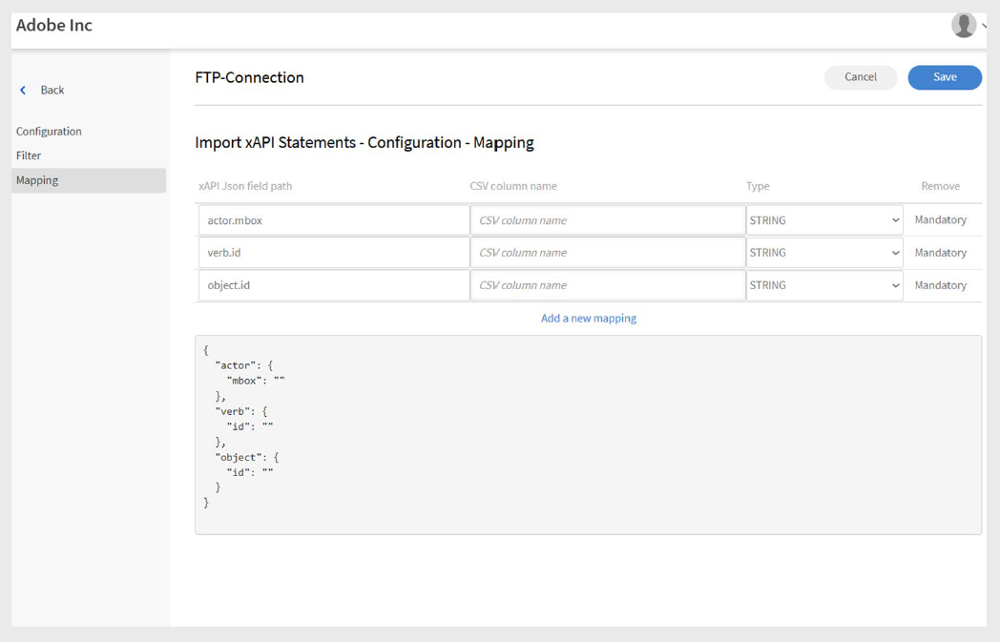

# Connecteur FTP dans Adobe Learning Manager

## Introduction

FTP (File Transfer Protocol) est un protocole réseau standard utilisé pour transférer des fichiers entre un client et un serveur via Internet ou un réseau local. Il permet aux utilisateurs de charger, télécharger et gérer des fichiers sur un serveur distant. Pour les transferts de fichiers sécurisés, des variantes telles que SFTP (SSH File Transfer Protocol) et FTPS (FTP Secure) sont couramment utilisées. Le protocole FTP est largement adopté dans les environnements d’entreprise pour automatiser l’exchange des données entre les systèmes, comme la synchronisation des données utilisateur ou de formation entre Adobe Learning Manager et les plates-formes externes.

Ce document fournit aux administrateurs d’intégration des instructions détaillées sur la configuration et l’utilisation du connecteur FTP dans Adobe Learning Manager. Le connecteur FTP permet un exchange automatisé des données entre Learning Manager et les systèmes externes à l’aide de protocoles de transfert de fichiers sécurisés.

Vous apprendrez à configurer des connexions FTP, à mapper des champs de données, à planifier des importations ou des exportations automatisées d’utilisateurs et à surveiller l’activité de synchronisation. Ce guide prend en charge une intégration fluide et sécurisée avec des plateformes d’apprentissage externes ou des systèmes de RH. Vous pouvez importer des utilisateurs internes et des instructions xAPI, et exporter des compétences utilisateur, des relevés de notes d’élèves et des données xAPI.

Les administrateurs d’intégration doivent générer des fichiers CSV pour la migration des utilisateurs, des données utilisateur ou du contenu d’apprentissage, puis les charger dans des dossiers désignés dans le compte FTP de Adobe Learning Manager. Adobe Learning Manager lit, fusionne et importe ensuite les données en fonction d’une planification définie.

Effectuez ces opérations à la demande ou en configurant une planification qui répond aux besoins de votre organisation.

## Avantages de l’intégration FTP

- Réduit les efforts manuels et les erreurs humaines dans la gestion des données.
- Intègre simultanément des données provenant de plusieurs sources externes.
- Prend en charge les opérations de données planifiées et à la demande.
- Permet un mappage détaillé des champs entre différents formats système.

## Conditions préalables

Avant de configurer le connecteur FTP, assurez-vous que votre environnement répond aux exigences suivantes :

- Rôle d&#39;administrateur d&#39;intégration avec autorisations du connecteur FTP.
- Connexion Internet stable avec bande passante suffisante pour les transferts de fichiers.
- Configuration du pare-feu permettant le trafic FTP sur les ports requis.
- Accès au port requis, en fonction de vos exigences de sécurité

### Autorisation et accès

Assurez-vous d’avoir les éléments suivants :

- Accès pour générer et gérer des clés SSH (si vous utilisez l’authentification SSH).
- Autorisation de créer et de mettre à jour des fichiers CSV dans les dossiers FTP spécifiés.

## Fonctionnalités clés

### Importation et exportation de données avec le connecteur FTP

Le connecteur FTP de Adobe Learning Manager simplifie l’exchange des données entre les systèmes externes et votre compte Adobe Learning Manager. Il prend en charge les opérations d’importation ou d’exportation planifiées et à la demande, ce qui réduit l’effort manuel et garantit des informations précises et à jour.

Cette méthode prend en charge l’intégration avec plusieurs systèmes externes. Si différents systèmes génèrent des fichiers CSV distincts, Adobe Learning Manager fusionne les données et les importe en un seul lot.

### Importation de données dans Adobe Learning Manager

_Importation de données utilisateur_

Chargez des fichiers CSV structurés vers des dossiers FTP désignés pour importer des données utilisateur internes. Adobe Learning Manager lit et traite ces fichiers en fonction de la planification configurée pour que les informations utilisateur restent à jour.

_Intégration multi-sources_

Si vous utilisez plusieurs systèmes externes, chaque système peut générer son propre fichier CSV. Adobe Learning Manager fusionne les fichiers et traite les données en un seul lot, ce qui facilite la gestion des enregistrements d’utilisateur provenant de différentes sources.

_importation xAPI_

Le connecteur prend également en charge les instructions xAPI (Experience API). Importez-les à partir de systèmes d’apprentissage tiers pour suivre et signaler les activités d’apprentissage sur plusieurs plates-formes.

### Exportation de données depuis Adobe Learning Manager

_Exportation des données de l&#39;élève_

Exportez des données utilisateur telles que la progression des compétences, les achèvements de cours et les mesures de performances vers un emplacement FTP désigné. Utilisez ces données pour des analyses ou des rapports externes.

_Relevés de notes de l&#39;élève_

Générez et exportez des relevés de notes détaillés avec les terminaisons de cours, les certifications et les parcours d’apprentissage pour prendre en charge la conformité et la vérification des informations d’identification.

### Mappage des attributs

Mappez les colonnes du fichier CSV aux attributs utilisateur Adobe Learning Manager. Vous pouvez réutiliser et mettre à jour la configuration de mappage selon vos besoins, ce qui facilite l’adaptation aux modifications des exigences en matière de données.

### Planification et automatisation

Planifiez des tâches d’importation et d’exportation à exécuter à intervalles réguliers, par exemple quotidiennement, hebdomadairement ou à des intervalles personnalisés. Cela garantit des mises à jour cohérentes des données sans intervention manuelle.

## Configuration du connecteur FTP

Configurez le connecteur FTP pour établir une synchronisation sécurisée des données entre Adobe Learning Manager et les systèmes externes.

Pour configurer le connecteur FTP :

1. Connectez-vous en tant qu’administrateur d’intégration.
2. Sélectionnez **Adobe Learning Manager FTP**, puis **Prise en main**.

   
   _L&#39;interface du connecteur FTP de Adobe Learning Manager affiche le bouton Prise en main_

3. Sélectionnez **Suivant** pour continuer avec l&#39;Assistant de configuration du connecteur FTP.

   
   La page de configuration _affiche le bouton Suivant pour poursuivre la configuration du connecteur FTP_

### Configuration de l’authentification

Adobe Learning Manager prend en charge trois méthodes d’authentification, chacune avec différents niveaux de sécurité et exigences de complexité.

#### Authentification de base

Cette méthode utilise les identifiants de nom d’utilisateur et de mot de passe traditionnels pour l’accès FTP. Bien que plus simple à mettre en œuvre, il offre une sécurité inférieure aux alternatives basées sur SSH.

1. Sélectionnez **Créer une authentification de base avec un mot de passe**.
2. Saisissez le nom d’utilisateur et le mot de passe FTP dans les champs prévus à cet effet. Vérifiez que les informations d’identification sont entrées correctement avant de continuer.

   
   _Formulaire d&#39;authentification FTP avec champs de nom d&#39;utilisateur et de mot de passe, avec option d&#39;authentification de base sélectionnée_

#### Authentification par clé SSH existante

Utilisez cette méthode si vous avez déjà établi des paires de clés SSH pour l’authentification sécurisée.

1. Sélectionnez **Créer une authentification en utilisant des clés SSH existantes**.
2. Copiez et collez votre contenu de clé publique dans le champ de texte fourni. Vérifiez que le format de clé publique est correct (commence généralement par ssh-rsa ou ssh-ed25519).

   
   _Interface d&#39;authentification par clé SSH avec champ de texte pour l&#39;entrée de clé publique_

#### Générer une nouvelle clé SSH

Utilisez cette option pour créer une nouvelle paire de clés SSH spécifiquement pour cette connexion FTP.

1. Sélectionnez **Créer une authentification en générant une nouvelle clé SSH**.
2. Sélectionnez **Générer la clé SSH** pour créer une nouvelle paire de clés. Télécharger et stocker en toute sécurité la clé privée générée. La clé publique sera automatiquement configurée pour la connexion FTP.

   
   _Écran de génération de clé SSH avec le bouton Générer la clé SSH et d’autres options de configuration_

## Connexion à FTP à l’aide de FileZilla

FileZilla est un outil facultatif pour la gestion des connexions FTP. Il peut être utilisé lorsque vous devez télécharger manuellement des fichiers, vérifier les structures des répertoires ou résoudre des problèmes de connexion en dehors des processus Adobe Learning Manager automatisés.

### Installation et configuration de FileZilla

FileZilla est un client FTP libre et gratuit qui fournit une interface conviviale pour les opérations de transfert de fichiers.

Pour connecter votre FTP à FileZilla :

1. Téléchargez et installez FileZilla à partir du [site web officiel](https://filezilla-project.org/).
2. Ouvrez **FileZilla**.
3. Sélectionnez **Fichier**, puis **Gestionnaire de site**.
4. Sélectionnez **Nouveau site**.
5. Saisissez les informations suivantes :
   - **Domaine FTP :** adresse du serveur FTP auquel vous souhaitez vous connecter, par exemple ftp.example.com. Vous trouverez votre domaine hôte sur la page Connecteur FTP de Adobe Learning Manager.
   - **Port :** le port FTP par défaut est 21. Cependant, Adobe Learning Manager utilise le port 22 pour les connexions sécurisées.
   - **Nom d&#39;utilisateur FTP :** nom de connexion requis pour accéder au serveur FTP.
   - **Mot de passe FTP :** mot de passe lié à votre nom d&#39;utilisateur FTP.
6. Sélectionnez **Se connecter**.
7. Une fois connecté, vous pouvez transférer des fichiers par glisser-déposer entre les panneaux local (gauche) et distant (droite).

## Utilisation du connecteur FTP dans Adobe Learning Manager

### Importation d’utilisateurs internes à l’aide du connecteur FTP

La fonctionnalité d’importation des utilisateurs permet la synchronisation automatisée des données des employés des systèmes de RH et d’autres sources externes dans Adobe Learning Manager.

### Attributs de mappage

Le mappage d’attributs établit la connexion entre vos données externes et la structure de données prise en charge par Adobe Learning Manager, en veillant à ce que les données soient placées dans les champs appropriés. Cette étape est obligatoire.

Pour mapper les attributs :

1. Sélectionnez **Utilisateurs internes** dans la page **Connecteur FTP**.
2. Sélectionnez **Mappage de colonnes**.
3. Dans la page **Attributs de mappage** :
   - Le **côté gauche** affiche les champs requis dans Adobe Learning Manager.
   - Le **côté droit** affiche les noms des colonnes CSV. Initialement, ce côté contient des listes déroulantes vides.
   - Sélectionnez **Choisir CSV** pour charger un exemple de fichier CSV. Cette opération renseigne la liste déroulante de droite avec les noms de colonne de votre fichier CSV. Consultez [cet article](https://experienceleague.adobe.com/fr/docs/learning-manager/using/integration/migration-manual#csv).
   - Mappez chaque champ Adobe Learning Manager à la colonne CSV correspondante.

   
   _L’interface de mappage des attributs affiche les champs Adobe Learning Manager dans les menus déroulants des colonnes de gauche et CSV à droite_

4. Sélectionnez **Enregistrer** pour terminer le mappage.

Après l&#39;enregistrement, le compte configuré apparaît en tant que **source de données** dans l&#39;application Administrateur. Les administrateurs peuvent ensuite planifier une importation ou déclencher une synchronisation manuelle.

### Importation d’instructions xAPI

L’importation d’instructions xAPI permet un suivi détaillé des activités d’apprentissage en intégrant des données d’apprentissage externes dans Adobe Learning Manager.

_Configurer la source_

La configuration de la source xAPI établit la connexion entre les systèmes d’apprentissage externes et le suivi d’activité de Adobe Learning Manager.

Pour configurer une source :

1. Accédez à la section de configuration xAPI.
2. Sélectionnez **Ajouter une nouvelle configuration** dans la liste de configuration.

   
   _Page de gestion des configurations avec le bouton Ajouter une nouvelle configuration et la liste de configuration existante_

3. Saisissez **Nom** et **Nom du fichier source** :
   - **Nom :** Identificateur descriptif pour cette source xAPI (par exemple, intégration LMS ou système de formation externe).
   - **Nom du fichier source :** nom de fichier exact qui sera chargé dans votre dossier FTP (doit correspondre exactement, extension de fichier comprise).

   
   _Formulaire de configuration affichant le champ de nom et le champ de nom de fichier source_

4. Sélectionnez **Enregistrer** pour créer la configuration de base.

_Ajouter des filtres (facultatif)_

Les filtres vous permettent d’importer de manière sélective des instructions xAPI en fonction de critères spécifiques.

Pour ajouter un filtre pour la source :

1. Sélectionnez **Filtre** dans le volet de gauche.
2. Sélectionnez **Ajouter un nouveau filtre**.

   
   _Page de configuration du filtre avec le bouton Ajouter un nouveau filtre_

3. Configurez les éléments suivants :
   - **Nom :** Nom descriptif de la règle de filtrage.
   - **Condition :** opérateur de comparaison (égal à, contient, supérieur à, etc.).

   
   _Boîte de dialogue de création de filtre affichant le champ de nom et les conditions_

4. Sélectionnez **Ajouter un nouveau filtre** pour ajouter d&#39;autres filtres.
5. Sélectionnez **Enregistrer** ou **Supprimer** selon vos besoins sous la colonne **Actions**.
6. Après avoir ajouté des filtres, sélectionnez **Enregistrer**.

_Champs de mappage_

Pour mapper les champs :

1. Sélectionnez **Mappage** dans le volet de gauche.
2. Sur la page **Mappage**, vous verrez les chemins d’accès aux champs JSON à gauche et les noms de colonnes CSV à droite.

   
   _Ajouter un mappage pour la source d&#39;importation_

3. Par défaut, mappez les champs obligatoires suivants :
   - **actor.mbox :** Cela représente l’adresse e-mail de l’élève (l’acteur qui exécute le cours)
l&#39;action). Il identifie de manière unique l&#39;auteur de l&#39;activité.
   - **verb.id:** Il s&#39;agit de l&#39;identifiant de l&#39;action effectuée par l&#39;élève, tel que
terminé, tenté ou réussi. Cette option spécifie l’action de l’élève.
   - **object.id:** Cela indique l’objet ou l’activité d’apprentissage avec lequel l’élève a interagi,
comme un cours, un module ou un parcours d’apprentissage.
4. Sélectionnez **Ajouter un nouveau mappage** pour mapper des champs supplémentaires.
5. Pour chaque champ, sélectionnez le **type de données** approprié (chaîne, nombre, booléen ou date).
6. Sélectionnez **Enregistrer** pour terminer le mappage.

## Planification de l’importation

La planification automatisée assure une synchronisation cohérente des données sans intervention manuelle,
tenir à jour les enregistrements d’activités d’apprentissage.

Pour planifier l’importation :

1. Sélectionnez **Configurer la planification** dans le volet de gauche.

   
   _Page de configuration de la planification affichant les options d&#39;activation et les commandes de synchronisation_

2. Sélectionnez **Activer l&#39;importation des instructions xAPI à l&#39;aide de cette connexion.**
3. Sélectionnez **Activer la planification** pour configurer les importations automatiques.
4. Définissez les paramètres suivants :
   - **Date de début :** heure à laquelle les importations planifiées doivent commencer.
   - **Heure :** heure de la journée pour l&#39;exécution de l&#39;importation.
   - **Répéter après :** la fréquence à laquelle les importations doivent être exécutées (quotidiennement, hebdomadairement, intervalles personnalisés).
5. Sélectionnez **Enregistrer**.

## Exécuter à la demande (facultatif)

L’exécution à la demande permet d’importer immédiatement des données en dehors des opérations planifiées.

Quand utiliser les importations à la demande :

- Test de nouvelles configurations avant la planification
- Traitement des mises à jour de données urgentes ou sensibles au temps
- Gestion des migrations ou corrections de données ponctuelles. Résolution des problèmes d’importation

Pour importer manuellement des instructions xAPI :

1. Sélectionnez **À la demande** dans le volet de gauche.
2. Sélectionnez **Exécuter**.

   
   _Page d&#39;exécution à la demande avec bouton Exécuter_

## Afficher l’état d’exécution

La surveillance du statut permet une gestion proactive des opérations d’importation et une identification rapide des problèmes.

Pour afficher l’état d’exécution :

1. Sélectionnez **État d&#39;exécution** pour afficher la liste de toutes les exécutions d&#39;importation.
2. La page affiche :

   - **Date de début :** date de début de l&#39;opération d&#39;importation.
   - **Durée :** temps total requis pour le traitement.
   - **Type d&#39;importation :** si l&#39;importation a été planifiée ou à la demande.
   - **État actuel :** informations d&#39;état en temps réel.
      - **En cours :** importation en cours d&#39;exécution
      - **Terminé :** Terminé avec succès avec un nombre d&#39;enregistrements
      - **Échec :** une erreur s&#39;est produite avec les informations de diagnostic

## Résolution des problèmes d’importation

La section Statut d’exécution fournit un résumé complet de toutes les tâches d’importation dans l’ordre chronologique, ce qui permet aux administrateurs de surveiller les opérations et d’identifier rapidement les problèmes.

Indicateurs d’état :

- **Réussite :** l&#39;importation s&#39;est terminée sans erreurs.
- **Avertissement :** indique des échecs ou des problèmes lors de l&#39;exécution.
- **En cours :** opération d&#39;importation en cours d&#39;exécution.
- **En attente :** importation planifiée mais pas encore démarrée.

En cas d’échec, le système affiche des indicateurs d’avertissement en regard des exécutions d’importation ayant échoué. Cliquez sur le lien Rapport d’erreur pour télécharger des rapports d’erreur détaillés.
