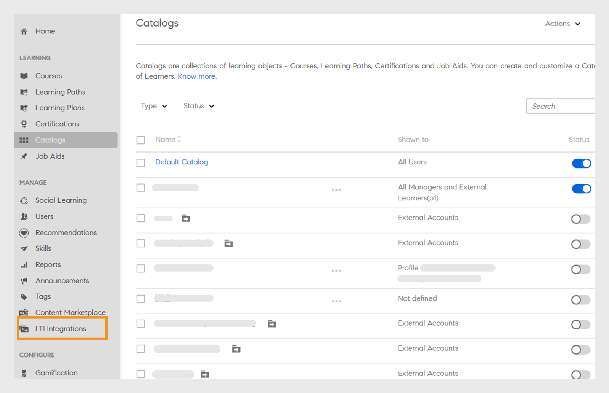
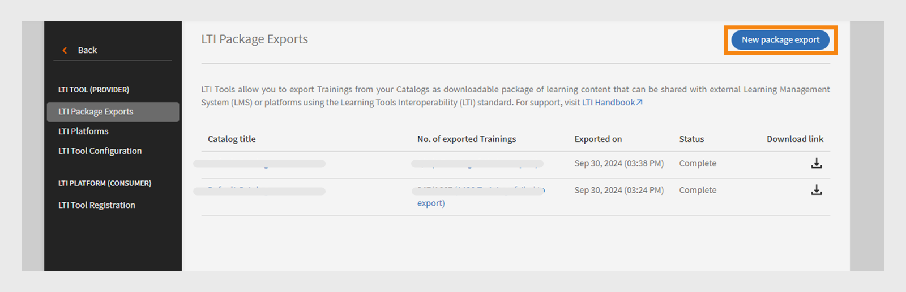

# Intégration LTI

## Qu’est-ce que LTI ?

L’interopérabilité des outils d’apprentissage (LTI) est une norme IMS pour l’intégration d’applications d’apprentissage enrichies dans les environnements éducatifs. Les utilisateurs peuvent accéder au contenu d’apprentissage externe de fournisseurs de contenu externes directement dans leur LMS sans se connecter ou accéder à un autre LMS.

## Intégration LTI avec Adobe Learning Manager

Adobe Learning Manager prend désormais en charge la version 1.3 de LTI, qui lui permet d’agir à la fois en tant que fournisseur et consommateur d’outils. Cette fonctionnalité améliore l’interopérabilité entre Adobe Learning Manager et d’autres systèmes de gestion de l’apprentissage (LMS).

**LTI en tant que fournisseur d’outils** : LTI en tant que fournisseur d’outils permet aux systèmes externes de s’intégrer à un LMS. Adobe Learning Manager agit comme un fournisseur d’outils LTI, permettant aux autres plateformes LMS d’accéder aux objets d’apprentissage à partir de Adobe Learning Manager directement dans leur LMS.

**LTI en tant que consommateur d’outils** : LTI en tant que consommateur d’outils permet au LMS d’intégrer des outils externes via l’interopérabilité des outils d’apprentissage (LTI). Dans ce scénario, le LMS est un consommateur de services fournis par des outils externes. Adobe Learning Manager agit en tant que consommateur d’outils LTI, ce qui lui permet d’intégrer des outils d’apprentissage tiers, ce qui permet aux élèves Adobe Learning Manager d’utiliser les objets d’apprentissage des outils tiers dans Adobe Learning Manager.

## Configuration du connecteur LTI dans ALM

Procédez comme suit pour activer l’intégration LTI dans Adobe Learning Manager :

1. Connectez-vous en tant qu&#39;**[!UICONTROL administrateur d&#39;intégration]**.
2. Sur la page d&#39;accueil, sélectionnez **[!UICONTROL Applications]** > **[!UICONTROL Applications en vedette]**.
3. Sélectionnez **[!UICONTROL Intégrations LTI]** sur la page **[!UICONTROL Applications]**.
4. Sélectionnez l&#39;option **[!UICONTROL Activer les intégrations LTI]** et sélectionnez **[!UICONTROL Enregistrer]**.

_Activer les intégrations LTI_

>[!NOTE]
>
>Vous ne pouvez pas modifier ou désactiver l’option Intégrations LTI une fois activée.

Cela créera la nouvelle barre latérale Intégrations LTI dans le compte administrateur.

_Encadré LTI_

Un nouveau rôle personnalisé, **[!UICONTROL Intégration LTI]**, a été ajouté sous **[!UICONTROL Droits de compte]** dans la section **[!UICONTROL Rôle personnalisé]**. Les administrateurs peuvent attribuer ce rôle aux utilisateurs, ce qui leur permet d&#39;accéder à la section **[!UICONTROL Intégration LTI]**. Les administrateurs doivent également accorder des autorisations **[!UICONTROL Catalogues]** à ces utilisateurs pour exporter les cours. Cette configuration fournit un accès complet aux sections LTI et Catalogues pour l&#39;exportation de cours.

_Rôle personnalisé de l&#39;intégration LTI_

## Adobe Learning Manager en tant que fournisseur d’outils LTI

En tant que fournisseur LTI, Adobe Learning Manager vous permet d’exporter des cours de vos catalogues sous forme de packages LTI qui peuvent être partagés avec des plateformes LMS externes.

### Créer et partager les informations d’identification LTI avec un LMS externe - Workflow d’administration

Procédez comme suit pour partager les informations d’identification LTI avec un système de gestion de l’apprentissage externe :

1. Connectez-vous en tant qu&#39;**[!UICONTROL administrateur]**.
2. Sur la page d&#39;accueil, sélectionnez **[!UICONTROL Intégration LTI]** > **[!UICONTROL Configuration de l&#39;outil LTI]**. Les informations de configuration sont affichées sur cette page.
3. L’administrateur peut partager ces informations d’identification avec un système de gestion de l’apprentissage externe pour l’inscription au site LTI.

   
   _Informations d&#39;identification de configuration de l&#39;outil LTI_

   * **[!UICONTROL URL du jeton]** : URL où le LMS demande un jeton d&#39;accès pour authentifier et autoriser la communication avec l&#39;outil LTI.
   * **[!UICONTROL URL du lien cible]** : URL de destination où les utilisateurs sont redirigés lors du lancement de l’outil LTI à partir du LMS.
   * **[!UICONTROL URL du jeu de clés public]** : URL qui fournit les clés publiques utilisées pour vérifier les jetons de sécurité pour une communication sécurisée.
   * **[!UICONTROL URL de redirection]** : URL où les utilisateurs sont envoyés après avoir effectué une action sur l’outil LTI, généralement les redirigent vers le LMS.

### Configuration LMS externe

À l’aide des informations d’identification partagées par l’administrateur Adobe Learning Manager, l’administrateur LMS externe enregistre Adobe Learning Manager et génère des informations d’identification. Ces informations d’identification seront ajoutées au portail Adobe Learning Manager en tant que dernière étape de la configuration de Adobe Learning Manager en tant que fournisseur d’outils. Voici les informations d’identification générées par le LMS externe :

* **[!UICONTROL ID d&#39;émetteur ou de plateforme]** : identifiant unique pour le LMS ou la plateforme qui envoie la demande de lancement LTI au fournisseur d&#39;outils.
* **[!UICONTROL ID client]** : identifiant unique attribué à l’outil LTI par le LMS à des fins d’autorisation.
* **[!UICONTROL ID de déploiement]** : identifiant qui lie un déploiement d&#39;outil LTI spécifique au LMS pour la gestion de plusieurs instances.
* **[!UICONTROL URL du jeton]** : point de terminaison où le LMS demande un jeton d’accès pour authentifier et autoriser les interactions avec l’outil LTI.
* **[!UICONTROL URL d&#39;authentification]** : URL à laquelle le LMS envoie les utilisateurs pour l&#39;authentification et l&#39;initialisation de la connexion LTI.
* **[!UICONTROL URL de clé publique]** : URL qui fournit la clé publique utilisée par l&#39;outil LTI pour vérifier les jetons de sécurité et assurer une communication sécurisée.

### Ajouter Adobe Learning Manager en tant que fournisseur d’outils - Workflow d’administration

Procédez comme suit pour ajouter Adobe Learning Manager en tant que fournisseur d’outils :

1. Connectez-vous en tant qu&#39;**[!UICONTROL administrateur]**.
2. Sur la page d’accueil, sélectionnez **[!UICONTROL Intégrations LTI]** > **[!UICONTROL Plateformes LTI]**.
3. Sélectionnez **[!UICONTROL Ajouter]** et saisissez les informations d&#39;identification partagées par le LMS externe.

   
   _Ajouter une nouvelle plateforme LTI_

4. Une fois toutes ces valeurs ajoutées, sélectionnez **[!UICONTROL Valider]** et **[!UICONTROL Ajouter]**.

### Exporter le package LTI - Workflow d’administration

Les outils LTI vous permettent d’exporter la formation de vos catalogues sous la forme d’un package téléchargeable de contenu d’apprentissage qui peut être partagé avec des systèmes de gestion de l’apprentissage (LMS) ou des plateformes externes à l’aide de la norme LTI (Learning Tools Interoperability).

Procédez comme suit pour exporter le cours à partir de Adobe Learning Manager :

1. Connectez-vous en tant qu&#39;**[!UICONTROL administrateur]**.
2. Sur la page d’accueil, sélectionnez **[!UICONTROL Intégrations LTI]** > **[!UICONTROL Exportations de package LTI]**.
3. Sélectionnez **[!UICONTROL Nouvelle exportation de package]**.

   
   _Exporter le package LTI_

4. Sélectionnez le catalogue requis dans la liste. Vous pouvez voir la liste des cours disponibles dans le catalogue.
5. Sélectionnez les cours requis et sélectionnez **[!UICONTROL Exporter au format LTI]**.
6. Sélectionnez le cours pour afficher le lien de lancement.
7. Sélectionnez l&#39;icône **[!UICONTROL Télécharger le lien]** pour télécharger le package. Le package est un fichier zip contenant les fichiers IMSCC exportés avec succès.

À l’aide de ce lien de lancement ou fichier IMSCC, vous pouvez exporter les cours Adobe Learning Manager vers le LMS externe. Les élèves peuvent suivre les cours Adobe Learning Manager depuis leur LMS.

>[!NOTE]
>
>Si un administrateur modifie un cours ou met à jour les modules après avoir créé le lien de lancement, le lien est automatiquement mis à jour. Cependant, si un administrateur retire un cours après la création du lien de lancement, le cours retiré ne pourra pas être lancé dans le consommateur LTI.

## Adobe Learning Manager en tant que consommateur LTI - Workflow d’administration

En tant que consommateur LTI, Adobe Learning Manager vous permet d’utiliser l’activité, les outils, le contenu et les widgets de fournisseurs LTI externes.
Pour ajouter Adobe Learning Manager en tant que consommateur LTI, vous avez besoin des informations d’identification suivantes du fournisseur LTI externe :

* URL d’ouverture de session
* URL du lien cible
* URL de redirection
* Type de clé publique

Procédez comme suit pour ajouter Adobe Learning Manager en tant que consommateur LTI :

1. Connectez-vous en tant qu&#39;**[!UICONTROL administrateur]**.
2. Sur la page d&#39;accueil, sélectionnez **[!UICONTROL Intégrations LTI]** > **[!UICONTROL Enregistrement de l&#39;outil LTI]**.
3. Sélectionnez **[!UICONTROL Ajouter]** > **[!UICONTROL Nouvel outil LTI]**.

   >[!NOTE]
   >
   >Vous pouvez importer plusieurs outils LTI en chargeant un fichier .csv.

4. Entrez les informations d&#39;identification ci-dessus du fournisseur LTI.

   
   _Ajouter un nouvel outil LTI_

5. Une fois terminé, sélectionnez **[!UICONTROL Valider]** et **[!UICONTROL Ajouter]**.
6. L’écran suivant s’affiche :

   
   _Informations d&#39;identification d&#39;inscription_

7. Partagez ces informations d’identification avec le fournisseur LTI pour l’enregistrement. Une fois l’inscription terminée, vous pouvez obtenir le lien de lancement ou le fichier IMSCC auprès du fournisseur LTI pour importer les cours.

### Création de contenu LTI - Flux de production de l’auteur

Les fournisseurs LTI vous fournissent un lien de lancement ou un fichier IMSCC pour ajouter leurs cours à Adobe Learning Manager. Procédez comme suit pour ajouter des cours à partir d’un LMS externe :

1. Connectez-vous en tant qu&#39;**[!UICONTROL auteur]**.
2. Sélectionnez **[!UICONTROL Bibliothèque de contenu]** > **[!UICONTROL Ajouter]** > **[!UICONTROL Module LTI]**.

   
   _Ajouter du contenu LTI - Auteur_

3. Saisissez **[!UICONTROL Nom]** et **[!UICONTROL Description]**.
4. Tapez **[!UICONTROL Launch Link]** et **[!UICONTROL Custom Parameters]** à partir du fournisseur LTI.
5. Sélectionnez votre [!UICONTROL fournisseur LTI] dans le menu déroulant **[!UICONTROL Fournisseur d&#39;outils]**.
6. Recherchez et sélectionnez **[!UICONTROL Public]** dans l&#39;option **[!UICONTROL Ajouter au dossier]**. Cela rend les cours disponibles pour tous les auteurs.
7. Sélectionnez **[!UICONTROL Enregistrer]**.
Une fois le contenu créé, vous pouvez ajouter ce contenu lors de la création du cours.

### Créer un cours avec du contenu LTI - Flux de production de l&#39;auteur

Procédez comme suit pour créer un cours avec du contenu LTI :

1. Connectez-vous en tant qu&#39;**[!UICONTROL auteur]**.
2. Sur la page d&#39;accueil, sélectionnez **[!UICONTROL Cours]** > **[!UICONTROL Ajouter]**.
3. Saisissez le **[!UICONTROL nom]** et la **[!UICONTROL description]** du cours.
4. Dans l&#39;option **[!UICONTROL Modules]**, sélectionnez **[!UICONTROL Ajouter des modules]** > **[!UICONTROL Module individualisé]**.
5. Sélectionnez le **[!UICONTROL contenu LTI]** que vous avez créé et sélectionnez **[!UICONTROL Enregistrer]**.
6. Saisissez les détails requis, tels que **[!UICONTROL Compétences]**, **[!UICONTROL Auteurs]** et **[!UICONTROL Type d&#39;inscription]**.
7. Une fois terminé, publiez le cours. Les élèves Adobe Learning Manager peuvent suivre les cours LTI du fournisseur LTI externe.

## Scénarios d’échec de l’exportation LTI

Les types de cours suivants ne peuvent pas être exportés en tant que cours LTI :

* **Cours avec module d&#39;activité** : cours contenant des modules spécifiques basés sur l&#39;activité.
* **Cours avec plusieurs types de livraison** : les cours avec plusieurs types de livraison comprennent un module individualisé, un module virtuel ou de classe, un module d’activité et un apprentissage fusionné.
* **Cours avec conditions préalables** : cours qui nécessitent une préachèvement.
* **Cours avec plusieurs inscriptions** : cours contenant plusieurs inscriptions
* **Cours avec plusieurs instances** : cours qui offrent plusieurs instances de livraison.

| Instance par défaut | Une ou plusieurs instances autres que celles par défaut | Attentes | Messages d’erreur |
|---|---|---|---|
| Actif | Aucune | Exportation | Aucune |
| Actif | Actif | Ne pas exporter | Instances multiples |
| Actif | Retiré | Ne pas exporter | Instances multiples |
| Actif | Supprimé | Exportation | Aucune |
| Retiré | Aucune | Ne pas exporter | Retirer l&#39;instance de référence |
| Retiré | Actif | Ne pas exporter | Retrait d&#39;une instance de référence, plusieurs instances |
| Retiré | Retiré | Ne pas exporter | Retrait d&#39;une instance de référence, plusieurs instances |
| Retiré | Supprimer | Ne pas exporter | Retirer l&#39;instance de référence |

* **Cours avec réponses à plusieurs questions** : cours avec MQA activé.
* **Cours avec changement d’instance activé** : cours permettant aux élèves de basculer entre les instances.
* **Cours payants** : cours nécessitant un paiement pour l&#39;inscription.
* **Cours faisant partie du parcours d’apprentissage, de la certification ou du plan d’apprentissage** : cours faisant partie des parcours ou plans d’apprentissage.
* **Cours non auto-inscrits** : cours limités à l&#39;auto-inscription de l&#39;élève.
* **Cours en salle de classe ou en salle de classe virtuelle** : cours avec des sessions en salle de classe ou en salle de classe virtuelle.
* **Cours avec modules non obligatoires** : cours contenant des modules facultatifs ou non obligatoires.

_Statut d&#39;exportation_

## Limitations LTI

Voici les limitations LTI pour le consommateur LTI et le fournisseur LTI :

* Possibilité d’exporter des cours fusionnés qui affecte l’expérience de consommation de cours des élèves.
* Possibilité d’exporter des cours en auto-apprentissage avec une salle de classe, une classe virtuelle ou des modules d’activité, avec un impact sur l’expérience des élèves.
* Possibilité d’exporter des cours partagés tels que LinkedIn Learning et des cours Go1.
* Possibilité de lancer des cours avec des dates d&#39;inscription passées dans ALM, ce qui affecte l&#39;accès aux cours et l&#39;expérience des élèves.
* Les élèves ne peuvent pas suivre les cours LTI sur l&#39;application mobile iOS ALM, ce qui affecte l&#39;expérience de suivi des cours.
* Les élèves ne peuvent pas télécharger et accéder aux cours LTI hors ligne dans l&#39;application mobile ALM, car ces cours sont fournis par des plateformes tierces.
* Les administrateurs peuvent afficher uniquement les catalogues activés et ne peuvent pas afficher les catalogues désactivés.
* ALM a des limitations sur les longueurs de nom (63 caractères) et d’e-mail (64 caractères), empêchant l’accès pour les élèves LTI externes qui dépassent ces limites.
* Les retards de synchronisation de l’achèvement des cours ou des notes sont causés par le système LTI tiers.
* Les messages de synchronisation de cours n’apparaissent pas pour les élèves Teams qui suivent les cours LTI via l’application ou le navigateur Teams, ce qui a un impact sur les notifications des élèves.
* Les rapports de données utilisateur ne peuvent pas exporter de données pour les utilisateurs enregistrés via LTI.
* Les noms des fournisseurs d’outils ne sont pas automatiquement reconnus lorsque les auteurs ajoutent des liens de lancement dans le consommateur d’outils, ce qui nécessite une sélection manuelle.
* Les chargements d’outils en bloc via CSV nécessitent un codage UTF-8 pour les caractères accentués afin d’éviter les erreurs d’importation.
* Les administrateurs de compte LTI ne peuvent pas partager des cours, des parcours d’apprentissage ou des certifications qui incluent des modules LTI.
* Impossible de resynchroniser les notes lorsque les utilisateurs rouvrent le lecteur pour les cours ALM terminés, ce qui affecte les mises à jour du score des élèves et nécessite un redéclenchement manuel.
* ALM permet uniquement aux utilisateurs actifs et en version d’essai de suivre les cours LTI.
* La synchronisation de niveau activée dans Moodle empêche le lancement du lecteur ALM, ce qui affecte l’accès aux cours et l’expérience des élèves.
* Le champ actif LTI est à valeur unique et ne prend pas en charge les valeurs multiples.
* Les motifs d’échec ne sont pas disponibles lorsqu’une exportation échoue lors de la migration de cours sans contenu de base.
* Les notes des cours LTI externes n&#39;apparaissent pas dans le relevé de notes de l&#39;élève et les notes ne sont pas visibles sur la page du quiz L2, ce qui affecte le suivi des performances des élèves.

## Cas d’échec du lancement LTI

Voici les cours que le lecteur LTI externe ne peut pas lancer en raison de modifications récentes apportées dans ALM après la création des liens de lancement :

* Cours où l&#39;instance est retirée.
* Cours retirés et sans inscription à ALM.
* Cours auxquels des inscriptions à ALM ont été effectuées mais qui sont retirés.
* Cours supprimés dans ALM.
* Cours pour lesquels la limite d&#39;inscription a été atteinte.

## Meilleures pratiques

Il est recommandé de créer un catalogue avec des cours prenant en charge LTI pour éviter les échecs d’exportation et faciliter l’exportation des cours.

Catalogue LTI affichant l’état d’exportation réussi
