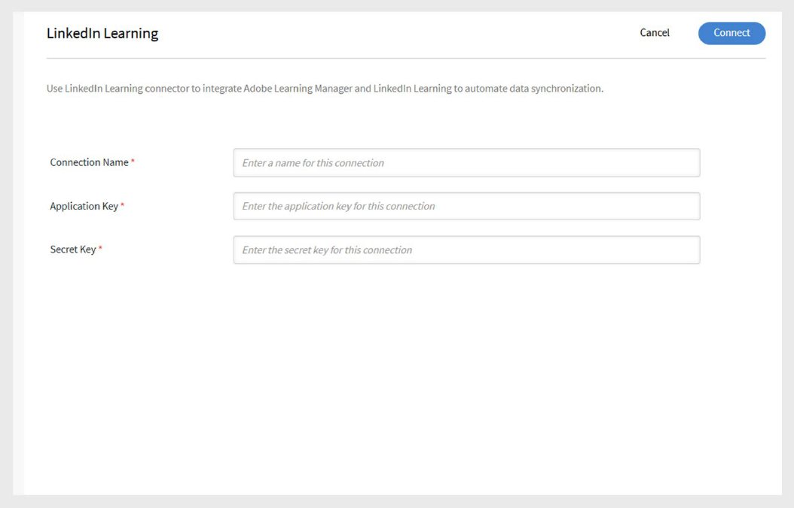

# Connecteur linkedIn Learning dans Adobe Learning Manager

## Introduction

Le connecteur LinkedIn Learning vous permet d’intégrer facilement du contenu LinkedIn Learning à Adobe Learning Manager. Grâce à ce connecteur, les organisations peuvent automatiquement importer des cours LinkedIn Learning dans Adobe Learning Manager afin que les élèves puissent y rechercher des cours LinkedIn, s’y inscrire et les terminer directement sur la plateforme.

Lors de la configuration, la progression des élèves sur le contenu d’apprentissage LinkedIn est suivie dans Adobe Learning Manager, ce qui permet aux administrateurs de surveiller les terminaisons et le temps passé. Vous pouvez planifier la synchronisation automatique du contenu, exécuter des importations à la demande et filtrer les cours importés dans votre système par langue, bibliothèque ou balises personnalisées.

>[!NOTE]
>
>Lorsque vous importez des cours à partir de LinkedIn Learning, Adobe Learning Manager génère des ID d’objet d’apprentissage (LO) uniques pour chaque cours. Le temps d’apprentissage consacré au contenu d’apprentissage LinkedIn est signalé à Adobe Learning Manager par la plate-forme LinkedIn. Si la plate-forme LinkedIn n’envoie pas ces données, Adobe Learning Manager ne peut pas les enregistrer et le temps passé s’affichera comme zéro.

## Configuration des paramètres du portail d’apprentissage LinkedIn

Pour configurer les paramètres du portail d’apprentissage LinkedIn :

1. Connectez-vous à **LinkedIn Learning LMS** en tant qu’administrateur.
2. Sélectionnez **Administrateur** dans le panneau de navigation supérieur.
3. Cliquez sur l&#39;onglet **Paramètres**.
4. Dans la navigation de gauche, sélectionnez **Intégration de la lecture**, puis sélectionnez l&#39;onglet **Intégration**.
5. Développez **Paramètres de lancement de contenu LMS**.
6. Ajoutez les noms d’hôte suivants :

   - learningmanager.adobe.com
   - learningmanagerlrs.adobe.com
   - cpcontents.adobe.com
7. Sélectionnez **Activer l&#39;intégration AICC**.

   
   _Sélectionnez Activer l’intégration AICC pour configurer le connecteur LinkedIn Learning_

## Connecter LinkedIn Learning à Adobe Learning Manager

Pour configurer le connecteur LinkedIn Learning :

1. Connectez-vous à Adobe Learning Manager en tant qu’administrateur d’intégration.
2. Passez le curseur de la souris sur la vignette **LinkedIn Learning** et sélectionnez **Connect**.

   
   _Sélectionnez Se connecter pour configurer le connecteur LinkedIn Learning_

3. Sur la page de configuration de la connexion :
   - Tapez un **nom de connexion**.
   - Saisissez la **clé d&#39;application** et la **clé secrète**.

   
   _Tapez le nom de connexion, la clé d&#39;application et la clé secrète pour configurer le connecteur LinkedIn Learning_

   >[!NOTE]
   >
   >L’administrateur d’entreprise peut générer ces clés en créant une application dans le portail d’administration de l’apprentissage LinkedIn.

4. Sélectionnez **Enregistrer** pour ajouter la connexion.

Pour modifier une connexion existante, sélectionnez **Gérer les connexions** sur la vignette **LinkedIn Learning**.

>[!IMPORTANT]
>
>La fonctionnalité **Migration** doit être activée pour votre compte avant de pouvoir configurer ce connecteur.

## Gestion de la connexion et de la synchronisation

Pour gérer le connecteur LinkedIn Learning :

1. Sélectionnez **Gérer les connexions** et sélectionnez la connexion.
2. Dans le volet de gauche, sélectionnez **Configurer**.
3. Sélectionnez **Activer la connexion**.

   
   _Sélectionnez Activer la connexion dans la page Configurer le connecteur LinkedIn Learning_

4. Sélectionnez **Modifier** pour mettre à jour les informations d&#39;identification. Utilisez **Réinitialiser** pour annuler les modifications.
5. Pour automatiser la synchronisation, sélectionnez **Activer la planification**.
6. Définissez la date, l’heure et la fréquence de début (par exemple, tous les 3 jours).
7. Sélectionnez **Enregistrer**.

### Synchronisation à la demande

Pour exécuter la synchronisation à la demande :

1. Sélectionnez **Exécution à la demande** dans le volet de gauche.
2. Saisissez une **date de début**.
3. Sélectionnez l’une des options suivantes pour **Activer** ou **Désactiver l’accès** à Adobe Learning Manager pendant l’exécution :
   - **Activer l&#39;accès à Adobe Learning Manager pendant l&#39;exécution** : aucun temps d&#39;arrêt pour les utilisateurs.
   - **Désactiver l&#39;accès à Adobe Learning Manager pendant l&#39;exécution** : l&#39;application n&#39;est pas disponible pendant la synchronisation.

   
   _Sélectionnez Exécution à la demande pour exécuter l&#39;importation_

4. Sélectionnez **Exécuter** pour importer les flux utilisateur et les données de LinkedIn Learning à partir de cette date.

Pour surveiller toutes les exécutions de synchronisation :

Sélectionnez **État d’exécution** dans le volet de gauche pour afficher l’historique de toutes les synchronisations, leur durée, leur type (planifié ou à la demande) et leur état actuel (en cours, terminé).

>[!NOTE]
>
>Si vous supprimez et recréez une connexion, les exécutions précédentes sont conservées et affichées dans **État d&#39;exécution**. Vous ne pouvez réexécuter que la synchronisation la plus récente.

## Filtrer le contenu d’apprentissage LinkedIn

Lors de la configuration de votre connecteur, vous pouvez filtrer les cours d’apprentissage LinkedIn à importer.

Pour configurer votre filtre :

1. Sélectionnez **Filtre** dans le volet de gauche.
2. Sélectionnez l&#39;option requise sous **Filtrer les formations à l&#39;aide de**.
   - **Aucun filtre** - Importer tous les cours.
   - **Langue** : filtrez les cours par langue spécifique.
   - **Bibliothèque** : filtre les cours par bibliothèques d’apprentissage LinkedIn.
3. Si vous effectuez un filtrage par **langue**, sélectionnez les langues souhaitées. Par exemple, **anglais** et **espagnol**.
4. Dans **Importer les formations dans**, sélectionnez l&#39;emplacement où les cours seront importés.
5. Choisissez comment organiser les cours importés.
6. Sélectionnez l’une des options ci-dessous pour l’option **Séparer les formations en fonction de** :

   - **Langue** - Regrouper par langue.
   - **Bibliothèque** - Groupe par bibliothèque.
7. Sous **Importer des balises**, sélectionnez les types de balises à appliquer aux cours importés.

   - **Langue**
   - **Bibliothèque**
   - **Sujet**
   - **Rubrique**
   - **Balise personnalisée**
8. Dans le champ **Balise personnalisée**, saisissez une balise personnalisée que vous souhaitez attribuer. Séparez les balises par des virgules.

   
   _Sélectionnez les options de filtre pour importer les données à partir du connecteur LinkedIn Learning_

9. Si vous souhaitez que les élèves puissent se désinscrire de ces cours, sélectionnez **Les utilisateurs peuvent se désinscrire**.
10. Sélectionnez **Enregistrer** pour appliquer votre filtre et importer les paramètres.
