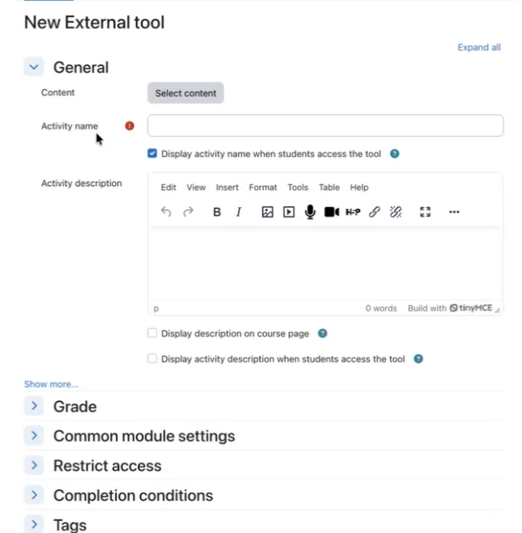

# LTI Deep Linking dans Adobe Learning Manager

## Présentation

**La section suivante est destinée aux administrateurs**

LTI Deep Linking est une fonctionnalité offrant un avantage LTI qui permet aux instructeurs ou aux auteurs de cours de parcourir, sélectionner et intégrer des éléments d’apprentissage spécifiques de Adobe Learning Manager (ALM) directement dans un consommateur/une plate-forme d’outil LTI externe (comme Canvas ou Moodle) des cours.

Les liens profonds LTI simplifient le processus d’ajout de cours à une plateforme d’apprentissage telle que Moodle. Dans le workflow actuel, un auteur doit copier manuellement l’URL du cours, y compris le paramètre d’exportation UUID, puis coller les détails requis dans le LMS tout en configurant le lien du cours. Cette étape doit être répétée pour chaque cours et pour chaque placement. Par exemple, si le même cours doit être ajouté à 10 emplacements différents, l’auteur doit répéter le processus de copier-coller 10 fois. Cette approche manuelle augmente l’effort et introduit un risque plus élevé d’erreurs de configuration.

La liaison profonde supprime cette surcharge en permettant au LMS de gérer la sélection de cours pendant la configuration et fournit l’URL de lancement appropriée pour la sélection de contenu.

Dans ce modèle :

* Les instructeurs et les auteurs du LMS externe lancent une expérience de sélection par lien profond dédiée pour parcourir ALM.
* Le système renvoie un objet de lien profond d&#39;ALM vers le LMS externe afin que l&#39;élément sélectionné puisse être incorporé dans le cadre de son flux de création de cours.
* Les étudiants consomment du contenu lié de manière approfondie dans leur système de gestion de l’apprentissage principal, qui lance de manière transparente le contenu hébergé dans ALM.

## Exposé du problème

ALM prend actuellement en charge l’intégration de LTI 1.3, mais sans un workflow de liaison approfondie complet, les instructeurs et les auteurs ne disposent pas d’un moyen structuré pour :

* Lancez une expérience de sélection de liens profonds dédiée à partir d’un modèle.
* Parcourez uniquement les objets d’apprentissage qui doivent être exposés pour une plate-forme donnée.
* Sélectionnez un objet d’apprentissage spécifique à partir de la plateforme.
* ALM renvoie cet objet d’apprentissage à la plateforme afin qu’il puisse être incorporé directement dans un cours.

Sans cette fonctionnalité :

* La sélection du contenu est manuelle ou fragmentée
* Tout le contenu du compte peut être exposé involontairement, sauf s’il est explicitement filtré
* Les intégrations outil-fournisseur sont plus difficiles à mettre en œuvre
* Les auteurs de cours ne peuvent pas intégrer de contenu LTI externe avec un workflow cohérent et régi

## Objectifs

Les principaux objectifs de cette fonctionnalité sont les suivants :

1. Activation de la liaison approfondie LTI dans un fournisseur d’outils LTI
   * Prise en charge des lancements de liens profonds d’ALM vers un fournisseur d’outils LTI.
2. Fourniture d’un workflow de sélection de contenu régi
   * Exposez uniquement le contenu et les catalogues approuvés et pertinents lors de la sélection par lien profond.
3. Autoriser les instructeurs et les auteurs à sélectionner des objets d’apprentissage
   * Fournir une interface utilisateur pouvant être recherchée et filtrée pour sélectionner des objets d’apprentissage éligibles.
4. Renvoyer une réponse de lien profond valide à ALM
   * Redirigez l’utilisateur vers la plateforme à l’aide du paramètre deep_link_return_url avec la payload de lien profond requise.
5. Prise en charge de l’exposition du catalogue spécifique à la plate-forme
   * Autorisez les administrateurs à contrôler les catalogues exposés à chaque plateforme LTI.

## Personnages et leurs rôles

Le flux de travaux de création de liens profonds LTI implique les personas suivants :

| Persona | Description |
|---|---|
| Instructeur ou auteur | Crée ou gère des cours et lance le flux de sélection par lien profond pour incorporer du contenu externe. |
| Administrateur d’intégration | Enregistre et gère les outils LTI et active et configure le comportement de liaison approfondie. |
| Gestion | Lance et consomme le contenu ajouté via le workflow de lien profond. |

*Chaque personnage correspond à une étape distincte du workflow de liaison approfondie, de la configuration à la consommation.*

## Exigences relatives aux données et aux paramètres

La liaison profonde exchange les paramètres suivants entre ALM et la plateforme LTI :

| Paramètre | Objectif |
|---|---|
| `deep_link_return_url` | Renvoyer l’extrémité utilisée pour renvoyer l’objet de lien profond sélectionné vers ALM |
| `accepted_types` | Définit les types de ressources acceptés par la plateforme |
| `accept_multiple` | Indique si la sélection de plusieurs ressources est autorisée ; configurable par outil |
| `auto_create` | Indique que la plateforme peut créer automatiquement l’entrée de ressource liée |

*Ces paramètres contrôlent le contenu exposé et la façon dont les sélections sont renvoyées à ALM.*

## Création d’un lien profond

### Prérequis

1. Vous devez être connecté en tant qu’administrateur d’intégration.
2. Lors de la configuration de l’intégration LTI, cochez la case Prend en charge la liaison approfondie.
3. Indiquez l’URL dans le champ pour amener l’utilisateur ou l’auteur à la sélection.
4. Sélectionnez Enregistrer les modifications.

   La même URL de lancement est réutilisée pour simplifier la configuration et l’utilisation.

   Le comportement est déterminé par le type de message LTI. Lorsque le type de message est `content_consumption`, l&#39;utilisateur est dirigé vers le lecteur de cours. Lorsque le type de message est `content_selection`, l&#39;utilisateur est routé via le flux de liaison approfondie, où l&#39;auteur peut sélectionner le contenu souhaité directement sans copier manuellement les identificateurs spécifiques au cours.

   Après avoir enregistré vos modifications, sélectionnez l&#39;onglet **Sélectionner le contenu**. (L&#39;onglet **Sélectionner le contenu** ne devient actif qu&#39;une fois cette case cochée.)

**La section suivante est destinée aux auteurs.**

En tant qu&#39;auteur, vous pouvez sélectionner du contenu dans la fenêtre **Sélectionner du contenu**. La fenêtre **Sélectionner le contenu** affiche **Catalogue**, **Nombre de cours** et **Date d&#39;exportation**.

1. Accédez à votre outil d’intégration externe.

   

2. Sélectionnez un **catalogue** et sélectionnez les cours que vous souhaitez lier en profondeur en cochant les cases en regard de chaque cours. Si vous ajoutez plusieurs cours, une fenêtre contextuelle de confirmation s’affiche pour vous permettre de confirmer.

   

   

3. Sélectionnez **Ajouter du contenu**. La sélection de **Ajouter du contenu** remplit tous les champs pour vous. Vous pouvez afficher l’UUID d’exportation dans le champ Paramètres personnalisés. Un message de confirmation s’affiche si vous avez sélectionné plusieurs cours à l’étape précédente.

   

4. À ce stade, vous pouvez sélectionner **Annuler** et revenir à l&#39;onglet **Sélectionner le contenu** si vous souhaitez sélectionner d&#39;autres cours ou apporter des modifications, ou vous pouvez sélectionner **Enregistrer et revenir** au cours ou sélectionner **Enregistrer et afficher**. Les liens profonds sont ajoutés aux destinations.

   
