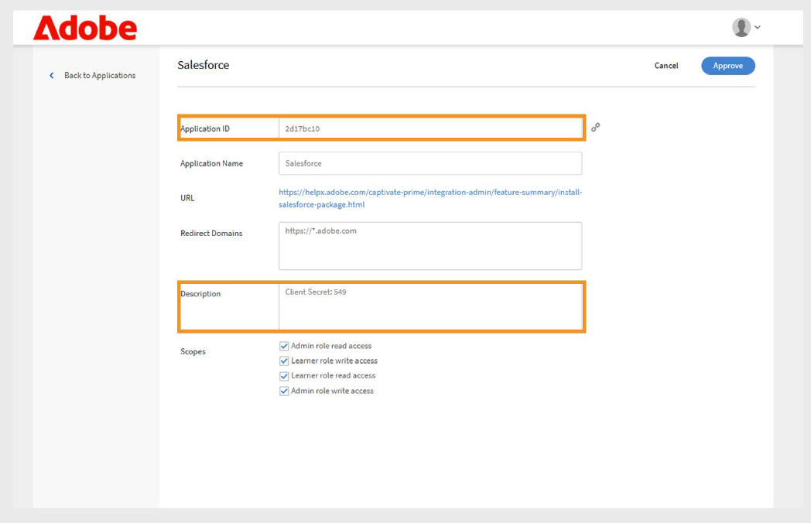

# Connecteur Salesforce pour Adobe Learning Manager

## Introduction

Le connecteur Salesforce intègre vos comptes Salesforce et Adobe Learning Manager (ALM), permettant ainsi l’importation automatisée des utilisateurs, la synchronisation des données et l’exportation des enregistrements d’apprentissage. Ce guide explique comment configurer le connecteur, gérer les données utilisateur et intégrer des informations d’apprentissage dans Salesforce.

Le connecteur Salesforce pour Adobe Learning Manager permet une intégration fluide en important automatiquement des utilisateurs, en prenant en charge le mappage de données personnalisé et en exportant des enregistrements d’apprentissage vers Salesforce.

En suivant ce guide, vous apprendrez à :

- Établir des connexions sécurisées entre Salesforce et Adobe Learning Manager.
- Configurez les processus d’importation automatisée des utilisateurs à partir de Salesforce.
- Mappez efficacement les champs Salesforce aux attributs Adobe Learning Manager.
- Exportez les enregistrements d’apprentissage vers Salesforce pour un reporting complet.
- Configurez le filtrage et la planification pour la synchronisation ciblée des données.

## Qu’est-ce que le connecteur Salesforce ?

Le connecteur Salesforce est un puissant outil d’intégration qui crée un pont transparent entre votre solution CRM Salesforce et Adobe Learning Manager. Ce connecteur élimine la saisie manuelle des données en synchronisant automatiquement les informations utilisateur, les données de contact et les enregistrements d&#39;apprentissage entre les deux plates-formes.

## Fonctionnalités clés

### Mappage des attributs

Cela permet de créer des liens flexibles entre les champs Salesforce et les attributs utilisateur Adobe Learning Manager. Vous pouvez mapper des champs standard tels que le nom, l’adresse e-mail et le responsable à des attributs correspondants dans Learning Manager. Le connecteur prend également en charge les champs personnalisés sur les deux plateformes, inclut la validation des champs requise pour maintenir la précision des données et vous permet d’enregistrer les configurations de mappage pour les réutiliser dans les futures importations.

### Importation automatisée d’utilisateurs

Il rationalise l’intégration et la maintenance des utilisateurs grâce à des processus d’importation automatisés qui éliminent la gestion manuelle des fichiers CSV.

- Importation directe à partir d’objets utilisateur Salesforce sans formats de fichiers intermédiaires.
- Synchronisation en temps réel des modifications de profil utilisateur.
- Prise en charge pour les utilisateurs standard et les contacts externes.

### Planification automatique des importations

Configurez des planifications de synchronisation automatisées qui maintiennent la devise des données sans intervention manuelle. Choisissez parmi les options de planification quotidienne, hebdomadaire ou à intervalles personnalisés.

- Configuration du fuseau horaire pour les organisations mondiales.
- Planification en période de pointe/hors pointe pour optimiser les performances du système.

### Filtre Utilisateur

- Appliquez des critères de filtrage pour cibler des populations d&#39;utilisateurs spécifiques et optimiser l&#39;efficacité de la synchronisation des données.
- Filtrage basé sur les rôles pour les programmes de formation ciblés.
- Filtrage géographique ou basé sur l&#39;emplacement pour les implémentations régionales
- Filtrage des champs personnalisés à l’aide des critères et des formules Salesforce.

## Conditions préalables

Avant de configurer le connecteur Salesforce, assurez-vous que votre environnement répond aux exigences suivantes :

- [URL de l’organisation Salesforce](https://myorg.salesforce.com)
- Informations d’identification de connexion administrateur pour Salesforce et Adobe Learning Manager.
- Administrateur système ou autorisations équivalentes dans Salesforce.
- Compte Adobe Learning Manager actif avec licence appropriée

## Configurer le connecteur Salesforce

Le connecteur Salesforce de Adobe Learning Manager permet aux administrateurs d’intégration d’automatiser la synchronisation des données utilisateur et des enregistrements d’apprentissage entre Salesforce et Adobe Learning Manager.

Pour créer un connecteur Salesforce :

1. Connectez-vous en tant qu’administrateur d’intégration.
2. Sélectionnez **Salesforce**, puis **Connect**.

   
   _Page des connecteurs Adobe Learning Manager montrant le connecteur Salesforce avec le bouton Connect mis en surbrillance_

3. Saisissez l’URL de votre organisation Salesforce et sélectionnez **Se connecter**. Vous accédez alors à la page de connexion Salesforce.

   
   _Formulaire de connexion Salesforce affichant les champs de saisie de nom d’utilisateur et de mot de passe_

4. Connectez-vous avec votre nom d’utilisateur et votre mot de passe. Effectuez toutes les étapes d’authentification supplémentaires, telles que la vérification à deux facteurs ou la réponse aux questions de sécurité.

   Une fois l&#39;authentification réussie, la page de présentation du connecteur s&#39;affiche et confirme la connexion établie entre les systèmes.

   
   _Page de présentation du connecteur Salesforce indiquant l’état de la connexion réussie_

### Attributs de mappage

Présentation du mappage des attributs Le mappage des attributs crée la connexion essentielle entre les champs de données Salesforce et les attributs utilisateur Adobe Learning Manager, garantissant ainsi que les informations utilisateur sont transférées avec précision entre les systèmes.

#### Exigences en matière de mappage

- Tous les champs Adobe Learning Manager requis doivent être mappés aux champs Salesforce correspondants.
- Les configurations de mappage sont réutilisables et persistantes sur plusieurs importations

Pour mapper les attributs :

1. Accédez à la page de présentation du connecteur Salesforce.
2. Sélectionnez **Utilisateurs internes**, puis **Configurer le mappage**.
3. Sélectionnez l’une des options suivantes :

   - **Utilisateurs :** comptes Salesforce standard utilisés par les employés ou les membres de l’équipe interne
   - **Contacts :** personnes externes telles que clients, partenaires ou fournisseurs.

4. Faites correspondre les champs actifs de Adobe Learning Manager avec les colonnes Salesforce sur la page de mappage. Le champ **Responsable** doit être mappé à un champ d&#39;adresse e-mail du responsable de l&#39;utilisateur.

   
   _L’interface de mappage des champs affiche les attributs utilisateur Adobe Learning Manager à gauche et les sélections déroulantes des champs Salesforce à droite_

5. Sélectionnez **Enregistrer** pour terminer le mappage.

## Importation d’utilisateurs et de contacts

Le connecteur Salesforce permet à Adobe Learning Manager de se connecter à votre compte Salesforce et d’importer automatiquement les utilisateurs en fonction de votre configuration.

- **Utilisateurs internes** : employés et membres du personnel disposant de comptes utilisateur Salesforce.
- **Contacts externes** : clients, partenaires, fournisseurs et autres parties prenantes externes.
- **Importations mixtes** : combinaison d&#39;utilisateurs et de contacts dans un seul processus de synchronisation.
- **Importations filtrées** : synchronisation ciblée basée sur des critères spécifiques.

Le connecteur Salesforce permet à Adobe Learning Manager de se connecter à votre compte Salesforce et d’importer automatiquement les utilisateurs en fonction de votre configuration.

Le connecteur prend en charge l’importation de contacts en plus des utilisateurs Salesforce standard. Cela permet d&#39;étendre les programmes de formation aux intervenants externes, comme les clients ou les partenaires.

Pour importer des contacts :

1. Sélectionnez **Salesforce** sur la page **Connecteurs**.
2. Sélectionnez **Importer les utilisateurs internes** sur la page de connexion.

   
   _Page du connecteur Salesforce avec l’option Importer les utilisateurs internes mise en évidence_

3. Sélectionnez **Contacts** sur la page **Importer des utilisateurs**.
4. Sélectionnez **Oui** pour l&#39;option **Filtrer les contacts avant importation**. **
5. Configurez les options suivantes :

   - **Choisir la colonne Contacts :** Sélectionnez le champ que vous souhaitez importer dans Adobe Learning Manager.
   - **Spécifier des valeurs :** sélectionnez les valeurs qui représentent le champ sélectionné.
   - Mapper les attributs Salesforce avec les champs Adobe Learning Manager

   
   _Configuration de l&#39;importation des contacts affichant les options de filtrage et le mappage des champs_

6. Sélectionnez **Enregistrer**.
7. Si vous sélectionnez **Non. Importez tous les contacts**, vous pouvez mapper les champs directement, sans filtrer les contacts.

## Exporter les enregistrements d’apprentissage

La fonctionnalité d’exportation des enregistrements d’apprentissage vous permet de partager des données Adobe Learning Manager avec Salesforce, créant ainsi des fonctionnalités complètes de création de rapports et d’analyse qui associent les résultats d’apprentissage aux données CRM.

### Objets personnalisés dans Salesforce

Avant d’exporter des enregistrements d’apprentissage depuis Adobe Learning Manager, créez des objets personnalisés dans Salesforce. Les objets personnalisés vous permettent de stocker des données spécifiques aux besoins de votre organisation ou de votre secteur d’activité. Pour plus d&#39;informations, consultez [Objets personnalisés Salesforce](https://trailhead.salesforce.com/en/content/learn/modules/data_modeling/objects_intro).

### Installation de packs Adobe Learning Manager

Adobe fournit des packages préconfigurés qui permettent de créer les objets personnalisés nécessaires :

- [Package 1](https://test.salesforce.com/packaging/installPackage.apexp?p0=04t1k0000008WPJ) : objets et champs d’apprentissage de base
- [Package 2](https://test.salesforce.com/packaging/installPackage.apexp?p0=04t1k0000008WPT) : objets d’analyse d’apprentissage étendu
- [Package 3](https://test.salesforce.com/packaging/installPackage.apexp?p0=04t1k0000008WPi) : objets de rapport et d’intégration supplémentaires

>[!IMPORTANT]
>
>Remplacez [test.salesforce.com](https://acrobat.adobe.com/home/test.salesforce.com) dans les URL du package par votre domaine d’organisation Salesforce réel.

### Processus d’installation du pack

Pour installer les packs :

1. Se connecter à Salesforce en tant qu’administrateur.
2. Accédez à chaque URL de pack dans votre navigateur.
3. Suivez l’assistant d’installation pour chaque pack et accordez les autorisations appropriées aux utilisateurs qui accéderont aux données d’apprentissage.
4. Renommez les noms des objets personnalisés dans Salesforce.
5. Sélectionnez les événements et cliquez sur **Enregistrer**.

>[!NOTE]
>
>Assurez-vous que l’accès administrateur système a été accordé à tous les champs actifs ajoutés après l’installation du pack.

### Exporter les enregistrements

Pour exporter les enregistrements vers Salesforce :

1. Sélectionnez **Exporter les enregistrements unifiés** dans la page des connecteurs **Salesforce**.
2. Sélectionnez les événements parmi les suivants :

   - Ajout d’un nouvel utilisateur
   - Inscription à la formation
   - Achèvement de la formation
   - Inscription aux compétences
   - Achèvement des compétences

3. Sélectionnez **Objet Contact** dans l&#39;option **Événement Liens avec**. Cela garantit que les utilisateurs qui existent dans Adobe Learning Manager mais pas dans Salesforce seront créés dans Salesforce.

   
   _Configuration de l’exportation des enregistrements d’apprentissage affichant les options de sélection et de liaison des événements_

>[!NOTE]
>
>Vous pouvez créer plusieurs connexions au sein d’un même compte. Chaque connexion peut prendre en charge jusqu’à trois objets personnalisés dans Salesforce. Pour créer plusieurs connexions pour le même compte Salesforce, vous pouvez installer jusqu’à trois packages. Le nombre de packs installés doit correspondre au nombre de connexions souhaité.

## Configuration de l’application Salesforce

Adobe Learning Manager fournit un package d’application Salesforce. Une fois installés et configurés dans votre instance Salesforce, les utilisateurs commerciaux peuvent accéder et suivre la formation directement dans le portail Salesforce. L’application permet aux utilisateurs de découvrir de nouveaux cours, d’afficher des recommandations personnalisées et d’utiliser du contenu sans quitter Salesforce.

### Accès à l’application Salesforce

Pour configurer l’application Salesforce :

1. Connectez-vous en tant qu’administrateur d’intégration.
2. Sélectionnez **Applications**, puis **Applications en vedette**.
3. Sélectionnez **Salesforce**.

   
   _Page Applications Adobe Learning Manager montrant la section Applications en vedette avec la vignette de l’application Salesforce mise en évidence_

4. Notez les **ID d&#39;application** et **secret du client** affichés dans la zone de texte de description.

   
   _Page de détails de l’application Salesforce dans Adobe Learning Manager affichant l’ID de l’application et le secret du client dans la zone de description_

5. Sélectionnez **Approuver** pour activer l&#39;application.

### Générer des jetons d’accès

Pour générer des jetons d’accès :

1. Accédez à **Ressources pour les développeurs** dans Adobe Learning Manager.
2. Sélectionnez **Jetons d&#39;accès pour le test et le développement**.
3. Dans la section **Obtenir le code OAuth**, saisissez l&#39;ID client (ID de l&#39;application) et la portée doit être définie sur **admin:read,admin:write**.
4. Sélectionnez **Envoyer**.
5. Dans la section **Obtenir le jeton d&#39;actualisation**, saisissez l&#39;**ID client** et le **secret client**.
6. Sélectionnez **Envoyer** et notez le jeton d’actualisation et le jeton d’accès.

>[!IMPORTANT]
>
>Notez le jeton d’actualisation et le jeton d’accès générés.

### Création d’un compte Salesforce

Si vous n’avez pas de compte Salesforce, suivez ces étapes pour en créer un en utilisant la même adresse e-mail que celle de votre compte Adobe Learning Manager. Vous pouvez utiliser l’édition Développeur ou Entreprise. Il est important de vous inscrire en utilisant le même ID d’e-mail que celui associé à votre compte Adobe Learning Manager.

1. Accédez à la page d’inscription du développeur [Salesforce](https://developer.salesforce.com/signup).
2. Saisissez les informations requises en utilisant la même adresse e-mail que celle utilisée pour votre compte Adobe Learning Manager.
3. Vérifiez votre boîte de réception et votre compte via l’e-mail envoyé par Salesforce.
4. Définissez votre mot de passe et connectez-vous à Salesforce.
5. Après vous être connecté, notez votre URL Salesforce (par exemple, https://yourorg.lightning.force.com) à utiliser lors de la configuration.

### Installation du package Adobe Learning Manager

Cette section traite de l’installation du package Adobe Learning Manager dans votre environnement Salesforce.

>[!IMPORTANT]
>
>L’application Adobe Learning Manager prend uniquement en charge la vue Salesforce Lightning. Assurez-vous que Lightning Experience est activé avant de continuer.

#### Installation du pack

Pour installer le pack :

1. Ouvrez l&#39;[URL du package Adobe Learning Manager](https://login.salesforce.com/packaging/installPackage.apexp?p0=04t1k0000008WOQ).
2. Saisissez votre nom d’utilisateur et votre mot de passe sur la page de connexion.
3. Sélectionnez **Installer**. Sur la page d’installation, gardez l’option Installer pour les administrateurs uniquement sélectionnée ; ne la modifiez pas.
4. Sélectionnez **Terminé**. Vous serez guidé vers la page **Packages installés**, où vous pouvez voir le package Adobe Learning Manager installé.

Vous serez redirigé vers la page Packages installés, où vous pourrez vérifier l’installation du package Adobe Learning Manager

#### Configuration de l’application

Pour configurer l’application :

1. Sélectionnez **Lanceur d’applications** (icône de grille à 9 points en regard de Configuration)
2. Recherchez Adobe Learning Manager.
3. Pour configurer l&#39;application, sélectionnez **Configurer**.
4. Sélectionnez **Nouveau** et ajoutez les détails suivants :

   - **Config :** entrez le nom de votre choix.
   - **ClientID** : entrez la valeur que vous avez obtenue dans la première section.
   - **ClientSecret:** Entrez la valeur que vous avez obtenue à partir de la première section.
   - **RefreshToken:** Entrez la valeur que vous avez obtenue à partir de la première section.
   - **URL de base LearningManager :** URL du site où Adobe Learning Manager est hébergé.

### Configuration du site distant

Salesforce nécessite des paramètres de site distant pour permettre la communication avec des services externes tels que Adobe Learning Manager.

#### Ajout de paramètres de site distant

Pour ajouter des paramètres de site distant :

1. Dans Salesforce, sélectionnez **Configuration** dans le coin supérieur droit.
2. Sélectionnez **Configuration** dans le coin supérieur droit de la page.
3. Recherchez **Paramètres du site distant** dans **Recherche rapide**.
4. Sélectionnez **Nouveau site distant**.
5. Saisissez les détails :

   - **Nom du site distant :** Tapez le nom de votre choix (par exemple, Adobe Learning Manager).
   - **URL du site distant :** Tapez l&#39;URL où Adobe Learning Manager est hébergé.
6. Sélectionnez **Enregistrer**.

### Configuration des notifications

Configurez les notifications pour tenir les utilisateurs informés des activités d’apprentissage et des mises à jour.

#### Création de notifications personnalisées

Pour activer les notifications :

1. Sélectionnez **Configuration** dans le coin supérieur droit.
2. Recherchez **Notifications personnalisées**, puis sélectionnez **Nouveau**.
3. Saisissez les informations suivantes :

   - **Nom de la notification personnalisée :** LearningManagerNotification
   - **Nom de l’API :** LearningManagerNotification

4. Sélectionnez **Bureau** et **Mobile** comme canaux pris en charge.
5. Sélectionnez **Enregistrer**.

#### Activer les notifications push mobiles (facultatif)

Pour les utilisateurs qui souhaitent recevoir des notifications sur des appareils mobiles :

Pour activer les notifications Push sur les appareils mobiles, procédez comme suit :

1. Installez l’application mobile Salesforce sur votre téléphone mobile.
2. Connectez-vous à l’application à l’aide de vos informations d’identification.
3. Accédez à **Configuration**, puis sélectionnez **Paramètres de remise des notifications**.
4. Ajoutez Salesforce pour iOS et Android.

### Configuration utilisateur et autorisations

Cette section couvre la configuration de l’accès utilisateur et des autorisations pour l’application Adobe Learning Manager dans Salesforce.

#### Présentation des profils utilisateur

L’application Adobe Learning Manager prend en charge différents profils utilisateur correspondant aux rôles dans Adobe Learning Manager :

- L’administrateur
- Administrateur d’intégration
- L’instructeur
- Élève
- Profils personnalisés (si nécessaire)

#### Attribution ou création de profils utilisateur

Vous pouvez soit utiliser des profils existants, soit créer des profils personnalisés pour les utilisateurs de Adobe Learning Manager :

**Utiliser des profils existants**

1. Accédez à **Configuration** et sélectionnez **Utilisateurs**.
2. Sélectionnez **Profils**.
3. Sélectionnez un profil qui s’aligne sur les rôles de vos utilisateurs
4. Attribuez ce profil aux utilisateurs pendant l’installation du pack.

**Créer des profils personnalisés**

1. Accédez à **Configurer** et sélectionnez** utilisateurs. **
2. Sélectionnez **Profils**.
3. Cliquez sur **Nouveau profil**.
4. Créez un profil personnalisé basé sur un profil existant, adapté aux utilisateurs de Adobe Learning Manager.

#### Configuration du profil

Pour configurer un profil :

1. Après avoir installé le package, sélectionnez **Configurer**, puis sélectionnez **Nouveau**.
2. Saisissez les informations suivantes :

   - **Nom de la configuration**
   - **ClientID**
   - **ClientSecret**
   - **LearningManagerBaseURL**
   - **Désactiver la redirection**

>[!NOTE]
>
>Assurez-vous que l’application Adobe Learning Manager est activée pour que tous les élèves puissent la consulter.

#### Définir les autorisations utilisateur

Sélectionnez les utilisateurs et attribuez les autorisations nécessaires pour accéder à l’application Adobe Learning Manager.

#### Mettre à jour les paramètres du profil

1. Sélectionnez un profil (par exemple, Profil standard), puis sélectionnez **Modifier**.
2. Dans la section **Paramètres d&#39;application personnalisés**, cochez la case **Adobe Learning Manager** pour rendre l&#39;application accessible.
3. Dans la section **Paramètres d&#39;onglet personnalisés**, définissez **Page d&#39;accueil des élèves** sur **Activé par défaut**.
4. Sélectionnez **Enregistrer** pour appliquer les modifications.

Les élèves disposant des profils attribués peuvent désormais accéder à l’application Adobe Learning Manager dans Salesforce.

Vous avez configuré le connecteur Salesforce pour Adobe Learning Manager. Les utilisateurs peuvent désormais accéder à leur contenu d’apprentissage directement dans Salesforce, ce qui améliore l’adoption et l’engagement avec les programmes de formation de votre entreprise.
