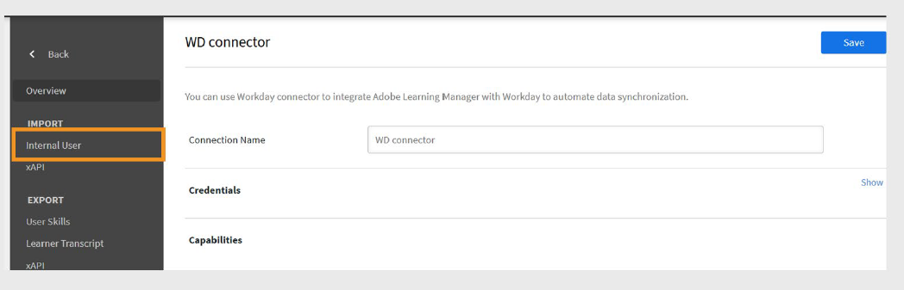

# Connecteur Workday dans Adobe Learning Manager

## Introduction

**Workday** est un système basé sur le cloud qui aide les organisations à gérer les données financières et les employés. Il est principalement utilisé pour les tâches de RH comme l&#39;embauche, la paie et le suivi du rendement. Lorsqu’il est connecté à Adobe Learning Manager, il permet la synchronisation automatique des données d’utilisateur et de compétence entre les deux plateformes.

Le connecteur Workday vous permet d’intégrer Adobe Learning Manager de manière transparente au client Workday de votre organisation. Cette intégration permet la synchronisation automatique des données et des compétences des utilisateurs entre les deux systèmes, améliorant la précision des données et réduisant l&#39;effort manuel.

## Principaux avantages

- Importez des utilisateurs de Workday vers Adobe Learning Manager.
- Mappez les attributs entre Workday et Adobe Learning Manager.
- Exportez les compétences des utilisateurs de Adobe Learning Manager vers Workday.
- Planifiez l’exécution automatique des tâches de synchronisation des données.

## Conditions préalables

Avant de configurer le connecteur Workday, demandez à votre administrateur Workday de vous fournir les informations suivantes :

- URL d’hôte
- ID du client
- Nom d’utilisateur
- Mot de passe

## Configuration du connecteur Workday

Vous pouvez configurer le connecteur Workday dans Adobe Learning Manager pour vous permettre d’importer des données utilisateur à partir de Workday, de réexporter les compétences des utilisateurs vers Workday et de planifier des synchronisations automatisées afin que les deux systèmes restent à jour.

Pour configurer le connecteur Workday :

1. Connectez-vous à Adobe Learning Manager en tant qu’administrateur d’intégration.
2. Passez le curseur de la souris sur la vignette **Workday** et sélectionnez **Se connecter**.

   
   _Configurer le connecteur Workday pour importer et exporter les données_

3. Saisissez les informations de connexion suivantes :
   - **Nom de la connexion** : nom de votre choix pour la connexion.
   - **Url de l&#39;hôte** : fournie par votre administrateur Workday.
   - **Client** : identifiant interne de votre administrateur Workday.
   - **Nom d’utilisateur et mot de passe** : l’administrateur Workday crée un utilisateur ISU (Integrated System User) avec les privilèges de sécurité requis et le partage avec l’administrateur d’intégration.

   
   _Ajoutez les détails nécessaires pour configurer le connecteur Workday_

4. Sélectionnez **Se connecter** pour terminer la configuration.

>[!NOTE]
>
>Vous pouvez configurer plusieurs connexions Workday dans votre compte.

## Importation d’utilisateurs depuis Workday

### Attributs de mappage

Vous pouvez utiliser le connecteur Workday pour importer des utilisateurs actifs de votre client Workday dans Adobe Learning Manager. Cette intégration rationalise la gestion des utilisateurs en conservant les dossiers des employés synchronisés. Outre Workday, Adobe Learning Manager prend également en charge les importations utilisateur à partir d’autres sources de données telles que FTP et Salesforce.

Avant d’importer des utilisateurs, vous devez mapper les attributs utilisateur entre Workday et Learning Manager.

1. Accédez à la page **Présentation** dans le connecteur Workday.
2. Sélectionnez **Utilisateurs internes** dans la section **Importer**.

   
   _Sélectionnez Utilisateurs internes pour mapper les attributs utilisateur_

3. Utilisez l&#39;option **Mapper les attributs** pour lier les champs entre les deux systèmes :
   - Dans la colonne **Adobe Learning Manager**, sélectionnez l&#39;attribut Adobe Learning Manager correspondant.
   - Dans la colonne **Workday**, utilisez le menu déroulant pour sélectionner l&#39;attribut Workday correspondant.

   
   _Mappage des attributs Workday avec les champs Adobe Learning Manager_

   >[!NOTE]
   >
   >Adobe Learning Manager prend actuellement en charge l&#39;importation de **69 attributs utilisateur** maximum à partir de Workday. Vous pouvez activer des champs supplémentaires à l&#39;aide de la fonctionnalité **Champs actifs** dans Adobe Learning Manager. Pour ajouter des attributs Workday personnalisés, contactez votre gestionnaire de compte Customer Success (CSAM).

4. Cochez la case **Exclure les travailleurs intérimaires** pour éviter d’importer des travailleurs temporaires.
5. Appliquez des filtres si nécessaire, par exemple, pour importer des utilisateurs sous des responsables spécifiques.

>[!IMPORTANT]
>
>Assurez-vous que l’UUID, l’adresse électronique et le nom de l’employé sont uniques. Des valeurs incorrectes ou en double peuvent entraîner des échecs d’intégration.

## Attributs Workday pris en charge

Liste des attributs Workday pris en charge :

```
wd:User_ID wd:Worker_ID manager wd:Personal_Data.wd:Name_Data.wd:Preferred_Name_Data.wd:Name_Detail_Data.@wd:Formatted_Name wd:Personal_Data.wd:Name_Data.wd:Legal_Name_Data.wd:Name_Detail_Data.@wd:Formatted_Name wd:Personal_Data.wd:Name_Data.wd:Legal_Name_Data.wd:Name_Detail_Data.wd:Prefix_Data.wd:Title_Descriptor wd:Personal_Data.wd:Name_Data.wd:Preferred_Name_Data.wd:Name_Detail_Data.wd:Prefix_Data.wd:Title_Descriptor wd:Personal_Data.wd:Name_Data.wd:Preferred_Name_Data.wd:Name_Detail_Data.wd:First_Name wd:Personal_Data.wd:Name_Data.wd:Preferred_Name_Data.wd:Name_Detail_Data.wd:Last_Name wd:Personal_Data.wd:Name_Data.wd:Legal_Name_Data.wd:Name_Detail_Data.wd:First_Name wd:Personal_Data.wd:Name_Data.wd:Legal_Name_Data.wd:Name_Detail_Data.wd:Last_Name wd:Personal_Data.wd:Contact_Data.wd:Address_Data.0.@wd:Formatted_Address wd:Personal_Data.wd:Contact_Data.wd:Address_Data.0.wd:Postal_Code wd:Personal_Data.wd:Contact_Data.wd:Email_Address_Data.0.wd:Email_Address wd:Personal_Data.wd:Contact_Data.wd:Address_Data.0.wd:Country_Region_Descriptor wd:Personal_Data.wd:Contact_Data.wd:Phone_Data.0.@wd:Formatted_Phone wd:Personal_Data.wd:Contact_Data.wd:Phone_Data.0.wd:Country_ISO_Code wd:Personal_Data.wd:Contact_Data.wd:Phone_Data.0.wd:International_Phone_Code wd:Personal_Data.wd:Contact_Data.wd:Phone_Data.0.wd:Phone_Number wd:Personal_Data.wd:Primary_Nationality_Reference.wd:ID.1.$ wd:Personal_Data.wd:Gender_Reference.wd:ID.1.$ wd:Personal_Data.wd:Identification_Data.wd:National_ID.0.wd:National_ID_Data.wd:ID wd:Personal_Data.wd:Identification_Data.wd:Custom_ID.0.wd:Custom_ID_Data.wd:ID wd:User_Account_Data.wd:Default_Display_Language_Reference.wd:ID.1.$ wd:Role_Data.wd:Organization_Role_Data.wd:Organization_Role.0.wd:Organization_Role_Reference.wd:ID.1.$ wd:Employment_Data.wd:Worker_Job_Data.0.wd:Position_Data.wd:Position_Title wd:Employment_Data.wd:Worker_Job_Data.0.wd:Position_Data.wd:Business_Title wd:Employment_Data.wd:Worker_Job_Data.0.wd:Position_Data.wd:Business_Site_Summary_Data.wd:Name wd:Employment_Data.wd:Worker_Job_Data.0.wd:Position_Data.wd:Business_Site_Summary_Data.wd:Address_Data.@wd:Formatted_Address
wd:Employment_Data.wd:Worker_Job_Data.0.wd:Position_Data.wd:Job_Classification_Summary_Data.0.wd:Job_Classification_Reference.wd:ID.1.$ wd:Employment_Data.wd:Worker_Job_Data.0.wd:Position_Data.wd:Job_Classification_Summary_Data.0.wd:Job_Group_Reference.wd:ID.1.$ wd:Employment_Data.wd:Worker_Job_Data.0.wd:Position_Data.wd:Work_Space__Reference.wd:ID.1.$ wd:Employment_Data.wd:Worker_Job_Data.0.wd:Position_Data.wd:Job_Profile_Summary_Data.wd:Job_Family_Reference.0.wd:ID.1.$ wd:Employment_Data.wd:Worker_Job_Data.0.wd:Position_Data.wd:Job_Profile_Summary_Data.wd:Job_Profile_Name wd:Employment_Data.wd:Worker_Job_Data.0.wd:Position_Data.wd:Job_Profile_Summary_Data.wd:Job_Profile_Reference.wd:ID.1.$ wd:Employment_Data.wd:Worker_Job_Data.0.wd:Position_Data.wd:Business_Site_Summary_Data.wd:Address_Data.0.wd:Country_Reference.wd:ID.2.$ wd:Employment_Data.wd:Worker_Job_Data.0.wd:Position_Data.wd:Worker_Type_Reference.wd:ID.1.$ wd:Employment_Data.wd:Worker_Job_Data.0.wd:Position_Data.wd:Business_Site_Summary_Data.wd:Address_Data.0.@wd:Formatted_Address wd:Employment_Data.wd:Worker_Job_Data.0.wd:Position_Data.wd:Job_Profile_Summary_Data.wd:Management_Level_Reference.wd:ID.1.$ wd:Employment_Data.wd:Worker_Status_Data.wd:Active wd:Employment_Data.wd:Worker_Status_Data.wd:Active_Status_Date wd:Employment_Data.wd:Worker_Status_Data.wd:Hire_Date wd:Employment_Data.wd:Worker_Status_Data.wd:Original_Hire_Date wd:Employment_Data.wd:Worker_Status_Data.wd:Retired wd:Employment_Data.wd:Worker_Status_Data.wd:Retirement_Date wd:Employment_Data.wd:Worker_Status_Data.wd:Terminated wd:Employment_Data.wd:Worker_Status_Data.wd:Termination_Date wd:Employment_Data.wd:Worker_Status_Data.wd:Termination_Last_Day_of_Work wd:Organization_Data.wd:Worker_Organization_Data.0.wd:Organization_Data.wd:Organization_Code wd:Organization_Data.wd:Worker_Organization_Data.0.wd:Organization_Data.wd:Organization_Name wd:Organization_Data.wd:Worker_Organization_Data.0.wd:Organization_Data.wd:Organization_Type_Reference.wd:ID.1.$ wd:Organization_Data.wd:Worker_Organization_Data.0.wd:Organization_Data.wd:Organization_Subtype_Reference.wd:ID.1.$ wd:Qualification_Data.wd:Education.0.wd:School_Name wd:Qualification_Data.wd:External_Job_History.0.wd:Job_History_Data.wd:Job_Title wd:Qualification_Data.wd:External_Job_History.0.wd:Job_History_Data.wd:Company wd:Management_Chain_Data.wd:Worker_Supervisory_Management_Chain_Data.wd:Management_Chain_Data.0.wd:Manager.Employee_ID Primary Work Email wd:Organization_Type_Reference_Cost_Center_ID wd:Organization_Type_Reference_Cost_Center_Name wd:Organization_Type_Reference_Company wd:Organization_Subtype_Reference_Department
wd:Organization_Subtype_Reference_Division wd:Universal_ID wd:Employment_Data.wd:Worker_Job_Data.0.wd:Position_Data.wd:Business_Site_Summary_Data.wd:Address_Data.0.wd:Country_Region_Descriptor wd:Employment_Data.wd:Worker_Job_Data.0.wd:Position_Data.wd:Business_Site_Summary_Data.wd:Address_Data.0.wd:Country_Region_Reference.wd:ID.2.$ wd:Personal_Data.wd:Contact_Data.wd:Address_Data.0.wd:Municipality
```

## Exportation des compétences des utilisateurs vers Workday

Vous pouvez exporter toutes les compétences des utilisateurs actifs de Adobe Learning Manager vers Workday. Les compétences retirées ne sont pas exportées.

>[!IMPORTANT]
>
>- N’essayez pas d’exporter simultanément des compétences de plusieurs comptes Adobe Learning Manager vers le même compte Workday.
>- Si plusieurs comptes Adobe Learning Manager utilisent le même compte Workday, assurez-vous que les noms de compétence sont cohérents entre les comptes pour éviter les conflits.

### Configuration d’une exportation planifiée

Pour configurer les exportations planifiées :

1. Sélectionnez **Compétences de l&#39;utilisateur**, puis **Configurer la planification** dans la page **Présentation de Workday**.

   
   _Sélectionner les compétences de l&#39;utilisateur pour planifier l&#39;exportation_

2. Cochez la case **Activer l&#39;exportation des compétences des utilisateurs à l&#39;aide de cette connexion**.
3. Sélectionnez **Activer la planification**.
4. Définissez la date de début, l&#39;heure et l&#39;intervalle de périodicité.

   
   _Configurer l&#39;exportation de la planification dans le connecteur Workday_

5. Sélectionnez **Enregistrer** pour appliquer la planification.

### Exportation à la demande

Pour créer des exportations à la demande :

1. Sélectionnez **À la demande** dans la page **Aperçu Workday**.
2. Tapez la date de début à partir de laquelle le rapport doit commencer.
3. Sélectionnez **Exécuter** pour exécuter le rapport.

### Afficher l’état d’exécution

1. Accédez à **État d&#39;exécution**.
2. Affichez l&#39;état de toutes les tâches et téléchargez les rapports d&#39;erreur selon vos besoins.

## Planification des tâches de synchronisation

Vous pouvez configurer le connecteur pour exécuter automatiquement les tâches de synchronisation des données :

- Planifiez des importations quotidiennes d’utilisateurs de Workday vers Learning Manager.
- Planifiez des exportations périodiques de compétences d’utilisateur vers Workday.

>[!NOTE]
>
>La planification garantit que les enregistrements d&#39;utilisateur et les données de compétence sont toujours à jour dans les deux systèmes.

## Points à retenir

- Le champ UUID renseigné à partir de Workday ne peut pas être supprimé par les administrateurs LMS orientés client.
- La fonction **Purge des utilisateurs** prend uniquement en charge jusqu&#39;à 50 utilisateurs par exécution. Soyez prudent lorsque vous importez des utilisateurs avec des UUID.
- Les compétences sont mappées au niveau de l’élément de compétence dans Workday, à l’aide du nom et du niveau de compétence de Adobe Learning Manager.
