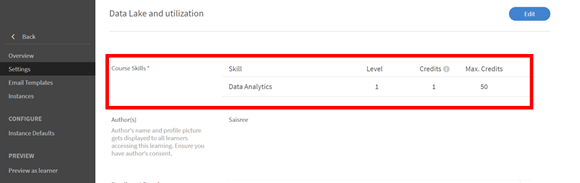

# Impossible d’acquérir une compétence après avoir suivi un cours

## Problème

Même après avoir terminé un cours, un élève n’obtient pas de compétence. Les compétences attribuées à ce cours restent **En cours** pour l’élève.

## Cause

Ce problème se produit si les **Crédits requis** pour atteindre cette compétence sont supérieurs aux **Crédits acquis** par l’élève après avoir terminé le cours.

## Solution

Vérifiez les **crédits de compétence** et les **points** requis pour acquérir la compétence. Procédez comme suit :

1. Pour l’élève, générez un rapport **Relevé de notes de l’élève**.
1. Lors de la génération du relevé de notes de l&#39;élève, cliquez sur **[!UICONTROL Options avancées]** et cochez l&#39;option **[!UICONTROL Inclure les données de compétences et les fiches récapitulatives]**.

   

   *Sélectionnez l’option Inclure les données de compétences et les fiches récapitulatives*

1. Ouvrez le rapport Relevé de notes de l’élève téléchargé.
1. Accédez à la feuille **[!UICONTROL Relevé des compétences]**. Vous pouvez afficher ici les **[!UICONTROL Crédits requis]** et les **[!UICONTROL Crédits acquis]** par l’élève.

   Dans l’exemple ci-dessous, les crédits requis pour acquérir la compétence pour un cours s’élèvent à 50. Mais l’élève n’a obtenu qu’un seul crédit.

   

   *Afficher les crédits requis*

1. Pour vérifier les crédits qui sont attribués pour une compétence particulière, connectez-vous en tant qu’administrateur et accédez à **Compétences**, comme indiqué ci-dessous :

   

   *Onglet Compétences de lancement*

1. Pour vérifier le nombre de crédits attribués à un cours, connectez-vous en tant qu’auteur et ouvrez le cours. Cliquez sur **[!UICONTROL Paramètres]** > **Compétences pédagogiques** comme indiqué ci-dessous :

   

   *Afficher les compétences du cours*
