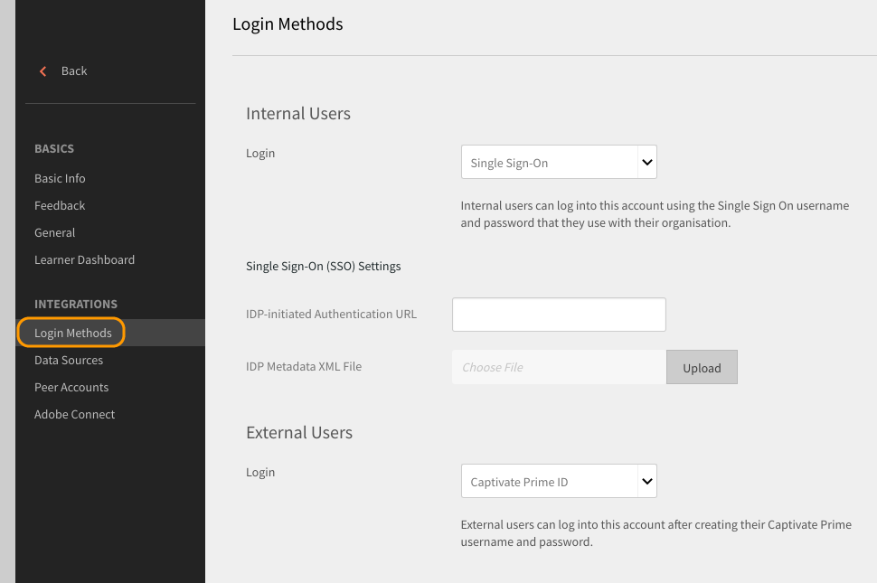

# Se connecter à Learning Manager à l’aide de l’authentification SSO

Ce document vous aide à configurer l’authentification SSO pour vous connecter à votre compte Learning Manager.

Pour configurer l’authentification unique, suivez la procédure suivante :

1. Ouvrez **[!UICONTROL Paramètres]** > **[!UICONTROL Méthodes de connexion]**.

   

1. Sélectionnez **[!UICONTROL Utilisateurs internes]** ou **[!UICONTROL Utilisateurs externes]** selon vos besoins.
1. Cliquez sur la liste déroulante en regard de l&#39;option **[!UICONTROL connexion]** et sélectionnez **[!UICONTROL Authentification unique]**.

   

1. Pour ajuster les paramètres d&#39;authentification unique (SSO), cliquez sur **[!UICONTROL Modifier]**.

   

1. Entrez **[!UICONTROL l&#39;URL d&#39;authentification initiée par l&#39;IDP]** fournie par votre fournisseur de services et chargez votre fichier XML en cliquant sur **[!UICONTROL Fichier XML de métadonnées IDP]**.

   

   L’authentification unique que vous configurez dans Learning Manager doit être prise en charge par SAML 2.0.

   Vous pouvez désormais vous connecter à Learning Manager à l’aide de l’authentification SSO.
