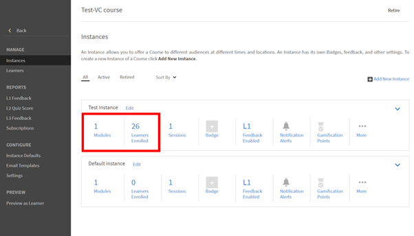

# Impossible d’afficher les envois de fichiers dans Adobe Learning Manager

## Le problème

Un instructeur ne peut pas afficher les envois de fichiers chargées par un élève.

## Description

Les instructeurs ne peuvent pas afficher les fichiers que les élèves ont chargés dans le **module d&#39;activité d’envoi**.

Par exemple, un élève s’était inscrit pour une instance nommée **Instance test** d&#39;un cours, comme indiqué ci-dessous :

*Afficher l&#39;instance*

L’élève ouvre ensuite le cours et charge un fichier dans le module Activité.

Lorsque l&#39;instructeur tente d&#39;approuver l’envoi, il n&#39;est pas en mesure de le faire.

*Charger un fichier dans le module Activité*

## Cause

S’il n’y a pas d’instructeur dans l’instance de cours dans laquelle l’élève est inscrit, le problème apparaît.

## Résolution

Pour vérifier si un instructeur est ajouté à l’instance de cours, procédez comme suit :

1. Accédez aux paramètres du cours.
1. Dans la section **Gérer**, cliquez sur **[!UICONTROL Instances].**
1. Dans l&#39;instance où l&#39;élève est inscrit, cliquez sur **[!UICONTROL Sessions]**.

   

   *Sélectionner des sessions dans l&#39;instance*

   Aucun instructeur n’est affecté à cette session.

1. Cliquez sur **[!UICONTROL Modifier]**. Ajoutez l’instructeur qui approuve l’envoi du fichier.

   

   *Ajouter l&#39;instructeur*
1. Enregistrez les modifications.
