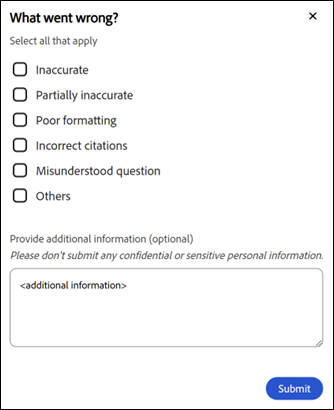

# Assistant Élève

L’assistant Learner AI (Beta) pour les élèves les aide à trouver rapidement des réponses à partir du contenu d’apprentissage attribué sans parcourir l’intégralité des cours. Vous pouvez poser des questions dans un langage simple et recevoir des réponses précises et ciblées avec des liens sources vers le contenu du cours concerné.

>[!IMPORTANT]
>
>Learner AI Assistant est actuellement en version Beta et sera disponible dans le cadre d&#39;un déploiement progressif. L’accès peut varier selon l’utilisateur.

## Qu’est-ce que l’assistant d’IA dédiée aux élèves ?

Learner AI Assistant est un compagnon de chat alimenté par GenAI dans Adobe Learning Manager qui fournit des réponses rapides et précises aux questions des élèves à l&#39;aide du contenu d&#39;apprentissage de confiance qui leur est disponible dans Adobe Learning Manager. Il comprend également des citations, de sorte que les élèves connaissent toujours la source de l’information.

## Pourquoi l’utiliser ?

* Les élèves sont confrontés à une surcharge de contenu et ne savent souvent pas par où commencer ni quelle ressource utiliser.

* Les règles de catalogue et d’accès rendent difficile la découverte du contenu disponible.

* Les parcours d’apprentissage sont fragmentés en plusieurs formats et types de formation, tels que les cours, les salles de classe virtuelles, les assistances à la tâche et les évaluations.

* Il n’existe aucun moyen simple et unifié de récupérer des informations spécifiques à partir de divers formats tels que SCORM, PDF, documents, vidéos ou transcriptions.

* Les différents rôles d’élève et secteurs d’activité (par exemple, ventes, marketing, support, opérations) ont des besoins en informations uniques qui nécessitent des réponses contextuelles rapides.

## Quels types de contenu l’assistant AI peut-il transcrire ?

L’assistant AI peut trouver des informations à partir de tous les types de contenu d’apprentissage qui vous sont attribués, notamment :

* **Documents :** PDF, Word, PowerPoint, Excel, HTML

* **Média :** audio (mp3, wav, m4a), vidéo (mp4, mov, wmv)

* **Contenu interactif :** SCORM 1.2, SCORM 2004,

* **Type d’objet d’apprentissage :** cours, parcours d’apprentissage, certifications, assistances à la tâche

Adobe transcrit en toute sécurité votre contenu d’apprentissage à l’aide de services de traitement tiers de confiance hébergés dans l’environnement VPC privé d’Adobe.

**IMPORTANT**

L’assistant AI ne consomme que du contenu :

* Disponible dans les catalogues configurés pour l’assistant de l’élève par les administrateurs, et

* Fait partie des catalogues internes dans Adobe Learning Manager.

Les catalogues partagés, acquis, externes ou autres catalogues non internes ne sont pas pris en charge en tant que sources de contenu pour l’assistant AI dans la version actuelle.

Si vous n’avez pas accès à un cours, les liens de citation associés ne vous seront pas accessibles. Les bibliothèques tierces (telles que LinkedIn Learning ou Go1) ne sont pas incluses pour récupérer les réponses.

## Capacités de conversation

L’assistant AI prend en charge les questions simples et les conversations multitours. Il rappelle vos requêtes précédentes au cours de la même session.

**Exemple de conversation :**

Vous : « Quelle est la politique de remboursement ? »
Assistant : fournit un résumé
Vous : « Et les remboursements après 30 jours ? »
Assistant : renvoie des informations plus spécifiques

## Cas d’utilisation de l’assistant AI

### Prise en charge de l’apprentissage « juste à temps » (tous les élèves)

Les élèves ont souvent besoin de réponses rapides pendant leur travail, pas de rediffusions complètes du cours. L’assistant d’IA permet de récupérer instantanément des informations précises à partir du contenu d’apprentissage attribué.

**Ce que cela permet de faire :**

* Obtenez des réponses directes à des questions spécifiques à partir de cours, d’assistances à la tâche et de documents

* Accès aux sections référencées exactes à l’aide de citations

* Réduction du temps passé à rechercher dans plusieurs objets d’apprentissage

### Activation des ventes et conversations avec les clients

Les équipes commerciales ont besoin d’informations rapides et précises sur les produits et les processus lors des interactions en direct avec les clients. L’assistant d’IA agit en tant que compagnon de connaissances à la demande.

**Ce que cela permet de faire :**

* Récupérer les fonctionnalités et le positionnement à jour du produit

* Générer des scripts de vente rapides ou des points de discussion à partir du contenu de formation

* Comparer les versions ou les offres de produits à l’aide du matériel d’apprentissage attribué

* Renforcer les connaissances commerciales sans reprendre l’intégralité des cours

**Exemple 2**

**Objectif :** montrer que l&#39;assistant IA peut aider les commerciaux à répondre instantanément aux questions de comparaison des clients.

**Invite recommandée :** comparez Adobe Learning Manager et un LMS traditionnel pour la formation en entreprise. Afficher la comparaison sous forme de tableau.

### Marketing et préparation aux campagnes

Les équipes marketing ont souvent besoin d’actualisations rapides avant les révisions, les lancements ou les discussions avec les parties prenantes. L’assistant AI résume le contenu d’apprentissage complexe en informations exploitables.

**Ce que cela permet de faire :**

* Résumez de longs cours ou vidéos en points à retenir

* Actualisation des connaissances sur les processus ou les produits avant les réunions

* Découvrir du contenu d’apprentissage associé pour approfondir l’expertise

### Clarification des opérations et des processus

Les opérations, le support et les équipes internes s’appuient sur une documentation précise des processus. L’assistant AI permet de clarifier instantanément les stratégies et les workflows.

**Ce que cela permet de faire :**

* Trouvez des réponses sur les processus internes, les MON et les directives de conformité

* Clarifier les détails de niveau étape sans parcourir les documents volumineux

* Réduction de la dépendance aux experts pour les questions répétitives

### Intégration et transitions de rôle plus rapides

Les nouvelles recrues et les employés qui changent de rôle ont souvent de la difficulté à naviguer dans les grands catalogues d&#39;apprentissage. L&#39;assistant en IA accélère l&#39;accélération en les guidant vers des réponses pertinentes.

**Ce que cela permet de faire :**

* Répondre aux questions d’intégration courantes à partir du contenu attribué

* Expliquez rapidement les concepts spécifiques à chaque rôle

* Prise en charge de l’apprentissage autodirigé sans surcharge d’informations

### Actualisation des connaissances et apprentissage continu

Les apprenants expérimentés ont besoin de rafraîchissements rapides plutôt que d&#39;une reconversion complète. L’assistant AI prend en charge l’apprentissage continu dans le flux du travail.

**Ce que cela permet de faire :**

* Actualiser les connaissances à la demande sans réexaminer les cours

* Renforcer les résultats d’apprentissage à la fin de la formation

* Encouragez un engagement fréquent et à faible effort avec le contenu d’apprentissage

## Utilisation du contenu par l’assistant d’IA dédiée aux élèves

L’assistant d’IA dédiée aux élèves vous aide à trouver rapidement des réponses précises pendant que vous apprenez. Pour l&#39;utiliser efficacement, vous devez comprendre le contenu utilisé par l&#39;assistant, ce qu&#39;il n&#39;utilise pas et comment il génère des réponses.

### Quel contenu utilise l’assistant AI ?

L’assistant Learner AI répond aux questions en utilisant uniquement le contenu d’apprentissage qui vous est attribué dans Adobe Learning Manager.

* L&#39;assistant utilise le contenu des catalogues internes que votre administrateur active pour l&#39;assistant d&#39;IA dédiée aux élèves.

* L&#39;assistant respecte votre rôle, l&#39;appartenance au groupe et les autorisations du catalogue lors de la récupération des informations.

### Quel contenu l’assistant AI n’utilise pas ?

L’assistant IA dédiée aux élèves limite les réponses à la portée d’apprentissage qui vous est attribuée.

* Il n’utilise pas le contenu des catalogues par défaut, partagé, acquis, externe ou d’autres catalogues non internes.

* Il ne récupère pas les informations des bibliothèques de contenu tierces telles que LinkedIn Learning ou Go1.

* Il ne parcourt pas Internet et n’accède pas à des sites web externes pour générer des réponses.

### Comment l’assistant IA génère les réponses

L’assistant Learner AI analyse le contenu d’apprentissage qui vous est attribué pour générer des réponses ciblées et contextuelles.

* Chaque réponse comprend des citations qui font référence au contenu source d’origine.

* Vous pouvez sélectionner une citation pour accéder directement au cours, module ou document concerné.

* Les citations vous aident à vérifier les informations et à explorer d’autres contextes si nécessaire.

### Utiliser AI Assistant de manière responsable

Utilisez l’assistant d’IA dédiée aux élèves comme aide à l’apprentissage pour explorer, actualiser et renforcer vos connaissances.

* Considérer les réponses comme des conseils en fonction du contenu d’apprentissage disponible.

* Reportez-vous aux documents sources cités pour obtenir des informations complètes et fiables.

### Comment les administrateurs contrôlent l’accès

Les administrateurs gèrent l’accès à l’assistant Learner AI et contrôlent le contenu qu’il utilise.

* Les administrateurs affectent l&#39;assistant à des groupes d&#39;utilisateurs spécifiques.

* Les administrateurs sélectionnent les catalogues internes que l&#39;assistant peut utiliser comme sources de contenu.

* Ces contrôles garantissent que l&#39;assistant n&#39;affiche que le contenu d&#39;apprentissage approuvé et pertinent.

## À propos des invites intégrées

L’assistant d’IA dédiée aux élèves comprend un ensemble d’invites intégrées pour aider les élèves à se familiariser rapidement avec les questions et les scénarios courants. Ces invites indiquent aux élèves comment interagir avec l&#39;assistant et leur montrent les types de questions qu&#39;ils peuvent poser.

Les invites intégrées sont personnalisables par compte. Les organisations peuvent personnaliser ces invites pour refléter leurs objectifs d’apprentissage, les rôles des élèves, la terminologie ou des cas d’utilisation spécifiques.

Les administrateurs peuvent travailler avec leur gestionnaire de succès client (CSM) pour configurer, modifier ou mettre à jour les invites intégrées pour leur compte. La personnalisation des invites est gérée au niveau du compte et n’est pas configurable directement dans l’interface utilisateur de Adobe Learning Manager dans la version actuelle.

Les invites affichées aux élèves peuvent varier selon le compte en fonction de la configuration définie avec l’Adobe.

## Activer l’assistant d’IA dédiée aux élèves

L’assistant AI (Beta) fournit un support optimisé par l’IA pour aider les élèves à découvrir et à utiliser le contenu plus efficacement. Les administrateurs contrôlent l’accès en affectant la fonctionnalité à des groupes d’utilisateurs et des catalogues spécifiques. Seuls les catalogues internes doivent être utilisés lors de la configuration de l’assistant AI. Le contenu des catalogues Partagé, Acquis, Externe ou d&#39;autres catalogues non internes n&#39;est pas pris en charge pour l&#39;affichage dans les réponses et les citations de l&#39;Assistant IA.

Les administrateurs sélectionnent les groupes d’utilisateurs et les catalogues internes qui peuvent accéder à la fonctionnalité Assistant IA. Ils doivent s’assurer que les catalogues attribués incluent uniquement le contenu d’apprentissage qui est approprié pour être refait surface via des réponses et des citations de l’IA, et que ces catalogues sont internes, non partagés, acquis ou externes.

Avant de configurer l’assistant AI (Beta), vérifiez que vous disposez d’informations d’identification d’administrateur et que vous avez identifié les groupes d’utilisateurs et les catalogues qui doivent avoir accès à la fonctionnalité.

### Configuration de l’accès à l’assistant Élève

Pour activer l’assistant d’IA dédiée aux élèves :

&#x200B;1. Connectez-vous à Adobe Learning Manager en tant qu’administrateur.

&#x200B;2. Sélectionnez **Paramètres** dans la page d&#39;accueil.

&#x200B;3. Sélectionnez **Learner AI Assistant (Beta)** dans le menu **Paramètres**.

&#x200B;4. Sélectionnez le bouton à bascule pour activer l&#39;**assistant Learner AI (Beta)**.

&#x200B;5. Sélectionnez un ou plusieurs groupes d&#39;utilisateurs dans l&#39;option **Groupes d&#39;utilisateurs éligibles**.

&#x200B;6. Sélectionnez **Enregistrer** pour appliquer les paramètres du groupe d&#39;utilisateurs.

&#x200B;7. Sélectionnez un ou plusieurs catalogues dans l&#39;option **Catalogues éligibles**.

&#x200B;8. Sélectionnez **Enregistrer** pour appliquer les paramètres du catalogue.

>[!IMPORTANT]
>
>Seuls les catalogues internes sont pris en charge par l’assistant AI. Si vous sélectionnez un catalogue partagé, acquis, externe ou autre catalogue non interne, son contenu n’est pas affiché en surface par l’assistant IA, même si le catalogue apparaît dans la liste Catalogues éligibles.

## Accéder à l’assistant d’IA dédiée aux élèves dans Adobe Learning Manager

L’assistant Learner AI (Beta) de Adobe Learning Manager vous aide à trouver des réponses rapidement pendant que vous apprenez. Cet outil intelligent répond directement à vos questions sur les cours, le contenu et les fonctionnalités de la plateforme, le tout à partir de votre compte d’élève.

L&#39;assistant AI peut uniquement utiliser le contenu des catalogues internes que votre administrateur a activés pour l&#39;assistant Élève. Le contenu qui réside uniquement dans les catalogues partagés, acquis ou externes n’est pas inclus.

L’assistant Learner AI (Beta) est disponible uniquement pour les élèves sélectionnés.

### Lancer l’assistant AI

Pour lancer l’assistant d’IA dédiée aux élèves :

&#x200B;1. Connectez-vous à Adobe Learning Manager en tant qu’élève.

&#x200B;2. Sélectionnez **Demander à l&#39;Assistant IA** sur la page d&#39;accueil.

3.Lorsque l&#39;écran **Assistant IA dédiée aux élèves (Beta)** s&#39;affiche, sélectionnez **Commencer**.

>[!NOTE]
>
>Lorsque vous lancez l’assistant AI pour la première fois, vous devez donner votre consentement avant de l’utiliser. La boîte de dialogue de consentement s’affiche uniquement lors de ce lancement initial. Pour tous les lancements suivants, vous serez directement redirigé vers l’assistant AI pour saisir vos invites.

&#x200B;4. Saisissez l’invite dans le champ de texte.

&#x200B;5. Appuyez sur **Entrée** pour recevoir une réponse. Passez en revue votre réponse, vos sources et vos recommandations.

L’Adobe permet une personnalisation rapide au niveau du compte. Pour configurer ou mettre à jour les invites intégrées, contactez votre gestionnaire de succès client (CSM) Adobe.

Les réponses de l&#39;assistant IA incluent des citations à chaque réponse afin que les élèves puissent facilement vérifier d&#39;où proviennent les informations. Chaque référence citée renvoie au module de cours, à l’assistance à la tâche ou à tout autre contenu d’apprentissage d’origine.

Les élèves peuvent :

* Sélectionnez le numéro de citation en ligne pour accéder à la section référencée exacte

* Ouvrez la liste complète des sources en sélectionnant **Afficher les sources** au bas de la réponse

L&#39;assistant de l&#39;élève inclut des citations à chaque réponse pour indiquer d&#39;où proviennent les informations. Chaque citation renvoie directement au cours, module ou objet d&#39;apprentissage d&#39;origine utilisé pour générer la réponse.

Vous pouvez sélectionner n’importe quelle citation pour ouvrir la page du cours dans Adobe Learning Manager et examiner l’intégralité du contenu en contexte. Les citations vous aident à vérifier les informations, à explorer des détails supplémentaires et à continuer à apprendre de la source qui fait autorité.

## Accès à l’assistant AI à l’aide de la recherche

Les administrateurs peuvent également lancer l’assistant AI directement à partir de la barre de recherche. Saisissez simplement votre question, puis sélectionnez **Poser une question à l&#39;Assistant IA** dans les options qui apparaissent ci-dessous pour obtenir des réponses à partir du contenu d&#39;apprentissage attribué.

## Fournir des commentaires sur les réponses de l’assistant Learner AI (Beta)

Vos commentaires sur les réponses générées par l’assistant Learner AI (Beta) permettent d’améliorer sa précision, sa pertinence et ses performances globales.

### Aimer ou ne pas aimer une réponse

* Sélectionnez **Pouce vers le haut**, choisissez ce que vous avez trouvé utile dans la réponse, ajoutez éventuellement des commentaires, puis sélectionnez **Envoyer**.

* Sélectionnez **Pouce vers le bas**, choisissez la raison pour laquelle la réponse n&#39;a pas été utile, ajoutez des commentaires, puis sélectionnez **Envoyer**.

## Démarrer une nouvelle conversation dans AI Assistant

Les élèves peuvent effacer la conversation en cours et commencer une nouvelle conversation à tout moment.

* Sélectionnez **Nouvelle conversation** dans l&#39;écran de l&#39;Assistant IA, puis sélectionnez **Oui**.

