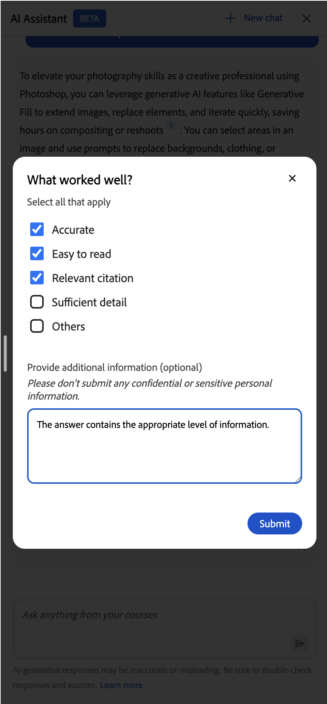
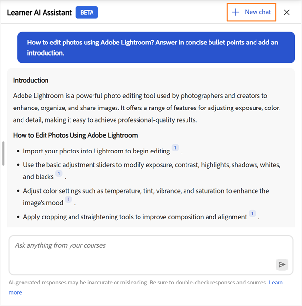

# Assistant d’IA pour les élèves

L’assistant AI (Beta) pour les élèves les aide à trouver rapidement des réponses à partir du contenu d’apprentissage attribué sans parcourir l’intégralité des cours. Vous pouvez poser des questions dans un langage simple et recevoir des réponses précises et ciblées avec des liens sources vers le contenu du cours concerné.

>[!IMPORTANT]
>
>L’assistant AI pour les élèves est actuellement disponible en tant que fonctionnalité Beta. Les capacités, les scénarios pris en charge et les limitations peuvent changer au fur et à mesure de l’évolution de la fonctionnalité.

## Qu’est-ce que l’assistant IA pour les élèves ?

L’assistant AI est un compagnon de chat optimisé par GenAI dans Adobe Learning Manager qui fournit des réponses rapides et précises aux questions des élèves à l’aide du contenu d’apprentissage de confiance qui leur est disponible dans Adobe Learning Manager. Il comprend également des citations, de sorte que les élèves connaissent toujours la source de l’information.

### Principales fonctionnalités de l’assistant AI

1. Réponse intelligente aux questions
   * Conversations à tour unique et à plusieurs tours
   * Compréhension du langage naturel en anglais
   * Réponses dérivées du cours, des certifications, des parcours d’apprentissage et des assistances à la tâche
   * Questions intelligentes de clarification lorsque les requêtes sont ambiguës
   * Optimisé par les fonctionnalités LLM d’Azure Open AI pour générer des réponses
2. Sources de contenu et citations
   * Récupère les réponses des ressources disponibles présentes dans les catalogues pris en charge.
   * Fournit des citations avec des liens directs vers les matériaux sources
   * Prend en charge tous les formats de contenu ALM statiques et interactifs : PDF, DOCX, PPTX, XLSX, Audio (mp3, wav, m4a), Vidéo (mp4, mov, wmv), HTML, SCORM 2004, SCORM 1.2
3. Expérience utilisateur
   * Interface du panneau latéral accessible à partir de toutes les pages de l’élève
   * Responsive design qui s’adapte à la zone de contenu
   * Historique de conversation conservé dans la session du navigateur
   * Nettoyer l’ardoise lors de la nouvelle connexion ou de l’actualisation de la page
   * Ton de l&#39;enseignant ou du tuteur : amical, clair et pédagogique
4. Commandes administrateur
   * Activation ou désactivation de la fonctionnalité au niveau du compte
   * Contrôler l’accès par groupes d’utilisateurs
   * Sélectionner les catalogues inclus pour les réponses de l’IA
   * Exigences d’acceptation des Conditions d’utilisation pour suivre les directives d’Adobe AI

## Quels types de contenu l’assistant AI prend-il en charge ?

L’assistant AI récupère des informations à partir du contenu d’apprentissage qui vous a été attribué, notamment :

* **Documents :** PDF, Word, PowerPoint, Excel, HTML
* **Média :** audio (mp3, wav, m4a), vidéo (mp4, mov, wmv)
* **Contenu interactif :** SCORM 1.2, SCORM 2004
* **Types d’objets d’apprentissage :** cours, parcours d’apprentissage, certifications, assistances à la tâche

Adobe transcrit en toute sécurité le contenu d’apprentissage à l’aide de services de traitement tiers de confiance hébergés dans l’environnement VPC privé d’Adobe.

### Limitations du catalogue et de la source de contenu

L&#39;Assistant IA dédiée aux élèves utilise uniquement le contenu des **catalogues internes** qui sont explicitement configurés par les administrateurs.

Les sources de contenu suivantes ne sont **pas prises en charge** dans la version actuelle :

* Catalogues partagés
* Catalogues acquis
* Catalogues externes
* Catalogues par défaut
* Bibliothèques de contenu tierces (par exemple, LinkedIn Learning ou Go1)

Si un élève n’a pas accès à un cours ou à une assistance à la tâche, l’assistant IA ne fait pas apparaître les informations de ce contenu et les liens de citation ne sont pas accessibles.

## Cas d’utilisation de l’assistant AI

### Élève technique

Sarah est ingénieure commerciale et se familiarise avec les cartes graphiques. Elle doit comprendre rapidement les spécifications techniques et les avantages pour répondre aux questions des clients en toute confiance.

L’assistant AI aide Sarah à :

* Explication technique claire de l’architecture GPU complexe
* Compréhension approfondie des différentes cartes graphiques et de leurs différences
* Explication des exemples afin que Sarah puisse associer les fonctionnalités aux cas d’utilisation réels

### Service clientèle

Marcus est un spécialiste du support dans une entreprise partenaire. Il a besoin de réponses rapides sur les fonctionnalités des produits pour aider les clients sans passer par des équipes d’ingénieurs.

L’assistant AI aide Marcus à :

* Recherche de contenu de support pertinent pour les questions fréquemment posées des clients
* Poser des questions de clarification lorsque la réponse initiale n&#39;est pas assez précise
* Trouver des recommandations pour des cours de dépannage connexes pour améliorer ses compétences

### Intégration d’un nouvel employé

Jennifer vient de se joindre à l&#39;entreprise et est submergée par la quantité de matériel de formation. Elle a besoin d’un moyen de trouver des informations spécifiques sans passer en revue l’intégralité des cours.

L’assistant AI aide Jennifer à :

* Obtenir des conseils étape par étape sur la soumission des notes de frais
* Découverte de cours sur les politiques de l’entreprise sans parcourir l’ensemble du catalogue
* L’orienter vers la section appropriée d’un cours sans lui faire passer des heures de visionnage vidéo

## Comment l’assistant IA utilise-t-il le contenu ?

L’assistant AI vous aide à trouver rapidement des réponses précises pendant que vous apprenez. Pour l&#39;utiliser efficacement, vous devez comprendre le contenu utilisé par l&#39;assistant, ce qu&#39;il n&#39;utilise pas et comment il génère des réponses.

### Quel contenu utilise l’assistant AI ?

L’assistant AI répond aux questions en utilisant uniquement le contenu d’apprentissage activé par l’administrateur de compte. Le contenu du catalogue est indexé.

L’assistant AI analyse le contenu d’apprentissage qui vous est attribué pour générer des réponses ciblées et contextuelles.

* Chaque réponse comprend des citations qui font référence au contenu source d’origine.
* Vous pouvez sélectionner une citation pour accéder directement au cours, module ou document concerné.
* Les citations vous aident à vérifier les informations et à explorer d’autres contextes si nécessaire.

### Réponses en flux continu

Une réponse en continu signifie que l’assistant AI fournit la réponse progressivement au fur et à mesure de sa génération, de sorte que les utilisateurs peuvent commencer à la lire immédiatement sans attendre la fin du chargement de la réponse complète.

### Citations et transparence de la source

Chaque réponse de l&#39;assistant AI comprend des citations qui renvoient directement au cours, module ou objet d&#39;apprentissage d&#39;origine. Les citations vous permettent de :

* Sélectionner un numéro de citation en ligne pour accéder à la section référencée exacte
* Ouvrez la liste complète des sources en sélectionnant Afficher les sources au bas de la réponse
* Vérifier les informations et explorer le contexte supplémentaire à partir de la source faisant autorité

>[!IMPORTANT]
>
>L’assistant AI fournit des réponses basées sur le contenu activé par l’administrateur, mais si un utilisateur n’a pas accès à un élément référencé, il verra un message « non pris en charge » lors de son ouverture.

## Invites intégrées

L’assistant AI inclut des invites intégrées pour aider les élèves à se familiariser rapidement avec les questions et les scénarios courants. Ces invites indiquent aux élèves comment interagir avec l&#39;assistant et leur montrent les types de questions qu&#39;ils peuvent poser.

Les invites intégrées sont personnalisables par compte. Les organisations peuvent les adapter en fonction de leurs objectifs d’apprentissage, des rôles des élèves, de la terminologie ou de cas d’utilisation spécifiques. Les administrateurs peuvent collaborer avec leur gestionnaire de succès client (CSM) pour configurer ou mettre à jour les invites intégrées.

La personnalisation des invites est gérée au niveau du compte et n’est pas configurable directement dans l’interface utilisateur de Adobe Learning Manager dans la version actuelle.

## Configuration administrateur - Activer l’assistant IA pour les élèves

Les administrateurs sélectionnent les groupes d’utilisateurs et les catalogues internes qui peuvent accéder à la fonctionnalité Assistant IA. Ils doivent s’assurer que les catalogues attribués incluent uniquement le contenu d’apprentissage qui est approprié pour être refait surface via des réponses et des citations de l’IA, et que ces catalogues sont par défaut, internes, non partagés, acquis ou externes.

Avant de configurer l’assistant AI, vérifiez que vous disposez d’informations d’identification d’administrateur et que vous avez identifié les groupes d’utilisateurs et les catalogues qui doivent avoir accès à la fonctionnalité.

### Configuration de l’accès à l’assistant AI

Pour activer l’assistant d’IA dédiée aux élèves :

1. Connectez-vous à Adobe Learning Manager en tant qu’administrateur.

2. Sélectionnez **Paramètres** dans la page d&#39;accueil.
   

3. Sélectionnez **Learner AI Assistant (Beta)** dans le menu **Paramètres**.
   

4. Sélectionnez le bouton à bascule pour activer l&#39;**assistant Learner AI (Beta)**.
   

5. Sélectionnez un ou plusieurs groupes d&#39;utilisateurs dans l&#39;option **Groupes d&#39;utilisateurs éligibles**.

6. Sélectionnez **Enregistrer** pour appliquer les paramètres du groupe d&#39;utilisateurs.

7. Sélectionnez un ou plusieurs catalogues dans l&#39;option **Catalogues éligibles**.

8. Sélectionnez **Enregistrer** pour appliquer les paramètres du catalogue.

>[!IMPORTANT]
>
>Seuls les catalogues internes sont pris en charge par l’assistant AI. Si vous sélectionnez un catalogue partagé, acquis, externe ou autre catalogue non interne, son contenu n’est pas affiché en surface par l’assistant IA, même si le catalogue apparaît dans la liste Catalogues éligibles.

## Guide de l’élève : lancement de l’assistant AI

### Lancer l’assistant AI

Pour lancer l’assistant AI :

1. Connectez-vous à Adobe Learning Manager en tant qu’élève.

2. Sélectionnez **Demander à l&#39;assistant IA** sur la page d&#39;accueil.
   

3. Lorsque l&#39;écran **Assistant IA dédiée aux élèves** apparaît, sélectionnez **Commencer**.
   

>[!NOTE]
>
>Lorsque vous lancez l’assistant AI pour la première fois, vous devez donner votre consentement avant de l’utiliser. La boîte de dialogue de consentement s’affiche uniquement lors de ce lancement initial. Pour tous les lancements suivants, vous serez directement redirigé vers l’assistant AI pour saisir vos invites.

&#x200B;4. Saisissez l’invite dans le champ de texte.

&#x200B;5. Appuyez sur **Entrée** pour recevoir une réponse. Passez en revue votre réponse, vos sources et vos recommandations.

Vous pouvez :

* Sélectionnez le numéro de citation en ligne pour accéder à la section référencée exacte
* Ouvrez la liste complète des sources en sélectionnant **Afficher les sources** au bas de la réponse

L&#39;assistant AI inclut des citations avec chaque réponse pour indiquer d&#39;où proviennent les informations. Chaque citation renvoie directement au cours, module ou objet d&#39;apprentissage d&#39;origine utilisé pour générer la réponse.

Vous pouvez sélectionner n’importe quelle citation pour ouvrir la page du cours dans Adobe Learning Manager et examiner l’intégralité du contenu en contexte. Les citations vous aident à vérifier les informations, à explorer des détails supplémentaires et à continuer à apprendre de la source qui fait autorité.

## Accès à l’assistant AI via la recherche

Vous pouvez également lancer l’assistant AI directement à partir de la barre de recherche. Saisissez votre question dans le champ de recherche, puis sélectionnez **Poser une question à l&#39;assistant IA** dans les options qui apparaissent pour obtenir des réponses à partir du contenu d&#39;apprentissage attribué.he contenu d&#39;apprentissage attribué.

## Fournir des commentaires sur les réponses de l’assistant d’IA dédiée aux élèves

Vos commentaires sur les réponses générées par l’assistant Learner AI (Beta) permettent d’améliorer sa précision, sa pertinence et ses performances globales.

### Aimer ou ne pas aimer une réponse

* Sélectionnez **Pouce vers le haut**, choisissez ce que vous avez trouvé utile dans la réponse, ajoutez éventuellement des commentaires, puis sélectionnez **Envoyer**.

* Sélectionnez **Pouce vers le bas**, choisissez la raison pour laquelle la réponse n&#39;a pas été utile, ajoutez des commentaires, puis sélectionnez **Envoyer**.

## Démarrer une nouvelle conversation dans AI Assistant

Le démarrage d&#39;une nouvelle conversation permet à l&#39;utilisateur de commencer une nouvelle conversation, en effaçant le contexte antérieur afin que l&#39;assistant puisse se concentrer sur la nouvelle rubrique sans référencer les interactions précédentes. Ceci est important lorsque vous changez de sujet ou recherchez des réponses sans rapport avec des questions précédentes.

Effacez la conversation en cours et démarrez une nouvelle conversation à tout moment.

Sélectionnez **Nouvelle conversation** dans l&#39;écran de l&#39;Assistant IA, puis sélectionnez **Oui**.

L’assistant AI fournit aux élèves des réponses contextuelles rapides, prend en charge plusieurs types de contenu et propose des citations en ligne pour plus de transparence. Les administrateurs peuvent contrôler l’accès, en veillant à ce que l’assistant IA soit adapté aux besoins organisationnels et améliore l’expérience d’apprentissage.

## Dépannage

>[!NOTE]
>
>Après avoir configuré un nouveau catalogue, attendez 4 à 5 heures pour que le contenu soit indexé et disponible pour les réponses de l&#39;Assistant IA.

### Scénario 1 : pas d’accès au contenu

Problème : l’élève a accès à l’assistant Élève, mais reçoit des réponses « Je n’ai pas de réponse à cette question ».

**Causes possibles**

* Les catalogues des élèves ne sont pas inclus lors de la configuration de l’assistant AI
* Le contenu lié à la question ne se trouve pas dans les catalogues sélectionnés ou les catalogues sont vides
* L’élève n’a pas de visibilité sur le contenu pertinent

**Solution**

* Vérifier l’accès au catalogue de l’élève
* Vérifier quels catalogues sont activés dans les paramètres de l’assistant de l’élève
* Vérifier que ces catalogues contiennent du contenu pertinent
* Patientez quelques heures après l’ajout du nouveau contenu pour qu’il soit indexé

### Scénario 2 : réponses non pertinentes ou de mauvaise qualité

**Problème** : l’assistant IA fournit des réponses qui ne correspondent pas à la question ou qui sont de mauvaise qualité.

**Causes possibles**

* Question trop vaste ou ambiguë
* Le contenu pertinent a des métadonnées médiocres (descriptions, balises)
* La structure du contenu rend difficile l’extraction des informations

**Solution**

* Encouragez les élèves à poser des questions plus spécifiques
* Examiner et améliorer les descriptions de cours et les métadonnées
* S’assurer que le contenu possède des titres et une structure clairs
* Consultez le rapport d’utilisation détaillé pour identifier les modèles
* Envisagez de créer des assistances à la tâche pour les questions fréquemment posées

### Scénario 3 : Questions hors du champ d’application

**Problème** : l’élève pose des questions sans rapport avec le contenu de la formation.

**Exemples** :

* Questions générales sur les connaissances («Qui est le président ?»)
* Opinions personnelles («Qu&#39;est-ce que vous pensez de X ?»)
* Contenu inapproprié
