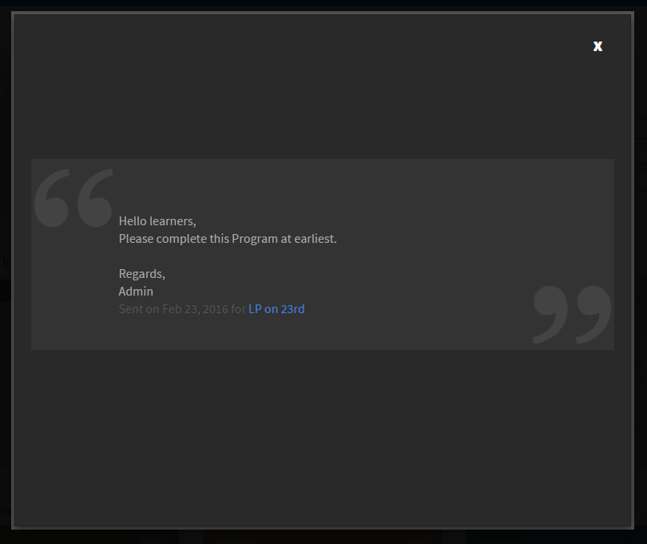

# Annonces

Une annonce est un message multimédia (texte, image ou vidéo) qu’un administrateur diffuse pour un ensemble défini d’utilisateurs.

L’administrateur peut diffuser les annonces pour les élèves les informant de l’occurrence d’un événement ou d’une activité. Lorsqu’une annonce est diffusée pour un groupe particulier ou pour des utilisateurs d’objet d’apprentissage, tous les élèves associés à ce groupe cible reçoivent des notifications.

## Notification d’annonces {#announcementsnotification}

Un message de diffusion de notification apparaît sur le tableau de bord de l’élève sous la forme d’une barre de titre en surbrillance. Si l’élève n’est pas en ligne au moment de l’annonce, une notification s’affiche chaque fois qu’il se connecte dans l’application Learning Manager. Les élèves peuvent également afficher les anciennes annonces à partir des notifications.

*Notification de l&#39;annonce en attente*

Lorsque vous cliquez sur Afficher, vous pouvez afficher une liste des annonces. Voici une liste d’exemples d’annonces :

*Afficher toutes les annonces*

## Un exemple d’annonce {#asampleannouncement}

Un exemple d’annonce est illustré ci-dessous pour référence.

*Afficher les détails d&#39;une annonce*
