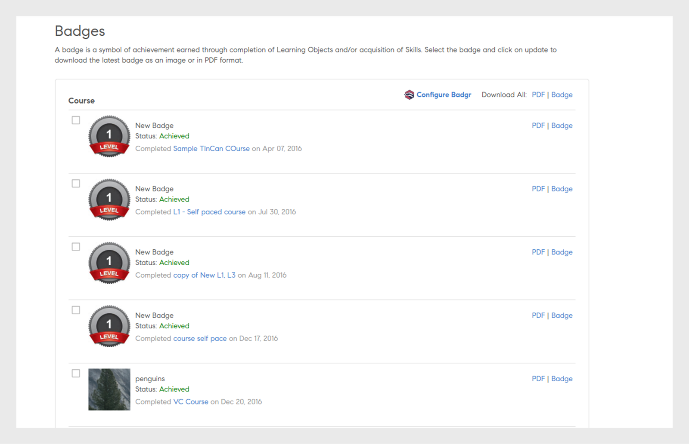

# Badges

Découvrez comment afficher et télécharger des badges à l’aide de l’application Learning Manager Learner.

## Badges {#Badges-1}

Les badges sont une mesure de la réussite que votre employé peut gagner à la fin d’un cours. Adobe Learning Manager introduit l’un des plus récents concepts d’apprentissage en ligne appelé Badges. Les professionnels du monde entier utilisent ces badges comme une représentation d&#39;une compétence particulière ou d&#39;une réussite d&#39;apprentissage.

Les badges aident les élèves à mieux se définir et à présenter leur ensemble granulaire de compétences, en plus d&#39;apporter de la crédibilité et une bonne visibilité aux élèves.

## Affichage et téléchargement de badges {#viewinganddownloadingbadges}

En tant qu’élève, vous pouvez afficher les badges à partir du widget Mes réalisations sur la page d’accueil des élèves. Une liste de badges s’affiche en haut de la page en regard de votre profil. Vous ne pouvez afficher que sept badges à la fois sur la page d’accueil. Cependant, vous pouvez afficher la liste complète des badges dans la boîte de dialogue, lorsque vous cliquez sur un badge.

Les badges récemment acquis sont affichés dans la partie la plus à gauche de la liste, suivis des badges non encore acquis. Vous pouvez remarquer une opacité de 40 % pour les badges à réaliser par rapport aux badges réalisés, pour une meilleure identification.

Cliquez sur un badge pour obtenir la liste de tous les badges que vous avez acquis. Vous pouvez également afficher tous les badges disponibles alignés sur les cours respectifs. Dans Badges à réaliser, cliquez sur le nom du cours pour afficher le cours aligné sur le badge. Un exemple de capture d’écran est présenté ci-dessous pour référence.

Cliquez sur **[!UICONTROL Télécharger tous les badges]** lien pour télécharger tous vos badges acquis au format zip. Vous pouvez également télécharger un badge individuel en cliquant sur l’icône de cube en regard du nom de chaque badge.

**Télécharger le badge en tant que PDF**

Vous pouvez également télécharger un ensemble de badges ou un badge individuel au format PDF.

* Cliquez sur **[!UICONTROL Télécharger tous les enregistrements de badge]** pour télécharger les badges acquis par vous en tant que PDF.
* Pour télécharger des badges individuels, sélectionnez le badge et cliquez sur l’icône pdf en regard du nom du badge.

**Pour les certificats avec expiration, c’est-à-dire les certificats récurrents, Learning Manager mentionne la date de validité du certificat. Les dates apparaîtront dans l’interface utilisateur et dans le PDF de certificats.**

## Ouvrir les badges {#openbadges}

La plateforme sac à dos Badges ouverts, prise en charge par Learning Manager, est en cours de **retraité**. À l’heure actuelle, Learning Manager ne prend pas en charge les badges ouverts.

Les badges ouverts sont une norme permettant de reconnaître et de vérifier l’apprentissage pour les élèves. Vous pouvez utiliser ces badges pour présenter vos réalisations en ligne.

Learning Manager prend en charge le concept de badges ouverts pour ses élèves. Vous pouvez utiliser les badges téléchargés en tant que badges ouverts. Chaque badge que vous téléchargez contient les informations de métadonnées qui prennent en charge la nouvelle norme de badge ouvert.

## Prise en charge des badges Badgr

Les élèves peuvent intégrer leur compte de plateforme d’apprentissage à leur compte Badgr. Cela permet aux élèves de partager des badges sur des sites sociaux via leur compte Badgr. Badgr propose également des badges authentifiables basés sur la norme backpack, ce qui signifie que les badges sont vérifiés.

Les badges ouverts sont des badges dans lesquels des métadonnées sont incorporées dans l’image du badge. Ces métadonnées fournissent des informations sur l’émetteur, le destinataire, la tâche accomplie, la validité du badge, etc. Le sac à dos des badges sera accessible directement à partir de Learning Manager afin de fournir un emplacement central pour stocker tous les badges et les partager. Les élèves peuvent se connecter à leur compte Badgr et établir l’intégration. À partir de ce moment-là, les badges obtenus dans Learning Manager sont automatiquement chargés sur le compte Badgr.

Une fois que l’administrateur a activé l’option **Intégration de Badgr**, un élève peut ensuite l’intégrer à Badgr et configurer son badge. Pour l’intégrer, l’élève doit se connecter au compte Badgr à partir de Learning Manager.

>[!NOTE]
>
>Learning Manager n’offre pas de compte Badgr dans le cadre de cette intégration. L’élève doit créer son propre compte et l’intégrer à Learning Manager.

Un élève doit avoir un compte Badgr créé avant d’établir une connexion à partir de Learning Manager.

Dans l’application de l’élève, sur la page Badges, il existe une option appelée Configurer Badgr. Si l’utilisateur clique sur cette option, une boîte de dialogue s’ouvre, dans laquelle l’état de la connexion doit indiquer Connecté/Non connecté.

## Mise à jour du badge

Un élève peut mettre à jour son badge vers le badge le plus récent en le sélectionnant et en cliquant sur **Mettre à jour **dans la section supérieure droite de la page. Une mise à jour de badge se produit en cas de modification de l’image ou du badge de l’objet d’apprentissage par un administrateur/auteur.

Ce processus de mise à jour de la page est appelé Recréation manuelle. Dans ce cas, le badge est rechargé dans Badgr backpack une fois la création terminée, même s’il porte le même nom/image de badge. Après la mise à jour du badge, l’élève reçoit une notification indiquant que la mise à jour est terminée.

## Foire aux questions {#frequentlyaskedquestions}

**1. Comment télécharger un badge en tant qu’élève ?**

Sur la page Badges, vous pouvez télécharger un Badge sous forme d’image ou au format PDF. Choisissez une compétence ou un cours, puis cliquez sur l’une des options suivantes : **PDF** ou **Badge**.
