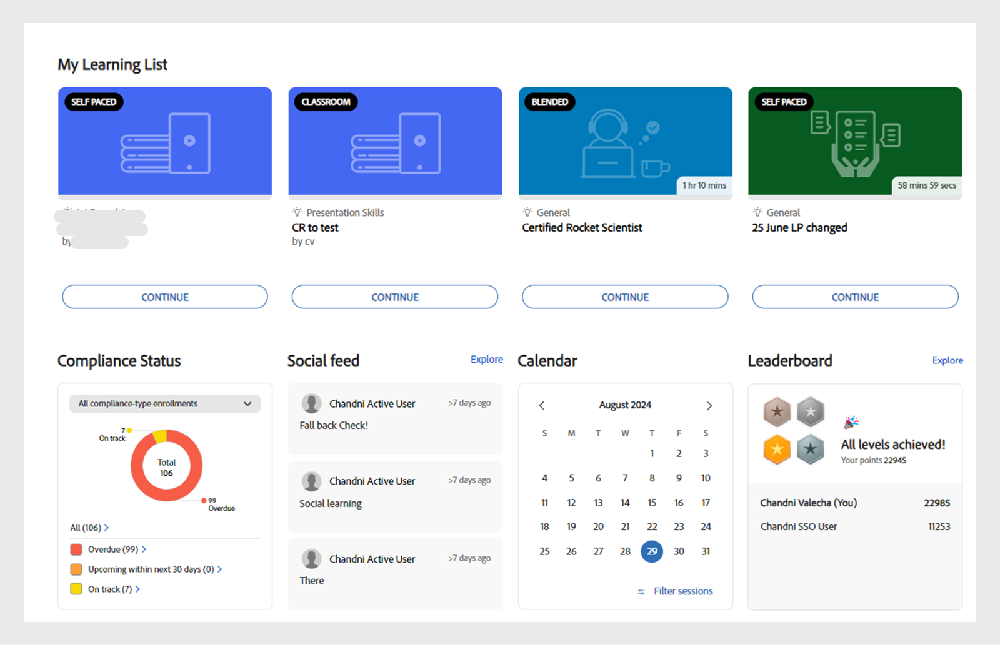

# Cours

Lisez cet article pour découvrir comment afficher et suivre des cours dans Learning Manager. Participez à des discussions et envoyez vos commentaires.

Les auteurs créent des cours. Les élèves peuvent prendre des cours et les administrateurs peuvent suivre les performances des élèves selon le nombre de cours suivis.

## Vue d’ensemble {#overview}

Adobe Learning Manager permet aux élèves d&#39;accéder aux cours, aux programmes d&#39;apprentissage et aux certifications. Les élèves peuvent parcourir tous les cours disponibles à l&#39;aide du catalogue ou s&#39;inscrire aux cours de leur choix. Les apprenants peuvent afficher tous les cours inscrits et les cours qui leur sont attribués dans l’onglet Apprentissage.

>[!NOTE]
>
>Les apprenants peuvent également installer l’application iPad Learning Manager depuis l’Apple Store et l’application Learning Manager Android depuis Google Play et accéder aux cours sur les appareils mobiles. Toutes les fonctionnalités du rôle d&#39;élève sont également disponibles sur les applications. Les élèves peuvent également suivre les cours hors ligne et profiter d&#39;un accès fluide après s&#39;être reconnectés. Reportez-vous à la fonctionnalité des utilisateurs](ipad-android-tablet-users.md) de [tablettes iPad et Android pour plus d’informations.

## Affichage des cours {#viewingcourses}

Vous pouvez afficher une liste de tous les cours disponibles en tant qu&#39;élève. Cliquez sur Mon apprentissage à partir de la page d’accueil ou du volet gauche pour afficher tous les cours auxquels vous vous êtes inscrit.

*Afficher les cours attribués*

Si vous devez recommencer le cours, vous pouvez cliquer sur le bouton Démarrer en regard du cours. Si vous avez déjà commencé à suivre le cours, vous pouvez cliquer sur le bouton Continuer.

Pour afficher un cours terminé, cliquez sur le bouton Revisiter en regard du cours.

Un cours peut avoir plusieurs instances. Cliquez sur le nom du cours pour afficher les détails. Dans le panneau de droite, vous pouvez voir la date d&#39;échéance de chaque instance du cours.

*Afficher un cours terminé*

## Efficacité des cours {#courseeffectiveness}

Le score d&#39;efficacité du cours aide l&#39;élève à apprendre avec un maximum d&#39;efficacité en matière de besoins d&#39;apprentissage. L’efficacité du cours est évaluée pour comprendre l’utilité d’un cours pour l’élève. Elle est calculée en fonction du retour d&#39;informations reçu par le nombre d&#39;utilisateurs pour un cours particulier. Si le pourcentage d&#39;élèves donnant un retour d&#39;informations est important, l&#39;évaluation de l&#39;efficacité du cours est élevée.

Il s’agit d’une combinaison des résultats des commentaires de l’apprenant sur le contenu du cours, des résultats du quiz du cours pour un apprenant et des commentaires du responsable évaluant un apprenant en fonction des enseignements tirés du cours.

Sur la page Cours, un élève peut afficher l&#39;évaluation de l&#39;efficacité des cours sur les vignettes de cours comme illustré dans l&#39;instantané ci-dessous. Vous pouvez voir que l&#39;évaluation de ce cours est 14.

*Afficher l’évaluation de l’efficacité des cours*

Pour afficher les détails de l’évaluation de l’efficacité du cours, cliquez sur la valeur d’efficacité du cours. Une fenêtre contextuelle s&#39;affiche comme illustré ci-dessous.

*Afficher l’efficacité du cours*

Cliquez sur la flèche vers le bas dans l’angle inférieur droit de la fenêtre contextuelle pour voir comment les calculs d’efficacité de cours sont générés.

*Calcul de l’efficacité du cours*

## Recherche de cours et de programmes d’apprentissage {#searchingcoursesandlearningprograms}

Adobe Learning Manager facilite la recherche rapide des cours de votre choix. Vous pouvez rechercher vos cours à l’aide des méthodes suivantes :

1. Cliquez sur l&#39;icône Rechercher affichée dans l&#39;angle supérieur droit. Un champ de recherche s’affiche. Tapez le nom du cours/programme d’apprentissage ou tout mot-clé associé à vos cours. Vous pouvez rechercher des cours par métadonnées, notes, compétences, badges ou balises. Les balises sont indexées à l&#39;intérieur du champ de recherche, ce qui signifie que les balises s&#39;affichent dans le champ de recherche lors de la saisie.
1. L&#39;élève peut affiner les résultats de la recherche dans la page du catalogue en utilisant le type, les compétences, les balises et le statut.

Vous pouvez trier les cours par pertinence, nom ou date de publication en cliquant sur Trier par et en choisissant dans le menu déroulant.

Sur la page des résultats de recherche, vous pouvez filtrer les cours en fonction de la **durée** des cours et du **format** des cours. Cela vous donne plus de flexibilité pour rechercher les cours adaptés à votre niveau.

## Inscription aux cours {#enrollingforcourses}

Les élèves peuvent être inscrits aux cours à l&#39;aide des trois moyens suivants :

1. L&#39;administrateur/le responsable inscrit certains élèves à des cours obligatoires en fonction des besoins de l&#39;entreprise.
1. Le responsable désigne certains cours aux membres de son équipe. Vous recevez une notification avec la possibilité d&#39;accepter ou de refuser le cours/programme d&#39;apprentissage. Lorsque les élèves acceptent une nomination, ils sont inscrits au cours/programme d&#39;apprentissage.
1. Les élèves peuvent directement s&#39;inscrire à un cours/programme d&#39;apprentissage :

   1. Si le cours/programme d&#39;apprentissage est de type auto-inscription, alors l&#39;élève est inscrit immédiatement.
   1. Si le cours/programme d’apprentissage est de type approuvé par le gestionnaire, l’apprenant passe à **l’état d’approbation en attente** . Après l’approbation du gestionnaire, l’apprenant est inscrit au cours.
   1. Si des élèves s&#39;inscrivent à un cours possédant une liste d&#39;attente (en cas de cours en salle de classe), ils doivent attendre qu&#39;une place se libère ou qu&#39;un administrateur les approuve pour le cours.

Les élèves peuvent s&#39;inscrire à de nombreux cours en fonction de leur choix. L&#39;onglet Cours affiche tous les cours auxquels vous êtes inscrit et qui vous sont assignés.

Cependant, vous avez la possibilité de parcourir l’un des cours répertoriés sous catalogue en déplaçant la souris dessus et en cliquant sur Explorer. La page Inscrire s’affiche. Cliquez sur Inscrire dans le coin supérieur droit de la page pour ajouter le cours à la liste Cours.

Il peut y avoir plusieurs instances/sessions de cours/programme d&#39;apprentissage. Dans Catalogue, cliquez sur le nom de la vignette du cours/programme d&#39;apprentissage pour afficher les détails. Vous pouvez voir l’instance d’inscription au cours/programme d’apprentissage en fonction de la date d’échéance de chaque instance du cours/programme d’apprentissage.

**Enregistrer l’intérêt pour les cours**

Vous pouvez enregistrer votre intérêt pour tous les cours en salle de classe qui n’ont aucune session planifiée. Vous recevrez une notification dès que la session de cours commence pour rejoindre le cours.

>[!NOTE]
>
>Les apprenants devraient voir un message de conflit s’ils s’inscrivent à deux sessions différentes en même temps ou à des heures qui se chevauchent.

## Flux de travail en tant qu’élève

En tant qu’élève, vous serez autorisé à évaluer un cours seulement après l’inscription. Vous pouvez voir le nombre moyen d’étoiles pour n’importe quel cours sur la page d’accueil **,** la page Mon apprentissage **et** le **catalogue**.

1. Connectez-vous en tant qu’apprenant ****. Cela charge la page **d’accueil**.

1. Recherchez un cours en saisissant son nom dans la barre de recherche. Vous pouvez également choisir dans la liste des cours affichée en cliquant sur **Mon apprentissage** ou **Catalogue** dans le volet gauche.

1. Après avoir sélectionné un cours, cliquez sur **[!UICONTROL Inscrire]**.

   
   *S’inscrire à un cours*

1. Sélectionnez le nombre d&#39;étoiles pour évaluer un cours, 1 étant la note la moins élevée et 5 la note la plus élevée. Cliquez ensuite sur **[!UICONTROL Envoyer]**.

   
   *Soumettre l’évaluation du cours*

   Un élève peut renvoyer un retour d’informations en soumettant plusieurs fois l’évaluation par étoiles, car seule l’évaluation la plus récente est prise en compte.

1. Un message de confirmation s’affiche après l’envoi de l’évaluation.

   
   *Message de confirmation de retour*

   Si vous souhaitez renvoyer le retour d’informations, vous pouvez le faire en cliquant sur le message. Une fois l’évaluation envoyée, le message s’affiche pendant trois secondes, puis l’évaluation apparaît. Si vous souhaitez modifier l’évaluation, vous pouvez sélectionner une autre évaluation puis l’envoyer.

Les cours peuvent être triés selon les évaluations fournies. Vous pouvez trier les cas à partir du menu déroulant Trier par dans le coin supérieur droit, disponible dans **Catalogue**.

## Suivre un cours {#consumingnbspacourse}

Suite à votre inscription à un cours, vous pouvez commencer suivre le cours en cliquant sur Commencer sur le cours. Vous pouvez également cliquer sur **[!UICONTROL l’onglet Cours]** en **[!UICONTROL apprentissage]** . Sélectionnez ensuite un cours que vous souhaitez commencer à suivre.

Si vous devez recommencer un cours, vous pouvez cliquer sur le bouton Démarrer en regard de l&#39;intitulé du cours.

Vous pouvez afficher tous les modules dans une fenêtre de navigateur.

**Fonctionnalités du lecteur**

**** Table des matières - Lorsqu’il suit un cours, le joueur affiche une table des matières de ce cours particulier dans le volet gauche de la fenêtre. Vous pouvez cliquer sur chaque rubrique, puis y accéder directement.

**Signets** - Si l’un des modules du cours comporte une table des matières de module, les rubriques de la table des matières du module peuvent être marquées d’un signet pour y être référencées ultérieurement. Une fois marquée d&#39;un signet, une icône de ruban apparaît en regard de l&#39;entrée de la table des matières. Les signets peuvent être supprimés en cliquant de nouveau sur le ruban.

**Notes** - Une disposition est disponible pour enregistrer des notes pendant que vous suivez le cours. Vous pouvez enregistrer et télécharger les annotations au format PDF ou les envoyer par courrier électronique aux utilisateurs enregistrés. Lorsque vous cliquez sur Enregistrer, une option vous permet de sélectionner l&#39;emplacement d&#39;enregistrement des notes au format PDF.

*Prendre des notes de cours*

**Sous-titres codés** : pour Adobe Captivate cours développés, si les sous-titres codés sont activés pendant le développement du cours, l’apprenant peut afficher les sous-titres. Cliquez sur ST au bas du lecteur. L&#39;option de sous-titrage est disponible uniquement pour le contenu HTML de Captivate 8.0.2. Pour tous les autres types de modules, l&#39;option CC ne s&#39;affiche pas dans la barre de lecture.

**Revisiter le cours** - Vous pouvez revisiter un cours dans deux modes dans deux scénarios possibles :

* En cliquant sur Revoir le cours lorsque le cours est terminé.
* En cliquant sur Continuer lorsque le cours est n’est pas terminé.

**Plein écran** Cliquez sur l’icône Plein écran dans le coin inférieur droit du lecteur pour afficher le parcours en plein écran.

**Boutons de navigation Vous pouvez cliquer sur les flèches** haut/bas pour vous déplacer entre les diapositives au format pdf, docx et pptx. Les flèches des diapositives peuvent être utilisées pour passer à la rubrique suivante pour tous les types de contenu.

**Fermer le cours** Cliquez sur l’icône de fermeture (x) dans le coin supérieur droit du lecteur pour quitter le cours.

*Après avoir quitté le cours, vous pouvez revenir sur le cours en cliquant sur le bouton Revisiter sur la page de description du cours.*

## Évaluation par étoiles

Ce n’est qu’après s’être inscrit à un cours qu’un apprenant peut fournir une rétroaction étoilée au cours. Dans la page Aperçu du cours d’un cours, l’apprenant peut évaluer le cours en tant qu’étoiles (1-le plus bas, 5-le plus élevé).

*Fournir un classement par étoiles en tant que rétroaction*

Un apprenant sera en mesure de sélectionner une étoile particulière (sur 5) et de soumettre la note. L’apprenant peut également modifier la sélection en cliquant sur une autre étoile. Une fois soumis, un message de remerciement pour vos commentaires s’affiche.

Si l’élève souhaite renvoyer le retour d’informations, il peut le faire en cliquant sur le message. Le **bouton Envoyer** est réactivé. Un apprenant peut fournir un classement par étoiles plusieurs fois après son inscription à un cours. L’évaluation la plus récente sera toujours prise en compte.

Une fois que l’élève a fourni une note, le nombre moyen d’étoiles et le nombre d’apprenants qui ont fourni la fonction d’évaluation par étoiles dans la **page Aperçu** du cours.

*Vue d’ensemble du cours*

Pour tous les comptes existants, cette fonctionnalité est désactivée. Les administrateurs peuvent l’activer dans les paramètres. Ce n’est qu’ensuite que les étoiles apparaîtront aux élèves.

## Marché de contenus

L’option Marché de contenus est disponible dans le volet gauche de l’application de l’élève. Lorsque vous cliquez sur cette option, vous pouvez voir tous les cours/catalogue entier et listes de lecture organisées.

Dans la page ci-dessous, vous pouvez voir les cours disponibles dans votre catalogue. Chaque cours affiche sa durée et le sujet principal auquel il appartient. Vous pouvez choisir le sujet dans le filtre situé à gauche de la page.

Vous pouvez prévisualiser un cours pendant exactement deux minutes.

*Prévisualiser le cours sur marketplace*

Lorsque l’administrateur vous invite à explorer et prévisualiser un large éventail de cours, une notification s’affiche.

En tant qu’élève, vous pouvez exprimer votre intérêt pour un catalogue entier ou n’importe quelle liste de lecture organisée dans la **section Liste de lecture** organisée.

*Afficher la liste de lecture sélectionnée*

Après avoir exprimé votre intérêt pour un cours/une formation, vos préférences sont enregistrées et l’administrateur peut ensuite récupérer ces informations.

Dans l’application Learner, tous les administrateurs ont accès à Content Marketplace. Si l’accès est révoqué par l’administrateur, les apprenants ne peuvent pas voir l’onglet Content Marketplace.

Les élèves qui ont été invités par l’administrateur peuvent explorer le Marché de contenus.

>[!NOTE]
>
>Content Marketplace n’est pas pris en charge dans Internet Explorer 11.

Tous les filtres et toutes les autres options sont présentés dans la vidéo ci-dessous.

### Aperçu du contenu

Vous pouvez explorer et prévisualiser le cours et vérifier s’il répond à vos besoins d’apprentissage. Cliquez sur le **bouton Prévisualiser** et affichez l’aperçu du cours. L’aperçu est disponible pendant deux minutes.

*Prévisualiser le contenu sur la marketplace*

## Hub de contenu

Content Hub permet aux administrateurs et aux experts en la matière (PME) de présélectionner les listes de lecture requises à partir de l’application de l’élève. Une fois présélectionnés, les administrateurs peuvent télécharger le formulaire de demande d’achat et le partager avec l’agent commercial Adobe.

Un administrateur peut inviter les experts en la matière à sélectionner la liste de lecture qui les intéresse.

Content Hub est disponible dans le rôle Apprenant pour tous les administrateurs. Les administrateurs autorisent les experts en la matière à présélectionner la liste de lecture qu’ils souhaitent acheter.

La page Hub de contenu est toujours visible par les administrateurs dans leur rôle d’élève, car cela leur permet de présélectionner facilement des listes de lecture. Pour vous aider à présélectionner la liste de lecture appropriée, les administrateurs peuvent rendre cette page accessible aux experts en la matière dans leur compte. Consultez la page Formation en entreprise côté administrateur et prenez les mesures nécessaires pour fournir l’accès.

## Choisir une instance de cours {#choosecourseinstance}

Si vous êtes un élève inscrit à une instance de cours dont la session a expiré, vous pouvez passer à une autre session pour progresser. Cela n&#39;est possible que si le programme d&#39;apprentissage est flexible.

Pour modifier l&#39;instance de cours, procédez comme suit :

1. Ouvrez Catalogues > Programme d&#39;apprentissage.

   
   *Sélectionnez un programme d’apprentissage*

1. Utilisez les cases d’option pour choisir si vous souhaitez afficher tous les cours ou les cours avec des instances non sélectionnées. Notez que si l’apprenant a terminé l’instance, il ne peut pas passer à une autre instance.

   
   *Afficher tous les cours ou les cours avec des instances non sélectionnées*

1. Le menu déroulant des instances du cours affiche les instances disponibles. Sélectionnez l&#39;instance dans la liste déroulante.

   
   *Sélectionner une instance*

1. Pour appliquer l&#39;instance sélectionnée, cliquez sur **[!UICONTROL Mettre à jour l&#39;inscription]**. L&#39;option de mise à jour de l&#39;inscription se trouve en haut à droite de la page.

   L’instance nouvellement sélectionnée est inscrite. Si un apprenant est inscrit à une instance de cours qui fait partie d’un autre LO et qu’il met à jour l’instance de cours qui fait partie du programme d’apprentissage flexible, il sera automatiquement désinscrit des autres objets d’apprentissage après un avertissement.

## Terminer un cours {#completingacourse}

En tant qu&#39;élève, vous pouvez effectuer le nombre requis de modules d&#39;un cours pour terminer le cours. Les critères d&#39;achèvement du cours dépendent du nombre de modules définis comme obligatoires par l&#39;auteur. Lorsque vous vous inscrivez à un cours lié à un minimum de critères d&#39;achèvement, vous pouvez afficher les critères d&#39;achèvement dans le volet de droite de la page Cours.

*Afficher les critères d’achèvement*

Par exemple, si un cours spécifique comporte le critère d&#39;achèvement d&#39;un module sur deux, la réalisation d&#39;un module suffit pour terminer ce cours. Dans ce cas, lorsque vous terminez le premier module, la barre de progression affiche l&#39;état d&#39;achèvement de 100 %.

Si les modules sont définis tel que l&#39;auteur les a organisés, vous devez terminer le nombre requis de modules dans l&#39;ordre séquentiel, en partant du premier. S&#39;ils ne le sont pas, vous pouvez effectuer les modules requis dans n&#39;importe quel ordre.

Une fois le nombre requis de modules d&#39;un cours terminés, si vous souhaitez effectuer les modules facultatifs, vous pouvez revoir le cours.

## Visualiser les discussions et y participer {#viewingandpariticpatingindiscussions}

En tant qu&#39;élève, vous pouvez interagir avec les autres élèves et les formateurs à l&#39;aide de l&#39;onglet Discussion. Vous pouvez afficher les publications pour tout cours que vous affichez ou auquel vous vous inscrivez. Si l&#39;administrateur a activé les discussions pour un cours, vous pouvez afficher l&#39;onglet Discussion en regard de l&#39;onglet Notes du cours en question.

Lorsque vous cliquez sur l&#39;onglet Discussions, vous pouvez voir les publications et les commentaires existants pour ce cours. Si vous vous êtes déjà inscrit au cours, vous pouvez également effectuer des publications ou des commentaires à l&#39;intention des autres utilisateurs. Une fois le message saisi, cliquez sur Publier. Votre publication doit contenir au moins 10 caractères.

La publication est immédiatement visible dans l&#39;onglet Discussions. Vous pouvez trier les publications comme les plus récentes en premier ou les plus anciennes en premier, et supprimer les publications que vous avez écrites. Même après votre désinscription du cours, vous pouvez afficher toutes les publications et supprimer les publications que vous avez écrites.

*Voir les discussions des participants*

L&#39;onglet Discussion n&#39;est pas activé pour les utilisateurs externes.

*Onglet Discussion*

## Cycle de vie du cours {#courselifecycle}

Un cycle de vie habituel de cours se présente comme suit :

**Brouillon** - Lorsqu’un auteur termine de créer un cours et de l’enregistrer. À ce stade, le cours n’est pas encore disponible pour les élèves.

**Publié** : lorsqu’un auteur termine la publication d’un cours. À ce stade, le cours est disponible pour que les élèves s’y inscrivent.

**Retraité** - Après avoir publié un cours, un auteur peut le déplacer vers un état retiré s’il ne souhaite pas que le cours apparaisse dans le catalogue des cours pour les apprenants.

**Supprimé** : un cours sous l’état supprimé est lorsqu’il est complètement supprimé de l’application Adobe Learning Manager. Les cours peuvent être supprimés par des auteurs uniquement lorsqu’ils sont à l’état « brouillon » ou « retiré ».

*Vue d’ensemble du cycle de vie d’un cours*
