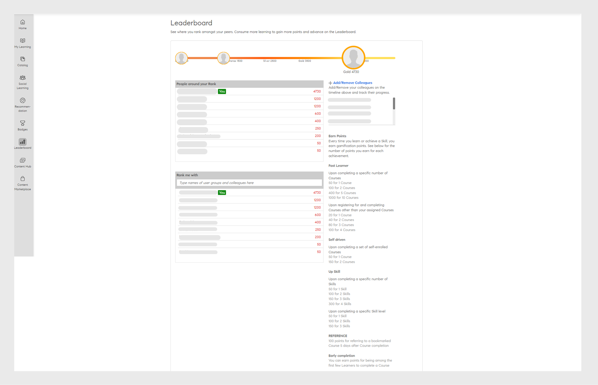

# Ludification

Impliquez les élèves à l’aide des techniques de ludification dans Learning Manager.

La ludification est l’utilisation de l’esprit et de la mécanique du jeu dans des contextes non ludiques pour inciter des utilisateurs à gagner des points tout en apprenant.

## Vue d’ensemble {#overview}

Utilisez la fonction de ludification de Learning Manager pour impliquer les élèves et les motiver à atteindre leurs objectifs en utilisant des techniques de jeu. Les élèves peuvent rivaliser avec leurs collègues pour marquer des points pour diverses activités d’apprentissage et atteindre les niveaux bronze, argent, or et platine.

Les élèves peuvent également voir leur niveau d’achèvement en fonction du nombre de points qu’ils ont gagné. Les niveaux disponibles sont Élève rapide, Autonome, etc. **Les élèves internes et les élèves externes peuvent accéder à cette fonction.**

## Tableau des scores {#leaderboard}

Le Tableau des scores est une fonctionnalité de la ludification qui joue le rôle de tableau indicateur pour afficher le classement des meilleurs scores. Les participants peuvent voir leurs points de ludification dans le Tableau des scores.

Dans la page d&#39;accueil de l&#39;élève, cliquez sur **[!UICONTROL Ludification]** dans le volet de gauche. Cliquez sur le lien Tableau des scores pour afficher le tableau des scores. Cette fonction permet aux élèves de comprendre comment ils se classent par rapport à un membre particulier de l’équipe. Elle affiche également leur position de classement par rapport aux autres membres de l’équipe.

Quelques-unes des fonctionnalités du Tableau des scores des participants :

* Les élèves inscrits à une instance de programme d&#39;apprentissage peuvent voir les points des autres si la ludification est activée pour cette instance.
* Cliquez sur **[!UICONTROL Ajouter des collègues]** pour inclure un membre de l’équipe auquel vous souhaitez vous comparer. L’image de profil du membre de votre équipe est ajoutée à l’échelle de temps en haut de la page du tableau des scores. Ce montage chronologique affiche vos points au début et déplace votre position vers la droite lorsque vous obtenez plus de points que les membres de votre équipe. Vous pouvez uniquement le comparer à d’autres membres du même groupe.
* **Groupes d&#39;utilisateurs :** à tout moment, vous pouvez choisir les profils des membres de votre équipe avec lesquels vous souhaitez comparer votre rang, à l&#39;aide de l&#39;option **[!UICONTROL Classement avec]**. Dans le champ Sélectionner des groupes d’utilisateurs, saisissez et choisissez le groupe. La liste de tous les membres de l’équipe, ainsi que leurs derniers points, sont répertoriés ci-dessous. Les utilisateurs internes et externes peuvent afficher la liste, mais seuls les utilisateurs internes sont activés pour rechercher d&#39;autres élèves internes.

* En outre, la fonction Personnes à votre rang affiche les noms des membres de l’équipe qui sont juste au-dessus, au-dessous ou au même niveau que vous.
* Lorsqu’un utilisateur externe devient un utilisateur interne, la chronologie est automatiquement mise à jour.

## Points pour un apprentissage cohérent

Adobe Learning Manager introduit une nouvelle tâche de ludification qui encourage les utilisateurs à accéder à la plate-forme d’apprentissage de manière cohérente et à participer aux activités d’apprentissage. Pour prendre en charge cette tâche, l’administrateur peut désormais configurer une nouvelle règle qui attribue des points si l’élève effectue des activités d’apprentissage pendant 1, 2, 3 ou 4 jours par semaine, par mois ou par trimestre.

Notez que les points de ludification pour cette règle sont attribués une fois toutes les 24 heures. Par exemple, si un élève effectue une activité d’apprentissage aujourd’hui à 8 h, heure du Pacifique (PST), et qu’il a reçu des points de ludification pour aujourd’hui, il ne sera considéré demain pour les points de ludification que s’il effectue une activité d’apprentissage à tout moment après 8 h, heure du Pacifique.

Les activités suivantes sont considérées comme des activités d’apprentissage :

* Consommation d’un cours, d’un parcours d’apprentissage ou d’une certification dans le lecteur Fluidic.
* Téléchargement d’une assistance à la tâche.
* Téléchargement d’une pièce jointe.
* Ajout de notes.
* Accès au tableau de bord d’apprentissage par les réseaux sociaux.
* Commentaires sur le tableau de bord d’apprentissage par les réseaux sociaux.
* Publication sur le tableau de bord d’apprentissage par les réseaux sociaux.

**Points de ludification pour fournir des commentaires L1 et L3 et une évaluation par étoiles**

Adobe Learning Manager permet désormais à un administrateur d’activer un critère de ludification qui attribue des points aux utilisateurs lorsqu’ils fournissent un retour d’informations L1, un retour d’informations L3 et une évaluation par étoiles.

*Afficher l&#39;évaluation*

Cette fonctionnalité encourage les utilisateurs à fournir activement des commentaires, ce qui bénéficie aux élèves ainsi qu’aux administrateurs, qui comprennent désormais mieux le point de vue de l’élève et peuvent mieux évaluer l’efficacité d’un cours.

## Tâches {#tasks}

Il existe cinq tâches de ludification des participants. Vous pouvez afficher les points de ludification à l’intérieur du cercle situé dans l’angle supérieur droit de la fenêtre, sur la page d’accueil des élèves. Pour afficher l’attribution de chaque tâche, cliquez sur Ludification.

Le système affiche la page Ludification, dont la représentation de l’ensemble des tâches et des points des élèves est affichée ci-dessous :

>[!NOTE]
>
>Les points de ludification dans une tâche donnée ne sont pas cumulatifs. En revanche, les points sont ajoutés au compte de l’élève de façon cumulative si ces points sont acquis dans différentes tâches.
>
>Lors de l’affectation des cours en points, l’administrateur doit s’assurer que les élèves acquièrent les points progressivement.

**Pour les rapides**

Cette tâche s’applique quand un élève termine certains cours en un mois, un trimestre ou une année. Cette tâche est conçue pour encourager les participants rapides.

Les scénarios possibles sont les suivants :

1. Lorsque les participants terminent deux cours en un mois/trimestre/année, ils obtiennent 20 points.
1. Lorsque les participants terminent quatre cours en un mois/trimestre/année, ils obtiennent 100 points.
1. Lorsque les participants terminent huit cours, ils obtiennent 300 points.
1. Lorsque les participants terminent dix cours, ils obtiennent 500 points.

>[!NOTE]
>
>L’administrateur peut modifier la période et le nombre de cours terminés requis pour obtenir les points correspondants.
>
>Dans une tâche, les points ne sont pas octroyés aux participants de façon cumulative. Par exemple, supposons qu’un élève termine un seul cours et obtienne 20 points. Lorsque l’élève termine deux cours, il obtient 100 points mais les 20 points existants ne sont pas pris en compte.

**Pour les autonomes (a)**

Cette tâche s’applique lorsque les élèves s’inscrivent pour le nombre prescrit de cours et terminent dans un délai d’un mois/trimestre/an. Dans ce cas, l’administrateur peut activer cette tâche pour allouer des points et les encourager.

Scénarios possibles :

1. Lorsque les élèves s’inscrivent à un cours en un mois/trimestre/année, ils obtiennent 50 points.
1. Lorsque les élèves s&#39;inscrivent à deux cours au cours d&#39;un mois/trimestre/an, ils obtiennent 150 points.

>[!NOTE]
>
>L’administrateur peut modifier la période et le nombre de cours.

**Pour les super autonomes (b)**

Cette tâche s’applique lorsque des élèves s’inscrivent et suivent un plus grand nombre de cours que nécessaire à terminer en un mois/trimestre/année. Dans ce cas, l’administrateur peut activer cette tâche avec une allocation de points pour les encourager.

Scénarios possibles de l’inscription d’élèves à des cours s’ajoutant à leurs cours affectés :

1. Lorsque les élèves s’inscrivent à un cours en un mois/trimestre/année, ils obtiennent 20 points.
1. Lorsque les élèves s&#39;inscrivent à deux cours au cours d&#39;un mois/trimestre/an, ils obtiennent 100 points.
1. Lorsque les élèves s’inscrivent à trois cours en un mois/trimestre/année, ils obtiennent 300 points supplémentaires.
1. Lorsque les élèves s’inscrivent à quatre cours en un mois/trimestre/année, ils obtiennent 500 points supplémentaires.

>[!NOTE]
>
>L’administrateur peut modifier la période et le nombre de cours. Par exemple, le troisième scénario peut être modifié en cinq cours au lieu de trois pour l’obtention de 80 points.

**Pour les perfectionnistes (a)**

Cette tâche s’applique lorsque les élèves terminent un nombre spécifique de compétences. L’administrateur peut sélectionner cette tâche pour inciter les élèves à acquérir autant de compétences que possible.

Scénarios possibles pour l’élargissement des compétences :

1. Lorsque les participants acquièrent une compétence, ils obtiennent 100 points.
1. Lorsque les élèves atteignent deux compétences, ils gagnent 300 points.
1. Lorsque les élèves atteignent trois compétences, ils gagnent 600 points.
1. Lorsque les élèves atteignent quatre compétences, ils gagnent 900 points.

>[!NOTE]
>
>La période ne s’applique pas à cette tâche. L’administrateur peut modifier le nombre de cours pour chaque scénario.

**Pour les super perfectionnistes (b)**

Cette tâche s’applique chaque fois que les élèves atteignent chacun des niveaux supérieurs dans une compétence.

Les scénarios possibles pour les super perfectionnistes dans les niveaux d’une compétence spécifique :

1. Lorsque les élèves atteignent un niveau, ils obtiennent 100 points.
1. Lorsque les élèves atteignent deux niveaux, ils obtiennent 200 points.
1. Lorsque les élèves atteignent trois niveaux, ils obtiennent 500 points.

>[!NOTE]
>
>La période ne s’applique pas à cette tâche. L’administrateur peut modifier le nombre de niveaux pour chaque scénario. Si les élèves atteignent un niveau supérieur, puis atteignent un niveau inférieur d&#39;une compétence, ils obtiennent des points uniquement pour le niveau supérieur.

**Points d’accomplissement précoce**

Cette tâche s’applique aux élèves qui sont parmi les premiers à achever le cours.

Scénario possible :\
Lorsqu’un élève devient l’un des 10 premiers élèves à terminer le cours, il obtient 100 points.

**Points d’accomplissement en temps voulu**

Cette tâche s’applique aux élèves qui terminent un cours dans un nombre donné de jours avant l’échéance de fin du cours.

Scénario possible :\
Lorsque les élèves terminent un cours dans les 10 jours du début du cours, ils obtiennent 100 points.

**Accomplissement des niveaux**

L’état du niveau des élèves est affiché dans l’angle supérieur droit de la page, dans en cercle, à la page Mes cours. Les élèves peuvent obtenir les différents niveaux suivants selon le nombre de points réalisé pendant la période d’apprentissage :

1. Bronze : lorsque l’élève atteint 1 500 points.
1. Argent : lorsque l’élève atteint 2 500 points.
1. Or : lorsque l’élève atteint 3 000 points.
1. Platine : lorsque l’élève atteint 5 000 points.

## Forum aux questions {#frequentlyaskedquestions}

**1. Comment afficher le tableau des scores en tant qu’élève ?**

Dans l’application d’apprentissage, dans le volet de gauche, cliquez sur **[!UICONTROL Apprentissage par les réseaux sociaux]**. Vous pouvez voir le tableau des scores des réseaux sociaux en bas à droite de la page.
