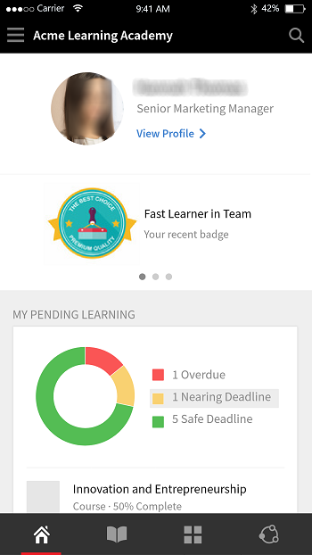

# Application des élèves pour les appareils mobiles et les tablettes

Lisez cet article pour savoir comment télécharger l’application Élève Learning Manager sur les smartphones et les tablettes. Découvrez comment suivre les cours à l’aide d’un appareil mobile ou d’une tablette.

## Vue d’ensemble {#overview}

L’application Learning Manager pour les élèves est disponible pour les utilisateurs de téléphone Android et d’iPhone. Accédez à Google Play Store (système d’exploitation Android) ou iTunes (Mac OS), puis téléchargez l’application Learning Manager.

Après avoir téléchargé et installé cette application, connectez-vous à l’aide de vos informations d’identification d’élève. Lorsque vous ouvrez l’application mobile Learning Manager, l’écran suivant s’affiche par défaut.

*Page d’accueil de l’application Learning Manager*

## Page d’accueil {#homepage}

Pour tous les comptes pour lesquels l’option Mise en page immersive est activée, une toute nouvelle page d’accueil prend en charge la configuration de mise en page immersive. La page d’accueil est organisée sous la forme d’une liste de cartes pour les éléments suivants :

|  |  |
|---|---|
|  |  |

*Liste des cartes sur la page d’accueil*

*Flux social de l’élève*

## Évaluation du retour d’informations {#feedbackrating}

Learning Manager invite l’élève à fournir un retour d’informations sur son expérience avec l’application mobile. Ce retour d’informations s’affiche une fois par mois et laisse suffisamment de temps aux utilisateurs pour qu’ils puissent tester l’application, puis donner leur avis.

<!--
|  | |
|---|---|
-->

Pour les utilisateurs existants, la fenêtre contextuelle de commentaires doit s’afficher une fois qu’ils ferment le lecteur pour la première fois après la mise à jour de l’application vers la dernière version.

Notez que la collecte des commentaires est anonyme et s’affiche uniquement pour les utilisateurs qui ont activé cette option **Partager les données d’utilisation** via une configuration dans les paramètres de l’application.

## Télécharger le badge {#downloadbadge}

Les élèves peuvent télécharger leurs badges au format PDF et Image. Dans la section Profil utilisateur, faites défiler vers le bas, puis cliquez sur un lien pour télécharger un badge. Le badge téléchargé est enregistré dans le dossier par défaut de l’appareil. L’application vous permet d’ouvrir le dossier ou le fichier immédiatement après la fin du téléchargement.

|  |
|---|

*Télécharger un badge*

## Mise en page Web mobile réactive {#responsive}

Une expérience web mobile entièrement réactive qui garantit que les élèves utilisent leurs appareils pour suivre la formation même s’ils n’ont pas installé l’application mobile.

Lorsque vous vous connectez pour la première fois à l’application des élèves via le navigateur de votre appareil, l’application des élèves s’affiche sous la forme d’une mise en page réactive compatible avec les appareils mobiles.

La prise en charge de l’interface utilisateur Web réactive mobile est uniquement disponible lorsqu’un compte **est configuré pour une mise en page immersive uniquement**. L’interface utilisateur réactive n’est **pas disponible pour la mise en page classique**.

<!--
<table>
 <tbody>
  <tr>
   <td>
    
<strong>Home page</strong>

    
<strong>View options</strong>

    
<strong>Start course</strong>
</td>
   <td>
    
<strong>My Learning List</strong>

    
<strong>View catalog</strong>

    
<strong>Apply filters</strong>
</td>
   <td>
    
<strong>Recommendations based on interest</strong>

    
<strong>View notifications</strong>

    
<strong>Share url</strong>
</td>
  </tr>
 </tbody>
</table>
-->

## Fonctions non prises en charge dans l’expérience immersive mobile {#unsupportedfeaturesinmobileimmersiveexperience}

Les workflows suivants apparaissent dans l’expérience classique d’un élève :

* Tentative multiple
* Flexi LP
* Scénarios de chargement de fichiers
* Fournir un retour d’informations L1

Les autres fonctionnalités de l’application qui ne sont pas prises en charge sont les suivantes :

* Application pour les réseaux sociaux : un élève est redirigé vers l’expérience classique s’il clique sur le widget Réseaux sociaux sur la page d’accueil.
* Paramètres de profil/Modifier le profil
* Afficher le badge/les compétences
* Tableau des scores : un élève est redirigé vers l’expérience classique s’il clique sur le widget Tableau des scores sur la page d’accueil.
* Téléchargement des assistances à la tâche.
* Options de filtrage dans Recherche.

L’apprentissage par les réseaux sociaux prend désormais en charge les expériences Web immersives mobiles.

Certaines fonctionnalités ne sont pas prises en charge par l’application mobile immersive. Il s’agit des éléments suivants :

| **Zone** | **Non pris en charge** |
|---|---|
| Forum | Création de forums, Modification de forums, Copier l’URL , Supprimer , Signaler, Trier , Filtrer |
| Publier | Type de sondage Après la création, Modifier, Pièce jointe multiple à la publication, Copier l’URL, Épingler au début |
| Commentaire/Réponse | Modifier, Marquer comme bonne réponse, Chargement d’une image/vidéo/audio dans un commentaire ou une réponse |
| Média | Capture audio ; téléchargement de fichiers audio uniquement |
| Autres | Notifications, Vue de la publication, Tableau des scores sociaux, Personnes que je suis, Profil utilisateur |

## Autoriser les élèves à télécharger une assistance à la tâche {#download-job-aid}

En mode immersif mobile, un élève peut télécharger une assistance à la tâche. Appuyer **Paramètres** puis appuyez sur **Catalogues**. Téléchargez une assistance à la tâche dans la liste qui s’affiche.

|  |
|---|

*Télécharger une assistance à la tâche*

## Autoriser les élèves à télécharger un relevé de notes {#download-learner-transcript}

En mode immersif mobile, un élève peut télécharger ses relevés de notes.

|  |  |
|---|---|

*Télécharger les relevés de notes des élèves*

## Voir les badges et les compétences {#viewbadgesandskills}

**Affichage des badges, des compétences et des points de ludification**

L’écran par défaut affiche les badges, compétences et points de ludification récemment obtenus, juste en dessous des informations de votre profil. Si vous utilisez un téléphone, les badges obtenus récemment sont affichés. Faites glisser l’écran vers la droite pour afficher plus d’informations.

**Mes apprentissages en attente**

Par défaut, l’écran affiche par défaut les cours auxquels vous êtes inscrit. Le graphique en anneau indique les retards d’apprentissage, les apprentissages proches de la date limite et les apprentissages en cours.

Appuyez sur un cours pour afficher ses détails et votre date d’achèvement (le cas échéant). Vous pouvez Continuer ou Revoir le cours à partir de cet écran, selon son état d’achèvement.

*Afficher les apprentissages en attente*

**Affichage des catalogues**

Appuyez sur l’icône en regard de l’icône de livre au bas de l’écran. Vous pouvez immédiatement consulter le catalogue et tous les objets d’apprentissage associés. Vous pouvez choisir de les afficher sous forme de grille ou en mode d’affichage détaillé. Sélectionnez des recommandations pour afficher les recommandations de cours en fonction de votre historique d’apprentissage.

*Afficher les recommandations de cours*

## Trier et filtrer les objets d’apprentissage {#sortandfilterlearningobjects}

**Tri et filtrage**

Cliquez sur l’icône de tri dans l’angle supérieur droit de l’écran des cours ou du catalogue pour trier les objets dans l’ordre alphabétique (croissant ou décroissant) ou par date de publication. Vous pouvez également filtrer les objets d’apprentissage par type, état d’achèvement, compétences ou balises. Appuyez pour sélectionner le filtre et appuyez sur Appliquer pour l’appliquer.

**Utilisation de la fonctionnalité de recherche**

Dans le coin supérieur droit du téléphone, vous pouvez voir une icône de recherche. Appuyez dessus pour rechercher des objets d’apprentissage en fonction des métadonnées de cours, d’un ID unique, de compétences, et ainsi de suite.

**Gestion du profil, des paramètres et des notifications**

Appuyer  dans le coin supérieur gauche de l’écran pour afficher votre profil, les notifications ainsi que les paramètres du compte.

Ce menu vous permet également de numériser le code QR pour enregistrer l’assiduité au cours.

Il vous suffit d’appuyer sur la touche **Scanner le code QR** et scannez le code.

**Utilisation hors ligne des cours**

Lorsque vous utilisez des cours téléchargés alors que vous êtes en ligne, Learning Manager accède au cours téléchargé au lieu d’effectuer des appels au serveur.

## Numériser le code QR pour s’inscrire {#qrcode}

Vous pouvez numériser un code QR et vous inscrire à un cours. Une fois que l’administrateur de l’apprentissage a généré un code QR, vous pouvez le numériser depuis l’application et vous inscrire à un cours.

1. Pour numériser le code QR, appuyez sur  dans le coin supérieur gauche de l’écran.
1. Appuyez sur **Lire le code QR**.

La fonction de numérisation du code QR permet à un élève d’effectuer l’une des actions mentionnées ci-dessous en fonction du code QR généré par l’administrateur de l’apprentissage :

* **Inscription :** Cela permet à l’élève de s’inscrire à un cours en scannant le code QR.
* **Achèvement :** cela permet à l’élève de marquer le cours comme terminé en numérisant le code QR.
* **Inscription et achèvement :** cela permet à l’élève de s’inscrire à un cours et d’en indiquer l’achèvement en même temps en numérisant le code QR.
* **Marquer la présence :** Cela permet à l’élève de marquer l’assiduité pour une session particulière en scannant le code QR.

## Renommer des objets d’apprentissage {#renaminglearningobjects}

Les administrateurs peuvent renommer la terminologie des objets d’apprentissage. Pour renommer, voir [Renommer des objets d’apprentissage](../../administrators/feature-summary/settings.md#main-pars_header_1570157145).

## Apprentissage par les réseaux sociaux {#socialmobile}

Dans cette mise à jour, les fonctionnalités suivantes ne sont pas prises en charge. Vous ne pouvez pas :

* Créer ou suivre un tableau.
* Copier une URL dans une publication.
* Ajouter un article en tant qu’article ou ajouter en tant qu’article favori ou épingler au début.
* Voir un tableau des scores des réseaux sociaux.

L’Apprentissage par les réseaux sociaux est une plate-forme dans l’application mobile Learning Manager qui incite les utilisateurs à partager des idées et des informations significatives dans un environnement informel. Il s’agit d’une méthodologie qui complète l’idée de l’apprentissage traditionnel.

L’apprentissage par les réseaux sociaux permet aux utilisateurs d’utiliser l’expertise autour d’eux pour obtenir des informations correctes et précises. Les élèves peuvent rapidement appliquer ces informations pour mener à bien une tâche et atteindre un objectif.

En utilisant l’application mobile, les utilisateurs peuvent interagir les uns avec les autres en partageant du contenu et obtenir une validation pour le contenu partagé.

Sur cette plate-forme, les différents types de contenu pouvant être partagés sont les suivants : vidéo, audio, capture d’écran, texte, question et sondage. Les utilisateurs peuvent également partager leurs apprentissages en ligne avec leurs homologues.

Cette fonctionnalité n’est disponible sur l’application de l’appareil qu’une fois que l’administrateur active l’**apprentissage par les réseaux sociaux** pour le compte.

## Lancer l’apprentissage par les réseaux sociaux sur l’application {#launchsociallearningontheapp}

Au lancement de l’application, appuyez sur l’icône **Réseaux sociaux**.

*Afficher l’apprentissage par les réseaux sociaux*

## Créer une publication sur un forum {#createapostinaboard}

Comme toute autre plate-forme sociale, dans l’application mobile Learning Manager, vous pouvez créer une publication dans un forum, afin que tous les élèves qui font partie du même forum puissent voir votre publication, commenter et télécharger un fichier avec le commentaire.

Pour créer une publication, appuyez sur  icône en bas à droite de l’écran.

L’écran suivant s’affiche.

*Ajouter un post*

<table>
 <tbody>
  <tr>
   <td>
    

</td>
   <td>
    
Écrivez une publication ou collez n’importe quelle URL.
</td>
  </tr>
  <tr>
   <td>
    

</td>
   <td>
    
Prenez une photo avec votre appareil photo mobile et téléchargez-la avec votre publication.
</td>
  </tr>
  <tr>
   <td>
    

</td>
   <td>
    
Enregistrez une vidéo avec votre caméra mobile.
</td>
  </tr>
  <tr>
   <td>
    
 
</td>
   <td>
    
Enregistrez une piste audio avec votre mobile.
</td>
  </tr>
  <tr>
   <td>
    

</td>
   <td>
    
Téléchargez n’importe quel document ou fichier dans le forum.
</td>
  </tr>
  <tr>
   <td>
    
 
</td>
   <td>
    
Posez une question.
</td>
  </tr>
  <tr>
   <td>
    
 
</td>
   <td>
    
Créez un sondage avec votre publication.
</td>
  </tr>
 </tbody>
</table>

## Format de contenu pris en charge {#supportedcontentformat}

<table>
 <tbody>
  <tr>
   <td>
    
<strong>Type de contenu</strong>
</td>
   <td>
    
<strong>Extensions</strong>
</td>
  </tr>
  <tr>
   <td>
    
Vidéo
</td>
   <td>
    
wmv, f4v, asf, 3gp, 3g2, avi, mov, h264, m4v, mp4, MPEG, mpg
</td>
  </tr>
  <tr>
   <td>
    
Audio
</td>
   <td>
    
mp3, amr, m4a, wav, wma, aac
</td>
  </tr>
  <tr>
   <td>
    
Fichiers statiques
</td>
   <td>
    
PDF, ppt, pptx, doc, docx, xls, xlsx
</td>
  </tr>
  <tr>
   <td>
    
Image
</td>
   <td>
    
jpg, jpeg, png, bmp, gif
</td>
  </tr>
 </tbody>
</table>

Après avoir créé une publication, sélectionnez le forum sur lequel vous voulez télécharger la publication. Appuyez sur Sélectionner un forum et recherchez le forum souhaité.

Après avoir créé une publication, appuyez sur Publier et publiez votre commentaire pour que les autres élèves puissent voir votre publication.

Dans l’application mobile, vous ne pouvez pas créer de forum. Pour créer un forum, vous devez vous connecter à l’application Web en tant qu’élève. Pour plus d’informations sur la création d’un forum, voir Apprentissage par les réseaux sociaux dans [Learning Manager](/help/migrated/learners/feature-summary/social-learning-web-user.md).

## Actions pouvant être effectuées sur une publication {#actionsthatcanbeperformedonapost}

* Commenter une publication et en fonction de l’autorisation, voir la publication dans un forum.
* Modifier ou supprimer des commentaires dans un forum.
* Modifier ou supprimer une publication en fonction des autorisations.
* Signaler un abus de publication si elle porte atteinte à la vie privée ou si le contenu est inapproprié. Une fois qu’une publication a été signalée, une notification est envoyée à l’administrateur du forum et aux modérateurs pour effectuer d’autres actions.
* Aimer    ou détester     un post.
* Aimer   ou détester  un commentaire.

## Créer une publication dans d’autres forums {#createapostinotherboards}

Vous pouvez également créer une publication dans d’autres forums.

Appuyez sur **Tous les forums** pour visualiser les activités du forum réalisées par d’autres élèves.

*Afficher toutes les activités du forum*

Naviguez jusqu’au forum requis et publiez votre commentaire.

## Partager des médias dans un forum {#sharemedia}

<!---->

Partagez des photos, des documents ou des fichiers audio ou vidéo sur n’importe quel forum afin que les autres membres du forum puissent voir votre publication et commencer une interaction. Pour partager n’importe quel média,

1. Ouvrez le média que vous souhaitez partager.
1. Appuyez sur le bouton Partager et choisissez Learning Manager.
1. Sélectionnez le forum sur lequel vous souhaitez partager les médias.
1. Appuyer **Post**.

Vous pouvez également publier n’importe quel contenu provenant d’une application externe. Vous pouvez par exemple partager un commentaire de Reddit ou Quora.

## Télécharger des actifs vers un certificat externe comme justificatif d’accomplissement {#externalcert}

Procédez comme suit :

1. Connectez-vous à l’application pour appareil à l’aide de vos informations d’identification d’élève.
1. Recherchez le certificat créé par l’auteur.
1. Dans la liste des certificats externes, sélectionnez le certificat requis et inscrivez-vous à ce dernier.
1. Appuyer **Preuve d’accomplissement** et téléchargez un fichier, par exemple, un pdf ou une image.

   |  |  |
   |---|---|
   *Charger le justificatif d’accomplissement*

1. Après avoir chargé un fichier, appuyez sur **Envoyer**. Un message de confirmation s’affiche.

**Chargement d’un fichier**

1. Une fois que vous avez téléchargé un fichier, appuyez sur **Envoyer**.

   Vous ne pouvez télécharger qu’un seul fichier comme justificatif d’accomplissement. Lorsque vous essayez de télécharger plusieurs fichiers, le message suivant s’affiche :

   **Les modifications que vous avez apportées seront perdues. Voulez-vous continuer ?**

1. Le statut passe alors à **Approbation en attente**, affiché en orange.

   Vous ne pouvez pas afficher ou télécharger le fichier chargé sur l’application mobile.

Une fois que le responsable a approuvé l’envoi, le statut passe à **Approuvé**, affiché en vert.

Si le responsable refuse l’envoi, le statut passe à **Rejeté**, affiché en rouge.

|  |  |  |
|---|---|---|

*Afficher l’état de la soumission*

Après le rejet, vous êtes autorisé à charger un fichier comme justificatif d’accomplissement.

* Vous ne pouvez soumettre un fichier que lorsque le statut est **Envoi en attente et rejeté**.
* Vous ne pouvez pas soumettre de fichier lorsque le statut est **En attente d’approbation et approuvé**.

## Suivre des cours à partir de LinkedIn Learning {#linkedin}

Learning Manager prend déjà en charge les cours LinkedIn Learning dans le cadre de la plate-forme d&#39;apprentissage. Les élèves peuvent désormais suivre ces cours LinkedIn Learning dans l&#39;application mobile Learning Manager. Dans l&#39;application de l&#39;appareil, recherchez un cours, puis lancez-le.

Si l’application LinkedIn est déjà installée, le cours s’ouvre dans l’application, sinon il s’ouvre dans le navigateur par défaut, où vous devez vous connecter à l’aide de vos identifiants LinkedIn.

Si vous suivez le cours via l’application LinkedIn, votre progression ne sera pas suivie dans Learning Manager. Par conséquent, il est recommandé de lancer le cours dans le navigateur au lieu de l’application LinkedIn Learning.

>[!NOTE]
>
>Vous ne pouvez suivre les cours que si vous disposez d’une connexion Internet active.

|  |  |  |
|---|---|---|

*Inscription à des cours dans LinkedIn Learning*

Le temps d’apprentissage consacré aux cours LinkedIn Learning est communiqué par le contenu/la plate-forme LinkedIn à la plate-forme d&#39;apprentissage Learning Manager.

Si LinkedIn Learning ne l’envoie pas, le temps d’apprentissage ne peut pas être enregistré par notre plate-forme d’apprentissage. Dans ce cas, le temps d’apprentissage passé affiché par Learning Manager est égal à zéro.

## Envoyer un fichier pour la classe et les modules d’activités {#submitfile}

En tant qu’élève, vous pouvez envoyer des fichiers comme preuve de l’achèvement du cours à votre formateur. Le formateur peut alors approuver ou rejeter votre envoi, en fonction du contenu du fichier.

Un auteur ne peut créer que des modules de classe et d’activité qu’un élève peut utiliser dans l’application mobile.

Une fois que l’élève a commencé un cours, il peut voir l’état **Envoi de fichier** comme en attente avec le lien pour télécharger le fichier, à l&#39;écran, comme indiqué dans la capture d&#39;écran ci-dessous.

*État de l’envoi du fichier*

Pour télécharger le fichier, cliquez sur **Télécharger le fichier**.

Chargez un fichier et cliquez sur le bouton **Envoyer** bouton.

 

*Envoyer un fichier*

## Types de fichiers pris en charge pour le téléchargement {#supportedfiletypesforupload}

<table>
 <tbody>
  <tr>
   <td>
    
<b>Type de contenu</b>
</td>
   <td>
    
<b>Extensions</b>
</td>
  </tr>
  <tr>
   <td>
    
Vidéo
</td>
   <td>
    
wmv, f4v, asf, 3gp, 3g2, avi, mov, h264, m4v, mp4, MPEG, mpg
</td>
  </tr>
  <tr>
   <td>
    
Audio
</td>
   <td>
    
mp3, amr, m4a, wav, wma, aac
</td>
  </tr>
  <tr>
   <td>
    
Fichiers statiques
</td>
   <td>
    
PDF, ppt, pptx, doc, docx, xls, xlsx
</td>
  </tr>
  <tr>
   <td>
    
Image
</td>
   <td>
    
jpg, jpeg, png, bmp, gif
</td>
  </tr>
 </tbody>
</table>

## Approbation ou refus de l’envoi {#approvalorrejectionofsubmission}

Une fois le fichier téléchargé, l’état passe à **En attente d’approbation.**. L’instructeur affiche ensuite la liste des [soumissions en attente](/help/migrated/instructors/feature-summary/learners.md) et approuve ou rejette l’envoi via l’application web Instructeur.

Lorsque le formateur approuve l’envoi, le statut de l’application mobile de l’élève s’affiche comme **Approuvé**.

<!---->

Lorsque l’instructeur rejette l’envoi, l’état de l’application mobile de l’élève passe à **Refusé**.

<!---->

Pour envoyer à nouveau le fichier, cliquez sur le lien **Télécharger le fichier**.

## Learning Manager pour iPad et tablettes {#captivateforipadandtablets}

Dans l’application Learning Manager sur tablette iPad ou Android, une fois que vous vous êtes connecté en tant qu’élève, vous pouvez voir les éléments suivants : **Accueil** écran :

<!---->

Pour accéder aux fonctions d’apprentissage et de catalogue, appuyez sur **Menu** et choisissez l’option appropriée.

<!---->

Vous avez la possibilité de visualiser l&#39;ensemble des cours sous forme de liste au lieu de la vue en tuiles/cartes.

## Accès à l’application hors ligne {#accesstheappoffline}

Vous pouvez accéder à l’application Learning Manager hors ligne sur les tablettes Android et iPad. Vous pouvez télécharger les cours et les programmes de formation. Suivez les cours en mode hors ligne, puis synchronisez le contenu dans l’application en ligne lorsque vous connectez au réseau.

1. Appuyer **Menu** liste déroulante en haut et appuyez sur **Formation** option. Une liste de tous les cours disponibles s’affiche sous la forme de vignettes.
1. Appuyez sur l’icône de téléchargement au bas de chaque vignette d’objet de formation pour télécharger le contenu d’apprentissage.

   

   *Télécharger le contenu*

   Une invite s’affiche dans une barre en haut de l’application pour indiquer l’état de réseau de l’appareil.

   * Une barre rouge indique que le réseau n&#39;est pas disponible pour le périphérique.
   * Une barre verte indique que le réseau est à nouveau en ligne.

L’utilisateur peut revenir au mode en ligne en cliquant sur **afficher le contenu en ligne** sur la barre verte. Le contenu du périphérique est synchronisé lorsque l’utilisateur passe en mode en ligne.

<!--## Track device storage {#trackdevicestorage}

You can monitor your device storage periodically.

Tap the profile icon at the upper-right corner of the app and tap **Device Storage** menu option.

An app storage information dialog appears as shown below.

Using the app storage information, you can check the total space of device, app and the downloaded courses. This information enables you to download courses accordingly. To delete the downloaded courses in the device, tap delete icon adjacent to each course name.-->