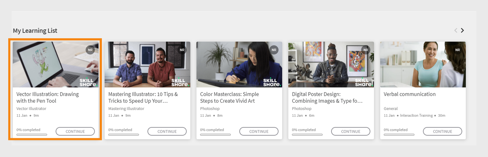

# Page d’accueil de l’élève

## Vue d’ensemble {#overview}

Une fois que l’administrateur a activé la mise en page immersive, l’élève est accueilli par une interface utilisateur entièrement remaniée lorsqu’il se connecte à l’application.

>[!NOTE]
>
>Le navigateur IE11 ne prend pas en charge la disposition immersive.

## Nouvelle interface utilisateur d’élève pour la mise en page immersive

>[!IMPORTANT]
>
>Nous publierons la nouvelle interface utilisateur des élèves par phases.

Nous avons actualisé l’interface utilisateur des élèves avec un design plus épuré et mis à jour. La nouvelle interface utilisateur vise à offrir une expérience utilisateur cohérente sur les pages de destination **[!UICONTROL Accueil de l&#39;élève]**, **[!UICONTROL Mon apprentissage]**, **[!UICONTROL Catalogue]** et **[!UICONTROL Présentation du cours]**. Les nouveaux éléments visuels suivent les styles de conception actuels, ce qui rend le produit plus facile à utiliser et plus attrayant. Cette mise à jour inclut un nouvel en-tête, un panneau latéral et des widgets contemporains.

>[!NOTE]
>
>L’interface utilisateur remaniée s’applique uniquement à la mise en page immersive. L’application web/mobile ne prend pas encore en charge ces modifications et les mettra à jour dans une prochaine version.

_Ancienne interface utilisateur_

_Nouvelle interface utilisateur_

### Page d’accueil

La page d’accueil présente un nouveau design avec un panneau latéral amélioré, un en-tête supérieur, des cartes de cours améliorées et des widgets.

_Nouvelle page d’accueil_

### Page Catalogue

Les pages du catalogue ont un nouvel aspect avec des filtres organisés et des fiches de cours améliorées pour offrir une meilleure expérience utilisateur.

_Page de catalogue_

### Page de présentation du cours

La page de présentation du cours a un nouvel aspect avec plus de détails sur le cours. Cette page aide les élèves à obtenir toutes les informations dont ils ont besoin.

_Page de présentation du cours_

### Cartes de cours

Les cartes de cours présentent également une disposition repensée pour afficher les détails plus efficacement. Les fiches de cours remaniées mettent en évidence les métadonnées pertinentes requises pour l&#39;inscription. Ces métadonnées incluent les dates de publication ou d’échéance, les évaluations et les descriptions correctes, ainsi que leurs auteurs ou fournisseurs.

_Ancienne carte de cours_

_Nouvelle carte de cours_

Pour les cours importés à partir de **LinkedIn** et de la plateforme **Go1**, les cartes de cours affichent les dates de publication d&#39;origine de **LinkedIn** et **Go1**. Vous pouvez également afficher ces dates de publication spécifiques dans l’interface utilisateur.

### Barre latérale et barre de recherche

La barre latérale est mise à jour avec de nouveaux éléments d’interface utilisateur pour un look plus épuré. La nouvelle barre de recherche n’a pas de bouton de recherche, ce qui lui donne un aspect plus net. Les élèves peuvent saisir un mot-clé et appuyer sur Entrée pour lancer la recherche ou sélectionner des résultats sous la barre de recherche.

_Barre latérale et barre de recherche_

### En-tête {#masthead}

Comprend un carrousel d’images ou de vidéos avec une URL intégrée. L&#39;[administrateur peut charger n&#39;importe quelle image ou ressource vidéo](../../administrators/feature-summary/announcements.md#masthead) en tant qu&#39;en-tête et définir sa visibilité pour un groupe d&#39;élèves.

*Afficher l&#39;en-tête*

### Liste Mon apprentissage {#mylearninglist}

Affiche la formation suivie par l’élève. Ces formations sont affichées sous la forme de cartes alignées horizontalement. Vous pouvez cliquer sur le bouton droit ou gauche pour parcourir les cours.

*Afficher ma liste d&#39;apprentissage*

Vous pouvez également faire glisser vers la gauche et la droite pour naviguer dans la liste.

Pour reprendre un cours, cliquez sur **[!UICONTROL Continuer]** sur une carte pour lancer le lecteur.

L&#39;apparence des icônes sur chaque carte de formation est activée/désactivée par l&#39;administrateur via l&#39;application d&#39;administration (**Paramètres** > **Général** > **Activer les icônes des cartes de formation**).

**Ajouter à la liste Mon apprentissage**

Si vous survolez une fiche de cours dans les listes **Recommandé en fonction de vos centres d’intérêt** et **Recommandation sur la base de l’activité des pairs**, vous pouvez voir une option pour ajouter le cours à la **liste Mon apprentissage**. Cliquez sur **[!UICONTROL +]** sur la carte du cours pour ajouter le cours à la **liste Mon apprentissage**.

*Ajouter à la liste Mon apprentissage*

## Choix des niveaux de compétence {#chooseskilllevels}

En tant qu’élève, vous pouvez filtrer le catalogue de cours en fonction des niveaux suivants :

* Débutant
* Intermédiaire
* Avancé

Choisissez une option pour afficher le catalogue de cours en fonction de la sélection.

*Sélectionner des niveaux de compétence*

## Widget Tableau de bord de conformité

Le widget du tableau de bord Conformité permet aux élèves de filtrer les cours/parcours d’apprentissage/certifications qui ont des échéances à venir à l’aide du libellé Conformité. Cette fonctionnalité est disponible sur toutes les applications d’élève, y compris l’application ALM Teams, AEM, l’application mobile, l’application immersive et l’application SF.

_Widget Tableau de bord de conformité_

## Calendrier {#calendar}

Affiche vos sessions et formations planifiées. Parcourez le calendrier pour voir les formations des mois suivants.

*Afficher le calendrier des sessions planifiées*

Le widget Calendrier offre les fonctionnalités suivantes. Vous pouvez afficher les éléments suivants :

* Formation par mois. Faites défiler vers la gauche ou la droite.
* Prochaine formation en salle de classe ou en classe virtuelle à laquelle vous pourrez vous inscrire.
* Prochaine formation en salle de classe ou en classe virtuelle à laquelle vous vous êtes inscrit(e).
* Formation en salle de classe ou en classe virtuelle approuvée par le responsable.

## Réseaux sociaux {#socialfeed}

*Afficher le flux social*

Découvrez de quoi parlent les autres utilisateurs.

Le widget récapitule l’activité pour une période. Il :

* Affiche les utilisateurs actifs et les activités des utilisateurs présents dans votre portée ou votre groupe.
* Affiche les publications diffusées au cours des deux dernières semaines.

## Compétences de profil {#profileskills}

Les compétences de profil sont utilisées pour les recommandations de cours. Si l’administrateur affecte une compétence à un utilisateur ou un groupe d’utilisateurs, cette compétence est ajoutée aux compétences de profil de l’élève. Si l’élève ajoute une compétence à son profil, tous les niveaux de compétence sont ajoutés aux compétences de profil de l’élève. Lorsqu&#39;un élève place le curseur de la souris sur une compétence, il peut voir le nom de la compétence, la méthode d&#39;ajout de la compétence, le niveau, le pourcentage d&#39;achèvement de la compétence, et les crédits.

*Afficher les compétences de profil*

Si un élève s’inscrit à un cours, seules les compétences externes basées sur un score sont ajoutées aux compétences de profil. En outre, un élève peut rechercher, sélectionner et ajouter des compétences externes à son profil. Si un élève s’est connecté à l’application de l’élève pour la première fois et que ses compétences sont déjà présentes, les compétences apparaissent sur Mon profil.

## Recommandé en fonction de vos centres d’intérêt {#recommendationbasedonyourareaofinterest}

Affiche la formation en fonction de votre centre d’intérêt choisi. La recommandation est pilotée par un algorithme de machine learning.

*Afficher les cours recommandés*

Pour des recommandations plus ciblées, vous pouvez mettre à jour vos compétences en cliquant sur **Afficher/Mettre à jour**.

Une fois que vous aurez ajouté une compétence, les recommandations futures seront plus ciblées en fonction de vos préférences.

Si l’administrateur a désactivé l’option **Explorer les compétences**, vous pourrez ajouter un centre d’intérêt à vos compétences.

Les cours recommandés sont affichés sous forme de fiches. Lorsque vous placez le curseur de la souris sur une carte, vous pouvez voir plus de détails sur le cours.

La terminologie du produit est également prise en charge.

**Compétences correspondant au secteur d’industrie**

Si l’administrateur a activé l’option **Correspondant au secteur** dans l’application d’administration, vous pouvez afficher le graphique réseau des compétences.

Ces compétences ne peuvent être visualisées que lorsque l’administrateur définit le type de formation sur Correspondant au secteur.

Dans la visualisation Carte de compétence, vous pouvez rechercher une ou des compétences et les ajouter.

*Visualisation de la carte de compétences*

Activez l&#39;option **Afficher les compétences pour lesquelles des formations sont présentes dans mon compte**, si vous souhaitez afficher toutes les compétences présentes dans votre compte.

Après avoir ajouté une compétence, vous pouvez voir le graphique dirigé par la force avec la compétence sélectionnée comme sommet principal et les compétences associées comme sommets plus petits.

Les compétences que vous avez choisies apparaissent également dans la section **Compétences sélectionnées**.

*Compétences sélectionnées*

Pour ajouter les compétences, cliquez sur **[!UICONTROL Ajouter]**.

## Recommandation sur la base de l’activité des pairs {#recommendationbasedonpeeractivity}

Affiche la formation en fonction de ce que vos homologues suivent. Ceci est aussi déclenché par un algorithme d’apprentissage automatique. Les recommandations sont basées sur la formation pour les élèves personnalisés et alignés sur le secteur.
