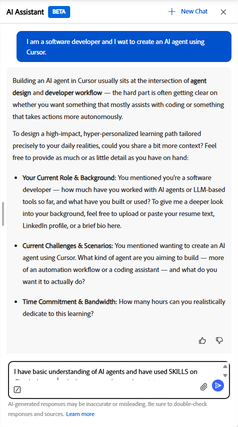
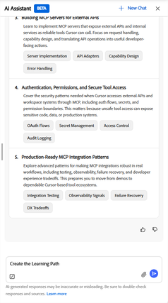

# Qu’est-ce que l’agent de parcours d’apprentissage ?

Un agent de parcours d’apprentissage crée un parcours d’apprentissage structuré à l’aide de l’assistant IA. Contrairement aux parcours d’apprentissage standard attribués par votre administrateur, ces parcours d’apprentissage sont générés par le biais d’une conversation guidée. Vous décrivez votre objectif et l’agent définit un parcours adapté à vos besoins d’apprentissage.

L&#39;agent commence par extraire le contenu du catalogue de cours interne de votre organisation, en donnant la priorité aux cours approuvés et pertinents pour votre équipe. Si votre administrateur a activé le contenu tiers, l&#39;agent peut également inclure des cours de fournisseurs externes connectés pour combler les lacunes de couverture. Vous êtes toujours automatiquement inscrit aux cours de votre parcours enregistré, ce qui vous permet de commencer à apprendre immédiatement.

Les parcours d’apprentissage personnalisés sont conçus pour deux cas d’utilisation principaux :

- **Développement de compétences ciblé** : lorsque vous devez atteindre un résultat professionnel spécifique ou atteindre rapidement un objectif de performance, tel que la préparation à une nouvelle responsabilité ou la réduction d’un déficit de compétences identifié dans une révision.
- **Acquérir une expertise approfondie** : lorsque vous souhaitez passer du statut de débutant à celui d&#39;expert dans un domaine, une technologie ou une discipline choisi(e) sur une période plus longue.

## Fonctionnement de l’approche basée sur la conversation

L’agent génère ensuite un parcours d’apprentissage nommé affichant chaque cours, sa description, sa durée et le nombre de modules. Avant d’enregistrer, vous pouvez demander à l’agent d’ajouter, de supprimer ou de remplacer des cours individuels dans le chemin à l’aide du langage naturel. »

À partir de vos réponses, l&#39;agent identifie 3 à 5 sujets d&#39;apprentissage avec des niveaux de compétence suggérés. Vous pouvez consulter ces rubriques, demander des modifications ou les confirmer avant que l&#39;agent ne recherche des cours correspondants. L’agent génère ensuite un parcours d’apprentissage nommé affichant chaque cours, sa description, sa durée et le nombre de modules. Vous pouvez ajuster le tracé avant de l’enregistrer.

Lorsque vous enregistrez le chemin, vous êtes automatiquement inscrit à tous les cours. Le parcours s’affiche sur votre page d’accueil dans la section _Parcours d’apprentissage personnalisés_, prêt à commencer.

### Sources de contenu et sélection de cours

L&#39;agent sélectionne les cours en fonction de la pertinence par rapport à votre objectif déclaré, de votre niveau de maîtrise actuel, du temps total dont vous disposez et de la date de mise à jour du contenu. Lorsque l&#39;agent ne trouve pas de cours correspondant à une rubrique spécifique dans le catalogue disponible, il vous informe et vous suggère de contacter votre administrateur pour demander du contenu supplémentaire pour cette zone.

### Parcours d’apprentissage personnalisés sur la page d’accueil

Tous les parcours d’apprentissage personnalisés enregistrés apparaissent dans la bande _Parcours d’apprentissage personnalisés_ sur votre page d’accueil. Chaque carte affiche le nom du chemin d&#39;accès, le nombre de cours et un bouton _Continuer_ pour reprendre là où vous vous étiez arrêté.

### Partager un parcours d’apprentissage

Une fois que vous avez enregistré un parcours d’apprentissage personnalisé, vous pouvez le partager avec vos collègues. Le partage leur envoie un lien ou une invitation par e-mail. Lorsqu’un collègue ouvre un chemin partagé, il peut s’inscrire en une seule action. Le partage est utile lorsque plusieurs membres de votre équipe ont des objectifs d’apprentissage similaires et que vous souhaitez qu’ils suivent le même plan structuré.

### Bonnes pratiques

- Décrivez votre objectif d’apprentissage de la manière la plus précise possible au début de la conversation. Plus l&#39;agent dispose de contexte, plus votre chemin d&#39;accès sera pertinent.
- Fournissez votre engagement de temps à l’avance, de sorte que le chemin généré corresponde à votre calendrier réel. L&#39;agent comprend le langage naturel : « deux soirs par semaine » ou « 30 minutes par jour » sont tous deux valides.
- Passez en revue les rubriques suggérées avant de demander à l&#39;agent de générer des cours. Confirmer ou ajuster les sujets à ce stade permet de gagner du temps par rapport à la révision de la liste des cours par la suite.
- Si une rubrique n’affiche aucun contenu correspondant, notez-la et contactez votre administrateur pour demander l’ajout de cours pertinents au catalogue.
- Utilisez un langage naturel pour affiner votre tracé avant de l’enregistrer. Par exemple, demandez à supprimer un cours que vous avez déjà terminé ou remplacez-en un qui semble trop avancé.

## Configuration de l’agent du parcours d’apprentissage personnalisé

L’agent de parcours d’apprentissage personnalisé est activé par défaut dans Adobe Learning Manager lorsque vous activez l’option Assistant IA dans Paramètres.

>[!NOTE]
>
> La visibilité du contenu suit vos règles d’accès au catalogue existantes. Un élève ne verra et ne recevra que les cours des catalogues auxquels il a déjà accès. L’agent du parcours d’apprentissage personnalisé ne contourne pas les restrictions de catalogue.

Au sein de chaque source, l’agent classe les cours en fonction de l’objectif de l’élève et de la mesure dans laquelle le niveau de cours correspond à la compétence déclarée de l’élève.

Si aucun cours correspondant n’est disponible pour une rubrique du catalogue, l’agent en informe l’élève et lui suggère de contacter un administrateur pour demander du contenu pour cette zone.

<!-- 
### Monitor credit usage

The Personalized Learning Path agent consumes AI credits each time a learner generates a path. To monitor and manage usage:

1. In the left navigation of the administrator's home page, select **Billing**.
2. Select the **AI Credits** tab. The **Learning Path** agent appears as a line item in the features list.
3. Review current usage and adjust the credit allocation or usage limit as needed.

>[!CAUTION]
>
>If the credit limit for the Learning Path agent is reached, learners receive an in-app message that the agent is unavailable and are directed to contact an administrator. Increase the allocation to restore access. 
-->

## Créer un parcours d’apprentissage personnalisé avec l’assistant d’IA dédiée aux élèves

Utilisez l’assistant Learner AI dans Adobe Learning Manager pour générer un parcours d’apprentissage personnalisé adapté à votre objectif, à votre arrière-plan et au temps disponible. Enregistrez-le ensuite sur votre profil et commencez immédiatement à apprendre.

### Ouvrez l’assistant d’IA dédiée aux élèves et démarrez une conversation

1. Sélectionnez **Assistant IA** dans votre page d&#39;accueil.
2. Saisissez votre objectif d’apprentissage dans le champ de texte. Soyez aussi précis que possible. Par exemple :
   - *Je suis développeur de logiciels et je souhaite créer un agent AI à l’aide de Cursor.*
   - *Je viens d&#39;être promu à un rôle de responsable et je veux apprendre à gérer des conversations difficiles.*
   - *Je souhaite maîtriser la modélisation financière en tant qu’analyste.*
     

3. Vous pouvez également sélectionner _+ Nouvelle conversation_ pour lancer une nouvelle conversation si des sessions précédentes sont ouvertes.

Remarques :

- Vous pouvez éventuellement joindre un document à l&#39;aide de l&#39;icône _trombone_, tel qu&#39;un CV, un e-mail de retour d&#39;informations du responsable ou un résumé de projet. L’agent utilise le document pour obtenir plus de contexte sur votre objectif d’apprentissage et votre arrière-plan.
- Sélectionnez _Envoyer_.

### Décrivez votre objectif et votre contexte

L’agent vous répond par un message confirmant votre objectif et vous demande un contexte supplémentaire afin d’adapter votre parcours. Il pose généralement des questions sur :

- _Votre rôle actuel et vos antécédents_ ce que vous savez déjà, depuis combien de temps vous occupez votre rôle ou toute expérience pertinente.
- _Vos défis ou scénarios spécifiques_ et les situations réelles auxquelles vous devez immédiatement faire face grâce à cet apprentissage.
- _Votre engagement temporel_ correspond au nombre d&#39;heures par semaine que vous pouvez raisonnablement consacrer à l&#39;apprentissage.

Vous n&#39;avez pas besoin de répondre à toutes les questions. Le seul commentaire requis est votre objectif ou défi d’apprentissage. L&#39;agent procède avec le contexte que vous fournissez.

>[!TIP]
>
>L&#39;agent comprend les expressions de temps naturelles. Vous pouvez dire « deux soirs par semaine », « environ 30 minutes par jour » ou « quelques heures le week-end », et l&#39;agent convertit cela en heures hebdomadaires pour estimer et confirmer avec vous.

Tapez votre réponse et sélectionnez _Envoyer_.

Continuez la conversation jusqu&#39;à ce que l&#39;agent présente les sujets suggérés.

### Examiner les rubriques suggérées

À partir de vos réponses, l&#39;agent identifie 3 à 5 sujets d&#39;apprentissage. Vous pouvez consulter ces rubriques, demander des modifications ou les confirmer avant que l&#39;agent ne recherche des cours correspondants. L’agent génère ensuite un parcours d’apprentissage nommé affichant chaque cours, sa description, sa durée et le nombre de modules. Vous pouvez ajuster le tracé avant de l’enregistrer.

1. Passez en revue les rubriques suggérées pour vous assurer qu’elles correspondent à votre objectif d’apprentissage.
2. Pour ajuster les rubriques, saisissez vos commentaires dans la discussion. Vous pouvez demander à l’agent d’ajouter, de supprimer ou de remplacer une rubrique.
3. Si les rubriques suggérées vous conviennent, confirmez-les en répondant dans la discussion ou en sélectionnant l’invite de confirmation suggérée si elle apparaît.

### Examen du parcours d’apprentissage

L’agent recherche dans le catalogue disponible et crée un parcours d’apprentissage nommé. Le chemin montre :

- Nom du chemin d’accès et durée totale estimée
- Titre, description, durée et nombre de modules de chaque cours
- Une indication si certaines rubriques n’avaient pas de contenu correspondant disponible

Si certaines rubriques n’ont pas de contenu correspondant :

L&#39;agent vous informe qu&#39;il n&#39;a pas pu trouver de cours pour ces sujets spécifiques et suggère de contacter votre administrateur pour demander du contenu pour ces domaines. Le chemin d’accès est toujours généré pour les rubriques où des cours ont été trouvés.

<!-- - Review the path. If you want to change something, for example, remove a course, adjust the scope, or explore different topics. Type your request in the chat\. For example, Can you remove the first course and replace it with something shorter? -->
Lorsque le chemin vous convient, demandez à l’agent de l’enregistrer en tapant enregistrer le parcours d’apprentissage.

<!--

-->

### Ajuster votre parcours d’apprentissage avant d’enregistrer

Avant d&#39;enregistrer votre parcours, vous pouvez demander à l&#39;agent d&#39;ajouter, de supprimer ou de remplacer un cours. Décrivez la modification en langage simple. L&#39;agent met uniquement à jour le cours que vous mentionnez. Le reste de votre chemin reste le même.

Par exemple :

- J&#39;ai déjà terminé le deuxième cours. Supprimez-le.
- Ajoutez un cours sur [rubrique]. Je n&#39;en vois pas dans la liste.
- Le quatrième cours semble trop avancé. Pourriez-vous la remplacer par quelque chose de plus fondamental?

L&#39;agent applique votre modification et vous indique le chemin mis à jour. Continuez à ajuster jusqu’à ce que vous soyez satisfait, puis enregistrez le tracé.

>[!NOTE]
>
>Un parcours d’apprentissage peut contenir jusqu’à cinq cours. Si vous demandez l&#39;ajout d&#39;un cours alors que le chemin est déjà plein, l&#39;agent vous demande quel cours existant vous souhaitez remplacer.

Si votre demande n&#39;est pas claire, l&#39;agent pose une question de clarification avant d&#39;apporter une modification. S&#39;il n&#39;existe pas de remplacement approprié pour un cours que vous souhaitez échanger, l&#39;agent explique pourquoi et suggère le cours correspondant le plus proche à la place.

### Enregistrement et accès à votre parcours d’apprentissage

Lorsque vous enregistrez le chemin, l&#39;agent confirme l&#39;enregistrement et vous inscrit automatiquement à tous les cours dans le chemin.

Pour accéder à votre chemin :

- Sélectionnez _Accéder au parcours d’apprentissage_ dans le message de confirmation pour l’ouvrir immédiatement, ou
- Vous pouvez le retrouver à tout moment dans la bande _Parcours d’apprentissage personnalisés_ sur votre page d’accueil.

### Partager votre parcours d’apprentissage

À partir de la page de présentation du chemin, vous pouvez partager votre chemin enregistré avec vos collègues.

1. Ouvrez votre parcours enregistré dans la bande _Parcours d’apprentissage personnalisés_ sur votre page d’accueil.
2. Sélectionnez _Partager_.
3. Partagez le lien généré ou entrez des adresses e-mail pour envoyer une invitation directe.

Un collègue qui reçoit le lien partagé peut s’inscrire au chemin d’accès en une seule action.

## Bonnes pratiques

- Donnez du contexte sur votre rôle et les défis actuels. Plus vous êtes précis, plus la sélection de cours est pertinente.
- Mentionnez votre engagement hebdomadaire en langage naturel. L&#39;agent confirmera son interprétation avant de générer le chemin.
- Passez en revue les rubriques suggérées avant de demander la génération du chemin. L&#39;ajustement des rubriques à ce stade est plus rapide que la révision de la liste des cours par la suite.
- Si le chemin d&#39;accès généré comprend des cours déjà terminés, informez l&#39;agent. Il peut proposer des solutions de rechange.

## Foire aux questions

_Où puis-je trouver mes parcours d’apprentissage personnalisés enregistrés ?_

Tous vos parcours enregistrés apparaissent dans la bande _Parcours d’apprentissage personnalisés_ sur votre page d’accueil. Chaque carte affiche le nom du chemin et un bouton _Continuer_. Vous pouvez également ouvrir n’importe quel chemin à partir de là pour afficher la liste complète des cours et votre progression.

_Combien de parcours d’apprentissage personnalisés puis-je enregistrer ?_

La bande _Parcours d’apprentissage personnalisés_ sur votre page d’accueil affiche un maximum de 20 parcours.

_Quelles informations dois-je fournir pour obtenir un parcours d’apprentissage pertinent ?_

Décrivez au minimum votre objectif d’apprentissage ou le défi spécifique que vous essayez de relever. Plus vous fournissez de contexte, meilleur est le chemin\. Parmi les informations utiles, citons votre rôle actuel, la durée de votre formation, vos éventuelles expériences antérieures et le nombre d’heures hebdomadaires que vous pouvez raisonnablement consacrer à votre apprentissage.

_Que se passe-t-il si l&#39;agent ne trouve pas de cours correspondants pour mes rubriques ?_

L&#39;agent vous informe directement dans la conversation qu&#39;il n&#39;a pas pu trouver de cours correspondants pour une ou plusieurs de vos rubriques. Il génère le chemin en utilisant uniquement les rubriques où les cours étaient disponibles.

Si l&#39;agent ne trouve pas de cours pour l&#39;une de vos rubriques, il vous informera qu&#39;il ne peut pas créer de chemin pour cet objectif. Dans les deux cas, contactez votre administrateur d’apprentissage et faites-lui savoir quelles rubriques n’avaient pas de contenu disponible. Ils peuvent ajouter des cours pertinents au catalogue afin que les futures demandes de parcours soient couvertes.

<!-- 
_How does the agent decide which courses to include?_

The agent prioritizes your organization's internal course catalog above external sources. It selects courses based on relevance to your stated goal, whether the course level matches your proficiency, how recently the content was published or updated, and quality signals such as ratings and completion rates\. Your administrator controls which content sources are available. 
-->

_Puis-je ajuster les rubriques de mon parcours d’apprentissage ?_

Oui. Au cours de la conversation, vous pouvez demander à l’agent d’ajouter, de supprimer ou de modifier des rubriques avant la génération du chemin. L&#39;agent mettra à jour la liste des rubriques et régénérera le chemin pour qu&#39;il corresponde.

_Puis-je modifier les cours individuels dans un chemin généré ?_

Oui. Avant d&#39;enregistrer le chemin, vous pouvez demander à l&#39;agent d&#39;ajouter, de supprimer ou de remplacer un cours en utilisant le langage naturel. Par exemple, « supprimez le deuxième cours » ou « remplacez le quatrième cours par quelque chose de plus fondamental ». L&#39;agent met uniquement à jour le cours que vous avez mentionné et laisse le reste du chemin inchangé.

Si vous souhaitez effectuer une modification plus large sur plusieurs rubriques, il est plus rapide d&#39;ajuster vos rubriques avant que l&#39;agent ne génère le chemin, car la sélection des cours est basée sur les rubriques que vous confirmez.

_Que se passe-t-il si j’essaie d’ajouter un cours mais que mon chemin est déjà plein ?_

Un parcours d’apprentissage peut inclure jusqu’à cinq cours. Si vous demandez l&#39;ajout d&#39;un nouveau cours alors que le chemin est plein, l&#39;agent vous demande quel cours existant vous souhaitez remplacer par le nouveau.

_Pourquoi l&#39;agent continue-t-il à poser des questions de suivi ?_

L&#39;agent a besoin de suffisamment de clarté sur votre objectif d&#39;apprentissage pour identifier les sujets pertinents. Si votre message initial était général, comme « Je veux apprendre le marketing », il posera des questions pour en restreindre la portée. Fournir des détails plus précis sur votre rôle, les défis auxquels vous faites face et ce que vous voulez être en mesure de faire après l&#39;apprentissage aidera l&#39;agent à passer plus rapidement à la génération de sujets.