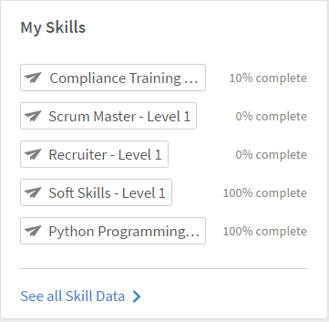
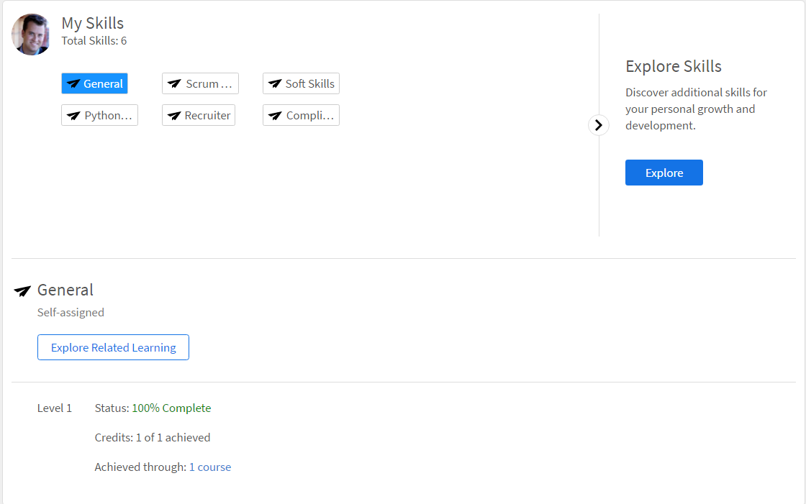

# Compétences et niveaux

Lisez cet article pour découvrir comment acquérir des compétences en tant qu’élève dans Learning Manager.

Une carte de compétences est un regroupement d’ensembles de compétences, de connaissances et de caractéristiques d’un employé dans une organisation. Ces compétences aident les entreprises/organisations à définir ou augmenter leurs attentes concernant les performances de leurs employés. Les compétences permettent aux employés d’aligner leurs comportements sur les attentes de leur entreprise.

Adobe Learning Manager vous permet de déterminer les performances des élèves en fonction de leurs compétences à l’aide du widget des compétences. Lorsque des élèves ont terminé certains cours, ils peuvent connaître leur positionnement par rapport à chaque compétence en cliquant sur Compétences sur la page d’accueil des élèves.

## Afficher les compétences {#viewskills}

Pour afficher les compétences, cliquez sur l’un des noms de compétence dans le widget Compétences, sur la page d’accueil des élèves. Les compétences s’affichent avec leurs niveaux en regard de chaque nom.

*Afficher toutes les compétences*

Le pourcentage d’achèvement de chaque compétence est disponible dans le widget, en regard de la compétence. Lorsque vous cliquez sur chaque compétence, l’application ouvre la page Compétences, sur laquelle vous pouvez visualiser les détails de la compétence sur lequel vous avez cliqué.

La page Compétences affiche l’État de la compétence sur laquelle vous avez cliqué. Par exemple, Java. La page Compétence affiche l’État, par exemple « En cours », et les crédits, par exemple « 2 crédits sur 10 obtenus ».

Sur cette page, vous pouvez cliquer sur chacune de vos compétences pour afficher les données correspondantes.

*Afficher chaque compétence*

Seuls les administrateurs peuvent créer et assigner des compétences aux élèves. Les compétences assignées automatiquement correspondent aux programmes d’apprentissage/cours auxquels les élèves sont inscrits.

>[!NOTE]
>
>Les élèves peuvent afficher leurs compétences de niveau homologue uniquement dans une application Élève classique.

## Achever une compétence {#achieveskill}

Un élève peut acquérir une compétence dès lors qu’il termine les programmes d’apprentissage/cours assignés et incluant des crédits de compétence. Les élèves peuvent également acquérir une compétence en s’inscrivant eux-mêmes à des cours consacrés à une compétence particulière et en le menant à terme.
