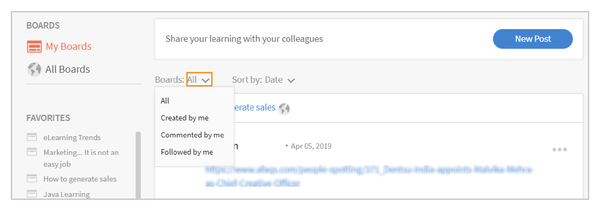

# Apprentissage par les réseaux sociaux dans Learning Manager

Apprenez à utiliser l’apprentissage par les réseaux sociaux en tant qu’élève

L’apprentissage par les réseaux sociaux est une plateforme dans Learning Manager qui incite les utilisateurs à partager des idées et des informations significatives dans un environnement informel. Il s’agit d’une méthodologie qui complète l’idée de l’apprentissage traditionnel. L’accomplissement d’un cours en ligne ne donne pas l’avantage aux utilisateurs d’interagir avec leurs pairs au niveau social.

Suivre une formation ne garantit pas que les utilisateurs retiennent tout ce qu’ils auront appris. D’autre part, l’apprentissage par les réseaux sociaux permet aux utilisateurs d’utiliser l’expertise autour d’eux pour obtenir exactement les informations dont ils ont besoin. À leur tour, les utilisateurs peuvent rapidement appliquer ces informations pour mener à bien une tâche et atteindre un objectif.

De même, la fonctionnalité Apprentissage par les réseaux sociaux de Learning Manager permet aux utilisateurs d’interagir les uns avec les autres en partageant et en apprenant du contenu.

Sur cette plate-forme, les différents types de contenu pouvant être partagés sont les suivants : vidéo, audio, capture d’écran, texte, question et sondage. Les utilisateurs peuvent également partager leurs apprentissages en ligne avec leurs homologues à l’aide de la fonctionnalité **Partage sur un signet de réseau social**. Pour plus d’informations, voir  [Partager sur l’apprentissage par les réseaux sociaux](share-to-social.md).

Le contenu peut également être publié à l’intérieur d’un forum à l’aide du **Application de bureau Adobe Learning Manager**. Pour plus d’informations, voir  [Application de bureau Adobe Learning Manager](../adobe-learning-manager-app-for-desktop.md).

La fonctionnalité est visible par un élève uniquement si l’administrateur autorise l’apprentissage par les réseaux sociaux.

 

*Afficher le tableau de bord d’apprentissage*

<table>
 <tbody>
  <tr>
   <td>
    
<b>Appr. Rés. Soc. N°</b>
</td>
   <td>
    
<b>Terminologie ou concept</b>
</td>
   <td>
    
<b>Explication courte</b>
</td>
  </tr>
  <tr>
   <td>
    
1
</td>
   <td>
    
Mes forums
</td>
   <td>
    
Un tableau est <code>
      collection
     </code> des publications créées par un utilisateur. L’option Mes forums affiche toutes les publications auxquelles l’utilisateur a participé, qu’il a créées et suivies.
</td>
  </tr>
  <tr>
   <td>
    
2
</td>
   <td>
    
Tous les forums
</td>
   <td>
    
Sur la page Tous les forums, les utilisateurs peuvent afficher les forums créés par tous les élèves qui partagent l’étendue de l’activité.
</td>
  </tr>
  <tr>
   <td>
    
3
</td>
   <td>
    
Commentaire
</td>
   <td>
    
Les utilisateurs peuvent commenter et voir les publications créées dans les forums. 
</td>
  </tr>
  <tr>
   <td>
    
4
</td>
   <td>
    
Répondre
</td>
   <td>
    
Les utilisateurs peuvent répondre aux commentaires formulés sur des publications à l’intérieur d’un forum.
</td>
  </tr>
  <tr>
   <td>
    
5
</td>
   <td>
    
Donner un vote positif/négatif
</td>
   <td>
    
Cliquez sur les boutons de vote positif et négatif pour aimer ou non une publication.
</td>
  </tr>
  <tr>
   <td>
    
6
</td>
   <td>
    
Tableau des scores des réseaux sociaux
</td>
   <td>
    
Dans le Tableau des scores des réseaux sociaux, les utilisateurs peuvent afficher les noms des élèves avec le nombre de points qu’ils ont gagnés en participant à l’apprentissage par les réseaux sociaux.
</td>
  </tr>
  <tr>
   <td>
    
7
</td>
   <td>
    
Personnes que je suis
</td>
   <td>
    
Ici, les utilisateurs peuvent voir les noms des autres élèves qu’ils suivent et le nombre de publications qu’ils ont créées.
</td>
  </tr>
  <tr>
   <td>
    
8
</td>
   <td>
    
Compétences populaires
</td>
   <td>
    
Dans les sections Tous les forums, les compétences fréquemment utilisées par les élèves peuvent être consultées, ainsi que le nombre de publications créées à l’aide de cette compétence.
</td>
  </tr>
  <tr>
   <td>
    
9
</td>
   <td>
    
Partager vers les réseaux sociaux
</td>
   <td>
    
Le signet Partager vers les réseaux sociaux permet aux utilisateurs de partager leurs apprentissages en ligne comme des pages Web et des blogs directement sur l’Apprentissage par les réseaux sociaux de Learning Manager.
</td>
  </tr>
  <tr>
   <td>
    
10
</td>
   <td>
    
Nouvelle publication
</td>
   <td>
    
Le nouveau bouton de publication permet aux utilisateurs de créer et de publier du contenu dans les forums.
</td>
  </tr>
 </tbody>
</table>

## Création de contenu sous forme de publication {#creatingcontentasapost}

Le contenu est créé sous forme de publication dans un forum. Pour créer une publication, suivez les étapes ci-dessous :

1. Cliquez sur **[!UICONTROL Nouvelle publication].**

   
   *Sélectionner une nouvelle publication*

1. Sélectionnez l’un des types de contenu suivants à publier : texte, question, vidéo, audio, sondage et copie d’écran. Le contenu existant peut être téléchargé sur le système des utilisateurs ou sur la galerie de l’application de bureau Adobe Learning Manager.

   Utilisez l’application de bureau Adobe Learning Manager pour enregistrer une vidéo ou un écran, un audio, et faites une copie d’écran. Pour plus d’informations, voir [Application de bureau Adobe Learning Manager](../adobe-learning-manager-app-for-desktop.md).

   <!---->

1. Recherchez un forum ou une compétence en rapport avec la publication. Si le forum n’existe pas, cliquez sur **[!UICONTROL Créer un nouveau forum]**.

   

   *Création d’un forum*

   Si vous êtes un utilisateur externe ou interne, et si l’administrateur vous a donné accès à la création d’un forum, il vous est possible d’en créer un. Si vous ne disposez pas des autorisations nécessaires pour créer un forum, le lien **Créer un nouveau forum** n’apparaît pas.

1. Dans la boîte de dialogue contextuelle, remplissez les champs, sélectionnez le type de forum suivant :

   * **Public** - La participation et la visibilité des posts sont disponibles pour tous les utilisateurs.
   * **Privé** - La publication est uniquement visible par le créateur du forum, les modérateurs et les utilisateurs ajoutés au forum.
   * **Restreint** - Seuls le propriétaire, l’administrateur et les modérateurs du forum peuvent créer une publication. Les autres utilisateurs peuvent participer en commentant/répondant, en votant pour/contre, etc.

   <!---->

   >[!NOTE]
   >
   >Dans l’application Social Learner, seul un **Administrateur** a la possibilité de créer un forum privé avec des groupes d’utilisateurs (internes/externes).
   >
   >Tout autre utilisateur à l’exception de l’administrateur, de l’auteur, de l’apprenant, du responsable, de l’instructeur, etc. **impossible** créer des forums privés avec des groupes d’utilisateurs. Ils ne peuvent pas voir la section de **groupes d’utilisateurs** pendant la création du forum privé.

   Administrateur uniquement - Lorsque vous sélectionnez l’option **Privé**, deux options s’affichent : **Utilisateurs** et **Groupes d’utilisateurs**. Sélectionnez l’option **Groupes d’utilisateurs**, puis ajoutez les groupes d’utilisateurs avec lesquels vous souhaitez partager le forum privé.

   Dans le champ Groupes d’utilisateurs, vous pouvez sélectionner des groupes internes, externes ou personnalisés. Votre forum privé sera alors visible par tous les groupes d’utilisateurs spécifiés, quels que soient les paramètres d’étendue.

1. Pour partager du contenu, cliquez sur **[!UICONTROL Post]**. En cliquant sur Publier, l’utilisateur reçoit une notification.

   Le contenu est publié en fonction du paramètre de curation défini par l’administrateur pour le contenu d’apprentissage par les réseaux sociaux qui peut être curé par  [Modérateurs/Experts](social-learning-web-user.md#HowtobecomeaSubjectMatterExpertSME).

   <!---->

1. Les utilisateurs reçoivent des notifications lorsque leur publication est approuvée ou rejetée, si l’administrateur a défini le paramètre de curation sur curation manuelle uniquement. Si la publication est rejetée, cliquez sur le lien hypertexte **Cliquer pour réviser** pour consulter les commentaires formulés par les modérateurs du forum ou les experts.

   Le contenu créé par les utilisateurs est conservé par des modérateurs du forum ou des experts en la matière.

   <!---->

Lorsque vous créez ou répondez à un message dans Apprentissage par les réseaux sociaux, vous pouvez composer un message en utilisant l&#39;éditeur de texte enrichi et appliquer différents types de formatage.

*Utilisation de l’éditeur de texte enrichi pour créer un post*

En outre, lors de la création d’un forum, vous avez accès au même ensemble d’options dans l’éditeur de texte enrichi.

*Utilisation de l’éditeur de texte enrichi pour créer un post*

## Affichage du contenu approuvé {#viewingapprovedcontent}

Une fois qu’une publication est approuvée, elle est affichée dans un forum Apprentissage par les réseaux sociaux. Les utilisateurs peuvent maintenant commenter, répondre, donner un vote positif/négatif à la publication.

Les utilisateurs peuvent utiliser le type de contenu suivant pour laisser un commentaire : Écran d’enregistrement, webcam ou les deux, Enregistrement audio, Copie d’écran, Téléchargement de fichier, Galerie Learning Manager.

<!---->

## Contenu dans le lecteur pour réseaux sociaux {#contentinsocialplayer}

Dans Learning Manager, les vidéos, les contenus statiques tels que les présentations et les images sont publiés dans le lecteur pour réseaux sociaux du forum. Vous pouvez télécharger un fichier depuis votre système, enregistrer une vidéo/un écran et faire une copie d’écran à l’aide de l’application de bureau Adobe Learning Manager.

Une fois que l’utilisateur a fini de publier du contenu, celui-ci peut être visualisé par d’autres élèves dans l’étendue de leur activité. Sur le lecteur pour réseaux sociaux, les élèves peuvent afficher, commenter/répondre, donner un vote positif/négatif et signaler des abus.

<!---->

**Pour commenter/répondre, donner un vote positif/négatif sur le lecteur pour réseaux sociaux, suivez les étapes ci-dessous :**

1. Cliquez sur le bouton plein écran dans le coin inférieur droit du lecteur pour réseaux sociaux.
1. Pour afficher les commandes du lecteur à l’écran, cliquez sur la flèche orientée vers le bas.
1. Pour afficher la section de commentaires, cliquez sur l’icône de commentaires dans le coin inférieur gauche de l’écran.
1. Les utilisateurs peuvent commenter/répondre, donner un vote positif/négatif et signaler un abus.
1. Cliquez sur la touche Échap pour quitter le mode plein écran.

## Mode Tableau dans les réseaux sociaux {#board-view-social}

Un élève peut voir tous les tableaux dans une vue sous forme de liste. Connectez-vous à votre application d’élève puis, sur votre page Apprentissage par les réseaux sociaux, cliquez sur le bouton, comme indiqué ci-dessous :

*Mode Tableau dans les réseaux sociaux*

Lorsque vous affichez les publications dans un format de tableau, vous pouvez trier les publications en fonction de **Post** et **Contributeur**.

* Si vous choisissez **Publications**, les tableaux seront triés en fonction du nombre de publications créées dans le tableau.
* Si vous choisissez **Contributeurs**, les tableaux seront triés en fonction du nombre d&#39;utilisateurs qui ont commenté ou répondu dans les fils de conversation.

### Filtre Compétence {#skillfilter}

*Trier les publications*

Le filtre Compétence vous permet de sélectionner plusieurs compétences pour filtrer les tableaux. Vous pouvez également effacer les filtres une fois que vous avez sélectionné les compétences.

### Filtre Niveau d&#39;activité {#activitylevelfilter}

*Filtrage des niveaux d’activité*

Le filtre Activité vous permet de trier les tableaux en fonction de l’ampleur des interactions qui s’y produisent. Vous pouvez trier les tableaux à l’aide des filtres suivants :

* Activité élevée
* Activité normale
* Faible activité

En mode Tableau, vous pouvez effectuer les actions habituelles au niveau du tableau.

<!---->

## Télécharger les publications {#downloadposts}

Les élèves peuvent télécharger le contenu, avec des pièces jointes, de la plateforme Apprentissage par les réseaux sociaux, afin d’utiliser ce contenu hors ligne.

*Télécharger une publication sur les réseaux sociaux*

Vous pouvez télécharger le contenu à partir des sections Publications, Commentaires ou Réponses. Vous ne pouvez télécharger qu’un seul fichier à la fois.

Les deux types d’utilisateurs (internes ou externes) doivent pouvoir télécharger le contenu.

Le bouton Télécharger est également visible dans les résultats de recherche pour les publications, les commentaires ou les réponses.

Vous ne pouvez pas encore télécharger une publication dans l’application de l&#39;appareil. Cette fonctionnalité sera bientôt disponible.

## Format de contenu pris en charge {#supportedcontentformats}

<table>
 <tbody>
  <tr>
   <td>
    
<b>Type de contenu</b>
</td>
   <td>
    
<b>Extensions</b>
</td>
  </tr>
  <tr>
   <td>
    
Vidéo
</td>
   <td>
    
wmv, f4v, asf, 3gp, 3g2, avi, mov, h264, m4v, mp4, MPEG, mpg
</td>
  </tr>
  <tr>
   <td>
    
Audio
</td>
   <td>
    
mp3, amr, m4a, wav, wma, aac
</td>
  </tr>
  <tr>
   <td>
    
Fichiers statiques
</td>
   <td>
    
PDF, ppt, pptx, doc, docx, xls, xlsx
</td>
  </tr>
  <tr>
   <td>
    
Image
</td>
   <td>
    
jpg, jpeg, png, bmp, gif
</td>
  </tr>
 </tbody>
</table>

## Forum visible uniquement pour les utilisateurs sélectionnés {#selected-users}

Un élève ayant également un rôle d’**administrateur** peut ajouter un groupe d’utilisateurs à un forum privé. Tout groupe d’utilisateurs peut être ajouté au forum privé et les utilisateurs appartenant au groupe d’utilisateurs n’ont accès qu’au forum.

Si un nouvel utilisateur est ajouté au groupe d’utilisateurs, les deux utilisateurs peuvent voir le forum privé.

Si un utilisateur est supprimé du forum privé, l’utilisateur ne peut plus le voir.

Si plusieurs groupes d’utilisateurs sont ajoutés au forum privé, tous les utilisateurs des deux groupes ont accès aux forums privés.

<!---->

## Actions pouvant être effectuées sur une publication {#actionsthatcanbedoneonapost}

Cliquez sur l’icône du menu réduit située dans le coin supérieur droit d’une publication pour afficher ses options. La liste de menu suivante s’affiche : Modifier, Ajouter à ma story, copier l’URL, supprimer et créer un rapport.

Seuls certains utilisateurs sont autorisés à effectuer des tâches particulières. Les types d’utilisateurs suivants sont les propriétaires de contenu, les modérateurs du forum et l’administrateur de l’organisation.

<table>
 <tbody>
  <tr>
   <td>
    
<b>Appr. Rés. Soc. N°</b>
</td>
   <td>
    
<b>Action</b>
</td>
   <td>
    
<b>Explication</b>
</td>
  </tr>
  <tr>
   <td>
    
1
</td>
   <td>
    
Modifier
</td>
   <td>
    
L’option Modifier permet au créateur de contenu de corriger ou de modifier sa publication.
</td>
  </tr>
  <tr>
   <td>
    
2
</td>
   <td>
    
Ajouter à ma story
</td>
   <td>
    
Une story est un ensemble de contenus organisé par un utilisateur. Les utilisateurs peuvent définir la visibilité du contenu sur Privé ou Public.
</td>
  </tr>
  <tr>
   <td>
    
3
</td>
   <td>
    
Copier l’URL
</td>
   <td>
    
Cette option permet à tous les utilisateurs de copier l’URL d’un forum ou d’une publication et de la partager.
</td>
  </tr>
  <tr>
   <td>
    
4
</td>
   <td>
    
Supprimer
</td>
   <td>
    
L’option Supprimer supprime la publication après confirmation de l’utilisateur.
</td>
  </tr>
  <tr>
   <td>
    
5
</td>
   <td>
    
Rapport
</td>
   <td>
    
Chaque utilisateur a l’autorisation de signaler un abus de publication si elle porte atteinte à sa vie privée ou si le contenu est inapproprié.

    
Une fois qu’une publication a été signalée, une notification est envoyée à l’administrateur du forum et aux modérateurs pour effectuer d’autres actions.
</td>
  </tr>
 </tbody>
</table>

**Ajouter à ma story**

Une story sur réseaux sociaux permet aux utilisateurs d’ajouter ou de créer des stories avec des publications créées par eux-mêmes ou par d’autres utilisateurs.

Pour ajouter une publication à une story, suivez les étapes ci-dessous :

1. Cliquez sur l’icône de menu réduite dans l’angle supérieur droit d’une publication, puis cliquez sur **[!UICONTROL Ajouter à ma story]**.

   

   *Ajouter à un article*

1. Dans la boîte de dialogue **Sélectionner une story**, sélectionnez une story pertinente à ajouter à la publication. Si aucune story pertinente n’existe, créez-en une en cliquant sur **Nouvelle story**.

   

   *Création d’un article*

1. Dans la boîte de dialogue Nouvelle story, renseignez les champs Nom de la story et Description. Vous pouvez également définir la visibilité de la story sur Publique ou Privée.

   

   *Ajouter le nom et la description de l’article*

   Pour afficher les stories créées par les utilisateurs, cliquez sur le nom de l’utilisateur dans les options du menu du profil.

## Privilèges d’utilisateur pour effectuer les actions sur une publication {#userprivilegesforperformingtheactionsonapost}

<table>
 <tbody>
  <tr>
   <td>
    
 
</td>
   <td>
    
<b>Propriétaire du contenu</b>
</td>
   <td>
    
<b>Tout utilisateur</b>
</td>
   <td>
    
<b>Modérateurs des forums</b>
</td>
   <td>
    
<b>L’administrateur</b>
</td>
  </tr>
  <tr>
   <td>
    
<b>Modifier</b>
</td>
   <td>
    
Oui
</td>
   <td>
    
Non
</td>
   <td>
    
Non
</td>
   <td>
    
Non
</td>
  </tr>
  <tr>
   <td>
    
<b>Ajouter à ma story</b>
</td>
   <td>
    
Oui
</td>
   <td>
    
Oui
</td>
   <td>
    
Oui
</td>
   <td>
    
Oui
</td>
  </tr>
  <tr>
   <td>
    
<b>Copier l’URL</b>
</td>
   <td>
    
Oui
</td>
   <td>
    
Oui
</td>
   <td>
    
Oui
</td>
   <td>
    
Oui
</td>
  </tr>
  <tr>
   <td>
    
<b>Supprimer</b>
</td>
   <td>
    
Oui
</td>
   <td>
    
Non
</td>
   <td>
    
Oui
</td>
   <td>
    
Oui
</td>
  </tr>
  <tr>
   <td>
    
<b>Rapport</b>
</td>
   <td>
    
Oui
</td>
   <td>
    
Oui
</td>
   <td>
    
Oui
</td>
   <td>
    
Oui
</td>
  </tr>
 </tbody>
</table>

## Affichage du contenu dans les forums {#viewingcontentinboards}

Les forums sont un ensemble de publications. Chaque forum Apprentissage par les réseaux sociaux est créé en fonction d’une compétence. Dans Apprentissage par les réseaux sociaux, les utilisateurs peuvent afficher la page **Tous les forums** et la page **Mes forums**.

Dans la page Tous les forums, les publications ou les forums créés par tous les utilisateurs d’une étendue d’activité sont visibles. Mais dans la page Mes forums, seuls les forums créés, suivis et auxquels participe un utilisateur sont visibles.

Dans la page Mes tableaux, les tableaux visibles peuvent être filtrés selon les critères suivants : **Tous**, **Créé par moi**, **Commenté par moi**, **Suivi par moi**.

*Filtrage des panneaux visibles*

Dans Mes forums et Tous les forums, les utilisateurs peuvent trier les forums par **Pertinence** ou **Date**.

*Trier les tableaux par pertinence et par date*

Lors de la création d’une publication, s’il n’y a pas de forums pertinents pour la publication, cliquez sur [Création d’un nouveau forum](social-learning-web-user.md#Creatingcontentasapost).  Pour afficher, modifier, supprimer, signaler, copier l’URL et ajouter un forum à votre liste de forums préférés, procédez comme suit :

1. Cliquez sur le nom du forum ou cliquez sur **[!UICONTROL Accéder au forum]**.
1. Sur la page des forums, cliquez sur l’icône du menu réduit et sélectionnez une option dans la liste déroulante.

   <!---->

**Les utilisateurs peuvent afficher les options suivantes sur une page de forums :**

* Le nombre de publications, de vues et de personnes suivant le forum est visible sur cette page. Le nom du créateur du forum et la date de création du forum sont également affichés, ainsi que les principaux experts.

* Le nom des forums ajoutés à la liste des forums favoris d’un utilisateur est également affiché.

<!---->

## Partager vers les réseaux sociaux {#sharetosocial}

Le signet Partager vers les réseaux sociaux permet aux utilisateurs de partager leurs apprentissages en ligne comme des pages Web et des blogs directement sur la page Réseaux sociaux sous la forme d’une publication. Pour plus d’informations, voir [Partager vers Apprentissage par les réseaux sociaux](share-to-social.md).

*Partager sur l’apprentissage par les réseaux sociaux*

## Mes compétences {#myskills}

Les utilisateurs peuvent afficher les compétences et le nombre de publications ou de forums créés à l’aide d’une compétence de la page Mes forums. Pour afficher toutes les compétences par l’utilisateur tout en créant un forum, cliquez sur **[!UICONTROL Afficher toutes les compétences]**.

*Voir toutes les compétences*

## Personnes que je suis {#peopleifollow}

Sur la page Mes forums, les utilisateurs peuvent voir le nom des personnes qu’ils suivent et le nombre de publications qu’ils ont créées.

*Personnes suivies par un élève*

Pour suivre d’autres utilisateurs, suivez les étapes ci-dessous :

1. Pour afficher la page de profil d’un autre utilisateur, cliquez sur son nom.
1. Cliquez sur le bouton suivre/ne plus suivre pour effectuer l’action souhaitée.

   

   *Abonnement ou désabonnement d’un utilisateur*

## Tableau des scores des réseaux sociaux {#socialleaderboard}

Le tableau des scores des réseaux sociaux améliore la ludification. Des points d’activité sont attribués aux utilisateurs lors de la création d’une nouvelle publication/d’un nouveau forum, de l’obtention d’un vote positif pour une publication, de la réponse appropriée à une question et d’autres participations à l’Apprentissage par les réseaux sociaux.

Le nombre total de points et de nouvelles publications pour tous les utilisateurs appartenant à la même étendue est visible dans la liste du tableau des scores. L’élève possédant le nombre maximal de points apparaît en haut de la liste du tableau des scores, suivi des autres élèves.

Cliquez sur **[!UICONTROL Accéder au tableau des scores]** sur la page **Mes tableaux** pour afficher tous les élèves et le nombre de points qu’ils ont reçus.

*Afficher tous les élèves*

## Points d’activité {#activitypoints}

Le nombre de points d’activité attribués aux utilisateurs est basé sur les activités sociales effectuées.

**Des points d’activité sont attribués aux utilisateurs pour les éléments suivants :**

* 5 points pour la création d’un forum.
* 5 points pour l’ajout d’une publication sous forme de texte ou de type de question.
* 2 points pour l’ajout d’un commentaire sur une publication.
* 1 point est attribué à l’utilisateur qui est le premier à commencer à utiliser un forum. Les utilisateurs obtiennent un total de 20 points pour les 20 premières nouvelles publications mises en ligne sur ce forum.

## Comment devenir un expert {#howtobecomeasubjectmatterexpertsme}

Un expert est une personne possédant une expertise dans une compétence particulière. Dans l’Apprentissage par les réseaux sociaux Learning Manager, les utilisateurs sont désignés comme experts en fonction du nombre maximal de points d’activité qui leur sont attribués pour une compétence.

Les experts les plus importants ont le privilège de conserver le contenu des élèves avant sa publication dans un forum dans l’Apprentissage par les réseaux sociaux.

L’administrateur de l’organisation a également le privilège d’ajouter plus de points à un élève pour en faire un expert pour une compétence.

## Comment organiser le contenu en tant qu’expert ? {#howtocuratecontentasasme}

1. Lors de la création d’une nouvelle publication ou d’un nouveau forum par un utilisateur, l’expert reçoit une notification indiquant qu’une publication sur un forum est en attente d’organisation.

   <!---->

1. Pour modérer la publication, cliquez sur le bouton **Cliquer pour réviser** lien. Cette action permet à l’expert de se rendre sur la page de modération des contenus, qui ressemble à la copie d’écran ci-dessous.

   <!---->

1. Pour évaluer le contenu en fonction du pourcentage de pertinence dont il dispose par rapport aux compétences d’un forum, sélectionnez la couleur dans l’échelle de pertinence. La première couleur indique une non-pertinence (10 % de pertinence) et la dernière couleur représente une forte pertinence (100 % de pertinence).
1. Il est recommandé à l’expert de saisir un commentaire basé sur un score de pertinence donné. Les utilisateurs comprendront mieux pourquoi leur publication est rejetée à la lecture du commentaire.

<!--## AI-enabled auto curation {#autocuration}-->

## Rechercher dans l’apprentissage formel et informel {#searchinformalandinformallearning}

Chaque page de l’Apprentissage par les réseaux sociaux comporte un champ de recherche qui permet aux utilisateurs de rechercher n’importe quel forum, compétence ou contenu. Faites une recherche dans le champ de recherche et cliquez sur l’icône de recherche ou appuyez sur la touche Entrée du clavier.

<!---->

Les pages suivantes de l’apprentissage informel disposent d’un champ de recherche : **Mes tableaux**, **Tous les tableaux**, **Page Forums**, de l’utilisateur **Page Profil**, et **page profil d’un autre élève**.

Lorsqu’un utilisateur recherche du contenu dans l’apprentissage informel, le nombre total de résultats de recherche pour le contenu de l’apprentissage informel et formel de Learning Manager s’affiche.

De même, le nombre de résultats de recherche trouvés dans l’apprentissage informel est affiché lors de la recherche de contenu dans une page d’apprentissage formel.

*Résultats de la recherche pour l’apprentissage*

Sur la page du forum d’apprentissage informel, seules des recherches relatives au forum peuvent être effectuées. Les recherches non liées à un forum ne sont pas affichées.

## Voir le profil de l’utilisateur {#viewuserprofile}

Si l’Apprentissage par les réseaux sociaux est activé pour un élève, l’utilisateur peut afficher son profil en cliquant sur son image dans le coin supérieur droit de l’Apprentissage par les réseaux sociaux et en cliquant sur son nom dans la liste déroulante.

*Afficher le profil utilisateur*

Dans la page de profil, les élèves peuvent voir le nombre total de points gagnés, le nombre de publications créées et le nombre d’abonnés.

Les élèves peuvent également afficher les compétences pour lesquelles ils sont désignés comme experts en la matière.

La page de l’élève affiche également celle de **stories organisées**, **activités récentes** effectué, et **personnes suivies** par eux.

## Notifications {#notifications}

Après l’approbation ou le rejet d’une publication par un expert, les utilisateurs reçoivent une notification visible en cliquant sur l’icône des notifications en haut à droite de la fenêtre. Les utilisateurs peuvent afficher les notifications d’activités d’Apprentissage par les réseaux sociaux et d’Apprentissage formel.

<!---->
