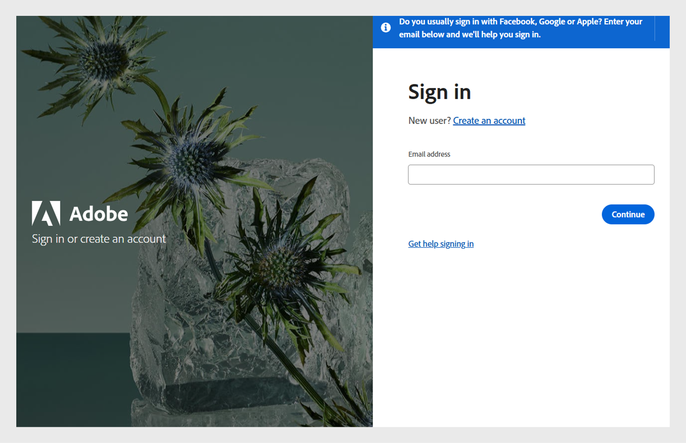

# Se connecter

Connectez-vous à Learning Manager en tant qu’élève.

Lorsque vous utilisez Adobe Learning Manager pour la première fois, les élèves doivent créer un compte. Vous pouvez le faire de deux manières :

* Auto-inscription : utilisez l’URL fournie dans l’e-mail de bienvenue pour créer votre compte.
* Compte créé par l’administrateur : un administrateur peut créer un compte en votre nom.

## Création d’un compte à l’aide de l’URL du courrier électronique de bienvenue

Suivez ces étapes pour créer votre compte à l’aide de l’URL indiquée dans l’e-mail de bienvenue :

1. Lancez Adobe Learning Manager à l’aide du lien sécurisé que vous avez reçu par courrier électronique de bienvenue envoyé par l’administrateur.

   L’écran Connexion s’affiche.

1. Sélectionnez Se connecter.

   

   *Se connecter avec un nom d&#39;utilisateur et un mot de passe*

1. Saisissez le Adobe ID, le mot de passe et cliquez sur Se connecter.

   Si vous avez oublié le mot de passe, cliquez sur Mot de passe oublié ? et indiquez l’adresse e-mail que vous avez utilisée pour créer Adobe ID.

   <!--
   If you do not have an Adobe ID, [click here](../../../manage-account.md) to learn how to create an Adobe ID.
   -->

1. Saisissez vos informations dans les champs Actifs pour compléter votre profil.

   
   _Saisissez vos informations dans les champs actifs pour terminer la configuration du profil_

1. Vous pouvez également utiliser le Enterprise ID en cliquant sur Se connecter avec un lien de Enterprise ID.

>[!NOTE]
>
>Une fois connecté pour la première fois, votre Adobe ID est associé à votre compte d’entreprise. Pour toutes les connexions suivantes, vous pouvez mettre en signet l’URL de votre compte (deuxième URL) que vous avez reçue dans le courrier électronique de bienvenue.
