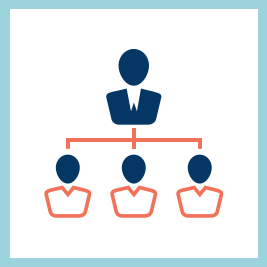

# Responsables

<table> 
 <tbody>
  <tr> 
   <td></td> 
   <td>
Lisez ce document pour découvrir les fonctionnalités de Learning Manager et les questions fréquentes associées au rôle de responsable. 
</td> 
  </tr> 
 </tbody>
</table>

## Forum aux questions (FAQ) {#frequentlyaskedquestionsfaq}

[Forum aux questions sur le rôle de Responsable](managers/frequently-asked-questions-for-managers.md)

## Fonctions {#features}

* [Prise en main](managers/feature-summary/learning-objects.md#main-pars_header)
* [Utilisateurs de tablettes iPad et Android](managers/feature-summary/ipad-android-tablet-users.md)
* [Rapports](managers/feature-summary/reports.md)
* [Paramètres](managers/feature-summary/settings.md)
* [Connexion utilisateur](managers/feature-summary/user-login.md)
* [Notifications utilisateur](managers/feature-summary/user-notifications.md) [&#128279;](managers/feature-summary/settings.md)
* [Objets d’apprentissage](managers/feature-summary/learning-objects.md)
