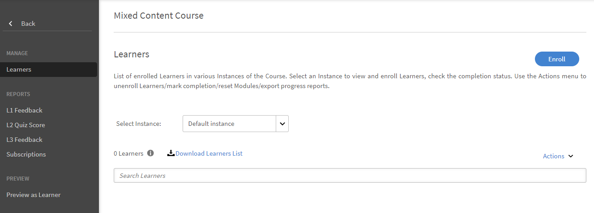
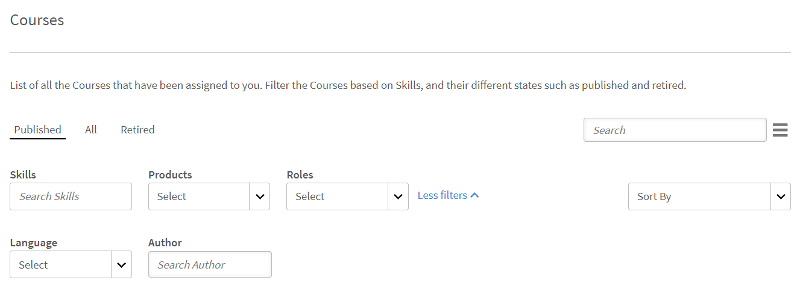

# Objets d’apprentissage

Ce document comprend des informations sur les objets d’apprentissage pour les responsables.

Un responsable peut inscrire les élèves qui lui sont subordonnés à des cours, des parcours d’apprentissage et des certifications. Pour plus d’informations sur l’inscription des élèves et les étapes à suivre, voir[&#x200B; Inscription des élèves.](../../administrators/feature-summary/courses.md#main-pars_header_1058138132)

## Cours {#courses}

## Affichage des cours {#viewingcourses}

En tant que responsable, vous pouvez afficher une liste de tous les cours disponibles. Cliquez sur **[!UICONTROL Cours]** dans le volet de gauche pour afficher la liste des cours avec les options de recherche et de filtre. Vous pouvez également afficher le pourcentage d’efficacité de cours pour chaque cours sur les vignettes de cours. Notez que vous pouvez inscrire uniquement des membres de l’équipe à des cours qui sont visibles sous l’application de l’élève.

*Afficher les cours*

>[!NOTE]
>
>La liste de tous les cours retirés peut être consultée en cliquant sur l&#39;onglet **Retiré**.

## Affichage des scores du quiz {#viewquizscores}

1. Cliquez sur le nom du cours dans la vignette du cours.
1. Cliquez sur Score du quiz dans le volet de gauche.

Vous pouvez afficher les scores du quiz de tout cours particulier selon le nom d’utilisateur ou en fonction de chaque question. Sélectionnez les onglets Par utilisateur ou Par question en conséquence. Vous pouvez uniquement consulter le score du quiz des membres de votre équipe.

Sélectionnez le type d’instance dans la liste déroulante pour afficher les scores en fonction de chaque instance du cours.

## Gérer la liste des élèves pour un cours {#managelearnerslistforacourse}

En tant que responsable, vous pouvez gérer la liste des élèves pour les membres de votre équipe.

1. Cliquez sur le nom du cours dans la vignette du cours.
1. Dans le volet de gauche, cliquez sur **[!UICONTROL Élèves]**.

*Sélectionner une action d&#39;élève*

>[!NOTE]
>
>L&#39;option **Exporter les approbations en attente** peut être exécutée à partir de l&#39;application de l&#39;élève.

Vous pouvez réaliser les actions suivantes depuis la page Élèves :

* Sélectionnez l’élève que vous voulez supprimer, puis cliquez sur Actions > Supprimer.
* Sélectionnez l’élève dont vous voulez noter l’assiduité, puis cliquez sur Actions > Remplir.

Pour permettre aux élèves de réinitialiser ou de refaire un module, cliquez sur Réinitialiser. Dans la boîte de dialogue contextuelle, cliquez sur Oui pour confirmer la réinitialisation. Les modules terminés ne peuvent pas être réinitialisés. Seuls les modules auxquels les élèves ont échoué ou qui sont incomplets peuvent être réinitialisés.

Vous pouvez également exporter la liste des élèves dans une feuille Excel. Pour exporter la liste des élèves, cliquez sur Actions > Exporter.

>[!NOTE]
>
>S&#39;il existe plusieurs instances d&#39;un cours, la liste des élèves dans Excel est fournie dans chaque onglet séparément. La liste des élèves est constituée du nom des stagiaires, de leur statut et des critères de sélection. Le statut des élèves peut être **Pas commencé**, **En cours** ou **Terminé**.

## Affichage des retours d’informations L1 et L3 {#viewl1andl3feedback}

Vous pouvez afficher le retour d’informations L1 fourni par les élèves au sujet d’un cours et le retour d’informations L3 fourni pour les membres de votre équipe.

1. Cliquez sur n’importe quelle vignette de cours dans la liste des cours.
1. Cliquez sur Retour d’informations L1 ou Retour d’informations L3 dans le volet de gauche afin de visualiser les retours d’informations reçus.
1. Sélectionnez l’instance dans la liste déroulante pour afficher le retour d’informations de cette instance particulière.

## Aperçu des cours {#previewcourses}

Le responsable peut prévisualiser les cours en cliquant sur l&#39;option **Aperçu en tant qu&#39;élève** lors de l&#39;affichage des modules de cours.

1. Cliquez sur **[!UICONTROL Cours]** dans le volet de gauche après vous être connecté.
1. Cliquez sur n’importe quelle vignette de cours dans la liste des cours de la page.
1. Cliquez sur Aperçu en tant qu’élève dans le volet de gauche et cliquez sur le nom du module dans la page pour prévisualiser le module de cours dans le lecteur.

## Efficacité des cours {#courseeffectiveness}

L’efficacité du cours est évaluée pour comprendre l’utilité d’un cours pour l’élève. Il s’agit d’une combinaison des résultats des retours d’informations de l’élève sur le contenu du cours, des résultats du quiz de cours pour un élève et du retour d’informations du responsable évaluant un élève en fonction des apprentissages du cours.

Vous pouvez afficher l’évaluation de l’efficacité des cours sur les vignettes de cours comme illustré dans l’instantané ci-dessous. Le score d’évaluation de ce cours est de 100.

<!---->

La valeur de l’évaluation de l’efficacité du cours est obtenue à partir des valeurs de retour d’informations L1, L2 et L3. Pour afficher la répartition de chaque retour d’informations, cliquez sur la valeur de l’efficacité des cours. Une fenêtre contextuelle s’affiche comme illustré ci-dessous.

*Afficher l&#39;efficacité du cours pour obtenir des commentaires*

Dans cet exemple, 1 sur 1 utilisateur a reçu les trois retours d’information, par conséquent le score est 100/100. Ce tableau vous permet de comprendre que si l’un des trois retours d’informations (L1, L2 et L3) n’est pas fourni pour un cours, il y a un impact négatif sur l’efficacité globale. Cliquez sur la flèche vers le bas dans l’angle inférieur droit de la fenêtre contextuelle pour voir comment les calculs d’efficacité de cours sont générés.

*Calcul de l&#39;efficacité du cours*

Selon le diagramme circulaire ci-dessus, le retour d’informations L3 de la part du responsable est davantage pondéré.

## Recherche de cours, parcours d’apprentissage et certifications {#searchingcourseslearningprogramsandcertifications}

Adobe Learning Manager vous permet de trouver rapidement les cours/parcours d’apprentissage de votre choix. Vous pouvez rechercher vos cours de deux manières :

1. À l’aide du champ Rechercher. Cliquez sur l’icône Rechercher affichée dans l’angle supérieur droit. Un champ de recherche s’affiche. Saisissez le nom du cours ou tout mot-clé associé à vos cours pour localiser vos cours/parcours d’apprentissage. Vous pouvez également effectuer une recherche à l’aide de balises prédéfinies telles que Captivate, C, Java et HTML. Les balises sont indexées dans le champ de recherche, ce qui signifie que les balises sont affichées dans le champ de recherche lors de la saisie. La recherche peut également être exécutée à l’aide de l’ID unique.
1. En filtrant la liste des cours/parcours d’apprentissage/certifications à l’aide des filtres. Vous pouvez filtrer les cours par état (Tous, Publié et Retiré).

Vous pouvez effectuer une recherche en fonction des compétences en sélectionnant **Compétences** et en les choisissant. En tant que responsable, vous pouvez trier les cours de quatre manières, afin de mieux localiser le cours requis. Cliquez sur Trier par et choisissez l’ordre croissant alphabétique, l’ordre décroissant alphabétique, la date de mise à jour du cours, la date de création du cours ou l’efficacité des cours :

* Nom (a-z)
* Nom (z-a)
* Date de mise à jour
* Date de création
* Efficacité du cours

*Filtrer les cours*

Vous pouvez trier les parcours d’apprentissage de trois manières : ordre croissant alphabétique, ordre décroissant alphabétique et en fonction de la date de mise à jour.

*Filtrer le parcours d’apprentissage*

## Inscription des élèves à des cours {#enrollinglearnersintocourses}

Le responsable inscrit certains élèves à des cours obligatoires en raison des exigences de l’organisation :

1. Placez le curseur de la souris sur les vignettes de cours publiées et cliquez sur Inscrire des élèves.

   Vous pouvez également cliquer sur une vignette de cours publié et cliquer sur Élèves dans le volet de gauche. Une page s’affiche avec une liste des élèves. Cliquez sur Inscrire.\
   La boîte de dialogue Inscrire des élèves s&#39;affiche.

1. Entrez le nom ou le profil des stagiaires pour les sélectionner et cliquez sur Enregistrer.

>[!NOTE]
>
>Vous ne pouvez inscrire que des élèves qui appartiennent à votre équipe.

## Parcours d’apprentissage {#learningprograms}

Le responsable peut inscrire, consulter les scores du quiz, le commentaire L1 et L3 et désinscrire uniquement ses journalistes.

## Ajouter des élèves à un parcours d’apprentissage {#addlearnerstoalearningprogram}

1. En mode Responsable, cliquez sur Parcours d’apprentissage dans le volet de gauche.
1. Sélectionnez le parcours d’apprentissage publié dans la liste des vignettes auxquelles vous souhaitez ajouter des élèves.
1. Cliquez sur Élèves dans le volet gauche sous la catégorie Rapports du programme. Remarque : le programme d’apprentissage doit d’abord être publié avant d’ajouter des élèves.
1. Cliquez sur le lien Inscrire dans la page.
1. Commencez à saisir le nom ou le profil des élèves et sélectionnez-les dans la liste déroulante des élèves. Cliquez sur Enregistrer.

## Affichage des scores du quiz {#Viewquizscores-1}

1. Cliquez sur n’importe quelle vignette de parcours d’apprentissage.
1. Cliquez sur Score du quiz dans le volet de gauche.

Vous pouvez afficher les scores du quiz de tout parcours d’apprentissage particulier en fonction du nom d’utilisateur ou de chaque question. Sélectionnez les onglets Par utilisateur ou Par question en conséquence. Les scores du quiz apparaissent pour un cours à la fois. Changez le nom du cours dans la liste déroulante pour afficher les scores du quiz pour d’autres cours. Vous pouvez également exporter les scores du quiz de chaque cours. Choisissez le type d’instance dans la liste déroulante pour afficher les scores en fonction de chaque instance du parcours d’apprentissage.

## Désinscription des stagiaires {#unenrollmentforlearners}

Le responsable peut désinscrire un élève si celui-ci n’a pas encore commencé le parcours d’apprentissage.

## Marquer comme terminé {#markcompletion}

Un responsable peut marquer un programme d’apprentissage comme terminé pour les élèves. Pour plus d’informations, consultez la section [Marquer comme terminé](../../administrators/feature-summary/learning-paths.md).

## Certifications {#certifications}

## Inscription des élèves à la certification {#enrolllearnerstothecertification}

Vous pouvez inscrire des élèves à la certification de deux manières. Suivez les étapes ci-dessous pour inscrire des élèves.

1. Cliquez sur Certifications dans le volet de gauche après vous être connecté en tant que responsable. Dans la liste d&#39;onglets Publié, passez la souris sur chaque certification et cliquez sur Inscrire des élèves. Vous pouvez également cliquer sur une vignette de certification publiée et cliquer sur Élèves dans le volet de gauche. Cliquez sur + S&#39;inscrire sur le côté droit de la page des élèves pour commencer à ajouter les élèves.
1. Vous pouvez afficher la boîte de dialogue contextuelle Inscrire des élèves après avoir cliqué sur l&#39;option Inscrire des élèves de chacune des deux étapes ci-dessus. Commencez à saisir le nom et le profil de l’élève, choisissez le nom de l’élève dans la liste déroulante, puis cliquez sur Enregistrer.

## Désinscription des stagiaires {#Unenrollmentforlearners-1}

Le responsable peut désinscrire un élève si celui-ci n’a pas encore commencé la certification.

## Marquer comme terminé {#Markcompletion-1}

Un responsable peut marquer une certification comme terminée. Pour plus d’informations, consultez la section [Marquer comme terminé](../../administrators/feature-summary/certifications.md#main-pars_header_303097138).

## Notifications du responsable pour l’approbation des cours de l’élève {#manager-notifications-course-approval}

Lorsque vous tentez d&#39;accepter ou de rejeter l&#39;inscription d&#39;un élève, un responsable peut désormais afficher les détails de la session (**vidéoconférence** ou **salle de classe**) dans la fenêtre contextuelle.

*Approuver ou rejeter la demande d’inscription d’un élève*

Les détails suivants de la session s’affichent :

* Nom de la session
* Nom du formateur
* Lieu
* Date et heure

Voici le workflow :

1. Le responsable reçoit une notification lorsqu’un élève demande l’approbation d’un cours.

1. Le responsable clique sur **Détails de la session**.

   

   *Afficher les tâches en attente*

1. Le responsable approuve ou rejette ensuite la demande.
1. Le responsable reçoit un message de confirmation ou d’erreur si l’approbation ou le rejet n’a pas eu lieu comme prévu.
1. L’élève reçoit une notification, une approbation ou un rejet de l’inscription au cours.

## Envoi facultatif pour les certifications externes {#optional}

Dans les versions précédentes de Learning Manager, pour qu’une certification externe soit terminée, un responsable devait accepter le fichier envoyé par un élève. Le responsable recevait une notification uniquement après l’envoi du fichier par l’élève.

Un responsable peut maintenant voir une liste des élèves inscrits à la certification externe sur une page d’envoi présente dans la certification externe et peut accepter ou rejeter à partir de la page elle-même sans attendre de notification.

Lorsque le responsable accepte sans attendre l’envoi du fichier, l’élève reçoit un nouveau message indiquant que le responsable a accepté et il n’a pas besoin d’envoyer le fichier. En cas de refus du responsable sans envoi du fichier, le responsable a la possibilité d’accepter à nouveau sans attendre le fichier.

Si l’élève envoie le fichier, le responsable peut afficher le fichier à partir de la page d’envoi et accepter ou rejeter en fonction du fichier envoyé.

*Accepter ou rejeter en fonction de l&#39;envoi du fichier*

Lorsque les cours sont définis comme obligatoires :

* La page de soumission répertorie les élèves uniquement une fois qu’ils ont terminé les cours.
* L’élève ne peut télécharger un fichier qu’après avoir terminé le cours.

## Assistances à la tâche {#jobaids}

Le manager peut gérer l’affectation des assistances à la tâche pour ses journalistes. Mais, en tant que responsable, vous pouvez uniquement afficher les assistances à la tâche publiées alors qu’un administrateur peut également afficher les assistances à la tâche révoquées.
