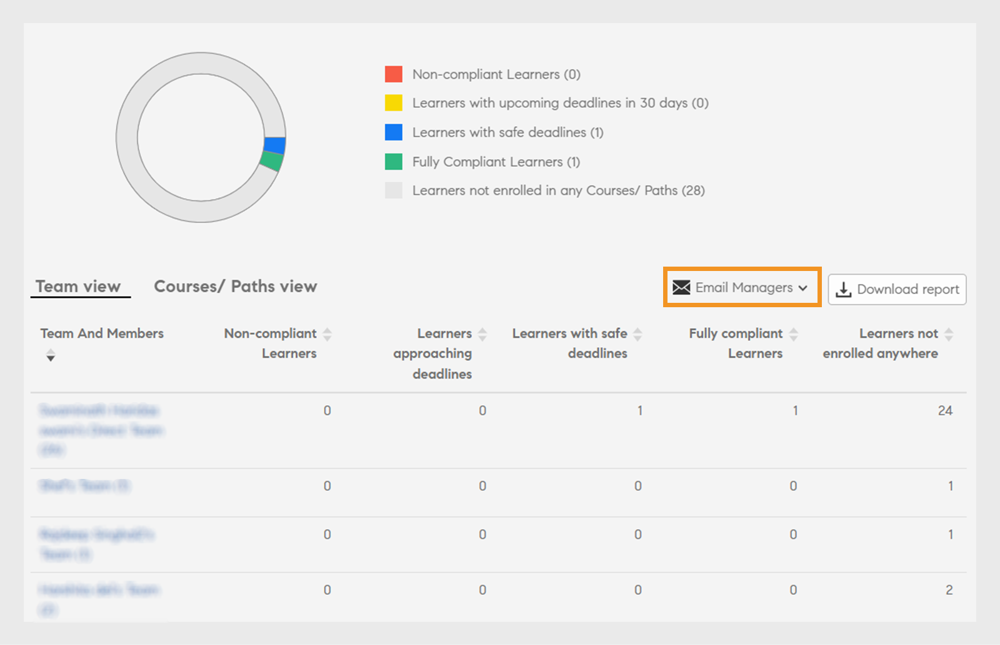

# Tableau de bord des responsables

Découvrez comment afficher et suivre des apprentissages dans le tableau de bord du responsable.

Les gestionnaires jouent un rôle important dans les initiatives d&#39;apprentissage d&#39;une équipe. Pour mieux les guider, la plateforme d’apprentissage fournit au responsable un tableau de bord permettant de suivre les apprentissages de son équipe.

*Rapport de tableau de bord pour un responsable*

Pour afficher les informations d’un graphique, cliquez dessus ou sur le lien hypertexte **[!UICONTROL Détails]**.

Les responsables peuvent également afficher le tableau de bord de l’équipe de leur responsable de niveau suivant. Par exemple, l’utilisateur A est le responsable de l’utilisateur B, l’utilisateur C, l’utilisateur D et l’utilisateur E. L’utilisateur B et l’utilisateur C sont les responsables de leurs équipes respectives. L’utilisateur A peut afficher les rapports de ses subordonnés directs (utilisateur B, utilisateur C, utilisateur D et utilisateur E) et des équipes gérées par les utilisateurs B et C.

## Résumé de l’apprentissage {#learningsummary}

Un responsable peut afficher le résumé des activités d’apprentissage de son équipe sur une période sélectionnée. Sélectionnez un mois, un trimestre ou une année dans le menu déroulant.

« Mois » et « Année » sont basés sur l’année civile, tandis que « Trimestre » est basé sur l’année financière configurée par l’administrateur dans les paramètres du compte.

*Afficher les activités d’apprentissage sur une période de temps*

## Vue Équipe {#teamview}

La vue Équipe affiche les équipes, leurs membres et leurs inscriptions respectives, leurs progressions et les achèvements pour des objets d’apprentissage.

*La vue Équipe affiche les équipes, leurs membres et leurs inscriptions respectives*

En cliquant sur les noms des équipes, par exemple Équipe de Venkatesh, vous pouvez afficher les membres de l’équipe de Venkatesh ainsi que le nombre total d’inscriptions, de progressions et d’achèvements pour un objet d’apprentissage.

*Sélectionner un membre de l’équipe*

Pour afficher le résumé de l’apprentissage de chaque membre de l’équipe, cliquez sur le numéro correspondant à chaque responsable d’équipe dans la colonne correspondante. Un forum s’ouvre et affiche la liste des objets d’apprentissage avec les informations Date d’inscription, Date d’échéance et Progression.

*Sélectionner un responsable d&#39;équipe*

De la même manière, vous pouvez afficher les objets d’apprentissage avec le nombre d’inscriptions, de progressions ou d’achèvements en cliquant sur les valeurs sous les colonnes correspondantes.

*Afficher les cours et le résumé d&#39;apprentissage*

En cliquant davantage sur le nombre d’inscriptions, de progressions ou d’achèvements pour chaque apprentissage, vous pouvez afficher les détails suivants : Personnes, date d’inscription/d’achèvement, date d’échéance et avancement.

*Afficher la date d’inscription/d’achèvement, la date d’échéance et la progression*

## Vue Apprentissages {#learningsview}

La vue Apprentissages affiche le nombre d’inscriptions, de progressions et d’achèvements pour un objet d’apprentissage.

Pour afficher les informations, y compris les personnes, les dates d’inscription, les dates d’échéance et les progrès des objets d’apprentissage respectifs, cliquez sur les valeurs correspondantes dans les colonnes d’inscriptions, de progressions et d’achèvements.

*Vue Apprentissages*

## Rapport d’exportation {#exportreport}

Pour générer un rapport Excel, sélectionnez **[!UICONTROL Actions] > [!UICONTROL Rapport]**

## État de conformité {#compliancestatus}

Dans le tableau de bord de conformité, les responsables peuvent afficher le statut de conformité global de l’équipe pour les apprentissages configurés dans des catégories spécifiques (par exemple, ventes, marketing et juridique). Les administrateurs peuvent créer un tableau de bord avec des cours de conformité, des parcours d’apprentissage ou des certifications et les partager avec les responsables. Les responsables peuvent afficher le tableau de bord partagé par l’administrateur dans leurs instances.

### Afficher le tableau de bord

Pour afficher le tableau de bord, sélectionnez **[!UICONTROL Tableau de bord de conformité]** dans l&#39;application du responsable.

_Application du gestionnaire de tableau de bord de conformité_

Le tableau de bord de conformité comprend les états de conformité suivants :

* **[!UICONTROL Élèves non conformes]** : affiche le nombre d&#39;élèves qui ont manqué les échéances.
* **[!UICONTROL Élèves approchant des échéances]** : affiche le nombre d&#39;élèves ayant des échéances en moins de 30 jours.
* **[!UICONTROL Élèves avec des échéances sécurisées]** : affiche le nombre d&#39;élèves avec des échéances plus éloignées (plus de 30 jours).
* **[!UICONTROL Élèves entièrement conformes]** : affiche le nombre d’élèves entièrement conformes.
* **[!UICONTROL Élèves non inscrits]** : affiche le nombre d&#39;élèves non inscrits à des cours, des parcours d&#39;apprentissage ou des certifications.

### Gestionnaires de courriers électroniques et élèves

**Gestion de plusieurs équipes**

Si vous gérez plusieurs équipes, vous pouvez informer vos responsables du statut d&#39;apprentissage des membres de leur équipe en sélectionnant l&#39;option **[!UICONTROL Gestionnaires de messagerie]** disponible dans la section **[!UICONTROL Vue de l&#39;équipe]**.

_Gestionnaires de courriers électroniques_

Les **[!UICONTROL gestionnaires de messagerie]** vous proposent les options suivantes :

* **[!UICONTROL Envoyer un courrier électronique aux responsables des élèves non conformes]** : avertissez les responsables dont les membres de l’équipe ont dépassé les échéances.
* **[!UICONTROL Envoyer un e-mail aux responsables des élèves dont les échéances approchent]** : avertissez les responsables dont les membres de l&#39;équipe ont des échéances à venir.

**Gestion d&#39;une seule équipe**

Si vous gérez une seule équipe, vous pouvez informer vos élèves de leur statut d&#39;apprentissage en sélectionnant l&#39;option **[!UICONTROL Envoyer un courrier électronique aux élèves]** disponible dans la section **[!UICONTROL Vue de l&#39;équipe]**.

_Envoyer un e-mail aux élèves_

L&#39;option **[!UICONTROL Envoyer un courrier électronique aux élèves]** vous offre les options suivantes :

* **[!UICONTROL Envoyer un e-mail aux élèves non conformes]** : avertissez les élèves qui n’ont pas respecté les échéances.
* **[!UICONTROL Envoyer un e-mail aux élèves dont l&#39;échéance approche]** : avertissez les élèves qui ont des échéances à venir.

### Télécharger le rapport

Pour télécharger le rapport, procédez comme suit :

1. Dans l&#39;application du responsable, accédez au **[!UICONTROL Tableau de bord de conformité]** > **[!UICONTROL Vue de l&#39;équipe]**.
1. Sélectionnez **[!UICONTROL Télécharger le rapport]** pour enregistrer votre tableau de bord en tant que rapport.
Cela vous permet de suivre la progression globale de l’apprentissage de votre équipe.

_Télécharger les rapports_

<!--On this dashboard, managers can also view the learners who are compliant, in a safe deadline, approaching deadline, and non-compliant for a selected learning object. 

Learning Objects with completion deadlines can be configured in compliance dashboard for tracking. 

**Compliant**: Displays the number of learners who have completed the learning object within completion deadline.

**Safe deadline**: Displays the number of learners who have less than 30 days available to complete a learning object.

**Upcoming Deadline**: Displays the number of learners with more than 30 days available to complete a learning object.

**Non-compliant**: Displays the number of learners who did not complete the learning object within the completion deadline.

*View compliance dashboard*

## Team View {#TeamView-1}

Displays the compliance status of a course for respective teams. Compliant, Safe Deadline, Upcoming Deadline, and Non-Compliant are columns in the Team View table.

*compliance status of a course for respective teams*

To display names of the members in a team and the individual number of courses for which their status is Compliant, in Safe Deadline, reaching Upcoming Deadline, and Non Compliant, click the corresponding values in the table.

*Select individual teams*

On further clicking the values in the compliant, safe deadline, upcoming deadline, and non-compliant column, the corresponding course details are displayed: Learning object name, enrollment/ completion date, due date, and progress in percentage.

 

*View progress of courses*

## Learnings View {#LearningsView-1}

In the Compliance Status Learnings View, the list of Learning Objects and the corresponding number of team members that are Compliant, within a Safe Deadline, have an Upcoming Deadline, or are Non Compliant is displayed.

*View deadline and compliance status*

On further clicking the values in the compliant, safe deadline, upcoming deadline, and non compliant columns, the following data is displayed: People, Enrollment Date, Completion date, and Progress.

*View details of compliance*

## Export data & send emails {#exportdataampsendemails}

* To export the compliance status for team and learnings view, click **[!UICONTROL Actions]** > **[!UICONTROL Export]**.

* To send an email to team members, click **[!UICONTROL Actions]** > **[!UICONTROL Send Email]**.

*Export and email data*-->

## Compétences d’équipe {#teamskills}

Les responsables peuvent afficher le graphique d’achèvement des compétences et configurer une prévision d’achèvement des compétences à différents niveaux. La liste déroulante des compétences comprend cinq compétences. Le responsable apprend à connaître l&#39;expertise acquise par les membres de l&#39;équipe et identifie les talents forts dans certaines compétences.

Les responsables peuvent également développer certaines compétences au sein d’une équipe en fixant un objectif et en prévoyant le temps qu’il faudrait pour atteindre une compétence pour un pourcentage spécifique d’une équipe dans un délai donné.

Cette prévision est basée sur des calculs système qui donnent une idée de l’évolution de cette compétence spécifique.

*Afficher les prévisions de compétences*

Pour afficher l’état des compétences d’une équipe, procédez comme suit :

1. Cliquez sur **[!UICONTROL Compétences d&#39;équipe]** dans le volet de gauche sous la section Mon affichage d&#39;équipe.
1. Pour afficher les compétences, cliquez sur le filtre de compétences et sélectionnez-en une dans la liste déroulante.
1. Pour sélectionner un niveau (niveau 1, niveau 2 ou niveau 3), cliquez sur le menu déroulant du niveau.
1. En fonction de la compétence et du niveau sélectionnés, un graphique avec le statut de compétence est affiché. En plaçant le curseur sur le graphique, les pourcentages du statut de compétence suivants s’affichent : **En cours** et **Obtenues**.

   

   *Afficher le pourcentage d&#39;état des compétences*

## Comment prévoir le % d’achèvement de l’équipe pour une compétence {#howtoforecasttheteamcompletionforaskill}

Pour prévoir le % d’achèvement de l’équipe par rapport à une compétence, suivez les étapes ci-dessous :

1. Pour afficher le suivi de configuration, cliquez sur le lien hypertexte de configuration.

   

   *Sélectionnez le lien hypertexte Configurer*

1. Dans la boîte de dialogue de configuration, pour la compétence que vous souhaitez configurer, entrez une valeur de pourcentage dans le champ **Accomplissement cible %** et la date à laquelle vous souhaitez atteindre l&#39;achèvement cible % dans le champ **Date cible**.**&#x200B;**

   

   *Entrez le pourcentage d&#39;achèvement cible*

1. Pour afficher les résultats de vos prévisions, cliquez sur le bouton **Estimation**. La sortie ressemble à la capture d’écran ci-dessous.

   

   *Afficher la sortie du suivi des compétences*

## Prévision d’achèvement du niveau de compétence {#skilllevelcompletionforecast}

Le responsable d’une équipe peut afficher et configurer le pourcentage d’achèvement d’une compétence d’une équipe pour une période donnée, en fonction du pourcentage d’achèvement cible et de la date indiqués dans le suivi des compétences.

Dans le graphique de prévision, il existe deux types de lignes (lignes continues et pointillées) avec trois sommets chacune.

Sur la ligne continue, le premier point affiche la date de la première inscription pour un niveau de compétence.

*Afficher la première inscription pour un niveau de compétence*

Le deuxième point indique la date actuelle et le pourcentage d’achèvement de l’équipe de la compétence.

*Afficher la date actuelle et le % d’achèvement d’équipe de la compétence*

Le troisième point de la ligne indique le % d’accomplissement prévu et la date d’achèvement cible.

*Afficher le % d&#39;achèvement cible attendu et la date d&#39;achèvement cible*

## Ligne de prévision {#forecastline}

La ligne en pointillé est la ligne de prévision qui affiche la prévision en fonction du pourcentage d’achèvement de l’équipe en cours pour une compétence au cours d’une période donnée.

Le premier point sur la ligne pointillée représente le % d’achèvement de l’équipe et le % d’achèvement estimé par l’équipe pour une compétence à cette date.

*Afficher le % d’achèvement d’équipe et le % d’achèvement d’équipe prévu pour une compétence*

Le deuxième point affiche la date à laquelle le % d’achèvement estimé par l’équipe a été atteint pour une compétence.

*Afficher la date à laquelle le pourcentage d&#39;achèvement d&#39;équipe prévu a été atteint pour une compétence*

Le troisième point de la ligne de prévision affiche le pourcentage d’achèvement de l’équipe atteint à la date cible indiquée dans le suivi des compétences.

*Afficher le % d’achèvement d’équipe atteint à la date cible fournie dans le suivi des compétences*

Sous le graphique, un tableau s’affiche avec la vue de l’équipe et le nombre de compétences inscrites, acquises et en cours. Si un apprentissage a une date d’achèvement, la date d’achèvement prévue est également affichée.

*Tableau avec la vue de l’équipe et le nombre de compétences qui ont été inscrites, acquises et en cours*

En cliquant sur le nom de l’équipe, la liste des membres inscrits à la compétence, son statut et sa date d’achèvement s’affichent.

*Afficher la liste des membres*

En cliquant sur l’équipe, vous pouvez afficher les membres qui la composent et les détails correspondants pour la compétence sélectionnée, comme s’il était inscrit, le statut (en cours ou atteint) et la date d’achèvement si elle est définie.

*Afficher les compétences des membres*

Lors de la sélection des valeurs pour une équipe dans les colonnes Inscription, Acquise et En cours, vous pouvez afficher le nombre d’utilisateurs inscrits à la compétence. Vous pouvez également afficher la date à laquelle l’utilisateur s’est inscrit à la compétence, le statut et la date d’achèvement si la compétence a été acquise par l’utilisateur.

<!-- -->

## Rapport d’exportation {#Exportreport-1}

* Cliquez sur **[!UICONTROL Actions]** > **[!UICONTROL Exporter]** pour exporter les données sous forme de fichier Excel.

*Exporter les données*
