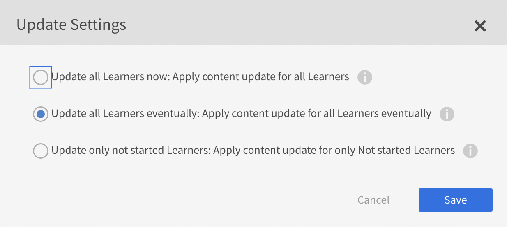

# Notes de mise à jour de Adobe Learning Manager

<!--<table>
 <tbody>
  <tr>
   <td></td>
   <td>
    
<a href="https://business.adobe.com/products/learning-manager/adobe-learning-manager.html">Adobe Learning Manager</a> was launched in August 2015. As part of our continuous improvement efforts to enhance the product, we have been rolling out regular updates. Read on to know the features enhanced/issues fixed in update releases. 
</td>
  </tr>
 </tbody>
</table>-->

+++Mise à jour 101 : version de juillet 2025 de Adobe Learning Manager

## Modèles de courrier électronique basés sur des rôles

### Audience

Administrateurs et auteurs gérant les modèles de courrier électronique

### Vue d’ensemble

Vous (administrateur ou auteur) pouvez activer ou désactiver les modèles de courrier électronique en fonction du rôle, de l’élève, du responsable ou de l’instructeur du destinataire. Cela vous donne plus de contrôle sur le type et la fréquence de communication avec vos élèves.

### Cas d’utilisation

* Les administrateurs et les auteurs doivent envoyer des courriers électroniques aux élèves sans en avertir les responsables (par exemple, les inscriptions d&#39;élèves).
* Option permettant d’activer ou de désactiver en bloc les e-mails pour un rôle spécifique (par exemple, de désactiver tous les e-mails aux responsables).

### Workflow existant

Si l’intention est d’envoyer des courriers électroniques aux élèves mais pas aux responsables (par exemple, l’inscription au cours), le modèle actuel envoie des courriers électroniques à tous les rôles.

### Nouveautés

* Basé sur les rôles, bascule sur l’interface utilisateur des modèles de courrier électronique.
* Activation/désactivation en bloc pour un rôle spécifique.
* Visibilité des rôles par modèle.

Reportez-vous à cet [article](/help/migrated/administrators/feature-summary/email-templates.md#enable-or-disable-email-at-a-role-level) pour plus d&#39;informations.

## Contrôle de version du contenu amélioré pour les élèves qui ont terminé un cours

### Vue d’ensemble

Lorsque le module de contenu d&#39;un cours terminé était mis à jour vers une version plus récente, les élèves qui avaient déjà terminé le cours recevaient toujours la version mise à jour du module en arrière-plan. Cela a provoqué un comportement inattendu lorsqu&#39;ils ont tenté de revoir le cours, car le contenu mis à jour ne leur était pas destiné.

### Comportement existant

Lorsque les auteurs ont mis à jour le contenu du cours vers une nouvelle version et ont choisi de l&#39;appliquer uniquement aux élèves qui n&#39;avaient pas encore commencé le cours, Adobe Learning Manager a tout de même mis à jour la version du module pour les élèves qui l&#39;avaient déjà terminé. Par conséquent, ces élèves n’ont pas pu accéder au contenu d’origine comme prévu.

Cette amélioration garantit que lorsqu&#39;un module de cours est mis à jour et défini pour s&#39;appliquer uniquement aux élèves qui n&#39;ont pas encore commencé, les élèves qui ont déjà terminé le cours conservent un accès ininterrompu à la version originale.

### Quels sont les changements apportés 

Adobe Learning Manager offre désormais aux auteurs des options plus claires pour gérer les mises à jour de contenu. Les auteurs peuvent mettre à jour le contenu déjà disponible dans un cours. Lorsqu’une nouvelle version est ajoutée, le numéro de version apparaît en regard du contenu.

Lorsqu&#39;un administrateur consulte un cours dont le contenu est mis à jour, un bouton Mettre à jour apparaît en regard de la nouvelle version. Les administrateurs verront également des options de mise à jour claires pour choisir comment la nouvelle version du contenu est appliquée aux élèves.

| État de l’élève | Mettre à jour maintenant | Mettre à jour éventuellement | Mise à jour non commencée |
|---|---|---|---|
| Non inscrit | V2 | V2 | V2 |
| Pas encore commencé | V2 | V2 | V2 |
| En cours | V2 * | V1 → V2 * | V1 |
| Terminé | V2 * | V2 * | V1 (conservé) |

(*) Indique que le module sera réinitialisé lorsque la version sera mise à jour.

Avec Mise à jour non commencée, les élèves qui ont déjà terminé le cours continuent de voir la version de contenu d’origine (V1). Cela évite les problèmes de lecture inattendus et garantit une expérience cohérente pour les élèves qui consultent les cours terminés.

### Options de mise à jour du contenu

Lorsqu&#39;un administrateur clique sur **[!UICONTROL Mettre à jour]**, il peut choisir parmi les options suivantes :

* **[!UICONTROL Mettre à jour tous les élèves maintenant]** : appliquez immédiatement la mise à jour du contenu pour tous les élèves. Les élèves n&#39;ont pas commencé, sont en cours et terminés passent immédiatement à la nouvelle version.
* **[!UICONTROL Mettre à jour tous les élèves par la suite]** : appliquez la mise à jour à tous les élèves par phases. Les élèves non commencés et terminés reçoivent la nouvelle version maintenant. Les élèves en cours reçoivent la mise à jour une fois qu’ils ont terminé la version actuelle.
* **[!UICONTROL La mise à jour n&#39;a pas encore commencé pour les élèves]** : appliquez la mise à jour uniquement aux élèves qui n&#39;ont pas encore commencé le cours. Les élèves en cours et terminés restent sur la version d&#39;origine.

### Modifications de l&#39;interface utilisateur

| Ancien libellé | Nouvelle option |
|---|---|
| Appliquer la mise à jour du contenu à tous les élèves | Mettre à jour tous les élèves maintenant : appliquer la mise à jour du contenu pour tous les élèves |
| Appliquer la mise à jour aux élèves qui n’ont pas encore commencé | Mettre à jour uniquement les élèves non démarrés : appliquer la mise à jour du contenu uniquement aux élèves non démarrés |
| Les élèves en cours reçoivent une mise à jour une fois l’opération terminée | Mettre à jour tous les élèves ultérieurement : appliquer la mise à jour du contenu pour tous les élèves ultérieurement |

<!--
_Content update options_-->

Reportez-vous à cet [article](/help/migrated/authors/feature-summary/content-library.md#content-version-control-for-learners-who-have-completed-a-course) pour plus d&#39;informations sur la bibliothèque de contenu.

## Améliorations dans le lecteur Fluidic

Cette version apporte un lecteur Fluidic actualisé à Adobe Learning Manager avec un aspect moderne et une expérience d’apprentissage plus intuitive. Le lecteur mis à jour comprend une interface plus propre, des commandes de navigation améliorées et une conception cohérente sur les ordinateurs de bureau et les appareils mobiles. Les élèves peuvent facilement accéder au contenu et interagir avec celui-ci dans n’importe quel mode d’écran, y compris les vues Portrait, Paysage, Plein écran ou Standard.

* **Habillage du lecteur Fluidic actualisé** : un look modernisé avec des éléments d’interface utilisateur mis à jour.
* **Commandes de navigation améliorées** : navigation plus fluide et plus intuitive pour une meilleure expérience d&#39;apprentissage.
* **Conception optimisée** : l’apparence et la convivialité améliorées sur les ordinateurs de bureau et les appareils mobiles prennent en charge les modes Portrait, Paysage, Plein écran et Écran standard.

Tous les élèves qui accèdent au contenu via Adobe Learning Manager, qu’ils utilisent l’expérience native ou sans en-tête, verront automatiquement ces nouvelles améliorations de l’interface utilisateur et de la navigation. Les élèves peuvent remarquer un léger changement dans leur façon d&#39;interagir avec le lecteur en raison de la mise en page et des commandes mises à jour.

>[!NOTE]
>
>Cette amélioration est disponible uniquement pour le contenu statique.

Reportez-vous à cet [article](/help/migrated/learners/feature-summary/fluidic-player.md) pour plus d&#39;informations sur le lecteur Fluidic.

## Bogue corrigé dans cette version

* Correction d’un problème en raison duquel les élèves qui avaient terminé un cours voyaient un écran blanc lors de la consultation de celui-ci après la mise à jour du module de contenu vers une nouvelle version.

En outre, pour plus de détails sur les modifications à venir de Adobe Learning Manager, consultez cet [article](https://experienceleague.adobe.com/en/docs/learning-manager/using/introduction/upcoming-changes-in-adobe-learning-manager).

+++

+++Mise à jour 100 : version de mai 2025 de Adobe Learning Manager

**Date de publication** : 10 mai 2025

## Nouveautés de cette version

Pour plus d’informations, consultez [Nouveautés d’Adobe Learning Manager](/help/migrated/whats-new.md).
+++

+++Mise à jour 99 : version de février 2025 de Adobe Learning Manager

## Configuration de la langue de l’interface via SAML

Adobe Learning Manager (ALM) accepte désormais un attribut SAML pour la langue. Cet attribut est ensuite associé aux paramètres de l’interface utilisateur et de la langue du contenu, ce qui garantit une interaction fluide avec le système de gestion de l’apprentissage dans la langue préférée. La configuration de ces paramètres linguistiques est gérée via la plateforme de gestion des identités et des accès (IAM), à l’aide de SAML pour l’authentification unique (SSO). Cela prend en charge les connexions initiées par le fournisseur de services (SP) et le fournisseur d’identité (IdP), ce qui permet aux utilisateurs de voir l’interface et le contenu dans la langue de leur choix.

Reportez-vous à cet [article](/help/migrated/administrators/feature-summary/set-up-interface-language-through-saml.md) pour plus d&#39;informations.

## Amélioration des API de migration

Auparavant, les modules d&#39;activité avec des liens externes migrés à l&#39;aide des API (`GET /bulkimport/cansync` et `POST /bulkimport/startrun`) n&#39;affichaient pas l&#39;option **[!UICONTROL Marquer comme terminé]** pour les élèves après avoir accédé au lien. Ce problème a été résolu. Désormais, les modules d&#39;activité avec des liens externes migrés via des API affichent correctement l&#39;option **[!UICONTROL Marquer comme terminé]** pour les élèves.

## Fonctionnalité de tri dans l’application de l’élève

La fonction de tri de l’application de l’élève fournit des recommandations de cours personnalisées en fonction du contenu et de la langue de l’interface. &#x200B; Cette amélioration simplifie le processus permettant aux élèves de trouver des cours dans leur langue préférée et d&#39;utiliser des options de tri plus intelligentes.

Reportez-vous à cet [article](/help/migrated/learners/feature-summary/catalogs.md#sorting-functionality-in-the-learner-app) pour plus d&#39;informations.

+++

+++Mise à jour 98 : version de novembre 2024 de Adobe Learning Manager

**Date de publication** : 16 novembre 2024

## Nouveautés de cette version

Pour plus d’informations, consultez [Nouveautés d’Adobe Learning Manager](/help/migrated/whats-new-nov-24.md).
+++

+++Mise à jour 97 : version de juillet 2024 de Adobe Learning Manager

**Date de publication :** 13 juillet 2024

## Nouveautés de cette version

Pour plus d’informations, consultez [Nouveautés d’Adobe Learning Manager](/help/migrated/whats-new-july-2024.md).
+++

+++Mise à jour 96 : version de mars 2024 de Adobe Learning Manager

**Date de publication :** 7 mars 2023

## Nouveautés de cette version

Pour plus d’informations, consultez [Nouveautés d’Adobe Learning Manager](/help/migrated/whats-new-march-2024.md).
+++

+++Mise à jour 95 : version de novembre 2023 de Adobe Learning Manager

**Date de publication :** 18 novembre 2023

## Nouveautés de cette version

Pour plus d’informations, consultez [Nouveautés d’Adobe Learning Manager](/help/migrated/whats-new-november-2023.md).
+++

+++Mise à jour 94

**Date de publication : jeudi 23 août 2023**

## Nouveautés de cette mise à jour

* Sélectionner l’icône d’engrenage du lecteur pour modifier la qualité de la vidéo.
* Modifier la qualité et la vitesse d’une vidéo sur les réseaux sociaux.
+++

+++Mise à jour 93 : version de juillet 2023 de Adobe Learning Manager

**Date de publication :** 10 juillet 2023

Nouveautés de cette version

### Amélioration des recommandations

Adobe Learning Manager a introduit un nouveau système revisité de recommandations de cours. Cette fonctionnalité de recommandations utilise des algorithmes d’IA et les intérêts des utilisateurs tels que les produits, les rôles et les niveaux pour fournir des recommandations de contenu personnalisées.

### Inscription multiple

Dans cette version d’Adobe Learning Manager, nous introduisons l’inscription multiple pour les élèves afin de leur permettre de s’inscrire à plusieurs instances d’un cours à une ou plusieurs périodes.

### Dépréciation Du Connecteur Exavault

Cette version d’Adobe Learning Manager inclut un nouveau connecteur, qui utilise le protocole SFTP de la famille AWS Transfer.

Pour plus d&#39;informations, voir [Nouveautés de la version de juillet 2023 de Adobe Learning Manager](/help/migrated/whats-new-2023-july.md).
+++

+++Mise à jour : 92

**Date de publication : 23 juin 2023**

**Problèmes résolus dans cette mise à jour**

* Après avoir terminé un module, l’API Grade n’est pas déclenchée automatiquement, ce qui entraîne l’affichage de la coche verte de l’interface utilisateur de manière inattendue.
* Lorsque quelques modules d’un parcours d’apprentissage ou d’une certification sont terminés, la coche verte indiquant la réussite ne s’affiche pas comme prévu.
* Adobe Learning Manager ne se lance pas comme prévu après le chargement d’un fichier CSV utilisateur comprenant des champs incorrects.
* La fenêtre contextuelle d’avertissement indiquant comment contacter l’administrateur affiche également d’autres adresses e-mail.
* Tous les badges gagnés par un élève ne s’affichent pas dans la réponse.
* Lors de l’inscription de l’utilisateur, un nom d’utilisateur comprenant &quot; &quot; doit être accepté.

#### Lecteur

* Ajout d’un menu pour sélectionner la résolution d’écran lors de la lecture d’une vidéo.
+++

+++Mise à jour 91

**Date de publication : vendredi 1 juin 2023**

### Connecteurs

* Le connecteur Adobe Connect exige que des API envoient des jetons CSRF. Pour plus d’informations, voir Amélioration de la sécurité du compte Adobe Connect.

### Modification de la chaîne

* Nous avons renommé la chaîne Évaluer cette formation pour Évaluer ce cours, Évaluer ce parcours d’apprentissage ou Évaluer cette certification, en fonction de la formation suivie par un élève. Selon le type de formation, un élève voit la chaîne en conséquence.

### Bogues corrigés dans cette mise à jour

* La description de l’application mobile Adobe Learning Manager de Play Store indique à tort qu’un élève peut suivre un cours hors ligne.
* Des problèmes sont survenus lors de la migration du contenu (module_version.csv et course_module.csv) de LinkedIn vers Adobe Learning Manager.
* Si un compte est inactif et créé il y a plus de trois ans, tous les utilisateurs du compte sont supprimés conformément au RGPD, quel que soit leur statut.
* Dans l’application Instructeur, lorsque vous définissez la limite de la liste d’attente sur zéro dans une session et que vous enregistrez la session, l’interface utilisateur affiche l’information erronée « Non applicable » au lieu de zéro.
* Lors de la génération des relevés de notes des élèves pour le connecteur Power BI, la colonne Durée (en minutes) de la formation ou du module affiche des valeurs nulles pour certains modules de classe ou de classe virtuelle (VC).
* Une fois qu’un cours est marqué comme terminé pour les élèves d’une ou de plusieurs instances, tous les élèves du cours sont marqués avec l’état « Terminé », et pas seulement les élèves de l’instance ou des instances actuelles.
+++

+++Mise à jour 90

**Date de publication :** 4 avril 2023

### Bogues Corrigés Dans Cette Mise À Jour

La connexion SAML échoue si l’URL de connexion SSO contient entity_id.
+++

+++Mise à jour 89 : version de mars 2023 de Adobe Learning Manager

**Date de publication :** 4 avril 2023

### Nouveautés de cette mise à jour

**Améliorations apportées à l’expérience de formation avec instructeur**

Plusieurs améliorations ont été apportées à l’expérience de formation dirigée par un instructeur (ILT). Les principales améliorations incluent : la possibilité de filtrer les sessions de classe en fonction de l’emplacement, la possibilité de changer d’instance (VILT) sans perdre la progression, un nouvel « Assistant de planification » pour la gestion des conflits dans la réservation des instructeurs et des salles de classe, la possibilité d’associer des « compétences » aux instructeurs et de choisir des instructeurs en fonction des compétences.

**Améliorations apportées à la liste de contrôle de l&#39;observation** :

Les auteurs peuvent désormais sélectionner « Manager » et « Store Manager » en tant qu’observateur pour les listes de contrôle. Les responsables peuvent afficher et compléter les listes de contrôle dans l&#39;interface du responsable sans avoir à basculer vers un rôle d’instructeur. Une notification est envoyée à un responsable lorsqu&#39;une liste de contrôle lui est attribuée.

**Utiliser n’importe quel appareil photo d’application/de smartphone pour numériser les codes QR de Learning Manager**

Les élèves pourront désormais utiliser n&#39;importe quelle application de numérisation de codes QR ou l&#39;appareil photo de leur smartphone pour numériser les codes QR générés par Learning Manager afin d&#39;inscrire, d&#39;achever et plus encore les cours.

**Améliorations des rapports**

Un nouveau rapport Utilisation de l’instructeur, un rapport Revue des formations, un rapport Assistances à la tâche et d’autres améliorations apportées aux rapports.

**Prise en charge des sessions « hybrides »**

Adobe Learning Manager prend désormais en charge la création de sessions de formation « hybrides » avec instructeur (ILT). Des sessions ILT virtuelles peuvent être créées avec des informations d’emplacement facultatives afin que les élèves puissent également assister à la session en personne si elles sont présentes sur place.

**Meilleur suivi de l’avancement pour la salle de classe et l’ILT virtuelle**

Les modules de salle de classe et d’ILT virtuel permettent désormais de signaler l’état du quiz d’un élève (réussite ou échec) ainsi que l’état de présence. Par conséquent, la participation et la réussite du quiz peuvent être prises en compte pour évaluer les progrès de l&#39;élève.

**Application Adobe Learning Manager pour Microsoft Teams**

La nouvelle application Adobe Learning Manager sur Microsofts Teams est conçue pour favoriser l’apprentissage dans le flux de travail et stimuler l’apprentissage social. Les élèves pourront accéder au contenu d&#39;apprentissage depuis la plateforme Microsofts Teams sans avoir à passer par un navigateur. Pour obtenir la version bêta de l’application Adobe Learning Manager sur MS Teams, contactez votre CSAM.

### Bogues corrigés dans cette mise à jour

**Cours**

* Un auteur personnalisé ne peut pas prévisualiser un module lorsque le cours est à l’état « UNDER_CONSTRUCTION ». La réponse indique Erreur 404.
* Le titre du cours sur la page de cours/d’ajout d’une application d’auteur déborde lorsque le titre du cours dépasse une certaine limite de caractères.

**Auteur**

* Dans l&#39;application d&#39;auteur, le titre du cours (s&#39;il est long) dépasse les limites de la page lors de la création d&#39;un cours.
* Parfois, un cours est ajouté, même si aucun auteur n’est sélectionné.

**Rapports de tableau de bord**

* Les info-bulles s’affichent correctement lorsque la langue de l’interface est l’anglais, mais renvoient une erreur de console lorsque la langue de l’interface est différente.
* Renommez « Obligatoire » en « Obligatoire » dans le tableau de bord des élèves.

**Application d&#39;instructeur**

* Le format horaire dans l’application de l’instructeur n’est pas cohérent avec les autres applications.

**Social**

* Pour certains types de publications, après la publication, le forum social ne s’ouvre pas comme prévu.

**Administrateur**

* Un utilisateur doté d&#39;un rôle personnalisé ne peut pas télécharger de ressources lors de la prévisualisation d&#39;un cours.

**Modèles de courriers électroniques**

* Lorsqu&#39;un élève se désinscrit d&#39;un programme d&#39;apprentissage contenant un cours en salle de classe/classe virtuelle, il ne reçoit aucun e-mail d&#39;annulation.

**Assistances à la tâche**

* Vous ne pouvez pas voir le nom du cours dans le widget Assistance à la tâche.

**Publication**

* La description du module ajoutée dans Adobe Captivate n’est pas visible dans Learning Manager lorsque le module est publié dans ALM.

**Champs actifs**

* Lorsqu’un fichier CSV contenant un grand nombre d’enregistrements est en cours de traitement, cela prend un temps considérable, au cours duquel, si un utilisateur se connecte et saisit une valeur pour l’un des attributs, il peut créer un nouveau groupe d’utilisateurs qui peut entraîner des erreurs CSV. Pour résoudre ce problème, lorsque l’importation CSV est en cours, le message contextuel de l’attribut Champs actifs est désactivé et réactivé une fois le chargement CSV terminé.
* Si la colonne dans le fichier CSV des utilisateurs porte le même nom que le champ actif des utilisateurs externes, le chargement du fichier CSV échoue.

**Correctifs liés à l’API**

* Dans la réponse learningObjects, l’attribut signet est manquant.
* Une entrée d’accès est créée lors de la génération de jetons d’actualisation oauth pour les utilisateurs supprimés.
* L’API LO renvoie un loFormat incorrect, car les modules préparatoires ont été pris en compte pour calculer le type de cours ainsi que le contenu de base.

**Problèmes connus dans cette mise à jour**

* Le bouton Partager du catalogue des élèves ne fonctionne pas comme prévu dans le navigateur Safari, l’application Mobile et iPad MS Teams.
* Les notifications ne s’affichent pas dans l’onglet Activité une fois que l’application est supprimée sur d’autres ordinateurs.
Rien ne se passe lorsque vous cliquez sur les notifications dans l’onglet Activité de l’application sur un iPhone 14.
* Dans l’application MS Teams, les notifications Learning Manager (terminé, inscrit, échéance et retard) n’affichent ni l’état ni le nom du cours dans l’onglet Activité.
* Une fenêtre contextuelle avec du contenu XML s’affiche lorsque l’administrateur d’intégration n’approuve pas l’application MS Teams.
* Parfois, la langue de l’interface utilisateur dans l’application Adobe Learning Manager sur MS Teams ne change pas comme prévu lors du changement de la langue.
* Vous ne pouvez pas interagir avec la première notification lorsque le focus se trouve dans l’Iframe (onglets Accueil et Catalogue).

**Limitations de l’application mobile Adobe Learning Manager**

* Affichage du contenu hors ligne.
* Mode grille/liste sur la page Catalogue/Mon apprentissage.
* Tentatives multiples de suivre un cours.
* Date limite d’inscription sur une carte de cours.
* Sur les appareils iOS, les notifications push n’apparaissent pas lorsque l’application est au premier plan.
* Les liens profonds dans les notifications Push ne redirigent pas vers la page de destination prévue.
* Cliquez sur le bouton Enregistrer l’intérêt pour être redirigé vers Internet.
* Lorsque vous répondez ou commentez dans Apprentissage par les réseaux sociaux, vous ne pourrez pas joindre un fichier.
* Vous ne pourrez pas vous connecter à LinkedIn Learning.
+++

+++Mise à jour 88

**Date de publication :** 7 mars 2023

### Amélioration Des Performances Dans Cette Version

Lorsqu&#39;une inscription en bloc d&#39;élèves est effectuée, aucun fichier journal n&#39;est généré pour chaque élève.
Nous avons optimisé le traitement des plans d’apprentissage pour les comptes volumineux. Cela permet d’éviter tout problème ou retard de recherche.
+++

+++Mise à jour 87

**Date de publication :** 1er mars 2023

## Bogues Corrigés Dans Cette Mise À Jour

* Un élève ne reçoit pas l’e-mail d’annulation de session si le module CR/VC est supprimé du cours inscrit.
* Changez GetNotificationData de GET en POST. L&#39;implémentation d&#39;origine a produit l&#39;erreur **IllegalArgumentException : l&#39;en-tête de demande est trop volumineux**, ce qui a entraîné l&#39;échec des notifications.
+++

+++Mise à jour : 86

**Date de publication :** 17 février 2023

### Bogue Corrigé Dans Cette Version

Dans l’application de l’élève, la recherche des utilisateurs et des groupes d’utilisateurs échoue en raison de problèmes liés aux paramètres régionaux.
+++

+++Mise à jour 85

**Date de publication :** mardi 13 février 2023

### Modifications apportées à cette mise à jour

Ajout de la prise en charge du code de langue à quatre lettres lors du filtrage des langues dans GET learningmanagerapi/v2/learningObjects.

### Bogues Corrigés Dans Cette Mise À Jour

Pour certaines langues, la recherche renvoie des résultats incorrects.
Les métadonnées du cours sont écrasées lorsque le cours comporte plusieurs variantes du même paramètre régional.
+++

+++Mise à jour 84

**Date de publication :** vendredi 2 février 2023

### Modifications apportées à cette mise à jour

**Rapport d&#39;assistance à la tâche**

Cette mise à jour comporte un nouveau rapport d&#39;assistances à la tâche qui répertorie toutes les assistances à la tâche du compte.

**Contrôle de version**

Nous avons ajouté le contrôle de version pour les ressources en ajoutant des ressources lors de la création d’un cours.

**Signaler les tentatives**

Vous pouvez afficher un rapport répertoriant l’ensemble des tentatives et nouvelles visites d’un élève dans chaque formation.

**API de réinitialisation de module**

Un administrateur peut désormais réinitialiser un module à l’aide de l’API de réinitialisation des modules. Pour plus d’informations, consultez [Référence API Adobe Learning Manager](https://captivateprime.adobe.com/docs/primeapi/v2/).

**Modèle de courrier électronique**

Vous pouvez désormais ajouter un prérequis dans quelques modèles de courrier électronique.

**Autres modifications**

* Vous pouvez ajouter un cours approuvé par le responsable comme prérequis.
* Amélioration des performances lors de l’actualisation du tableau de bord récapitulatif des apprentissages
* Les ID de messagerie et de compte sont vérifiés avant l’envoi d’un rapport sur les rebonds.

### BOGUES CORRIGÉS DANS CETTE MISE À JOUR

* Les noms d’auteurs en double sont affichés sur la page de présentation du cours.
* Un lien hypertexte sur la page de création du compte entraînait une erreur 404.
* Les paramètres régionaux tchèques ne se sont pas reflétés comme prévu dans les paramètres du lecteur.
* Dans certains cas, les compétences sont affichées comme étant non définies pour les élèves dont l’activité est en cours ou non démarrée.
* Le temps passé sur plusieurs jours affiche un temps différent dans les rapports Relevé de notes de l&#39;élève et Inscription.
* Le bouton Précédent ne répond pas pour les profils d’administrateur et de responsable dans Cours > Score du quiz L2 > Par onglet Question et Présence et notation, respectivement.
* Pour certaines langues, dans un modèle d’e-mail, une partie du contenu du corps de l’e-mail est manquante et la traduction linguistique du modèle n’est pas cohérente.
+++

+++Mise à jour 83

**Date de publication :** 18 janvier 2023

### Modifications apportées à cette mise à jour

**Nouvelle colonne**

Une nouvelle colonne, **unenrollmentAllowed**, est ajoutée à course.xlsx. Téléchargez le fichier à partir de ce manuel.

**Connecteur Linkedin Learning**

Une nouvelle case à cocher a été ajoutée pour le connecteur LinkedIn Learning. Les élèves peuvent se désinscrire sur la page Filtres. Pour plus d&#39;informations, voir [Connecteur LinkedIn Learning](/help/migrated/integration-admin/feature-summary/connectors.md).

### Bogues Corrigés Dans Cette Mise À Jour

* Lorsque vous survolez les graphiques à barres, l’info-bulle du rapport de tableau de bord s’affiche comme prévu.
* Dans Rapports sous Activité de l’utilisateur, le rapport Temps d’apprentissage passé affiche des données incorrectes pour les données quotidiennes/mensuelles.
* Dans certains cas, le graphique de score du quiz affiche des valeurs incorrectes.
* Dans un cours comprenant un contenu SCORM avec plusieurs tentatives définies, le bouton Revoir est désactivé lorsqu’un élève tente le cours.
* Dans certains cas, après l’inscription d’un élève à un cours et le téléchargement d’un journal d’audit par e-mail, l’e-mail est envoyé, mais il n’apparaît pas dans le journal.
* L’invitation calendaire d’un instructeur doit inclure le texte instructeur dans l’objet.
* L’icône de la carte Formation ne reflète pas les cartes de parcours d’apprentissage et recommandations de cours associées de la page de présentation du cours.
* Dans les paramètres de la page d’accueil de l’élève, ajoutez une section Enregistré par moi.
* Pour certains comptes, un utilisateur est invité à se connecter via l’authentification unique pour un compte nécessitant un identifiant Adobe.
* Dans les fuseaux horaires avec l’heure d’été, le champ « start_time » est calculé en fonction de la différence d’heure actuelle, et non de la différence d’heure correspondant à la date et l’heure de début réelles. Cela a entraîné des invitations comprenant des horaires incorrects.
* Chaque fois qu’une certification est renouvelée, une copie des cours sous-jacents est créée en interne dans la base de données. Ces cours apparaissent alors dans la recherche, contrairement au comportement attendu.
* En cas d’échec du chargement d’un fichier CSV, vous ne recevez aucune notification par e-mail.
* Si les noms des champs actifs sont longs, ils disparaissent lors d’un glisser-déposer. Ensuite, le bouton Enregistrer ne fonctionne pas non plus comme prévu.
* Un rapport de session n’est pas exporté via la page de présence et de notation d’un cours si le premier utilisateur du rapport présente un enregistrement dans la table de notes d’activité dont le commentaire a valeur nulle.
* Lorsque vous utilisez le compte administrateur pour récupérer les badges, vous pouvez trier la liste comme prévu. Mais lorsque vous effectuez la même opération pour un élève, les résultats ne sont pas triés.
* Si vous choisissez un cours dans vos résultats de recherche et que vous essayez de revenir aux résultats de la recherche à l&#39;aide du bouton Précédent, les résultats de la recherche disparaissent.
* Les utilisateurs ne sont pas tous ajoutés à un groupe d’utilisateurs en tant qu’instructeurs dans une session.
* Les modèles qui contiennent plusieurs modèles utilisateur sont remplacés par leur objet avec certaines valeurs.
+++

+++Mise à jour 82

**Date de publication :** 15 décembre 2022

* L’API GET LO inclut désormais des informations tarifaires, le cas échéant.
* Une nouvelle colonne, Terminé par, est ajoutée aux rapports LT. Cela aide l’administrateur à identifier la source d’achèvement d’un objet d’apprentissage.
* Nous avons ajouté un nouveau module ILT qui peut enregistrer le statut Réussite/Échec de l’élève ainsi que son assiduité. Les instructeurs peuvent désormais marquer un élève comme ayant participé avec l’option Réussite ou ayant participé avec l’option Échec.
* Un administrateur peut désormais exiger auprès des élèves de terminer et de réussir avant de passer au module/cours suivant. Cela s’applique aux prérequis, aux cours commandés et aux programmes d’apprentissage.

**Correctifs**

* Problèmes avec la langue bahasa dans l’expérience mobile immersive sur la barre latérale et le pied de page.
* Correctifs de vue immersive liés à la prévisualisation du module.
* Une recherche de cours avec l’administrateur et l’auteur retourne des résultats dans des paramètres régionaux différents de ceux utilisés pour la saisie.
* Les modifications apportées aux modèles d’e-mail de bienvenue n’étaient pas enregistrées après modification.
* Les utilisateurs ayant des ID de messagerie et des ID Adobe différents ne pouvaient pas se connecter à l’application mobile.
* Les utilisateurs n’étaient pas été correctement identifiés lorsqu’ils participaient à des sessions Zoom/BJ VC.
+++

+++Mise à jour 81 - Version de novembre 2022 de Adobe Learning Manager

**Date de publication :** 5 novembre 2022

**Remarque :** avec cette version de Adobe Learning Manager, les utilisateurs disposant de comptes inactifs ne peuvent plus accéder à leurs comptes à l’aide de sous-domaines. Les comptes sont accessibles à l’aide de l’ID de compte ou en utilisant la page acapindex.html et en saisissant l’ID de messagerie.

### Nouveautés de cette version

La version de novembre 2022 d’Adobe Learning Manager se compose des éléments suivants :

* Configuration à plusieurs connexions SSO
* Prise en charge des fonctionnalités hors connexion
* Améliorations apportées à la page Présentation de la formation
* Personnalisation du lecteur
* Emprunt d’identité de l’élève et du responsable

**Remarque :** avec la version de novembre 2022 de Adobe Learning Manager, Zoom abandonnera l&#39;authentification [JWT d&#39;ici juin 2023](https://marketplace.zoom.us/docs/guides/auth/jwt/). En conséquence, le connecteur Zoom avec JWT continuera de fonctionner jusqu’à la date mentionnée. Toutefois, nous recommandons aux utilisateurs de créer une application OAuth de serveur à serveur pour remplacer la fonctionnalité dans leur compte. Par défaut, l’authentification OAuth Zoom est appliquée aux nouvelles connexions.

### Bogues corrigés dans cette mise à jour

* En tant qu’élève, lorsque vous tentez d’accéder à un programme d’apprentissage avec plus de 10 cours sur un appareil mobile, un message d’erreur s’affiche.
* Si un cours a défini un rappel à envoyer n jours après l’expiration du délai, l’e-mail est envoyé au bout de n jours comme prévu, mais le nombre de jours de dépassement du délai est n-1 au lieu de n.
* Une vidéo ne se charge pas dans le lecteur si le retour d’informations L1 est activé pour le cours dans l’application de l’élève et que l’utilisateur n’a qu’un rôle d’élève.
* Un e-mail de rappel d’achèvement n’affiche pas l’heure dans le fuseau horaire de l’utilisateur comme prévu.
* Les relevés de notes des élèves qui sont générés via des rapports de tableau de bord ne respectent pas les filtres et affichent plus d&#39;informations que nécessaire.
* Vous ne pouvez pas sélectionner de contenu dans lequel la langue de l’interface n’est pas ajoutée comme langue du contenu.
* Lors de la seconde auto-inscription à un cours, l’URL affichée était incorrecte.
* Lorsqu&#39;un instructeur est supprimé d&#39;une session VC, il ne reçoit aucun message l&#39;informant de l&#39;annulation de la session.
* Le texte « minute » sur une vignette de la page de formation de l’élève n&#39;est pas traduit en bahasa indonésien comme prévu.
* Le tableau de bord Conformité affiche des données incorrectes pour les élèves non conformes.
* Lors de l’ajout d’un rapport, vous ne pouvez pas sélectionner de cours ou de catalogues où la langue de l’interface n’a pas été ajoutée à la langue du contenu.
* Nous avons ajouté les langues de contenu suivantes dans cette version :
   * Bulgare
   * Flamand
   * Portugais (Brésil)

### Problèmes connus de cette mise à jour

* Dans certains cas, le graphique de score du quiz ne s’affiche pas comme prévu. Lorsque vous redimensionnez le graphique, un espace vide apparaît au début. En outre, toutes les questions n’apparaissent pas et des données incorrectes s’affichent par intermittence.
+++

+++Mise à jour 80

**Date de publication :** 20 septembre 2022

* Les problèmes de connexion sur l’application mobile sur iOS ont été résolus.
* Un problème lié aux rebonds d’e-mails a été corrigé.
* Les instructeurs étaient avertis de manière incorrecte avant même les envois des élèves.
* Un instructeur reçoit une notification par e-mail même si un élève n’a pas envoyé d’activité.
* Après la création d’une session VC sur MS Teams ou Adobe Connect, les instructeurs ne reçoivent pas les invitations à la session.
* État incorrect dans un parcours d’apprentissage.
* Les performances de l’application ont été améliorées.
+++

+++Mise à jour 79

**Date de publication : vendredi 18 août 2022**

* La confirmation d’invitation calendaire pour les sessions ILT/VILT fonctionne désormais avec le calendrier Google.
* Un responsable de magasin peut désormais voir les notifications pour les utilisateurs qui lui sont rattachés, même s’il est supprimé en tant que responsable de personnes.
* Dans certains cas, l’inscription au cours échoue et l’erreur 500 s’affiche.
* Dans certains cas, il est impossible de modifier une instance de cours virtuel pour Teams.
* Les administrateurs et les instructeurs peuvent ajouter des commentaires pour les utilisateurs qui n’ont pas participé aux sessions ILT/VILT.
* Amélioration des performances lors du téléchargement de rapports volumineux.
* Lorsque l’e-mail d’un utilisateur est rejeté (rebond), l’administrateur reçoit une notification par e-mail. L’e-mail contient un lien sur lequel l’utilisateur peut cliquer pour télécharger un fichier CSV contenant la liste des utilisateurs dont l’e-mail a fait l’objet d’un rebond. L’administrateur peut alors prendre les mesures nécessaires.
   * L’e-mail se déclenche en cas de rebond ou d’annulation d’un e-mail.
   * L’e-mail se déclenche une fois par jour pour tous les administrateurs ajoutés à la liste.
   * Le lien expire dans sept jours.
* Un message d’erreur s’affiche lors de la tentative d’intégration d’un compte Adobe Connect déjà intégré à un autre compte Learning Manager.
+++

+++Mise à jour 78

**Date de publication : 4 août 2022**

### Bogues corrigés dans cette mise à jour

* Si vous avez un cours contenant un module avec un aperçu, puis utilisez une API pour récupérer les ressources du cours, la réponse ne contiendra aucune donnée de l&#39;emplacement, contentZipUrl et contentStructureInfoUrl.
* Réponse incorrecte après l’envoi d’une demande XAPI à partir du document Swagger, où le nom de domaine est learningmanager.
* Dans la réponse de l&#39;API /boards/{id}/posts, la propriété « post.attributes.myPoll » s&#39;affiche comme un objet vide.
* Dans certains cas, pour un utilisateur non connecté, le bouton Ajouter au panier est désactivé pour certains cours ou parcours d’apprentissage.
* URL de sous-domaine incorrecte sur la page de l’identité visuelle.
+++

+++Mise à jour 77

**Date de publication :** 24 mai 2022

**Problèmes résolus dans cette mise à jour :**

* Les nouveaux cours ne respectent pas la séquence dans l’application Salesforce. Si vous modifiez la séquence, le cours ne s’affiche pas dans la séquence prévue.
* Une fois les paramètres modifiés et enregistrés dans la page d’accueil Classic, les modifications ne sont pas enregistrées comme prévu. Cela se produit par intermittence.
* Le code HTML s’affiche lorsque les élèves consultent leurs notifications, ce qui a un impact négatif sur l’expérience.
* Sur le tableau de bord, le temps passé à apprendre s’affiche de manière incorrecte (zéro heure).

## MISE À JOUR : Adobe Learning Manager sera renommé Adobe Learning Manager

Il s’agit d’une mise à jour concernant un changement à venir et qui vous aide à vous y préparer.

**Adobe Learning Manager en tant que produit sera renommé Adobe Learning Manager en juillet 2022**. Il s’agit d’une décision stratégique visant à refléter plus exactement l&#39;alignement du produit sur certaines priorités commerciales.

L’équipe produit prend toutes les mesures nécessaires afin d’éviter tout impact sur votre utilisation de la plateforme. Vous pouvez continuer à utiliser le produit comme d’habitude. Les administrateurs de la plateforme verront le nouveau nom sur certains écrans en juillet.

Dans le cadre de cette modification, les URL d’accès à Learning Manager sont affectées.

Par exemple, si l&#39;URL d&#39;accès de votre compte est `https://learningmanager.adobe.com/XYZ`, la nouvelle URL sera `https://learningmanager.adobe.com/XYZ`.

Toutes les URL existantes continueront de fonctionner.

Pour terminer cette action, contactez le service informatique de votre organisation. Pour plus d&#39;informations, contactez-nous à l&#39;adresse `learningmanagersupport@adobe.com`.
+++

+++Mise à jour 76

**Date de publication :** jeudi 20 avril 2022

* Correctifs apportés aux terminologies du produit dans quelques rapports de tableau de bord.
* Une double barre oblique (&quot;//&quot;) dans l’URL d’un point de terminaison entraînait des erreurs de validation.
* Après l’actualisation d’une page, le pourcentage d’achèvement et les derniers champs visités affichaient des informations incorrectes.
* Nous avons modifié la façon dont la valeur Certificat ou un Plan d’apprentissage est calculée.
* Un administrateur personnalisé a pu ajouter tous les utilisateurs en tant qu’instructeurs même s’il était autorisé à ajouter un seul utilisateur.
* Une date de fin incorrecte s’affichait dans le PDF d’un badge.
+++

+++Mise à jour 75

**Date de publication :** mercredi 29 mars 2022

* Dans certains comptes, une fois le fichier csv brut copié à l’emplacement FTP, l’importation des utilisateurs ne s’effectue pas comme prévu et plusieurs notifications d’erreurs s’affichent.
* Dans les versions précédentes de Learning Manager, il était nécessaire pour configurer un connecteur Zoom de commencer par configurer FTP Exavault afin de copier le fichier csv. Dans cette version, le connecteur FTP n’est plus utilisé pour le fichier csv. Par conséquent, il n’est pas nécessaire de configurer d’abord le FTP.
+++

+++Mise à jour 74 : instance AWS India de Learning Manager

**Date de publication :** mercredi 15 février 2022

### Vue d’ensemble

Une [instance](https://learningmanagerapac.adobe.com/acapindex.html) de Learning Manager sera désormais hébergée sur AWS à Mumbai (ap-south-1). Pour les clients utilisant cette instance en Inde, les informations d’identification personnelle (PII) et les dossiers d’apprentissage de l’utilisateur sont stockés uniquement en Inde.

### Éléments pris en charge

L’instance Adobe Learning Manager en Inde est au même niveau en matière de capacités de fonctionnalités que les autres instances, comme les régions UE et États-Unis. Quelques fonctionnalités ne sont pas prises en charge en Inde. Il s’agit des éléments suivants :

* Paiement par carte de crédit pour l’achat de places
* catalogue de contenu du Creative Cloud
* Application Slack
* **&#42;** en attente de certification pour la conformité SOC2

### Forum aux questions

**En quoi cette instance de Mumbai est-elle différente des autres environnements AWS uniquement ?**

Il n’y a pas de différence. L’instance de Mumbai est identique aux instances [AWS US](http://learningmanager.adobe.com/) ou [AWS EU](http://learningmanagereu.adobe.com/). Cette instance est hébergée en Inde. Tous les dossiers d’apprentissage et les données utilisateur restent en Inde. Les fonctionnalités suivantes ne sont pas prises en charge dans l’instance en Inde :

* Paiement par carte de crédit pour l’achat de places
* catalogue de contenu du Creative Cloud
* Application Slack
* **&#42;** en attente de certification pour la conformité SOC2

**Cet environnement sera-t-il conforme au framework CCF ?**

Oui. La nouvelle instance est conforme au framework CCF (Common Control Framework).
+++

+++Mise à jour 73

Date de publication : 05 février 2022

* La prise en charge des modèles d’e-mail est désormais disponible pour les langues de contenu, notamment le hongrois et le finnois.
+++

+++Mise à jour 72 - Version de janvier 2022 de Learning Manager

Date de publication : 30 janvier 2017

### Nouveautés et modifications

* Ajouter des emplacements de salle de classe
* Modifications de ludification
* Connecteur Microsoft Teams
* Modifications de l’API
* Modifications Web immersives mobiles

<!--
For more information, see What's new in the [**January 2022 release of Adobe Learning Manager**](../whats-new.md).
-->

### Bogues corrigés dans cette version

**Bibliothèque de contenu**

* La recherche de fichiers de contenu dans des dossiers de contenu privés ne fonctionnait pas pour les utilisateurs disposant de privilèges de rôle personnalisés. Ce problème est maintenant corrigé.

**Cours**

* La suppression d’un cours ou d’un parcours d’apprentissage n’était pas possible s’ils avaient une association historique avec un plan d’apprentissage. Ce problème est maintenant corrigé. Les utilisateurs peuvent désormais supprimer un cours ou un parcours d’apprentissage s’ils ne sont pas actuellement associés à un plan d’apprentissage.
* Lors de la prévisualisation d’un cours ou d’un parcours d’apprentissage, si le fichier de ressources a un nom long sans espaces, le nom du fichier ne se poursuit pas comme prévu et déborde sur la ligne suivante. Ce problème a été résolu.
* Dans le cas d&#39;une salle de classe virtuelle, vous pouviez auparavant créer un module sans sélectionner de système de conférence VC dans une nouvelle instance. L&#39;URL VC ne disposait pas des informations requises. Cela est désormais évité par un message d&#39;erreur lors de la création du module vous demandant de spécifier le système de conférence VC avant de pouvoir enregistrer le module.
* La page de liste d’attente affichait un message de bannière trompeur sur les utilisateurs enregistrés, qui est maintenant supprimé.
* Dans le cas d’une désinscription en bloc pour les cours, la fenêtre contextuelle permettant de saisir des ID de messagerie ne s’affichait pas, ce qui est maintenant corrigé.
* L’option permettant d’envoyer un courrier électronique aux élèves à partir de l’onglet Présence et notation dans l’application d’administrateur et d’instructeur n’excluait pas les élèves non cochés après avoir effectué l’opération Sélectionner tout. Par conséquent, Learning Manager envoyait un e-mail à tous les élèves. Ce problème a été résolu.
* Le rapport d’inscription indique « Pas commencé », même si un élève a déjà terminé le cours.

**SSO**

* Dans la configuration SSO, si l’ID d’entité comportait des espaces d’interlignage ou de formation, la configuration de connexion ne fonctionnait pas. Elle est désormais gérée dans le cadre du correctif.

**Annonces**

* En tant qu’administrateur, les dates de début et de fin d’une annonce n’étaient pas enregistrées si le langage d’interface et de contenu était défini sur Deutsch/Espanol. Ce problème a été résolu.

**Modèle de courrier électronique**

* Les invitations de session s’étendant sur plusieurs jours lorsque les invitations ne reflétaient pas les informations correctes sur les jours sont bloquées dans certains clients de messagerie. Ce problème est maintenant corrigé.
* La variable « Nom du lieu » était manquante dans le modèle de courrier électronique « Rappel de la session à venir » pour les élèves dans la langue allemande. Ceci est maintenant ajouté.
* Le lien permettant de créer un compte dans le cadre de l’e-mail de bienvenue envoyé à l’utilisateur ne tenait pas compte des paramètres régionaux de l’utilisateur, ce qui est maintenant corrigé.

**Rappels par e-mail**

* Si les élèves étaient inscrits à la formation via un plan d’apprentissage, les courriers électroniques de rappel d’achèvement étaient envoyés plusieurs fois en fonction du nombre de modifications apportées aux dates d’achèvement du même plan d’apprentissage. Ce problème a été résolu.

**Utilisateur**

* Le message affiché à l’utilisateur lorsque son compte est inactif/suspendu a été amélioré, il indique qu’il doit contacter son administrateur pour que ses comptes soient réactivés.

**Activité**

* Un instructeur ne pouvait pas afficher les envois de l’élève si le nom du fichier envoyé contenait un caractère spécial. Ce problème est maintenant corrigé.

**Rapport**

* Un administrateur n’a pas pu télécharger le rapport d’inscription à un cours s’il contient un élève indirectement inscrit à ce cours via un parcours d’apprentissage flexible, mais qui doit encore choisir une instance pour ce cours dans le parcours d’apprentissage. Ce problème a été résolu.
* La réorganisation des rapports dans le tableau de bord des rapports pour les rôles d’administrateur et de responsable ne conservait pas l’état de l’ordre des rapports. Ce problème a été résolu.

**Contenu**

* Le contenu audio de la formation n’était pas lu automatiquement dans l’aperçu en mode élève en raison des stratégies de lecture automatique du navigateur. Ce problème est maintenant résolu pour les navigateurs pris en charge, à l’exception de Safari.

**Ludification**

* Si un élève externe a été converti en élève interne dans le même compte, il n’a pas pu accéder au tableau des scores de ludification dans l’application de l’élève. Ce problème a été résolu.

**Lecteur**

* Le lecteur n’affichait pas de message d’avertissement lorsque l’utilisateur essayait de sauter des modules dans un cours ordonné ayant le type AICC de modules. Ce problème est maintenant corrigé.
* Pour certains cours acquis ayant des modules vidéo dans un LMS headless, la lecture du cas ne fonctionnait pas pour certains utilisateurs. Ce problème a été résolu.

**Tableau de bord des responsables**

* Un responsable n’a pas pu exporter le rapport pour son équipe directe à partir de la page des compétences d’équipe du tableau de bord des responsables. Ce problème a été résolu.

**Publish**

* En Europe, le contenu Learning Manager directement publié sur Adobe Learning Manager à partir d’Adobe Captivate était publié en langue allemande par défaut. Ce problème est maintenant corrigé.

**API**

* Le champ de durée est maintenant ajouté au modèle d’assistance à la tâche.
* Pour les API de recommandation, une demande de GET renvoie parfois l’erreur 500.
* Lorsque vous migrez des formations via Exavault et si le texte contient des caractères non anglais, il était mis à jour avec des caractères parasites dans le texte. Ce problème a été résolu.

**Localisation**

* `NormalTextRun  BCX0 SCXW38820519 For the`Applications d&#39;administrateur, d&#39;auteur et d&#39;élève, certains contenus en allemand ne s&#39;affichent pas comme prévu.

## Problèmes connus dans cette version

* Sur la page Apprentissage par les réseaux sociaux, lors de la création d’une publication, vous ne pouvez pas enregistrer un fichier audio ou charger l’audio après avoir appuyé sur le bouton du micro. Il s’agit d’une limitation du navigateur.
* Dans iOS, les fichiers audio H264 et WMA ne sont pas pris en charge dans le navigateur mobile.
* La progression des élèves qui ont un + dans leur adresse électronique n’est pas marquée. C’est après qu’ils ont suivi un cours de Microsoft Teams en classe virtuelle.
* Dans le navigateur Safari Mobile, les élèves ne pourront pas charger plus de 200 Mo de fichier dans l’apprentissage par les réseaux sociaux. Ceci est une limitation du navigateur.
+++

+++Mise à jour 71

Date de publication : 17 novembre 2021

### Partager une formation avec les responsables

Learning Manager propose un tableau de bord de conformité à tous les administrateurs et responsables. Les responsables trouvent très utile de suivre la conformité des membres de leur équipe pour une formation particulière. Parallèlement, les administrateurs souhaitent que tous les responsables ajoutent des formations sur la conformité à leur tableau de bord et en assurent le suivi.

Dans Learning Manager, le workflow **Partager avec les responsables** permet aux administrateurs de partager la formation avec les responsables, afin qu&#39;ils puissent être ajoutés au tableau de bord de conformité d&#39;un responsable. Ainsi, les responsables n’ont rien à faire et peuvent commencer immédiatement à suivre la conformité.

Pour plus d&#39;informations, voir [**Partager la formation avec les responsables**](../administrators/feature-summary/reports.md#share_training_managers).

### Bogues corrigés dans cette mise à jour

* S&#39;il existe deux comptes, que la fonctionnalité de parcours d&#39;apprentissage amélioré est désactivée et que les premier et second comptes partagent un catalogue, le parcours d&#39;apprentissage du second compte comporte des sections en double dans la page du cours.
* Un FTP personnalisé prend désormais en charge sftp:// en plus de http:// et https://
* Le connecteur Exavault utilise désormais les API V2.
* Dans certains cas, la qualité des vidéos n’était pas optimale. Ce problème est maintenant résolu.
* Même si un élève a terminé un cours obligatoire et a été approuvé par le responsable, la certification reste en attente d’approbation.
* Si les noms des auteurs contiennent des caractères accentués, la migration du cours échoue.
* Si le champ actif contient des valeurs en majuscules, il n’est pas enregistré comme prévu.
* Impossible de filtrer les parcours d’apprentissage en fonction des compétences.
* Lorsqu’un administrateur crée une instance et ajoute une nouvelle session, un instructeur ne reçoit pas l’e-mail d’invitation à la session. Ce problème se produit dans les cours Zoom VC.
+++

+++Mise à jour 70

Date de publication : 28 octobre 2021

### Bogues corrigés dans cette mise à jour

* Dans certains cas, les informations sur un parcours d’apprentissage ne sont pas reflétées dans le relevé de notes de l’élève.
* Le texte dans la boîte de dialogue **Marquer comme terminé** est mis à jour pour indiquer que l’opération est irréversible.
* Dans certains cas, l’API d’objets d’apprentissage a renvoyé une erreur de métadonnées.
+++

+++Mise à jour 69 - Version d’octobre 2021 de Learning Manager

**Date de publication :** 09 octobre 2021

### Parcours d’apprentissage

La version d&#39;**octobre 2021 de Adobe Learning Manager** introduit le concept de parcours d&#39;apprentissage.

>[!NOTE]
>
>La page **Paramètres > Général** propose une nouvelle option pour activer les fonctionnalités étendues des parcours d’apprentissage. Si cette option est activée, vous pouvez ajouter des parcours d’apprentissage dans un autre parcours d’apprentissage. Vous ne pouvez pas modifier cette option une fois qu’elle est activée.

Les parcours d’apprentissage remplacent notre fonction existante des programmes d’apprentissage. Imaginez que les programmes d’apprentissage bénéficient d’améliorations puissantes sans abandonner les fonctionnalités existantes. En outre, la fonctionnalité est marquée comme parcours d’apprentissage.

Pour plus d’informations, voir [***Parcours d’apprentissage***](../administrators/feature-summary/learning-paths.md).

### Autres modifications

* Nouvelle application Salesforce
* Hub de contenu
* Modifications des rapports
* Rapport récapitulatif de la session
* Modifications de la table des matières du lecteur
* Modifications de l’API
* Modifications liées aux connecteurs

Pour plus d&#39;informations, voir [***Nouveautés de la version d&#39;octobre 2021 de Learning Manager***](../whats-new.md).

### Bogues corrigés dans cette mise à jour

* Les modèles de courrier électronique, tels que Annulation de cours, Annulation du programme d’apprentissage ou Annulation de la certification, ne reflètent pas les dernières terminologies de produit telles que définies dans le fichier csv. Désormais, le texte par défaut dans les modèles d’e-mail prend en charge les terminologies personnalisées.
* La langue utilisateur dans Learning Manager n’est pas prise en charge dans la procédure Publier vers Learning Manager. Si la langue de l’utilisateur est différente, Publish vers Learning Manager se passe en anglais.
* Si vous ajoutez de nombreux catalogues à un rôle personnalisé, une erreur se produit lorsque vous mettez à jour le rôle. Désormais, la limite du nombre de catalogues est augmentée à 50 catalogues.
* Dans certains cas, les formations supprimées sont toujours visibles dans un catalogue. Ce problème s’est produit dans l’application administrateur uniquement et est maintenant résolu.
* Lorsque le rôle de responsable est passé d’un utilisateur à un autre, le rôle de responsable de l’utilisateur précédent était toujours reflété dans l’interface utilisateur. Ce problème est maintenant corrigé. Ce problème était présent uniquement pour les utilisateurs externes et non pour les utilisateurs internes.
* Dans certains cas spécifiques pour un grand nombre d’utilisateurs importés via le csv utilisateur, l’importation a échoué. Ce problème a été résolu.
* Un relevé de notes n’affiche pas la date de fin d’un certificat externe si un cours obligatoire est ajouté après la création d’un certificat externe et qu’un utilisateur y est inscrit. Ce problème est maintenant corrigé.
* Un certificat n’affiche pas le nom localisé de l’élève comme prévu. Ce problème est maintenant corrigé.
* Dans le cas de sessions Zoom VC, un instructeur ne reçoit pas toujours l’invitation pour la session. Ce problème est maintenant corrigé. L&#39;instructeur reçoit maintenant la communication requise.
* Un élève ne reçoit pas d’invitations pour une session si les modèles de niveau de cours sont activés mais que les modèles de niveau de compte sont désactivés. Ce problème est maintenant corrigé.
* Pour des fuseaux horaires spécifiques, des rappels par e-mail ont été envoyés un jour plus tard que prévu. Ce problème est maintenant corrigé.
* Les élèves ne reçoivent pas d’e-mails de notification de session si certains modèles de courrier électronique sont désactivés.
* Au cas où une réunion BlueJeans serait mise à jour par les auteurs, les administrateurs, l&#39;URL de la réunion BJ devenait inutilisable. Ce problème est maintenant corrigé.
* Dans certains cas, lors de l’exécution de l’API GET/LO, les cours qui font partie d’un programme d’apprentissage ne sont pas renvoyés.
* Si l’apprenant tente de télécharger du contenu dont le nom comporte un espace vide, il rencontre une erreur de serveur interne.
* Les PDF de badge générés pour les élèves rencontraient des problèmes de formatage lorsqu’ils étaient générés dans des langues autres que l’anglais. Ces problèmes sont maintenant résolus.
+++

+++Mise à jour 68

Date de publication : 28 septembre 2021

### Bogues corrigés dans cette mise à jour

* Sur le navigateur mobile, les liens profonds ont été activés pour les éléments suivants :

   * Tous les forums
   * Forum et publication publics
   * Forum et publication privés avec accès
   * Forum et publication privés sans accès
   * Forum et publication à accès limité
   * Commentaire sur la publication
   * Réponse au commentaire
   * Profil utilisateur réseau social

* Pour les comptes utilisant un domaine personnalisé, l’application Learner n’affiche pas l’icône des favoris.
* Sur AEM, le composant Learning Manager supprime la configuration des autres composants.
* La page d’aide du composant AEM redirige vers un emplacement incorrect.
* Obtention et stockage en externe des e-mails/jetons utilisateur afin que les utilisateurs puissent mettre en œuvre leur propre back-end de stockage au lieu d’utiliser des nœuds utilisateur AEM.
* Lors de la modification de la description en texte brut dans les cours, les programmes d’apprentissage, les certificats et les aides à la tâche, un message d’avertissement s’affiche.
* Les rapports du Tableau de bord des responsables ne sont pas téléchargés lorsqu’un utilisateur a un rôle personnalisé et un rôle de responsable.
* Un résumé par e-mail affiche une valeur incorrecte pour l’activité de formation.
* Dans certains cas, Learning Manager se comporte de manière inattendue lorsque vous passez du Marché de contenus à la page Élève.
* Dans l’application pour les réseaux sociaux, les filtres ne fonctionnent pas comme prévu dans la vue Liste.
* L’e-mail de bienvenue reçu par les utilisateurs internes est également reçu par les utilisateurs externes.
* Ajoutez le widget Learning Manager dans le modèle de page dans AEM.
* Si vous souhaitez republier un certificat après avoir supprimé un cours, vous ne pouvez pas le faire.
* Les élèves ne reçoivent pas d’e-mails contenant les détails d’une session.
+++

+++Mise à jour 67 - Mises à jour d’Azure

Cette mise à jour introduit une nouvelle instance d’Azure.

>[!NOTE]
>
>Les éléments suivants ne sont pas pris en charge dans l’instance :
>
>* [Domaine personnalisé](../custom-domain.md)
>* [Achat par carte de crédit](../administrators/feature-summary/billing-management.md)
>* [Catalogue de contenu](../administrators/feature-summary/content-catalogs.md)

+++

+++Mise à jour 66 - Version d’août 2021 de Learning Manager

La version **d&#39;août 2021** **de Adobe Learning Manager** se concentre sur l&#39;amélioration de l&#39;expérience des élèves, des rapports et des workflows administratifs. Voici quelques-uns des points forts :

* **Marché de contenus :** Learning Manager propose désormais plus de 70000 cours dans divers domaines, tels que la technologie, la gestion, le leadership, etc.
* **Prise en charge améliorée de l&#39;accessibilité :** la prise en charge de l&#39;accessibilité pour le rôle d&#39;élève est renforcée par une navigation au clavier améliorée, la capacité du lecteur d&#39;écran et la conformité au taux de contraste.
* **Formatage de texte enrichi :** Learning Manager propose désormais l&#39;édition de texte enrichi pour les descriptions de cours, de programmes, de certificats et d&#39;assistances à la tâche. Cela permet aux auteurs de spécifier des descriptions en texte enrichi, y compris des hyperliens, des images et d’autres options de formatage de texte, au lieu d’utiliser du texte brut.
* **Évaluation par étoiles :** un élève peut désormais évaluer un cours sur une échelle de 5 points. Un administrateur peut choisir entre l’évaluation de l’efficacité existante ou l’évaluation à 5 étoiles.
* **Intégration de Badgr :** les élèves peuvent désormais autoriser Learning Manager à envoyer automatiquement les badges qu&#39;ils ont acquis dans Learning Manager vers leur compte Badgr, d&#39;où ils peuvent les partager sur leurs réseaux sociaux.
* **Exporter des événements d’apprentissage vers Salesforce :** Learning Manager offre désormais la possibilité d’exporter certains événements spécifiques dans Learning Manager, tels que l’ajout d’un nouvel utilisateur, l’inscription et l’achèvement vers un client Salesforce, permettant ainsi de les lier à l’objet Utilisateur ou Contact approprié dans Salesforce.

Pour plus d’informations, voir [***Nouveautés et modifications de la version d&#39;août 2021 d&#39;Adobe Learning Manager***](../whats-new.md).

**Date de publication : 7 août 2021**

### Bogues corrigés dans cette mise à jour

**Expérience des élèves**

* Une fois qu’un élève a été ajouté à deux groupes d’utilisateurs et qu’un plan d’apprentissage a été ajouté, il est inscrit à une instance différente du même cours.
* Dans certains cas, après l’inscription et le début du cours, la lecture du cours ne s’effectue pas comme prévu.
* La description du cours affiche les balises HTML. Ce problème est maintenant corrigé.
* Si vous commentez une publication sur un forum de réseaux sociaux qui s’étend sur plusieurs lignes, le commentaire s’affiche sur une seule ligne. Ce problème est maintenant corrigé.

**Création**

* Dans certaines inscriptions automatiques, les élèves reçoivent plusieurs e-mails d’inscription.

**Rapports**

* Lorsque l’interface est définie sur certaines langues autres que l’anglais, les relevés de notes des élèves ne sont pas générés comme prévu.
* Possibilité de réinitialiser la progression d’un cours dans un programme d’apprentissage et une certification.
* Si un fichier CSV contient des champs actifs portant le même nom, mais avec une casse différente, le fichier CSV produit une exception.

**Autres**

* L&#39;option permettant de modifier les notes et les commentaires doit être désactivée si aucun élève n&#39;est sélectionné ou si la présence de l&#39;élève sélectionné n&#39;est pas marquée.
* Les valeurs des champs actifs s&#39;affichent en minuscules dans la boîte de dialogue Modifier l&#39;utilisateur, même si un utilisateur avait déjà ajouté les valeurs en majuscules.
* Possibilité pour les administrateurs et la direction de consulter les approbations en attente pour les cours. Cela permet à la direction de s’assurer que les responsables suivent l’apprentissage et la formation des employés, et permet également aux administrateurs de Learning Manager d’approuver l’inscription aux cours selon les besoins.
* Un utilisateur disposant d&#39;une autorisation d&#39;auteur ou d&#39;administrateur/auteur personnalisé ne peut pas modifier une assistance à la tâche créée par un autre utilisateur.
* Dans le rôle d’administrateur, lorsque l’utilisateur accède à Cours > Instance et sélectionne « Élèves inscrits » pour n’importe quelle instance, auparavant, cela affichait les élèves de l’instance par défaut. L’administrateur doit modifier manuellement l’instance dans la liste déroulante. Désormais, Learning Manager dirige correctement l’utilisateur vers la page des élèves avec l’instance correcte sélectionnée.

**Application pour appareil**

* Sur les appareils Android et iPhone, un élève ne peut pas lancer les modules de cours au hasard. Cette opération génère une erreur de type 401 Non autorisé.
* Un élève peut analyser deux codes QR, mais lors de l&#39;analyse du troisième code QR, un message d&#39;erreur s&#39;affiche.
* Sur certains appareils Android et iOS, un fichier ne s&#39;ouvre pas comme prévu pour certains cours téléchargés.
* La tentative d&#39;ouverture d&#39;une assistance à la tâche génère un message d&#39;erreur.
* L&#39;application de l&#39;appareil se comporte de manière inattendue lorsqu&#39;un programme d&#39;apprentissage est utilisé hors ligne.
* Lorsqu&#39;un élève revient en ligne et ouvre l&#39;application, celle-ci est bloquée sur l&#39;écran de démarrage.
* Parfois, lorsqu&#39;un utilisateur revient en ligne, l&#39;application passe à la vue classique.
* Parfois, lorsqu&#39;un cours est utilisé hors ligne, la progression n&#39;est pas enregistrée.
* Parfois, un nom de cours ne s&#39;affiche pas comme prévu dès le début lorsque le nom est long.
* Sur la page du catalogue, les cours ne sont pas triés comme prévu.
+++

+++Mise à jour 65

Date de publication : juillet 2021

### Bogues corrigés dans cette mise à jour

* Problèmes liés aux connexions pour les utilisateurs.
* Le modèle d&#39;e-mail d&#39;inscription à un cours pour Manager n&#39;affiche pas la date limite d&#39;achèvement du cours si la variable est ajoutée au modèle.
* Les protocoles TLS 1.0 et TLS 1.1 sont désormais obsolètes.
* Problèmes liés à la suppression de données GDPR pour un utilisateur.
+++

+++Mise à jour 64

Date de publication : juillet 2021

### Bogues corrigés dans cette mise à jour

* Une notification d&#39;inscription est envoyée aux élèves déjà inscrits à un cours.
* Lorsqu&#39;un certificat personnalisé en tant que badge est généré, le format de la date n&#39;est pas pris en charge en allemand.
+++

+++Mise à jour 63

Date de publication : juin 2021

### Bogues corrigés dans cette mise à jour

* Vous pouvez créer un utilisateur avec un nom vide dans un fichier CSV.
* Si le champ actif contient un caractère &#39;/&#39;, après la création d&#39;une tâche pour télécharger user.csv, la tâche ne passe pas de l&#39;état « Envoyé » à « Terminé ».
* Les modules ordonnés ne respectent pas la séquence.
* Lorsqu&#39;un auteur externe est supprimé, le cours que cet auteur a créé n&#39;est plus disponible.
* La recherche d&#39;un objet d&#39;apprentissage avec plusieurs compétences produit des résultats inattendus.
+++

+++Mise à jour 62

Date de publication : juin 2021

### Bogues corrigés dans cette mise à jour

* Impossible de se connecter à l&#39;application lorsque la connexion SP du compte est initiée.
* Le rendu des vidéos à partir de Brightcove n&#39;est pas celui attendu.
* L’API userGroupInfo n’est pas visible lors de la consultation du programme d’apprentissage dans les applications.
* Impossible de rechercher un programme d&#39;apprentissage et une certification obsolètes lors de la création d&#39;un rapport de tableau de bord.
* Un auteur ne peut pas modifier ou mettre à jour une assistance à la tâche qui est créée par un autre auteur.
* L&#39;API d&#39;envoi de fichiers ne fonctionne pas comme prévu dans le cluster EU.
+++

+++Mise à jour 61

Date de publication : mai 2021

### Bogues corrigés dans cette mise à jour

* Amélioration des performances des appels userGroupInfo.
* Après avoir activé les nouveaux profils Brightcove, Learning Manager prend en charge les contenus avec des modules vidéo et audio.
* Les relevés de notes ne parviennent pas à capturer les données si une plage de dates étroite est sélectionnée.
* Une invitation à une session est envoyée aux élèves inscrits pour toutes les sessions, même lorsqu&#39;une seule nouvelle session est ajoutée.
* Les modules audio ne sont pas chargés comme prévu.
+++

+++Mise à jour 60

Date de publication : avril 2021

### Bogues corrigés dans cette mise à jour

**Rapport**

* Après avoir créé un rapport, vous ne pouvez pas rechercher un cours retiré.
* Les erreurs dans un rapport se propagent aux autres. En conséquence, ces rapports mènent à des erreurs.

**Assistances à la tâche**

* Après avoir téléchargé une assistance à la tâche, vous ne pouvez pas la supprimer.

**Lecteur**

* Les légendes WebVTT ne s&#39;affichent pas comme prévu.

**Application de l’élève**

* Sur la page Présentation de la certification, la certification externe n&#39;affiche pas la durée ajoutée par un auteur.
* Ajoutez l&#39;option **Tout** dans le filtre Compétence.
* Les élèves recevaient plusieurs e-mails de résumé.
* Le nombre de lignes sélectionnées n&#39;est pas reflété comme prévu sur une page.

**Composant AEM**

* Les widgets ne sont pas mis à jour comme prévu après une actualisation de page.

**Localisation**

* Quelques chaînes en allemand ne sont pas localisées comme prévu.
* La traduction des chaînes est définie par défaut sur l&#39;anglais si un élève n&#39;a pas sélectionné la langue de l&#39;interface et du contenu.

**Certification**

* L&#39;organisation du module peut être ignorée si les conditions préalables ne sont pas appliquées.

**Navigateur**

* Les applications d&#39;auteur, de responsable ou d&#39;élève ne s&#39;affichent pas comme prévu dans IE 11.

**Ludification**

* Les points de ludification ne sont pas récupérés comme prévu.

**Bibliothèque de contenu**

* Les cours d&#39;application d&#39;évaluation de contenu ne fonctionnent pas comme prévu.

**Lecteur**

* Le lecteur se charge uniquement dans l&#39;espace dans lequel le widget est présent.
* Les vidéos dans un module Captivate ne sont pas lues comme prévu.

**Connecteur**

* Dans certains cas, les fichiers sont supprimés d&#39;un connecteur FTP/Box.
* Si les fichiers sont mis à jour avec le même nom, les fichiers sont supprimés de ftp.
* Un événement BlueJeans prend en charge la pagination où le nombre d&#39;événements est supérieur à 100.

**Mise à jour de l’application mobile 3.3 - Mars 2021**

Date de publication : 26 mars 2021

### Nouveautés et modifications {#whatsnewandchanged}

La mise à jour 3.3 de l’application mobile Captivate Learning Manager introduit une toute nouvelle page d’accueil, qui prend en charge les en-têtes et les recommandations de formation basées sur l’IA. Cette page d’accueil est disponible pour tous les comptes configurés pour la nouvelle option de mise en page immersive. Les comptes configurés avec la mise en page classique continuent d’afficher la page d’accueil classique/héritée. Leur page d’accueil ne devrait comporter aucune modification.

En outre, cette mise à jour permet également aux élèves de télécharger leur badge en tant que PDF et en tant qu’image. La mise à jour introduit également une fenêtre contextuelle de retour d’informations, qui permet aux élèves de fournir des commentaires anonymes sur l’application.

Pour plus d&#39;informations, voir [Application pour appareil Learning Manager](../learners/feature-summary/ipad-android-tablet-users.md).

Lisez ce qui suit pour en savoir plus.

#### Nouvelle page d’accueil

Pour tous les comptes pour lesquels l’option Mise en page immersive est activée, une toute nouvelle page d’accueil prend en charge la configuration de mise en page immersive.

#### Évaluation du retour d’informations

Dans cette version, Learning Manager invite l’utilisateur à fournir un retour d’informations sur son expérience avec l’application mobile.

#### Télécharger le badge

Cette mise à jour permet aux élèves de télécharger leurs badges au format PDF et Image.

<!--## Previous update releases {#previousupdatereleases}-->
+++

+++Mise à jour 60 - Version de février 2021 de Learning Manager

Date de publication : 20 février 2021

### Nouveautés et modifications {#Whatsnewandchanged-1}

* Mode Tableau dans les réseaux sociaux.
* Personnalisation de la bannière pour réseaux sociaux.
* Filtres de catalogue dans l&#39;application de l&#39;élève.
* Désinscription de la formation.
* Importer des utilisateurs à partir de contacts Salesforce.
* … et bien d&#39;autres.

Pour plus d&#39;informations, voir Nouveautés de la [mise à jour de février 2021 d&#39;Adobe Learning Manager](../whats-new.md).

### Bogues corrigés dans cette mise à jour {#bug-fixes}

**Certification**

* Dans certains cas, un élève n’a pas pu reprendre un cours faisant partie d’une certification, même si le nombre maximal de tentatives pour ce cours est défini sur infini. Ce problème a été résolu.
* Dans certains cas, un élève ne peut pas s&#39;inscrire à une certification car le bouton **S&#39;inscrire** n&#39;est pas visible comme prévu.

**Bibliothèque de contenu**

* URL d&#39;aide incorrecte sur la page **Ajouter du nouveau contenu**. L&#39;URL correcte a été mise à jour.

**Cours**

* Un rapport de score de quiz L2 téléchargé pour un module de contenu AICC affiche un score incorrect sous la colonne Score total de l’utilisateur / Score du quiz. Ce problème a été résolu.
* Le téléchargement des ressources d&#39;un cours ne fonctionnait pas s&#39;il était dupliqué à partir d&#39;un autre cours et que l&#39;élève n&#39;avait pas accès au cours original utilisé pour créer un double.
* Les images de bannière ne sont pas supprimées lorsque l’auteur les supprime d’un cours à l’état de brouillon. Ce problème a été résolu.

**AEM **

* Après l&#39;insertion du composant Learning Manager dans AEM, le chargement de la page prenait beaucoup de temps, empêchant ainsi l&#39;accès aux autres composants. Ce problème a été résolu.

**Administrateur**

* Les cours retirés n&#39;apparaissent pas dans les résultats de recherche comme prévu. Ce problème a été résolu.
* L&#39;administrateur ne pouvait pas rechercher des cours retirés dans l&#39;**application d&#39;administration** -> **Rapports personnalisés** -> **Rapports Excel** -> **Rapports de cours**, ce qui est maintenant corrigé.

* Le téléchargement d&#39;un rapport de quiz au format Excel ne fonctionne pas si le fichier contient des élèves qui ont suivi les formations avant et après la mise à jour du contenu. Ce problème a été résolu.
* Le chargement d’un fichier CSV échoue si les champs actifs contiennent des caractères spéciaux. Ce problème a été résolu.
* Dans certains cas, lorsqu&#39;un élève répond à un quiz créé dans Captivate, les réponses ne sont pas capturées comme prévu.
* Après avoir créé un abonnement et tenté de le modifier, les boutons **Enregistrer** et **Annuler** ne s&#39;affichent pas comme prévu. Ce problème a été résolu.

**Lecteur**

* Pour un type de contenu spécifique de SCORM-2004, le scénario de reprise ne fonctionnait pas. Par conséquent, les élèves devaient naviguer jusqu’au point où ils s’étaient arrêtés. Ce problème est maintenant corrigé. Le contenu devrait maintenant reprendre à partir du point où vous l’aviez laissé.
* Après l&#39;inscription à un cours, dans certains cas, le contenu n&#39;est pas lu comme prévu. Ce problème a été résolu.

**Désinscription**

* Un rapport d&#39;inscription répertorie uniquement 20 élèves non inscrits, même s&#39;il y a plus d&#39;élèves non inscrits au cours/à la certification. Ce problème a été résolu.
* Dans certains cas, un problème survenait lors de l&#39;exportation de la liste des élèves non inscrits dans le rapport d&#39;inscription. Ce problème est maintenant corrigé.

**Programme d’apprentissage**

* Pour un plan d&#39;apprentissage flexible, si un élève n&#39;est inscrit qu&#39;à une seule instance de cours, lorsque vous cliquez sur le lien des autres cours dont les instances n&#39;ont pas été sélectionnées, une page vide s&#39;ouvre.

**Élève**

* Certains élèves, dont les noms d&#39;utilisateur comportent des caractères spéciaux, ne reçoivent pas de notifications par e-mail comme prévu.
* Dans la vue immersive, dans certains cas, le widget Calendrier n&#39;affiche pas les sessions VC à venir comme prévu.
* Dans l&#39;application de l&#39;élève, le filtre **Compétence** ne fonctionnait pas comme prévu. Ce problème a été résolu.

**Recherche**

* Dans un scénario spécifique, le responsable ne pouvait pas rechercher le groupe d&#39;utilisateurs d&#39;un responsable auparavant. Ce problème est maintenant résolu pour le rôle de responsable.

**Groupe d’utilisateurs**

* Lors de l’exportation d’un rapport de groupe d’utilisateurs comptant plus de 500 utilisateurs, les valeurs de données et les en-têtes de colonne du rapport ne correspondaient pas, ce qui est maintenant corrigé.
* Lorsque l&#39;administrateur modifie la signature électronique dans des modèles d&#39;e-mail et ajoute plusieurs lignes, il ne voit les balises html que dans l&#39;interface d&#39;administration. Ce problème a été résolu.
* Dans **Application d&#39;administration > Catalogue > rechercher un catalogue**, vous ne pouvez pas effectuer de recherche.

**Utilisateurs**

* Quelques utilisateurs externes actifs ont été supprimés. Nous avons apporté des modifications et le problème est maintenant résolu.

**Importation**

* L’importation d’un fichier csv échoue si l’en-tête csv contient des espaces blancs de fin ou si l’adresse électronique d’un utilisateur contient des accents ou des caractères diacritiques.

**Soumission d’activité**

* Dans la page des soumissions d&#39;activités de l&#39;application de l&#39;instructeur, la valeur de date soumise chevauchait un long nom de fichier : ce problème d&#39;interface utilisateur est maintenant résolu.

**Instructeur**

* Un instructeur reçoit des invitations de session pour toutes ses sessions même si seule une nouvelle session est ajoutée. Ce problème a été résolu.

**SCORM**

* Pour certains contenus SCORM, il existe peu de problèmes liés au navigateur, de problèmes de navigation du lecteur et d’incohérences dans l’enregistrement du score du quiz. Ces problèmes ont été résolus.

**SAML et SSO**

* Nous avons mis à jour le message d’erreur qui s’affiche lorsque les informations d’identification SSO ont expiré.

**API Learning Manager**

* L&#39;API getlearningObject a renvoyé des données d&#39;inscription incorrectes en raison de problèmes de mise en cache. Ce problème a été résolu.
* Une session VC affiche désormais l&#39;URL de la réunion dans le champ Emplacement d&#39;une invitation à une réunion.
* Si vous avez configuré plusieurs intégrations de fournisseurs VC et que l&#39;une d&#39;elles ne fonctionne pas comme prévu, la liste déroulante de sélection VC est vide. Ce problème est maintenant corrigé. L&#39;intégration VC restante est maintenant correctement répertoriée.
* Les modèles Connect VC ne se chargent pas comme prévu lorsqu&#39;un instructeur rejoint la session.
* Une durée incorrecte s&#39;affiche dans l&#39;interface utilisateur après la migration des modules avec durée dans le fichier csv module_version.
* Pour certains comptes, la mise à jour d&#39;un utilisateur ne fonctionne pas comme prévu. Ce problème a été résolu.

### Problèmes connus de cette mise à jour {#known-issues}

* Lors de l&#39;utilisation du filtre **Durée** dans l&#39;application de l&#39;élève, le contenu et le filtre peuvent ne pas être synchronisés si l&#39;élève utilise d&#39;autres paramètres régionaux de contenu et ne fait pas partie de l&#39;instance par défaut en termes d&#39;inscription.

>[!NOTE]
>
>Les filtres Durée **et Format** de la formation sont identifiés en fonction du contenu de formation disponible pour l&#39;instance par défaut et pour les paramètres régionaux préférés du compte.****

+++

+++Mise à jour 59

## Mise à jour 59

Date de publication : 18 décembre 2020

### Connecteur d&#39;événement BlueJeans {#bluejeanseventconnector}

Le connecteur d&#39;événement BlueJeans connecte les systèmes Learning Manager et BlueJeans pour automatiser la synchronisation des données. Grâce à ce connecteur, vous pouvez :

* **Configurer des sessions virtuelles à l&#39;aide d&#39;événements BlueJeans :** configurez un nouvel événement dans BlueJeans et une session VC dans Learning Manager en sélectionnant l&#39;événement BlueJeans approprié. Les détails sur la date et l’heure sont automatiquement sélectionnés à partir des événements BlueJeans.
* **Synchronisation automatisée de l’achèvement des travaux des utilisateurs :** un processus automatisé de synchronisation de l’achèvement des travaux des utilisateurs permet à l’administrateur de Learning Manager de récupérer automatiquement les enregistrements d’achèvement pour les événements BlueJeans.

La configuration de ce nouveau connecteur nécessite un ensemble distinct d&#39;informations d&#39;identification.

Pour plus d&#39;informations, consultez [***Connecteur d&#39;événement BlueJeans***](../integration-admin/feature-summary/connectors.md#bj-events).

+++

+++Mise à jour 58 - Version de décembre 2020 de Learning Manager

## Mise à jour 58 - Version de décembre 2020 de Learning Manager

Date de publication : 05 décembre 2020

### Nouveautés et modifications {#Whatsnewandchanged-2}

Cette version se concentre sur les éléments suivants :

* Toute nouvelle expérience de la page d’accueil des élèves
* Mise en page Web mobile réactive pour le rôle d&#39;élève
* Recommandation basée sur l’IA pour les élèves
* E-mails hebdomadaires de résumé
* Liste de contrôle
* Intégration Marketo Engage
* Domaine personnalisé
* Importation des scores de quiz à partir d&#39;Adobe Connect
* Lien profond vers le catalogue pour les élèves
* Améliorations apportées à LinkedIn Learning
* … et bien d&#39;autres

Pour plus d&#39;informations, voir [***Nouveautés de la version de décembre 2020 de Adobe Learning Manager***](../whats-new.md).

### Fonctions non prises en charge dans l&#39;expérience immersive mobile {#unsupportedfeaturesinmobileimmersiveexperience}

Les fonctionnalités suivantes ne sont pas prises en charge :

* Application pour les réseaux sociaux : un élève est redirigé vers l’expérience classique s’il clique sur le widget Réseaux sociaux sur la page d’accueil.
* Paramètres de profil/Modifier le profil
* Afficher le badge/les compétences
* Tableau des scores : un élève est redirigé vers l’expérience classique s’il clique sur le widget Tableau des scores sur la page d’accueil.
* Téléchargement des assistances à la tâche.
* Options de filtrage dans Recherche.

### Bogues corrigés dans cette mise à jour {#bug-fixes-1}

* Si le dossier de contenu contient du contenu supprimé, vous ne pouvez pas le supprimer.
* Le plan d&#39;apprentissage permet aux administrateurs de configurer un cours avec l&#39;instance automatique. Pour un cours avec le module de soumission d&#39;activité, les informations de l&#39;instructeur n&#39;étaient précédemment pas correctement configurées. À présent, Learning Manager affecte automatiquement l&#39;instructeur de l&#39;instance par défaut à cette instance automatique.
* Un badge personnalisé avec un libellé de catalogue avec un espace ne permet pas au fichier PDF de se télécharger comme prévu.
* Un rapport téléchargé à partir du tableau de bord est différent de l&#39;e-mail d&#39;abonnement reçu pour le rapport du tableau de bord.
* Un relevé de notes d&#39;élève ne contient pas de données mises à jour pour une certification récurrente.
* Si vous laissez le délai expirer après avoir lancé un cours, le nombre de tentatives ne s&#39;affiche pas comme prévu. Il existe également parfois un écran vide lorsque vous tentez de lancer un cours plusieurs fois.
* Une erreur 5xx se produit après le chargement d&#39;un module.
* Un forum de réseau social privé n&#39;est pas visible par tous les élèves.

### Problèmes connus de cette mise à jour {#known-issues-1}

Après avoir suivi un cours ou une certification, vous ne voyez pas immédiatement la fenêtre contextuelle de commentaires. Ce problème se produit uniquement lorsque vous suivez le cours dans l&#39;interface utilisateur immersive. Si vous suivez le cours dans l&#39;interface utilisateur classique, la fenêtre contextuelle de commentaires s&#39;affiche comme prévu.

+++

+++Mise à jour 57

## Mise à jour 57

Date de publication : 23 septembre 2020

**Bibliothèque de contenu**

* Dans la bibliothèque de contenu, le retrait d&#39;un contenu ne supprime pas le contenu de l&#39;onglet **Publié**. Lorsque vous actualisez la page, le contenu retiré ne s’affiche plus.
* Lors de la création d&#39;un dossier de contenu, le champ **Nom** n&#39;est pas marqué comme obligatoire, alors qu&#39;il s&#39;agit en fait d&#39;un champ obligatoire.

**Demande du client**

* Pour identifier tous les cours auxquels chaque élève est inscrit et s’il l’a terminé, incluez les champs suivants dans le rapport d’abonnement du tableau de bord :

   * UUID
   * Adresse e-mail

**Relevé de notes de l’élève**

* La génération d&#39;un relevé de notes dans les paramètres régionaux indonésiens entraînait des erreurs.

**Recherche**

* Vous ne pouvez pas rechercher un cours spécifique. Ce problème a été résolu.

+++

+++Mise à jour 56 - Application mobile

Date de publication : 25 août 2020

### Suivre des cours à partir de LinkedIn Learning {#takecoursesfromlinkedinlearning}

Learning Manager prend déjà en charge les cours LinkedIn Learning dans le cadre de la plate-forme d&#39;apprentissage. Les élèves peuvent désormais suivre ces cours LinkedIn Learning dans l&#39;application mobile Learning Manager. Dans l&#39;application de l&#39;appareil, recherchez un cours, puis lancez-le.

Pour plus d&#39;informations, consultez la section Take courses (Suivre des cours) de [***LinkedIn Learning***](../learners/feature-summary/ipad-android-tablet-users.md#linkedin).

### Notification push pour les inscriptions d&#39;administrateur {#pushnotificationforadminenrollments}

Lorsque l&#39;administrateur inscrit des élèves à des formations, ces élèves reçoivent des notifications concernant les inscriptions.

La notification push est désormais également prise en charge pour les annonces.

### Retour d&#39;informations L1 obligatoire {#mandatoryl1feedback}

Dans sa dernière version d’août 2020, Learning Manager permet aux administrateurs de configurer le retour d&#39;informations L1 afin que toutes les questions deviennent obligatoires. Cette option est désormais prise en charge du point de vue de l’élève dans l’application mobile.

### Améliorations de l’interface utilisateur {#userinterfaceenhancements}

**Liens du pied de page**

L’administrateur peut configurer plusieurs liens de pied de page dans la vue Administrateur sur le Web. Les élèves peuvent désormais accéder à ces liens en appuyant sur l&#39;icône Hamburger et sur l&#39;icône Aide.

Par défaut, deux liens seront proposés, et l’administrateur peut ajouter trois autres liens (via la vue Administrateur sur le Web) qui apparaîtront dans l’application.

**Vue Carte pour les objets d’apprentissage**

Par défaut, dans les sections Mon apprentissage et Catalogue de l’application, les formations apparaissent sous forme de cartes au lieu de listes. Il s&#39;agit d&#39;une modification pour les élèves, car auparavant l&#39;affichage par défaut était « Mode Liste ».

Les élèves peuvent cependant basculer entre les modes Liste et Carte.

+++

+++Mise à jour 55 - Version d’août 2020 de Learning Manager

Date de publication : 23 août 2020

### Nouveautés et modifications {#Whatsnewandchanged-3}

Cette version se concentre sur les éléments suivants :

* Améliorations des rapports
* Dossiers de contenu privés
* FTP personnalisé
* Prise en charge des légendes pour les vidéos
* Améliorations de Power BI
* Améliorations du retour d&#39;informations
* Modifications d&#39;API et nouvelles API
* Modifications de la stratégie de rétention des données
* … et bien d’autres

Pour plus d&#39;informations, voir [***Nouveautés de la version d&#39;août 2020 de Adobe Learning Manager***](../whats-new.md).

### Notes relatives à cette version {#notes}

* La génération d&#39;un relevé de notes (~1 Go) prend moins de 15 minutes.
* Dans les versions antérieures de Learning Manager, les colonnes du relevé de notes de l&#39;apprenant intitulées Score du quiz et Score du quiz le plus élevé fournissaient le score et le score maximal au format 25/100. Pour améliorer la lisibilité et l&#39;analyse, le score du quiz est désormais également exporté dans des colonnes distinctes : **Quiz_score, Quiz_score_max,Highest_Quiz_score et Highest_Quiz_score_max**. Cela permet aux administrateurs d&#39;effectuer des calculs et des analyses rapides.

### Bogues corrigés dans cette mise à jour {#bug-fixes-2}

**Connecteur**

* Un apprenant ne peut pas participer à deux réunions différentes en même temps si elles sont créées par deux auteurs différents.
* Cliquez sur l&#39;option Gérer les connexions à partir de la carte Adobe Connect pour accéder à la page de connexion FTP.
* Une synchronisation FTP planifiée se ferme avec une exception.
* Il existe des problèmes liés aux mots de passe lors de la connexion à Exavault.

**Cours**

* Vous pouvez créer un module VC sans sélectionner de système de conférence. En guise d&#39;effet secondaire, le processus de création d&#39;un cours renvoie l&#39;erreur 500.
* Un apprenant ne peut pas télécharger de ressources même s&#39;il est inscrit à un cours qui a été dupliqué.
* Lors de la prévisualisation d&#39;un cours en tant qu&#39;apprenant, un administrateur ou un auteur ne peut pas télécharger de ressources à moins d&#39;être inscrit au cours.

**Application pour appareil**

* Dans certaines situations d&#39;inscription, le graphique en anneau sous Mon apprentissage en attente affiche différentes valeurs de l&#39;application de l&#39;élève entre le navigateur et l&#39;application mobile.

**Certification**

* L&#39;état du filtre de rapport ne fonctionne pas comme prévu lors de la tentative de téléchargement d&#39;un rapport de tableau de bord pour certification.

**Recherche**

* Sur la page Catalogue de l&#39;apprenant, lorsque vous tentez de rechercher un cours par note, aucun résultat de recherche n&#39;apparaît.

**SCORM**

* Pour certains contenus, le lecteur SCORM affiche un écran vide.
* Un contenu Storyline est identifié comme un contenu Captivate si le projet Storyline publié contient un objet Web pointant vers la sortie Captivate publiée.
* Le contenu SCORM ne peut pas être lancé en raison d&#39;une URL incorrecte.

**Rôle personnalisé**

* Dans certains cas, un administrateur personnalisé ne peut pas afficher la liste complète des objets d&#39;apprentissage.
* Un administrateur personnalisé ne peut pas rechercher un programme d&#39;apprentissage ou une certification dans les rapports du tableau de bord.
* Un administrateur personnalisé ne peut pas rechercher un responsable dans un tableau de bord.
* Les relevés de notes des apprenants générés par un administrateur personnalisé ne contiennent pas les données des utilisateurs supprimés.
* Un auteur personnalisé ou un administrateur personnalisé ne peut pas dupliquer un programme d&#39;apprentissage, un cours ou une certification.

**Rapports**

* La colonne Type d&#39;un relevé de notes affiche la valeur en tant que cours pour les cours qui font partie d&#39;une certification, si l&#39;apprenant n&#39;est pas inscrit à la certification.

**Compétences**

* Lors de l&#39;ajout d&#39;une compétence pour un cours, il y a quelques problèmes avec la recherche d&#39;une compétence.

**Ludification**

* Si de nombreux utilisateurs sont rendus confidentiels, lorsque vous cliquez sur l&#39;onglet des apprenants confidentiels sur Edge et Internet Example, le navigateur se comporte de manière inattendue.
* Lorsque la fréquence d&#39;un critère est modifiée, les points calculés avec une fréquence plus ancienne sont ajoutés au calcul actuel.

**Administrateur**

* Les apprenants ne peuvent pas être marqués comme participants si l&#39;instance de cours mappée à un programme d&#39;apprentissage est modifiée.

**Modèles de courriers électroniques**

* Pour les programmes d&#39;apprentissage et les certifications, le bouton bascule dans le modèle de courrier électronique est manquant.

**Bibliothèque de contenu**

* Le contenu SCORM n&#39;est pas lancé comme prévu en raison d&#39;une URL incorrecte.

**Relevés de notes de l&#39;élève**

* Lors de la génération des relevés de notes des apprenants, si vous ajoutez un apprenant supprimé dans la zone de saisie Sélectionner les apprenants, puis activez l&#39;option « Inclure les données des apprenants supprimés » dans Avancé, la page se comporte de manière inattendue.

**Recherche**

* Vous ne pouvez pas rechercher un cours à l&#39;aide de ses notes.

**Rapports Excel**

* Si le téléchargement d&#39;un rapport de piste d&#39;audit de l&#39;utilisateur prend plus d&#39;une heure en raison d&#39;un traitement trop important ou lent, la connexion est retardée et le rapport ne se télécharge jamais.
* Dans un relevé de notes, la colonne Type s&#39;affiche en tant que « Cours » au lieu de « Certification » pour les cours qui font partie de la certification, si l&#39;apprenant n&#39;est pas inscrit à la certification.

**Application de l’élève**

* Un apprenant peut suivre un cours ordonné de manière non ordonnée en accédant aux cours via un courrier électronique de désinscription ou une notification de désinscription.
* Un apprenant ne reçoit pas de courriers électroniques de rappel de session comme prévu.
* Un cours ne démarre pas comme prévu si un certain module est manquant.

**Annonces**

* Si une annonce contient la balise `<a>`, l&#39;annonce n&#39;est pas créée comme prévu.

**Un compte**

* Dans certains cas, les comptes sont désactivés même si un compte a une commande valide.

**API**

* Si vous cliquez sur Gérer les connexions à partir de la carte Adobe Connect, vous êtes redirigé vers la page Connexion FTP.
* Dans certains cas, l&#39;administrateur Connect reçoit des alertes incorrectes.
* La migration d&#39;apprentissage LinkedIn génère quelques erreurs.

### Problèmes connus de cette mise à jour {#known-issues-2}

**Rapports de tableau de bord**

* Lorsqu&#39;un programme d&#39;apprentissage de certification est supprimé, le rapport de formation active affiche les cours présents dans le programme ou la certification d&#39;apprentissage, même si le programme ou la certification d&#39;apprentissage n&#39;avait pas d&#39;inscription.

+++

+++Mise à jour 54 - Application mobile

## Mise à jour 54 - Application mobile

Date de publication : 16 avril 2020

Pour bénéficier des dernières fonctionnalités, mises à jour et d&#39;une meilleure expérience, nous vous recommandons de mettre à jour l&#39;application pour appareil vers la dernière version. La mise à jour est **obligatoire**.

### Nouvelles fonctionnalités et fonctionnalités améliorées {#newandenhancedfeatures}

Un administrateur peut communiquer des informations importantes à tous les utilisateurs de l&#39;application. Les annonces peuvent prendre la forme d&#39;une vidéo, d&#39;une image ou d&#39;un simple message texte. Avec cette version de l&#39;application pour appareil, nous prenons désormais en charge les annonces dans l&#39;application pour appareil. Une nouvelle annonce s’affiche dès le lancement de l’application, afin que les élèves ne manquent aucune communication importante envoyée par les administrateurs. Les élèves peuvent la lire instantanément ou ultérieurement en accédant à l&#39;onglet **Annonces**.

Lorsqu&#39;il y a une ou plusieurs annonces, vous pouvez les voir dans la section **Annonces**.

Pour voir une annonce, appuyez sur **Annonces**. L&#39;annonce la plus récente s&#39;affiche à l&#39;écran.

Pour voir l&#39;annonce suivante, appuyez sur **Faire glisser vers la gauche pour voir la suivante**.

### Annonces {#announcements}

Si vous ne souhaitez pas lire l&#39;annonce à ce moment-là, vous pouvez toujours choisir de lire l&#39;annonce plus tard. Appuyez sur **Lire plus tard** sur l&#39;annonce et l&#39;annonce retourne à l&#39;état non lu.

### Bogues corrigés dans cette mise à jour {#bugsfixedinthisupdate}

* Sous iOS, la lecture d&#39;un podcast s&#39;arrête lorsque l&#39;écran est verrouillé. Le problème a été résolu et la lecture du contenu audio se poursuit même lorsque l&#39;écran est verrouillé.
* Si vous suivez un cours sur l&#39;application pour appareil, la diapositive de résultats peut parfois apparaître vide. Ce problème a été corrigé dans cette mise à jour.

+++

+++Mise à jour 53 - Version d’avril 2020 de Learning Manager

Date de publication : 04 avril 2020

La version d&#39;avril 2020 de Learning Manager s&#39;est concentrée sur les éléments suivants :

* [Améliorations des performances](../whats-new.md#performance)
* [Formation en salle de classe](../whats-new.md#classroom)
* [Processus de gestion](../whats-new.md#manager)
* [Apprentissage par les réseaux sociaux](../whats-new.md#social)
* [Rapports](../whats-new.md#reporting)
* [Expérience des élèves](../whats-new.md#learner)
* [Modifications au niveau de l&#39;API](../whats-new.md#api)

Pour plus d&#39;informations, voir [***Nouveautés de la version d&#39;avril 2020 de Learning Manager***](../whats-new.md).

+++

+++Mise à jour 52 - Application mobile

## Mise à jour 52 - Application mobile

Date de publication : 20 décembre 2019

### Nouvelles fonctionnalités et fonctionnalités améliorées {#Newandenhancedfeatures-1}

#### Logo d&#39;identité visuelle de l&#39;entreprise {#companybrandinglogo}

L&#39;application peut désormais afficher soit le nom soit le logo de la marque, ou bien les deux, à l&#39;intérieur de l&#39;application pour appareil, en fonction des paramètres définis par l&#39;administrateur.

#### Liens profonds {#deeplinks}

Learning Manager lance désormais l&#39;application pour appareil dès que vous cliquez sur une URL ou un lien pris en charge par Learning Manager. Si l&#39;application n&#39;est pas installée sur l&#39;appareil, l&#39;URL s&#39;ouvre dans le navigateur.

Voici quelques cas d&#39;utilisation qui seront pris en charge dans cette mise à jour.

* Une URL de formation reçue dans un courrier électronique.
* Les URL de formation par défaut qui apparaissent dans les modèles de courrier électronique.
* L&#39;URL du compte qui apparaît dans les modèles de courrier électronique.
* Les URL d&#39;accès à Mon apprentissage et au catalogue.

De plus, toute URL comprenant le domaine *learningmanager.adobe.com* s’ouvre dans l’application pour appareil.

#### Charger des actifs vers un certificat externe comme justificatif d&#39;accomplissement {#uploadassetsinexternalcertificateasproofofcompletion}

Dans cette mise à jour, un élève peut charger des actifs comme justificatif d&#39;accomplissement d&#39;un certificat externe.

Un élève peut ouvrir un certificat externe et charger des actifs, tels que des fichiers PDF, texte ou image.

Pour plus d&#39;informations, voir [***Charger des actifs dans un certificat externe***](../learners/feature-summary/ipad-android-tablet-users.md#externalcert).****

### Problèmes résolus dans cette version {#issuesfixedinthisrelease}

* Un utilisateur ne peut pas se connecter à l&#39;application pour appareil si le courrier électronique contient des caractères spéciaux.
* Pendant le défilement, l&#39;icône de l&#39;objet d&#39;apprentissage clignote lorsque vous utilisez une vue de liste.
* Vous pouvez désormais afficher toutes les notifications Push sans appuyer sur la flèche vers le bas et sans afficher les messages un par un.
* Lorsque vous cliquez sur une notification relative à une publication acceptée ou rejetée lors de la curation, une page vierge s&#39;ouvre dans l&#39;application. Dans cette mise à jour, la page des forums s&#39;ouvre.

+++

+++Mise à jour 51

Dans cette mise à jour, vous pouvez également modifier l&#39;image de bannière pour un objet d&#39;apprentissage.

Vous pouvez également personnaliser la bannière dans une page d&#39;apprentissage par les réseaux sociaux.

## Mise à jour 51

Date de publication : 17 décembre 2019

### Nouvelles fonctionnalités et fonctionnalités améliorées {#Newandenhancedfeatures-2}

### Portée des plans d&#39;apprentissage définie en fonction de rôles configurables {#learningplansscopedbyconfigurableroles}

Vous pouvez créer des rôles personnalisés pour les plans d&#39;apprentissage qui permettent de définir leur portée en ce qui concerne les utilisateurs et les objets d&#39;apprentissage. En d&#39;autres termes, les plans d&#39;apprentissage peuvent être créés avec une portée limitée dérivée de la portée d&#39;un rôle d&#39;administrateur personnalisé.

Un administrateur peut désormais définir ou restreindre la portée tout en accordant un accès en tant que responsable du plan d&#39;apprentissage.

Pour plus d&#39;informations, voir [***Portée des plans d&#39;apprentissage définie en fonction de rôles configurables***](../administrators/feature-summary/custom-role.md#scopeconfigure).

### Restriction des champs actifs dans les rapports {#restrictactivefieldsinreports}

Pour les champs actifs, nous avons ajouté deux nouvelles options : **Reportable** et **Exportable**.

Pour les champs CSV et les champs ajoutés manuellement, si un champ actif est marqué comme **reportable**, il peut être recherché dans un filtre au sein d&#39;un rapport de tableau de bord.

Pour plus d&#39;informations, voir [***Restriction des champs actifs dans les rapports***](../administrators/feature-summary/add-users-user-groups.md#restrictactivefields)***.***

### Affichage de la description du module de contenu {#viewdescriptionofcontentmodule}

En tant qu&#39;auteur, vous pouvez consulter la description des modules lorsque vous ajoutez un module à un cours.

Lorsque vous créez un module, ajoutez sa description. Pour en savoir plus sur la création d&#39;un cours, voir [***Création d&#39;un cours***](../authors/feature-summary/courses.md).

### Affichage du nom des cours et des sessions {#displaycourseandsessionnames}

En tant qu&#39;instructeur, vous pouvez afficher le nom des sessions et des cours dans la vue Présence. Vous pouvez suivre les sessions en cours de modification.

### Annonce destinée aux élèves {#announcementforlearners}

Les élèves peuvent désormais afficher une annonce en plein écran au lieu d&#39;utiliser une vue sous forme de liste. Cela se produit lorsque l&#39;élève a une annonce non lue. Cette fonction améliore l&#39;expérience des élèves lors de l&#39;affichage de l&#39;annonce.

Adobe Learning Manager vous permet de personnaliser votre compte afin d’améliorer l’expérience de vos utilisateurs. Voici une liste des éléments qui peuvent être personnalisés. Contactez l&#39;[assistance Learning Manager](mailto:learningmanagersupport@adobe.com) pour effectuer ces modifications.

* Couleurs de cartes de formation.
* Icône de progression
* Image du pointeur de la souris
* Police

Pour plus d&#39;informations, voir [***Personnalisation de votre compte***](../administrators/feature-summary/themes.md#customize).

### Téléchargement d&#39;images de bannière {#uploadbannerimages}

Dans cette mise à jour, vous pouvez également modifier l&#39;image de bannière pour un objet d&#39;apprentissage.

Vous pouvez également personnaliser la bannière dans une page d&#39;apprentissage par les réseaux sociaux.

### Prise en charge d&#39;API {#apisupport}

Cette mise à jour de Learning Manager inclut une API conçue pour effectuer les opérations suivantes :

**Téléchargement du fichier PDF d’un badge**

Cette mise à jour inclut une API permettant à l’élève de télécharger le fichier PDF d’un badge.

**Téléchargement du relevé de notes d’un élève**

Cette mise à jour inclut une API permettant à l’élève de télécharger ses relevés de notes.

**Téléchargement d’un rapport de quiz**

Cette mise à jour inclut une API permettant à un administrateur de télécharger des rapports de quiz.

**Ludification paginée**

Une API permet désormais à un élève de récupérer tous les points d’élève et de ludification dans sa propre portée. Cela permet de créer un tableau de bord de ludification.

**API :** `GET /users`

**Demande :** `GET\\ users?page[offset]=0&page[limit]=10&sort=id&filter=gamification`

**Réponse :** *La réponse contiendra les utilisateurs triés par ordre de points de ludification.*

**Ne pas déranger**

Actuellement, seuls les administrateurs peuvent ajouter des utilisateurs à une liste Ne pas déranger via l’interface utilisateur. Suite à la sortie de cette version, un élève pourra définir ces autorisations lui-même à l&#39;aide de l&#39;API, à condition que cette dernière soit activée par l&#39;administrateur. L&#39;activation de cette API pour un compte nécessite la configuration du serveur principal. Cette API permet à l&#39;élève de modifier les autorisations liées aux courriers électroniques suivantes.

* Courriers électroniques directs à un élève
* Courriers électroniques d&#39;escalade à des responsables d&#39;élèves
* À propos des rapports directs
* À propos des rapports de collaborateurs de deuxième niveau

### Problèmes résolus dans cette version {#Issuesfixedinthisrelease-1}

* Seuls les utilisateurs appartenant à un groupe d&#39;utilisateurs spécifique doivent recevoir les annonces qui leur sont destinées. Les autres utilisateurs ne doivent pas les recevoir.
* Le lecteur affiche un indicateur rotatif de chargement avant que le contenu ne s&#39;affiche.
* Les métadonnées des utilisateurs contenues dans les rapports provoquent une exception de valeur nulle du pointeur.
* Lors de l&#39;ajout d&#39;un instructeur pour une instance par défaut pour le cours Connect VC, le message *« Ce module ne comporte aucune séance. »* s&#39;affiche dans la page Instance de cours de l&#39;application de l&#39;administrateur.

* L&#39;exportation du relevé de notes d&#39;un élève entraîne un comportement inattendu lors d&#39;un transfert FTP.
* Le nom d&#39;un auteur ne s&#39;affiche pas correctement dans les cours d&#39;un programme d&#39;apprentissage.
* Les modifications de la terminologie de produit des assistances à la tâche ne sont pas reflétées comme prévu.
* Le nom d&#39;un module est tronqué s&#39;il est long et affiché en mode portrait sur un appareil mobile.
* Impossible de créer une instance pour un ancien cours Connect après la mise à jour de l&#39;instance par défaut vers une implémentation Connect antérieure.
* Un instructeur reçoit une invitation calendaire avant la publication du cours.

+++

+++Mise à jour 50

## Mise à jour 50

Date de publication : 24 octobre 2019

### Nouvelles fonctionnalités et fonctionnalités améliorées {#Newandenhancedfeatures-3}

#### Création d&#39;un rôle personnalisé dont la portée s&#39;étend à plusieurs catalogues {#createcustomrolewithmultiplecatalogscopes}

En tant qu&#39;administrateur, vous pouvez restreindre un rôle personnalisé en fonction des catalogues et des groupes d&#39;utilisateurs. Tous les utilisateurs appartenant à ces rôles peuvent uniquement voir les objets d&#39;apprentissage du catalogue dans leur portée. Ces utilisateurs peuvent uniquement effectuer des actions définies dans la portée de leurs groupes d&#39;utilisateurs.

Jusqu&#39;à présent, dans Learning Manager, la portée d&#39;un rôle personnalisé pouvait s&#39;étendre à plusieurs catalogues pour un seul groupe d&#39;utilisateurs avec des autorisations complètes.

Dans cette mise à jour de Learning Manager, vous pouvez créer un rôle personnalisé dont la portée s&#39;étend à plusieurs catalogues disposant chacun d&#39;ensembles d&#39;autorisations différents. Pour plus d&#39;informations, consultez la section [***Rôle personnalisé étendu à plusieurs catalogues***](../administrators/feature-summary/custom-role.md#multi-scope).

### Améliorations de la recherche {#enhancementstosearch}

**Plan d’apprentissage**

Sur la page Plans d&#39;apprentissage pour les administrateurs et les auteurs, il y a maintenant une barre de recherche, que vous pouvez utiliser pour rechercher n&#39;importe quel plan d&#39;apprentissage.

**Applications de l’administrateur et de l’auteur**

Dans cette mise à jour de Learning Manager, en tant qu&#39;administrateur ou auteur, en plus de la recherche par frappe anticipée, vous pouvez effectuer une recherche libre pour rechercher n&#39;importe quel objet d&#39;apprentissage.

### Le filtre de recherche est conservé {#searchfilterispreserved}

Cette fonctionnalité ne s&#39;applique qu&#39;à un profil d&#39;élève.

Sur les pages **Catalogue** et **Mon apprentissage**, un élève peut appliquer un filtre sur le panneau de gauche, par exemple **Cours** ou **Programmes d&#39;apprentissage**, puis cliquer sur un cours ou un catalogue.

Lorsque l&#39;élève revient sur la page **Catalogue** ou **Mon apprentissage** à l&#39;aide du bouton Précédent du navigateur, le filtre est conservé. Le filtre que l&#39;élève avait appliqué plus tôt ne se réinitialise plus.

### Contrôle de la visibilité des filtres de recherche {#controlvisibilityofsearchfilters}

Dans les versions antérieures de Learning Manager, les administrateurs ne contrôlent pas les options de visibilité des filtres de catalogue et les élèves ne voient donc pas les compétences et les balises. Dans cette version de Learning Manager, les administrateurs peuvent filtrer les types, les compétences et les balises d&#39;un catalogue.

Sur la page **Paramètres**, lorsque vous cliquez sur **[!UICONTROL Modifier]** pour la catégorie Affichage des panneaux de filtres, les options suivantes s&#39;affichent. Les options déterminent les panneaux de filtres visibles pour les élèves, afin que ces derniers puissent affiner les résultats de recherche.

Pour plus d&#39;informations, consultez la section [***Affichage des panneaux de filtres***](../administrators/feature-summary/settings.md#filter-panels).

### Téléchargement d&#39;un code QR à partir de l&#39;application d&#39;administrateur {#downloadqrcodefromadministratorapp}

Dans les mises à jour précédentes de Learning Manager, les administrateurs personnalisés rencontraient des problèmes lors du téléchargement de codes QR. Dans cette mise à jour, un administrateur personnalisé qui a accès à **Tous les élèves** et bénéficie de l&#39;autorisation **d&#39;inscription au cours** peut télécharger le code QR.

Le code QR n&#39;est toujours pas disponible pour les utilisateurs avec un rôle personnalisé s&#39;ils ont des autorisations pour une portée limitée d&#39;utilisateurs.

### Ajout de commentaires lors de l&#39;inscription d&#39;élèves {#addcommentswhileenrollinglearners}

En tant qu&#39;administrateur ou responsable, vous pouvez ajouter des commentaires lorsque vous inscrivez des élèves à un cours. Vous pouvez mentionner des informations supplémentaires sur le groupe d’utilisateurs inscrits. Ces données sont exportées dans les rapports de cours.

Pour plus d&#39;informations, consultez la section [***Ajout de commentaires lors de l&#39;inscription d&#39;élèves***](../administrators/feature-summary/courses.md#enroll-comments).

### Prise en charge de la salle de réunion persistante d&#39;Adobe Connect {#supportforadobeconnectpersistentmeetingroom}

Dans Adobe Connect, les clients utilisent des salles de réunion existantes qu&#39;ils ont déjà créées dans Connect. Toutes les salles de réunion de Connect sont persistantes et les modèles de salle de réunion sont soigneusement configurés pour fournir une expérience unifiée pour chaque salle persistante.

Dans cette version de Learning Manager, l&#39;intégration à Adobe Connect est maintenant améliorée pour également prendre en charge les salles persistantes. Vous pouvez donc maintenant créer une session de classe virtuelle en utilisant l&#39;une des salles déjà créées dans Adobe Connect.

Learning Manager permet désormais également aux élèves d&#39;entrer dans la salle Connect pour leur session virtuelle à l&#39;aide de l&#39;authentification SSO.

Pour plus d&#39;informations, consultez la section [***Prise en charge des salles persistantes dans Adobe Connect***](../integration-admin/feature-summary/connectors.md#persistent).

### Avertissement avant d&#39;indiquer l&#39;assiduité si la durée de la session est nulle {#warningbeforemarkingattendanceifthesessiondurationiszero}

Les auteurs et les administrateurs peuvent créer une session dont la durée est 0. Cela est possible lorsque :

* la date de début et/ou la date de fin sont vides ;
* l&#39;heure de début et/ou l&#39;heure de fin sont vides.

Dans cette mise à jour, un **message d&#39;avertissement indiquant que la durée de la session est nulle** s&#39;affiche pour les administrateurs, les responsables ou les instructeurs.

### Avertissement si un module de classe est créé sans ajouter de données de session {#warningifaclassroommoduleiscreatedwithoutaddingsessiondata}

Si un auteur crée un cours en ajoutant un module de classe ou de classe virtuelle (VC), il peut choisir de :

* Ne pas ajouter de date de début/fin ni d&#39;heure de début/fin.
* Ajouter une date, mais pas d&#39;heure de début/fin.
* Ajouter une date et une heure de début.

Dans tous les cas ci-dessus, lorsqu&#39;un administrateur, un responsable ou un instructeur indique l&#39;assiduité ou l&#39;achèvement, les valeurs de la date de début de la session et de la date de fin de la session deviennent égales. Dans le relevé de notes de l&#39;élève, la valeur du temps passé à apprendre affichée sera donc zéro.

Dans cette mise à jour, un **message d&#39;avertissement indiquant que les données de la session sont incomplètes** s&#39;affiche à l&#39;auteur.

### Problèmes résolus dans cette version {#Issuesfixedinthisrelease-2}

**Application de l’élève**

* L’élève ne peut pas afficher les cours créés par des auteurs externes dans les programmes d’apprentissage.
* Si un administrateur publie un message dans un forum externe, la demande de curation est adressée à un expert interne, affecté à cette compétence.
* Les boutons Démarrer ou Continuer ne s’affichent pas à l’élève après son inscription à des cours LinkedIn.

**Courrier électronique**

* Lorsqu’il y avait un grand nombre d’utilisateurs dans une liste de courriers électroniques NPD, la page **Paramètres** se chargeait très lentement. Dans cette mise à jour, la pagination est ajoutée aux listes de courriers électroniques NPD.
* Les instructeurs reçoivent des mises à jour/courriers électroniques pour des sessions dont ils ne font pas partie. Dans cette mise à jour, ce problème a été résolu.

**Compétences**

* Dans les relevés de notes d’élèves, le type de valeur d’une compétence apparaît incorrectement sous forme de texte.

**Application mobile**

* Dans l’application mobile, un élève pouvait afficher et s’inscrire à une instance de plan d’apprentissage, contrairement au comportement prévu. Dans cette mise à jour, ce problème a été résolu.

**Rôles personnalisés**

* En tant qu’administrateur personnalisé, vous ne pouvez pas rechercher un responsable dans un rapport de tableau de bord.

**Tentatives multiples**

* Dans certains scénarios, certains modules de cours ne sont pas affichés aux élèves.

**Inscription externe**

* Vous ne pouvez pas modifier le profil externe d’un utilisateur si les places ont été octroyées à des profils supérieurs.

### Problèmes connus dans cette version {#knownissuesinthisrelease}

* Sur les navigateurs mentionnés ci-dessous, lorsque vous pointez avec la souris sur le volet de gauche, le texte apparaît avec un léger retard.

   * Edge 42.17134.1.0
   * Edge 44.17763.1.0
   * Internet Explorer 11.1006
   * Internet Explorer 11.615

* Un élève est autorisé à entrer dans une salle de réunion Connect avant et après la session.

+++

+++Mise à jour 49

## Mise à jour 49

Date de publication : 26 août 2019

### Nouvelles fonctionnalités et fonctionnalités améliorées {#Newandenhancedfeatures-4}

**Améliorations des performances**

* L’importation d’utilisateurs dans le système est plus rapide par rapport aux versions précédentes. L&#39;importation de données utilisateur volumineuses a été grandement améliorée.
* Pour les responsables et les administrateurs, les options de la liste déroulante Configuration du rapport ont été modifiées pour charger les données à la demande.
* Les performances d&#39;API ont été améliorées. De nombreuses API devraient maintenant avoir un temps de réponse amélioré.
* Le temps nécessaire à la génération des relevés de notes des élèves a été considérablement réduit.
* Il n’y a pas de délai dans les pages où les élèves internes et externes sont répertoriés, surtout lorsqu’il y a un grand nombre d’utilisateurs.

**Privilèges d’utilisateur spécial**

Un administrateur peut accorder des privilèges spéciaux à un groupe d&#39;utilisateurs, en utilisant les membres du groupe qui peuvent participer à tous les forums. Toutes les restrictions qui ont été définies dans la section Paramètres de l&#39;étendue sont contournées par le groupe d&#39;utilisateurs spéciaux. Pour plus d’informations, voir [***Privilèges d’utilisateur spécial***](../administrators/feature-summary/social-learning-configurations-as-an-admin.md#privilege).

**Modifications apportées à l’interface utilisateur**

* Dans la boîte de dialogue **Ajouter un rapport**, les sélecteurs **Intervalle de temps** et **Filtres** apparaissent sous forme de sections distinctes, qui sont réduites par défaut. Pour plus d&#39;informations, voir [***Création de rapports***](../administrators/feature-summary/reports.md#report).

* Dans la boîte de dialogue **Ajouter un rapport**, pour un groupe d&#39;utilisateurs, vous pouvez utiliser la recherche par frappe anticipée pour choisir un ou plusieurs groupes d&#39;utilisateurs. Pour plus d’informations, voir [***Rapports de groupe d’utilisateurs***](../administrators/feature-summary/reports.md#user-group-reporting).

**Modifications des valeurs dans les colonnes de temps**

Dans les colonnes de temps des relevés de notes des élèves, les minutes sont arrondies à la minute la plus proche et la valeur de seconde est de 00. Pour plus d&#39;informations, voir [***Colonnes de temps***](../administrators/feature-summary/learner-transcripts.md#datetime).

### Problèmes résolus dans cette version {#Issuesfixedinthisrelease-3}

**Tableau de bord de l’élève**

* Un calendrier d&#39;apprentissage affichait l&#39;état **Inscrit à la session** même lorsqu&#39;un responsable devait encore approuver l&#39;inscription. L&#39;état **En attente** correct s&#39;affiche maintenant pour l&#39;élève jusqu&#39;à ce que le responsable approuve l&#39;inscription.

* Dans un cas particulier, pour une session, le calendrier d&#39;apprentissage affichait l&#39;état **Inscrit** même si l&#39;élève avait terminé un cours.

**Tableau de bord des responsables**

* Les responsables n’ont pas pu suivre les formations de conformité de leur équipe si les membres de l’équipe sont inscrits via des plans d’apprentissage.

**Recherche**

* Dans la vue de l’instructeur, vous n’étiez pas en mesure de rechercher un élève.

**Interface utilisateur**

* Pour un compte avec des modifications de taxonomie appliquées, les modifications n’étaient pas reflétées comme prévu dans les notifications.

### Problèmes connus dans cette version {#Knownissuesinthisrelease-1}

* À l&#39;aide de la barre de recherche, vous ne pouvez pas rechercher les utilisateurs supprimés dans la liste des utilisateurs externes. Pour contourner ce problème, faites défiler la liste vers le bas pour afficher la liste de tous les utilisateurs et localiser l’utilisateur requis manuellement.
* Si un utilisateur spécial publie dans un forum externe, la demande de curation est reçue par les experts dans son étendue.

+++

+++Mise à jour 48

## Mise à jour 48

Date de publication : 2 août 2019

### Nouvelles fonctionnalités et fonctionnalités améliorées {#Newandenhancedfeatures-5}

**Séparation de l’étendue dans l’apprentissage par les réseaux sociaux pour les utilisateurs internes et externes** Un administrateur peut définir des étendues distinctes pour les élèves internes et externes. Il existe deux nouvelles sections pour les utilisateurs internes et externes. Dans les deux sections, vous pouvez définir les étendues pour les groupes d&#39;élèves. Pour les utilisateurs internes, vous pouvez définir les valeurs de la Caractéristique utilisateur. Pour les utilisateurs externes, vous pouvez définir le profil externe, dans lequel les élèves peuvent partager le même espace de réseaux sociaux. Pour plus d&#39;informations, voir [***Paramètres d&#39;étendue***](../administrators/feature-summary/social-learning-configurations-as-an-admin.md#scopesettings).  **Restrictions concernant la création de forums de réseaux sociaux** Pour restreindre la création de forums par tous les élèves et pour modérer efficacement les forums, un administrateur peut accorder des autorisations pour créer des forums dédiés à un groupe d&#39;utilisateurs sélectionné. L&#39;administrateur peut restreindre la création d&#39;un forum à un groupe sélectionné et non à tous les élèves qui participent à l&#39;apprentissage par les réseaux sociaux. Pour plus d&#39;informations, voir [***Autorisations de création de forums***](../administrators/feature-summary/social-learning-configurations-as-an-admin.md#permission).  **Afficher uniquement les champs actifs vides pour les élèves** Un administrateur peut choisir d&#39;afficher les champs actifs ou de masquer les champs après que les valeurs ont été renseignées. Pour plus d&#39;informations, voir [***Affichage utilisateur***](../administrators/feature-summary/add-users-user-groups.md#activefields).  **Les utilisateurs internes sont supprimés après une durée d&#39;inactivité spécifiée** Un administrateur peut définir la durée (en jours) pendant laquelle un élève interne est supprimé si l&#39;élève reste inactif pendant la durée spécifiée. Pour plus d&#39;informations, voir ***[Supprimer automatiquement les utilisateurs](../administrators/feature-summary/settings.md#autodelete)***.  **Personnaliser les liens du pied de page** Un administrateur peut ajouter et personnaliser des liens du pied de page. Les liens peuvent également être personnalisés en fonction des différentes langues. La méthode existante pour ajouter le lien Contacter l&#39;administrateur dans le pied de page est également disponible dans la section **Liens de pied de page**. Pour plus d&#39;informations, voir [***Personnaliser les liens du pied de page***](../administrators/feature-summary/settings.md#footer).

### Problèmes connus dans cette version {#Knownissuesinthisrelease-2}

* Les liens de bas de page personnalisés n&#39;apparaissent pas pour les rôles Administrateur d&#39;intégration.

+++

+++Mise à jour 47 - Application mobile

## Mise à jour 47 - Application mobile

Date de publication : 24 juillet 2019

Utilisateurs Android :

Cette mise à jour prend également en charge les modifications nécessaires pour adhérer aux recommandations révisées de Google pour mettre en œuvre les notifications push. Par conséquent, vous ne recevrez plus de **notifications** si vous utilisez la version 2.7.4 ou une version antérieure.

Pour recevoir des notifications, nous vous recommandons de passer à la version 2.8.

### Nouvelles fonctionnalités et fonctionnalités améliorées {#Newandenhancedfeatures-6}

**Apprentissage par les réseaux sociaux**

Partagez votre expertise avec vos homologues sous forme de contenu généré par les utilisateurs et publié sur des forums de discussion thématiques. D&#39;autres élèves intéressés par des compétences similaires peuvent suivre ces forums pour apprendre et même contribuer au sujet, un peu comme une plateforme de médias sociaux.

Partagez des idées et des informations significatives dans un environnement informel. Vous pouvez télécharger du contenu mais également aimer, ne pas aimer et commenter des publications. Pour plus d’informations, voir [***Apprentissage par les réseaux sociaux dans l’application mobile***](../learners/feature-summary/ipad-android-tablet-users.md#socialmobile).

**Partager des médias dans un forum**

Partagez des photos, des documents ou des fichiers audio ou vidéo sur n’importe quel forum, afin que les autres membres du forum puissent voir votre publication et commencer une interaction.  Pour plus d&#39;informations, voir [***Partager la publication***](../learners/feature-summary/ipad-android-tablet-users.md#socialmobile).

**Envoyer un fichier pour la classe et les modules d’activités**

Envoyez des fichiers comme preuve de l’achèvement du cours à votre formateur. Le formateur peut alors approuver ou rejeter votre envoi, en fonction du contenu du fichier. Pour plus d’informations, voir [***Envoyer le fichier pour approbation***](../learners/feature-summary/ipad-android-tablet-users.md#submitfile).

**Prise en charge des plateformes mises à jour**

L&#39;application mobile Learning Manager est désormais prise en charge sur les appareils équipés d&#39;Android 7 et versions ultérieures, et iOS 10 et versions ultérieures. Pour plus d&#39;informations, voir [***Configuration requise***](../system-requirements.md).

### Problèmes connus dans cette version {#Knownissuesinthisrelease-3}

1. Sous Android, vous ne pouvez pas télécharger un fichier GIF dans une publication, un commentaire ou en répondant à un commentaire.
1. En tant que modérateur d&#39;un forum, vous ne pouvez pas supprimer une publication, un commentaire ou une réponse d&#39;un utilisateur. Vous pouvez cependant faire la même chose à partir de l&#39;application Web.
1. Dans l&#39;application, vous ne pouvez pas marquer un type de question.
1. Après avoir activé l&#39;apprentissage par les réseaux sociaux sur l&#39;application, relancez l&#39;application pour afficher l&#39;onglet **Apprentissage par les réseaux sociaux**. Si vous ne voyez pas Apprentissage par les réseaux sociaux, fermez l&#39;application, puis relancez-la. L&#39;onglet Apprentissage par les réseaux sociaux s&#39;affichera.

+++

+++Mise à jour 46

### Nouvelles fonctionnalités et fonctionnalités améliorées {#Newandenhancedfeatures-7}

## Mise à jour 46

Date de publication : 20 juin 2019

**Auto-curation du contenu**

L&#39;apprentissage par les réseaux sociaux permet au contenu publié par les élèves d&#39;être conservé de deux manières, à savoir : **Aucune curation** et **Curation manuelle**. Dans cette version, Adobe Learning Manager améliore l&#39;apprentissage par les réseaux sociaux en fournissant des fonctionnalités d&#39;auto-curation compatibles avec l&#39;IA. Une fois le contenu publié, celui-ci est analysé afin de déterminer s&#39;il appartient à la compétence pour laquelle il a été publié. En fonction du score de confiance, le contenu est publié en direct ou envoyé pour une curation manuelle. Pour plus d&#39;informations, voir *[** Curation à assistance automatique **](../administrators/feature-summary/social-learning-configurations-as-an-admin.md#autocuration)**.***

**Mappage de compétences avec les domaines de compétence**

Mappez les compétences de votre compte avec les domaines de compétence présents dans le LMS Learning Manager. Cela permet de lier les compétences de votre compte aux domaines de compétence pris en charge par Learning Manager pour la curation à assistance automatique. Pour plus d’informations, voir [***Mappage de compétences avec les domaines***](../administrators/feature-summary/curation-skills.md).

**Spécifications et exemples de fichiers CSV**

Spécifications CSV mises à jour que vous pouvez utiliser pour mapper vos données de migration LMS existantes. Utilisez les dernières spécifications csv téléchargeables et les fichiers zip d’exemple csv pour comprendre le format prescrit des données à saisir. Pour plus d&#39;informations, voir [***Manuel de migration***.](../integration-admin/feature-summary/migration-manual.md)

### Problèmes résolus dans cette version {#Issuesfixedinthisrelease-4}

**API Learning Manager**

* Lorsqu&#39;un profil externe est ajouté à l&#39;aide de la méthode POST de l&#39;API *externalProfile*, le message d&#39;accueil ne s&#39;affiche pas.

**Tableau de bord des responsables**

* Lorsqu&#39;un responsable a sélectionné l&#39;option **Ce trimestre**, l&#39;inscription, la progression et les détails de l&#39;achèvement d&#39;un objet d&#39;apprentissage ne s&#39;affichaient pas. Dans cette version, ces détails s&#39;affichent désormais comme prévu.

**Élèves inscrits sur liste d&#39;attente**

* Dans les versions précédentes de Learning Manager, après inscription des élèves par un responsable, un message d&#39;erreur s&#39;affichait lorsqu&#39;un instructeur voulait vérifier les élèves inscrits sur liste d&#39;attente. Dans cette version, un instructeur peut parcourir la liste des élèves inscrits sur liste d&#39;attente sans rencontrer de message d&#39;erreur.

**Présentation de la certification**

* Une fois qu&#39;un auteur a créé un cours et une certification contenant une description et un contenu de présentation, le contenu de la présentation ne s&#39;est pas affiché comme prévu lorsqu&#39;un élève accède à la page du cours. Cependant, le contenu était visible sur les pages d&#39;aperçu de l&#39;élève dans les applications Admin et Auteur. Dans cette version, le contenu de la présentation s&#39;affiche comme prévu dans l&#39;application Élève.

**Catalogue**

* Pour chaque catalogue, un élève peut afficher tous les objets d&#39;apprentissage. Dans les versions précédentes, si aucun catalogue ne contenait d&#39;objet d&#39;apprentissage, le catalogue était toujours affiché avant les autres catalogues. Dans cette version, tous les catalogues ne contenant aucun objet d&#39;apprentissage s&#39;affichent au bas des autres catalogues.

+++

+++Mise à jour 45

Date de publication : 30 mai 2019

**Nouvelles fonctionnalités et fonctionnalités améliorées**

* Recherche consolidée dans toutes les instances pour les élèves inscrits dans la section des élèves de l&#39;objet d&#39;apprentissage. Recherchez les utilisateurs inscrits dans la section Élève de l&#39;objet d&#39;apprentissage à l&#39;aide de la recherche par frappe anticipée. Pour plus d&#39;informations, voir [***Rechercher des utilisateurs inscrits***](../administrators/feature-summary/courses.md#searchforusers).
* Fonctions d’édition complètes des objets d’apprentissage acquis via un catalogue partagé. Pour plus d&#39;informations, voir [***Contrôle de catalogue partagé***](../administrators/feature-summary/shared-catalog-full-control.md). Pour activer cette fonctionnalité, contactez l&#39;assistance de Learning Manager.
* Les instructeurs peuvent désormais facilement identifier les sessions et modules avec des révisions en attente. Pour plus d&#39;informations, voir [***Révisions en attente***](../instructors/feature-summary/learners.md#pending).

* Les compétences prennent désormais en charge l&#39;attribution des valeurs de crédit au format décimal. Cela permet aux auteurs d’attribuer une valeur de crédit de niveau décimal à un cours donné. Pour plus d&#39;informations, voir [***Prise en charge des décimales***](../administrators/feature-summary/skills-levels.md#decimal).
* Automatisez la création des rôles personnalisés. Pour plus d&#39;informations, voir [***Configurer les rôles via des fichiers CSV***](../integration-admin/feature-summary/configure-role-csv-files.md).
* Les envois requis pour les certifications externes et les modules d&#39;activité sont désormais facultatifs. Cela permet aux responsables et aux instructeurs d&#39;évaluer sans envoi. Pour plus d&#39;informations, voir [***Envoi facultatif***](../managers/feature-summary/learning-objects.md#optional).
* Téléchargez les relevés de notes des élèves pour les utilisateurs supprimés. Pour plus d&#39;informations, voir [***Relevés de notes des élèves***](../administrators/feature-summary/learner-transcripts.md).
* Prise en charge des langues suivantes :

   * Coréen
   * Turc
   * Néerlandais
   * Polonais

**Problèmes connus**

* La prise en charge des décimales dans les crédits de compétences n’est possible que pour la langue anglaise.
* Pour les langues coréenne, japonaise et russe, la valeur du fuseau horaire de la session ne s’affiche pas comme prévu.

**Problèmes résolus dans cette version**

* Les scores du quiz ne sont pas enregistrés pour un programme d&#39;apprentissage ou une certification dans les onglets Présence et notation.
* Un administrateur ou un responsable ne peut pas marquer une certification externe comme étant terminée.
* Dans la boîte de dialogue Relevés de notes des élèves, un administrateur n&#39;est pas en mesure de sélectionner une plage de dates personnalisée si la langue est définie sur Portugais ou Espagnol.
* Un administrateur ne peut pas créer de profil externe lorsque la langue du profil est le français.
* Les champs actifs ne sont pas visibles dans la boîte de dialogue Modifier l&#39;utilisateur si les paramètres régionaux sont dans une autre langue que l&#39;anglais.

+++

+++Mise à jour 44 - Application mobile

Date de publication : 26 avril 2019

* **Modifications de l&#39;interface utilisateur :** sur l&#39;application, les options  et  apparaissent désormais en haut.

* **Scannez le code QR pour vous inscrire :** les fonctionnalités du code QR sont améliorées. En plus de prendre en charge le marquage des présences à l&#39;aide du code QR, il prend désormais en charge l&#39;inscription à un cours et l&#39;achèvement d&#39;un cours à l&#39;aide du code QR.

Pour vous inscrire à un cours et le terminer, vous pouvez lire un code QR fourni par votre administrateur. Pour plus d&#39;informations sur la numérisation des codes QR dans la version web de Learning Manager, voir [***Numériser le code QR***](<https://helpx.adobe.com/captivate-Learning>Manager/whats-new.html#QRcodetoenrollcompleteenrollcompleteacourse).

* **Tentatives multiples à un cours :** l&#39;application Learning Manager permet à l&#39;élève d&#39;utiliser des cours avec plusieurs tentatives activées. Pour plus d&#39;informations sur la configuration des tentatives multiples, voir [***Tentatives multiples***](<https://helpx.adobe.com/captivate-Learning>Manager/authors/feature-summary/courses.html#Multiattempts).

+++

+++Mise à jour 43

## Mise à jour 43

Date de publication : 28 janvier 2019

* Le temps d&#39;apprentissage consacré par un élève à un module peut être compté plusieurs fois pour indiquer sa présence plus d&#39;une fois. Ce problème a été résolu.
* Le fait de marquer l&#39;assiduité d&#39;un objet d&#39;apprentissage dans une session de plusieurs jours peut afficher une date de début de session incorrecte pour un élève dans un relevé de notes d&#39;apprentissage. Ce problème a été résolu.
* Les utilisateurs peuvent ne pas être en mesure de visualiser un cours lorsqu&#39;il est ajouté à un programme d&#39;apprentissage ou à une certification. Ce problème a été résolu.
* L’inscription des utilisateurs peut se produire de manière incorrecte lorsqu’ils sont retirés d’un groupe d’utilisateurs. Ce problème a été résolu.
* L&#39;élève et l&#39;instructeur peuvent ne pas recevoir de courrier électronique lorsque les détails de la session sont modifiés dans l&#39;application Instructeur. Ce problème a été résolu.
* L&#39;URL Adobe Connect peut ne pas fonctionner correctement lorsque l&#39;URL se termine par « / ». Ce problème a été résolu.
* Un message d&#39;erreur peut s&#39;afficher lors de la sélection d&#39;au moins un module obligatoire pour un cours déjà publié. Ce problème a été résolu.
* Lorsqu&#39;un élève a terminé un cours et que celui-ci est ensuite marqué comme obligatoire par l&#39;auteur, l&#39;achèvement du cours peut ne pas être marqué comme terminé. Ce problème a été résolu.
* La valeur vérifiée d&#39;un module sélectionné pour un cours en double peut ne pas apparaître instantanément. Il n&#39;est affiché en double que lorsque la page est actualisée. Ce problème a été résolu.
* Tous les modules seront affichés comme désélectionnés en mode Édition après la publication d&#39;un cours. La page a besoin d&#39;être actualisée pour afficher les changements. Ce problème a été résolu.
* Le choix d&#39;un module obligatoire peut avoir été disponible pour un cours commandé alors qu&#39;il n&#39;aurait pas dû l&#39;être. Ce problème a été résolu.
* Un module obligatoire continue d&#39;apparaître dans la case à cocher de la liste déroulante même après l&#39;avoir supprimé lors de l&#39;édition du cours. Ce problème a été résolu.
* Les modules Prétravail et Test peuvent être marqués comme obligatoires par défaut. Ce problème a été résolu.
* En cliquant sur le lien de retour d&#39;informations L3 dans votre courrier électronique, le modèle de retour d&#39;informations peut ne pas s&#39;ouvrir. Ce problème a été résolu.
* La certification est manquante dans le menu déroulant du rapport du tableau de bord bien qu’elle soit visible dans l’application du gestionnaire et dans la liste de l’API de données. Ce problème a été résolu.
* Certains objets d&#39;apprentissage n&#39;ont pas pu être retirés par l&#39;administrateur en raison d&#39;un manque d&#39;autorisations, bien que les catalogues partagés soient indépendants des comptes Learning Manager. Ce problème a été résolu.

+++

+++Mise à jour 42

Mise à jour 42

Date de publication : 11 janvier 2019.

* L’insertion de notifications utilisateur peut échouer de manière aléatoire, ce qui entraîne la non-remise des e-mails associés. Ce problème a été résolu.
* `If a Learner is enrolled in Learning Program 1 and a Course in Learning Program 2, when the Learning Transcript is downloaded for a user group or more than one individual, the Learning Transcript may have missing data. This issue is fixed.`

+++

+++Mise à jour 41

Mise à jour 41Date de publication : 1er décembre 2018.

* Les administrateurs peuvent contrôler l&#39;autorisation donnée aux élèves d&#39;afficher les résultats de quiz dans leurs relevés de notes. Cette autorisation peut être activée/désactivée à partir de la page Paramètres.
* L’insertion de notifications utilisateur peut échouer de manière aléatoire, ce qui entraîne la non-remise des e-mails associés. Ce problème a été résolu.
* Les données sur le temps passé à apprendre peuvent ne pas apparaître dans les rapports Relevé de notes de l&#39;élève et Tableau de bord. Ce problème a été résolu.
* Les informations sur les activités telles que l&#39;inscription/l&#39;achèvement peuvent ne pas figurer dans le relevé de notes de l&#39;élève téléchargé par un responsable. Ce problème est résolu.
* Les modules faisant partie d&#39;un cours en cours peuvent apparaître comme terminés dans le relevé de notes de l&#39;élève. Ce problème a été résolu.
* Le relevé de notes de l&#39;élève peut ne pas afficher les données téléchargées dans la plage de dates sélectionnée. Ce problème a été résolu.
* Pour les utilisateurs auxquels seul le rôle Auteur est attribué, les catalogues peuvent ne pas apparaître. Ce problème a été résolu.
* Lorsqu&#39;un administrateur de rôle personnalisé télécharge le relevé de notes de l&#39;élève, le rapport téléchargé ne contient pas d&#39;informations sur les objets d&#39;apprentissage qui faisaient partie des catalogues par défaut uniquement. Ce problème a été résolu.
* Une incompatibilité peut apparaître entre le nombre total d&#39;utilisateurs et la liste d&#39;utilisateurs dans la page Groupe d&#39;utilisateurs. Ce problème est résolu.
* La fenêtre contextuelle Programme d&#39;apprentissage peut ne pas s&#39;afficher même lorsqu&#39;elle est activée et les utilisateurs peuvent être redirigés vers la page Objets d&#39;apprentissage. Ce problème a été résolu.
* Lorsque la liste d&#39;attente est effacée et que les élèves sont inscrits à un cours, l&#39;administrateur peut recevoir une notification par courrier électronique avec son nom mentionné au lieu du nom de l&#39;élève. Ce problème a été résolu.
* Le nom peut ne pas apparaître sur l’interface utilisateur pour un utilisateur ajouté via l’API utilisateur du POST. Ce problème a été résolu.

+++

+++Mise à jour 40

Mise à jour 40

Date de publication : septembre 2018.

Amélioration des performances

* Les utilisateurs peuvent rencontrer des problèmes d&#39;expiration lors du téléchargement de grands ensembles de relevés de notes d&#39;élèves. Ce problème a été résolu.
* Les utilisateurs peuvent rencontrer des retards lors du téléchargement d&#39;un ensemble important de rapports d&#39;inscription où le score du quiz de l&#39;élève est enregistré. Ce problème a été résolu.
* Le téléchargement d&#39;un grand nombre de rapports de score de quiz peut prendre plus de temps que d&#39;habitude. Ce problème est résolu.
* Lorsque l&#39;élève termine un programme d&#39;apprentissage, il est possible que le formulaire de commentaires L1 ne s&#39;affiche pas automatiquement, même si la fonction d&#39;affichage automatique est activée par l&#39;administrateur. Ce problème a été résolu.
* Dans les rapports téléchargés de la piste d&#39;audit d&#39;utilisateur et de la piste d&#39;audit de contenu, les colonnes modifiées par nom d&#39;utilisateur et modifiées par courrier électronique peuvent ne pas être enregistrées. Le rapport affiche le système dans de tels cas. Cela a été mis à jour pour être marqué comme inconnu.

+++

+++Mise à jour 39

Date de publication : 19 mai 2018.

* Cette version d&#39;Adobe Learning Manager propose de nouvelles fonctions et des améliorations. Elle vous permet de créer des rôles personnalisés, d&#39;ajouter des étiquettes de catalogue, de purger les utilisateurs, de gérer les balises, de renommer les objets d&#39;apprentissage, d&#39;intégrer des Slack, de nouvelles intégrations de connecteurs, de prendre en charge xAPI, et bien plus encore. Pour plus d&#39;informations sur les nouvelles fonctionnalités et les améliorations, voir [Résumé des nouvelles fonctionnalités](../whats-new.md#main-pars_text).

* Learning Manager est conforme au RGPD. Pour plus d&#39;informations, voir Conformité de [Learning Manager au RGPD](/help/migrated/kb/prime-gdpr.md).

## Problème connu {#knownissue}

* Le lien hypertexte vers le nombre de cours et de certifications dans le modèle de balises inclut les cours fantômes et les certifications récurrentes. Lorsque vous cliquez sur le lien hypertexte, ces cours et certifications peuvent ne pas figurer sur la liste, ce qui entraîne un décalage dans les numéros.

+++

+++Mise à jour 38

* Les élèves à l&#39;état En attente ou En attente d&#39;acceptation étaient marqués comme terminés. Ce problème a été résolu.
* Lorsqu&#39;un instructeur recherche et sélectionne tous les élèves, le nombre d&#39;élèves sélectionnés et le nombre affiché sont différents. Ce problème a été résolu.
* Lorsque vous recherchez et sélectionnez un élève et marquez qu’il est présent, Learning Manager peut marquer que tous les élèves sont présents. Ce problème est résolu.
* Learning Manager affichait l’heure au format 24 heures dans les e-mails. Ce problème a été résolu. L&#39;heure est désormais affichée au format 12 heures.
* Lorsqu&#39;un responsable désigne un élève pour un cours à l&#39;aide du bouton Désigner disponible dans la page des notifications, le modèle Désigner ne charge pas. Ce problème a été résolu.
* Dans les rapports Excel exportés, la date d’échéance, qui doit être la date d’inscription + jours pour terminer la valeur définie dans l’instance automatique des objets d’apprentissage, s’affichait de manière incorrecte. Ce problème a été résolu.

* Les résultats de recherche des utilisateurs sont vides lorsqu&#39;aucun utilisateur n&#39;est présent dans le groupe qui est recherché. Ce problème est maintenant corrigé.
* Les responsables n’ont pas pu être supprimés même s’il n’y a pas de rapports directs. Ce problème a été résolu. Les responsables peuvent maintenant être supprimés.
* La fonctionnalité de réinitialisation de la progression du module pouvait cesser de fonctionner. Ce problème est maintenant corrigé.
* La certification supprimée peut apparaître dans le widget pour les élèves. Ce problème a été résolu.
* Le problème de calcul de l’efficacité du cours a été résolu.

* Le problème d’intégration d’un nouveau compte de connexion a été résolu.
* L&#39;affichage automatique des commentaires L1 peut ne pas apparaître si cette fonction est activée dans des instances autres que celles par défaut. Ce problème a été résolu.
* Il se peut que l’instructeur ne puisse pas marquer la présence de tous les utilisateurs en une seule fois pour les sessions qui font partie du programme d’apprentissage/de la certification. Ce problème est résolu.

+++

+++Mise à jour 37

Date de publication : 25 mars 2018

La version d&#39;Adobe Learning Manager de mars 2018 propose de nouvelles fonctions et améliorations intéressantes. Il vous permet de générer des rapports de piste d’audit d’utilisateur et des rapports de connexion/accès, et donne aux élèves la capacité de choisir des instances de cours, des améliorations aux salles de classe et aux classes virtuelles, et bien plus encore. Cette version corrige également des bogues et améliore les performances générales.

Pour lire toutes les nouveautés de cette version, consultez [Nouveautés de Adobe Learning Manager](../whats-new.md).

### Problème connu {#KnownIssue-1}

**Problème :** accéder à quelques objets d&#39;apprentissage spécifiques à l&#39;aide d&#39;Internet Explorer v11.1478.10586.0 peut entraîner le blocage de Learning Manager.

**Solution :** mettez à jour votre navigateur Internet Explorer 11 vers la dernière version en contactant l’équipe informatique de votre organisation.

+++

+++Mise à jour 36

Date de publication : 22 janvier 2018.

### Problèmes résolus {#issuesfixed}

* Toute modification apportée au paramètre Modèle de courrier électronique peut entraîner la disparition de la bannière de courrier électronique. Ce problème a été résolu.
* Les élèves peuvent être incapables d&#39;ajouter/de lancer des assistances à la tâche privées. Ce problème est résolu.
* Les groupes personnalisés d&#39;utilisateurs présents dans un compte peuvent ne pas être répertoriés sous le champ du groupe d&#39;utilisateurs dans le modèle d&#39;ajout/de modification de rapport. Ce problème a été résolu.
* Si le nom d’une image de badge comporte un espace, il se peut qu’elle n’apparaisse pas à l’élève dans la page d’accueil.
* Lorsqu&#39;un utilisateur inscrit est supprimé d&#39;un cours, il se peut que le rapport de cours et le rapport de quiz ne soient pas générés pour ce cours en particulier. Ce problème a été résolu.
* Si l&#39;administrateur modifie le nombre de sièges nommés pour un responsable, le nombre peut apparaître comme incorrect dans la demande de nomination lorsque celle-ci est ouverte à partir de différents endroits. Ce problème a été résolu.
* Lors de la conversion d&#39;un utilisateur externe en utilisateur interne, il se peut que l&#39;utilisateur ne soit pas ajouté au groupe Tous les élèves internes. Ce problème a été résolu.
* Si vous recherchez un élève, sélectionnez-le et effectuez l&#39;action de désinscription ; cette action peut provoquer la désinscription de tous les élèves de ce groupe au lieu de celle de l&#39;élève sélectionné. Ce problème a été résolu.
* En tant qu&#39;administrateur, il se peut que vous ne puissiez pas cocher la case pour sélectionner un élève dans les certifications. Ce problème a été résolu.
* La création et la mise à jour de groupes d&#39;utilisateurs de plus de 600 utilisateurs individuels peuvent échouer. Ce problème a été résolu. Vous pouvez maintenant créer des groupes d&#39;utilisateurs de plus de 600 utilisateurs individuels.
* Si vous supprimez un groupe personnalisé d&#39;utilisateurs faisant partie d&#39;un autre groupe personnalisé d&#39;utilisateurs, la règle d&#39;intersection peut déplacer le numéro d&#39;utilisateur vers le groupe supérieur. Ce problème a été résolu.
* Lorsque le catalogue par défaut est désactivé et qu&#39;un nouveau catalogue est créé, et si le responsable a accès à ce catalogue nouvellement créé, il peut ne pas être en mesure de rechercher des cours dans ce catalogue. Ce problème a été résolu.
* Les utilisateurs d&#39;applications mobiles peuvent ne pas recevoir de commentaires L1 sous forme de notifications push. Ce problème a été résolu.

+++

+++Mise à jour 35

Date de publication : 7 janvier 2018.

Cette version de Learning Manager vous apporte des optimisations de performances visant à améliorer l&#39;évolutivité, les performances et la sécurité.

### Améliorations {#enhancements}

* Découvrez la recherche élastique lors de la recherche de cours et d&#39;utilisateurs dans toutes les applications. Cela inclut les recherches sur les cours, les utilisateurs et les groupes d&#39;utilisateurs.
* Prenez en charge l&#39;utilisation du connecteur Box afin d&#39;intégrer Learning Manager à des systèmes externes pour automatiser la synchronisation des données. Pour plus d&#39;informations, voir [Connecteur Box](../integration-admin/feature-summary/connectors.md#main-pars_header_302653946).
* Spécifications CSV mises à jour que vous pouvez utiliser pour mapper vos données de migration LMS existantes. Utilisez les dernières spécifications csv téléchargeables et les fichiers zip d’exemple csv pour comprendre le format prescrit des données à saisir. Pour plus d&#39;informations, voir [Manuel de migration](../integration-admin/feature-summary/migration-manual.md).

+++

+++Mise à jour 34

### Problèmes résolus {#IssuesFixed-1}

* Les annonces peuvent échouer lorsque le nombre d&#39;utilisateurs est élevé. Ce problème a été résolu.
* L’accès au compte Learning Manager via l’URL de sous-domaine en UE peut rediriger les utilisateurs vers une autre page. Ce problème a été résolu.
* Lorsqu&#39;un programme d&#39;apprentissage est commandé, un élève ne doit pouvoir utiliser ce programme que dans l&#39;ordre spécifié. Les élèves pouvaient utiliser les cours qui n&#39;étaient pas répertoriés en premier en utilisant les hyperliens du cours. Ce problème a été résolu. Les élèves ne peuvent plus commencer un cours tant qu&#39;ils n&#39;ont pas terminé le précédent.

* Un message d&#39;erreur concernant la non-prise en charge d&#39;une version de navigateur peut ne pas s&#39;afficher dans les versions non prises en charge d&#39;Internet Explorer (IE 7, IE 8, IE 9 et IE 10) et de Safari (versions 7, 8 et 9). Ce problème a été résolu.

+++

+++Mise à jour 33

Date de publication : 5 octobre 2017.

### Problèmes résolus {#IssuesFixed-2}

* Les modifications apportées à un cours partagé peuvent ne pas être propagées au compte partagé si l&#39;auteur du compte d&#39;origine enregistre automatiquement le cours. Ce problème a été résolu.
* Parfois, pour des projets Learning Manager spécifiques, le contenu était utilisé pour se figer dans le lecteur Fluidic. Ce problème a été résolu.

* La liste de calendriers dans le widget Calendrier d&#39;apprentissage du tableau de bord peut apparaître dans un ordre aléatoire. Ce problème a été résolu. La liste s&#39;affiche désormais de manière organisée.
* En signalant la participation à l&#39;aide de l&#39;option Tout sélectionner, les élèves sont marqués comme participants sur les objets d&#39;apprentissage pour la même session. Ce problème a été résolu.
* Pour certains écrans haute résolution, le courrier électronique reçu de Learning Manager a rencontré des problèmes d’alignement et de coupure pour le texte et l’image de la bannière. Ce problème a été résolu.
* Certains courriers électroniques de Learning Manager comme les courriers électroniques sans aucune donnée de notification n’étaient pas déclenchés pour les utilisateurs. Exemple : e-mail reçu lors de la création et de l’activation du profil externe et e-mail reçu lors de la configuration du compte Connect. Ce problème a été résolu.
* Lorsque vous créez un programme d&#39;apprentissage, définissez un rappel, inscrivez des utilisateurs, puis modifiez l&#39;échéance de l&#39;instance, l&#39;échéance modifiée peut ne pas être reflétée pour les rappels. Ce problème est résolu. Les rappels comportent désormais l&#39;échéance modifiée.
* Dans certains cas, pour le contenu créé à l’aide d’Adobe Presenter, le total et le temps écoulé dans le lecteur Fluidic n’étaient pas synchronisés avec le contenu. Ce problème a été résolu.
* Dans certains cas, après l’ajout d’un programme d’apprentissage à un catalogue, l’option d’ajout peut toujours être activée. Ce problème a été résolu.
* L’ouverture de Learning Manager dans un navigateur d’appareil affiche une option permettant de tester Learning Manager sur l’application de l’appareil. Cliquez sur Oui pour lancer le Play Store (Android) si l’application n’est pas installée, ou l’application si elle est installée (sous Android et iOS). Ce flux a rencontré des problèmes et a été corrigé.

+++

+++Mise à jour 32

Date de publication : 17 août 2017

### Problèmes résolus {#IssuesFixed-3}

**Cours avec plusieurs versions de module restaurées vers une version antérieure lors d’une action de suppression.**

Lorsqu’un cours avait plusieurs entrées de version de module pour des modules spécifiques, en cas de suppression du module, sa version antérieure était restaurée et il n’était pas supprimé complètement. Ce problème a été résolu.

**Les modifications apportées à un cours partagé n’étaient pas propagées si le cours était enregistré automatiquement lors du changement d’onglet.**

Les modifications apportées à un cours partagé pouvaient ne pas être propagées dans le compte locataire si l’auteur du compte parent enregistrait automatiquement le cours en changeant d’onglet. Ce problème a été résolu.

**Les utilisateurs ne pouvaient pas modifier le délai des instances pour un cours d’une seule activité.**

Les utilisateurs ne pouvaient pas modifier le délai d’une instance dans les cours d’activité sans rétablir le délai précédent. Ce problème a été résolu.

**Impossible d’utiliser un ID unique une fois supprimé d’un objet d’apprentissage.**

Lorsque vous affectiez un ID unique à un cours et le supprimiez, vous ne pouviez plus utiliser de nouveau l&#39;ID. Ce problème a été résolu.

**Un programme d’apprentissage qui faisait déjà l’objet d’une inscription dans un événement de plan d’apprentissage pouvait apparaître à nouveau dans le cadre d’un autre événement dans l’application Élève.**

Si un programme d’apprentissage qui faisait déjà l’objet d’une inscription dans un événement de plan d’apprentissage, il pouvait apparaître à nouveau dans le cadre d’un autre événement dans l’application Élève. Ce problème a été résolu.

**Courriers électroniques de rappel envoyés à l’élève avec un délai/une heure de session incorrects.**

Les élèves recevaient souvent des courriers électroniques avec des rappels d’échéance/d’heure de session incorrects en raison de corrections de fuseau horaire. Ce problème a été résolu.

**Le montage chronologique du tableau des scores de ludification affiche des élèves externes s&#39;il est converti d&#39;un élève externe en élève interne.**

Le montage chronologique du tableau des scores de ludification d&#39;un élève interne peut afficher un élève externe lorsqu&#39;il est converti d&#39;un élève externe en élève interne. Ce problème a été résolu.

**Le champ UUID d’un élève est affiché dans un format modifiable lors de la création d’utilisateurs uniques et CSV dans un compte UUID.**

L&#39;élève voyait le champ UUID lors du remplissage de son profil même si l&#39;administrateur avait fourni l&#39;UUID pour les utilisateurs uniques et CSV. Ce problème a été résolu.

**Dans certains cas, la durée d’apprentissage n’était pas capturée dans les rapports.**

Les données de durée d’apprentissage n’étaient pas affichées dans les rapports d’un élève,

* Si sa présence est marquée automatiquement par le système pour les modules de connexion.
* Lorsqu&#39;un code QR est scanné pour les modules CR et VC à l&#39;aide de l&#39;application pour appareil Learning Manager.

**Cette version de Learning Manager a également introduit des améliorations et des correctifs de bogues liés au lecteur d’appareil.**

* Problèmes liés à la réalisation des modules d&#39;activité. Ces problèmes ont été résolus.
* Lorsque l&#39;élève lisait une vidéo en mode portrait, les boutons +10 et -10 pouvaient ne pas fonctionner. Ce problème a été résolu
* Amélioration de la qualité de lecture de certains échantillons de projet sur les appareils Android (mobile et tablette) dont la lecture présentait auparavant des papillotements.
* Lorsque vous ajoutiez une nouvelle note, le panneau des notes devait se fermer et la lecture devait reprendre dans le lecteur. Cela pouvait ne pas se produire dans certains cas. Ce problème a été résolu.
* Lorsque vous ouvriez les notes ajoutées à un module, le bouton de fermeture pouvait ne pas s&#39;afficher. Ce problème a été résolu.
* Lorsque l&#39;élève ouvrait le panneau des notes, il devait peut-être cliquer sur l&#39;icône Notes deux fois pour fermer le panneau.
* Lorsque vous cliquez sur la table des matières, elle peut ne pas se réduire automatiquement et nécessite une fermeture manuelle pour afficher le contenu. Ce problème a été résolu.
* Un cours contenant un module multilingue pouvait ne pas afficher toutes les langues disponibles, car la barre de défilement pouvait ne pas être redimensionnée en conséquence. Ce problème a été résolu.
* Lorsque vous ouvriez un module de cours d&#39;activité tiers dans un lecteur en mode paysage, l&#39;orientation du texte pouvait ne pas s&#39;ajuster, ce qui rendait le défilement difficile. Ce problème a été résolu.
* Augmentation de la surface de pression du bouton de fermeture du lecteur en modes en ligne et hors ligne.
* La table des matières ne se ferme pas automatiquement lorsque l’orientation du périphérique est modifiée. Ce problème a été résolu.
* Certains problèmes mineurs liés à l’interface utilisateur, tels que l’alignement du bouton de lecture, du bouton radio et d’autres paramètres en mode paysage et portrait, ont été résolus.

* Le problème d’affichage de la barre de recherche même lorsque l’option Afficher la commande de lecture n’est pas cochée dans le contenu a été résolu.
* Le bouton de fermeture du lecteur n’était pas visible pour certains projets lorsque l’orientation de l’appareil était modifiée. Ce problème a été résolu.
* La section de table des matières d&#39;un module était tronquée en mode paysage dans le lecteur d&#39;appareil. Ce problème a été résolu. Dans certains cas, la table des matières n&#39;était pas visible pour le contenu dans le lecteur d&#39;appareil. Ce problème a été résolu.

**Cette version de Learning Manager contient également des améliorations et des corrections répertoriées ci-dessous pour l&#39;application pour appareil**.

* Une notification Push concernant les délais d&#39;accomplissement pouvait ne pas être envoyée sur certains appareils. Ce problème a été résolu.
* Nous prenons désormais également en charge le cycle de vie des objets d’apprentissage sur les applications pour appareil. Les élèves peuvent désormais accéder au contenu le plus récent des objets d&#39;apprentissage s&#39;ils ont été modifiés par l&#39;auteur.

* Les problèmes d&#39;orientation (y compris l&#39;orientation par défaut en mode portrait) de l&#39;application Learning Manager ont été résolus.
* Une option de mise à jour du contenu n&#39;était peut-être pas disponible lorsque l&#39;utilisateur passait du mode hors ligne au mode en ligne.
* L&#39;organisation des modules est désormais prise en charge pour les cours dans l&#39;application pour appareil en mode en ligne.

* Si un utilisateur n&#39;a téléchargé aucune assistance à la tâche, le fait de cliquer sur l&#39;onglet Mes assistances à la tâche en mode hors ligne peut bloquer l&#39;application dans IOS et afficher un message indiquant une erreur de chargement des données dans Android. Ce problème a été résolu.
* L’application Learning Manager se fermait et affichait une erreur si l’utilisateur accédait au cours immédiatement après la déconnexion d’Internet, même s’il s’agissait d’un cours téléchargé. Ce problème a été résolu.
* Parfois, lorsque vous scanniez un code QR, une image capturée du code QR scanné précédemment s&#39;affichait. Ce problème a été résolu.
* Parfois, la tentative de suppression d&#39;une assistance à la tâche déjà ajoutée à partir de l&#39;onglet Assistances à la tâche affichait un message d&#39;erreur. Ce problème a été résolu.

+++

+++Mise à jour 31

Date de publication : 16 juillet 2017

### Améliorations {#Enhancements-1}

**Ludification**

Cette version améliore l’étendue de la ludification. Les utilisateurs externes peuvent désormais participer à la ludification. En tant qu&#39;administrateur, vous pouvez définir l&#39;étendue de la ludification en modifiant les paramètres de l&#39;étendue. Vous pouvez activer de manière sélective la ludification parmi des utilisateurs, des groupes ou des emplacements de profil similaires.

**Améliorations concernant les utilisateurs externes**

Avec cette amélioration, vous pouvez définir une plage temporelle après laquelle les utilisateurs sont automatiquement supprimés après la période d’inactivité. L’amélioration permet également à l’administrateur d’ajouter de nouveau l’utilisateur en tant qu’élève externe pour les élèves supprimés automatiquement et manuellement.

**Assistance à la tâche, annonces et rapport sur les inscriptions**

Les assistances à la tâche constituent du contenu de formation auquel un élève peut accéder sans s’inscrire à un objet d’apprentissage spécifique comme un cours ou un programme d’apprentissage. Grâce à cette amélioration, les administrateurs peuvent extraire et télécharger le rapport Assistances à la tâche. En tant qu&#39;administrateur, vous pouvez également générer un rapport de toutes les annonces que vous avez envoyées. Les administrateurs et les responsables peuvent également extraire un rapport des élèves qui ont été désinscrits.

**Connecteurs Learning Manager**

Vous pouvez désormais exporter des compétences d&#39;utilisateur vers un emplacement FTP à des fins d&#39;intégration avec un système tiers à l&#39;aide de l&#39;option Exportation de données. Vous pouvez spécifier le Nom de connexion pour votre intégration et choisir si vous souhaitez importer les utilisateurs internes ou exporter les compétences des utilisateurs en les configurant ou en les récupérant sur demande.

**Copier des instances de cours**

Vous pouvez maintenant copier l&#39;URL d&#39;instance en cliquant sur la flèche déroulante dans le coin supérieur droit d&#39;une instance.

### Problèmes résolus {#IssuesFixed-4}

**Non-réception par les utilisateurs d’une invitation calendaire lors de l’inscription à un programme d’apprentissage**

Parfois, les utilisateurs ne recevaient pas de fichier d’invitation calendaire, lorsqu’ils s’inscrivaient à des programmes d’apprentissage, une salle de classe avec certificats et des sessions de connexion. Ce problème a été résolu. Les utilisateurs reçoivent désormais les fichiers .ics sous forme de pièces jointes avec les détails de session ainsi que le courrier électronique d’inscription.

**La description d’activité, même si elle était fournie en plusieurs langues, s’affichait malgré cela en anglais**

Un utilisateur dont la préférence en matière de langue du contenu était définie sur une langue autre que l’anglais pouvait toujours voir la description du module d’activité en anglais. Ce problème a été résolu.

+++

+++Mise à jour 30

Date de publication : 30 juin 2017

### Améliorations {#Enhancements-2}

**Prise en charge de plusieurs objets d’apprentissage dans le plan d’apprentissage**

En tant qu’administrateur ou auteur, vous pouvez désormais associer des objets d’apprentissage à un plan d’apprentissage. Si une occurrence de l&#39;objet d&#39;apprentissage est retirée ou expire, tout le plan d&#39;apprentissage est désactivé automatiquement. Grâce à cette amélioration, vous pouvez également rechercher dans les champs **[!UICONTROL Apprentissage terminé]** et **[!UICONTROL Affecter l’apprentissage]** à l’aide des identifiants uniques d’objets d’apprentissage.

**Accessibilité**

Avec cette mise à jour, l&#39;expérience des élèves de Learning Manager prend désormais en charge la norme d&#39;accessibilité de la section 508. Learning Manager est également compatible avec la dernière version de **[!UICONTROL JAWS]**. Cette fonction est uniquement prise en charge pour l&#39;application de l&#39;élève. Utilisez Internet Explorer 11, Windows Chrome ou Safari Mac OS pour accéder à cette fonction.

### Problèmes résolus {#IssuesFixed-5}

**Informations incorrectes dans certains fuseaux horaires**

Les rappels d&#39;échéance mentionnaient de manière incorrecte le nombre de jours restants pour les élèves dans certains fuseaux horaires. Ce problème a été résolu.

**Problèmes de programme d’apprentissage dans le cas d’une instance de programme expirée**

Le lancement des modules du programme d&#39;apprentissage a rencontré des problèmes si l&#39;instance du programme est arrivée à expiration. Cet incident conduit à l&#39;extension du module non fonctionnel et les élèves ne peuvent pas lancer le lecteur et consulter le contenu. Ce problème a été résolu.

**Problèmes de traduction dans l’application de l’élève**

Les utilisateurs de Learning Manager ont rencontré des problèmes de traduction dans l&#39;application de l&#39;élève. Ces problèmes ont été résolus.

**Problèmes liés à l’abonnement à une compétence**

Dans certains cas, les élèves ne pouvaient pas s’abonner à une nouvelle compétence. Ce problème a été résolu.

+++

+++Mise à jour 29

Date de publication : 9 avril 2017

### Nouvelles fonctionnalités {#newfeatures}

Pour obtenir une liste des nouvelles fonctionnalités et améliorations effectuées dans la version d&#39;avril de Learning Manager, consultez la section [Nouveautés](../whats-new.md).

**Application Élève basée sur des widgets**

Utilisez des widgets sur la page d’accueil pour gérer vos cours, compétences et réussites. Utilisez la barre de recherche pour effectuer une recherche dans l&#39;ensemble de votre système de gestion de l&#39;apprentissage qui couvre l&#39;intégralité des objets d&#39;apprentissage, catalogues, compétences, notes et discussions

Pour plus d&#39;informations sur la nouvelle page d&#39;accueil, voir [Page d&#39;accueil des élèves dans Learning Manager](../learners/feature-summary/getting-started-learner.md).

**Paramètres administrateur pour le Tableau de bord de l’élève**

En tant qu’administrateur, vous pouvez contrôler la page d’accueil des élèves en activant ou désactivant différents widgets.

**Application mobile Learning Manager pour les élèves**

La nouvelle application mobile Learning Manager permet aux élèves de s&#39;inscrire et de suivre des cours. L&#39;application peut également être utilisée pour gérer les tableaux de bord.

Pour en savoir plus sur l&#39;utilisation de Learning Manager sur les appareils mobiles, voir [Application des élèves Learning Manager pour appareils mobiles](../learners/feature-summary/ipad-android-tablet-users.md#main-pars_header_1451175907).

**Indication de l’assiduité à l’aide du code QR**

Utilisez l’option Lire le code QR pour noter votre assiduité à des sessions en salle de classe à l’aide de vos appareils mobiles.

**Rôle d’instructeur**

Learning Manager présente désormais des instructeurs pour les modules. Les instructeurs peuvent gérer les sessions des modules qui leur sont attribués, mais aussi la durée, la salle et la limite de places de ces modules.

Pour afficher des informations détaillées sur les instructeurs, voir [Instructeurs dans Learning Manager](../instructors/feature-summary/getting-started.md#main-pars_header).

**Compte de pairs**

Si vous êtes un administrateur, vous pouvez créer des comptes de pairs avec lesquels vous pouvez partager les places que vous avez achetées.

Pour savoir comment créer et gérer des comptes de pairs, voir [Comptes de pairs](../administrators/feature-summary/peer-account.md#main-pars_text).

**Offres d’équivalence de cours**

Utilisez l&#39;option **[!UICONTROL Ajouter une nouvelle langue]** lorsque vous ajoutez un module ou un cours pour le rendre disponible dans plusieurs langues et formats.

**Relevé de notes de l’élève**

Learning Manager permet aux responsables et administrateurs de télécharger les données des relevés de notes afin d&#39;effectuer le suivi de l&#39;historique de l&#39;apprentissage des personnes et des équipes.

**Intégration avec d’autres fournisseurs de contenu**

Learning Manager a introduit trois nouveaux connecteurs dans cette version, afin que les élèves puissent accéder aux cours des fournisseurs de contenu suivants et les suivre : Lynda.com, getAbstract et Harvard ManageMentor.

Pour savoir comment configurer et utiliser chacun de ces connecteurs, voir [Connecteurs](../integration-admin/feature-summary/connectors.md#main-pars_header).

**ID unique pour les objets d’apprentissage**

Lors de la création d&#39;objets d&#39;apprentissage, les auteurs et les administrateurs peuvent désormais spécifier des ID uniques pour les cours, les programmes d&#39;apprentissage ou les certifications. Si vous souhaitez activer l’ID unique lors de la création d’un objet d’apprentissage, cliquez sur Paramètres > Général. Cochez la case Activer en regard de l’option ID d’objets d’apprentissage uniques.

**Forum de discussion pour les élèves**

Utilisez le forum de discussion dans les cours pour interagir avec vos pairs et les instructeurs. En tant qu’élève, vous pouvez voir toutes les publications concernant les cours. Toutefois, vous ne pouvez supprimer que les publications que vous avez saisies. Pour plus d&#39;informations sur le forum de discussion, voir [Affichage et participation aux discussions](../learners/feature-summary/courses.md#main-pars_header_1772461149).

### Améliorations {#Enhancements-3}

**X cours sur Y**

Les critères d’achèvement des objets d’apprentissage, comme les cours, les certifications et les plans d’apprentissage peuvent être définis de telle sorte que les élèves ont besoin de terminer uniquement X modules ou cours sur Y. De la même manière, les auteurs peuvent également définir les critères d’achèvement des certifications et des plans l’apprentissage.

Pour plus d&#39;informations sur cette fonctionnalité, voir [Critères d&#39;achèvement du cours](../learners/feature-summary/courses.md#main-pars_image_1164377098).

**Modération de cours**

Les administrateurs reçoivent désormais des notifications dès qu’un auteur modifie ou met des modules à jour et publie à nouveau un cours.

**Paramètres administrateur pour réinitialiser les modules**

Les administrateurs peuvent désormais configurer l’option Réinitialiser le module pour permettre aux élèves de réinitialiser un cours auquel ils ont échoué ou qu’ils n’ont pas terminé.

**Catalogue de rapports**

Lorsque vous créez des rapports dans Learning Manager, vous pouvez désormais générer des rapports et des graphiques pour les catalogues.

**Améliorations apportées au plan d’apprentissage**

Les administrateurs peuvent désormais créer des plans d’apprentissage des types À la date. Avec les plans d&#39;apprentissage À la date, un administrateur peut spécifier le nom de l&#39;événement, sélectionner la date de l&#39;événement, puis sélectionner le groupe d&#39;utilisateurs auquel l&#39;événement appartient.

**Messages d’inscription spécifiques au cours**

Les administrateurs peuvent désormais configurer et envoyer aux élèves des messages d’inscription spécifiques au cours par courrier électronique.

**Annonces pense-bêtes**

En tant qu’administrateur, vous pouvez désormais activer la fonction Pense-bête pour les annonces.

**Prise en charge des URL dans les annonces**

Vous pouvez ajouter des URL en tant qu’annonces au format HTML.

**Ajout de nouveaux types de livraison (cours)**

Adobe Learning Manager vous permet désormais d’ajouter des types de livraison pour vos cours.

**Améliorations du rôle d’auteur**

Les premiers auteurs pouvaient uniquement créer des modules et des cours. Désormais, les auteurs ont également la possibilité de créer des certifications et programmes d’apprentissage pour les élèves.

**Rôle de l’auteur envers les utilisateurs externes**

En tant qu’administrateur, vous pouvez désormais attribuer des rôles d’auteur aux utilisateurs externes.

**Auteurs multiples**

Learning Manager permet désormais à plusieurs auteurs de modifier simultanément le même groupe de contenus.

**Améliorations d’Adobe Connect**

Vous pouvez désormais configurer une seule URL Adobe Connect avec plusieurs comptes Learning Manager.

**Prise en charge de nouvelles langues**

À partir de cette version, l’assistance est désormais disponible en japonais, portugais brésilien et italien.

+++

+++Mise à jour 28

Date de publication : 30 janvier 2017

### Problèmes résolus {#IssuesFixed-6}

#### Paramètres du compte {#accountsettings}

En tant qu&#39;administrateur, lorsque vous cliquiez sur Profil externe et que vous sélectionniez Actions > Modification de profils, tous les profils n&#39;étaient pas répertoriés. Ce problème a été résolu.

#### Cycle de vie du cours {#courselifecycle}

* Lorsque vous lanciez un cours créé à l&#39;aide de l&#39;outil d&#39;apprentissage en ligne de la bibliothèque Biz, l&#39;action « Reprendre » ne fonctionnait pas. Ce problème a été résolu.
* Certains utilisateurs ne pouvaient pas lancer un cours sur un iPad via le lien du cours situé dans Annonces. Ce problème est maintenant corrigé.
* Lorsque vous cliquiez sur le bouton Continuer dans le programme des élèves, vous ne pouviez pas accéder aux cours dans l&#39;ordre. Ce problème est maintenant corrigé.
* L&#39;étiquette Présentation du cours pour les cours du programme de l&#39;élève était auparavant mal placée. Ce problème a été résolu.

#### Application de l&#39;élève {#learnerapp}

* Lorsque vous ouvriez une image publicitaire en mode plein écran sur votre appareil, vous ne pouviez pas revenir à l&#39;application. Ce problème est maintenant corrigé.
* La lecture en mode en ligne du contenu Tin Can téléchargé depuis Captivate ne fonctionnait pas dans les systèmes d&#39;exploitation Android et iOS. Ce problème a été résolu.

#### Rapports de cours {#coursereports}

Lorsque le cours possédait plusieurs versions de modules, des rapports de relevé de notes de l&#39;élève incorrects étaient générés dans Learning Manager. Ce problème est maintenant corrigé.

#### Calque d&#39;API {#apilayer}

Vous rencontrez une erreur chaque fois que vous tentez de récupérer les informations de version du module à l&#39;aide de l&#39;API AP/courses/{coursesid}. Ce problème a été résolu.

+++

+++Mise à jour 27

Date de publication : 23 décembre 2016.

### Nouvelles fonctionnalités {#Newfeatures-1}

Adobe permet aux entreprises de migrer leurs données et le contenu de formation depuis leurs systèmes de gestion de l&#39;apprentissage (LMS) existants vers l&#39;application LMS de Learning Manager.

Learning Manager fournit les outils et modèles nécessaires à l&#39;administrateur d&#39;intégration de votre entreprise pour installer et exécuter les tâches de migration.

Pour plus d&#39;informations sur la fonctionnalité de migration, consultez l&#39;[Aide du manuel de migration](../integration-admin/feature-summary/migration-manual.md)

### Améliorations {#Enhancements-4}

**Inscription d’utilisateur**

En tant qu’administrateur, vous pouvez désormais ajouter des noms de domaines spécifiques lors de l’ajout d’utilisateurs externes. Lorsque les élèves s&#39;inscrivent au compte, ils ne peuvent entrer que les adresses électroniques de ces noms de domaine.

Vous pouvez également envoyer des liens de vérification par courrier électronique à l&#39;adresse des utilisateurs lorsqu&#39;ils s&#39;inscrivent au compte. Pour plus d&#39;informations sur cette amélioration, voir [Ajouter des utilisateurs/groupes d&#39;utilisateurs](../administrators/feature-summary/add-users-user-groups.md#main-pars_header_1217981931).

**Lecteur Fluidic**

Le lecteur Fluidic permet désormais de modifier la vitesse de lecture. Vous pouvez choisir parmi cinq variations de vitesse. Le lecteur Fluidic permet également de régler les paramètres du volume lorsque vous suivez un cours.

En tant qu&#39;élève, vous pouvez également avancer ou reculer de 10 secondes à l&#39;aide des nouvelles icônes de chaque côté du bouton de lecture dans le lecteur Fluidic. Pour plus d&#39;informations sur ces améliorations, voir [Lecteur Fluidic](../learners/feature-summary/fluidic-player.md).

Les améliorations apportées au lecteur Fluidic s&#39;appliquent à la vidéo uniquement.

+++

+++Mise à jour 26

Date de publication : 6 décembre 2016.

### Amélioration {#enhancement}

Dans le cadre de cette mise à jour, Learning Manager fournit un point de terminaison [PATCH/users/{id}]&#x200B;(<https://learningmanager.adobe.com/docs/Learning>Managerapi/v1/# !/user/patch_users_id) pour mettre à jour les utilisateurs dans une application. Vous pouvez accéder à ce point de terminaison de l&#39;API dans rôle d&#39;administrateur. À l****aide de ce point de terminaison, vous pouvez mettre à jour les informations suivantes sur les utilisateurs de Learning Manager :

* Nom
* Courrier électronique
* Profil
* Rôle
* Responsable

### Problèmes résolus {#issuefixed}

**Lecteur Fluidic**

Lorsque vous suiviez un cours développé en Captivate à l&#39;aide de la variable `code cpQuizInfoStudentName`, le nom de l&#39;étudiant ne s&#39;affichait pas comme prévu. Ce problème a été résolu.

+++

+++Mise à jour 25

Date de publication : 17 novembre 2016.

### Améliorations {#Enhancements-5}

**Catalogues partagés**

La fonctionnalité de catalogue partagé permet aux administrateurs des différents comptes de partager ou d’acquérir des catalogues avec des objets d’apprentissage. Comme extension à cette fonctionnalité de catalogue partagé, nous prenons en charge la propagation des mises à jour aux objets d&#39;apprentissage tels que les badges, les compétences, les modules, les cours, les programmes de formation, les certifications et les assistances à la tâche.

Pour plus d&#39;informations sur cette fonctionnalité, consultez [Aide des catalogues partagés](../administrators/feature-summary/catalogs.md#propagation)

**Retour d’informations L1 et L3**

* La boîte de dialogue de retour d’informations L1 s’affiche dès qu’un élève a terminé de suivre un cours. De plus, l&#39;élève reçoit une notification lorsque le retour d&#39;informations L1 est achevé.
* Une option permettant d&#39;ajouter des questions descriptives dans la fonctionnalité de retour d&#39;informations L1 et L3 a été fournie. Les administrateurs peuvent ajouter ces questions descriptives pour les élèves. Cette fonctionnalité vient s&#39;ajouter à l&#39;ensemble de questions par défaut fournies par Learning Manager. Vous pouvez ajouter deux questions descriptives pour le retour d&#39;informations L1 et une pour le retour d&#39;informations L3.\
  Pour plus d&#39;informations sur cette fonctionnalité, consultez l&#39;aide sur les [questions descriptives de retour d&#39;informations L1 et L3](../administrators/feature-summary/courses.md#descriptive)

**Exportation d’utilisateurs**

* À la demande de certains utilisateurs provenant de grandes entreprises, une nouvelle option pour télécharger la liste de tous les utilisateurs est disponible dans le compte Learning Manager. Dans la connexion Administrateur, cliquez sur **[!UICONTROL Utilisateurs]** dans le volet de gauche et cliquez sur **[!UICONTROL Exporter les données utilisateur]** pour télécharger la liste des utilisateurs sous forme de feuille Excel.

### Problèmes résolus {#Issuesfixed-1}

**Inscriptions à un cours**

* Dans certains cas, lorsqu&#39;un administrateur essayait d&#39;afficher les inscriptions à un cours à l&#39;aide de l&#39;onglet élèves, certains noms d&#39;élèves inscrits n&#39;apparaissaient pas. Ce problème a été résolu.

**Ajout de cours**

* Lors de l’ajout d’une compétence à un cours, si celle-ci comportait un espace vide à la fin du nom, une erreur se produisait et le cours n’était pas enregistré. Ce problème a été résolu.

**Cours suivis**

* Dans un cours ordonné, certains élèves ne pouvaient pas passer d’un module à un autre tout en suivant un cours puisque les modules n’étaient pas signalés comme étant terminés. Ce problème a été résolu.
* Dans un cours ordonné, les élèves ne pouvaient pas parcourir les modules dans la table des matières en mode normal et revoir. Ce problème a été résolu.

**Lecteur Fluidic**

* Dans certains cas, lorsqu’un utilisateur téléchargeait un contenu de module avec les images/diapositives masquées, la table des matières dans le volet de gauche affichait les images/diapositives masquées. Ce problème a été résolu.

**Rapports**

* Le temps de chargement des rapports était plus long dans la dernière mise à jour de Learning Manager. Ce problème a été résolu.

+++

+++Mise à jour 24

Date de publication : 12 octobre 2016.

### Améliorations {#Enhancements-6}

**Rapports de cours**

* Dans les comptes Learning Manager associés à un identifiant unique universel (UUID), l&#39;UUID s&#39;affichait dans le rapport d&#39;inscription de cours, les relevés de notes de l&#39;élève et les rapports de score du quiz.

### Problèmes résolus {#Issuesfixed-2}

**Assistances à la tâche**

* Dans certains cas, lorsqu&#39;un utilisateur essayait d&#39;accéder aux onglets Apprentissage > Assistances à la tâche d&#39;apprentissage > Cours, les cours n&#39;étaient pas chargés correctement dans l&#39;onglet Apprentissage > Cours. Ce problème a été résolu.

**Ajout d’utilisateurs**

* Dans certains cas, lorsqu&#39;un utilisateur unique était ajouté à l&#39;application Learning Manager, il ne recevait pas la notification par courrier électronique. Ce problème a été résolu.
* Les administrateurs ne pouvaient pas télécharger le fichier CSV si le processus de téléchargement CSV échouait. Ce problème a été corrigé, les administrateurs peuvent désormais télécharger le fichier CSV le plus récent même si le processus de téléchargement CSV échoue.
* Si un fichier CSV était importé après la modification des informations de l&#39;utilisateur inscrit automatiquement avec des lettres minuscules et majuscules, ces informations ne s&#39;affichaient pas dans l&#39;interface utilisateur de l&#39;administrateur. Ce problème a été résolu.

**Rapports de cours**

* Dans certains cas, les scores du quiz ne s’affichaient pas dans les cours alors qu’ils s’affichaient dans les relevés de notes de l’élève. Ce problème a été résolu.

**Rapports d’inscription**

* Dans certains cas, les rapports d’inscription des élèves au format Excel n’étaient pas téléchargés pour les objets d’apprentissage. Ce problème se produisait chaque fois que des caractères non-ASCII ou spéciaux étaient utilisés dans les noms d&#39;objets d&#39;apprentissage. Ce problème a été résolu.

**Connexion utilisateur**

* Lors de la configuration d’un mot de passe au moment de l’inscription ou de la réinitialisation, le message d’erreur ne s’affichait pas même si le mot de passe saisi ne respectait pas la politique en matière de mots de passe. Ce problème a été résolu.

**Efficacité du cours**

* Dans le rôle d&#39;élève, l&#39;efficacité du cours était affichée comme l&#39;une des options de filtre **Trier par** même lorsqu&#39;un administrateur désactivait l&#39;efficacité du cours pour les élèves. Ce problème a été résolu.

**Certifications**

* Lorsqu&#39;un administrateur supprimait des élèves d&#39;une certification récurrente, une erreur se produisait et l&#39;application Learning Manager se bloquait. Ce problème a été résolu.

**Rapports**

* Lorsqu&#39;un administrateur essayait de générer un rapport de certification avec l&#39;option **À la date** comme option, les utilisateurs inactifs n&#39;étaient pas affichés dans le rapport. Ce problème a été résolu.
* Lorsqu&#39;un administrateur cliquait sur le lien des rapports de cours dans l&#39;onglet Rapports > Mes rapports, une boîte de dialogue contextuelle s&#39;affichait sans le bouton Fermer. Ce problème a été résolu.

**Lecteur Fluidic**

* Lors de la prévisualisation des cours en tant qu&#39;administrateur ou auteur, lorsqu&#39;un utilisateur choisit le mode Plein écran dans le lecteur Fluidic, l&#39;écran apparaît vide. Ce problème a été résolu.

**Prise en charge multilingue**

* Des points d’interrogation s’affichaient à la place des caractères chinois en réponse aux appels d’API des utilisateurs. Ce problème a été résolu.

**Calque d’API**

* Une erreur se produisait chaque fois qu’un utilisateur essayait de récupérer l’ID de catalogue par défaut à l’aide de l’API get/catalog/catalogId. Un ID de catalogue par défaut peut ressembler à « 970_default ». Ce problème a été résolu.

**Interface utilisateur**

* Quelques erreurs typographiques mineures ont été corrigées dans l&#39;interface utilisateur de l&#39;application de Learning Manager dans le rôle d&#39;élève.

+++

+++Mise à jour 23

Date de publication : 19 septembre 2016.

### Problèmes résolus {#Issuesfixed-3}

**Relevés de notes de l&#39;élève**

* Dans certains cas, s&#39;il y avait plus de vingt élèves inactifs/supprimés sur un compte, les élèves inactifs au-delà de vingt n&#39;étaient pas affichés dans la liste déroulante de recherche de la boîte de dialogue de relevé de notes de l&#39;élève. Ce problème a été résolu.
* Si un compte utilisateur externe expirait, ses élèves n&#39;étaient pas répertoriés dans le relevé de notes de l&#39;élève généré. Ce problème a été résolu.

**Catalogues**

* Certains clients rencontraient des problèmes d’affichage des groupes d’utilisateurs dans un catalogue. Même si un catalogue contenait plus de 20 groupes d&#39;utilisateurs, seuls 20 groupes d&#39;utilisateurs étaient affichés. Nous avons corrigé ce problème en affichant 200 groupes d&#39;utilisateurs sur une page.

+++

+++Mise à jour 22

Date de publication : 13 septembre 2016.

Dans cette mise à jour, nous avons corrigé certains problèmes principaux relatifs à la conception du produit afin d&#39;améliorer l&#39;expérience client.

### Problèmes résolus {#Issuesfixed-4}

* Un problème survenait lors de l&#39;exportation des données de module dans les relevés de notes de l&#39;élève, cela entraînait une exportation de données incorrectes. Ce problème a été résolu.
* Lorsqu&#39;un utilisateur utilisait une extension d&#39;ID de messagerie comportant plus de quatre caractères, celle-ci n&#39;était pas prise en charge. Par exemple, si un ID de messagerie est <abcd@company.world>, il n&#39;était pas pris en charge car l&#39;extension world comportait plus de quatre caractères. Nous avons corrigé ce problème afin de prendre en charge les extensions de plus de quatre caractères.

+++

+++Mise à jour 21

Date de publication : 1er septembre 2016.

### Améliorations {#Enhancements-7}

**Efficacité du cours**

Les administrateurs peuvent désormais personnaliser la fonctionnalité d’efficacité de cours ou de programme d’apprentissage pour masquer le score d’efficacité dans la vue des élèves.

**Ajout d’utilisateurs externes**

Learning Manager a augmenté la limite maximale d&#39;auto-inscriptions externes à 5 chiffres.

**Rapports**

Tous les rapports et listes d’élèves téléchargés pour tous les objets d’apprentissage affichent désormais les utilisateurs supprimés avec une délimitation claire.

### Problèmes résolus {#Issuesfixed-5}

**Cycle de vie du cours**

Dans certains cas, lorsqu’un auteur modifiait un cours partagé pour mettre à jour une information de module modifiée, un message d’avertissement s’affichait indiquant que l’utilisateur n’était pas autorisé à modifier cette information puisque des modifications étaient déjà en cours. Ce problème a été résolu.

**Prise en charge multilingue**

Dans certaines fonctionnalités de l&#39;interface utilisateur de Learning Manager, les messages n&#39;étaient pas traduits et ne s&#39;affichaient pas dans une langue compréhensible et adaptée à l&#39;utilisateur. Ce problème a été résolu.

**Ajout d’utilisateurs**

* Lorsqu’un utilisateur supprimé était ajouté à nouveau en tant qu’utilisateur unique, il n’était pas ajouté au groupe d’utilisateurs par défaut « tous les utilisateurs ». Ce problème a été résolu.
* Un nombre de profils limité s&#39;affichait dans les boîtes de dialogue de modification du profil d&#39;inscription externe et d&#39;auto-inscription. La pagination est désormais implémentée.

**Assistances à la tâche**

Chaque fois qu’un élève accédait à l’onglet Assistances à la tâche dans le compte de l’élève, un message d’erreur affichait « cet aide en ligne n’existe plus dans votre liste » avant le chargement du contenu. Ce problème a été résolu.

**Catalogues**

Pendant la création de catalogue, lors de l’ajout de cours en tant que contenu au catalogue, le filtre Trier par ne fonctionnait pas correctement. Ce problème a été résolu.

**Paramètres**

Dans les paramètres du compte, lorsqu’un administrateur se servait d’un sous-domaine déjà utilisé par un autre compte, aucun message d’erreur ne s’affichait pour l’administrateur. Ce problème a été résolu.

**Calque d’API**

* Lorsque l’option inclure le responsable était utilisée au moment de la récupération des utilisateurs, la hiérarchie complète des responsables était récupérée plutôt que le responsable direct de l’utilisateur. Ce problème a été résolu.
* Lorsqu&#39;un utilisateur détenant une autorisation correspondant à un rôle d&#39;élève essayait d&#39;ajouter des utilisateurs, un message d&#39;erreur générique s&#39;affichait. Ce problème a été corrigé et un message d&#39;accès non autorisé s&#39;affiche désormais pour l&#39;élève.
* Lorsqu&#39;un utilisateur essayait de supprimer le dernier utilisateur existant d&#39;un groupe d&#39;utilisateurs, un message d&#39;erreur 204 s&#39;affichait pour l&#39;utilisateur. Ce problème est désormais corrigé : un message d&#39;erreur approprié s&#39;affiche pour l&#39;utilisateur indiquant que le groupe doit avoir au moins un utilisateur.
* L&#39;espace, s&#39;il y en avait un au début du nom, était coupé lors de l&#39;affichage du nom d&#39;utilisateur dans l&#39;API GET/users. Ce problème est maintenant corrigé.
* Les brouillons des cours étaient renvoyés lorsque l&#39;administrateur essayait de récupérer tous les cours. En principe, ces brouillons sont uniquement accessibles pour leurs auteurs. Ce problème a été corrigé, les brouillons des cours ne sont désormais plus renvoyés.

**Intégration d’Adobe Connect**

* Dans certaines versions d’Adobe Connect basées sur les sessions de classe virtuelle, la participation n’était pas marquée automatiquement après la session. Ce problème se produisait uniquement lorsque des formateurs utilisaient un identifiant de connexion au lieu d&#39;un ID de messagerie pour se connecter. Il est maintenant corrigé.
* Dans certains cas, le nom du formateur s&#39;affichait plusieurs fois dans la liste déroulante du formateur lors du module de création d&#39;Adobe Connect basé sur les classes virtuelles. Ce problème a été résolu.

+++

+++Mise à jour 20

Date de publication : 22 août 2016.

### Améliorations {#Enhancements-8}

**Calque d’API**

Dans cette mise à jour, nous avons ajouté les API suivantes pour répondre à certains besoins de nos clients :

1. POST Users
1. DELETE Users
1. GET userGroups
1. GET userGroups /{id}
1. UserGroups /{id}/Users du DELETE
1. UserGroups /{id}/Users du POST
1. GET /users/userId/userGroups

Nous avons également amélioré le modèle utilisateur existant avec les ajouts suivants :

1. Le responsable modèle est ajouté en tant que relation au modèle utilisateur
1. userGroupId est ajouté en tant que nouveau paramètre à GetUsers

**Relevé de notes de l’élève**

Lorsqu’un utilisateur générait le relevé de notes d’un élève, la boîte de dialogue contextuelle s’affichait pendant un court instant et disparaissait sans demander à l’utilisateur d’effectuer une action. Nous avons amélioré l&#39;expérience utilisateur en ajoutant une fenêtre contextuel qui reste affichée et invite l&#39;utilisateur à cliquer sur OK.

**Intégration d’Adobe Connect**

L’identifiant de connexion est fourni comme un nouveau champ facultatif dans les paramètres d’intégration d’Adobe Connect pour les utilisateurs qui n’utilisent pas leur ID de messagerie pour se connecter.

### Problèmes résolus {#Issuesfixed-6}

**Rapports de cours**

* Lorsqu’un module de cours se composait de questions ouvertes ou uniquement de questions d’enquête, un rapport de score du quiz vide s’affichait au moment de l’exportation. Ce problème a été résolu.
* Dans certains cas, le rapport de score du quiz n&#39;était pas téléchargé lorsqu&#39;un utilisateur utilisait le lien d&#39;exportation du score du quiz. Ce problème a été résolu.

**Création de cours**

La page Paramètres du cours n’était pas visible dans le rôle d’auteur lorsque l’administrateur supprimait une compétence associée à ce cours. Ce problème a été résolu.

**Inscription intelligente**

Le champ de recherche ne prenait pas en charge les caractères spéciaux comme entrée et, par conséquent, les résultats de recherche ne s’affichaient pas. Ce problème a été résolu.

+++

+++Mise à jour 19

Date de publication : 11 août 2016.

### Améliorations {#Enhancements-9}

**Inscription intelligente**

Les performances du moteur de recherche ont été améliorées afin de fournir des résultats de recherche plus précis pour les utilisateurs.

**Intégration d’Adobe Connect**

Le processus de vérification/authentification de la demande d&#39;intégration a été amélioré dans l&#39;application Learning Manager.

### Problèmes résolus {#Issuesfixed-7}

**Ajout d’utilisateurs**

* Lorsque les utilisateurs Learning Manager étaient très nombreux, le chargement de la page des utilisateurs et des groupes d’utilisateurs était ralenti. Ce problème a été résolu.
* Une fois que l&#39;administrateur avait terminé le téléchargement du fichier CSV avec de nouveaux utilisateurs, la liste des utilisateurs dans la page se mettait à jour uniquement lorsque la page était actualisée. Ce problème a été résolu.
* Parfois, après l&#39;importation d&#39;utilisateurs à l&#39;aide du fichier CSV, la valeur d&#39;ID d&#39;utilisateur dans la page était remplacée par l&#39;ID de messagerie. Ce problème a été résolu.

**Création de groupes d’utilisateurs**

Dans certains cas, le nombre d’utilisateur ne s’affichait pas dans la page des groupes d’utilisateurs par défaut de Learning Manager. Ce problème a été résolu.

**Relevé de notes de l’élève**

Les valeurs d’attribut des champs actifs ne s’affichaient pas correctement dans les relevés de notes de l’élève pour des certifications. Ce problème a été résolu.

**Partage multi-compte**

Lorsqu’un administrateur de compte partageait un catalogue de cours avec le destinataire et mettait à jour les modules de test ou préparatoire ultérieurement, le contenu des modules préparatoire ou de test s’affichait dans le module de contenu pour le destinataire. Ce problème a été résolu.

**Thèmes et identité visuelle**

Lorsqu’un administrateur remplaçait un thème dans l’application à l’aide du widget Aperçu en direct et changeait de rôle, le widget Aperçu en direct ne fonctionnait pas correctement dans le nouveau rôle. Ce problème a été résolu.

**Prise en charge multilingue**

Lorsqu’un administrateur remplaçait la langue de l’application par chinois simplifié ou espagnol, pour une partie du contenu du menu dans le volet de gauche, les instructions en ligne et les messages contextuels s’affichaient sous forme de mots ou phrases incompréhensibles. Ce problème a été résolu.

**Lecteur Fluidic**

* Lorsqu’un auteur créait un cours avec du contenu AICC ou Tin Can et essayait de le prévisualiser, la lecture du contenu était impossible. Ce problème a été résolu.
* La prévisualisation du module ne fonctionnait pas lors de la création ou modification d&#39;un cours par un auteur. Ce problème a été résolu.

**Catalogues**

Lorsqu’un élève essayait d’accéder aux URL des catalogues/programmes d’apprentissage directement dans le navigateur, il était redirigé vers les cours. Ce problème a été résolu.

**Intégration de Salesforce**

* Dès qu’une connexion FTP ou Salesforce était établie, les flèches déroulantes pour les champs dans la page Attributs de mappage ne s’affichaient pas dans les navigateurs Internet Explorer, Edge et Safari. De plus, certains messages contextuels ne s&#39;affichaient pas dans les flux de travaux. Ce problème a été résolu.
* Dans certains cas, lorsqu&#39;un administrateur essayait de synchroniser les données importées du fichier .csv dans le connecteur FTP, la synchronisation échouait et affichait des entrées en double. Ce problème a été résolu.

**Calque d’API**

* Lorsqu’un administrateur autorisait l’élève externe à se connecter par le biais d’une authentification OAuth, il arrivait parfois que les élèves externes ne puissent pas se connecter à l’application. Ce problème a été résolu.
* Dans certains cas, lorsqu&#39;il y avait un appel d&#39;API pour les assistances à la tâche de l&#39;élève, une erreur d&#39;accès non autorisé s&#39;affichait. Ce problème a été résolu.

**Paramètres**

Sur la page sources de données, lorsqu’une heure de planification automatique était définie et enregistrée, elle renvoyait à l’ancien état. Ce problème a été résolu.

**Rapport de groupe d’utilisateurs**

Les valeurs de groupe d’utilisateurs n’étaient pas renseignées dans le filtre lorsque le type de rapport Personnalisé était sélectionné. Ce problème a été résolu.

**Intégration d’Adobe Connect**

Un titre d’en-tête inapproprié s’affichait pour l’intégration d’Adobe Connect une fois la connexion établie. Le texte du titre de l&#39;en-tête a été corrigé.

**Rapports**

Parfois, même si l’option Afficher les données pour les valeurs actuelles était sélectionnée, les données les plus récentes n’étaient pas affichées dans les rapports. Ce problème a été résolu.

+++

+++Mise à jour 18

Date de publication : 31 juillet 2016.

## Nouvelles fonctionnalités et améliorations {#newfeaturesandenhancements}

Pour obtenir une liste des nouvelles fonctionnalités et améliorations effectuées dans la version de juillet de Learning Manager, voir [Nouveautés](../whats-new.md).

Certaines fonctions d&#39;amélioration sont répertoriées ci-dessous pour référence.

**Relevé de notes de l’élève**

Learning Manager vous fournit une fonctionnalité permettant de générer des relevés de notes pour les élèves Learning Manager de votre organisation. Pour plus d&#39;informations, consultez le [contenu d&#39;aide sur les relevés de notes des élèves](../administrators/feature-summary/learner-transcripts.md).

**Exportation d’un badge au format PDF**

Learning Manager vous permet d&#39;exporter vos badges sous forme de fichiers PDF. Pour plus d&#39;informations, consultez le [contenu des badges](../administrators/feature-summary/badges.md).

**Score du quiz pour les modules**

Vous pouvez ajouter le score du quiz pour les modules de salle de classe, de classe virtuelle et d’activité.

**Ajout d’utilisateurs**

* Vous pouvez déplacer des élèves d’un groupe d’auto-inscription à un autre groupe.
* Vous pouvez déplacer des utilisateurs d&#39;un groupe externe à un autre groupe externe.
* Vous pouvez attribuer le rôle de responsable du groupe externe à un utilisateur de ce même groupe externe.
* Après avoir ajouté un groupe d’utilisateurs externes à Learning Manager, vous pouvez également suspendre le processus d’inscription des utilisateurs externes. À tout moment, vous pouvez toujours révoquer le blocage (pause) en choisissant une option de reprise.
* Vous pouvez désormais modifier le nom et l’ID de messagerie des élèves.

**Auto-inscription**

Les élèves peuvent également se désinscrire des objets d’apprentissage (cours, programme de formation ou certification). Toutefois, l’utilisateur ne peut pas se désinscrire d’un objet d’apprentissage après l’avoir terminé.

**Suivi des objets d’apprentissage**

Les administrateurs peuvent désormais marquer une activité d’apprentissage des élèves comme terminée.

**Rapports**

* Vous pouvez vous abonner à des rapports de cours, de programmes d&#39;apprentissage ou de certificats. Vous pouvez également vous abonner à des rapports de cours individuels pour des données telles que le score du quiz et le statut de l&#39;élève. Les abonnements seront envoyés à votre ID de messagerie enregistré dans le compte Learning Manager. Vous pouvez également modifier cet ID de messagerie.
* Lorsque vous exportez le rapport d&#39;inscription de certification, une nouvelle colonne nommée **Date d&#39;échéance** est également exportée. Ces données de colonne permettent aux administrateurs de connaître les élèves qui ont manqué les échéances de consommation de leurs objets d&#39;apprentissage.

**Modèles de courriers électroniques**

Vous pouvez désormais modifier l’en-tête des modèles de courriers électroniques.

+++

+++Mise à jour 17

Date de publication : 15 juin 2016.

### Problèmes résolus {#Issuesfixed-8}

**Ajout d’utilisateurs**

Lorsque les utilisateurs Learning Manager étaient très nombreux, le chargement de la page des utilisateurs et des groupes d’utilisateurs était ralenti. Ce problème a été résolu.

**Création de groupes d’utilisateurs**

Dans certains cas, le nombre d’utilisateur ne s’affichait pas dans la page des groupes d’utilisateurs par défaut de Learning Manager. Ce problème a été résolu.

+++

+++Mise à jour 16

Date de publication : 10 juin 2016.

## Problèmes résolus {#Issuefixed-1}

Certains clients rencontraient des problèmes lors de l&#39;utilisation de la fonctionnalité de connexion unique sur Learning Manager. Ce problème a été résolu en renvoyant l&#39;entityId de Learning Manager vers une URL (<https://learningmanager.adobe.com>) au lieu d&#39;un mot-clé. Learning Manager est conforme à la spécification SAML 2.0.

+++

+++Mise à jour 15

Date de publication : 25 mai 2016

### Améliorations {#Enhancements-10}

**Certifications/programmes d’apprentissage**

* Dans la liste d’inscription des élèves pour les certifications et programmes d’apprentissage, le nom complet (nom et prénom) des élèves s’affiche. Auparavant, seul le prénom des élèves s&#39;affichait.
* Les compétences avec le niveau le plus élevé de crédits font partie de la liste des cours dans certifications/programmes d&#39;apprentissage et sont affichés sur des cartes en tant que compétence de certification/programme d&#39;apprentissage. Si plusieurs cours ont le même nombre de crédits, ils sont sélectionnés par ordre alphabétique. Auparavant, les noms de compétence pour la certification/les programmes d&#39;apprentissage étaient organisés aléatoirement dans la liste des cours respectifs.

**Importation d’un fichier CSV**

Pour la fonction de chargement automatique d’un fichier CSV à l’aide d’un FTP, les administrateurs reçoivent des notifications par message électronique en cas d’échec du chargement du fichier CSV.

**Ajout de partenaires externes**

Lorsque des élèves externes consultent la page d’inscription à l’aide d’une URL d’un profil externe, le nom du profil externe s’affiche dans la page d’inscription pour une meilleure identification.

### Problèmes résolus {#Issuesfixed-9}

**Prévisualisation et publication des cours**

* Dans le rôle d&#39;auteur, lorsque vous prévisualisiez un cours téléchargé à partir du Captivate en tant que contenu SCORM+SWF avec la variable `code $$cpQuizInfoStudentName$$`, la variable affichait une valeur nulle. Ce problème a été résolu.
* Lorsqu&#39;un cours Presenter avec un titre contenant une apostrophe (&#39;) était publié et affiché dans Learning Manager, des points d&#39;interrogation (???) s&#39;affichaient dans la table des matières. Ce problème a été résolu.

**Certifications**

* Si une certification est associée à un catalogue et qu’elle se répète, elle s’affiche dans tous les catalogues associés. Auparavant, dans certains cas, les utilisateurs ne pouvaient pas afficher les certifications récurrentes dans leurs catalogues.
* Lors de la création des certifications, si un administrateur saisit la valeur **jours pour terminer** supérieure ou égale à la période de validité de la certification, un message d&#39;avertissement s&#39;affiche. Auparavant, le message d&#39;avertissement ne s&#39;affichait pas pour les administrateurs.
* La validité de la **certification** s&#39;affiche en mois pour les utilisateurs. Auparavant, la valeur de base s’affichait en années.

**Définition des programmes d’apprentissage**

L’échéance ne s’affiche pas pour les instances du programme d’apprentissage par défaut. Auparavant, une échéance prédéfinie, qui n&#39;était pas toujours adaptée aux utilisateurs, s&#39;affichait.

**Création de cours contenant des modules**

* Lorsqu’un auteur mettait à jour un module de cours fusionné, la page de participation ne s’affichait pas dans le rôle d’administrateur. Ce problème a été résolu.
* Lorsque le nom d&#39;une instance de cours contenait deux-points (:), l&#39;exportation de la liste d&#39;élève échouait. Ce problème a été résolu.

+++

+++Mise à jour 14

Date de publication : 4 mai 2016

### Améliorations {#Enhancements-11}

**Catalogues**

Lorsqu’un élève accède au catalogue, le curseur par défaut passe d’un onglet à l’autre en fonction de la disponibilité des objets d’apprentissage, dans l’ordre suivant : 1. Cours 2. Programmes 3. Certifications et 4. Assistances à la tâche. Par exemple, si des cours ne sont pas disponibles dans l&#39;onglet Cours pour cet élève, le curseur passe au prochain objet d&#39;apprentissage que sont les programmes s&#39;il existe des programmes d&#39;apprentissage.

**Paramètres du compte**

Une option de retour d’informations est fournie dans la boîte de dialogue de confirmation de la désactivation du compte lorsqu’un administrateur décide de désactiver un compte.

### Problèmes résolus {#Issuesfixed-10}

**Rapports d’exportation**

* L’exportation de la liste d’élèves échouait si un grand nombre d’utilisateurs étaient inscrits au programme d’apprentissage. Ce problème a été résolu.
* Lorsqu&#39;un cours possédait deux instances portant le même nom et que celui-ci était long, les deux feuilles de calcul n&#39;étaient pas créées dans le fichier Excel exporté. Ce problème a été résolu.

**Inscription en bloc**

Lorsqu’un grand nombre d’élèves étaient inscrits à des objets d’apprentissage tels que des programmes d’apprentissage, des cours, des certifications, des assistances à la tâche et des plans d’apprentissage, l’inscription échouait. Ce problème a été résolu.

+++

+++Mise à jour 13

Date de publication : 20 avril 2016

### Problèmes résolus {#Issuesfixed-11}

**Création de cours contenant des modules**

Lorsqu’un contenu de module avec un nom de fichier long était chargé, l’apparence des boutons présentait des problèmes. De plus, le chargement du module et les options de suppression ne fonctionnaient pas comme prévu. Ce problème a été résolu.

**Importation d’un fichier CSV**

À la demande de clients américains, l’heure de chargement automatique des fichiers CSV sur le FTP a été modifiée de minuit GMT à minuit heure du Pacifique.

**Rapports d’exportation**

L’exportation des données d’inscription échouait si l’un des élèves inscrits était supprimé après avoir suivi le cours. Ce problème a été résolu.

**Modèles de courrier électronique**

* Le mot **partenaires,** utilisé pour représenter des groupes externes **** est **** supprimé du corps et du titre des modèles de courrier électronique. Les groupes externes ne sont pas nécessairement appelés des partenaires.\
  **Remarque :** ce modèle mis à jour n&#39;apparaît pas si le modèle par défaut a déjà été modifié. Pour afficher le modèle mis à jour, cliquez sur **Revenir à l&#39;original** dans la boîte de dialogue **Aperçu du modèle**.

* L&#39;URL n&#39;est pas cliquable dans le courrier électronique reçu par les administrateurs chaque fois que les modèles de courrier électronique **Profil créé(auto-inscription)** et **Profil créé(externe/partenaires)** sont modifiés. Ce problème a été résolu.

+++

+++Mise à jour 12

Date de publication : 7 avril 2016

### Améliorations {#Enhancements-12}

**Assistances à la tâche**

Création d’assistances à la tâche à l’aide d’une URL. Si vous souhaitez utiliser du contenu en ligne existant comme assistance à la tâche, vous pouvez spécifier une simple URL dans le flux de création d&#39;assistances à la tâche et en créer une.

**Ajout d’élèves**

La modification des données d’un utilisateur unique (nom, adresse électronique, profil, et nom du responsable) est permise. Tous les groupes d&#39;utilisateurs correspondants sont mis à jour avec les dernières données utilisateur.

**Rapports d’exportation**

Le nom du responsable, le nom de l’objet d’apprentissage et les colonnes de valeurs non uniques définies par l’utilisateur dans les fichiers CSV sont ajoutés à la liste des élèves exportée pour les objets d’apprentissage. Auparavant, seules les données de base des élèves, telles que le nom, la date, le courrier électronique et l&#39;état s&#39;affichaient.

**Ajout de partenaires externes**

L&#39;application Learning Manager ne permet pas aux élèves externes de se connecter à l&#39;application une fois que leur compte a expiré. Les partenaires externes peuvent consulter l&#39;état de leur compte dans l&#39;application.

**Certifications**

Vous pouvez renouveler la période de validité des certifications en mois en mentionnant la valeur dans le champ **Validité**. Auparavant, le renouvellement de la certification n&#39;était autorisé qu&#39;en termes d&#39;années.

### Problèmes résolus {#Issuesfixed-12}

**Annonces**

Dans la connexion Administrateur, la pagination ne fonctionnait pas sur la page des annonces. Ce problème a été résolu.

**Programmes et plans d’apprentissage**

* Lorsqu’un élève tentait d’ignorer un module de cours ordonné dans un programme d’apprentissage, un message d’erreur n’était pas affiché. Ce problème a été résolu. Un message d&#39;erreur **Impossible d&#39;ignorer les modules** s&#39;affiche.
* Si la pagination était utilisée dans la liste des cours, ceux-ci n&#39;étaient pas ajoutés aux programmes d&#39;apprentissage. Ce problème a été résolu.
* L&#39;onglet **Retiré** s&#39;affichait deux fois dans Programmes d&#39;apprentissage > Instances. Ce problème a été résolu.

**Assistances à la tâche**

* Lorsqu’un élève supprimait des assistances à la tâche de l’onglet **Apprentissage**, le tri par **Nom** ne fonctionnait pas comme prévu tant que la page n’était pas actualisée. Ce problème a été résolu.

* Si une assistance à la tâche faisait partie de plusieurs cours, ceux-ci ne s&#39;affichaient pas dans la liste d&#39;assistances à la tâche. Ce problème a été résolu.
* Si un élève effectuait un zoom avant ou arrière dans le navigateur, la pagination pour la liste d&#39;assistances à la tâche ne fonctionnait pas comme prévu. Ce problème a été résolu.

**Participation à un cours**

* Si un élève effectuait un zoom avant ou arrière dans le navigateur, la pagination des cours ne fonctionnait pas comme prévu. Ce problème a été résolu.

**Création de compétences**

Dans la connexion Élèves, l&#39;info-bulle du nom de compétence dans la **carte de compétences** n&#39;affichait pas le nom complet. Ce problème a été résolu.

**Ajout de partenaires externes**

* Un message texte a été inclus dans la page d&#39;enregistrement des utilisateurs externes, car **les utilisateurs doivent d&#39;abord s&#39;enregistrer et créer un nom d&#39;utilisateur et un mot de passe pour les connexions suivantes**.

**Notifications aux utilisateurs**

* Lorsqu&#39;un élève externe cliquait sur le lien **Ouvrir les annotations** dans l&#39;e-mail de notification de nouveau suivi d&#39;un cours, le lecteur s&#39;ouvrait mais le panneau Annotations ne fonctionnait pas. Ce problème a été résolu.
* Lorsqu&#39;un élève externe essayait d&#39;ouvrir les modules préparatoires ou de test à l&#39;aide du lien **Ouvrir les annotations** dans le courrier électronique de notification de nouveau suivi d&#39;un cours, le contenu des annotations n&#39;était pas visible. Ce problème a été résolu.

**Création de cours contenant des modules**

Si un administrateur tentait d’inscrire des élèves dans un cours fusionné contenant un module de salle de classe expiré, la boîte de dialogue d’inscription ne s’ouvrait pas. Ce problème a été résolu.

**Rapports d’exportation**

Si un texte de question contient plus de 255 caractères et est activé pour le format SCORM 1.2, le rapport de quiz de ces questions ne fonctionnait pas. Ce problème a été résolu.

+++

+++Mise à jour 11

Date de publication : 15 mars 2016

### Problèmes résolus {#Issuesfixed-13}

**Création de cours contenant des modules**

* Dans la connexion Administrateur, lorsque vous tentiez de créer une nouvelle instance pour les cours de l&#39;onglet **Retiré** une erreur se produisait. Ce problème a été résolu.
* Dans la connexion Administrateur du contenu localisé, les mises en page des écrans Actions et Inscription étaient déformés lors de l&#39;inscription d&#39;élèves à des instances de cours. Ce problème a été résolu.
* Lorsqu&#39;un auteur créait des modules de classe ou de classe virtuelle, le mois du calendrier utilisé par défaut était janvier 2015. Ce problème est résolu ; la date du jour est désormais utilisée par défaut.
* Si le nom d&#39;une instance de cours se composait d&#39;une barre oblique ou d&#39;une barre oblique inverse, l&#39;action d&#39;exportation de la liste des élèves échouait. Ce problème a été résolu.

**Annonces**

Lorsqu’un élève passait le curseur de la souris sur une publicité vidéo, le curseur ne se changeait pas en main au doigt pointé comme prévu. Ce problème a été résolu.

**Notifications aux utilisateurs**

Lorsqu&#39;un élève externe cliquait sur le lien **Ouvrir les notes** dans l&#39;e-mail de notification de nouveau suivi d&#39;un cours, cela ne fonctionnait pas. Ce problème a été résolu. Ce lien ouvre le lecteur avec des notes, même si l’utilisateur n’est pas connecté à Learning Manager.

**Prise en charge du français et de l’allemand**

Les URL d’aide de la fonction de chargement de fichiers CSV renvoyaient à du contenu d’aide en anglais. Ce problème a été résolu.

**Prévisualisation et publication des cours**

Dans la connexion Auteur, lorsque vous affichiez l’aperçu de contenu TinCan API (SWF/HTML) de Presenter 10 et 11, le contenu ne fonctionnait pas. Ce problème a été résolu.

**Courriers électroniques personnalisables**

Les noms de titre dans les modèles de courrier électronique n’étaient pas appropriés. Le contenu est mis à jour dans ces titres de modèle pour les rendre lisibles.

**Assistances à la tâche**

Dans le navigateur Internet Explorer 11, le nom et l’icône des assistances à la tâche s’affichaient de manière déformée dans les aperçus de l’auteur et de l’administrateur. Ce problème a été résolu.

+++

+++Mise à jour 10

Date de publication : 28 février 2016.

## Nouvelles fonctionnalités {#Newfeatures-2}

### Assistances à la tâche

Les assistances à la tâche sont un référentiel de contenu de formation accessible aux élèves sans aucun critère d&#39;inscription ou d&#39;achèvement. Les élèves peuvent se reporter à ces assistances à la tâche pour obtenir de l’aide afin d’effectuer toute activité ou tâche au sein d’une organisation. L’administrateur peut suivre le nombre de téléchargements de chaque assistance à la tâche.

Pour plus d&#39;informations sur cette fonctionnalité, consultez l&#39;[Aide des assistances à la tâche](../learners/feature-summary/job-aids.md).

### Annonces

Une annonce est un message multimédia (texte, image ou vidéo) qu’un administrateur peut créer et diffuser pour un ensemble défini d’utilisateurs. Utilisez les annonces pour motiver les élèves à participer à des formations et créer ainsi une culture d’apprentissage.

Pour plus d&#39;informations sur cette fonctionnalité, consultez [Aide des annonces](../learners/feature-summary/announcements.md).

### Prise en charge de l&#39;API Tin Can

Adobe Learning Manager prend en charge la spécification de l&#39;API Tin Can (aussi appelée API Expérience ou xAPI). Vous pouvez charger et suivre le contenu compatible API Tin Can de la même manière que vous suivez les contenus SCORM et AICC.

Pour plus d&#39;informations, contactez l&#39;équipe d&#39;assistance d&#39;Adobe.

### Séquencement de cours

Vous pouvez créer un cursus d&#39;apprentissage en affectant un cours de suivi ou toute activité d&#39;apprentissage automatiquement.

Les événements des plans d’apprentissage ont été mis à jour. Plusieurs nouveaux événements ont été ajoutés. Reportez-vous à [Formules d&#39;apprentissage](../learners/feature-summary/learning-programs.md) pour plus d&#39;informations.

### Rappel de notes

Si vous prenez des notes lorsque vous suivez un cours, Learning Manager vous rappelle après 15 jours en vous envoyant une notification pour consulter les notes.

### Ludification de niveau de groupe

Les administrateurs peuvent définir l’étendue de la ludification en modifiant les paramètres de l’étendue. Vous pouvez activer de manière sélective la ludification parmi des utilisateurs, des groupes ou des emplacements de profil similaires. Reportez-vous à la fonctionnalité de [ludification](../learners/feature-summary/gamification.md) pour plus d&#39;informations.

### Prise en charge du français et de l&#39;allemand

L&#39;application Learning Manager est disponible en français et en allemand. Vous pouvez personnaliser la langue d&#39;un retour d&#39;informations, des instances de cours et de la communication.

### Améliorations {#Enhancements-13}

Il existe des améliorations importantes apportées aux fonctionnalités existantes de Learning Manager. Voici certaines améliorations prédominantes :

### Importation d&#39;un fichier CSV

Si vous supprimez des utilisateurs, vous ne pouvez pas les ajouter à nouveau dans l&#39;application à l&#39;aide de l&#39;ajout d&#39;utilisateur unique. Cependant, vous pouvez le faire à l&#39;aide du processus de chargement CSV. Il existe des modifications importantes apportées à la restriction de champs obligatoires de la fonctionnalité de chargement de fichier CSV. Reportez-vous à la [FAQ sur CSV](/help/migrated/administrators/feature-summary/add-users-user-groups.md#bulk-upload-internal-users) pour plus d&#39;informations.

### Vue de la liste des cours

Par défaut, vous pouvez afficher les cours sous forme de cartes. Une vue sous forme de liste a été présentée dans cette version. Vous pouvez cliquer sur l&#39;icône de barre triple en regard du champ de recherche pour changer la vue.

### Suppression de cours

Vous pouvez désormais supprimer des cours aux étapes Brouillon et Retiré. Reportez-vous à la fonctionnalité [Cours](../administrators/feature-summary/courses.md) pour plus d&#39;informations. Si un objet d&#39;apprentissage est supprimé, toutes les données de rapport associées sont également supprimées. Si un cours est supprimé et s&#39;il faisait partie d&#39;un autre objet d&#39;apprentissage, un message approprié s&#39;affiche pour l&#39;utilisateur.

**Programmes et plans d’apprentissage**

Vous pouvez imposer l’ordre dans lequel les élèves peuvent suivre des cours dans le cadre des programmes d’apprentissage. Vous pouvez supprimer des programmes d&#39;apprentissage aux stades de brouillon et retiré. Si un objet d&#39;apprentissage est supprimé, toutes ses données de rapport sont également supprimées.

**Certifications**

Vous pouvez supprimer des certifications par étapes de brouillon et de retrait. Si un objet d&#39;apprentissage est supprimé, toutes ses données de rapport sont également supprimées.

**Évaluation de l’efficacité des cours**

Dans la connexion Administrateur, vous pouvez exporter les données de retour d’informations L1 et L3 pour tous les cours.

**Création de cours contenant des modules**

Vous pouvez imposer aux élèves de terminer les prérequis avant de participer aux cours.

**Notifications aux utilisateurs**

Les élèves reçoivent des notifications chaque fois qu’ils s’auto-inscrivent à un programme d’apprentissage.

**Modules de salle de classe (ILT)**

Vous pouvez créer des cours en salle de classe pour une date antérieure. Cette fonctionnalité permet aux administrateurs d&#39;entreprise d&#39;importer aussi d&#39;anciennes informations sur les cours en salle de classe dans Learning Manager et de générer des rapports.

**Rapports d’exportation**

Les rapports sur les élèves ont été améliorés. Vous pouvez afficher le nom, l’adresse électronique, l’état de l’objet d’apprentissage, les critères et la date d’inscription, ainsi que la date de début et d’achèvement dans le rapport.

**Ajout de partenaires externes**

Après avoir inscrit des élèves externes dans le compte Learning Manager, vous pouvez également en réduire le nombre, si nécessaire. Cependant, vous ne pouvez pas le réduire au-delà du nombre de places utilisées. Pour remédier à ce problème, vous pouvez commencer par supprimer les élèves enregistrés, puis les inscrire à nouveau avec le nombre correct de places.

### Problèmes résolus {#Issuesfixed-14}

**Participation des élèves**

La feuille de présence de la vue Administrateur affiche désormais le nom complet de l’élève s’il est disponible. Auparavant, seul le prénom de l&#39;élève s&#39;affichait.

**Programmes et plans d’apprentissage**

Tous les cours des programmes d’apprentissage s’affichent désormais dans l’ordre prévu. Auparavant, des problèmes survenaient dans l&#39;organisation des cours d&#39;un programme d&#39;apprentissage. Ce problème a été résolu.

**Ajout d’élèves**

Si un utilisateur auto-inscrit existant tente de s’enregistrer à nouveau à l’aide du processus d’auto-enregistrement, un message approprié s’affiche. Le format et le contenu du message sont désormais corrects.

**Rapports**

Si vous souhaitez que le contenu identifie le temps passé par l&#39;utilisateur dans le contenu, vous pouvez l&#39;identifier à l&#39;aide d&#39;une variable, `code cmi.core.session_time`. Celle-ci n&#39;était précédemment pas disponible. Ce problème a été résolu.

**Création de cours contenant des modules**

Chaque fois qu’un module de cours existant est remplacé par un autre module, une nouvelle version est générée. Si le quiz de ce nouveau module était exporté, une exception se produisait et le rapport n&#39;était pas généré. Ce problème a été résolu.

**Modèles de courrier électronique**

Les fautes de frappe dans les modèles de courrier électronique ont été corrigées.

+++

+++Mise à jour 9

Date de publication : 9 février 2016.

## Mise à jour du comportement de déconnexion {#signoutbehaviorupdated}

Lorsque les utilisateurs cliquent sur **[!UICONTROL Se déconnecter]** dans Learning Manager, ils sont à présent déconnectés de l’application Learning Manager et de leur ID d’Adobe.

+++

+++Mise à jour 8

Date de publication : 20 janvier 2016.

### Améliorations {#Enhancements-14}

**Courriers électroniques personnalisables**

* Les utilisateurs peuvent modifier la section de pied de page des modèles de courrier électronique. Vous pouvez personnaliser le pied de page d&#39;un modèle de courrier électronique avec le texte de votre choix. Le pied de page personnalisé est automatiquement appliqué à tous les types de modèles de courrier électronique.

**Participation à un cours**

* Les objets de ressource en mode Aperçu d’un cours sont désormais indiqués l’un à la suite de l’autre, chacun sur une ligne. Auparavant, les ressources d&#39;un cours étaient affichées l&#39;une à côté de l&#39;autre sur une seule ligne.

**Lien direct vers les objets d’apprentissage**

* Vous pouvez accéder aux objets d’apprentissage (à l’exception de la certification) à l’aide d’une URL directe. L&#39;option **[!UICONTROL Copier l&#39;URL]** s&#39;affiche sur les vignettes des objets d&#39;apprentissage. Les utilisateurs peuvent cliquer sur **[!UICONTROL Copier l&#39;URL]** et coller le lien dans une page de navigateur distincte pour accéder directement à l&#39;objet d&#39;apprentissage.

**Création de cours contenant des modules**

* Lors de la création d’un cours, les auteurs peuvent désormais organiser comme bon leur semble l’ordre des cours prérequis. Auparavant, cette option n&#39;était pas disponible dans Learning Manager.

* Les auteurs peuvent désormais ajouter ou supprimer des cours prérequis dans les cours publiés. Auparavant, cette fonctionnalité était uniquement disponible pour les brouillons de cours.

**Inscription d’utilisateur**

* Les utilisateurs peuvent se connecter à Learning Manager sans vérification d&#39;URL supplémentaire si leurs Adobe ID correspondent à l&#39;identifiant de courrier électronique de Learning Manager. Lors de l&#39;ajout d&#39;utilisateurs au compte, l&#39;administrateur d&#39;une entreprise fournit l&#39;identifiant de courrier électronique de Learning Manager.

**Création d’un catalogue**

* Dans le rôle d&#39;administrateur, lors de la création de catalogues à l&#39;aide de la boîte de dialogue **Ajouter des objets d&#39;apprentissage**, les cours retirés n&#39;apparaissent pas dans la liste des cours.

**Autres corrections**

* Dans le rôle d&#39;administrateur, le nom complet des élèves s&#39;affiche dans l&#39;onglet **Élèves**. Auparavant, seul le prénom de l&#39;élève s&#39;affichait.

+++

+++Mise à jour 7

Date de publication : 13 janvier 2016.

### Problèmes résolus {#Issuesfixed-15}

**Participation à un cours**

* Lors de l&#39;accès aux contenus de cours, la barre de lecture s&#39;affiche désormais toujours à l&#39;écran. Un problème d&#39;affichage survenait jusqu&#39;à présent et la faisait disparaître par intermittence.
* Désormais, dans les cours, si les utilisateurs indiquent qu&#39;ils souhaitent rester sur la page et non pas la quitter lorsqu&#39;une boîte de dialogue contextuelle s&#39;affiche, ils sont redirigés vers le cours. Auparavant, cliquer sur ce même bouton redirigeait parfois l&#39;utilisateur vers une page hors du cours.

**Autres corrections**

* Certains problèmes relatifs à la lecture de contenu ont été résolus.

+++

+++Mise à jour 6

Date de publication : 22 décembre 2015

### Améliorations {#Enhancements-15}

**Tableau de bord personnel**

* Lors de l&#39;accès aux cours, catalogues et programmes d&#39;apprentissage dans les rôles d&#39;administrateur et d&#39;auteur, l&#39;ordre des onglets est désormais le suivant : **Publié - Brouillon - Tous - Retiré**. La sélection par défaut est **Publié**.

### Problèmes résolus {#Issuesfixed-16}

**Participation à un cours**

* En suivant un cours en tant qu&#39;élève, si vous fermez le lecteur par le biais du bouton Précédent du navigateur ou de la touche retour arrière du clavier, le temps d&#39;apprentissage passé sur le cours est désormais inclus dans les rapports. Auparavant, il arrivait que cette durée ne soit pas enregistrée dans les rapports.

**Inscription d’utilisateur**

* Si un utilisateur inscrit un compte Learning Manager à l&#39;aide de l&#39;auto-inscription à authentification unique, le nom d&#39;utilisateur affiche désormais correctement les données enregistrées dans la liste des utilisateurs. Auparavant, il arrivait parfois que le nom d&#39;utilisateur soit affiché de manière erronée.

**Création de cours contenant des modules**

* Lorsqu’un auteur duplique un cours, les fichiers de ressources du cours dupliqué peuvent être supprimés ou mis à jour. Auparavant, les utilisateurs pouvaient parfois rencontrer des problèmes lors de la mise à jour ou la suppression.

**Création d’un catalogue personnalisé pour un groupe d’utilisateurs**

* Lors de l&#39;utilisation de la boîte de dialogue **Ajouter des objets d&#39;apprentissage** dans le rôle d&#39;administrateur, vous pouvez filtrer des cours, choisir un cours et l&#39;ajouter à l&#39;aide du bouton **Ajouter** au bas de la boîte de dialogue. Dans certains cas, le bouton **Ajouter** n&#39;apparaissait pas pour certains utilisateurs.

+++

+++Mise à jour 5

Date de publication : 11 décembre 2015

### Problèmes résolus {#Issuesfixed-17}

**Connexion utilisateur**

* Lorsqu&#39;un utilisateur tentait de se connecter à l&#39;application Learning Manager sans utiliser le lien d&#39;activation, le message d&#39;erreur s&#39;affichait dans un format erroné. Ce problème a été résolu.

**Application pour tablettes**

* Après installation de Learning Manager sur tablette Android ou iPhone, les messages relatifs à la compatibilité avec les navigateurs ne s&#39;affichent plus. Auparavant, un message de ce type s&#39;affichait pour les utilisateurs. Ce problème a été résolu.

+++

+++Mise à jour 4

Date de publication : 9 décembre 2015

### Améliorations {#Enhancements-16}

**Ajout d’utilisateurs**

* Dans le rôle d’administrateur, lorsque l’administrateur enregistre des utilisateurs ou termine d’ajouter un utilisateur unique, un message s’affiche pour signaler la fin du processus et les étapes à suivre.
* Lorsqu’un utilisateur tente de se connecter directement à l’application Learning Manager sans utiliser le lien d’activation par utilisateur, un message d’erreur s’affiche et invite les utilisateurs à utiliser le lien d’activation.

**Navigateurs pris en charge**

* Si un utilisateur accède à l&#39;application Learning Manager par le biais de navigateurs non pris en charge, l&#39;utilisateur reçoit un message d&#39;alerte indiquant la liste des navigateurs inscrits dans la liste blanche.

### Problèmes résolus {#Issuesfixed-18}

**Rapports**

* Dans le rôle d&#39;administrateur ou de responsable, lorsque vous vouliez créer un rapport avec le temps d&#39;apprentissage en axe secondaire, appliquer le filtre de responsable puis enregistrer le rapport, vous ne pouviez pas télécharger ces rapports. Vous pouvez désormais télécharger tous les types de rapports.

**Ajout d’utilisateurs**

* Le message d’alerte affiché lors de l’autorisation d’accès aux élèves externes dans le rôle d’administrateur contenait des fautes de frappe. Ce problème a été résolu.
* Dans le rôle d&#39;administrateur, un message d&#39;erreur approprié s&#39;affiche désormais lorsque le champ du responsable n&#39;est pas correctement sélectionné lors de l&#39;ajout d&#39;utilisateur unique.

**Inscription d’utilisateur**

* Le courrier électronique de bienvenue reçu par de nouveaux utilisateurs souligne l&#39;importance de lier un Adobe ID à un ID Learning Manager pour s&#39;assurer de la réussite de la connexion.

**Courriers électroniques personnalisables**

* Lorsque vous ajoutiez de multiples élèves aux cours en salle de classe qui avaient des sessions en pièces jointes, certains élèves ne recevaient pas les notifications par courrier électronique. Ce problème a été résolu.
* Les courriers électroniques envoyés aux élèves concernant les inscriptions aux objets d&#39;apprentissage et autres événements contiennent le nom de l&#39;objet d&#39;apprentissage dans l&#39;objet du courrier électronique.

**Autres corrections**

* Les problèmes liés aux liens URL dans les modèles de courrier électronique sont corrigés.
* Prise en charge pour

   * Publish vers Learning Manager
   * Prise en charge du chargement accéléré de contenu pour la version CP 8 (correctif CP803 requis)

+++

+++Mise à jour 3

Date de publication : 26 octobre 2015.

### Améliorations {#Enhancements-17}

**Ajout d’utilisateurs**

* Un lien d’aide en ligne est fourni dans la boîte de dialogue Ajouter des utilisateurs > Chargement CSV pour une meilleure compréhension des utilisateurs lors du chargement du fichier CSV.

**Lecteur Fluidic**

* Lorsque vous chargiez du contenu de cours de plus de 500 Mo dans Captivate, le contenu n’était pas lu dans le lecteur Fluidic. Cette restriction a été supprimée. La taille maximale est désormais de 2 Go.

**Facturation**

* Dans le rôle d&#39;administrateur, lorsqu&#39;un utilisateur saisit le nombre d&#39;élèves et clique sur **Passer une commande**, une boîte de dialogue s&#39;affiche avec des détails sur les frais d&#39;abonnement mensuels et annuels par utilisateur.

### Problèmes résolus {#Issuesfixed-19}

**Création de cours contenant des modules**

* Lors de la création de cours comportant des modules d&#39;activité, l&#39;auteur peut désormais sélectionner des URL externes valides même si elles contiennent des chemins d&#39;accès à des dossiers. Auparavant, ce type d&#39;URL n&#39;était pas pris en charge. Ce problème a été résolu.
* Si le contenu du cours était un projet chargé à l&#39;aide d&#39;un fichier zip dans Learning Manager et, si ce fichier zip contenait des chemins d&#39;accès à des dossiers, tels que Zip>dossier>contenu, ce type de contenu n&#39;était pas pris en charge. Ce problème a été résolu.

**Application pour tablettes**

* Lorsqu&#39;un utilisateur essayait de télécharger les fichiers de ressources d&#39;un cours dans l&#39;application Android Learning Manager, ceux-ci n&#39;étaient pas téléchargeables. Ce problème a été résolu.
* Lors du suivi d&#39;un cours à l&#39;aide du lecteur Fluidic, lorsque l&#39;utilisateur enregistrait une annotation et tentait plus tard de la télécharger à partir du cours, elle n&#39;était pas téléchargeable. Ce problème a été résolu.

+++

+++Mise à jour 2

Date de publication : 28 septembre 2015

### Améliorations {#Enhancements-18}

**Création de cours contenant des modules**

* L&#39;application Learning Manager prend en charge le chargement de contenu SCORM même si la version n&#39;est pas mentionnée dans le fichier manifest.xml. Par défaut, la version est considérée comme 1.2.
* Lorsque vous chargiez du contenu de cours de plus de 500 Mo dans Captivate, le contenu n&#39;était pas lu dans le lecteur Fluidic. Dans le cadre de la mise à jour 2, la taille maximale est désormais de 800 Mo.

**Facturation**

* Dans le rôle d’administrateur, l’utilisateur peut désormais sélectionner une première commande à partir de 10 élèves lors de l’achat d’un abonnement à l’aide d’une carte de crédit. Le nombre minimum d&#39;élèves requis pour la première commande a été réduit de 100 à 10.

**Inscription d’utilisateur**

* Un lien URL permettant de créer un Adobe ID a été fourni dans le courrier électronique de bienvenue reçu par les élèves après leur inscription.

**Ajout d’utilisateurs**

* Dans le rôle d’administrateur, l’ajout d’utilisateurs à l’aide de l’option de chargement CSV directement depuis un compte Exavault ne fonctionnait pas pour certains clients. Ce problème a été résolu.

### Problèmes résolus {#Issuesfixed-20}

**Programmes et plans d’apprentissage**

* Les élèves peuvent être inscrits automatiquement au même programme d’apprentissage présent dans divers plans d’apprentissage. Auparavant, des exceptions se produisaient dans un tel cas. Ce problème a été résolu.

**Affichage du tableau des scores et des badges**

* Dans un rôle d’élève, l’image d’un badge contenu dans un cours suivi ne s’affichait ni dans la carte des badges du tableau de bord, ni dans le fichier téléchargé. Ce problème a été résolu.

**Application pour tablettes**

* Une fenêtre s’affiche pour signaler la disponibilité de l’application Élève si l’url de l’application Élève est ouverte dans un navigateur sur un appareil Android.

**Autres corrections**

* Résolution d’un problème dû à la prise en charge d’Akamai NetStorage et survenant lors de la création de compte d’utilisateur.
* Résolution d&#39;un problème relatif au chargement de contenu SCORM 1.2 contenant un fichier zip à plusieurs dossiers.

+++
