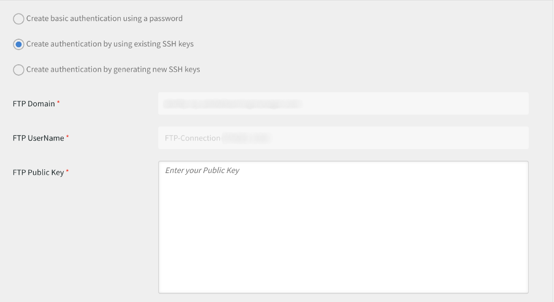
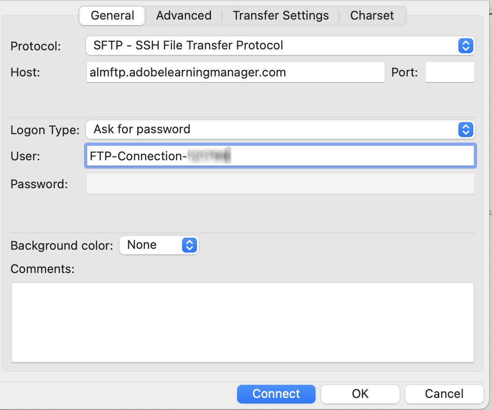
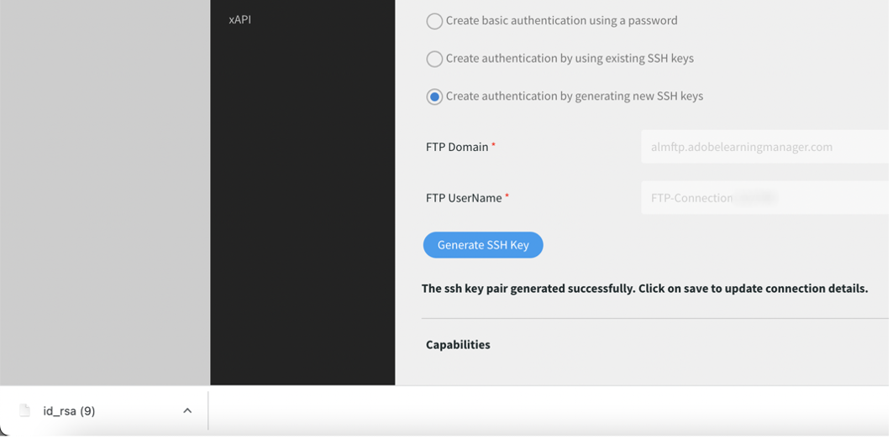

# Transition depuis Adobe FTP Manager

Adobe Learning Manager prend en charge un nouveau connecteur utilisant le protocole SFTP d’AWS Transfer Family.

Vous pouvez remplacer n’importe quel client FTP open source par Adobe FTP Manager.

Certains clients FTP recommandés par AWS sont [répertoriés ici](https://docs.aws.amazon.com/transfer/latest/userguide/transfer-file.html) :

* FileZilla (Windows, macOS et Linux)
* OpenSSH (macOS et Linux) - Remarque : ce client fonctionne uniquement avec les serveurs activés pour le protocole SFTP (File Transfer Protocol) de Secure Shell (SSH).
* WinSCP (Microsoft Windows uniquement)
* Cyberduck (Windows, macOS et Linux)

## Configuration du connecteur FTP AWS

Vous devez configurer le nouveau connecteur FTP basé sur AWS sur l’administrateur de l’intégration.

*Sélectionnez l&#39;option FTP*

Une fois la connexion établie, la page Détails de la connexion s’affiche.

*Afficher la page Détails de la connexion*

Il existe trois options d’authentification :

### Création d’une authentification en générant de nouvelles clés SSH

Si vous souhaitez, vous pouvez générer la clé SSH depuis votre système. Cliquez sur Générer la clé SSH.

La clé privée est téléchargée sur votre ordinateur et la clé publique est enregistrée dans nos services. Une fois que vous avez cliqué sur Se connecter, l’utilisateur FTP est créé avec les clés publique et privée comme authentification.

Vous avez créé une connexion FTP.

### Création d’une authentification à l’aide de clés SSH existantes

Si vous disposez déjà d&#39;une clé SSH, collez la clé publique dans le champ **[!UICONTROL Clé publique FTP]**, puis cliquez sur Se connecter.

*Coller les touches*

### Création d’une authentification de base par mot de passe

Il s’agit du mécanisme d’authentification de base. Sélectionnez la première option, **[!UICONTROL Créer une authentification de base à l&#39;aide d&#39;un mot de passe]**. Saisissez le mot de passe, puis cliquez sur **[!UICONTROL Se connecter]**.

La connexion s’établit.

## Étape suivante

### Configuration du client FTP

Configurez la connexion sur un client FTP (recommandé dans la section précédente) avec les clés téléchargées ou les clés ou mots de passe existants.

### Exemple de test d’exportation

* Dans votre client FTP, remplacez l’emplacement du FTP ExaVault par le nouvel emplacement FTP. Le nouveau domaine est `http://almftp.adobelearningmanager.com/`.
* Vous devez également mettre l&#39;IP en liste blanche, `18.195.107.67`.
* Après l’authentification, vous devez télécharger quelques exemples de fichiers vers et depuis le nouvel emplacement FTP à l’aide de clients FTP externes ou de scripts d’automatisation.
* Vous devez transférer des données de l’ancien emplacement vers le nouveau.
* La stratégie de rétention des données pour le connecteur reste inchangée. ExaVault prend également en charge certaines stratégies de rétention des données en plus de la stratégie officielle. Ces stratégies de rétention des données ne seront pas disponibles pour le nouveau connecteur. Vérifiez si votre connecteur utilise une rétention des données au-delà des stratégies officiellement prises en charge.

### Qu’advient-il des projets de migration ?

| Statut | Recommandation |
|---|---|
| Nouvelle migration | Vous ne pouvez pas lancer de nouvelles migrations à partir de l’ancien FTP. Vous devez utiliser le nouvel FTP pour effectuer de nouvelles migrations. Pour obtenir plus d’informations à ce sujet, contactez l’équipe de réussite client. |
| Migration en cours | Création d’un sprint : vous pouvez continuer à utiliser l’ancien FTP, mais nous vous recommandons d’utiliser le nouveau FTP. Contactez l’équipe de réussite client pour tout sprint existant qui ne peut pas être modifié. |
| Migration terminée | Aucune action. |

## Connexion à Adobe Learning Manager via le client FTP FileZilla

1. Connectez-vous au nouveau connecteur FTP ALM. Cliquez sur Se connecter.

   
   *Se connecter au nouveau connecteur FTP ALM*

1. Pour vous connecter via une authentification de base par mot de passe, entrez le nom de domaine et le nom d’utilisateur FTP, puis définissez un mot de passe selon les critères de validation du mot de passe. Cliquez sur Se connecter. La nouvelle connexion FTP sera créée et sera accessible via le client SFTP de votre choix.

   
   *via l&#39;authentification de base par mot de passe*

1. Installez le client SFTP de votre choix, par exemple FileZilla. Lancez File Zilla et cliquez sur Open Site Manager dans le coin supérieur gauche.

   
   *Se connecter via un client SFTP*

1. Cliquez sur **[!UICONTROL Nouveau site]** pour créer un nouveau site. Renommez le site comme vous le souhaitez.

   
   *Créer un site*

1. Mappez les détails de la page d’informations d’identification du connecteur.

   * Sélectionnez le protocole « SFTP - SSH File Transfer Protocol ».
   * Hôte : domaine FTP
   * Type de connexion « Demander un mot de passe »
   * Utilisateur : nom d’utilisateur FTP

1. Cliquez sur Se connecter.

   
   *Saisir les informations d&#39;identification*

   >[!NOTE]
   >
   >Effectuez cette étape dans le client FileZilla.

1. Saisissez le mot de passe.

   (Facultatif) Cochez la case Mémoriser le mot de passe pour mémoriser le mot de passe.

   
   *Saisir un mot de passe*

   (Facultatif) Cochez la case **[!UICONTROL Toujours approuver cet hôte]** pour approuver l&#39;hôte.

1. Cliquez sur OK.

   
   *Clé d&#39;hôte*

1. Vérifiez l’état et la progression de la connexion en haut.

   La partie gauche correspond au site local et la partie droite au site distant.

   Pour déplacer des fichiers d’un emplacement local vers un emplacement distant et inversement :

   * Vous pouvez effectuer un glisser-déposer des fichiers.
   * Double-cliquez sur le fichier.

   
   *Vérifier l&#39;état de la connexion*

Vous pouvez modifier et mettre à jour le type d’authentification à tout moment.

Vous pouvez également vous authentifier via les clés SSH :

Collez votre clé publique dans la zone de texte pour utiliser les clés SSH existantes. Cliquez sur Connecter/Enregistrer.

Pour générer de nouvelles clés SSH, cliquez sur le bouton « **[!UICONTROL Générer la clé SSH]** ». La clé privée sera téléchargée. Cliquez sur **[!UICONTROL Connexion/Enregistrement]**.

*Générer la clé SSH*

Mappez les détails. Sélectionnez le type d’authentification Fichier de clé. Sélectionnez le fichier de clé privée.

Cliquez sur **[!UICONTROL Connexion]**.

## Que se passera-t-il lorsque ExaVault sera devenu obsolète ?

Une fois qu’ExaVault sera devenu obsolète, tous les projets de migration existants, qui sont en cours, seront transférés vers le nouveau FTP en tant qu’emplacement source. Vous devrez ensuite configurer le nouveau connecteur FTP et poursuivre le processus de migration.

## Recommandations pour migrer les sprints

Lors de la création d’un projet de migration, Adobe recommande de créer le projet à l’aide du nouveau connecteur SFTP AWS pour éviter la migration ultérieure des sprints d’Exavault vers AWS.

Si une migration est en cours, fermez le sprint actuel qui utilise Exavault comme source de données. Créez la connexion SFTP AWS, testez la configuration et contactez l’équipe chargée de la réussite client pour passer à la nouvelle source de données SFTP AWS. Après le basculement, créez un sprint dans le même projet de migration. Les dossiers sprint sont créés dans le nouvel emplacement et vous pouvez charger les fichiers CSV de migration pour poursuivre l’activité.

**Cas dans lesquels un projet de migration ne peut pas être fermé**

* Le mappage d’ID de cours est effectué dans le projet en cours pour les cours migrés depuis des systèmes externes hérités vers Adobe Learning Manager. Vous pouvez effectuer cette action uniquement si vous souhaitez mettre à jour les mêmes cours dans le même projet. Une fois que vous avez fermé le projet, vous ne pouvez pas modifier les détails.
* Pour les projets de migration basés sur l’API dans lesquels vous ne devez pas fermer un projet.
