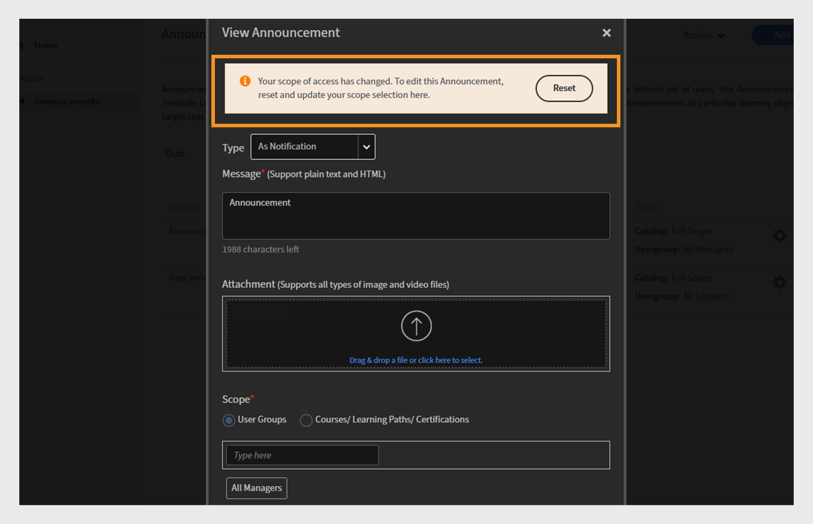

# Changements à venir dans Adobe Learning Manager

<!-- >>[!IMPORTANT]
>
>The Adobe Learning Manager October 2025 release is now live. View [What's New](/help/migrated/whats-new.md) for more information on the latest features and enhancements. This page will be updated with the new features and enhancements for the next release. Stay tuned for more updates. -->

## Présentation de la version

La version d’avril 2026 de Adobe Learning Manager introduit un large ensemble d’améliorations qui rendent l’apprentissage plus fluide pour les élèves, plus facile à gérer pour les administrateurs et plus flexible pour les instructeurs, notamment une navigation plus claire dans le lecteur Fluidic avec un libellé « Module suivant » et un bouton de sortie dédié, la prise en charge de plusieurs sessions Zoom simultanées afin que les équipes puissent exécuter des classes virtuelles parallèles sans configuration manuelle et une meilleure visibilité pour les cours partagés en affichant l’auteur réel au lieu de « Auteur externe » dans les comptes de pairs. La mise à jour expose également les dates d’expiration des objets d’apprentissage dans les API des élèves pour aider les LXP à mettre en évidence les formations sensibles au temps, ajoute la prise en charge multilingue des assistances à la tâche afin qu’une assistance à la tâche puisse transporter toutes les versions linguistiques, et permet aux administrateurs de restreindre le moment où les modules peuvent être démarrés en définissant des fenêtres de début/fin utiles pour les cohortes ou les programmes chronométrés.

Les systèmes externes utilisant LTI peuvent désormais définir automatiquement la langue du lecteur, ce qui permet aux élèves de bénéficier d’une expérience linguistique cohérente entre les plateformes. Plusieurs mises à niveau de la liste de contrôle sont également disponibles, notamment la notation pondérée, le texte de question multilingue et les commentaires facultatifs des réviseurs pour obtenir des commentaires plus riches. ALM capture désormais plusieurs tentatives de quiz contrôlées dans le contenu SCORM et signale chaque tentative proprement dans les rapports L2. Les instructeurs peuvent également générer des codes QR eux-mêmes pour un suivi instantané de l’inscription et de la présence lors des sessions en personne. Le contenu du Captivate est lu plus facilement avec une table des matières unifiée, des repères d’achèvement au niveau des diapositives et des exportations de notes fiables. Dans l’ensemble, la version met l’accent sur la clarté, la cohérence, la préparation multilingue, l’efficacité des administrateurs et une prestation de formation plus flexible.

## Navigation dans le lecteur Fluidic - Afficher le nom du module suivant

### Présentation

Cette amélioration était déjà incluse dans la version de novembre 2025 de Adobe Learning Manager.

L’action « Suivant » dans le lecteur indique ce qui se passera lorsque l’utilisateur cliquera dessus en affichant le nom du module ou cours suivant et en signalant explicitement lorsque l’élève est sur le point de quitter le lecteur.

### Nouveautés

Libellé **« Module suivant : {ModuleName} » dans le lecteur**

L&#39;icône Suivant du Lecteur Fluidic affiche désormais le nom du module suivant du cours. Par exemple, Module suivant : Leçon 2 - Prise en main.

Cela s’applique partout où l’élève passe d’un module à l’autre dans le même cours.

**Effacer l&#39;action de sortie sur le dernier module**

Lorsque l&#39;élève se trouve sur le dernier module d&#39;un cours, un nouveau bouton d&#39;action Quitter s&#39;affiche, indiquant que si vous cliquez dessus, le lecteur sera fermé et l&#39;élève reviendra au contexte du cours.

**Comportement réactif pour le contenu mobile et de PDF**

Dans les fenêtres plus petites (par exemple, d’une largeur d’environ 320 px), le libellé Suivant peut être raccourci ou masqué, en affichant uniquement l’icône, afin d’éviter tout chevauchement avec les contrôles du PDF.

Pour les modules de PDF, le lecteur ajuste les contrôles sur une ligne distincte, de sorte que les étiquettes de navigation et les contrôles de PDF n’interfèrent pas les uns avec les autres.

**Administrateur > Identité visuelle > Aperçu du lecteur** mis à jour

L’aperçu du lecteur dans Admin > Identité visuelle reflète désormais le nouveau libellé, par ex. Module suivant : Leçon 2. Cela permet aux administrateurs de voir le comportement de navigation mis à jour.

### Principaux avantages

**Navigation plus claire pour les élèves**

Les élèves n&#39;ont plus à deviner ce qui se passera lorsqu&#39;ils sélectionneront « Suivant ». L&#39;étiquette précise clairement ce qui suit, qu&#39;il s&#39;agisse d&#39;un module ou d&#39;un cours. Cette réduction de l’ambiguïté permet d’atténuer l’hésitation et la confusion, en particulier dans les grands publics d’éducation des clients où de nombreux élèves peuvent ne pas être familiarisés avec les interfaces LMS.

**Taux d’achèvement des cours plus élevés**

Le fait de définir clairement l&#39;étape suivante (Module suivant : {ModuleName}) et d&#39;ajouter une action de sortie distincte pour le module final réduit la probabilité que les élèves abandonnent le cours ou négligent la dernière étape d&#39;achèvement.

**Expérience utilisateur plus prévisible sur tous les appareils**

Les libellés mis à jour s’alignent sur le comportement et les icônes Suivant ou Précédent sur les ordinateurs de bureau, les tablettes et les appareils mobiles. Les contraintes de mise en page sont respectées sur tous les appareils et dans tous les flux de PDF afin que les commandes restent utilisables et accessibles.

Cela est particulièrement important pour les implémentations sans en-tête où le lecteur Fluidic est intégré dans une expérience d’apprentissage personnalisée.

### Cas d’utilisation

**Portails d’éducation pour les clients et les partenaires (sans interface utilisateur ou intégré à AEM)**

Comptes utilisant Adobe Learning Manager dans une configuration sans en-tête, dirigeant les élèves à partir de canaux de marketing externes. Ces élèves :

* Consomment souvent du contenu vidéo en longues séquences.

* Attendez-vous à une expérience de style curriculum où le système indique clairement le prochain épisode/module.

Dans ces environnements, le libellé **Module suivant :{ModuleName}** :

* Renforce la nature guidée du voyage.

* Réduit la dépose entre les modules.

**Cours de conformité et de certification avec modules commandés**

Dans les scénarios réglementés ou à forte conformité :

* Les élèves doivent terminer une séquence stricte de modules.

* Les auteurs désactivent souvent la table des matières pour éviter de l’ignorer.

Ici, en affichant **Module suivant :{ModuleName}** :

* Confirme aux élèves qu’ils suivent la bonne séquence.

* Réduit la probabilité qu’ils interprètent mal l’action suivante et quittent l’action plus tôt que prévu.

**Parcours d’apprentissage où les cours se suivent**

Où les parcours d’apprentissage ou équivalents enchaînent plusieurs cours. Ceci est utile lors de la création de séquences de style curriculum pour un large public.

**Consommation mobile en premier**

Pour les élèves utilisant principalement un téléphone ou une tablette :

* Les étiquettes mises à jour et le comportement réactif garantissent que la navigation reste compréhensible sans dépendre de minuscules icônes proches ou de contrôles masqués.

* Cela est important pour l’éducation des clients, les travailleurs à la demande ou les élèves de première ligne qui peuvent accéder au contenu lors de courtes sessions sur des appareils mobiles.

## Connecteur Zoom : créez plusieurs sessions Zoom simultanées.

### Présentation

La mise à niveau à venir du connecteur Zoom améliorera considérablement la façon dont Adobe Learning Manager gère la formation virtuelle dirigée par un instructeur (VILT). Auparavant, les utilisateurs ne pouvaient créer qu’une seule session Zoom à la fois. Avec la nouvelle mise à jour, les administrateurs et les auteurs peuvent planifier plusieurs sessions Zoom en même temps à l’aide de l’intégration standard.

### Nouveautés

#### Prise en charge de plusieurs sessions Zoom simultanées via le connecteur

* Le connecteur Zoom permet désormais de créer plusieurs sessions VILT à la même date/heure à partir d’ALM.

* La logique de planification n’applique plus une contrainte « réunion Zoom à la fois » au niveau du compte/connecteur.

* Les administrateurs et les auteurs peuvent configurer des sessions VILT qui se chevauchent (par exemple, des salles de classe régionales, des pistes parallèles ou des sessions répétées pour différents groupes de partenaires) sans solutions de contournement.

#### Les réunions sont créées à l’aide de l’identité Zoom de l’instructeur (pas du super administrateur Zoom).

Pour prendre en charge les réunions simultanées en toute sécurité, le connecteur a été mis à jour afin que :

* Les réunions Zoom sont désormais créées à l’aide de l’adresse e-mail de l’instructeur, au lieu de l’adresse e-mail du super administrateur Zoom.

* Le compte Zoom de chaque instructeur peut organiser ses propres réunions en parallèle avec d’autres instructeurs, sous réserve des limites de la formule Zoom existante.

**Remarque** :

* Un seul instructeur par réunion est toujours pris en charge.

* Si l’adresse e-mail d’un instructeur est mise à jour ultérieurement dans Adobe Learning Manager, les réunions existantes restent associées à l’adresse e-mail d’origine utilisée lors de la création.

#### Fini le collage manuel d’URL Zoom pour les sessions simultanées

Auparavant, lorsqu’une deuxième ou troisième session Zoom devait s’exécuter en même temps :

* Les auteurs devaient créer manuellement des réunions Zoom en dehors d&#39;ALM, puis coller l&#39;URL de jointure Zoom dans la configuration de l&#39;instance de cours.

* Cette opération était source d’erreurs et ne bénéficiait pas des fonctionnalités du connecteur telles que le suivi de l’assiduité.

Avec le connecteur mis à jour :

* Toutes les sessions peuvent être créées directement à partir de l’interface utilisateur ALM à l’aide du connecteur Zoom, même si elles se chevauchent dans le temps.

* Le cycle de vie de la session (création/annulation) continue d’être géré de manière centralisée via l’intégration.

### Principaux avantages

#### Meilleure planification VILT à grande échelle

Les organisations peuvent désormais :

* Organisez plusieurs salles de classe virtuelles sur Zoom en même temps (par exemple, des pistes parallèles lors d’un sommet virtuel, des cohortes régionales ou des sessions de formation distinctes pour les partenaires).

* Évitez les goulots d’étranglement qui obligeaient auparavant les administrateurs à sérialiser les sessions ou à recourir à la gestion manuelle du zoom.

#### Frais généraux d’administrateur et d’auteur réduits

L’amélioration élimine :

* Création manuelle de réunions Zoom en dehors de Adobe Learning Manager.

* Copiez-collez les URL de zoom dans chaque instance de cours pour les sessions qui se chevauchent.

* Risque de liens mal configurés, de mauvaises réunions jointes ou de suivi de présence manqué.

Les administrateurs et les auteurs peuvent gérer toutes les sessions Zoom à partir de Adobe Learning Manager, à l’aide de workflows familiers.

#### Meilleur alignement avec la mise en service du zoom et les rôles d’instructeur

En associant des réunions à des comptes Zoom d’instructeur individuels :

* Chaque instructeur peut utiliser ses propres limites de licence Zoom.

* Les organisations peuvent utiliser leur modèle de provisionnement Zoom existant (un compte par formateur, par BU, etc.) tout en s’intégrant pleinement à Adobe Learning Manager.

* Cela évite le goulot d’étranglement d’un point unique lors de l’utilisation d’un utilisateur Zoom super-administrateur partagé pour toutes les sessions.

### Cas d’utilisation

#### Événements et sommets virtuels multipistes

Les équipes de formation des clients qui organisent de grands événements (par exemple, des camps d’entraînement sur les produits, des sommets de partenaires ou des semaines de certification) peuvent :

* Configurez plusieurs sessions basées sur Zoom dans le même créneau horaire (pour différentes pistes ou rubriques).

* Gérez-les tous en tant que modules VILT sous les cours et parcours d’apprentissage de Adobe Learning Manager.

* Offrez aux élèves une expérience unifiée pendant que le connecteur gère toutes les créations de réunions Zoom sous-jacentes.

#### Formation internationale des partenaires et des clients

Les organisations qui forment des clients et des partenaires dans toutes les régions peuvent :

* Organisez des sessions Zoom distinctes pour la zone EMEA, l’APAC et les Amériques à des heures qui se chevauchent pour correspondre aux heures de travail locales.

* Évitez de forcer un seul créneau horaire global ou une configuration de zoom manuelle pour les cohortes supplémentaires.

#### Activation interne

Les équipes d’activation internes (ventes, support, etc.) peuvent :

* Planifiez des sessions d’intégration parallèles ou des groupes en fonction des rôles (par exemple, des salles Zoom séparées pour les développeurs, les administrateurs et les parties prenantes de l’entreprise) dans ALM.

* Conservez toutes les sessions dans le modèle VILT d’ALM à des fins de reporting et de conformité, plutôt que de passer partiellement à des réunions Zoom non gérées.

## Afficher l&#39;auteur d&#39;origine des cours partagés dans les comptes de pairs

### Présentation

Lorsqu&#39;un cours est partagé via le catalogue avec un compte de pairs, Adobe Learning Manager nomme actuellement l&#39;auteur « Auteur externe » dans les vues Élève, Administrateur et Auteur du compte de réception. Cela peut poser des problèmes aux élèves et aux administrateurs, en particulier dans les grandes entreprises, car il devient difficile d’identifier et de contacter le propriétaire de contenu approprié lorsque des problèmes ou des questions surviennent.

L’amélioration garantit que les informations sur l’auteur sont conservées et affichées pour les cours partagés dans les comptes de pairs, plutôt que remplacées par un espace réservé générique.

### Nouveautés

Afficher le nom réel de l&#39;auteur pour les cours partagés dans les comptes de pairs

Pour les cours partagés via des catalogues externes ou de pairs, le nom de l’auteur d’origine du compte source s’affiche désormais dans le compte de réception au lieu de « Auteur externe ».

Cela s’applique :

* Application de l’élève (carte de cours ou détails du cours).

* Vues Administrateur et Auteur lors de la prévisualisation en tant qu’élève.

### Principaux avantages

#### Visibilité directe du propriétaire pour le contenu partagé

Les élèves et les administrateurs des comptes de pairs peuvent désormais :

* Découvrez qui a créé le cours, même lorsqu&#39;il est acquis via un catalogue partagé.

* Évitez l’étiquette générique et inutile « Auteur externe ».

#### Expérience multi-locataires et compte de pairs plus cohérente

Pour les clients exécutant des scénarios multi-locataires ou d’entreprise étendue :

* Le même cours apparaît avec une image de marque cohérente de l’auteur sur tous les comptes.

* L’expérience de l’élève correspond aux attentes du compte principal (par exemple, voir « Cloud Academy Team » au lieu de « External Author »).

### Cas d’utilisation

#### Grande entreprise avec comptes de pairs

L’entreprise utilise ALM avec :

* Un compte principal qui possède les cours canoniques, et

* Comptes de pairs qui acquièrent du contenu via des catalogues partagés.

Les élèves des comptes de pairs doivent savoir quelle équipe d&#39;entreprise a créé un cours pour acheminer correctement les questions ou les suggestions d&#39;amélioration.

Grâce à cette amélioration :

* Les cours partagés affichent désormais le nom d’auteur d’entreprise correct dans les comptes de pairs.

* La charge de support interne de l’entreprise est réduite, car les élèves et les administrateurs locaux savent qui contacter.

#### Partage multi-BU interne

Lorsqu’une unité commerciale organise l’apprentissage pour d’autres :

* La BU propriétaire peut être identifiée dans le champ Auteur sur tous les comptes consommateurs.

* Les administrateurs L&amp;D locaux peuvent rapidement voir si un cours est maintenu localement ou par une autre entité organisationnelle, et collaborer en conséquence.

## Exposer la date d&#39;expiration de l&#39;objet d&#39;apprentissage (retrait automatique) dans les API des élèves

### Présentation

Cette amélioration rend la date de retrait automatique d&#39;un objet d&#39;apprentissage (LO) disponible directement via les API de Adobe Learning Manager destinées aux élèves. Lorsqu’un cours, un parcours d’apprentissage ou une certification est configuré avec une date d’expiration ou de retrait automatique, ces informations font désormais partie des données d’objet d’apprentissage renvoyées par les points de terminaison clés de l’élève.

### Nouveautés

#### Nouveau champ d’expiration/retrait automatique dans les API de l’objet d’apprentissage de l’élève

* Les API d’objet d’apprentissage de l’élève (par exemple, les points de terminaison qui renvoient des objets d’apprentissage à l’expérience de l’élève et à des plateformes externes) incluent désormais la date d’expiration de l’objet d’apprentissage (date de retrait automatique configurée pour cet objet d’apprentissage).

* Ce champ est renvoyé comme faisant partie de l’entité objet d’apprentissage dans les réponses telles que :

   * Obtenir l’objet d’apprentissage (détails LO).

   * Données d’objet d’apprentissage utilisées pour remplir la page d’accueil de l’élève, le catalogue et les résultats de recherche.

* Le champ complète l’échéance d’achèvement existante qui existe déjà au niveau de l’instance ; le nouveau champ est spécifiquement la date de retrait automatique au niveau de l’objet d’apprentissage.

#### Disponibilité dans les expériences d’élève basées sur la recherche

La date d’expiration étant affichée dans le cadre de la représentation d’objet d’apprentissage soutenue par la recherche, elle est désormais disponible partout où ALM ou une plate-forme externe utilise :

* rechercher des API ou

* catalogues et suggestions basés sur la recherche pour construire des vues d’élève.

**Portée et exclusions**

L’amélioration s’applique uniquement aux API des élèves.

### Principaux avantages

#### Expérience d’élève avec expiration dans les LXP personnalisés

Pour les grandes et moyennes entreprises, leur LXP personnalisé peut désormais obtenir des informations d’expiration d’objet d’apprentissage directement auprès d’ALM, ce qui leur permet de :

* Afficher les étiquettes « Expiration le {date} » ou « Bientôt expirée » sur les cartes de cours et les pages de détails.

* Communiquez avec l&#39;urgence plus clairement, afin que les élèves donnent la priorité à la formation qui est sur le point de prendre sa retraite.

Cela est particulièrement important pour la conformité ou la formation produit limitée dans le temps, où les objets d’apprentissage sont régulièrement actualisés et les versions plus anciennes sont retirées.

#### De meilleurs conseils pour les élèves sur les formations à suivre dès maintenant

En exposant l’expiration de l’objet d’apprentissage, l’expérience de l’élève peut :

* Mettez en surbrillance les cours qui sont toujours valides et ceux qui sont sur le point d’être retirés.

* Aidez les élèves à éviter de s&#39;inscrire à des formations qui ne seront plus disponibles ou valides dans un proche avenir.

#### Cohérence avec les données d’échéance d’achèvement existantes

Auparavant, les API de l’élève affichaient déjà le délai d’achèvement au niveau de l’instance, mais pas la date de retrait automatique au niveau de l’objet d’apprentissage. Avec cette modification :

Les aspects suivants d’une formation sont disponibles :

* « Quand dois-je terminer cette instance ? » (échéance d’achèvement).

* « Jusqu&#39;à quand cette formation est-elle offerte ? » (date de retrait automatique/d’expiration).

### Cas d’utilisation

#### Une entreprise mondiale avec une gestion stricte du cycle de vie des cours

Les entreprises qui retirent et remplacent régulièrement des cours (par exemple, des mises à jour réglementaires, de produits ou de méthodologies) peuvent :

* Évitez toute confusion chez l’élève quant à la suppression progressive d’une formation.

* Dirigez les élèves vers les offres les plus récentes et les plus durables.

Leurs portails personnalisés et leurs outils internes peuvent désormais lire la date d’expiration directement à partir d’ALM via les API des élèves.

#### Académies clients ou partenaires externes

Pour la formation des clients et des partenaires, les pages marketing et les portails mettent souvent l’accent sur la formation la plus récente.

La présence de dates d’expiration dans l’API LO permet aux créateurs d’expérience :

* Masquez ou atténuez l’accent mis sur le contenu qui est proche de la retraite.

* Créez des campagnes « Dernière chance de terminer ».

## Prise en charge multilingue des assistances à la tâche

### Présentation

L’amélioration étend le modèle de localisation de Adobe Learning Manager aux assistances à la tâche, ce qui permet aux auteurs de joindre différents fichiers de contenu par langue à une seule assistance à la tâche. Au lieu de créer des assistances à la tâche distinctes pour chaque langue, les auteurs peuvent désormais gérer toutes les versions localisées comme une seule assistance à la tâche logique.

### Nouveautés

#### Chargement de contenu spécifique à la langue pour les assistances à la tâche

Les auteurs peuvent joindre différents fichiers par langue prise en charge à une seule assistance à la tâche, comme des cours et d’autres objets d’apprentissage.

L’expérience de création/modification d’assistance à la tâche prend désormais en charge :

* Sélection d’une langue.

* Téléchargement du fichier spécifique à la langue dans la même entité d&#39;assistance à la tâche.

#### Gestion cohérente des langues dans l’interface utilisateur du lecteur et de l’élève

Le lecteur Fluidic a été mis à jour de sorte que lorsqu’un élève ouvre une assistance à la tâche, la variante de contenu correspondant à sa langue s’affiche (le cas échéant).

Les administrateurs et les auteurs peuvent afficher les assistances à la tâche sous la forme d’objets uniques avec des variantes de langue, plutôt que sous la forme d’éléments distincts par langue.

### Principaux avantages

#### Assistance à la tâche unique pour toutes les langues

Les auteurs peuvent éviter de créer des assistances à la tâche distinctes par langue.

Toutes les variantes linguistiques d’une même assistance à la tâche (par exemple, une procédure, une procédure standard, un PDF de liste de contrôle ou un guide de référence) peuvent être gérées en un seul endroit.

#### Meilleure expérience pour les élèves du monde entier

Les élèves voient automatiquement l’assistance à la tâche dans leur langue préférée, ce qui signifie qu’il y a :

* Moins de confusion sur la version à ouvrir.

* Moins de risques d’accès aux copies hors paramètres régionaux ou obsolètes.

Ceci est particulièrement utile dans les organisations multilingues où le même processus ou la même documentation produit doit être disponible dans plusieurs langues.

### Cas d’utilisation

#### Déploiement global du contenu de référence

Une entreprise doit fournir des assistances à la tâche dans plusieurs langues aux élèves du monde entier, telles que :

* Feuilles de référence des produits.

* Traiter les listes de contrôle.

* Prise en charge des playbooks

Au lieu de créer des assistances à la tâche distinctes comme « Product Quick Start - EN », « Product Quick Start - DE », « Product Quick Start - JP », etc., ils peuvent créer une assistance à la tâche, joindre des fichiers localisés pour chaque langue et laisser ALM fournir la version correcte à chaque élève en fonction des paramètres linguistiques.

#### Documentation destinée aux clients ou aux partenaires sur plusieurs marchés

Pour les académies clients et partenaires, les assistances à la tâche peuvent inclure :

* Fiche technique du produit

* Guides d’intégration

* Workflows de support

Avec les assistances à la tâche multilingues :

* Chaque partenaire voit la version localisée sans être obligé de choisir entre des entrées spécifiques à la langue.

* Les équipes marketing et d’activation peuvent gérer une assistance à la tâche par sujet dans toutes les langues.

## Définir une restriction sur l&#39;heure de début du module

### Présentation

L’amélioration permet aux auteurs et aux administrateurs de Adobe Learning Manager de définir une fenêtre temporelle pendant laquelle les élèves sont autorisés à démarrer un module. En dehors de la fenêtre de début/fin configurée, le module reste visible dans la structure du cours, mais les élèves ne peuvent pas le lancer.

Cette fonctionnalité est essentielle pour les utilisateurs qui ont besoin d’un contrôle plus strict sur le moment où certains contenus deviennent disponibles ou doivent cesser d’être initiés, par exemple, dans le cadre de programmes à durée déterminée, de formations en cohorte ou d’exercices à durée déterminée.

### Nouveautés

Les auteurs peuvent désormais configurer, au niveau du module dans un cours, une date/heure de début et une date/heure de fin qui régissent le moment où les élèves sont autorisés à lancer ce module. Dans cette fenêtre, le module se comporte comme d&#39;habitude : avant l&#39;heure de début ou après l&#39;heure de fin, l&#39;élève voit le module dans l&#39;aperçu du cours mais ne peut pas le démarrer.

La configuration apparaît dans l&#39;interface utilisateur de création de cours sous forme de commandes de planification supplémentaires pour des types de module spécifiques, tels que le contenu d&#39;auto-apprentissage, les quiz ou les activités. Les administrateurs peuvent utiliser ces commandes pour créer des modules qui s’ouvrent par phases ou pour empêcher les démarrages tardifs dans les programmes où le contenu doit être consommé dans un délai défini.

#### Principaux avantages

Le principal avantage est la possibilité de contrôler quand les modules sont accessibles. Les équipes de formation peuvent synchroniser la disponibilité des modules avec des événements réels, tels que les lancements de nouveaux produits, les délais réglementaires et les programmes internes. Cela garantit que les élèves terminent le contenu prérequis avant de pouvoir accéder aux modules suivants.

Par exemple, la cohorte 1 peut accéder au module 2 uniquement au cours de la semaine 2, tandis que le module 3 reste verrouillé jusqu’à la semaine 3, éliminant ainsi la nécessité de masquer et d’afficher manuellement le contenu ou de créer des versions de cours distinctes.

Cela améliore l’expérience de l’élève : au lieu de faire face à des modules qui sont techniquement accessibles mais qui ne devraient pas l’être à ce moment-là (ou qui devraient déjà être terminés), les élèves voient une structure de cours où les modules qu’ils sont autorisés à commencer sont clairement alignés sur le calendrier prévu.

#### Cas d’utilisation

* **Programme d&#39;activation basé sur des cohortes** : dans ce programme, chaque semaine déverrouille un nouveau module. Le contenu de la semaine 1 est disponible immédiatement, tandis que la semaine 2 est visible, mais ne peut pas être démarrée avant une date spécifiée. La semaine 3 suit le même processus de contrôle. Les élèves peuvent voir l’intégralité du parcours d’apprentissage, mais le système contrôle à quel moment ils peuvent réellement commencer chaque étape.

* **Formation sur un produit ou une campagne limitée dans le temps** : les équipes marketing ou produit peuvent créer un module de formation qui n’est accessible que lorsqu’une campagne est active ou lorsqu’une version spécifique d’un produit est toujours disponible. Cette fenêtre de début désignée permet de s&#39;assurer que les élèves ne commencent pas un module sur une version de produit retirée après l&#39;heure de fin spécifiée.

* **Environnements d’évaluation ou d’examen** : les organisations peuvent ouvrir un module (tel qu’un test) pendant une courte période bien définie (par exemple, « vous pouvez commencer l’examen à tout moment entre 9:00 et 12:00 à une date donnée »). Les élèves ne peuvent pas commencer l&#39;examen en dehors de cette fenêtre, ce qui permet un planning équitable entre les fuseaux horaires et les cohortes.

## Contrôle du langage du lecteur via le paramètre LTI personnalisé

### Présentation

L’amélioration permet aux plateformes externes utilisant LTI (Learning Tools Interoperability) de spécifier la langue du contenu Adobe Learning Manager au moment du lancement. Au lieu de dépendre de l&#39;élève pour changer la langue dans le lecteur Fluidic, le consommateur LTI peut envoyer un code de langue via un paramètre LTI personnalisé. Adobe Learning Manager utilisera ensuite ce code pour sélectionner la variante de langue appropriée.

### Nouveautés

Les plateformes externes qui agissent comme des consommateurs LTI peuvent désormais transmettre un paramètre de langue personnalisé (et les paramètres de lecteur associés) lors du lancement du contenu ALM. ALM lit ce paramètre et :

* Définit la langue du lecteur en conséquence.

* Lance la variante de langue correspondante du module, lorsque du contenu multilingue est configuré.

Cela signifie qu’un nouvel élève, qui sélectionne Français sur la plateforme externe, verra le lecteur et le module ALM se lancer directement en français, sans avoir à ajuster quoi que ce soit à l’intérieur d’ALM.

L’amélioration s’adapte également aux scénarios dans lesquels la plateforme externe traite ALM comme un lecteur de contenu sans en-tête. Par exemple, il permet de masquer les éléments de navigation et la table des matières (TDM) en envoyant des paramètres personnalisés supplémentaires pour ajuster certains paramètres de l’interface utilisateur. Ces paramètres fonctionnent en conjonction avec le paramètre de langue, ce qui permet à la plate-forme externe de fournir une expérience de marque fluide tout en utilisant ALM pour la lecture et le suivi.

### Principaux avantages

* **Expérience linguistique cohérente entre les systèmes** : lorsqu&#39;un élève sélectionne une langue dans le portail externe, ce choix est immédiatement reflété dans ALM. Cela garantit que les élèves ne sont confrontés à aucune incompatibilité entre la langue du portail et le cours. Par conséquent, ils n’auront pas besoin de rechercher un changement de langue dans le lecteur.

* **Rapports spécifiques à la langue** : dans leur plateforme, la sélection de la langue est cohérente avec ALM, ce qui améliore la précision de leurs analyses et le suivi des élèves. Cet alignement prend également en charge les configurations dans lesquelles les commandes de langue propres à ALM sont intentionnellement désactivées ou masquées dans le lecteur Fluidic pour des cours spécifiques. Dans ces cas, la plateforme externe sert de source unique de vérité pour le langage.

### Cas d’utilisation

* Un cas d’utilisation important implique les grandes entreprises qui utilisent des intégrations LTI. Les élèves s&#39;inscrivent et sélectionnent d&#39;abord une langue sur la plateforme. Ils lancent ensuite des sessions de formation ALM via LTI. Grâce à cette amélioration, lorsqu’un élève sélectionne l’espagnol, le module ALM s’ouvre automatiquement en espagnol. Cela signifie que les élèves n’ont pas besoin d’ajuster les paramètres de langue dans ALM. En outre, les rapports basés sur la langue restent cohérents avec ce que les élèves voient et expérimentent dans ALM.

* Une autre application est la fourniture d’expériences de cours sans interface utilisateur au sein d’un portail client ou partenaire. Dans cette configuration, le portail peut incorporer du contenu ALM à l’aide d’un iframe, tandis que toutes les expériences utilisateur de navigation et de langue (UX) sont gérées en dehors d’ALM. En utilisant des paramètres LTI personnalisés, le portail peut s&#39;assurer que le lecteur ALM est affiché dans la langue appropriée et que tous les éléments inutiles de l&#39;interface utilisateur (tels que la table des matières et les boutons de navigation) sont masqués. Cela permet aux élèves de percevoir une application unique et cohérente plutôt qu’une collection d’outils disparate.

* Ceci est avantageux pour les organisations qui effectuent une formation à grande échelle dans plusieurs langues à l’aide d’un autre LMS ou d’une plate-forme d’apprentissage. Ils peuvent standardiser leur utilisation de cette plateforme pour gérer les profils d’élèves, sélectionner des paramètres régionaux et présenter des catalogues. Dans le même temps, ALM sert de moteur de contenu et de suivi fiable, respectant les préférences linguistiques et les interactions utilisateur spécifiées par le système externe lors de chaque lancement LTI.

## Pondération des questions de la liste de contrôle pour les évaluations des instructeurs

### Présentation

L’amélioration introduit des listes de contrôle pondérées, permettant aux instructeurs et aux responsables d’évaluer les élèves à l’aide d’échelles notées et de scores totaux, plutôt que de traiter chaque question de liste de contrôle comme étant égale. L&#39;objectif est de faciliter la création de listes de contrôle en mettant en œuvre des évaluations pondérées des questions, ce qui permet de refléter l&#39;importance relative des différentes actions ou compétences dans une seule liste de contrôle.

### Nouveautés

Les listes de contrôle prennent en charge les types suivants :

1. Oui/Non
Le comportement reste le même qu&#39;aujourd&#39;hui : chaque question est Oui/Non et les critères de réussite sont basés sur le nombre de réponses « Oui ».

2. Questions de même poids

   * Les questions sont notées sur une échelle numérique (de 0 à 10 par défaut), où :

      * Les valeurs max/min de l’échelle sont personnalisables au niveau de la liste de contrôle.

      * L’échelle peut désormais commencer à 0 (le score minimum précédent était de 1).

   * Toutes les questions partagent le même score maximum, la liste de contrôle se comporte donc comme une échelle de notation uniforme pour chaque question.

3. Questions de poids différent

   * Chaque question a son propre score maximum (poids).

   * Les critères de réussite dépendent du pourcentage du score total possible que l’élève obtient sur la liste de contrôle (par exemple, « réussite si l’élève obtient ≥ 70 % du score total disponible »).

Pour tous les types de listes de contrôle :

* Le **réviseur** (instructeur ou responsable) évalue l’élève en fonction du type de liste de contrôle configuré :

   * Sélectionnez Oui/Non.

   * Choisissez des scores sur l’échelle définie.

* Le rapport **Liste de contrôle** est mis à jour pour inclure, pour les questions avec une pondération différente :

   * Score maximal pour chaque question.

   * Score obtenu par chaque élève pour cette question.

Cela permet d’analyser les performances globales et les performances spécifiques aux questions en fonction des pondérations prévues.

### Principaux avantages

* **Évaluations plus riches et plus réalistes** : les instructeurs peuvent refléter les priorités du monde réel en accordant plus de points aux comportements critiques et moins de points aux comportements mineurs, tout en utilisant un workflow de liste de contrôle adapté aux tâches observées ou pratiques.

* **Réussite/échec total basé sur le score** : les évaluations peuvent être basées sur le score total en pourcentage, et pas seulement sur le nombre de questions qui dépassent un seuil, en s&#39;alignant plus étroitement sur les schémas de compétence ou de notation types.

* **Amélioration des rapports** : les rapports de liste de contrôle mis à jour exposent le score maximal et le score obtenu par question, ce qui permet aux propriétaires du programme et aux équipes qualité d’identifier les points faibles spécifiques et d’affiner les conseils de formation ou d’évaluation.

### Cas d’utilisation

* **Évaluations des compétences de l’entreprise** : les ingénieurs sont évalués via des listes de contrôle pratiques basées sur des scénarios, où certaines étapes de diagnostic ou de communication doivent avoir plus de poids que les étapes cosmétiques ou à faible risque. Les questions pondérées et les critères de réussite du score total rendent ces évaluations plus crédibles et prédictives du rendement réel.

* **Observations de sécurité et de conformité** : dans le secteur de la santé, de la fabrication ou de l&#39;assistance sur site, les étapes de sécurité critiques peuvent obtenir des scores maximaux plus élevés, ce qui garantit que le fait de ne pas effectuer une action critique de sécurité a un impact plus important sur le score total que le fait de ne pas effectuer une étape procédurale mineure.

* **Coaching et étalonnage** : avec des scores max. et réalisés par question dans le rapport, les responsables peuvent voir exactement où les élèves sous-performent et calibrer les instructeurs sur la façon d&#39;obtenir des scores cohérents.

## Prise en charge multilingue des questions de liste de contrôle

### Présentation

L&#39;amélioration introduit la prise en charge multilingue des questions de liste de contrôle, permettant aux réviseurs d&#39;évaluer et de noter les listes de contrôle dans leur langue préférée. Cette fonctionnalité est particulièrement utile dans les régions multilingues et les déploiements mondiaux, car elle permet aux auteurs de créer des questions de liste de contrôle localisées pour chaque langue de contenu prise en charge tout en conservant un module de liste de contrôle unique et un processus d’évaluation cohérent.

Dans Adobe Learning Manager aujourd’hui :

* Tous les modules destinés aux élèves (SCORM, PDF, HTML, etc.) peuvent être fournis dans plusieurs langues de contenu, ce qui permet aux élèves de choisir la langue de leur choix.

* Dans un module de liste de contrôle, les réviseurs (instructeurs/responsables) évaluent les élèves en fonction des questions définies dans cette liste de contrôle.

### Nouveautés

**Création**

* Les auteurs peuvent désormais ajouter des questions de liste de contrôle dans toutes les langues sélectionnées au niveau du cours.

* Pour chaque liste de contrôle :

   * L’auteur doit fournir un texte de question équivalent dans chaque langue de contenu dans laquelle le cours existe.

   * Il incombe aux auteurs de veiller à ce que la signification de chaque question soit cohérente dans toutes les langues.

**Expérience de révision**

* Les réviseurs verront les questions de liste de contrôle et l’interface utilisateur d’évaluation dans la langue de contenu sélectionnée.

* Lorsqu’une question est évaluée dans une langue :

   * L&#39;évaluation (score, Oui/Non, statut) est logiquement la même dans toutes les langues. Il s’agit d’une seule liste de contrôle avec plusieurs vues linguistiques, et non de listes de contrôle distinctes par langue.

**Rapports**

Le rapport Liste de contrôle affiche le texte de la question dans la langue du contenu de l’utilisateur :

* Un administrateur ou un réviseur exécutant le rapport dans chaque langue voit les noms de questions localisés pour cette langue.

* Les réponses sous-jacentes et les scores restent les mêmes ; seuls les libellés de question sont traduits.

### Principaux avantages

* **Meilleure expérience du réviseur** : les réviseurs peuvent travailler entièrement dans leur propre langue, en lisant les questions et en enregistrant les évaluations sans barrières linguistiques.

* **Alignement de la réglementation et des politiques** : dans les régions où les exigences en matière d’égalité linguistique sont respectées (par exemple, le néerlandais/français en Belgique), les listes de contrôle peuvent désormais répondre aux mêmes normes que les autres supports d’apprentissage, ce qui réduit le risque de non-conformité.

* **Logique d&#39;évaluation cohérente** : bien que le texte soit localisé, l&#39;évaluation et la notation sont partagées dans toutes les langues, ce qui garantit que les résultats sont comparables et gérés de manière centralisée.

### Cas d’utilisation

* Les franchises multinationales qui fonctionnent dans plusieurs langues peuvent déployer un seul cours et une seule liste de contrôle tout en offrant des expériences d’examinateurs localisées dans chaque territoire.

* Toute entreprise internationale disposant d’instructeurs locaux (par exemple, EMEA, LATAM, APAC) peut demander aux réviseurs de travailler dans leur langue locale tout en partageant la même conception de liste de contrôle globale et la même génération de rapports.

## Liste de contrôle avec possibilité de commentaire pour le réviseur

### Présentation

L&#39;amélioration introduit une fonction de commentaire pour les évaluations de listes de contrôle, permettant aux réviseurs, tels que les instructeurs et les gestionnaires, de fournir une rétroaction qualitative parallèlement aux notes numériques. Ce retour d’informations peut être rendu visible aux élèves si nécessaire.

L&#39;objectif est d&#39;appuyer les évaluations fondées sur des listes de contrôle où la rétroaction des mentors est aussi cruciale que le résultat numérique. Il s’agit notamment de mettre en évidence des points forts spécifiques, des points à améliorer ou de fournir le contexte pour la note donnée.

Aujourd’hui, les réviseurs peuvent :

* Évaluez une liste de contrôle pour chaque élève, question par question.

* Afficher les résultats et réévaluer les élèves qui ont échoué.

Dans des scénarios réels, comme l&#39;aviation, les formateurs sur le terrain évaluent les agents des ateliers et le personnel des aéroports. De même, les formateurs et les mentors des petites et moyennes entreprises (PME) utilisent souvent des listes de contrôle pour évaluer les performances au travail. Cependant, ces listes de contrôle ne comprennent généralement pas de section structurée pour recueillir les commentaires narratifs liés à l&#39;évaluation.

### Nouveautés

#### Options de création

Les auteurs peuvent configurer chaque liste de contrôle pour :

* Activer ou désactiver la fonctionnalité de commentaire pour les réviseurs.

* Décidez si le nom du réviseur doit être affiché aux élèves avec les commentaires.

Cela permet aux organisations d’adapter la visibilité des commentaires à leur culture et à leurs exigences de confidentialité.

#### Expérience du réviseur

Lorsque les commentaires sont activés :

* Les réviseurs (instructeurs/responsables) peuvent ajouter des commentaires facultatifs lors de l’évaluation d’une liste de contrôle.

* Ils peuvent choisir si les commentaires sont visibles par les élèves, en fonction des paramètres de la liste de contrôle.

S’ils réévaluent un élève, ils peuvent mettre à jour ou modifier les commentaires pour refléter la dernière évaluation.

#### Rapports et notifications

* Le rapport Liste de contrôle gagne une nouvelle colonne pour les remarques des réviseurs, capturant le commentaire fourni pendant l&#39;évaluation.

* Les élèves reçoivent des notifications (sur la plateforme et par e-mail) chaque fois qu’une évaluation de liste de contrôle se produit. Ces notifications comprennent :

   * Le commentaire et

   * Le nom du réviseur, s’il a été configuré pour être visible.

Cela permet de s’assurer que les commentaires sont non seulement stockés, mais également activement transmis aux élèves.

### Principaux avantages

* **Retour d&#39;informations plus riche et similaire à celui d&#39;un coach** : les scores numériques sont complétés par des remarques contextuelles, ce qui fait des listes de contrôle un outil plus efficace pour le coaching, pas seulement pour la conformité.

* **Traçabilité et auditabilité** : les organisations obtiennent un enregistrement permanent des personnes qui ont évalué qui, quand et ce qu&#39;elles ont dit, ce qui est important dans les environnements réglementés et les rôles à enjeux élevés.

* **Meilleur engagement des élèves** : les élèves reçoivent des conseils clairs liés à des évaluations spécifiques, ce qui améliore leur compréhension des attentes et des étapes ultérieures.

### Cas d’utilisation

* Les organisations dont les environnements sont réglementés peuvent utiliser les commentaires pour documenter le jugement clinique ou la rétroaction procédurale du personnel qui est observé sur le terrain.

* Les organismes d&#39;aviation et d&#39;assistance en escale peuvent joindre des notes détaillées sur le rendement opérationnel, les pratiques de sécurité et le comportement vis-à-vis des clients, transformant ainsi une liste de contrôle en un outil de compte rendu structuré.

* Dans le mentorat et l&#39;évaluation des experts, les instructeurs peuvent saisir des observations nuancées qui ne cadreraient pas avec un score seul, par exemple, « ont bien géré l&#39;escalade, mais doivent améliorer la gestion du temps » ou « un excellent flux de dépannage ; ont manqué une étape de documentation ».

## Tentatives multiples au niveau du contenu et rapports de quiz

### Présentation

>[!IMPORTANT]
>
>Notez que la fonctionnalité ne sera disponible qu’après son activation dans le compte. Contactez le support ALM ou le gestionnaire de succès client.


Actuellement, ALM prend en charge plusieurs tentatives au niveau du système de gestion de l’apprentissage via la fonctionnalité de tentatives de quiz multiples (MQA) :

* Les auteurs peuvent configurer les tentatives au niveau du cours (appliqué à tous les modules du cours qui répondent au quiz) ou au niveau du module (par module de quiz).

* Les tentatives peuvent être les suivantes :

   * Un nombre spécifique (par exemple, 3 tentatives), ou

   * Tentatives infinies, contrôlées au niveau du LMS.

* Lorsqu’un élève utilise un module via le lecteur Fluidic, puis ferme le lecteur ou termine le module, cette session est traitée comme une tentative LMS unique.

* Chaque tentative de LMS est capturée dans le rapport de quiz L2 sous la forme d’une nouvelle ligne.

Cependant, si le fichier de contenu lui-même (par exemple, un quiz Articulate SCORM) implémente sa propre logique de tentatives multiples, le rapport de quiz L2 d&#39;ALM ne distingue pas ou ne suit pas correctement ces tentatives internes.

Cette amélioration introduit le suivi des tentatives multiples au niveau du contenu pour les quiz, permettant à Adobe Learning Manager de capturer avec précision chaque tentative dans le contenu lui-même dans le rapport de quiz L2. Il est conçu pour les situations où l&#39;outil de création de contenu (tel qu&#39;Articulate SCORM) gère indépendamment les tentatives de quiz. Avec cette fonctionnalité, les tentatives seront correctement reflétées dans les rapports ALM sans dépendre des paramètres de Tentative de quiz multiple (MQA) au niveau du LMS.

### Nouveautés

#### Indicateur Auteur pour les tentatives au niveau du contenu

* Lors du chargement de contenu dans la bibliothèque de contenu, les auteurs peuvent désormais indiquer qu’un fichier de contenu spécifique a plusieurs tentatives intégrées.

* Il s&#39;agit d&#39;un paramètre par contenu qui indique à ALM de traiter les tentatives définies dans le contenu comme source de vérité.

#### Comportement du cours/module

Lorsque ce contenu est utilisé dans un cours :

* Le module déduira ses tentatives du contenu, et non du LMS MQA.

* Les élèves ne verront qu’une seule tentative au niveau du LMS :

   * La vue d’ensemble du cours et du module n’affiche pas de bouton « retenter » LMS pour ce module.

   * La gestion des tentatives (par exemple, les nouvelles tentatives dans le quiz) est régie par le contenu lui-même.

#### Rapports

Le rapport de quiz L2 sera mis à jour pour traiter chaque tentative au niveau du contenu comme une ligne de tentative distincte :

* Chaque tentative de quiz interne configurée dans le contenu apparaît sous la forme de sa propre ligne dans le rapport de quiz L2, comme le sont les tentatives au niveau du LMS aujourd’hui.

* Le format de chaque ligne reste identique aux lignes à tentatives multiples existantes dans les rapports L2 (mêmes colonnes, structure et sémantique).

* Cela offre une expérience de reporting cohérente :

   * Que les tentatives soient contrôlées par le LMS MQA ou par le contenu, le rapport de quiz L2 affiche une ligne par tentative.

#### Principaux avantages

* Historique précis des tentatives pour les quiz SCORM où les tentatives sont contrôlées en interne par des outils comme Articulate, sans forcer la configuration MQA au niveau du LMS.

* Amélioration de l’expérience de l’élève : pour les tentatives contrôlées par le contenu, les élèves ne voient qu’un seul emplacement au niveau du LMS et n’ont pas besoin d’interagir avec les commandes de nouvelle tentative du LMS ; toutes les nouvelles tentatives sont gérées dans l’interface utilisateur de quiz qu’ils connaissent déjà.

* Architecture flexible : les utilisateurs peuvent choisir si ALM MQA ou les tentatives au niveau du contenu doivent piloter le comportement par module, en fonction de la façon dont leur contenu a été créé et de la façon dont ils préfèrent gérer les tentatives.

* Modèle de rapport cohérent : les utilisateurs en aval du rapport de quiz L2 peuvent traiter chaque ligne comme une « tentative », quelle que soit l’origine de la logique de tentative.

#### Cas d’utilisation

* Les organisations qui utilisent Articulate SCORM peuvent conserver une logique de quiz autonome dans le package SCORM tout en réalisant un reporting précis au niveau des tentatives dans ALM sans configuration LMS supplémentaire.

* Les organisations qui utilisent le contenu SCORM fourni par le fournisseur peuvent éviter d’avoir à modifier ou à mettre en œuvre une logique de tentatives et de tentatives supplémentaires avec l’authentification fondée sur les connaissances (MQA) au niveau du LMS.

## Codes QR de l&#39;instructeur pour l&#39;inscription et la présence à la session d&#39;instance

### Présentation

Cette amélioration permet aux instructeurs de générer des codes QR eux-mêmes pour :

* Inscription à l’instance de cours,

* Participation à la session, ou

* Inscription + participation ensemble

au niveau de la session. Il est conçu pour les situations où les élèves entrent dans une classe physique ou hybride et ont besoin d&#39;une option rapide et en libre-service pour s&#39;inscrire et enregistrer leur présence à l&#39;aide d&#39;un code QR.

### Nouveautés

#### Codes QR générés par l’instructeur

* Les instructeurs pourront générer des codes QR au niveau de la session pour :

   * S’inscrire dans l’instance : les élèves scannent pour s’inscrire dans l’instance qui inclut la session actuelle.

   * Marquer la présence à la session : les élèves numérisent pendant/après la session pour enregistrer la présence pour cette session spécifique.

   * S’inscrire dans l’instance + marquer la participation à la session : un code QR combiné pour les participants qui ne sont pas encore inscrits et dont la participation doit être marquée en une étape.

* Les instructeurs peuvent exporter les codes QR dont ils ont besoin en fonction du scénario (inscription, assiduité ou les deux).

#### Packaging de code QR

Le PDF de code QR exporté inclut :

* Nom du cours

* Nom d’instance

* Nom de la session

Ils permettent aux instructeurs et aux coordinateurs d’identifier et d’imprimer facilement le code QR correct pour chaque session.

### Principaux avantages

* **Autonomie des instructeurs** : les instructeurs n’ont plus besoin d’attendre que les administrateurs créent des codes QR. Ils peuvent les générer directement pour chaque session, ce qui améliore l&#39;agilité et réduit les frais de coordination.

* **Meilleure logistique des salles de classe** : pour les audiences en salle de classe ou sur place (tels que les travailleurs sur le terrain, le personnel d&#39;atelier ou les participants externes), les instructeurs peuvent gérer l&#39;inscription et la présence sur place à l&#39;aide de codes QR.

* **Charge de travail administrative réduite** : les équipes d’administration peuvent se concentrer sur la configuration et la gouvernance au lieu de gérer les demandes de génération de code QR de routine pour chaque session.

### Cas d’utilisation

* Les organisations qui exécutent de gros volumes de sessions sur site (par exemple, la formation de professionnels sur les produits) peuvent permettre aux instructeurs d’imprimer des codes QR spécifiques à la session qui inscrivent et marquent la présence à l’aide d’une seule numérisation.

* Dans les formations sur la vente au détail, la fabrication et les soins de santé, où les élèves rejoignent souvent les sessions directement à partir de l&#39;étage ou sans pré-inscription, un code QR « Inscription + Présence » peut être placé à la porte. Cela permet aux élèves d&#39;accéder en libre-service à leur inscription et à leur assiduité via leurs téléphones.

* Les événements de formation pour les partenaires ou les clients permettent au formateur sur site de s&#39;adapter facilement aux changements de salle, aux sessions supplémentaires ou aux participants supplémentaires sans avoir à consulter l&#39;administrateur pour de nouveaux codes QR.

## Améliorations du Captivate et du lecteur ALM

### Présentation

Cette amélioration améliore l’expérience de lecture du contenu Adobe Captivate dans le lecteur Adobe Learning Manager (ALM), en particulier suite aux récentes modifications apportées à l’architecture du Captivate. L’objectif est de permettre aux élèves d’utiliser les modules de Captivate en mode natif dans ALM tout en veillant à ce que la navigation, le suivi d’achèvement et la prise de notes soient clairs, cohérents et fiables.

### Nouveautés

#### Expérience de table des matières unifiée

* Seule la table des matières ALM s’affiche sur le côté gauche du lecteur.

* La table des matières du Captivate est masquée lorsque le module est lu dans ALM.

* Cela élimine la duplication, garantit une source unique de vérité pour la navigation et libère l’espace de l’écran.

#### Commentaires sur l’achèvement visuel

* La table des matières ALM affiche des coches vertes (ou des repères visuels équivalents) indiquant que la diapositive est terminée.

* Au fur et à mesure que les élèves progressent dans les diapositives du Captivate, la table des matières ALM reflète les diapositives terminées, conformément aux attentes des élèves pour les joueurs du cours moderne.

#### Commandes de progression contextuelle

* Les commandes du lecteur s’adapteront en fonction du type de diapositive :

   * Pour les diapositives vidéo :

      * Affiche une barre de progression temporelle reflétant la lecture vidéo.

* Pour les diapositives non vidéo :

   * Affichez les commandes de navigation de diapositive (diapositive suivante/précédente, etc.) au lieu d’une barre de temps non fonctionnelle.

      * Cela permet d’éviter d’afficher des commandes non pertinentes ou inopérantes sur certains types de diapositives.

#### Navigation simplifiée

* La barre de navigation du module (ALM) et la barre de navigation du cours séparées seront fusionnées dans une seule barre intuitive.

* Cette navigation unifiée :

   * Distingue clairement le passage par le module Captivate du retour au niveau cours/module.

   * Réduit la confusion causée par plusieurs barres dont les objectifs se chevauchent.

#### Liaison de notes fiable

* Les notes seront liées aux numéros des diapositives plutôt qu’à la date et à l’heure.

* Cette modification :

   * Corrige les échecs d’exportation dus à des horodatages manquants ou incorrects.

   * Permet d’exporter les notes de manière cohérente en tant que PDF, avec un mappage fiable entre les notes et le contexte de diapositive auquel elles appartiennent.

### Principaux avantages

* Expérience plus propre et mono-joueur : les élèves interagissent avec une table des matières et un modèle de navigation, réduisant ainsi la confusion et la charge cognitive.

* Indications précises d’achèvement et de progression : les graduations de niveau diapositive et les contrôles contextuels aident les élèves à comprendre où ils sont et ce qui reste.

* Prise de notes et exportations plus robustes : en liant des notes aux diapositives au lieu d’horodatages fragiles, les utilisateurs retrouvent un workflow de prise de notes en PDF fiable, même avec un contenu de Captivate basé sur des diapositives.

* Workflow d’auteur préservé : les auteurs conservent la simplicité de la publication directe du Captivate vers ALM, tandis que les élèves bénéficient d’une expérience de lecture moderne et intégrée sans charges de création supplémentaires.

### Cas d’utilisation

* Les programmes d’activation qui s’appuient sur Captivate pour les simulations interactives peuvent déployer du contenu dans ALM, garantissant ainsi que la navigation, le suivi d’achèvement et les notes fonctionnent de manière cohérente pour les élèves.

* Les organisations qui utilisent Captivate comme outil principal de création de contenu peuvent maintenir la publication en un clic et éviter la confusion entre les tables des matières doubles et les contrôles non fonctionnels pour les élèves.

* Les organisations qui s’appuient sur les notes exportées à partir du contenu du Captivate dans ALM (pour le coaching, la conformité ou les enregistrements) peuvent accéder aux éléments suivants :

   * Les notes sont correctement liées aux diapositives.

   * Les PDF sont générés comme prévu.

## Amélioration du calcul du temps d’apprentissage passé dans les relevés de notes des élèves

### Présentation

Avec sa version d’avril 2026, Adobe Learning Manager a revu la façon dont il calcule le temps d’apprentissage dans les relevés de notes des élèves. Auparavant, la logique de création de rapports pouvait entraîner des temps inexacts si les élèves laissaient le lecteur ouvert sans s’engager avec le contenu, ce qui entraînait des différences. La nouvelle méthode suit désormais le temps actif en fonction de l’engagement de l’utilisateur, en particulier lorsque l’onglet est actif et lorsqu’il y a une activité de l’utilisateur. Cette modification permet d’obtenir des données plus précises.

Cette mise à jour améliore les rapports et les tableaux de bord, aidant les administrateurs à mieux garantir la conformité et à suivre les progrès des élèves. Après la publication, consultez vos relevés de notes des élèves pour voir ces améliorations.

La méthode de calcul mise à jour se concentre sur l’engagement réel, tel que la mise au point active de l’onglet et les interactions récentes de l’utilisateur, améliorant ainsi la précision des rapports de temps dans les domaines suivants :

* Relevés de notes des élèves (IU)
* Mesures du tableau de bord d’administration
* Rapports d&#39;inscription aux cours
* API et connecteurs

### Modifications

La colonne **Temps d&#39;apprentissage passé** dans les relevés de notes des élèves utilise désormais une logique améliorée pour calculer le temps avec plus de précision. Au lieu de simplement suivre les heures d&#39;ouverture/fermeture du lecteur, le système fait maintenant la distinction entre les périodes actives et inactives en fonction de l&#39;engagement de l&#39;utilisateur.

* **Temps actif** : temps pendant lequel l’élève est activement engagé (par exemple, sur l’onglet approprié, en effectuant des actions telles que le défilement ou le visionnage de vidéos).
* **Temps d&#39;inactivité** : temps pendant lequel l&#39;élève n&#39;est pas engagé (par exemple, changement d&#39;onglet, aucune activité pendant plus de 10 minutes), qui est exclu du total.

Cela s’applique à la plupart des types de module, à l’exception des modules SCORM, Captivate et XAPI, qui conservent la logique d’origine.

### Fonctionnement du logiciel

Le nouveau calcul varie selon le type de module :

* **Modules vidéo et audio** : actifs lorsque le contenu est lu, même si l’élève passe à un autre onglet. La mise au point sur la tabulation n’est pas requise pour le suivi du temps de lecture.
* **Modules statiques (PDF, PPT, Excel, etc.)** : actifs s&#39;ils se trouvent sur l&#39;onglet et exécutant des activités (déplacement de la souris, défilement, clic, saisie au clavier) au cours des 10 dernières minutes. S&#39;il n&#39;y a aucune activité pendant 10 minutes, il passe en mode inactif.
* **SCORM et Captivate** conservent la logique d&#39;ouverture/fermeture d&#39;origine.
* **xAPI** utilise désormais la détection de temps actif basée sur les onglets, où le temps est compté uniquement lorsque l&#39;onglet est actif. Notez que le contenu AICC **n&#39;est pas** pris en charge.
* **HTML, LTI et autre contenu** : peut varier. Vérifiez les relevés de notes des élèves pour plus d&#39;exactitude.

Le temps d’inactivité est soustrait, ce qui garantit que seul le temps d’engagement réel est signalé.

### Tableau récapitulatif

| **Type de module** | **Temps actif (compté)** | **Temps d’inactivité (exclu)** |
| --- | --- | --- |
| **Vidéo/Audio** | Temps de lecture | Non commencé ; terminé ; pause **\>10 min** |
| **Statique (PDF/PPT/DOC)** | Activité **et** active dans l&#39;onglet au cours des **10 dernières minutes** | Aucune activité **\>10 min** ; onglet inactif |
| **SCORM** | Heure indiquée par le runtime de contenu | Impossible de détecter l&#39;inactivité |
| **Captivate** | Durée basée sur les diapositives | Impossible de détecter l&#39;inactivité |
| **xAPI** | Onglet actif | Onglet inactif |
| **HTML** | Temps d’ouverture du lecteur avec l’onglet actif | Onglet inactif |
| **Producteur/Consommateur LTI** | Si le contenu LTI est lu dans le lecteur d&#39;ALM (c&#39;est-à-dire, qu&#39;ALM consomme du contenu LTI hébergé sur un autre LMS agissant en tant que producteur), alors cette logique de temps passé s&#39;applique.<br><br>Cependant, si le contenu est lu en dehors du LMS (c’est-à-dire, s’il est hébergé dans ALM, ALM est le producteur, mais la lecture se produit dans un lecteur externe), cette partie de la logique de calcul du temps ne s’applique pas.  <br>**Remarque** : le consommateur LTI n&#39;est pas pris en charge dans Adobe Learning Manager. | Onglet inactif |

**Remarque** :

* **Visites et sessions parallèles** : comptez comme actives lorsque les conditions ci-dessus sont remplies.
* **Tous les appareils, navigateurs et langues** : inclus ; une utilisation mobile hors ligne est ajoutée après la synchronisation.

### Avantages du nouveau calcul

* **Rapports précis** : élimine les durées excessives des joueurs sans assistance, offrant des durées d&#39;apprentissage réalistes.
* **Meilleure conformité** : prend en charge le suivi précis de la formation obligatoire (par exemple, l&#39;exigence mensuelle de 5 heures d&#39;une entreprise).
* **Tableaux de bord améliorés** : les graphiques d&#39;activité des utilisateurs et les rapports sur le temps passé reflètent désormais l&#39;engagement réel.
* **Données sur les élèves** : aide les administrateurs à identifier les progrès réels et à s’adresser aux élèves désengagés.

### Impact des rapports et analyses

* **Relevés de notes des élèves :** « Temps d&#39;apprentissage passé » reflète désormais **l&#39;engagement réel**.
* **Tableau de bord d&#39;administration :** les mesures qui incluent le temps (par exemple, les vignettes « temps passé », les tendances) affichent des valeurs **plus basses mais plus réalistes** dans les scénarios où le temps d&#39;inactivité a précédemment gonflé les résultats.
* **Rapports d&#39;inscription aux cours :** les champs liés au temps adoptent le **nouveau calcul** après le lancement.
* **Remarque sur la comparabilité :** étant donné que les données historiques ne sont pas recalculées, les analyses de séries temporelles qui s&#39;étendent sur la date de publication peuvent afficher un **changement d&#39;étape**. Pensez à l’annotation ou à la segmentation par date dans les outils d’analyse.

### API et connecteurs

* **Aucune modification de schéma** n&#39;est apportée aux points de terminaison/champs existants qui signalent le temps passé.
* **La sémantique de champ** est mise à jour pour refléter le _calcul du temps actif_ pour les sessions **après** le lancement de la fonctionnalité.
* **Les connecteurs et les exportations** qui consomment du temps dans les champs recevront automatiquement les valeurs mises à jour à l&#39;avenir.

### Rétrocompatibilité et migration des données

* **Sessions historiques :** non recalculées.
* **Nouvelles sessions :** utilisez le calcul du temps actif **nouveau**.
* **Périodes mixtes :** pour les audits ou les rapports longitudinaux, segmentez par **avant/après le lancement** afin d&#39;éviter les erreurs d&#39;interprétation.

### Limites connues

* **Le contenu interactif** (SCORM/Captivate) continue de dépendre du minutage fourni par le contenu ; la détection d&#39;inactivité dans le contenu n&#39;est pas disponible.
* **Le contenu basé sur Iframe** (HTML/xAPI) limite la détection des interactions précises ; la mise au point sur l’onglet est utilisée à la place.

### Foire aux questions

**Cette mise à jour modifie-t-elle les enregistrements historiques ?**

Non. La modification s’applique uniquement aux sessions qui suivent le lancement de la fonctionnalité.

**Comment vérifier les modifications ?**

Vérifier les relevés de notes des élèves pour les modules récents ; comparer les durées aux durées attendues.

**Cela affecte-t-il tous les comptes ?**

Oui, il s’agit d’une mise à jour globale pour tous les comptes Adobe Learning Manager.

**Les élèves doivent-ils agir ?**

Non. La modification est automatique et transparente pour les élèves.

**Que se passe-t-il si les élèves laissent le contenu ouvert ?**

Le temps d&#39;inactivité est désormais exclu, ce qui évite la surdéclaration.

**Les sessions vidéo/audio sont-elles automatiquement interrompues lorsque l’onglet est inactif ?**

Non. Le comportement de lecture reste inchangé. Le temps est exclu lorsqu’il est interrompu > 10 minutes ou lorsqu’il ne joue pas activement.

**L’activité mobile hors ligne sera-t-elle reflétée ?**

Oui. L’utilisation hors ligne est incluse lors de la synchronisation du périphérique.

**Que dois-je faire si mes tableaux de bord affichent désormais des moyennes plus basses ?**

Ceci est attendu lorsque le temps d&#39;inactivité avait précédemment gonflé les résultats. Annotez les tableaux de bord et ajustez les cibles selon vos besoins.

**Existe-t-il des conditions préalables ?**

Aucune ; la modification est automatique.


<!-- See this [article](/help/migrated/administrators/feature-summary/reports/learner-transcripts.md) for more information on Learner Transcript report.

The downloaded Learner Transcript report contains the new column: Mark Completed Date (UTC TimeZone).


_Learner Transcript report displays a new column in yellow highlighting individual completion dates for each user_

## Enhanced User Report with extended data fields

**Overview**

The User Report now includes additional fields to improve user tracking and organizational mapping.

**What's new**

* Internal User ID column: Provides unique internal identifiers for smooth user tracking across different systems and API endpoints.
* Manager Email column: Includes direct manager contact information for organizational hierarchy tracking.

**Key benefits**

* Simplified user identification and eliminates issues when mapping users across multiple systems.
* Supports downstream user management workflows through integration capabilities.
* Improved organizational mapping and better understanding of reporting relationships.
* Maintains organizational boundaries and prevents accidental cross-communication.

### User Report with the new column

See this [article](/help/migrated/administrators/feature-summary/reports.md#user-activity-dashboards) to learn how to download the User Report. 

The downloaded User Report file contains the new columns: Internal User ID and Manager Email.

 
_User Reports highlighting internal user IDs and manager email addresses to streamline user management_

## FTP User Report with Internal User ID support

**Overview**

The FTP-based User Report now includes Internal User ID support, providing a unified approach to data export and integration for headless implementations.

**What's new**

* User Reports are now available through [Custom FTP](/help/migrated/integration-admin/feature-summary/connectors.md#custom-ftp) alongside existing reports (Gamification Transcripts, Learner Transcripts, Trainings Report).
* The Internal User ID column is now consistent across all export methods (FTP, Jobs API, and UI).

**Key benefits**

* Simplified data management with a single source for all necessary reports.
* Better data consistency by ensuring uniform user identification across reporting periods.
* Automated workflow support by enabling bulk operations and analytics workflows with consistent identifiers.
The User Report downloaded from FTP folder contains the new column, Internal User ID.

## Include suspended users in Learner Transcripts

**Overview**

Organizations can now include suspended users (those with disabled external profiles) in Learner Transcripts, ensuring comprehensive historical learning data retention.

**What's new**

* Configurable suspended user visibility with an account-level flag to include suspended users in the Learner Transcripts.
* Historical data retention even after deactivation of suspended external profiles.

**Implementation requirements**

* Contact your Customer Success Manager (CSM) to enable the account-level flag.

>[!NOTE]
>
>This flag is disabled by default for existing accounts and must be explicitly requested for new accounts.

## Scoped announcement permissions for custom administrators

**Overview**

Custom administrators can now create announcements, but only for their assigned user groups or catalogs. This prevents unintended communication across organizational boundaries.

**What's new**

* Custom administrators can only create announcements for users within their assigned scope.
* Announcements can be scoped to specific user groups or catalogs.
* Full administrators maintain visibility and control over all announcements, including those created by scoped custom administrators.

**Key benefits**

* Targeted communication ensuring announcements reach only relevant audiences.
* Reduced information overload by preventing irrelevant notifications from reaching unintended users.
* Maintains organizational boundaries and prevents accidental cross-communication.

**Important considerations**

* If a custom administrator's scope changes, affected announcements display a warning icon and require individual scope resets.
* Each announcement must be updated individually when scope changes occur.
* The Notification Announcement report shows only learners within the custom administrator's assigned scope.

**Use cases**

* Franchise organizations where regional managers need to communicate only with their franchisees.
* Large organizations with regional or departmental administrators targeting announcements to their teams.

### Create announcement for the assigned scope

A custom administrator can create announcements limited to their assigned user groups and catalogs, ensuring messages reach the right audience and preventing unnecessary notifications.

To create an announcement for the assigned scope:

1. Log in to Adobe Learning Manager as an administrator.
2. Select **[!UICONTROL Announcement]** in the left navigation pane.
3. Select **[!UICONTROL Add]**. 
   
   
   _Announcements page in Adobe Learning Manager, where administrators can create and manage announcements for targeted user groups_

4. Select the **[!UICONTROL Announcement Type]** from the dropdown menu.
        a. **[!UICONTROL As Notification]**
        b. **[!UICONTROL As Masthead]**
        c. **[!UICONTROL As Recommendation]**
        d. **[!UICONTROL As Email]**
5. Select **[!UICONTROL As Masthead]**. 
6. Select the language and upload an image for the masthead. 
7. Optionally, add a URL for the action button. 
   
   
   _Create Announcement screen allowing administrators to set announcement type, upload attachments, and add action buttons_

    The assigned scope is pre-selected in the **[!UICONTROL Scope]** section and cannot be modified by administrators.
    
    >[!NOTE]
    >
    >**[!UICONTROL For Notification]** and **[!UICONTROL Email]** announcements, they can include additional user groups and catalogs if these overlap with their assigned scope.

8. Select **[!UICONTROL Save]**.

Only learners within the custom administrator's scope will be able to view the announcement. See this [article](/help/migrated/administrators/feature-summary/announcements.md) to learn how to create multiple types of announcements. 

### Reset the scope by Custom administrators

Custom administrators can reset the scope of their published announcements if an administrator has changed the scope of them. Once the scope is reset, the updated scope will be applied to the announcement, and only learners within the new scope will be able to see the announcement.

To reset the scope:

1. Log in to Adobe Learning Manager as a custom administrator.
2. Select **[!UICONTROL Announcement]** in the left navigation pane.
3. Select **[!UICONTROL Published]** tab.
4. Select any announcement and then select setting icon. 
5. Select **[!UICONTROL Edit]**. 

   
   _Announcement screen showing the published announcements with edit, publish and other options_

6. Select **Reset**. 

   
   _Announcement showing a scope change notification, with an option for custom administrators to reset and update the scope selection to reflect new access permissions_

The scope will be updated, and only users within the updated scope will be able to view the announcement.

### Edit the announcement through administrator UI

Administrators can view announcements created by custom administrators through their interface. They have the ability to edit these announcements only by modifying or removing the assigned scope. If scope changes are not made, administrators cannot make further edits to the announcement.

To edit the announcement through administrator UI:

1. Log in to Adobe Learning Manager as an administrator.
2. Select **[!UICONTROL Announcement]** in the left navigation pane.
3. Select **[!UICONTROL Published]** tab.
4. Select any announcement and then select setting icon.
5. Select **[!UICONTROL Edit]**. 

   
   _Announcement screen showing the published announcements with edit, publish and other options_

6. Select **[!UICONTROL Remove]**. 
   
   
   _Announcement screen indicating that scope must be removed to allow administrators to edit announcements created for scoped user groups_

Administrator can edit the announcement after removing the scope.

## Tag users in social boards

**Overview**

Social learning boards now support user tagging functionality, enabling more targeted discussions and improved collaboration within learning communities. Learners can be tagged in social learning posts and comments through the learner app, APIs, and Adobe Learning Manager reference site.

**What's new**

* **@username tagging**: Users can tag other board members using the "@username" format.
* **Scope-restricted tagging**: Only users with access to the specific board can be tagged, ensuring privacy and relevance.
* **Multi-channel notifications**: Tagged users receive both in-app and email notifications with direct links to relevant posts or comments.

**Key features**

* Users outside the board's scope cannot be tagged, preventing unwanted notifications.
* If a tagged user is deleted from the system, their mention appears as "anonymous".
* Tagging user groups or "@all" is not permitted to prevent notification spam.

**Use cases**

* Healthcare professionals seeking input from specific colleagues on medical cases.
* Subject matter experts being consulted on specialized topics.
* Team discussions requiring input from specific stakeholders.
* Knowledge sharing sessions with targeted expert involvement.

### Tag users in social board posts

Learners can now tag specific board members in posts or comments using @username. Tagging is limited to members with access to that board.

To tag users in a social board:

1. Log in to Adobe Learning Manager as a learner. 
2. Select **[!UICONTROL Social Learning]** in the left navigation pane.
   
   
   _Enable collaborative learning by selecting Social Learning to access discussion boards, share insights, and tag users for interactive engagement_

3. Select **[!UICONTROL New Post]**.
   
   
   _Start a new discussion by selecting New Post in Social Learning to share knowledge with the tagged users_

4. Before tagging users, select the board from the **[!UICONTROL Post this to a Discussion Board]** option.

   
   _Select a discussion board to post and tag users, enabling targeted collaborative conversations in Social Learning_

5. Type your post details, then tag a user by entering the @ symbol followed by their name (for example, @andrew). When you type @ followed by the first three letters of the user's name, it displays a list of matching users.
 
   
   _Tag users in your discussion post by typing @ followed by the username to enable targeted collaboration within Social Learning boards_

6. Select the desired user from the list.
7. Select **[!UICONTROL Post]**. 

The tagged users receive both in-app and email notifications with a direct link to the post, making discussions more targeted and collaborative.

### Tag users based on the board's scope

Scope-restricted tagging allows users to tag only those learners who have permission to access a specific board. This helps maintain privacy by preventing tagging of users outside the scope. 

If you try tagging learners who are outside the board's scope, no suggestions will appear, and you won't be able to tag them. Refer to this [article](/help/migrated/administrators/feature-summary/social-learning-configurations-as-an-admin.md) to learn more about Social Learning Scope. 

## Tag deleted users in comments

If a user who has been deleted is tagged in a Social Learning post, their name will show as Anonymous in the post. The comment and tag remain visible for context, but profile link or details are not shown.

 
_Social Learning post highlighting how a deleted user appears as Anonymous when tagged_

## Job Aids report with direct access links

**Overview**

The Job Aids report has been enhanced to include direct download links to job aids, streamlining content management and audit processes for administrators and authors.

**What's new**

* Job Aid Link column: Direct access to job aid files and external URLs from within the report.
* Role-based access control: Link accessibility depends on user roles and catalog permissions.
* Deleted job aids remain accessible if still linked to active courses.

**Key benefits**

* Direct file downloads and URL access from within the report.
* Eliminates manual effort in locating and downloading job aids for compliance or accessibility audits. 

**Use cases**

* Authors or administrators conduct regular accessibility audits on job aids, as required by large organizations.
* Any scenario where quick, role-based access to job aid files is needed for review or compliance.

### Job Aids Report with the new column

See this [article](/help/migrated/administrators/feature-summary/reports.md#job-aids-report) to learn how to download Job Aids Report.

The Job Aids Report can be downloaded from the Reports section and now includes direct download links for each job aid.

 
_Job Aids Report displays direct download links, making it easy to access and download job aids in Adobe Learning Manager_

## API updates

### Learner API enhancements for quiz performance tracking

**Overview**

The `GET /loResourceGrades` API has been enhanced to provide detailed quiz performance data, enabling more sophisticated analytics and automated decision-making.

**What's new**

The API response now includes two additional fields:

* **[!UICONTROL highestScore]**: The best score achieved by a learner across all quiz attempts
* **[!UICONTROL maxScore]**: The total possible score for the quiz

**API response example**

```
{
    "links": {
        "self": "https://learningmanagerstage1.adobe.com/primeapi/v2/loResourceGrades/course:15067_30122_41715_1_3400468"
    },
    "data": {
        "id": "course:15067_30122_41715_1_3400468",
        "type": "learningObjectResourceGrade",
        "attributes": {
            "completed": false,
            "duration": 0,
            "hasPassed": false,
            "highestScore": 0,
            "maxScore": 0,. 
            "progressPercent": 0,
            "score": 0
        },
        "relationships": {
            "loResource": {
                "data": {
                    "id": "course:15067_30122_41715_1",
                    "type": "learningObjectResource"
                }
            }
        }
    }
}
```

In response, **course:15067_30122_41715_1_3400468** is the ID of the Learning Object resource grade for which the information is being requested. The `learningObjectResourceGrad`e id can be obtained from the `GET /enrollments/{id}` API.  

**Key benefits**

* Enables detailed quiz performance analysis for learning effectiveness measurement.
* Supports progression rules based on highest achievement rather than most recent attempts.
* Provides complete picture of learner quiz performance over time.

**How the API works**

1. A user attempts a quiz multiple times; each attempt is recorded.
2. The API provides both the highest score achieved and the maximum possible score for the quiz.
3. External systems can use this data to trigger automated actions, such as enrolling users in new courses based on their best performance.

**Use cases**

* Headless learning systems require automated enrollment decisions.
* Learning analytics platforms tracking learner achievement patterns.
* Compliance systems with performance-based progression requirements.

### Migration API enhancements

**Overview**
Adobe Learning Manager now supports the migration of various data objects into an account via the migration process. This process can be initiated via both APIs and the User Interface. When a migration fails, errors are available for download via the interface. These errors are useful in debugging migration errors and managing the migration runs. 

With this release, the error logs will also be available to download via the APIs for efficient, programmatic error tracking and debugging.

**API changes**

There is a new migration API, `runStatus`, which allows integration administrators to check the status of migration runs triggered via the API, something not possible in previous versions of Adobe Learning Manager. 

Additionally, `runStatus` API now provides a direct link to download error logs (CSV) for completed runs. Note that the link is valid for seven days only, and the logs are retained for one month.

The `startRun` API's response has been updated to include the migration project ID, sprint ID, and sprint run ID, which are required to query the new status endpoint. 

#### runStatus API

**Description**

Retrieves the status of an existing migration run.

**Endpoint**

```
GET /bulkimport/runStatus
```

**Parameters**

* **migrationProjectId**: (Required). A unique identifier for a migration project. A migration project is used to transfer data and content from an existing Learning Management System (LMS) to Adobe Learning Manager. Each migration project can consist of multiple sprints, which are smaller units of migration tasks.

* **sprintId**: (Required). A unique identifier for a sprint within a migration project. A sprint is a subset of migration tasks that includes specific learning items (e.g., courses, modules, learner records) to be migrated from an existing LMS to Adobe Learning Manager. Each sprint can be executed independently, allowing for phased migration.

* **sprintRunId**: (Required). A unique identifier used to track the execution of a specific sprint within a migration project. It's associated with the actual migration process for the items defined in a sprint. The sprintRunId helps in monitoring, troubleshooting, and managing the migration job.

**Response**

```
{
  "sprintId": 2510080,
  "sprintRunId": 2740845,
  "migrationProjectId": 2509173,
  "startTime": 1746524711052,
  "endTime": 1746524711052,
  [
    {
      "id": 2609923,
      "lastHeartbeatTime": 1746524711052,
      "objectName": "content",
      "jobState": "COMPLETED",
      "errorCsvLink": "",
      "errorLogLink": "migration/5830/2509173/2510080/2740845/content_err.csv",
      "sequenceNumber": 1
    },
    {
      "id": 2609922,
      "lastHeartbeatTime": 1746524713577,
      "objectName": "course",
      "jobState": "WAITING_IN_QUEUE",
      "errorCsvLink": "",
      "errorLogLink": null,
      "sequenceNumber": 2
    }
  ]
}
```

#### startRun API

The `startRun` API response was updated to include three additional fields- migrationProjectId, sprintId, and sprintRunId. These fields allow users to track and query the status of specific migration runs using the new runStatus API.

```
curl -X GET --header 'Accept: text/html' 'https://learningmanager.adobe.com/primeapi/v2/bulkimport/runStatus?migrationProjectId=001&sprintId=10001&sprintRunId=7'
```

Produces the following response. The response contains:

* migrationId
* sprintId
* sprintRunId

**Response**

```
{
  "status": "OK",
  "title": "BULKIMPORT_RUN_INITIATED_SUCCESSFULLY",
  "source": {
    "info": "Success",
    "migrationInfo": {
      "migrationProjectId": "001",
      "sprintId": "10001",
      "sprintRunId": "7"
    }
  }
}
```

### Social API changes (user tag, comments, and replies)

**Overview**

Adobe Learning Manager now supports @user tagging functionality in Social Learning boards, enabling learners to mention and notify peers within posts, comments, and replies. This feature enhances collaboration and content discovery across the platform.

This release introduces new API capabilities to support user mentions, including enhanced POST and GET endpoints, as well as a new search functionality for tagged users.

**API changes overview**

* Updated POST APIs for creating posts/comments/replies with user mentions
* Updated GET APIs with user mention data in responses

**Format of user mentions**

A user is mentioned using the format: @(user:userId)

#### Create post with mentions

**Endpoint**

```
POST /primeapi/v2/posts
```

**Description**

Create a new social learning post with user mentions.

**Request body**

```
{
  "data": {
    "type": "post",
    "attributes": {
      "boardId": 13282,
      "accountId": 11152,
      "text": "<p>This is a new post mentioning @[user:11257229]</p>",
      "createdByUserId": 11257228,
      "postType": "discussion"
    },
    "id": null
  }
}
```

**Response**

Standard post creation response with mention data included in the _userMentions_ relationship.

#### Create comment with mentions

**Endpoint**

```
POST /primeapi/v2/comments
```

**Description** 

Add a comment to a post with user mentions.

**Request body**

```
{
  "data": {
    "type": "comment",
    "attributes": {
      "postId": 20746,
      "accountId": 11152,
      "text": "<p>Test Comment @[user:11257229]</p>",
      "createdByUserId": 11257228,
      "commentLevel": 0
    },
    "id": null
  }
}
```

#### Create reply with mentions

**Endpoint**

```
POST /primeapi/v2/replies
```

**Description**

Reply to a comment with user mentions.

**Request body**

```
{
  "data": {
    "type": "reply",
    "attributes": {
      "postId": 20746,
      "accountId": 11152,
      "text": "<p>Thanks for the update @[user:11257229]</p>",
      "createdByUserId": 11257228,
      "commentLevel": 1,
      "parentCommentId": 55621
    },
    "id": null
  }
}
```

#### Retrieve posts with mentions

**Endpoint**

```
GET /primeapi/v2/posts/{id}
```

**Description**

Retrieve post details, including mentioned users.

**Response**

```
{
  "links": {
    "self": "https://learningmanager.adobe.com/primeapi/v2/posts/7522"
  },
  "data": {
    "id": "7522",
    "type": "post",
    "attributes": {
      "commentCount": 3,
      "dateCreated": "2025-06-10T11:33:29.000Z",
      "dateUpdated": "2025-06-25T14:52:04.000Z",
      "downVote": 0,
      "postingType": "DEFAULT",
      "richText": "<p>my updated fourth post @[user:14707776] second mention my first post</p>",
      "state": "ACTIVE",
      "text": "my updated fourth post @[user:14707776] second mention my first post",
      "upVote": 0,
      "viewsCount": 0
    },
    "relationships": {
      "createdBy": {
        "data": {
          "id": "14707776",
          "type": "user"
        }
      },
      "parent": {
        "data": {
          "id": "3971",
          "type": "board"
        }
      },
      "userMentions": {
        "data": [
          {
            "id": "14707776",
            "type": "user"
          }
        ]
      }
    }
  },
  "included": [
    {
      "id": "14707776",
      "type": "user",
      "attributes": {
        "avatarUrl": "https://cpcontents.adobe.com/public/images/default_user_avatar.svg",
        "binUserId": "45664b87-75a3-43ec-b0b7-5064958eac6f",
        "email": "user@example.com",
        "enrollOnClick": false,
        "fields": {
          "Location": "BLR"
        },
        "gamificationEnabled": true,
        "lastLoginDate": "2025-06-27T11:21:17.000Z",
        "name": "John Doe",
        "pointsEarned": 1690,
        "pointsRedeemed": 0,
        "preferredResolution": "AUTO",
        "profile": "admin",
        "roles": [
          "Learner",
          "Admin",
          "Author",
          "Instructor",
          "Integration Admin",
          "Manager"
        ],
        "state": "ACTIVE",
        "userType": "Internal"
      },
      "relationships": {
        "account": {
          "data": {
            "id": "9238",
            "type": "account"
          }
        }
      }
    }
  ]
}
```

### Social API changes (user search)

**Endpoint**

```
GET /primeapi/v2/users/search?q={searchTerm}&context=tagging
```

**Description**

Search for users available for tagging based on social scope settings.

**Request parameters**


* q (required): Search term (minimum 3 characters).
* context: Set to "tagging" to get users eligible for mentions.
* boardId (optional): Board ID to filter users based on access permissions.

**Response**

```
{
  "data": [
    {
      "id": "11257229",
      "type": "user",
      "attributes": {
        "name": "Jane Smith",
        "email": "jane.smith@example.com",
        "avatarUrl": "https://cpcontents.adobe.com/public/images/default_user_avatar.svg",
        "userType": "Internal",
        "state": "ACTIVE"
      }
    }
  ]
}
```

### Implementation guidelines

#### Character limits

* Posts: 4000-character limit applies, with each tagged user reducing available characters by a fixed amount.
* Comments: 1000-character limit.

#### Mention validation

* Users can only be tagged by username or email (not UUID).
* Internal users cannot tag external users and vice versa.
* Tagging availability follows existing social scope settings.
* Board permissions determine tagging eligibility (Public/Private).

#### Notifications

* Multiple mentions of the same user in one post result in a single notification.
* Original post owner receives notifications only when specifically tagged.

#### Error handling

* Invalid user IDs in mentions return validation errors.
* GDPR and soft-deleted users appear anonymous in tagged content.

### Language-based learner progress

Currently, learner progress is tracked only for the selected locale language, causing significant progress loss when switching languages/locales in the player. This limitation creates poor user experience where learners lose their learning progress when exploring content in different languages.

**Current issues**

* **Progress override**: The progress for each module in the player is tracked at both the user and module levels. This leads to a situation where a user's progress is overridden when they switch back to a previously used locale for the same module.
* **Progress reset**: For instance, if a learner achieves 75% progress in Locale A (English) and then switches to Locale B (Spanish), upon returning to Locale A, their progress resets to 0% instead of resuming from 75%.

To resolve these limitations, the API has been enhanced to support locale-specific progress tracking:

* **Locale-specific storage**: When a learner switches locales (for example, from Locale A to Locale B) within the player, the system now saves the progress state separately for each locale of the content.
* **Progress resumption**: When the user switches back to a previously used locale (from Locale B back to Locale A), the content resumes from where they left off in that specific locale.
* **Independent progress tracking**: Each locale maintains its own state of progress, allowing learners to explore content in multiple languages without losing their individual progress in each language.

#### API changes

The following APIs have been enhanced to support the new locale parameter:

* GET Player State API
* POST Player State API

#### GET Player State API

**Endpoint**

```
GET /primeapi/v2/users/{userId}/playerState
```

**Description**

Retrieves the current state of a learning object for a specific user and locale.

**Parameters**

|Parameter |Type |Location |Required |Description |
|---|---|---|---|---|
|userId |String |Path |Yes |Unique identifier of the user |
|loId |String |Query |Yes |Learning Object identifier in format lo:{id} |
|loResourceId |String |Query |Yes |Learning Object resource identifier in format course:{loId_loInstanceId_moduleId_moduleVersion}|
|csrf_token |String |Query |Yes |CSRF protection token |
|locale |String |Query |Optional |Locale identifier for language-specific progress (e.g., "en-US", "es-ES") |

**Example request**

```
GET /primeapi/v2/users/12345/playerState?loId=lo:67890&loResourceId=course:67890_1_mod123_v2&csrf_token=abc123&locale=en-US
```

**Response behavior**

* If the locale parameter is provided and a locale-specific state exists, the API returns the progress for that locale.
* If the locale parameter is provided but no locale-specific state exists, the API performs a fallback search for the default state.
* If the locale parameter is omitted, the API returns the default state (maintains backward compatibility).
* For headless requests where the locale is null, the API falls back to the default state lookup.

#### POST Player State API

**Endpoint**

POST /primeapi/v2/users/{userId}/playerState

**Description**

Updates or creates the current state of a learning object for a specific user and locale.

**Parameters**

|Parameter |Type |Location |Required |Description |
|---|---|---|---|---|
|userId |String |Path |Yes |Unique identifier of the user |
|loId |String |Query |Yes |Learning Object identifier in format lo:{id} |
|loResourceId |String |Query |Yes |Learning Object resource identifier in format course:{loId_loInstanceId_moduleId_moduleVersion} |
|csrf_token |String |Query |Yes |CSRF protection token |
|locale |String |Query |Optional |Locale identifier for language-sp|

**Request body**

The request body contains the Learning Object state data specific to the locale.

**Example request**

```
POST /primeapi/v2/users/12345/playerState?loId=lo:67890&loResourceId=course:67890_1_mod123_v2&csrf_token=abc123&locale=en-US
```

```
{
  "progress": 75,
  "completionStatus": "incomplete",
  "timeSpent": 1800,
  "lastAccessedPage": 5,
  // Additional state data
}
```

The API creates or updates the Learning Object state for the specified locale.

## Go1 integration enhancements

**Overview**

Go1 integration is enhanced to allow direct curation of Go1 courses for creating Learning Programs (LP) within Adobe Learning Manager. This update supports the inclusion of Go1 courses in recurring certifications and introduces a new version of the Go1 content hub experience, enabling more efficient course curation.

**What's new**

* Create and manage playlists directly within Go1 using AI chat assistance or manual selection.
* Include Go1 courses in recurring certification cycles with automatic progress reset.
* Upgraded content discovery interface for improved browsing and content curation.

**Key benefits**

* AI-assisted playlist creation significantly speeds content grouping and delivery.
* Enables use of Go1 content for recurring regulatory training requirements.
* Clear preview-and-purchase model supports informed content investment decisions.
* Improved discovery and curation tools for better content management.

**Important notes**

* All Go1 features require an active Go1 license.
* Previous free Go1 content will be decommissioned. Organizations must preview and purchase required content bundles.
* Administrators and authors can create and manage playlists; learners maintain view-only access.

**Use cases**

* Organizations requiring extensive external content libraries for comprehensive training programs.
* Compliance-focused training programs needing regular content updates and delivery cycles.
* Learning teams are seeking to reduce content curation overhead through AI assistance.

### Add Go1 playlist to a Learning Path

Administrators can create a learning path that includes a Go1 playlist, so learners can access selected third-party courses as part of their training.

To create a learning path:

1. Log in to Adobe Learning Manager as an administrator.
2. Select **[!UICONTROL Learning Paths]** in the left navigation pane. 
3. Select **[!UICONTROL Add]**. 

   
   _Select Add in the Learning Paths section to create and organize new structured training programs for your learners_

4. Type the required details and select **[!UICONTROL Save]**. See this [article](/help/migrated/administrators/feature-summary/learning-paths.md) for more information. 
5. Select **[!UICONTROL Add Go1 Courses]**.

   
   _Add Go1 courses to your Sales Engineers Skill Development playlist to expand learning options with curated third-party content_

6. In the **[!UICONTROL Library]**, search for and select **[!UICONTROL Create playlist]** and choose from one of the following:
    a. **[!UICONTROL with AI]**: Create a playlist with the help of AI.
    b. **[!UICONTROL by myself]**: Create a playlist by manually adding courses to it. 

**Create a playlist with AI**

Administrators can type the playlist description in the AI prompt. The AI will curate the related courses and create a playlist based on the requirements. AI generates playlists by interpreting the learning goal or prompt provided by the user. When creating a playlist, admins can select to curate content 'with AI' which allows the system to use large language models to understand the specified learning objectives and content preferences like duration and type. The AI then searches the content library for relevant learning objects that match these criteria.

To create a playlist with AI:

1. Select **[!UICONTROL Create playlist]** and then select **[!UICONTROL with AI]**.
   
   
   _Create curated playlists with AI, which enables automated course recommendations tailored to learner needs_

2. Type a short description about your playlist in the **[!UICONTROL Enter your learning goal]** text field.
3. Select **[!UICONTROL Next]**. 
   
   
   _Type your learning goal to create a custom playlist, helping Adobe Learning Manager recommend targeted courses tailored to your learners' needs_

4. Choose the skills from the list.
   
   
   _Choose the skills from the list to curate the courses for the Sales Engineer_
5. Select the course duration and type for your playlist.
6. Select **[!UICONTROL Generate playlist]**. The playlist is created with 10 courses, and administrators can use it to create a Learning Path.
   
   
   _Review your curated Sales Engineer Skills Enhancement Playlist in Adobe Learning Manager_
7. Select **[!UICONTROL Add to Library]**.
8. Select **Yes** in the confirmation prompt.
9. Select the playlist from the **[!UICONTROL Select playlist to import prompt]**. 

   
   _Select and import the Sales Engineer Skills Enhancement Playlist from the Go1 Library in Adobe Learning Manager_

10. Select **[!UICONTROL Add Playlists to Learning Path]** and then **[!UICONTROL Publish]**. 

The courses in the playlist will be added to the Learning Path. Administrators can then enroll learners, who can immediately begin taking the courses.

**Create a playlist manually**

Manually select courses that best match learners' requirements and curate additional relevant courses.

To create a playlist manually:

1. Select **[!UICONTROL Create playlist]** and then select **[!UICONTROL by myself]**.
   
   
   _Manually create a playlist giving administrators full control to curate courses based on specific learner needs_

2. Type the title and description of your playlist.
 
   
   _Add a title and description to your playlist in Adobe Learning Manager to clearly define its purpose and help guide learners toward targeted skill development_

3. Select **[!UICONTROL Create]**. 
4. Select **[!UICONTROL Add item]** to add the related courses. 
   
   
   _Add items to your Sales Engineers Skill Development playlist in Adobe Learning Manager to curate targeted courses_

5. Search and select the required courses. 

The playlist has been created with related courses, and administrators can use it to create a learning path. 

## Save player state progress for languages

**Overview**

The Fluidic Player now saves your progress separately for each language within a module. This means you can switch between languages and pick up exactly where you left off in each one, instead of losing your progress and starting over.

**Key benefits**

* Jump between languages and resume from your exact position in each one.
* Perfect for learners who need to access content in multiple languages during their learning journey.
* Complete the module in any language while maintaining progress in all languages you've accessed.

**Use cases**

* Global organizations with employees who speak multiple languages and may need to reference content in their native language and English.
* Compliance training where learners might start in one language but need to complete in another for certification purposes.
* Technical training programs where learners might understand concepts better in their native language but need English terminology for their work.

**Important notes**

* The Fluidic Player's language preference is retained within a session. If a learner changes the language and moves to another module, the new language is used for subsequent modules, as long as the player remains open.
* The grade (completion status) is still tracked at the module level, not per locale. The first locale in which the completion criteria are met will update the grade for the module. If a learner completes the module in one language and then switches to another, any further grade updates will be overwritten from the previous grade, but progress for each locale is still preserved.

## Custom roles import support in incremental user import

Adobe Learning Manager now supports custom role imports in the existing multi-incremental user import workflow (regular full user import + incremental enabled flow). This enhancement allows role.csv and user_role.csv files to be uploaded and processed incrementally, without requiring full data uploads each time.

Previously, role.csv and user_role.csv files could only be uploaded in full mode, meaning administrators had to include all previously added role definitions and assignments in every upload. With this new incremental support, only new or modified role data needs to be uploaded, reducing overheads and improving efficiency.

**What's new**

1. Incremental support for custom roles and role assignments:

    * role.csv  and  user_role.csv can now be processed incrementally in the multi-file incremental workflow.
    * No need to upload all existing role and user role data with every import.

2. Enhanced multi-incremental workflow implementation:

    * Create separate folders in FTP for each uploaded user import file.
    * Each folder contains:

        * The user import file- (File1.csv)
        * Corresponding role and role assignment files- (File1_role.csv, File1_user_role.csv)

    For example, user1.csv corresponds to user1_role.csv (custom roles) and user1_user_roles.csv (user-role mapping).

    **Example FTP structure before processing:**

    ```
    import/user/internal/  
         File1.csv  
         File2.csv  
        File3.csv  

    UserRole/  
        File1_role.csv  
        File1_user_role.csv  
        File2_role.csv  
        File2_user_role.csv  
        File3_role.csv  
        File3_user_role.csv  
    ```
 
3. Adobe Learning Manager also supports up to 20 incremental user CSVs and their corresponding custom roles CSVs, making it suitable for large-scale operations.

**Use cases**

* Global companies manage regional teams by uploading multiple incremental user files for each region (EU, America, Asia), allowing administrators to update users and assign new roles for each region in a single workflow.
* Large enterprises automate onboarding and permissions by regularly ingesting incremental user updates from HR systems. This supports seamless updates to user profiles and granular role assignments without manual intervention.

### New columns added to CSV files

Three new columns have been introduced to enhance the data captured in user, role, and user-role CSV exports/imports:

* **User Registration State (user.csv)**: Indicates the current registration status of the user.
* **Role State (role.csv)**: Indicates the current status of roles within the system.
* **User Role State (user_role.csv)**: Indicates the status of the user-role association. 

>[!NOTE]
>
>The above CSV changes apply only to the accounts that use incremental users.

Download the [sample CSVs](assets/sample-csv-Incremnetal.zip) here. 

## Reset recommendations in Salesforce app

**Overview**

Previously, learners using the Adobe Learning Manager Salesforce app could only select roles and recommendation preferences once. If their role changed, they were required to access the native Adobe Learning Manager app to update their profile and receive relevant course recommendations. This made the learning experience and contributed to lower engagement within the Salesforce environment.

**What's new**

Adobe Learning Manager now features a  **[!UICONTROL Reset Interests]** button within the Salesforce app. Learners can now reset their roles and learning preferences without needing to leave Salesforce or sign in into the native Adobe Learning Manager app. This enhancement streamlines access to personalized learning content, ensuring recommendations remain relevant as users' roles evolve.

**Use cases**

* Learners who change job roles, teams, or responsibilities can quickly reset their preferences to receive updated and relevant course recommendations all within the Salesforce app.
* By removing the need to switch to the native Adobe Learning Manager app, the learning journey is smoother, encouraging ongoing engagement and consumption of recommended content through Salesforce.
* Administrators benefit from higher rates of learning completion and better alignment between user roles and recommended content, without extra support or guidance on switching platforms.

### Reset interest in the Salesforce app

To reset the interests and recommendations from the Salesforce app:

1. Log in to Adobe Learning Manager app for Salesforce as a learner.
2. Select **[!UICONTROL Reset Interests]** option at the bottom.

The learner's recommendation or interest will be reset from the Adobe Learning Manager Salesforce app. 

## Create learning portals with Experience Builder

>[!IMPORTANT]
>
>We are excited to announce that Experience Builder, the innovative tool for creating customizable learning portals, will be available following the October 2025 release of Adobe Learning Manager.
>
>Stay tuned for more updates as we approach the release date. We look forward to seeing how you use Experience Builder to transform your learning portals.
>
>For any questions or additional information, contact your Customer Success Manager.

**Introduction**

Experience Builder is a no-code/low-code tool in Adobe Learning Manager that helps you create customized learning portals. It allows you to design branded, user-friendly learning portals without needing technical skills or extensive coding knowledge.
With Experience Builder, you can create new pages, menus, and widgets to deliver personalized learning experiences for your audience quickly and easily. With Experience Builder, you can quickly create new pages, menus, and widgets to deliver personalized learning experiences for your audience.

**Problem statement**

Before Experience Builder, organizations faced several challenges:

1. **Limited customization**: Portals had fixed designs with few options to reflect your brand. Administrators could only make basic changes, such as modifying headers, footers, or colors, which limited the ability to create unique experiences.
2. **Cost**: Building custom portals required expensive developers and long timelines, often taking 6 to 9 months to complete. This approach increased the total cost of ownership and delayed deployment.
3. **Generic experiences**: Everyone saw the same content, even if it wasn't relevant to their role or needs. This lack of personalization reduced learner engagement and satisfaction.
4. **Technical barriers**: Non-technical administrators struggled to create or update portals because they needed coding knowledge or external support.

Experience Builder solves these problems by providing a simple, no-code/low-code solution for creating personalized, branded portals.

It allows administrators to design portals that meet their organization's needs without relying on technical expertise or external developers.

**Key benefits**

**Easy customization**

* Design portals that match your brand with custom headers, footers, logos, and layouts.
* Use widgets to add dynamic content like courses, categories, and HTML elements.
* Create pages and menus tailored to specific audiences, ensuring learners see relevant content.

**No-code/low-code solution**

* Administrators can create and manage portals without coding knowledge, making it accessible to non-technical users.
* Drag-and-drop functionality simplifies the process of building pages and menus.

**Personalized learning**

* Configure pages and menus to display content relevant to specific user groups, such as sales teams, designers, or engineers.
* Use hidden pages to provide exclusive content accessible only through direct links.

**Global reach**

* Create multilingual pages to support learners around the world.
* Localize content to cater to diverse audiences and improve accessibility.

**Mobile-friendly**

* Learners can access content on any device, including phones and tablets.
* Preview pages in both desktop and mobile views to ensure a smooth experience.

**Real-world use cases**

**Branded portals**

* Create a learning portal that looks like your company's website, complete with logos, colors, and layouts.
* For example, a healthcare company can design a portal that matches its corporate branding while integrating learning content.

**Role-based learning**

* Build pages for specific roles, like engineers, sales teams, or designers.
* For instance, sales teams might see product training, while engineers access technical courses.

**Product training**

* Set up separate pages for different products, such as Photoshop, Illustrator, or other offerings.
* Each page can include widgets displaying courses, certifications, and resources related to the product.

**Employee and customer training**

* Use the portal for onboarding new employees, training external partners, or educating customers about your products.
* For example, a software company can create a portal for customer tutorials and troubleshooting guides.

**Localized content**

* Offer content in multiple languages for global learners.
* For instance, a multinational company can create pages in English, Spanish, and French to cater to its diverse workforce.

### Building blocks of Experience Builder

The main components and building blocks of Experience Builder are structured to provide flexibility, ease of use, and targeted learning experiences. Below is a detailed breakdown:

#### Pages

Pages are the foundation of building a learning portal in Experience Builder. Administrators can create new pages tailored to specific audiences or purposes. Additionally, administrators can:

* Create custom pages with flexible layouts (rows and columns).
* Add widgets to populate pages with content.
* Manage page lifecycle with draft and published states.
* Hide pages from menus while keeping them accessible via direct links.

For example, a page for sales training might include widgets displaying relevant courses, testimonials, and a calendar of upcoming sessions.

#### Menus

Menus organize pages into navigable structures for learners. Administrators can:

* Create custom menus to group pages for specific user groups.
* Add hierarchy and ordering to prioritize visibility for specific audiences.
* Include submenus for grouping related pages.

For example, a menu called Resources might include pages for eBooks, videos, and FAQs.

#### Widgets

Widgets allow administrators to add dynamic content and functionality to pages. The following widgets are available:

* Calendar
* Categories
* Compliance Status
* Courses & Paths
* Content Box
* Gamification
* HTML
* Iframe
* My Learning
* Social Learning

For example, a page might include a Courses & Paths widget to display recommended courses and a Calendar widget for upcoming training sessions.

#### Branding tools

Experience Builder provides tools to customize the appearance of the portal. Administrators can:

* Customize headers, footers, and layouts to match corporate branding.
* Use CSS and JavaScript for advanced styling.

For example, a healthcare company might use branding tools to create a portal that matches their corporate website's look and feel.

### Get started with Experience Builder

A software company wants to build a training portal for its customers. The portal will have pages for different products like Photoshop and Illustrator, organized in menus. It will include widgets that show courses, certifications, and upcoming training sessions.

#### Create a page

To create a page in Adobe Learning Manager:

1. Log in to Adobe Learning Manager as an administrator. 
2. Select **[!UICONTROL Branding]** in the left navigation pane. 
3. Select **[!UICONTROL Custom Pages]**.
4. Select **[!UICONTROL Create page]**.

   
   _Custom Pages screen showing the Create page option to design new custom learning experiences_

5. Type the **[!UICONTROL Page name]** (for example, Photoshop training).
6. Type the **[!UICONTROL Page description]** (for example, Learn how to use Photoshop effectively). 
7. Select the page type from the following:

    * **[!UICONTROL Build using ALM widgets]**: Administrator can create a page using the existing Adobe Learning Manager widgets.
    * **[!UICONTROL External page]**: The administrator can add a URL for the external page. If you select the page type as external, add the URL in the Page URL text field.

8. Select the **[!UICONTROL Change icon]** to change the page's icon.
 
   
   _Courses page creation screen displaying options to type the page name, description, type, and icon for a customized learner page_
9. Select **[!UICONTROL Add New Language]** to add the default language for the page. 
10. Select **[!UICONTROL Save]**. 

The page has been created and saved as a draft in the Custom Pages section. Administrators can edit and design the drafted pages using the widgets. 

#### Design page in Experience Builder

Adobe Learning Manager enables administrators to design pages tailored to their requirements using customizable widgets.
To design the page in Experience Builder:

1. Log in to Adobe Learning Manager as an administrator. 
2. Select **[!UICONTROL Branding]** in the left navigation pane. 
3. Select **[!UICONTROL Custom Pages]** and then select the required page. 
4. Select **[!UICONTROL Page Design]**.  
5. Select **[!UICONTROL Edit]**. 
 
   
   _Edit mode allows administrators to design course pages by organizing sections and adding widgets in their preferred language_

6. Choose the options from **[!UICONTROL Select section layout]** dropdown.
7. Select a section from the following based on the number and size of the widgets you want to add in the section:

    * **[!UICONTROL 1 column-Full section width]**: Content spans the entire section width for maximum space.
    * **[!UICONTROL 2 columns-1/2 section width each]**: Two equal-width columns split the section evenly.
    * **[!UICONTROL 2 columns-2/3 and 1/3 section width respectively]**: Main content takes two-thirds, side content one-third.
    * **[!UICONTROL 2 columns-1/3 and 2/3 section width respectively]**: Side content takes one-third, main content two-thirds.
    * **[!UICONTROL 3 columns-1/3 section width each]**: Three equal-width columns divide the section into thirds.
 
   
   _Section layout selection dialog allows administrators to choose single or multi-column widget arrangements for custom page design_

8. Select **[!UICONTROL Proceed]**.
9. Select **[!UICONTROL Add widget]**.
 
   
   _The page design screen allows administrators to select and add widgets to customize their course pages_

10. Choose the required widget and then select **[!UICONTROL Proceed]**. 
11. Configure the widget and select **[!UICONTROL Add widget]**. See this [section](#add-and-configure-widgets) for adding and configuring the widgets.
12. Select **[!UICONTROL Save]** and choose from the following options:

    * **[!UICONTROL Save as Draft]**: The page will be saved as a draft. The administrator can edit the page later.
    * **[!UICONTROL Save & Publish]**: The page will be published, and the administrator can add this page to the Menu. 
   
   
   _Save options allow administrators to choose between saving a page as a draft for future editing or publishing it for learner access_

The page can be saved as a draft or published. Administrators can edit drafts before publishing and can also update and republish published pages.

#### Add and configure widgets

**Calendar widget**

This widget visually presents courses and schedules in calendar format. It supports filters by catalog, enrollment status, location, product, and role. The responsive design adapts to various grid sizes.

To configure the Calendar widget:

1. Follow steps 1-9 from the [Design page in Experience Builder](#design-page-in-experience-builder). 
2. Select **[!UICONTROL Calendar]** and then select **[!UICONTROL Proceed]**.
 
   
   _Widget selection screen highlighting the Calendar widget option to display training sessions in a calendar_

3. Type a **[!UICONTROL Widget title]** and **[!UICONTROL Widget description]**.
 
   
   _Calendar widget customization screen, where administrators can set the widget title, description, and select catalogs_

4. Select a catalog by searching to display its courses and learning paths within the **[!UICONTROL Calendar]** widget.
5. Select **[!UICONTROL Add Widget]**.

The Calendar widget will be added to the page. Administrator can add other widgets and publish the page.

**Categories widget**

This widget displays categories (e.g., roles, catalogs) as tiles, leading to filtered views or specific pages.

To configure the Categories widget:

1. Follow steps 1-9 from the [Design page in Experience Builder](#design-page-in-experience-builder).  
2. Select **[!UICONTROL Categories]** and then select **[!UICONTROL Proceed]**. 
 
   
   _Widget selection screen highlighting the Categories widget option to organize learning content by catalog, product, or role for easy navigation_

3. Select the details to display on the category cards:

    * **[!UICONTROL Category Image]**
    * **[!UICONTROL Category Description]**

4. Type a **[!UICONTROL Widget title]** and **[!UICONTROL Widget description]**.
5. Search for and choose a catalog from the **[!UICONTROL Category source]**.
 
   
   _Configure Categories widget options to set widget title and description, and select the category source_

6. Select **[!UICONTROL Add Widget]**.

The Categories widget will be added to the page. Administrators can add other widgets and publish the page.

**Compliance widget**

This widget supports filtering similar to a calendar, but is focused on compliance-related learning objects. It allows learners to modify or remove compliance label filters dynamically.

To configure the Compliance widget:

1. Follow steps 1-9 from the [Design page in Experience Builder](#design-page-in-experience-builder).  
2. Select **[!UICONTROL Compliance Status]** and then select **[!UICONTROL Proceed]**.
 
   
   _Widget selection screen highlighting the Compliance Status widget used to display learner enrollments with deadlines and status indicators_

3. Type a **[!UICONTROL Widget title]** and **[!UICONTROL Widget description]**.
 
   
   _Compliance Status widget screen, where administrators can set the widget title and description to display enrollment deadlines and status for learners_

4. Select **[!UICONTROL Add widget]**.

The Compliance status widget will be added to the page. Administrators can add other widgets and publish the page.

**Courses and paths widget**

This widget displays a strip of course or path tiles, customizable to show different details. 

To configure the Courses and Paths widget:

1. Follow steps 1-9 from the [Design page in Experience Builder](#design-page-in-experience-builder). 
2. Select **[!UICONTROL Courses & Paths]**.
 
   
   _Widget selection screen highlighting the Courses & Paths widget for displaying courses, learning paths, certifications, and job aids as interactive cards for learners_

3. Select **[!UICONTROL Proceed]**. 
4. Type **[!UICONTROL Widget title]** and **[!UICONTROL Widget description]**. 
5. Select the catalogs or manually choose up to 25 courses to display.
    
   
   _Courses & Paths widget where administrators set the widget title, description, and select courses or learning paths to display as interactive cards_

6. Select **[!UICONTROL Add widget]**. 

The Courses & Paths widget will be added to the page. Administrators can add other widgets and publish the page.

**Content Box widget**

This widget allows creating sections with titles, descriptions, images, and CTAs. 

To configure Content Box widget:

1. Follow steps 1-9 from the [Design page in Experience Builder](#design-page-in-experience-builder).
2. Select **[!UICONTROL Content Box]** and then select **[!UICONTROL Proceed]**. 
 
   
   _Widget selection screen highlighting the Content Box widget for displaying custom images, text, and action buttons to enhance learner engagement_

3. Type the **[!UICONTROL Title]** and **[!UICONTROL Description]**.
4. Type the text into the **[!UICONTROL Action button label]** and provide a link. 
5. Select any of the options for Background fill:

    * **[!UICONTROL Color]**: Select the color from the color picker or type the color code in the text field.
    * **[!UICONTROL Image]**: Browse and upload a picture.

6. Adjust the box height using the **[!UICONTROL Content box height]** option. 
7. Select the text formatting options.
 
   
   _Content Box widget customization screen, where administrators can enter a title, description, action button label, and link_

8. Select **[!UICONTROL Add widgets]**. 

The Content Box widget will be added to the page. Administrators can add other widgets and publish the page.

**Gamification widget**

This widget shows gamification and points earned by learners in a leaderboard format. It has been updated for Experience Builder with a name, description, and localization customization.

To configure the Gamification widget:

1. Follow steps 1-9 from the [Design page in Experience Builder](#design-page-in-experience-builder).
2. Select **[!UICONTROL Gamification]** and then select **[!UICONTROL Proceed]**. 
 
   
   _Widget selection screen highlighting the Gamification widget used to display learning activities and achievements on the leaderboard_

3. Type the **[!UICONTROL Widget title]** and **[!UICONTROL Widget description]**. 
4. Select **[!UICONTROL Add widgets]**. 

The Gamification widget will be added to the page. Administrators can add other widgets and publish the page.

**HTML widget**

This widget allows custom HTML, CSS, and JS code to be embedded, providing flexibility for static content like testimonials. 

To configure the HTML widget:

1. Follow steps 1-9 from the [Design page in Experience Builder](#design-page-in-experience-builder).
2. Select **[!UICONTROL HTML]** and then select **[!UICONTROL Proceed]**. 
 
   
   _Widget selection screen highlighting the HTML widget for customizing pages using HTML, CSS, and JavaScript code_

3. Type your **[!UICONTROL HTML]**, **[!UICONTROL CSS]**, and **[!UICONTROL JavaScript]** code in the respective fields. 
4. Select **[!UICONTROL Add widget]**. 

The HTML widget will be added to the page. Administrators can add other widgets and publish the page.

**IFrame widget**

This widget allows embedding external web applications or webpages directly within the page. Includes options to name, describe, and localize the iframe content.

To configure the Iframe widget:

1. Follow steps 1-9 from the [Design page in Experience Builder](#design-page-in-experience-builder).
2. Select **[!UICONTROL Iframe]** and then select **[!UICONTROL Proceed]**. 
 
   
   _Widget selection screen highlighting the Iframe widget for embedding external applications or web pages within a selected section_

3. Type the URL in the **[!UICONTROL Page linked to Action button]** option.
4. Adjust the Iframe height using the **[!UICONTROL Iframe height]** option.     
 
   
   _Iframe widget customization screen, where administrators can enter a page URL and specify iframe height to embed external content_

5. Select **[!UICONTROL Add widget]**. 

The Iframe widget will be added to the page. Administrators can add other widgets and publish the page.

**My Learning widget**

This widget is similar to the Courses and Paths widget, but filters content specifically for each learner, showing their personalized set of enrolled learning objects.

To configure the My Learning widget:

1. Follow steps 1-9 from the [Design page in Experience Builder](#design-page-in-experience-builder). 
2. Select **[!UICONTROL My Learning]** and then select **[!UICONTROL Proceed]**. 
 
   
   _Widget selection screen, highlighting the My Learning widget used to display the learner's personalized list of enrolled courses_

3. Type the **[!UICONTROL Widget title]** and **[!UICONTROL Widget description]**.
4. Select **[!UICONTROL Add widget]**.

My Learning widget will be added to the page. Administrators can add other widgets and publish the page.

**Social Learning widget**

This widget enables social collaboration functionalities such as posts, comments, and user tagging within the platform. It is enhanced for Experience Builder with customization options, including name and localization.

To configure the Social Learning widget:

1. Follow steps 1-9 from the [Design page in Experience Builder](#design-page-in-experience-builder). 
2. Select **[!UICONTROL Social Learning]** and then select **[!UICONTROL Proceed]**. 
 
    
   _Widget selection screen highlighting the Social Learning widget for displaying a posts to encourage collaboration and engagement_

3. Type the **[!UICONTROL Widget title]** and **[!UICONTROL Widget description]**.
4. Select **[!UICONTROL Add widget]**. 

The Social Learning widget will be added to the page. Administrators can add other widgets and publish the page.

#### Organize pages into a menu

Menus help organize and link pages in Experience Builder, making it easy for learners to navigate your learning portal. Administrators can create menus, add pages to them, and customize which menus are shown to specific audiences. 

**Create a menu**

To create a menu:

1. Log in to Adobe Learning Manager as an administrator.
2. Select **[!UICONTROL Branding]** in the left navigation pane.
3. Select **[!UICONTROL Menu]** and then select **[!UICONTROL Create]**.
 
   
   _Menu screen showing options to view, organize, and create customized menus for different learner groups_

4. Type the **[!UICONTROL Menu name]** (for example, Product Training) and select the user group in the **[!UICONTROL Visible to]** option.
   
   
   _Create menu screen, where administrators can enter a menu name for internal use and specify user groups to control menu visibility_

5. Choose the custom page from the **[!UICONTROL Select pages]** option. 
 
   
   _Page selection screen, highlighting the option to include the custom page for user groups and customize the menu order_

6. Select **[!UICONTROL Preview menu]** to view the menu before saving it. 
7. Select **[!UICONTROL Save]**.

The created menu will be visible for the selected learners. They can access the custom pages through their Learner UI. 
 

_Learner UI displaying the custom page with featured training modules and easy navigation from the sidebar menu_

#### Manage pages lifecycle

Administrators can use the Custom Pages section to edit, delete, and duplicate the pages.

**Edit the page**

To edit the custom pages:

1. Log in to Adobe Learning Manager as an administrator.
2. Select **[!UICONTROL Branding]** in the left navigation pane.
3. Select **[!UICONTROL Custom Pages]**.
4. Select the required page and then select **[!UICONTROL Edit]**. 
5. Select **[!UICONTROL Save]**.

The page will be updated with the changes. 


_Edit the custom page, allowing administrators to update the page name, description, and type_

**Delete the page**

To delete the page:

1. Log in to Adobe Learning Manager as an administrator.
2. Select **[!UICONTROL Branding]** in the left navigation pane.
3. Select **[!UICONTROL Custom Pages]**.
4. Select the required page.
5. Select **[!UICONTROL Action]** and then select **[!UICONTROL Delete]**. 
 

_Custom Pages screen displaying options to delete custom pages created for product training_

**Duplicate the page**

To duplicate the page:

1. Log in to Adobe Learning Manager as an administrator.
2. Select **[!UICONTROL Branding]** in the left navigation pane.
3. Select **[!UICONTROL Custom Pages]**.
4. Select the required page.
5. Select **[!UICONTROL Action]** and then select **[!UICONTROL Duplicate]**. 
 

_Custom Pages screen displaying options to duplicate the custom pages created for product training_

#### Preview the pages

To preview the pages:

1. Log in to Adobe Learning Manager as an administrator.
2. Select **[!UICONTROL Branding]** in the left navigation pane.
3. Select **[!UICONTROL Custom Pages]**.
4. Select the required page and then select **[!UICONTROL Page Design]**
5. Select **[!UICONTROL Edit]** and then select **[!UICONTROL Preview page]** to view the portal's preview. 


_Page preview showing a custom page layout with a banner, featured courses_

#### Localize the pages

When an admin adds multiple languages to the custom pages, add the widget details for each language in the corresponding language tab next to the default language tab.

 
_Administrators can add widget details for additional languages, such as French, alongside the default language_

#### Set up hidden pages

The hide pages option allows administrators to keep the Learner UI clean by showing fewer pages. Administrators can hide pages from the menu so learners don't see them in learner UI, but learners can still reach those pages in other ways. For example, the Catalog page can be hidden from the menu but accessed through other navigation paths.
 

_Menu configuration screen showing hidden pages such as Catalog, Social Learning, Skills, and Badges_ -->


<!-- We're excited to share several important updates coming to Adobe Learning Manager with the upcoming releases. These enhancements aim to streamline admin workflows, improve data reporting accuracy, and strengthen role-based controls.

These changes are designed to reduce manual effort, support automation, and improve governance across training operations.

## Capture instructor-marked completions in Learner Transcript

### Audience  

Administrator and automation owners 

### Overview 

In Adobe Learning Manager, when using incremental Learner Transcripts (LT) for automation workflows, instructor-marked completions made after the session date are not captured. The completion timestamp reflects the original session end time (not the time the instructor marked the completion). Since these updates fall outside the one-day change window used for incremental LT generation, as a result, learners' attendance and completion data are excluded from reports, leading to inaccurate or incomplete downstream reporting and potential compliance gaps. 

### What has changed 

Learner Transcript (LT) reports include completions marked by instructors after the session date. This ensures that any delayed attendance marking is correctly reflected in the transcript export. 

Attendance states like "Attended with pass/fail" will appear automatically in incremental LT exports. 

### What's new 

* New column: Mark Completed Date (UTC TimeZone). 
* Completion Source is available at module level. 
* Compatible with connector-based or job API-generated LT reports. 


**Action required**

* If your automation depends on column positions, ensure logic accounts for the new column. 
* If using column names, no changes are required. 
* Retrofitted completions (manual imports) are not included. 

## Download links in Job Aids report

### Audience 

Administrator, custom administrator, and automation owners 

### Overview 

The Job Aids report includes a direct download link for each job aid, allowing quick access from the report itself. 

### What's new  

A new column, **[!UICONTROL Job Aid Link]**, has been added to the third position in the report. It links directly to the job aid if it's a file or shows the external URL provided by the author. 

Users with access (admin/authors and custom roles) can download the job aid using this link. 

 

### Action required 

* Review automated workflows using Job Aids reports (using Jobs API). 
* If the script is based on column position, update scripts accordingly. 
* No action is needed if using column names. 

## Internal User ID and Manager Email columns added to User Report

### Audience 

Administrators (and custom administrators) using the **[!UICONTROL User Report]** (**[!UICONTROL Admin]** > **[!UICONTROL Users]** > **[!UICONTROL Internal]** > **[!UICONTROL Export User data]**) downloaded from the administrator User Interface. 

### Overview 

To assist in user identification and integration workflows, two columns, **[!UICONTROL Internal User ID]** and **[!UICONTROL Manager Email]** have been added to the User report, exported via the User Interface. 

### What's new 

The User report includes a user's internal user ID and their manager's email address, to map them uniquely across different tools or API endpoints. 

### Action required 

* If using this report in automated flows, then this newly added column should be taken care of in automation.  
* No changes are needed if workflows are not impacted. 

## Scoped announcement permissions for custom administrators

### Audience 

Custom administrators 

### Overview 

Custom administrators can create announcements only for the user groups or catalogs within their defined scope. 

### What's new 

* Scoping rules allow custom administrators to create announcements for specific user groups or catalogs only. 
* When defining a custom role, administrators can assign announcement permissions with scope on user groups or catalogs. 
* Custom administrators are limited to creating announcements within their given scope. 
* The notification announcement report for custom administrators will display learners only within their assigned scope. 

### Action required 

* The format of the report will remain unchanged. If custom administrators download it from the User Interface, the content of the report will be subject to their scope. 
* No modifications are necessary if this report is not utilized in any automated or downstream workflow.

See the [Release notes](https://experienceleague.adobe.com/en/docs/learning-manager/using/introduction/release-notes) article for a cumulative list of new features and changes to Adobe Learning Manager.-->
