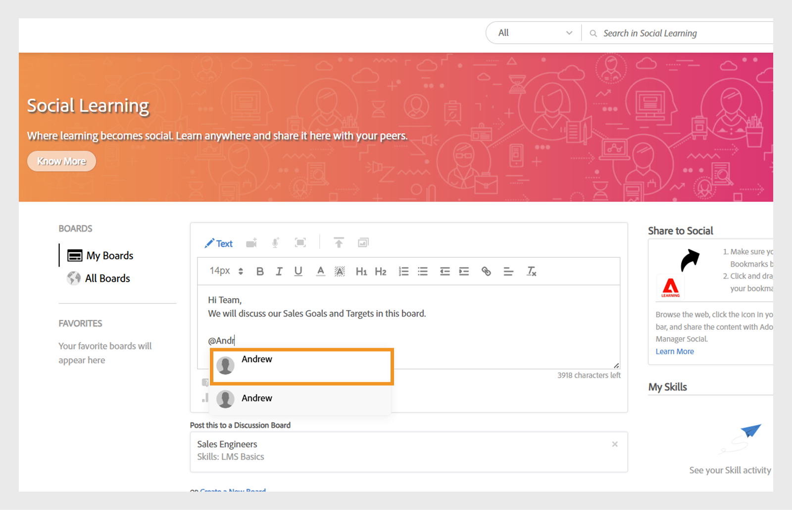
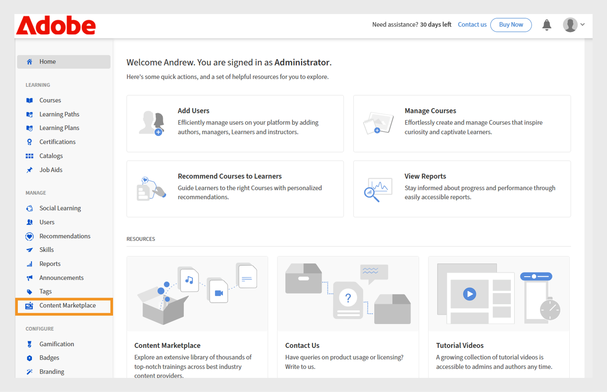
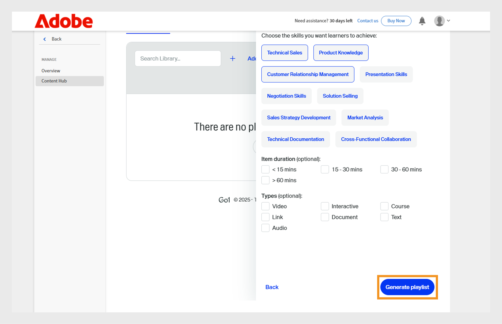
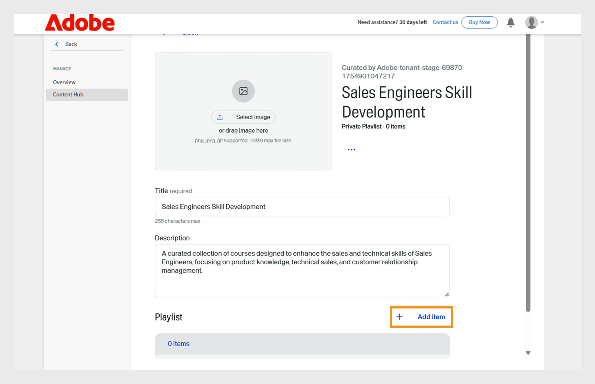
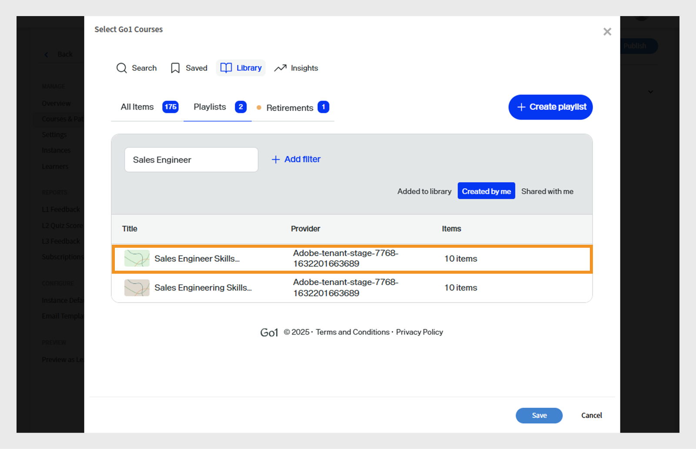

# Nouveautés de la version d’octobre 2025 de Adobe Learning Manager

>[!IMPORTANT]
>
>Veuillez noter que les fonctionnalités décrites sont provisoires et sujettes à changement. Pour obtenir de plus amples informations et une confirmation, veuillez contacter votre gestionnaire de succès client. Si vous rencontrez des problèmes, contactez notre équipe du service clientèle à l’adresse [learningmanagersupport@adobe.com](mailto:learningmanagersupport@adobe.com)

## Présentation de la version

La version d’octobre 2025 de Adobe Learning Manager introduit des améliorations significatives conçues pour améliorer la précision des rapports, étendre les capacités d’intégration et améliorer l’expérience d’apprentissage pour les administrateurs, les auteurs et les élèves. Les principales améliorations comprennent des relevés de notes améliorés des élèves qui capturent avec précision les terminaisons marquées par un instructeur, des rapports d&#39;utilisateur étendus avec des champs d&#39;identification supplémentaires et des rapports d&#39;assistances à la tâche avec des liens de téléchargement directs.

Cette version introduit également des autorisations d’annonce étendues pour les administrateurs personnalisés, une fonctionnalité de balisage des utilisateurs dans les forums d’apprentissage par les réseaux sociaux et un suivi de la progression basé sur la langue qui préserve la progression des élèves entre différentes langues. Les fonctionnalités supplémentaires incluent des améliorations de l&#39;intégration Go1 avec la création de listes de lecture assistée par l&#39;IA, une gestion des rôles personnalisée améliorée avec prise en charge de l&#39;importation incrémentielle et des API améliorées pour un meilleur suivi des performances du quiz et une surveillance de l&#39;état de la migration.

## Terminaisons marquées par l’instructeur dans les relevés de notes des élèves

**Présentation**

Les relevés de notes incrémentiels des élèves capturent désormais les terminaisons marquées par un instructeur, même si la participation est enregistrée après la date de la session.
Cette amélioration corrige une lacune critique dans les relevés de notes incrémentiels des élèves, où les terminaisons marquées par un instructeur étaient précédemment manquées si la participation était enregistrée après la date de la session d&#39;origine.

Les relevés de notes incrémentiels des élèves sont des rapports planifiés qui capturent uniquement les modifications (telles que les finalisations ou les mises à jour de la progression) qui se produisent au cours d’une période spécifiée, plutôt que de fournir un vidage complet des données historiques. Ils sont couramment utilisés pour l’automatisation, les tableaux de bord et les intégrations, ce qui permet aux utilisateurs de suivre efficacement les activités d’apprentissage récentes sans traiter l’ensemble de l’historique des relevés de notes à chaque fois.

**Nouveautés**

* **Colonne Marquer la date de fin (fuseau horaire UTC)** : nouvelle colonne d’horodatage qui capture la date et l’heure exactes auxquelles un instructeur marque une session ou un module comme terminé.
* **Suivi amélioré de la source d’achèvement** : effectue le suivi de l’instructeur et du module spécifiques (par exemple, « Salle de classe ») où les achèvements ont été enregistrés.

Ces modifications garantissent que les terminaisons marquées après la date de la session sont correctement reflétées dans les relevés de notes incrémentiels des élèves.

**Principaux avantages**

* Capture toutes les finalisations dans des rapports incrémentiels, quel que soit le moment où l&#39;assiduité est marquée.
* Fournit une piste d&#39;audit claire pour la conformité et le reporting.
* Prend en charge l’automatisation et les tableaux de bord pour les exigences réglementaires.

**Cas d’utilisation**

* Organisations disposant de sessions en salle de classe où les instructeurs peuvent marquer les jours de présence après la session réelle.
* Systèmes automatisés ou tableaux de bord reposant sur des relevés de notes incrémentiels des élèves pour la conformité ou la création de rapports.

### Relevé de notes de l’élève avec la nouvelle colonne

Consultez cet [article](/help/migrated/administrators/feature-summary/learner-transcripts.md) pour savoir comment télécharger le relevé de notes de l’élève.

Le rapport Relevé de notes de l’élève téléchargé contient la nouvelle colonne : Marquer la date de fin (fuseau horaire UTC).


_Le rapport Relevé de notes de l’élève affiche une nouvelle colonne en jaune mettant en évidence les dates d’achèvement individuelles pour chaque utilisateur_

## Rapport utilisateur amélioré avec champs de données étendus

**Présentation**

Le rapport d’utilisateur inclut désormais des champs supplémentaires pour améliorer le suivi des utilisateurs et le mappage organisationnel.

**Nouveautés**

* Colonne ID utilisateur interne : fournit des identifiants internes uniques pour un suivi fluide des utilisateurs entre différents systèmes et points d’entrée API.
* Colonne E-mail du responsable : inclut les coordonnées du responsable direct pour le suivi de la hiérarchie de l’organisation.

**Principaux avantages**

* Identification simplifiée des utilisateurs et élimination des problèmes lors du mappage des utilisateurs sur plusieurs systèmes.
* Prend en charge les workflows de gestion des utilisateurs en aval grâce aux fonctionnalités d’intégration.
* Amélioration de la cartographie organisationnelle et de la compréhension des relations hiérarchiques.
* Maintient les limites organisationnelles et empêche les communications croisées accidentelles.

**Remarques importantes**

* Si la portée d&#39;un administrateur personnalisé change, les annonces affectées affichent une icône d&#39;avertissement et nécessitent des réinitialisations de portée individuelles.
* Chaque annonce doit être mise à jour individuellement lorsque des modifications de portée se produisent.
* Le rapport Annonce de notification affiche uniquement les élèves compris dans la portée affectée par l’administrateur personnalisé.

### Rapport utilisateur avec la nouvelle colonne

Consultez cet [article](/help/migrated/administrators/feature-summary/reports.md#user-activity-dashboards) pour savoir comment télécharger le rapport d&#39;utilisateur.

Le fichier de rapport d’utilisateur téléchargé contient les nouvelles colonnes : ID utilisateur interne et E-mail du responsable.


_Rapports utilisateur mettant en évidence les ID utilisateur internes et les adresses e-mail des responsables pour rationaliser la gestion des utilisateurs_

## Rapport d’utilisateur FTP avec prise en charge d’ID utilisateur interne

**Présentation**

Le rapport d’utilisateur FTP inclut désormais la prise en charge des ID utilisateur internes, offrant une approche unifiée de l’exportation et de l’intégration des données pour les implémentations sans interface utilisateur.

**Nouveautés**

* Les rapports utilisateur sont désormais disponibles via [FTP personnalisé](/help/migrated/integration-admin/feature-summary/connectors.md#custom-ftp) parallèlement aux rapports existants (relevés de notes de ludification, relevés de notes des élèves, rapport de formations).
* La colonne ID utilisateur interne est désormais cohérente avec toutes les méthodes d’exportation (FTP, API des tâches et interface utilisateur).

**Principaux avantages**

* Gestion simplifiée des données avec une source unique pour tous les rapports nécessaires.
* Meilleure cohérence des données en assurant une identification uniforme des utilisateurs au cours des périodes de déclaration.
* Prise en charge automatisée des workflows en activant des workflows d’opérations et d’analyse en bloc avec des identificateurs cohérents.
Le rapport d’utilisateur téléchargé à partir du dossier FTP contient la nouvelle colonne, ID utilisateur interne.

## Inclure les utilisateurs suspendus dans les relevés de notes des élèves

**Présentation**

Les organisations peuvent désormais inclure des utilisateurs suspendus (ceux dont les profils externes sont désactivés) dans les relevés de notes des élèves, garantissant ainsi la conservation complète de l’historique des données d’apprentissage.

**Nouveautés**

* Visibilité configurable des utilisateurs suspendus avec un indicateur au niveau du compte pour inclure les utilisateurs suspendus dans les relevés de notes des élèves.
* Conservation des données historiques même après la désactivation des profils externes suspendus.

**Exigences de mise en œuvre**

* Contactez votre gestionnaire de succès client (CSM) pour activer l’indicateur au niveau du compte.

>[!NOTE]
>
>Cet indicateur est désactivé par défaut pour les comptes existants et doit être explicitement demandé pour les nouveaux comptes.

## Autorisations d’annonce étendues pour les administrateurs personnalisés

**Présentation**

Les administrateurs personnalisés peuvent désormais créer des annonces, mais uniquement pour les groupes d&#39;utilisateurs ou les catalogues qui leur sont attribués. Cela empêche toute communication involontaire au-delà des frontières de l’entreprise.

**Nouveautés**

* Les administrateurs personnalisés peuvent uniquement créer des annonces pour les utilisateurs faisant partie de leur portée assignée.
* Les annonces peuvent être limitées à des groupes d&#39;utilisateurs ou des catalogues spécifiques.
* Les administrateurs complets conservent la visibilité et le contrôle de toutes les annonces, y compris celles créées par les administrateurs personnalisés étendus.

**Principaux avantages**

* Communication ciblée garantissant que les annonces n&#39;atteignent que les publics concernés.
* Réduction de la surcharge d’informations en empêchant les notifications non pertinentes d’atteindre des utilisateurs non prévus.
* Maintient les limites organisationnelles et empêche les communications croisées accidentelles.

**Remarques importantes**

* Si la portée d&#39;un administrateur personnalisé change, les annonces affectées affichent une icône d&#39;avertissement et nécessitent des réinitialisations de portée individuelles.
* Chaque annonce doit être mise à jour individuellement lorsque des modifications de portée se produisent.
* Le rapport Annonce de notification affiche uniquement les élèves compris dans la portée affectée par l’administrateur personnalisé.

**Cas d’utilisation**

* Organismes de franchise où les gestionnaires régionaux doivent communiquer uniquement avec leurs franchisés.
* Grandes organisations avec des administrateurs régionaux ou départementaux ciblant les annonces à leurs équipes.

### Créer une annonce pour la portée affectée

Un administrateur personnalisé peut créer des annonces limitées aux groupes d&#39;utilisateurs et aux catalogues qui lui sont attribués, ce qui garantit que les messages atteignent le bon public et empêche les notifications inutiles.

Pour créer une annonce pour la portée affectée :

1. Connectez-vous à Adobe Learning Manager en tant qu’administrateur.
2. Sélectionnez **[!UICONTROL Annonce]** dans le volet de navigation de gauche.
3. Sélectionnez **[!UICONTROL Ajouter]**.

   
   _Page Annonces dans Adobe Learning Manager, où les administrateurs peuvent créer et gérer des annonces pour des groupes d&#39;utilisateurs ciblés_

4. Sélectionnez le **[!UICONTROL Type d&#39;annonce]** dans le menu déroulant.
a. **[!UICONTROL En tant que notification]**
b. **[!UICONTROL En tant qu&#39;en-tête]**
c. **[!UICONTROL Comme recommandation]**
d. **[!UICONTROL Comme e-mail]**
5. Sélectionnez **[!UICONTROL En Tant Qu&#39;En-Tête]**.
6. Sélectionnez la langue et chargez une image pour l’en-tête.
7. Ajoutez éventuellement une URL pour le bouton d’action.

   
   _Écran Créer une annonce permettant aux administrateurs de définir le type d&#39;annonce, de télécharger des pièces jointes et d&#39;ajouter des boutons d&#39;action_

   La portée affectée est présélectionnée dans la section **[!UICONTROL Portée]** et ne peut pas être modifiée par les administrateurs.

   >[!NOTE]
   >
   >**[!UICONTROL Pour les notifications]** et les annonces **[!UICONTROL par e-mail]**, ils peuvent inclure des groupes d&#39;utilisateurs et des catalogues supplémentaires si ceux-ci chevauchent leur portée attribuée.

8. Sélectionnez **[!UICONTROL Enregistrer]**.

Seuls les élèves relevant de la portée de l’administrateur personnalisé pourront afficher l’annonce. Consultez cet [article](/help/migrated/administrators/feature-summary/announcements.md) pour apprendre à créer plusieurs types d&#39;annonces.

## Balisage des utilisateurs dans les forums de réseaux sociaux

**Présentation**

Les forums d’apprentissage par les réseaux sociaux prennent désormais en charge la fonctionnalité de balisage des utilisateurs, ce qui permet des discussions plus ciblées et une meilleure collaboration au sein des communautés d’apprentissage. Les élèves peuvent être balisés dans les publications et les commentaires d’apprentissage par les réseaux sociaux via l’application d’élève, les API et le site de référence Adobe Learning Manager.

**Nouveautés**

* **@username** : les utilisateurs peuvent baliser d&#39;autres membres du forum à l&#39;aide du format « @username ».
* **Balisage limité à la portée** : seuls les utilisateurs ayant accès au forum spécifique peuvent être balisés, ce qui garantit la confidentialité et la pertinence.
* **Notifications multicanaux** : les utilisateurs balisés reçoivent des notifications dans l’application et par e-mail avec des liens directs vers les publications ou commentaires pertinents.

**Fonctionnalités clés**

* Impossible de baliser les utilisateurs en dehors de la portée du forum, ce qui empêche les notifications indésirables.
* Si un utilisateur balisé est supprimé du système, sa mention apparaît comme « anonyme ».
* Le balisage des groupes d&#39;utilisateurs ou « @all » n&#39;est pas autorisé pour empêcher le spam de notification.

**Cas d’utilisation**

* Professionnels de la santé cherchant à obtenir l’avis de collègues spécifiques sur des cas médicaux.
* Des experts sont consultés sur des sujets spécialisés.
* Discussions d&#39;équipe nécessitant la contribution d&#39;intervenants particuliers.
* Séances de partage de connaissances avec la participation ciblée d&#39;experts.

### Balisage des utilisateurs dans les publications sur les forums de réseaux sociaux

Les élèves peuvent désormais baliser des membres du forum spécifiques dans les publications ou les commentaires à l’aide de @username. Le balisage est limité aux membres ayant accès à ce forum.

Pour baliser des utilisateurs dans un forum de réseaux sociaux :

1. Connectez-vous à Adobe Learning Manager en tant qu’élève.
2. Sélectionnez **[!UICONTROL Apprentissage par les réseaux sociaux]** dans le navigateur de gauche.

   
   _Activez l’apprentissage collaboratif en sélectionnant Apprentissage par les réseaux sociaux pour accéder aux forums de discussion, partager des informations et baliser les utilisateurs pour une interaction interactive_

3. Sélectionnez **[!UICONTROL Nouvelle publication]**.

   
   _Démarrer une nouvelle discussion en sélectionnant Nouvelle publication dans Apprentissage par les réseaux sociaux pour partager des connaissances avec les utilisateurs balisés_

4. Avant de baliser les utilisateurs, sélectionnez le forum dans l&#39;option **[!UICONTROL Publier dans un forum de discussion]**.

   
   _Sélectionnez un forum de discussion pour publier et baliser les utilisateurs, ce qui permet des conversations collaboratives ciblées dans l&#39;apprentissage par les réseaux sociaux_

5. Saisissez les détails de votre publication, puis balisez un utilisateur en saisissant le symbole @ suivi de son nom (par exemple, @andrew). Lorsque vous tapez @ suivi des trois premières lettres du nom de l’utilisateur, une liste des utilisateurs correspondants s’affiche.

   
   _Marquez les utilisateurs dans votre message de discussion en saisissant @ suivi du nom d’utilisateur pour permettre une collaboration ciblée au sein des forums d’apprentissage par les réseaux sociaux_

6. Sélectionnez l’utilisateur souhaité dans la liste.
7. Sélectionnez **[!UICONTROL Publier]**.

Les utilisateurs balisés reçoivent des notifications dans l’application et par e-mail avec un lien direct vers la publication, ce qui rend les discussions plus ciblées et collaboratives.

### Balisage des utilisateurs en fonction de la portée du forum

Le balisage limité à la portée permet aux utilisateurs de baliser uniquement les élèves qui ont l’autorisation d’accéder à un forum spécifique. Cela permet de préserver la confidentialité en empêchant le balisage des utilisateurs en dehors de la portée.

Si vous essayez de baliser les élèves qui ne sont pas concernés par le forum, aucune suggestion ne s&#39;affiche et vous ne pourrez pas les baliser. Reportez-vous à cet [article](/help/migrated/administrators/feature-summary/social-learning-configurations-as-an-admin.md) pour en savoir plus sur l&#39;étendue de l&#39;apprentissage par les réseaux sociaux.

## Balisage des utilisateurs supprimés dans les commentaires

Si un utilisateur qui a été supprimé est balisé dans une publication d’apprentissage par les réseaux sociaux, son nom s’affichera comme Anonyme dans la publication. Le commentaire et la balise restent visibles pour le contexte, mais le lien de profil ou les détails ne sont pas affichés.


_Publication d’apprentissage par les réseaux sociaux montrant comment un utilisateur supprimé apparaît comme anonyme lorsqu’il est balisé_

## Rapport Assistances à la tâche avec liens d’accès direct

**Présentation**

Le rapport Assistances à la tâche a été amélioré pour inclure des liens de téléchargement directs vers les assistances à la tâche, rationalisant la gestion du contenu et les processus d’audit pour les administrateurs et les auteurs.

**Nouveautés**

* Colonne Lien d’assistance à la tâche : accès direct aux fichiers d’assistance à la tâche et aux URL externes à partir du rapport.
* Contrôle d’accès basé sur les rôles : l’accessibilité des liens dépend des rôles utilisateur et des autorisations du catalogue.
* Les assistances à la tâche supprimées restent accessibles si elles sont toujours liées à des cours actifs.

**Principaux avantages**

* Téléchargements directs de fichiers et accès aux URL à partir du rapport.
* Élimine les tâches manuelles de localisation et de téléchargement des assistances à la tâche pour les audits de conformité ou d’accessibilité.

**Cas d’utilisation**

* Les auteurs ou les administrateurs effectuent régulièrement des audits d’accessibilité sur les assistances à la tâche, comme l’exigent les grandes organisations.
* Tout scénario dans lequel un accès rapide et basé sur les rôles aux fichiers d’assistance à la tâche est nécessaire pour la révision ou la conformité.

### Rapport d&#39;assistances à la tâche avec la nouvelle colonne

Consultez cet [article](/help/migrated/administrators/feature-summary/reports.md#job-aids-report) pour savoir comment télécharger le rapport d&#39;assistances à la tâche.

Le rapport Assistances à la tâche peut être téléchargé à partir de la section Rapports et comprend désormais des liens de téléchargement direct pour chaque assistance à la tâche.


_Le rapport Assistances à la tâche affiche des liens de téléchargement directs, ce qui facilite l&#39;accès et le téléchargement des assistances à la tâche dans Adobe Learning Manager_

## Mises à jour d’API

### Améliorations de l’API de l’élève pour le suivi des performances du quiz

**Présentation**

L&#39;API `GET /loResourceGrades` a été améliorée pour fournir des données détaillées sur les performances du quiz, permettant des analyses plus sophistiquées et une prise de décision automatisée.

**Nouveautés**

La réponse de l’API inclut désormais deux champs supplémentaires :

* **[!UICONTROL meilleur score]** : meilleur score obtenu par un élève lors de toutes les tentatives de quiz
* **[!UICONTROL score max]** : score total possible pour le quiz

**Exemple de réponse API**

```
{
    "links": {
        "self": "https://learningmanagerstage1.adobe.com/primeapi/v2/loResourceGrades/course:15067_30122_41715_1_3400468"
    },
    "data": {
        "id": "course:15067_30122_41715_1_3400468",
        "type": "learningObjectResourceGrade",
        "attributes": {
            "completed": false,
            "duration": 0,
            "hasPassed": false,
            "highestScore": 0,
            "maxScore": 0,. 
            "progressPercent": 0,
            "score": 0
        },
        "relationships": {
            "loResource": {
                "data": {
                    "id": "course:15067_30122_41715_1",
                    "type": "learningObjectResource"
                }
            }
        }
    }
}
```

En réponse, **course:15067_30122_41715_1_3400468** est l&#39;ID de la note de la ressource Objet d&#39;apprentissage pour laquelle les informations sont demandées. L&#39;ID `learningObjectResourceGrad`e peut être obtenu à partir de l&#39;API `GET /enrollments/{id}`.

**Principaux avantages**

* Analyse détaillée des performances du quiz pour mesurer l&#39;efficacité de l&#39;apprentissage.
* Prend en charge les règles de progression basées sur les meilleures réussites plutôt que sur les tentatives les plus récentes.
* Fournit une image complète des performances du quiz de l&#39;élève au fil du temps.

**Fonctionnement de l&#39;API**

1. Un utilisateur tente un quiz plusieurs fois ; chaque tentative est enregistrée.
2. L’API fournit à la fois le score le plus élevé atteint et le score maximal possible pour le quiz.
3. Les systèmes externes peuvent utiliser ces données pour déclencher des actions automatisées, telles que l&#39;inscription d&#39;utilisateurs à de nouveaux cours en fonction de leurs meilleures performances.

**Cas d’utilisation**

* Les systèmes d’apprentissage sans interface utilisateur nécessitent des décisions d’inscription automatisées.
* Les plateformes d’analyse de l’apprentissage suivent les modèles de réussite des élèves.
* Systèmes de conformité avec exigences de progression basées sur les performances.

### Améliorations de l’API de migration

**Présentation**
Adobe Learning Manager prend désormais en charge la migration de divers objets de données vers un compte via le processus de migration. Ce processus peut être lancé via les API et l’interface utilisateur. Lorsqu’une migration échoue, des erreurs sont disponibles au téléchargement via l’interface. Ces erreurs sont utiles pour déboguer les erreurs de migration et gérer les exécutions de migration.

Avec cette version, les journaux d’erreurs seront également disponibles au téléchargement via les API pour un suivi et un débogage des erreurs par programmation efficaces.

**Modifications d’API**

Il existe une nouvelle API de migration, `runStatus`, qui permet aux administrateurs d’intégration de vérifier l’état des exécutions de migration déclenchées via l’API, ce qui n’était pas possible dans les versions précédentes de Adobe Learning Manager.

En outre, l&#39;API `runStatus` fournit désormais un lien direct pour télécharger les journaux d&#39;erreurs (CSV) pour les exécutions terminées. Notez que le lien est valide pendant sept jours uniquement et que les journaux sont conservés pendant un mois.

La réponse de l&#39;API `startRun` a été mise à jour pour inclure l&#39;ID de projet de migration, l&#39;ID de sprint et l&#39;ID de série de sprint, qui sont requis pour interroger le nouveau point de terminaison d&#39;état.

#### API runStatus

**Description**

Récupère l&#39;état d&#39;une exécution de migration existante.

**Point de terminaison**

```
GET /bulkimport/runStatus
```

**Paramètres**

* **migrationProjectId** : (obligatoire). Identificateur unique d&#39;un projet de migration. Un projet de migration est utilisé pour transférer des données et du contenu d’un système de gestion de l’apprentissage (LMS) existant vers Adobe Learning Manager. Chaque projet de migration peut se composer de plusieurs sprints, qui sont des unités plus petites de tâches de migration.

* **sprintId** : (obligatoire). Identificateur unique d’un sprint dans un projet de migration. Un sprint est un sous-ensemble de tâches de migration qui inclut des éléments d’apprentissage spécifiques (par exemple, cours, modules, dossiers d’élève) à migrer d’un LMS existant vers Adobe Learning Manager. Chaque sprint peut être exécuté indépendamment, ce qui permet une migration progressive.

* **sprintRunId** : (obligatoire). Identificateur unique utilisé pour suivre l’exécution d’un sprint spécifique dans un projet de migration. Elle est associée au processus de migration réel des éléments définis dans un sprint. Le sprintRunId permet de surveiller, de dépanner et de gérer le travail de migration.

**Réponse**

```
{
  "sprintId": 2510080,
  "sprintRunId": 2740845,
  "migrationProjectId": 2509173,
  "startTime": 1746524711052,
  "endTime": 1746524711052,
  [
    {
      "id": 2609923,
      "lastHeartbeatTime": 1746524711052,
      "objectName": "content",
      "jobState": "COMPLETED",
      "errorCsvLink": "",
      "errorLogLink": "migration/5830/2509173/2510080/2740845/content_err.csv",
      "sequenceNumber": 1
    },
    {
      "id": 2609922,
      "lastHeartbeatTime": 1746524713577,
      "objectName": "course",
      "jobState": "WAITING_IN_QUEUE",
      "errorCsvLink": "",
      "errorLogLink": null,
      "sequenceNumber": 2
    }
  ]
}
```

#### API startRun

La réponse API `startRun` a été mise à jour pour inclure trois champs supplémentaires : migrationProjectId, sprintId et sprintRunId. Ces champs permettent aux utilisateurs de suivre et d’interroger l’état d’exécutions de migration spécifiques à l’aide de la nouvelle API runStatus.

```
curl -X GET --header 'Accept: text/html' 'https://learningmanager.adobe.com/primeapi/v2/bulkimport/runStatus?migrationProjectId=001&sprintId=10001&sprintRunId=7'
```

Produit la réponse suivante. La réponse contient :

* migrationId
* sprintId
* sprintRunId

**Réponse**

```
{
  "status": "OK",
  "title": "BULKIMPORT_RUN_INITIATED_SUCCESSFULLY",
  "source": {
    "info": "Success",
    "migrationInfo": {
      "migrationProjectId": "001",
      "sprintId": "10001",
      "sprintRunId": "7"
    }
  }
}
```

### Modifications de l’API pour les réseaux sociaux (balise utilisateur, commentaires et réponses)

**Présentation**

Adobe Learning Manager prend désormais en charge la fonctionnalité de balisage des @user dans les forums d’apprentissage par les réseaux sociaux, ce qui permet aux élèves de mentionner et d’informer leurs homologues dans les publications, les commentaires et les réponses. Cette fonctionnalité améliore la collaboration et la découverte de contenu sur toute la plateforme.

Cette version introduit de nouvelles fonctionnalités d’API pour prendre en charge les mentions d’utilisateurs, y compris un POST et des points de terminaison de GET améliorés, ainsi qu’une nouvelle fonctionnalité de recherche pour les utilisateurs balisés.

**Présentation des modifications d’API**

* API de POST mises à jour pour la création de publications/commentaires/réponses avec des mentions d’utilisateur
* API GET mises à jour avec les données de mention utilisateur dans les réponses

**Format des mentions utilisateur**

Un utilisateur est mentionné en utilisant le format : @(utilisateur:userId)

#### Créer un post avec des mentions

**Point de terminaison**

```
POST /primeapi/v2/posts
```

**Description**

Créez une nouvelle publication d’apprentissage par les réseaux sociaux avec des mentions d’utilisateur.

**Corps de la demande**

```
{
  "data": {
    "type": "post",
    "attributes": {
      "boardId": 13282,
      "accountId": 11152,
      "text": "<p>This is a new post mentioning @[user:11257229]</p>",
      "createdByUserId": 11257228,
      "postType": "discussion"
    },
    "id": null
  }
}
```

**Réponse**

Réponse de post-création standard avec les données de mention incluses dans la relation _userMentions_.

#### Créer un commentaire avec des mentions

**Point de terminaison**

```
POST /primeapi/v2/comments
```

**Description**

Ajoutez un commentaire à une publication avec des mentions d’utilisateur.

**Corps de la demande**

```
{
  "data": {
    "type": "comment",
    "attributes": {
      "postId": 20746,
      "accountId": 11152,
      "text": "<p>Test Comment @[user:11257229]</p>",
      "createdByUserId": 11257228,
      "commentLevel": 0
    },
    "id": null
  }
}
```

#### Créer une réponse avec des mentions

**Point de terminaison**

```
POST /primeapi/v2/replies
```

**Description**

Réponse à un commentaire avec des mentions d’utilisateur.

**Corps de la demande**

```
{
  "data": {
    "type": "reply",
    "attributes": {
      "postId": 20746,
      "accountId": 11152,
      "text": "<p>Thanks for the update @[user:11257229]</p>",
      "createdByUserId": 11257228,
      "commentLevel": 1,
      "parentCommentId": 55621
    },
    "id": null
  }
}
```

#### Récupérer les publications avec des mentions

**Point de terminaison**

```
GET /primeapi/v2/posts/{id}
```

**Description**

Récupérez les détails de la publication, y compris les utilisateurs mentionnés.

**Réponse**

```
{
  "links": {
    "self": "https://learningmanager.adobe.com/primeapi/v2/posts/7522"
  },
  "data": {
    "id": "7522",
    "type": "post",
    "attributes": {
      "commentCount": 3,
      "dateCreated": "2025-06-10T11:33:29.000Z",
      "dateUpdated": "2025-06-25T14:52:04.000Z",
      "downVote": 0,
      "postingType": "DEFAULT",
      "richText": "<p>my updated fourth post @[user:14707776] second mention my first post</p>",
      "state": "ACTIVE",
      "text": "my updated fourth post @[user:14707776] second mention my first post",
      "upVote": 0,
      "viewsCount": 0
    },
    "relationships": {
      "createdBy": {
        "data": {
          "id": "14707776",
          "type": "user"
        }
      },
      "parent": {
        "data": {
          "id": "3971",
          "type": "board"
        }
      },
      "userMentions": {
        "data": [
          {
            "id": "14707776",
            "type": "user"
          }
        ]
      }
    }
  },
  "included": [
    {
      "id": "14707776",
      "type": "user",
      "attributes": {
        "avatarUrl": "https://cpcontents.adobe.com/public/images/default_user_avatar.svg",
        "binUserId": "45664b87-75a3-43ec-b0b7-5064958eac6f",
        "email": "user@example.com",
        "enrollOnClick": false,
        "fields": {
          "Location": "BLR"
        },
        "gamificationEnabled": true,
        "lastLoginDate": "2025-06-27T11:21:17.000Z",
        "name": "John Doe",
        "pointsEarned": 1690,
        "pointsRedeemed": 0,
        "preferredResolution": "AUTO",
        "profile": "admin",
        "roles": [
          "Learner",
          "Admin",
          "Author",
          "Instructor",
          "Integration Admin",
          "Manager"
        ],
        "state": "ACTIVE",
        "userType": "Internal"
      },
      "relationships": {
        "account": {
          "data": {
            "id": "9238",
            "type": "account"
          }
        }
      }
    }
  ]
}
```

### Modifications de l’API pour les réseaux sociaux (recherche utilisateur)

**Point de terminaison**

```
GET /primeapi/v2/users/search?q={searchTerm}&context=tagging
```

**Description**

Recherchez les utilisateurs disponibles pour le balisage en fonction des paramètres de portée sociale.

**Paramètres de demande**


* q (obligatoire) : terme de recherche (au moins 3 caractères).
* context : Définissez « tagging » pour que les utilisateurs soient éligibles aux mentions.
* boardId (facultatif) : ID de la carte pour filtrer les utilisateurs en fonction des autorisations d’accès.

**Réponse**

```
{
  "data": [
    {
      "id": "11257229",
      "type": "user",
      "attributes": {
        "name": "Jane Smith",
        "email": "jane.smith@example.com",
        "avatarUrl": "https://cpcontents.adobe.com/public/images/default_user_avatar.svg",
        "userType": "Internal",
        "state": "ACTIVE"
      }
    }
  ]
}
```

### Directives de mise en œuvre

#### Limites de caractères

* Publications : une limite de 4 000 caractères s’applique, chaque utilisateur balisé réduisant les caractères disponibles d’une quantité fixe.
* Commentaires : limite de 1 000 caractères.

#### Validation de la mention

* Les utilisateurs peuvent uniquement être balisés par nom d’utilisateur ou adresse e-mail (pas par UUID).
* Les utilisateurs internes ne peuvent pas baliser les utilisateurs externes et vice versa.
* La disponibilité du balisage suit les paramètres de portée sociale existants.
* Les autorisations du forum déterminent l’éligibilité au balisage (public/privé).

#### Notifications

* Plusieurs mentions d’un même utilisateur dans une même publication entraînent une seule notification.
* Le propriétaire de la publication d’origine reçoit des notifications uniquement lorsqu’il possède une balise spécifique.

#### Gestion des erreurs

* Les ID utilisateur non valides dans les mentions renvoient des erreurs de validation.
* Le RGPD et les utilisateurs dont la suppression est logicielle apparaissent anonymes dans le contenu balisé.

### Progression de l’élève en fonction de la langue

Actuellement, la progression de l’élève est suivie uniquement pour la langue des paramètres régionaux sélectionnée, ce qui entraîne une perte de progression significative lors du changement de langue/de paramètres régionaux dans le lecteur. Cette limitation crée une mauvaise expérience utilisateur où les élèves perdent leur progression d’apprentissage lorsqu’ils explorent du contenu dans différentes langues.

**Problèmes actuels**

* **Remplacement de la progression** : la progression de chaque module du lecteur est suivie au niveau de l&#39;utilisateur et du module. Cela conduit à une situation où la progression d&#39;un utilisateur est remplacée lorsqu&#39;il revient à un paramètre régional précédemment utilisé pour le même module.
* **Réinitialisation de la progression** : par exemple, si un élève atteint 75 % de progression dans la langue A (anglais), puis passe à la langue B (espagnol), lors du retour à la langue A, sa progression est réinitialisée à 0 % au lieu de reprendre à 75 %.

Pour résoudre ces limitations, l’API a été améliorée pour prendre en charge le suivi de la progression spécifique aux paramètres régionaux :

* **Stockage spécifique aux paramètres régionaux** : lorsqu&#39;un élève change de paramètres régionaux (par exemple, de Paramètres régionaux A à Paramètres régionaux B) dans le lecteur, le système enregistre désormais l&#39;état de progression séparément pour chaque paramètre régional du contenu.
* **Reprise de la progression** : lorsque l&#39;utilisateur revient à un paramètre régional précédemment utilisé (de la langue B à la langue A), le contenu reprend là où il s&#39;était arrêté dans ce paramètre régional spécifique.
* **Suivi de progression indépendant** : chaque paramètre régional conserve son propre état de progression, ce qui permet aux élèves d&#39;explorer le contenu dans plusieurs langues sans perdre leur progression individuelle dans chaque langue.

#### Modifications de l’API

Les API suivantes ont été améliorées pour prendre en charge le nouveau paramètre de paramètres régionaux :

* API d’état du lecteur GET
* API d’état du lecteur POST

#### API d’état du lecteur GET

**Point de terminaison**

```
GET /primeapi/v2/users/{userId}/playerState
```

**Description**

Récupère l&#39;état actuel d&#39;un objet d&#39;apprentissage pour un utilisateur et des paramètres régionaux spécifiques.

**Paramètres**

| Paramètre | Type | Lieu | Requis | Description |
|---|---|---|---|---|
| userId | String | Chemin | Oui | Identificateur unique de l&#39;utilisateur |
| loId | String | Requête | Oui | Identificateur d&#39;objet d&#39;apprentissage au format lo:{id} |
| loResourceId | String | Requête | Oui | Identificateur de ressource d&#39;objet d&#39;apprentissage dans le cours de format :{loId_loInstanceId_moduleId_moduleVersion} |
| csrf_token | String | Requête | Oui | Jeton de protection CSRF |
| paramètres régionaux | String | Requête | Facultatif | Identificateur de paramètres régionaux pour la progression spécifique à la langue (par exemple, « en-US », « es-ES ») |

**Exemple de requête**

```
GET /primeapi/v2/users/12345/playerState?loId=lo:67890&loResourceId=course:67890_1_mod123_v2&csrf_token=abc123&locale=en-US
```

**Comportement de la réponse**

* Si le paramètre locale est fourni et qu’un état spécifique aux paramètres régionaux existe, l’API renvoie la progression pour ces paramètres régionaux.
* Si le paramètre locale est fourni, mais qu’il n’existe aucun état spécifique aux paramètres régionaux, l’API effectue une recherche de remplacement pour l’état par défaut.
* Si le paramètre locale est omis, l’API renvoie l’état par défaut (conserve la rétrocompatibilité).
* Pour les demandes sans en-tête où la langue est Null, l’API revient à la recherche d’état par défaut.

#### API d’état du lecteur POST

**Point de terminaison**

POST /primeapi/v2/users/{userId}/playerState

**Description**

Met à jour ou crée l’état actuel d’un objet d’apprentissage pour un utilisateur et des paramètres régionaux spécifiques.

**Paramètres**

| Paramètre | Type | Lieu | Requis | Description |
|---|---|---|---|---|
| userId | String | Chemin | Oui | Identificateur unique de l&#39;utilisateur |
| loId | String | Requête | Oui | Identificateur d&#39;objet d&#39;apprentissage au format lo:{id} |
| loResourceId | String | Requête | Oui | Identificateur de ressource d&#39;objet d&#39;apprentissage dans le cours de format :{loId_loInstanceId_moduleId_moduleVersion} |
| csrf_token | String | Requête | Oui | Jeton de protection CSRF |
| paramètres régionaux | String | Requête | Facultatif | Identificateur de paramètres régionaux pour language-sp |

**Corps de la demande**

Le corps de la demande contient les données d’état de l’objet d’apprentissage spécifiques aux paramètres régionaux.

**Exemple de requête**

```
POST /primeapi/v2/users/12345/playerState?loId=lo:67890&loResourceId=course:67890_1_mod123_v2&csrf_token=abc123&locale=en-US
```

```
{
  "progress": 75,
  "completionStatus": "incomplete",
  "timeSpent": 1800,
  "lastAccessedPage": 5,
  // Additional state data
}
```

L’API crée ou met à jour l’état de l’objet d’apprentissage pour les paramètres régionaux spécifiés.

## Améliorations de l’intégration Go1

**Présentation**

L’intégration Go1 a été améliorée pour prendre en charge la gestion des listes de lecture, la création de parcours d’apprentissage et les workflows de certification récurrents, tout en passant à un modèle de contenu de prévisualisation et d’achat.

**Nouveautés**

* Créez et gérez des listes de lecture directement dans Go1 à l’aide de l’assistance par chat IA ou de la sélection manuelle.
* Convertissez facilement des listes de lecture Go1 en parcours d’apprentissage Adobe Learning Manager.
* Incluez les cours Go1 dans les cycles de certification récurrents avec réinitialisation automatique de la progression.
* Interface de découverte de contenu mise à niveau pour améliorer la navigation et la curation du contenu.
* Transition du contenu gratuit au modèle de coût transparent.

**Principaux avantages**

* La création de listes de lecture assistées par l’IA accélère considérablement le regroupement et la diffusion de contenu.
* Permet l’utilisation du contenu Go1 pour les besoins récurrents de formation aux réglementations.
* Un modèle clair de prévisualisation et d’achat permet de prendre des décisions éclairées en matière d’investissement dans le contenu.
* Outils de découverte et de curation améliorés pour une meilleure gestion du contenu.

**Remarques importantes**

* Toutes les fonctionnalités Go1 nécessitent une licence Go1 active.
* Le contenu Go1 gratuit précédent sera mis hors service. Les organisations doivent prévisualiser et acheter les offres groupées de contenu requises.
* Les administrateurs et les auteurs peuvent créer et gérer des listes de lecture ; les élèves conservent un accès en lecture seule.

**Cas d’utilisation**

* Organisations nécessitant des bibliothèques de contenu externes étendues pour des programmes de formation complets.
* Programmes de formation axés sur la conformité nécessitant des mises à jour régulières du contenu et des cycles de livraison.
* Les équipes d&#39;apprentissage cherchent à réduire les frais généraux de curation du contenu grâce à l&#39;assistance par IA.

### Création d’une liste de lecture Go1

Les administrateurs peuvent créer des listes de lecture avec des cours Go1 adaptés à différents groupes d&#39;élèves en fonction de l&#39;emplacement, du rôle, du produit et d&#39;autres critères. Les listes de lecture peuvent être créées manuellement ou générées à l’aide de l’IA.

Pour créer une liste de lecture :

1. Connectez-vous à Adobe Learning Manager en tant qu’administrateur.
2. Sélectionnez **[!UICONTROL Marché de contenus]** dans le navigateur de gauche.

   
   _Explorez et ajoutez les meilleurs cours Go1 à vos listes de lecture en sélectionnant Marché de contenus dans Adobe Learning Manager_

3. Sélectionnez **[!UICONTROL Hub de contenu]**, puis **[!UICONTROL Bibliothèque]**.
4. Sélectionnez **[!UICONTROL Créer une liste de lecture]** et choisissez l’une des options suivantes :
a. **[!UICONTROL avec l&#39;IA]** : créez une liste de lecture à l&#39;aide de l&#39;IA.
b. **[!UICONTROL par moi-même]** : créez une liste de lecture en y ajoutant manuellement des cours.

   
   _Créez une liste de lecture dans Adobe Learning Manager en sélectionnant Créer une liste de lecture pour organiser et proposer des cours ciblés à vos élèves_

**Créer une liste de lecture avec l&#39;IA**

Les administrateurs peuvent saisir la description de la liste de lecture dans l’invite AI. L’IA organisera les cours associés et créera une liste de lecture en fonction des exigences.

Pour créer une liste de lecture avec l’IA :

1. Sélectionnez **[!UICONTROL Créer une liste de lecture]**, puis sélectionnez **[!UICONTROL avec l&#39;IA]**.

   
   _Créez des listes de lecture sélectionnées avec l’IA, qui permet des recommandations de cours automatisées adaptées aux besoins des élèves_

2. Saisissez une brève description de votre liste de lecture dans le champ de texte **[!UICONTROL Entrez votre objectif d&#39;apprentissage]**.
3. Sélectionnez **[!UICONTROL Suivant]**.

   
   _Saisissez votre objectif d’apprentissage pour créer une liste de lecture personnalisée, afin que Adobe Learning Manager puisse recommander des cours ciblés adaptés aux besoins de vos élèves_

4. Choisissez les compétences dans la liste, puis sélectionnez la durée du cours et saisissez du texte pour votre liste de lecture.
5. Sélectionnez **[!UICONTROL Générer la liste de lecture]**.

   
   _Personnalisez votre liste de lecture dans Adobe Learning Manager en sélectionnant les compétences pertinentes et la durée du cours_


La liste de lecture est créée avec 10 cours et les administrateurs peuvent l’utiliser pour créer un parcours d’apprentissage.


_Vérifiez votre liste de lecture pour l’amélioration des compétences des ingénieurs des ventes dans Adobe Learning Manager_

**Créer une liste de lecture manuellement**

Sélectionnez manuellement les cours qui correspondent le mieux aux exigences des élèves et organisez d’autres cours pertinents.

Pour créer une liste de lecture manuellement :

1. Sélectionnez **[!UICONTROL Créer une liste de lecture]**, puis sélectionnez **[!UICONTROL par moi-même]**.

   
   _Créez manuellement une liste de lecture donnant aux administrateurs un contrôle total pour organiser les cours en fonction des besoins spécifiques des élèves_

2. Saisissez le titre et la description de votre liste de lecture.

   
   _Ajoutez un titre et une description à votre liste de lecture dans Adobe Learning Manager pour définir clairement son objectif et aider les élèves à progresser vers un développement de compétences ciblé_

3. Sélectionnez **[!UICONTROL Créer]**.
4. Sélectionnez **[!UICONTROL Ajouter un élément]** pour ajouter les cours associés.

   
   _Ajoutez des éléments à votre liste de lecture de développement des compétences des ingénieurs des ventes dans Adobe Learning Manager pour organiser des cours ciblés_

5. Recherchez et sélectionnez les cours requis.

La liste de lecture a été créée avec des cours associés et les administrateurs peuvent l’utiliser pour créer un parcours d’apprentissage.

### Ajouter une liste de lecture Go1 à un parcours d’apprentissage

Les administrateurs peuvent créer un parcours d’apprentissage qui comprend une liste de lecture Go1, afin que les élèves puissent accéder aux cours tiers sélectionnés dans le cadre de leur formation.

Pour créer un parcours d’apprentissage :

1. Connectez-vous à Adobe Learning Manager en tant qu’administrateur.
2. Sélectionnez **[!UICONTROL Parcours d’apprentissage]** dans le navigateur de gauche.
3. Sélectionnez **[!UICONTROL Ajouter]**.

   
   _Sélectionnez Ajouter dans la section Parcours d’apprentissage pour créer et organiser de nouveaux programmes de formation structurés pour vos élèves_

4. Saisissez les détails requis et sélectionnez **[!UICONTROL Enregistrer]**. Pour plus d&#39;informations, consultez cet [article](/help/migrated/administrators/feature-summary/learning-paths.md).
5. Sélectionnez **[!UICONTROL Ajouter des cours Go1]**.

   
   _Ajoutez des cours Go1 à votre liste de lecture de développement des compétences des ingénieurs des ventes pour élargir les options d’apprentissage avec du contenu tiers organisé_

6. Dans la **[!UICONTROL bibliothèque]**, recherchez et sélectionnez la liste de lecture sur l&#39;écran Sélectionner des cours **[!UICONTROL Go1]**.

   >[!NOTE]
   >
   >Assurez-vous de définir le filtre Créé par moi pour trouver facilement votre liste de lecture.

   
   _Sélectionnez une liste de lecture Ingénieur des ventes dans la bibliothèque de cours Go1 de Adobe Learning Manager_

7. Sélectionnez **[!UICONTROL Ajouter à la bibliothèque]**, puis **[!UICONTROL Enregistrer]**.

   
   _Sélectionnez et importez la liste de lecture d’amélioration des compétences des ingénieurs des ventes à partir de la bibliothèque Go1 dans Adobe Learning Manager_

8. Sélectionnez **[!UICONTROL Ajouter]**, puis **[!UICONTROL Publish]**.

Les cours de la liste de lecture seront ajoutés au parcours d’apprentissage. Les administrateurs peuvent ensuite inscrire des élèves, qui peuvent immédiatement commencer à suivre les cours.

## Enregistrer la progression de l’état du lecteur pour les langues

**Présentation**

Le lecteur Fluidic enregistre désormais votre progression séparément pour chaque langue d’un module. Cela signifie que vous pouvez passer d’une langue à l’autre et reprendre exactement là où vous vous étiez arrêté dans chacune d’elles, au lieu de perdre votre progression et de recommencer à zéro.

**Principaux avantages**

* Passez d’une langue à l’autre et revenez à la position exacte dans chacune d’elles.
* Parfait pour les élèves qui ont besoin d’accéder à du contenu dans plusieurs langues au cours de leur parcours d’apprentissage.
* Complétez le module dans n’importe quelle langue tout en conservant la progression dans toutes les langues auxquelles vous avez accédé.

**Cas d’utilisation**

* Les organisations internationales dont les employés parlent plusieurs langues et peuvent avoir besoin de référencer du contenu dans leur langue maternelle et en anglais.
* Formation à la conformité dans laquelle les élèves peuvent commencer dans une langue mais doivent terminer dans une autre à des fins de certification.
* Programmes de formation technique où les apprenants peuvent mieux comprendre les concepts dans leur langue maternelle mais ont besoin de la terminologie anglaise pour leur travail.

**Remarques importantes**

* La préférence de langue du lecteur Fluidic est conservée au sein d’une session. Si un élève change de langue et passe à un autre module, la nouvelle langue est utilisée pour les modules suivants, tant que le lecteur reste ouvert.
* Le suivi du niveau (état d’achèvement) est toujours effectué au niveau du module, et non pas par locale. La première langue dans laquelle les critères d&#39;achèvement sont remplis mettra à jour le niveau pour le module. Si un élève termine le module dans une langue, puis passe à une autre, toutes les mises à jour de niveau ultérieures seront remplacées par les mises à jour de niveau précédentes, mais la progression pour chaque paramètre régional est toujours préservée.

## Prise en charge de l’importation de rôles personnalisés lors de l’importation incrémentielle d’utilisateurs

Adobe Learning Manager prend désormais en charge les importations de rôle personnalisées dans le workflow d’importation d’utilisateurs multi-incrémentielle existant (importation complète normale d’utilisateurs + flux activé incrémentiel). Cette amélioration permet de charger et de traiter les fichiers role.csv et user_role.csv de manière incrémentielle, sans nécessiter de chargement complet des données à chaque fois.

Auparavant, les fichiers role.csv et user_role.csv ne pouvaient être chargés qu&#39;en mode complet, ce qui signifiait que les administrateurs devaient inclure toutes les définitions de rôle et affectations précédemment ajoutées à chaque chargement. Grâce à cette nouvelle prise en charge incrémentielle, seules les données de rôle nouvelles ou modifiées doivent être téléchargées, ce qui réduit les frais généraux et améliore l’efficacité.

**Nouveautés**

1. Prise en charge incrémentielle des rôles personnalisés et des attributions de rôle :

   * role.csv et user_role.csv peuvent désormais être traités de manière incrémentielle dans le flux de travaux incrémentiel à plusieurs fichiers.
   * Il n’est pas nécessaire de télécharger toutes les données de rôle de rôle et d’utilisateur existantes à chaque importation.

2. Amélioration de la mise en œuvre de workflows multi-incrémentiels :

   * Créez des dossiers distincts dans FTP pour chaque fichier d’importation utilisateur chargé.
   * Chaque dossier contient :

      * Fichier d’importation utilisateur - (Fichier1.csv)
      * Fichiers de rôle et d’attribution de rôle correspondants - (File1_role.csv, File1_user_role.csv)

   Par exemple, user1.csv correspond à user1_role.csv (rôles personnalisés) et user1_user_roles.csv (mappage utilisateur-rôle).

   **Exemple de structure FTP avant le traitement :**

   ```
   import/user/internal/  
        File1.csv  
        File2.csv  
       File3.csv  
   
   UserRole/  
       File1_role.csv  
       File1_user_role.csv  
       File2_role.csv  
       File2_user_role.csv  
       File3_role.csv  
       File3_user_role.csv  
   ```

3. Adobe Learning Manager prend également en charge jusqu’à 20 fichiers CSV utilisateur incrémentiels et les fichiers CSV de rôles personnalisés correspondants, ce qui le rend adapté aux opérations à grande échelle.

**Cas d’utilisation**

* Les entreprises internationales gèrent des équipes régionales en chargeant plusieurs fichiers utilisateur incrémentiels pour chaque région (UE, Amérique, Asie), ce qui permet aux administrateurs de mettre à jour les utilisateurs et d’attribuer de nouveaux rôles à chaque région dans un seul workflow.
* Les grandes entreprises automatisent l’intégration et les autorisations en ingérant régulièrement des mises à jour utilisateur incrémentielles à partir des systèmes de RH. Cela permet des mises à jour transparentes des profils utilisateur et des attributions de rôle granulaires sans intervention manuelle.

## Réinitialisation des recommandations dans l’application Salesforce

**Présentation**

Auparavant, les élèves utilisant l’application Adobe Learning Manager Salesforce ne pouvaient sélectionner les rôles et les préférences de recommandation qu’une seule fois. Si leur rôle a changé, ils devaient accéder à l’application Adobe Learning Manager native pour mettre à jour leur profil et recevoir les recommandations de cours pertinentes. Cela a permis d’améliorer l’expérience d’apprentissage et de réduire l’engagement au sein de l’environnement Salesforce.

**Nouveautés**

Adobe Learning Manager propose désormais un bouton **[!UICONTROL Réinitialiser les centres d’intérêt]** dans l’application Salesforce. Les élèves peuvent désormais réinitialiser leurs rôles et préférences d’apprentissage sans avoir à quitter Salesforce ou à se connecter à l’application Adobe Learning Manager native. Cette amélioration rationalise l’accès au contenu d’apprentissage personnalisé, ce qui garantit que les recommandations restent pertinentes au fur et à mesure que les rôles des utilisateurs évoluent.

**Cas d’utilisation**

* Les élèves qui changent de rôle, d’équipe ou de responsabilité peuvent rapidement réinitialiser leurs préférences pour recevoir des recommandations de cours pertinentes et mises à jour dans l’application Salesforce.
* En supprimant la nécessité de passer à l’application Adobe Learning Manager native, le parcours d’apprentissage est plus fluide, ce qui encourage l’engagement continu et la consommation de contenu recommandé via Salesforce.
* Les administrateurs bénéficient de taux d’achèvement de l’apprentissage plus élevés et d’un meilleur alignement entre les rôles d’utilisateur et le contenu recommandé, sans support ou conseil supplémentaire lors du changement de plate-forme.

### Réinitialisation de l’intérêt pour l’application Salesforce

Pour réinitialiser les intérêts et les recommandations à partir de l’application Salesforce :

1. Connectez-vous à l’application Adobe Learning Manager pour Salesforce en tant qu’élève.
2. Sélectionnez l&#39;option **[!UICONTROL Réinitialiser les centres d&#39;intérêt]** en bas.

La recommandation ou l’intérêt de l’élève sera réinitialisé à partir de l’application Adobe Learning Manager Salesforce.

## Création de portails d’apprentissage avec Experience Builder

>[!IMPORTANT]
>
>Nous sommes ravis d’annoncer qu’Experience Builder, l’outil innovant de création de portails d’apprentissage personnalisables, sera disponible après la version d’octobre 2025 de Adobe Learning Manager.
>
>Restez à l’affût des mises à jour à l’approche de la date de publication. Nous avons hâte de voir comment vous utiliserez Experience Builder pour transformer vos portails d’apprentissage.
>
>Pour toute question ou information supplémentaire, contactez votre gestionnaire de succès client.

**Introduction**

Experience Builder est un outil sans code/à code faible dans Adobe Learning Manager qui vous aide à créer des portails d’apprentissage personnalisés. Il vous permet de concevoir des portails d’apprentissage conviviaux et de marque sans avoir besoin de compétences techniques ou de connaissances approfondies en codage.
Avec Experience Builder, vous pouvez créer de nouvelles pages, de nouveaux menus et de nouveaux widgets pour proposer rapidement et facilement des expériences d’apprentissage personnalisées à votre public. Avec Experience Builder, vous pouvez rapidement créer de nouvelles pages, de nouveaux menus et de nouveaux widgets pour offrir des expériences d’apprentissage personnalisées à votre public.

**Exposé du problème**

Avant Experience Builder, les entreprises étaient confrontées à plusieurs défis :

1. **Personnalisation limitée** : les portails avaient des conceptions fixes avec peu d’options pour refléter votre marque. Les administrateurs pouvaient uniquement apporter des modifications de base, telles que la modification des en-têtes, des pieds de page ou des couleurs, ce qui limitait la possibilité de créer des expériences uniques.
2. **Coût** : la création de portails personnalisés a nécessité des développeurs coûteux et de longs délais, qui prennent souvent de 6 à 9 mois. Cette approche a augmenté le coût total de possession et retardé le déploiement.
3. **Expériences génériques** : tout le monde a vu le même contenu, même s’il n’était pas pertinent pour son rôle ou ses besoins. Ce manque de personnalisation a réduit l’engagement et la satisfaction des élèves.
4. **Obstacles techniques** : les administrateurs non techniques ont eu du mal à créer ou à mettre à jour les portails car ils avaient besoin de connaissances en codage ou d&#39;un soutien externe.

Experience Builder résout ces problèmes en fournissant une solution simple, sans code/avec code bas pour créer des portails personnalisés de marque.

Il permet aux administrateurs de concevoir des portails qui répondent aux besoins de leur organisation sans faire appel à une expertise technique ou à des développeurs externes.

**Principaux avantages**

**Personnalisation facile**

* Concevez des portails qui correspondent à votre marque avec des en-têtes, des pieds de page, des logos et des mises en page personnalisés.
* Utilisez des widgets pour ajouter du contenu dynamique, tel que des cours, des catégories et des éléments de HTML.
* Créez des pages et des menus adaptés à des publics spécifiques, en veillant à ce que les élèves voient du contenu pertinent.

**Solution sans code/avec code bas**

* Les administrateurs peuvent créer et gérer des portails sans connaissances en codage, ce qui les rend accessibles aux utilisateurs non techniques.
* La fonctionnalité glisser-déposer simplifie le processus de création de pages et de menus.

**Apprentissage personnalisé**

* Configurez les pages et les menus pour afficher le contenu pertinent pour des groupes d’utilisateurs spécifiques, tels que les équipes commerciales, les concepteurs ou les ingénieurs.
* Utilisez des pages masquées pour fournir un contenu exclusif accessible uniquement via des liens directs.

**Portée mondiale**

* Créez des pages multilingues pour aider les élèves du monde entier.
* Localisez le contenu pour répondre aux besoins de divers publics et améliorer l’accessibilité.

**Adapté aux mobiles**

* Les élèves peuvent accéder au contenu sur n’importe quel appareil, y compris les téléphones et les tablettes.
* Prévisualisez les pages dans les vues sur ordinateur et sur appareil mobile pour garantir une expérience fluide.

**Cas d’utilisation réels**

**Portails de marque**

* Créez un portail d’apprentissage qui ressemble au site Web de votre entreprise, avec des logos, des couleurs et des mises en page.
* Par exemple, une entreprise de soins de santé peut concevoir un portail qui correspond à son image de marque tout en intégrant du contenu d&#39;apprentissage.

**Apprentissage basé sur les rôles**

* Créez des pages pour des rôles spécifiques, tels que des ingénieurs, des équipes commerciales ou des designers.
* Par exemple, les équipes de vente peuvent suivre une formation sur les produits, tandis que les ingénieurs accèdent à des cours techniques.

**Formation aux produits**

* Configurez des pages distinctes pour différents produits, tels que Photoshop, Illustrator ou d’autres offres.
* Chaque page peut inclure des widgets affichant des cours, des certifications et des ressources liés au produit.

**Formation des employés et des clients**

* Utilisez le portail pour intégrer de nouveaux employés, former des partenaires externes ou informer les clients sur vos produits.
* Par exemple, une société de logiciels peut créer un portail pour les tutoriels clients et les guides de dépannage.

**Contenu localisé**

* Proposez du contenu dans plusieurs langues aux élèves du monde entier.
* Par exemple, une entreprise multinationale peut créer des pages en anglais, en espagnol et en français pour répondre aux besoins de sa main-d&#39;œuvre diversifiée.

### Composantes d’Experience Builder

Les principaux composants et composantes d’Experience Builder sont structurés de manière à offrir flexibilité, facilité d’utilisation et expériences d’apprentissage ciblées. Vous trouverez ci-dessous une ventilation détaillée :

#### Pages

Les pages sont la base de la création d’un portail d’apprentissage dans Experience Builder. Les administrateurs peuvent créer de nouvelles pages adaptées à des publics ou des objectifs spécifiques. En outre, les administrateurs peuvent :

* Créez des pages personnalisées avec des mises en page flexibles (lignes et colonnes).
* Ajoutez des widgets pour remplir les pages avec du contenu.
* Gérer le cycle de vie des pages avec les états Brouillon et Publié.
* Masquer les pages des menus tout en les gardant accessibles via des liens directs.

Par exemple, une page de formation à la vente peut inclure des widgets affichant des cours pertinents, des témoignages et un calendrier des sessions à venir.

#### Menus

Les menus organisent les pages en structures accessibles aux élèves. Les administrateurs peuvent :

* Créez des menus personnalisés pour regrouper des pages pour des groupes d’utilisateurs spécifiques.
* Ajoutez une hiérarchie et un ordre pour donner la priorité à la visibilité pour des publics spécifiques.
* Incluez des sous-menus pour regrouper les pages associées.

Par exemple, un menu appelé Ressources peut inclure des pages pour les livres électroniques, les vidéos et les questions fréquentes.

#### Widgets

Les widgets permettent aux administrateurs d’ajouter du contenu et des fonctionnalités dynamiques aux pages. Les widgets suivants sont disponibles :

* Calendrier
* Catégories
* État de conformité
* Cours et parcours
* Zone de contenu
* Ludification
* HTML
* Iframe
* Mon apprentissage
* Apprentissage par les réseaux sociaux

Par exemple, une page peut inclure un widget Cours et parcours pour afficher les cours recommandés et un widget Calendrier pour les sessions de formation à venir.

#### Outils de branding

Experience Builder fournit des outils pour personnaliser l’apparence du portail. Les administrateurs peuvent :

* Personnalisez les en-têtes, les pieds de page et les mises en page pour correspondre à l’image de marque de l’entreprise.
* Utilisez CSS et JavaScript pour un style avancé.

Par exemple, une entreprise de soins de santé peut utiliser des outils de marque pour créer un portail qui correspond à l&#39;apparence de son site Web d&#39;entreprise.

### Prise en main d’Experience Builder

Une entreprise de logiciels veut construire un portail de formation pour ses clients. Le portail contiendra des pages pour différents produits tels que Photoshop et Illustrator, organisées en menus. Il comprendra des widgets qui affichent des cours, des certifications et des sessions de formation à venir.

#### Création d’une page

Pour créer une page dans Adobe Learning Manager :

1. Connectez-vous à Adobe Learning Manager en tant qu’administrateur.
2. Sélectionnez **[!UICONTROL Identité visuelle]** dans le volet de navigation de gauche.
3. Sélectionnez **[!UICONTROL Pages personnalisées]**.
4. Sélectionnez **[!UICONTROL Créer une page]**.

   
   _Écran Pages personnalisées affichant l’option Créer une page pour concevoir de nouvelles expériences d’apprentissage personnalisées_

5. Tapez le **[!UICONTROL Nom de la page]** (par exemple, formation Photoshop).
6. Saisissez la **[!UICONTROL description de la page]** (par exemple, Découvrez comment utiliser efficacement Photoshop).
7. Sélectionnez le type de page parmi les suivants :

   * **[!UICONTROL Générer à l’aide de widgets ALM]** : l’administrateur peut créer une page à l’aide des widgets Adobe Learning Manager existants.
   * **[!UICONTROL Page externe]** : l&#39;administrateur peut ajouter une URL pour la page externe. Si vous sélectionnez le type de page externe, ajoutez l’URL dans le champ de texte URL de la page.

8. Sélectionnez l&#39;icône **[!UICONTROL Modifier]** pour modifier l&#39;icône de la page.

   
   _Écran de création de la page Cours affichant des options pour saisir le nom, la description, le type et l&#39;icône d&#39;une page d&#39;élève personnalisée_
9. Sélectionnez **[!UICONTROL Ajouter une nouvelle langue]** pour ajouter la langue par défaut pour la page.
10. Sélectionnez **[!UICONTROL Enregistrer]**.

La page a été créée et enregistrée en tant que brouillon dans la section Pages personnalisées. Les administrateurs peuvent modifier et concevoir les pages ébauchées à l’aide des widgets.

Suivez les mêmes étapes pour créer des pages pour d’autres produits comme Illustrator.

#### Page de conception dans Experience Builder

Adobe Learning Manager permet aux administrateurs de concevoir des pages adaptées à leurs besoins à l’aide de widgets personnalisables.
Pour concevoir la page dans Experience Builder :

1. Connectez-vous à Adobe Learning Manager en tant qu’administrateur.
2. Sélectionnez **[!UICONTROL Identité visuelle]** dans le volet de navigation de gauche.
3. Sélectionnez **[!UICONTROL Pages personnalisées]**, puis sélectionnez la page requise.
4. Sélectionnez **[!UICONTROL Conception de page]**.
5. Sélectionnez **[!UICONTROL Modifier]**.

   
   _Le mode de modification permet aux administrateurs de concevoir des pages de cours en organisant les sections et en ajoutant des widgets dans leur langue préférée_

6. Choisissez les options dans la liste déroulante **[!UICONTROL Sélectionner la disposition de section]**.
7. Sélectionnez une section parmi les suivantes en fonction du nombre et de la taille des widgets que vous souhaitez ajouter dans la section :

   * **[!UICONTROL 1 colonne-Pleine largeur de section]** : le contenu s&#39;étend sur toute la largeur de section pour un espace maximum.
   * **[!UICONTROL 2 colonnes-1/2 de largeur de section chacune]** : deux colonnes de largeur égale divisent la section de manière uniforme.
   * **[!UICONTROL 2 colonnes-2/3 et 1/3 de largeur de section respectivement]** : le contenu principal prend deux tiers, le contenu secondaire un tiers.
   * **[!UICONTROL 2 colonnes-1/3 et 2/3 de largeur de section respectivement]** : le contenu secondaire prend un tiers, le contenu principal deux tiers.
   * **[!UICONTROL 3 colonnes - 1/3 de largeur de section chacune]** : trois colonnes de largeur égale divisent la section en tiers.

   
   _La boîte de dialogue de sélection de la mise en page de section permet aux administrateurs de choisir des dispositions de widget à une ou plusieurs colonnes pour la conception de pages personnalisées_

8. Sélectionnez **[!UICONTROL Continuer]**.
9. Sélectionnez **[!UICONTROL Ajouter un widget]**.

   
   _L&#39;écran de conception de pages permet aux administrateurs de sélectionner et d&#39;ajouter des widgets pour personnaliser leurs pages de cours_

10. Sélectionnez le widget requis, puis **[!UICONTROL Continuer]**.
11. Configurez le widget et sélectionnez **[!UICONTROL Ajouter un widget]**. Consultez cette [section](#add-and-configure-widgets) pour ajouter et configurer les widgets.
12. Sélectionnez **[!UICONTROL Enregistrer]** et choisissez l&#39;une des options suivantes :

   * **[!UICONTROL Enregistrer comme brouillon]** : la page sera enregistrée comme brouillon. L’administrateur peut modifier la page ultérieurement.
   * **[!UICONTROL Enregistrer et Publish]** : la page sera publiée et l&#39;administrateur pourra ajouter cette page au menu.


_Les options d&#39;enregistrement permettent aux administrateurs de choisir entre enregistrer une page en tant que brouillon pour des modifications futures ou la publier pour l&#39;accès des élèves_

La page peut être enregistrée en tant que brouillon ou publiée. Les administrateurs peuvent modifier les brouillons avant la publication et peuvent également mettre à jour et republier les pages publiées.

#### Ajout et configuration de widgets

**Widget Calendrier**

Ce widget présente visuellement les cours et les plannings au format calendrier. Il prend en charge les filtres par catalogue, statut d’inscription, emplacement, produit et rôle. La conception réactive s’adapte à différentes tailles de grille.

Pour configurer le widget Calendrier :

1. Suivez les étapes 1 à 9 de la [page de conception dans Experience Builder](#design-page-in-experience-builder).
2. Sélectionnez **[!UICONTROL Calendrier]**, puis **[!UICONTROL Continuer]**.

   
   _Écran de sélection du widget mettant en évidence l&#39;option du widget Calendrier pour afficher les sessions de formation dans un calendrier_

3. Saisissez un **[!UICONTROL titre de widget]** et une **[!UICONTROL description de widget]**.

   
   _Écran de personnalisation du widget Calendrier, où les administrateurs peuvent définir le titre du widget, la description et sélectionner des catalogues_

4. Sélectionnez un catalogue en recherchant pour afficher ses cours et parcours d&#39;apprentissage dans le widget **[!UICONTROL Calendrier]**.
5. Sélectionnez **[!UICONTROL Ajouter un widget]**.

Le widget Calendrier sera ajouté à la page. L’administrateur peut ajouter d’autres widgets et publier la page.

Widget **Catégories**

Ce widget affiche les catégories (par exemple, rôles, catalogues) sous forme de vignettes, ce qui conduit à des vues filtrées ou à des pages spécifiques.

Pour configurer le widget Catégories :

1. Suivez les étapes 1 à 9 de la [page de conception dans Experience Builder](#design-page-in-experience-builder).
2. Sélectionnez **[!UICONTROL Catégories]**, puis **[!UICONTROL Continuer]**.

   
   _Écran de sélection du widget affichant l’option du widget Catégories pour organiser le contenu d’apprentissage par catalogue, produit ou rôle afin de faciliter la navigation_

3. Sélectionnez les détails à afficher sur les fiches de catégorie :

   * **[!UICONTROL Image de catégorie]**
   * **[!UICONTROL Description de la catégorie]**

4. Saisissez un **[!UICONTROL titre de widget]** et une **[!UICONTROL description de widget]**.
5. Recherchez et choisissez un catalogue dans la **[!UICONTROL source des catégories]**.

   
   _Configurez les options du widget Catégories pour définir le titre et la description du widget, puis sélectionnez la source de la catégorie_

6. Sélectionnez **[!UICONTROL Ajouter un widget]**.

Le widget Catégories sera ajouté à la page. Les administrateurs peuvent ajouter d’autres widgets et publier la page.

**Widget de conformité**

Ce widget prend en charge le filtrage similaire à un calendrier, mais se concentre sur les objets d’apprentissage liés à la conformité. Cela permet aux élèves de modifier ou de supprimer les filtres d’étiquette de conformité de manière dynamique.

Pour configurer le widget Conformité :

1. Suivez les étapes 1 à 9 de la [page de conception dans Experience Builder](#design-page-in-experience-builder).
2. Sélectionnez **[!UICONTROL État de conformité]**, puis **[!UICONTROL Continuer]**.

   
   _Écran de sélection du widget mettant en évidence le widget État de conformité utilisé pour afficher les inscriptions d&#39;élèves avec des échéances et des indicateurs d&#39;état_

3. Saisissez un **[!UICONTROL titre de widget]** et une **[!UICONTROL description de widget]**.

   
   _Écran du widget État de conformité, où les administrateurs peuvent définir le titre et la description du widget pour afficher les échéances d&#39;inscription et le statut des élèves_

4. Sélectionnez **[!UICONTROL Ajouter un widget]**.

Le widget d’état de conformité sera ajouté à la page. Les administrateurs peuvent ajouter d’autres widgets et publier la page.

**Widget Cours et parcours**

Ce widget affiche une bande de mosaïques de cours ou de tracés, personnalisable pour afficher différents détails.

Pour configurer le widget Cours et parcours :

1. Suivez les étapes 1 à 9 de la [page de conception dans Experience Builder](#design-page-in-experience-builder).
2. Sélectionnez **[!UICONTROL Cours et parcours]**.

   
   _Écran de sélection du widget affichant le widget Cours et parcours pour afficher les cours, les parcours d’apprentissage, les certifications et les assistances à la tâche sous forme de cartes interactives pour les élèves_

3. Sélectionnez **[!UICONTROL Continuer]**.
4. Saisissez **[!UICONTROL Titre du widget]** et **[!UICONTROL Description du widget]**.
5. Sélectionnez les catalogues ou choisissez manuellement jusqu’à 25 cours à afficher.

   
   _Widget Cours et parcours dans lequel les administrateurs définissent le titre et la description du widget, et sélectionnent les cours ou parcours d’apprentissage à afficher en tant que cartes interactives_

6. Sélectionnez **[!UICONTROL Ajouter un widget]**.

Le widget Cours et parcours sera ajouté à la page. Les administrateurs peuvent ajouter d’autres widgets et publier la page.

**Widget Zone de contenu**

Ce widget permet de créer des sections avec des titres, des descriptions, des images et des CTA.

Pour configurer le widget Zone de contenu :

1. Suivez les étapes 1 à 9 de la [page de conception dans Experience Builder](#design-page-in-experience-builder).
2. Sélectionnez **[!UICONTROL Zone de contenu]**, puis **[!UICONTROL Continuer]**.

   
   _Écran de sélection du widget mettant en évidence le widget Zone de contenu pour afficher des images, du texte et des boutons d&#39;action personnalisés afin d&#39;améliorer l&#39;engagement des élèves_

3. Saisissez le **[!UICONTROL Titre]** et la **[!UICONTROL Description]**.
4. Saisissez le texte dans le **[!UICONTROL libellé du bouton d&#39;action]** et fournissez un lien.
5. Sélectionnez l’une des options de remplissage d’arrière-plan :

   * **[!UICONTROL Couleur]** : sélectionnez la couleur dans le sélecteur de couleurs ou saisissez le code couleur dans le champ de texte.
   * **[!UICONTROL Image]** : parcourez et chargez une photo.

6. Ajustez la hauteur de la zone à l&#39;aide de l&#39;option **[!UICONTROL Hauteur de la zone de contenu]**.
7. Sélectionnez les options de mise en forme du texte.

   
   _Écran de personnalisation du widget Zone de contenu, où les administrateurs peuvent saisir un titre, une description, un libellé de bouton d&#39;action et un lien_

8. Sélectionnez **[!UICONTROL Ajouter des widgets]**.

Le widget Zone de contenu sera ajouté à la page. Les administrateurs peuvent ajouter d’autres widgets et publier la page.

**Widget de ludification**

Ce widget affiche la ludification et les points gagnés par les élèves dans un format de tableau. Il a été mis à jour pour Experience Builder avec un nom, une description et une personnalisation de la localisation.

Pour configurer le widget Ludification :

1. Suivez les étapes 1 à 9 de la [page de conception dans Experience Builder](#design-page-in-experience-builder).
2. Sélectionnez **[!UICONTROL Ludification]**, puis **[!UICONTROL Continuer]**.

   
   _Écran de sélection du widget mettant en évidence le widget de ludification utilisé pour afficher les activités d&#39;apprentissage et les réussites sur le tableau des scores_

3. Saisissez le **[!UICONTROL titre du widget]** et la **[!UICONTROL description du widget]**.
4. Sélectionnez **[!UICONTROL Ajouter des widgets]**.

Le widget Ludification sera ajouté à la page. Les administrateurs peuvent ajouter d’autres widgets et publier la page.

**widget de HTML**

Ce widget permet d’incorporer du code HTML, CSS et JS personnalisé, ce qui offre une certaine flexibilité pour le contenu statique comme les témoignages.

Pour configurer le widget de HTML :

1. Suivez les étapes 1 à 9 de la [page de conception dans Experience Builder](#design-page-in-experience-builder).
2. Sélectionnez **[!UICONTROL HTML]**, puis **[!UICONTROL Continuer]**.

   
   _Écran de sélection du widget affichant le widget de HTML pour personnaliser les pages à l&#39;aide de HTML, CSS et de code JavaScript_

3. Saisissez votre code **[!UICONTROL HTML]**, **[!UICONTROL CSS]** et **[!UICONTROL JavaScript]** dans les champs respectifs.
4. Sélectionnez **[!UICONTROL Ajouter un widget]**.

Le widget de HTML sera ajouté à la page. Les administrateurs peuvent ajouter d’autres widgets et publier la page.

**Widget IFrame**

Ce widget permet d’incorporer des applications ou des pages web externes directement dans la page. Inclut des options pour nommer, décrire et localiser le contenu iframe.

Pour configurer le widget Iframe :

1. Suivez les étapes 1 à 9 de la [page de conception dans Experience Builder](#design-page-in-experience-builder).
2. Sélectionnez **[!UICONTROL Iframe]**, puis **[!UICONTROL Continuer]**.

   
   _Écran de sélection du widget affichant le widget Iframe pour incorporer des applications externes ou des pages web dans une section sélectionnée_

3. Saisissez l&#39;URL dans l&#39;option **[!UICONTROL Page liée au bouton Action]**.
4. Ajustez la hauteur de l&#39;iframe à l&#39;aide de l&#39;option **[!UICONTROL Hauteur d&#39;iframe]**.

   
   _Écran de personnalisation du widget Iframe, où les administrateurs peuvent saisir une URL de page et spécifier la hauteur de l&#39;iframe pour intégrer du contenu externe_

5. Sélectionnez **[!UICONTROL Ajouter un widget]**.

Le widget Iframe sera ajouté à la page. Les administrateurs peuvent ajouter d’autres widgets et publier la page.

**Widget Mon apprentissage**

Ce widget est similaire au widget Cours et parcours, mais filtre le contenu spécifiquement pour chaque élève, en affichant son ensemble personnalisé d’objets d’apprentissage auxquels il est inscrit.

Pour configurer le widget Mon apprentissage :

1. Suivez les étapes 1 à 9 de la [page de conception dans Experience Builder](#design-page-in-experience-builder).
2. Sélectionnez **[!UICONTROL Mon apprentissage]**, puis **[!UICONTROL Continuer]**.

   
   _Écran de sélection du widget, mettant en surbrillance le widget Mon apprentissage utilisé pour afficher la liste personnalisée des cours inscrits de l’élève_

3. Saisissez le **[!UICONTROL titre du widget]** et la **[!UICONTROL description du widget]**.
4. Sélectionnez **[!UICONTROL Ajouter un widget]**.

Le widget Mon apprentissage sera ajouté à la page. Les administrateurs peuvent ajouter d’autres widgets et publier la page.

**Widget Apprentissage par les réseaux sociaux**

Ce widget active des fonctionnalités de collaboration sociale telles que les publications, les commentaires et le balisage utilisateur au sein de la plateforme. Il est amélioré pour Experience Builder avec des options de personnalisation, notamment le nom et la localisation.

Pour configurer le widget Apprentissage par les réseaux sociaux :

1. Suivez les étapes 1 à 9 de la [page de conception dans Experience Builder](#design-page-in-experience-builder).
2. Sélectionnez **[!UICONTROL Apprentissage par les réseaux sociaux]**, puis **[!UICONTROL Continuer]**.

   
   _Écran de sélection du widget mettant en évidence le widget Apprentissage par les réseaux sociaux pour afficher des publications visant à encourager la collaboration et l’engagement_

3. Saisissez le **[!UICONTROL titre du widget]** et la **[!UICONTROL description du widget]**.
4. Sélectionnez **[!UICONTROL Ajouter un widget]**.

Le widget Apprentissage par les réseaux sociaux sera ajouté à la page. Les administrateurs peuvent ajouter d’autres widgets et publier la page.

#### Organisation des pages dans un menu

Les menus permettent d’organiser et de lier les pages dans Experience Builder, facilitant ainsi la navigation des élèves dans votre portail d’apprentissage. Les administrateurs peuvent créer des menus, y ajouter des pages et personnaliser les menus destinés à des publics spécifiques.

**Créer un menu**

Pour créer un menu :

1. Connectez-vous à Adobe Learning Manager en tant qu’administrateur.
2. Sélectionnez **[!UICONTROL Identité visuelle]** dans le volet de navigation de gauche.
3. Sélectionnez **[!UICONTROL Menu]**, puis **[!UICONTROL Créer]**.

   
   _Écran de menu affichant des options pour afficher, organiser et créer des menus personnalisés pour différents groupes d’élèves_

4. Saisissez le **[!UICONTROL nom du menu]** (par exemple, Formation sur le produit) et sélectionnez le groupe d&#39;utilisateurs dans l&#39;option **[!UICONTROL Visible pour]**.

   
   _Écran Créer un menu, où les administrateurs peuvent saisir un nom de menu pour une utilisation interne et spécifier des groupes d&#39;utilisateurs pour contrôler la visibilité du menu_

5. Choisissez la page personnalisée dans l&#39;option **[!UICONTROL Sélectionner des pages]**.

   
   _Écran de sélection de page, mettant en évidence l&#39;option permettant d&#39;inclure la page personnalisée pour les groupes d&#39;utilisateurs et de personnaliser l&#39;ordre des menus_

6. Sélectionnez **[!UICONTROL Menu Aperçu]** pour afficher le menu avant de l&#39;enregistrer.
7. Sélectionnez **[!UICONTROL Enregistrer]**.

Le menu créé sera visible pour les élèves sélectionnés. Ils peuvent accéder aux pages personnalisées via leur interface utilisateur d’élève.


_L’interface utilisateur des élèves affiche la page personnalisée avec les modules de formation proposés et une navigation facile à partir du menu de la barre latérale_

#### Cycle de vie Gérer les pages

Les administrateurs peuvent utiliser la section Pages personnalisées pour modifier, supprimer et dupliquer les pages.

**Modifier la page**

Pour modifier les pages personnalisées :

1. Connectez-vous à Adobe Learning Manager en tant qu’administrateur.
2. Sélectionnez **[!UICONTROL Identité visuelle]** dans le volet de navigation de gauche.
3. Sélectionnez **[!UICONTROL Pages personnalisées]**.
4. Sélectionnez la page requise, puis **[!UICONTROL Modifier]**.
5. Sélectionnez **[!UICONTROL Enregistrer]**.

La page sera mise à jour avec les modifications.


_Modifiez la page personnalisée, ce qui permet aux administrateurs de mettre à jour le nom, la description et le type de la page_

**Supprimer la page**

Pour supprimer la page :

1. Connectez-vous à Adobe Learning Manager en tant qu’administrateur.
2. Sélectionnez **[!UICONTROL Identité visuelle]** dans le volet de navigation de gauche.
3. Sélectionnez **[!UICONTROL Pages personnalisées]**.
4. Sélectionnez la page requise.
5. Sélectionnez **[!UICONTROL Action]**, puis **[!UICONTROL Supprimer]**.


_Écran Pages personnalisées affichant des options pour supprimer les pages personnalisées créées pour la formation au produit_

**Dupliquer la page**

Pour dupliquer la page :

1. Connectez-vous à Adobe Learning Manager en tant qu’administrateur.
2. Sélectionnez **[!UICONTROL Identité visuelle]** dans le volet de navigation de gauche.
3. Sélectionnez **[!UICONTROL Pages personnalisées]**.
4. Sélectionnez la page requise.
5. Sélectionnez **[!UICONTROL Action]**, puis **[!UICONTROL Dupliquer]**.


_Écran Pages personnalisées affichant des options pour dupliquer les pages personnalisées créées pour la formation au produit_

#### Aperçu des pages

Pour prévisualiser les pages :

1. Connectez-vous à Adobe Learning Manager en tant qu’administrateur.
2. Sélectionnez **[!UICONTROL Identité visuelle]** dans le volet de navigation de gauche.
3. Sélectionnez **[!UICONTROL Pages personnalisées]**.
4. Sélectionnez la page requise, puis **[!UICONTROL Conception de page]**
5. Sélectionnez **[!UICONTROL Modifier]**, puis **[!UICONTROL Prévisualiser la page]** pour afficher l&#39;aperçu du portail.


_Aperçu de page montrant une mise en page personnalisée avec une bannière, des cours en vedette_

#### Localisation des pages

Lorsqu’un administrateur ajoute plusieurs langues aux pages personnalisées, ajoutez les détails du widget pour chaque langue dans l’onglet de langue correspondant en regard de l’onglet de langue par défaut.


_Les administrateurs peuvent ajouter des détails de widget pour d&#39;autres langues, telles que le français, en plus de la langue par défaut_

#### Configuration de pages masquées

L’option Masquer les pages permet aux administrateurs de nettoyer l’interface utilisateur des élèves en affichant moins de pages. Les administrateurs peuvent masquer des pages du menu afin que les élèves ne les voient pas dans l&#39;interface utilisateur des élèves, mais les élèves peuvent toujours accéder à ces pages par d&#39;autres moyens. Par exemple, la page Catalogue peut être masquée dans le menu, mais accessible via d’autres chemins de navigation.


_Écran de configuration du menu affichant les pages masquées telles que le catalogue, l’apprentissage par les réseaux sociaux, les compétences et les badges_


<!-- We're excited to share several important updates coming to Adobe Learning Manager with the upcoming releases. These enhancements aim to streamline admin workflows, improve data reporting accuracy, and strengthen role-based controls.

These changes are designed to reduce manual effort, support automation, and improve governance across training operations.

## Capture instructor-marked completions in Learner Transcript

### Audience  

Administrator and automation owners 

### Overview 

In Adobe Learning Manager, when using incremental Learner Transcripts (LT) for automation workflows, instructor-marked completions made after the session date are not captured. The completion timestamp reflects the original session end time (not the time the instructor marked the completion). Since these updates fall outside the one-day change window used for incremental LT generation, as a result, learners' attendance and completion data are excluded from reports, leading to inaccurate or incomplete downstream reporting and potential compliance gaps. 

### What has changed 

Learner Transcript (LT) reports include completions marked by instructors after the session date. This ensures that any delayed attendance marking is correctly reflected in the transcript export. 

Attendance states like "Attended with pass/fail" will appear automatically in incremental LT exports. 

### What's new 

* New column: Mark Completed Date (UTC TimeZone). 
* Completion Source is available at module level. 
* Compatible with connector-based or job API-generated LT reports. 


**Action required**

* If your automation depends on column positions, ensure logic accounts for the new column. 
* If using column names, no changes are required. 
* Retrofitted completions (manual imports) are not included. 

## Download links in Job Aids report

### Audience 

Administrator, custom administrator, and automation owners 

### Overview 

The Job Aids report includes a direct download link for each job aid, allowing quick access from the report itself. 

### What's new  

A new column, **[!UICONTROL Job Aid Link]**, has been added to the third position in the report. It links directly to the job aid if it's a file or shows the external URL provided by the author. 

Users with access (admin/authors and custom roles) can download the job aid using this link. 

 

### Action required 

* Review automated workflows using Job Aids reports (using Jobs API). 
* If the script is based on column position, update scripts accordingly. 
* No action is needed if using column names. 

## Internal User ID and Manager Email columns added to User Report

### Audience 

Administrators (and custom administrators) using the **[!UICONTROL User Report]** (**[!UICONTROL Admin]** > **[!UICONTROL Users]** > **[!UICONTROL Internal]** > **[!UICONTROL Export User data]**) downloaded from the administrator User Interface. 

### Overview 

To assist in user identification and integration workflows, two columns, **[!UICONTROL Internal User ID]** and **[!UICONTROL Manager Email]** have been added to the User report, exported via the User Interface. 

### What's new 

The User report includes a user's internal user ID and their manager's email address, to map them uniquely across different tools or API endpoints. 

### Action required 

* If using this report in automated flows, then this newly added column should be taken care of in automation.  
* No changes are needed if workflows are not impacted. 

## Scoped announcement permissions for custom administrators

### Audience 

Custom administrators 

### Overview 

Custom administrators can create announcements only for the user groups or catalogs within their defined scope. 

### What's new 

* Scoping rules allow custom administrators to create announcements for specific user groups or catalogs only. 
* When defining a custom role, administrators can assign announcement permissions with scope on user groups or catalogs. 
* Custom administrators are limited to creating announcements within their given scope. 
* The notification announcement report for custom administrators will display learners only within their assigned scope. 

### Action required 

* The format of the report will remain unchanged. If custom administrators download it from the User Interface, the content of the report will be subject to their scope. 
* No modifications are necessary if this report is not utilized in any automated or downstream workflow.

See the [Release notes](https://experienceleague.adobe.com/fr/docs/learning-manager/using/introduction/release-notes) article for a cumulative list of new features and changes to Adobe Learning Manager.-->
