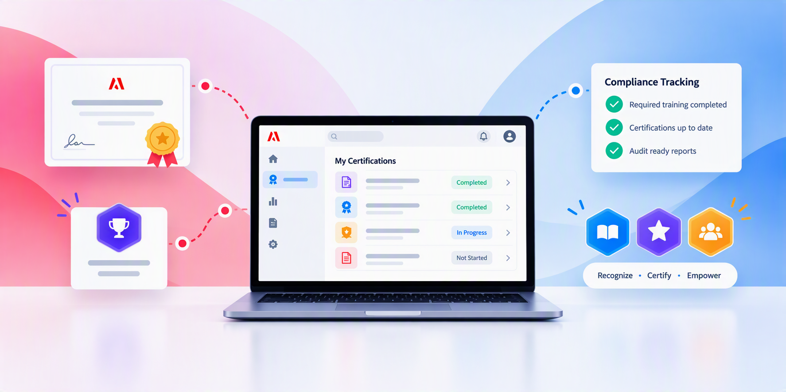

# Documentation Adobe Learning Manager

LMS d’entreprise pour des expériences d’élève évolutives, une formation à la conformité et un développement basé sur les compétences. Sélectionnez votre rôle pour accéder directement à votre guide. Développez des compétences pratiques en matière de produits avec des cours organisés par Adobe Learning Manager Academy et des parcours d’apprentissage guidés.

## Commencer avec votre rôle {#roles}

Accédez directement aux workflows et aux concepts qui correspondent à ce que vous devez accomplir.

    

        

            

                <figure class="image x-is-16by9">
                    
                </figure>
            

            

                

                    

                        <b><a href="/help/migrated/administrators/feature-summary/getting-started-admin.md" target="_blank" rel="referrer" title="L’administrateur">Administrateur</a></b>
                    

                    
Configurez les comptes, les utilisateurs, les accès et les parcours d’apprentissage.

                

                <a href="/help/migrated/administrators/feature-summary/getting-started-admin.md" target="_blank" rel="referrer" class="spectrum-Button spectrum-Button--fill spectrum-Button--accent spectrum-Button--sizeM" style="align-self: flex-start; margin-top: 1rem;">
                    En savoir plus
                </a>
            

        

    

    

        

            

                <figure class="image x-is-16by9">
                    
                </figure>
            

            

                

                    

                        <b><a href="/help/migrated/authors/feature-summary/getting-started-author.md" target="_blank" rel="referrer" title="Auteur">Auteur</a></b>
                    

                    
Créez des cours, des certifications, du contenu et des parcours d’apprentissage.

                

                <a href="/help/migrated/authors/feature-summary/getting-started-author.md" target="_blank" rel="referrer" class="spectrum-Button spectrum-Button--fill spectrum-Button--accent spectrum-Button--sizeM" style="align-self: flex-start; margin-top: 1rem;">
                    En savoir plus
                </a>
            

        

    

    

        

            

                <figure class="image x-is-16by9">
                    
                </figure>
            

            

                

                    

                        <b><a href="/help/migrated/learners/feature-summary/getting-started-learner.md" target="_blank" rel="referrer" title="Gestion">Élève</a></b>
                    

                    
Découvrir, suivre et suivre l’apprentissage attribué.

                

                <a href="/help/migrated/learners/feature-summary/getting-started-learner.md" target="_blank" rel="referrer" class="spectrum-Button spectrum-Button--fill spectrum-Button--accent spectrum-Button--sizeM" style="align-self: flex-start; margin-top: 1rem;">
                    En savoir plus
                </a>
            

        

    

    

        

            

                <figure class="image x-is-16by9">
                    
                </figure>
            

            

                

                    

                        <b><a href="/help/migrated/managers/feature-summary/getting-started-manager.md" target="_blank" rel="referrer" title="Responsable">Responsable</a></b>
                    

                    
Attribuez l’apprentissage et surveillez la progression de l’équipe.

                

                <a href="/help/migrated/managers/feature-summary/getting-started-manager.md" target="_blank" rel="referrer" class="spectrum-Button spectrum-Button--fill spectrum-Button--accent spectrum-Button--sizeM" style="align-self: flex-start; margin-top: 1rem;">
                    En savoir plus
                </a>
            

        

    

    

        

            

                <figure class="image x-is-16by9">
                    
                </figure>
            

            

                

                    

                        <b><a href="/help/migrated/integration-admin/feature-summary/connectors.md" target="_blank" rel="referrer" title="Administrateur d’intégration">Administrateur d'intégration</a></b>
                    

                    
Connectez des systèmes, des API, des données et des workflows.

                

                <a href="/help/migrated/integration-admin/feature-summary/connectors.md" target="_blank" rel="referrer" class="spectrum-Button spectrum-Button--fill spectrum-Button--accent spectrum-Button--sizeM" style="align-self: flex-start; margin-top: 1rem;">
                    En savoir plus
                </a>
            

        

    

## Commencer votre parcours d’apprentissage en tant qu’administrateur

Développez les compétences dont vous avez besoin pour configurer et gérer Adobe Learning Manager.

            

                <figure class="image x-is-16by9">
                    <b></b>
                </figure>
            

            

                

                    

                        <a href="https://content.adobelearningmanageracademy.com/app/learner?accountId=98632&sdid=N7FDRBP4&mv=partner#/learningProgram/168917" target="_blank" rel="referrer" title="Gestion des cours et du contenu">Gestion des cours et du contenu</a>
                    

                    
Découvrez comment créer, organiser et gérer efficacement le contenu d’apprentissage tout au long de ce parcours d’apprentissage.

                

                <a href="https://content.adobelearningmanageracademy.com/app/learner?accountId=98632&sdid=N7FDRBP4&mv=partner#/learningProgram/168917" target="_blank" rel="referrer" class="spectrum-Button spectrum-Button--fill spectrum-Button--accent spectrum-Button--sizeM" style="align-self: flex-start; margin-top: 1rem;">
                    Ouvrir le parcours d’apprentissage
                </a>
            

        

        

            

                <figure class="image x-is-16by9">
                    
                </figure>
            

            

                

                    

                        <a href="https://content.adobelearningmanageracademy.com/app/learner?accountId=98632&sdid=NC5FR6Y3&mv=partner#/learningProgram/168919" target="_blank" rel="referrer" title="Portail et expérience">Portail et expérience</a>
                    

                    
Découvrez comment créer des portails de marque personnalisés et des pages d’accueil publiques attrayantes avec Experience Builder.

                

                <a href="https://content.adobelearningmanageracademy.com/app/learner?accountId=98632&sdid=NC5FR6Y3&mv=partner#/learningProgram/168919" target="_blank" rel="referrer" class="spectrum-Button spectrum-Button--fill spectrum-Button--accent spectrum-Button--sizeM" style="align-self: flex-start; margin-top: 1rem;">
                    Ouvrir le parcours d’apprentissage
                </a>
            

        

        

            

                <figure class="image x-is-16by9">
                    
                </figure>
            

            

                

                    

                        <a href="https://content.adobelearningmanageracademy.com/app/learner?accountId=98632&sdid=NGWGR372&mv=partner#/learningProgram/168920" target="_blank" rel="referrer" title="Administration et accès">Administration et accès</a>
                    

                    
Découvrez comment structurer les rôles, gérer les autorisations et établir des cadres de gouvernance.

                

                <a href="https://content.adobelearningmanageracademy.com/app/learner?accountId=98632&sdid=NGWGR372&mv=partner#/learningProgram/168920" target="_blank" rel="referrer" class="spectrum-Button spectrum-Button--fill spectrum-Button--accent spectrum-Button--sizeM" style="align-self: flex-start; margin-top: 1rem;">
                    Ouvrir le parcours d’apprentissage
                </a>
            

        

        

            

                <figure class="image x-is-16by9">
                    
                </figure>
            

            

                

                    

                        <a href="https://content.adobelearningmanageracademy.com/app/learner?accountId=98632&sdid=NLMHQYH1&mv=partner#/learningProgram/168921" target="_blank" rel="referrer" title="Reconnaissance et conformité">Reconnaissance et conformité</a>
                    

                    
Découvrez comment configurer des certificats de conformité, concevoir des certificats personnalisés et des badges qui célèbrent les réussites des élèves.

                

                <a href="https://content.adobelearningmanageracademy.com/app/learner?accountId=98632&sdid=NLMHQYH1&mv=partner#/learningProgram/168921" target="_blank" rel="referrer" class="spectrum-Button spectrum-Button--fill spectrum-Button--accent spectrum-Button--sizeM" style="align-self: flex-start; margin-top: 1rem;">
                    Ouvrir le parcours d’apprentissage
                </a>
            

        

        

            

                <figure class="image x-is-16by9">
                    
                </figure>
            

            

                

                    

                        <a href="https://content.adobelearningmanageracademy.com/app/learner?accountId=98632&sdid=NQCJQTQZ&mv=partner#/learningProgram/168918" target="_blank" rel="referrer" title="Parcours d’expérience d’apprentissage">Parcours d’expérience d’apprentissage</a>
                    

                    
Découvrez comment organiser les cours en parcours structurés et automatiser l’inscription via des plans d’apprentissage.

                

                <a href="https://content.adobelearningmanageracademy.com/app/learner?accountId=98632&sdid=NQCJQTQZ&mv=partner#/learningProgram/168918" target="_blank" rel="referrer" class="spectrum-Button spectrum-Button--fill spectrum-Button--accent spectrum-Button--sizeM" style="align-self: flex-start; margin-top: 1rem;">
                    Ouvrir le parcours d’apprentissage
                </a>
            

        

        

            

                <figure class="image x-is-16by9">
                    
                </figure>
            

            

                

                    

                        <a href="https://content.adobelearningmanageracademy.com/app/learner?accountId=98632&sdid=NV3KQPZY&mv=partner#/learningProgram/168922" target="_blank" rel="referrer" title="Reporting et analyses">Reporting and analytics</a>
                    

                    
Apprenez à transformer des tableaux de bord et des rapports pour prendre des décisions significatives en matière de leadership.

                

                <a href="https://content.adobelearningmanageracademy.com/app/learner?accountId=98632&sdid=NV3KQPZY&mv=partner#/learningProgram/168922" target="_blank" rel="referrer" class="spectrum-Button spectrum-Button--fill spectrum-Button--accent spectrum-Button--sizeM" style="align-self: flex-start; margin-top: 1rem;">
                    Ouvrir le parcours d’apprentissage
                </a>
            

        

Choisissez des cours ciblés pour les fonctionnalités clés ou suivez des parcours d’apprentissage guidé. Les liens vers Académie s’ouvrent dans un nouvel onglet et peuvent nécessiter une connexion.

    <a href="https://cdn.content.adobelearningmanageracademy.com/?sdid=PC1PQ72T&mv=partner"
       target="_blank"
       rel="referrer"
       class="spectrum-Button spectrum-Button--outline spectrum-Button--primary spectrum-Button--sizeM" style="align-self: flex-start; margin-top: 1rem;">
        
            Découvrir ALM Academy
        
    </a>

## Découvrir Adobe Learning Manager

Découvrez les nouveautés, explorez les fonctionnalités clés et développez vos compétences.

<table style="table-layout:fixed">
 <tbody>

<tr style="border: 0;">
   <td>

<strong>Nouveautés de Adobe Learning Manager</strong>
    

    
Découvrez les dernières fonctionnalités et mises à jour de la version d’août 2026.

                

                    <strong>
                        <a href="/help/migrated/whats-new.md">Résumé des nouvelles fonctionnalités</a>
                    </strong>
                

                

                    <strong>
                        <a href="/help/migrated/authors/feature-summary/content-composer/content-composer-help.md">Compositeur de contenu (Beta)</a>
                    </strong>
    

</td>
   <td>
   
<strong>Fonctionnalités d’IA</strong>

                    <b>Insights Agent (Beta)</b> 
                    <a href="/help/migrated/administrators/feature-summary/insights-agent.md">En savoir plus</a> &amp;vert ; <a href="https://content.adobelearningmanageracademy.com/app/learner?accountId=98632&sdid=MQH8RTM8&mv=partner#/course/17286964">Lancer le cours</a>

                    Agent du parcours d’apprentissage (Beta) 
                    <a href="/help/migrated/learners/feature-summary/learning-path-agent.md">En savoir plus</a> &amp;vert ; <a href="https://content.adobelearningmanageracademy.com/app/learner?accountId=98632&sdid=MLR7RYC9&mv=partner#/course/17286956">Lancer le cours</a>

                    <strong>Live Hub (Beta)</strong> 
                    <a href="/help/migrated/getting-started-with-live-hub/getting-started-live-hub.md">En savoir plus</a> &amp;vert ; <a href="https://content.adobelearningmanageracademy.com/app/learner?accountId=98632&sdid=MV79RPW7&mv=partner#/course/17286962">Lancer le cours</a>

</td>
   <td>
   
<strong>Outils d’administration</strong>
    

   

                    <strong>Experience Builder</strong> 
                    <a href="/help/migrated/administrators/feature-summary/experience-builder/overview.md">En savoir plus</a> &amp;vert ; <a href="https://content.adobelearningmanageracademy.com/app/learner?accountId=98632#/course/17286967">Lancer le cours</a>
    

    

                    <strong>Report Builder</strong> 
                    <a href="/help/migrated/administrators/feature-summary/alm-report-builder.md">En savoir plus</a> &amp;vert ; <a href="https://content.adobelearningmanageracademy.com/app/learner?accountId=98632&sdid=MYYBRL56&mv=partner#/course/17286960">Lancer le cours</a>
    

                    <strong>Email Builder</strong> 
                    <a href="/help/migrated/administrators/feature-summary/email-builder.md">En savoir plus</a> &amp;vert ; <a href="https://content.adobelearningmanageracademy.com/app/learner?accountId=98632&sdid=N3PCRGF5&mv=partner#/course/17286967">Lancer le cours</a>
    

    </td>
  </tr>

</tbody>
</table>

Découvrez comment ALM peut vous aider à créer, gérer et fournir des expériences d’apprentissage attrayantes. Inscrivez-vous dès aujourd’hui pour une démonstration personnalisée.

    <a href="https://business.adobe.com/resources/demo/adobe-learning-manager-lms.html?sdid=P79NQBSV&mv=partner#make-personalized-learning-the-new-normal"
       target="_blank"
       rel="referrer"
       class="spectrum-Button spectrum-Button--outline spectrum-Button--primary spectrum-Button--sizeM" style="align-self: flex-start; margin-top: 1rem;">
        
            <strong>S'abonner</strong>
        
    </a>

## Ressources supplémentaires {#additional-resources}

- [Notes de mise à jour](/help/migrated/release-note/release-notes.md)
- [Demander à la communauté](https://community.adobe.com/adobe-learning-manager-466)
- [Envoyer des commentaires](https://github.com/AdobeDocs/learning-manager.en/issues)
