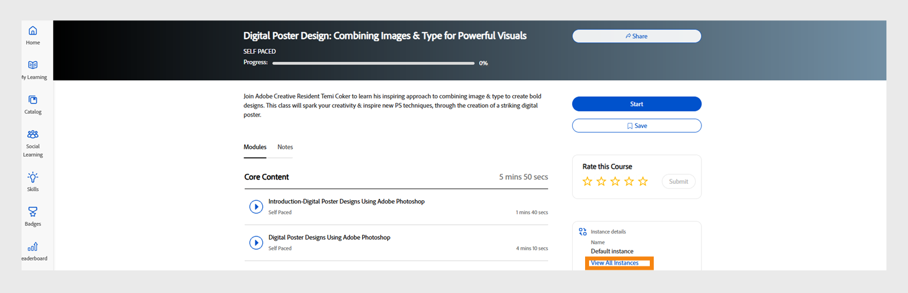

# Nouveautés de cette version (avril 2023)

## Application Adobe Learning Manager pour Microsoft Teams

La nouvelle application Adobe Learning Manager sur Microsofts Teams est conçue pour favoriser l’apprentissage dans le flux de travail et stimuler l’apprentissage social. Les élèves pourront accéder au contenu d&#39;apprentissage depuis la plateforme Microsofts Teams sans avoir à passer par un navigateur. Pour obtenir la version bêta de l’application Adobe Learning Manager sur MS Teams, contactez votre CSAM.

Pour plus d&#39;informations, voir [Application Adobe Learning Manager pour Microsofts Teams](/help/migrated/adobe-learning-manager-app-microsoft-teams.md).

## Améliorations de l&#39;expérience de formation avec instructeur (ILT)

Plusieurs améliorations ont été apportées à l&#39;expérience de formation avec instructeur (ILT). Les principales améliorations incluent : la possibilité de filtrer les sessions en fonction de l’emplacement, la possibilité de changer d’instance (VILT) sans perdre la progression, un nouvel « Assistant de planification » pour la gestion des conflits dans les sessions de réservation, la possibilité d’associer des « compétences » aux instructeurs et de choisir des instructeurs en fonction des compétences.

### Quels sont les changements apportés 

* La page Compétences de l’application d’administration permet de télécharger un mappage Compétence-Instructeur.
* La page Compétences contient une nouvelle colonne, Instructeurs. La colonne affiche le nombre d’instructeurs par rapport à la compétence. Si vous cliquez sur le nombre dans la colonne Instructeurs, vous serez redirigé vers une fenêtre contextuelle qui affiche le nombre d’instructeurs affectés à une compétence.

Pour plus d’informations, voir [Attribuer des compétences aux instructeurs](/help/migrated/administrators/feature-summary/skills-levels.md#assign-skills-to-instructors).


### Assistant de planification

Gérez les conflits lors de la réservation des instructeurs et des salles de classe ou des salles de classe virtuelles. Si vous souhaitez savoir à quelle heure et à quelle date un instructeur est disponible avant de l&#39;affecter au cours, utilisez l&#39;Assistant Planification.

Les auteurs, les administrateurs et les administrateurs/auteurs personnalisés peuvent utiliser l’Assistant Planification.

Pour plus d’informations, voir [Assistant Planification](/help/migrated/authors/feature-summary/courses.md#scheduling-assistant).

## Nouvelle application mobile Adobe Learning Manager

Une toute nouvelle application mobile Adobe Learning Manager pour Android et iOS permet aux élèves d’accéder facilement à la formation lorsqu’ils sont en déplacement. L’application permet aux élèves de suivre la formation sur leurs appareils mobiles et de la reprendre ultérieurement sur leurs ordinateurs de bureau. Avec la prise en charge des notifications, des chargements de fichiers, la facilité de création de signets et de partage du contenu d&#39;apprentissage, l&#39;apprentissage par les réseaux sociaux, etc., l&#39;application mobile offre davantage de flexibilité aux élèves et prend en charge l&#39;apprentissage « juste à temps ».


Téléchargez le mobile à partir du Google Play Store et d’Apple App Store. Les utilisateurs de l’ancienne version de l’application seront invités à télécharger et à installer la nouvelle application.

Dans cette version, l’application prend en charge les fonctionnalités suivantes :

Dans cette version, la nouvelle application mobile prend en charge les fonctionnalités clés suivantes :

* Recherche améliorée, y compris l’affichage des recherches récentes par l’élève et des recherches courantes dans l’organisation dans la zone de saisie de la recherche.
* Possibilité de télécharger les relevés de notes des élèves.
* Centre de notifications improvisé : fournit des mises à jour importantes aux élèves sous forme de notifications dans l’application
* Possibilité de trier et de filtrer les objets d’apprentissage dans les pages Catalogue/Mon apprentissage
* Possibilité de mettre en signet des objets d’apprentissage (LO) : les LO marqués d’un signet seront disponibles dans la section « Enregistré par moi » de la page d’accueil de l’élève.
* Prise en charge des programmes d’apprentissage améliorés
* Possibilité de remplacer la langue de l’interface mobile par n’importe quelle langue prise en charge par Adobe Learning Manager.
* Prise en charge du téléchargement de fichiers dans des certifications externes, des sessions CR/VC et des modules d&#39;activité.
* Possibilité d’envoyer des commentaires sur le cours L1 dans l’application.
* Prise en charge des liens profonds.
* Prise en charge de l’Apprentissage par les réseaux sociaux.
* Prise en charge des badges.
* Prise en charge de la connexion utilisateur externe.

**Éléments non pris en charge dans cette version**

* Prise en charge de plusieurs tentatives pour un module de quiz dans un cours lorsque le cours est suivi à partir de l&#39;application mobile.
* Options de recherche qui vous permettent de spécifier des paramètres de recherche, tels que les métadonnées de cours, les balises et les compétences pour spécifier l’étendue de la recherche.
* Les annonces personnalisées de l’administrateur s’affichent sous forme de fenêtre contextuelle pour l’utilisateur dans l’application mobile.
* Vous ne pouvez pas ajouter de compétences sur la page des compétences dans l’application.
* Suivi des cours hors ligne.

Pour plus d’informations, voir [Application mobile Adobe Learning Manager](/help/migrated/learners/feature-summary/ipad-android-tablet-users.md).

## Utilisez n’importe quelle application de numérisation de code QR pour numériser les codes QR Learning Manager

Adobe Learning Manager prend désormais en charge une méthode plus intuitive pour scanner les codes QR à l’aide de l’application Appareil photo native, sans avoir à télécharger une application qui scanne un code QR.

Pour prendre en charge le workflow précédent, dans lequel vous pouviez scanner un code QR à l’aide du menu de l’application ALM, dans cette version, nous avons fourni des informations sur la façon de passer au nouveau workflow.

Grâce aux améliorations apportées aux workflows basés sur le code QR, les anciens codes QR générés avant cette version ne seront plus pris en charge. Par conséquent, si vous avez généré un code QR avec une ancienne version de Learning Manager pour une session de classe ou de classe virtuelle qui aura lieu après cette version, vous devez générer un nouveau code QR.

### Améliorations des annonces de recommandations

Dans cette version, nous avons mis à jour la bande de recommandations d’une organisation vers une recommandation basée sur le groupe d’utilisateurs, auquel l’élève appartient, pour afficher les cours pertinents pour l’élève.

Les administrateurs peuvent diriger les élèves vers des cours ou des formations spécifiques en fonction du profil des élèves. Les élèves peuvent alors rechercher des cours en fonction du profil dont ils font partie.

**Modifications**

Une option de la page Annonce indique à un élève pourquoi ce cours ou cette formation lui a été recommandé.


### Nouveau paramètre d’administrateur

L’administrateur a une nouvelle option appelée Groupes dans Paramètres > Affichage des panneaux de filtrage. Lorsque l’option Groupes est activée, le filtre Groupes s’affiche sur la page d’accueil des élèves. L’élève peut ensuite choisir d’afficher les cours en fonction des groupes d’utilisateurs.

|   | Lorsque l’option est activée | Lorsque l’option est désactivée |
|--- |--- |--- |
| L’option Groupes est activée | <ul><li> Affiche le groupe d’utilisateurs sur la vignette avec le lien vers la page du catalogue.</li><li> Le groupe d’utilisateurs s’affiche dans le filtre du catalogue.</li></ul> | <ul><li>Le nom du groupe d’utilisateurs ne s’affiche pas sur la vignette.</li><li>Le groupe d’utilisateurs n’est pas répertorié dans le filtre du catalogue.</li></ul> |
| L’option Groupes est désactivée | <ul><li>Affiche le nom du groupe d’utilisateurs sur la vignette du cours en texte brut.</li><li>Le groupe d’utilisateurs n’est pas répertorié dans le filtre du catalogue.</li></ul> | <ul><li>La vignette du cours n’affiche pas le texte ou le nom du groupe d’utilisateurs.</li><li>Le groupe d’utilisateurs n’est pas répertorié dans le filtre du catalogue.</li></ul> |

**Fonctionnement**

L’administrateur crée une annonce en ajoutant le cours pour n’importe quel groupe d’utilisateurs, puis la publie.

Un élève voit une bande avec des cours recommandés sur la page d’accueil et un lien vers le cours sur la vignette.


Lorsque l’élève clique sur le lien ou sur le bouton Accéder au catalogue, il est redirigé vers la page du catalogue du cours. L’élève affiche ensuite la liste des groupes d’utilisateurs à filtrer en fonction des groupes d’utilisateurs dans le catalogue et la page Mon apprentissage.


## Rechercher des sessions en utilisant des lieux

### Gérer les lieux de salles de classe

Parfois, vous souhaitez qu’un élève filtre une session sur le calendrier en fonction d’un emplacement. Après avoir ajouté un emplacement à l’aide de la boîte de dialogue Emplacements de la salle de classe ou du fichier CSV, l’élève peut ensuite filtrer les données.


Pour plus d’informations, voir [Ajouter des emplacements de salles de classe](/help/migrated/administrators/feature-summary/settings.md#classroom-locations).

### Widget Calendrier

En tant qu’élève, vous pouvez filtrer les sessions qui vous sont attribuées par emplacement. Accédez au widget de calendrier, sélectionnez Filtrer les sessions, puis sélectionnez l’emplacement.


En outre, l&#39;emplacement de la formation s&#39;affiche désormais sur la page de présentation du cours si l&#39;emplacement est ajouté par l&#39;auteur lors de la création du cours.

### L’administrateur

En tant qu’administrateur, vous pouvez vérifier si un élève peut filtrer les cours en fonction des emplacements. Dans Paramètres > Général, activez ou désactivez l’option Emplacements de formation.

Pour plus d’informations, voir [Paramètres administrateur](/help/migrated/administrators/feature-summary/settings.md).

## Modifications apportées à la version d’essai

Une fois le compte de la version d’essai créé, les cours dans le Marché de contenus sont disponibles immédiatement.

## Chatbot

Dialoguez en direct avec un ou plusieurs agents à l’aide d’un chatbot. Seuls les administrateurs et les administrateurs personnalisés des comptes d’évaluation peuvent utiliser cette fonctionnalité.

Le chatbot va :

* Vous accueillir avec un message.
* Fournir une option pour les informations sur le produit ou une démonstration du produit.
* Transférer la conversation à un agent en direct.
* Conserver votre historique de conversation.


## Améliorations apportées à la liste de contrôle d’observation

Les auteurs peuvent désormais sélectionner des Responsables et Responsables de magasin/lieu en tant que Réviseurs pour les listes de contrôle. S’ils sont sélectionnés en tant que Réviseurs, les Responsables et Responsables de magasin/lieu peuvent également afficher et compléter les listes de contrôle de leurs équipes sans avoir à sélectionner des rôles Instructeur. Les Instructeurs continuent à réviser les listes de contrôle. Une nouvelle notification « Liste de contrôle de révision » est envoyée aux réviseurs (instructeurs/responsables) d’une instance pour la liste de contrôle lors des inscriptions.

Si un responsable est ajouté en tant que réviseur dans le module de liste de contrôle, il pourra consulter la liste de contrôle dans l’application du responsable. Les instructeurs doivent continuer à réviser la liste de contrôle comme prévu.

Pour plus d’informations, voir [Liste de contrôle](/help/migrated/authors/feature-summary/courses.md#observation-checklist).

## Autres améliorations

### Recherche de l’élève

Les résultats de la recherche sont également classés comme suit :

* Vos recherches récentes
* Recherches populaires dans votre organisation

La fonctionnalité de recherche a aussi été améliorée pour les élèves. Les élèves peuvent désormais utiliser des guillemets doubles « ... », plus « + » et moins « - » pour trouver les résultats pertinents plus rapidement et profiter d&#39;une expérience de recherche google.

* Utilisez des guillemets («...») pour rechercher des cours contenant l’expression ou le mot exact. Par exemple, si vous saisissez « science des données », la recherche retournera des cours commençant par l’expression science des données.
* Utilisez l’opérateur + pour vous assurer que seuls les résultats contenant l’expression ou le mot spécifique sont affichés. Par exemple, Programmation informatique +python affichera uniquement les cours de programmation informatique contenant le mot « python ».
* Utilisez l’opérateur - pour vous assurer que seuls les résultats ne contenant pas l’expression ou le mot spécifique s’affichent. Par exemple, Programmation informatique -python affichera tous les cours de programmation informatique sauf ceux qui contiennent le mot « python ».

### Fenêtre contextuelle en conflit pour les objets d’apprentissage

La page Présentation affiche une fenêtre contextuelle lors de l’inscription lorsqu’un élève a des sessions en conflit. Si l’inscription à partir de la page de catalogue ou de la page de présentation et qu’un élève a déjà des sessions en conflit, cela déclenchera une fenêtre contextuelle en conflit avec des détails de session en conflit. Même si un élève a une session en conflit, il peut s’inscrire à la nouvelle session.


Notez que ce message n’est qu’un avertissement. Vous pouvez toujours vous inscrire à un cours.

### Nouveau modèle

Nous avons ajouté un nouveau modèle d’e-mail nommé Session annulée en raison d’une désinscription. Lorsqu’un utilisateur n’est pas inscrit à une formation, il reçoit l’e-mail d’annulation.

### Nouvelle fonctionnalité de tarification pour les cours

Les administrateurs peuvent désormais définir la devise du compte dans la section Paramètres de l’administrateur > Informations de base. Les administrateurs peuvent spécifier le symbole ainsi que le code de devise ISO, par exemple, USD, GBP, etc. La valeur par défaut de tous les nouveaux comptes sera $. Cette modification s’applique uniquement aux applications non destinées aux élèves. Les administrateurs peuvent voir la modification lorsqu’ils affichent un aperçu du cours en tant qu’élèves. Le symbole de la devise s’affiche également dans les relevés de notes de l’élève et les rapports de formation.

Pour plus d’informations, voir [Paramètres administrateur](/help/migrated/administrators/feature-summary/settings.md).

### Changer d’instances

Un élève inscrit à une instance particulière d’un cours peut afficher une liste de toutes les instances disponibles du cours et passer à une autre instance qui lui convient mieux. Le changement peut s’expliquer par le fait que l’élève n’a pas assisté à l’instance précédente, par le fait que le minutage de la session pour la nouvelle instance est plus approprié, ou pour une autre raison.

Toute progression effectuée par l’élève dans le cadre du cours, les scores du quiz de l’élève, etc., sont reportés sur la nouvelle instance. Cette fonctionnalité est principalement destinée aux cours en salle de classe et mixtes, mais nous prendrons en charge tous les types de cours, y compris les cours en auto-apprentissage.

L’option Afficher toutes les instances s’affiche indépendamment des paramètres de changement d’instance. Les élèves voient désormais une option leur permettant d’afficher toutes les instances s’il existe plusieurs instances d’un cours.

Si l’option Changement d’instance est activée, les élèves peuvent basculer vers différentes instances jusqu’à ce qu’ils terminent le cours. Si l’option est désactivée, les élèves peuvent afficher les instances, mais ne peuvent pas s’inscrire au cours.

Lorsque l’élève sélectionne **Afficher toutes les instances**, l’élève peut voir toutes les instances du cours.



_Afficher toutes les pages d&#39;instance à partir de la console de l&#39;élève_


_Changer d&#39;instance à partir de la page de l&#39;élève_

Un administrateur peut changer d’instance pour les élèves. Sélectionnez un cours dans le portail Admin Console, accédez à la section **[!UICONTROL Élèves]**, choisissez un utilisateur, puis cliquez sur le bouton **[!UICONTROL Action]**. Ensuite, sélectionnez **[!UICONTROL Changer d&#39;instance]** et choisissez l&#39;instance souhaitée.


_Changer d&#39;instance à partir d&#39;Admin Console_


_Invite de changement d&#39;instance_

Vous ne pouvez pas changer d’instance tant qu’une instance du cours n’est pas terminée à partir de l’application Élève ou Administrateur.

Lors de la création d’un cours, les auteurs peuvent basculer entre l’activation ou la désactivation du « changement d’instance ». Le changement d&#39;instance est disponible uniquement pour les cours gratuits.

Pour plus d&#39;informations, voir [Configuration de l&#39;instance](/help/migrated/authors/feature-summary/courses.md).

**Élèves**

Les élèves peuvent passer d&#39;une instance de cours en liste d’attente à une autre instance. Ils peuvent également changer d’instance de cours dans un parcours d’apprentissage ou une certification.

Après s’être inscrit au parcours d’apprentissage ou à la certification, sur la page du cours, ils peuvent cliquer sur Afficher les instances, puis changer d’instance.

>[!NOTE]
>
>La configuration Changement d’instance n’est pas prise en charge pour les types d’inscription nommée par le responsable.
>
>Si vous changez d’instance à partir d’un Flex LP, la progression sera reportée dans l’autre instance.

### Piste d’audit d’utilisateur

Le rapport Piste d’audit de l’utilisateur capture des informations sur les élèves qui ont changé d’instance, de « de l’instance » à « vers l’instance », qui ont changé de date, d’heure, etc.


Pour plus d’informations, consultez la section [Rapport de piste d’audit d’utilisateur](/help/migrated/administrators/feature-summary/reports.md#useraudittrailreports).

### Rapport d’utilisation des instructeurs

Ce rapport capture le temps (en minutes) passé chaque jour par un instructeur pour enseigner les sessions qui lui sont assignées. Le rapport peut être téléchargé pendant une période de trois mois à compter de la date de début sélectionnée.

Pour plus d&#39;informations, voir [Rapport d&#39;utilisation de l&#39;instructeur](/help/migrated/administrators/feature-summary/reports.md#instructor-utilization-report).


### Rapport d’assistances à la tâche

Nouveau rapport permettant de suivre les assistances à la tâche présentes dans le compte et diverses informations sur les assistances à la tâche, notamment la langue, le type, la durée, l’auteur, les balises, etc.

Pour plus d&#39;informations, consultez le [rapport d&#39;inscription des assistances à la tâche](/help/migrated/administrators/feature-summary/reports.md).

### E-mails ad hoc ciblés pour les élèves inscrits à une instance de cours spécifique

Les administrateurs et les auteurs pourront envoyer des communications par e-mail ciblées aux élèves inscrits à une instance spécifique d&#39;un cours. L’option permettant d’envoyer des e-mails au niveau de l’instance a été ajoutée pour les cours et les programmes d’apprentissage.


*Envoyer des e-mails au niveau de l’instance*

Dans la boîte de dialogue Créer une annonce, l’option Saisir comme e-mail et Formation, ainsi que l’instance, sont sélectionnées par défaut. Spécifiez l’objet, saisissez le message, puis cliquez sur Enregistrer.

Pour plus d’informations, voir [E-mails au niveau de l’instance](/help/migrated/administrators/feature-summary/courses.md#send-instance-level-emails).

### Courriers électroniques ad hoc ciblés aux élèves via les annonces de l’administrateur

Pour les administrateurs, un nouveau type d&#39;annonce a été ajouté : « Comme e-mail ». Cette option peut être utilisée pour envoyer des e-mails ad hoc ciblés aux élèves d&#39;un groupe d&#39;utilisateurs sélectionné ou aux élèves inscrits à une formation spécifique.

L’administrateur personnalisé et les auteurs peuvent également afficher cette option au niveau de l’instance s’ils disposent des droits d’accès nécessaires.

Pour plus d&#39;informations, voir [Annonces](/help/migrated/administrators/feature-summary/announcements.md#as-email).

### Nouveaux modèles de courriers électroniques

Dans cette version, nous avons ajouté des modèles de courriers électroniques pour les responsables N+2. Ces modèles sont destinés aux responsables qui reçoivent des courriers électroniques concernant des subordonnés de deuxième niveau qui n’ont pas suivi un cours, un parcours de formation ou obtenu une certification à la date d’échéance. En outre, ils recevront des e-mails lorsque leurs rapports de deuxième niveau approcheront des dates limites d’achèvement pour ces cours, parcours d’apprentissage ou certifications.

* Escalade au N+2 pour achèvement de cours - Avant l’échéance
* Ignorer la remontée des niveaux pour les dates limites de cours dépassées
* Escalade au N+2 pour achèvement de parcours d’apprentissage - Avant l’échéance
* Escalade au N+2 pour échéance de parcours d’apprentissage manquée
* Escalade au N+2 pour obtention de certification - Avant l’échéance
* Escalade au N+2 pour échéance de certification manquée

Ces options sont activées par défaut.

## Modifications apportées aux API dans cette version

### Nouveaux rapports

Nous avons ajouté un nouvel attribut, jobType, à l’API des tâches. L’attribut accepte les valeurs suivantes :

* **generateInstructorUtilisationReport** : renvoie le rapport d&#39;utilisation d&#39;un instructeur.
* **generateJobAidMetadataReport** : renvoie les métadonnées d&#39;un rapport d&#39;assistance à la tâche.

**Point de terminaison** : POST /primeapi/v2/jobs

Requête generateJobAidMetadataReport :

```javascript {line-numbers="true"}
{ 
    "data": { 
        "type": "job", 
            "attributes": { 
                "description": "description of your choice", 
                "jobType": "generateJobAidMetadataReport" 
            } 
    }
} 
```

réponse generateJobAidMetadataReport :

```javascript {line-numbers="true"}
{ 
  "links": { 
    "self": "https://learningmanagerstage1.adobe.com/primeapi/v2/jobs" 
  }, 
  "data": { 
    "id": "31126", 
    "type": "job", 
    "attributes": { 
      "dateCreated": "2023-02-28T18:36:48.000Z", 
      "description": "description of your choice", 
      "jobType": "generateJobAidMetadataReport", 
      "status": { 
        "code": "Submitted" 
      } 
    } 
  } 
} 
```

requête generateInstructorUtilisationReport :

```javascript {line-numbers="true"}
{
    "data": { 
        "type": "job", 
            "attributes": { 
                "description": "description of your choice", 
                "jobType": "generateInstructorUtilisationReport", 
                "payload": { 
                    "year": "2023", 
                    "month": "2" 
                } 
            } 
    } 
}
```

réponse generateInstructorUtilisationReport :

```javascript {line-numbers="true"}
{ 
  "links": { 
    "self": "https://learningmanagerstage1.adobe.com/primeapi/v2/jobs" 
  }, 
  "data": { 
    "id": "31130", 
    "type": "job", 
    "attributes": { 
      "dateCreated": "2023-02-28T18:43:43.000Z", 
      "description": "description of your choice", 
      "jobType": "generateInstructorUtilisationReport", 
      "payload": { 
        "month": "2", 
        "year": "2023" 
      }, 
      "status": { 
        "code": "Submitted" 
      } 
    } 
} 
} 
```

Pour plus d&#39;informations, voir la [documentation de référence sur l’API](https://captivateprime.adobe.com/docs/primeapi/v2/).

### Changement d’instance de l’élève

L&#39;API Enrollment Learner vous permet d&#39;accéder à toutes les instances disponibles et de passer à une autre instance d&#39;un cours. La nouvelle instance hérite de toutes les propriétés du cours précédent.

Nous avons ajouté un nouveau paramètre de requête, enrollmentID, pour lequel les informations sont demandées.

>[!NOTE]
>
>Le corps est requis uniquement dans les cas suivants :
>
>1. Plan d’apprentissage flexible
>1. Changement d’instance de cours

### Comptes

La réponse contient un nouvel attribut, currencyCode.

**Point de terminaison** : GET /primeapi/v2/account

### Association de compétences et de niveaux de compétence pour les instructeurs

Nous avons introduit une nouvelle fonctionnalité, qui capture l&#39;expertise des instructeurs, c&#39;est-à-dire que pour chaque instructeur, leur expertise est maintenue, et cela peut être mis à disposition pour les opérations en aval comme la recherche et le filtrage.

Les attributs suivants sont ajoutés :

* instructorSkills
* instructorSkillLevel

**Point de terminaison** : GET /primeapi/v2/account /&lt;account_id>/instructorskill/search

### Modifications ILT

| Description | Nouveau paramètre/réponse | Point de terminaison |
|--- |--- |--- |
| Liste de toutes les villes | filter.cityName=true/false | GET /primeapi/v2/data |
| Rechercher et filtrer des villes | filter.cityName=city_name<br>Prend également en charge une liste de villes séparées par des virgules |
| GET /primeapi/v2/search |
| Détails de la salle de retour | include=room | GET /primeapi/v2/users/`<id>`/calendar |
| Objet d&#39;apprentissage pour filtrer les villes | filter.cityName=nom_ville <br> Prend également en charge une liste de villes séparées par des virgules. | GET /primeapi/v2/learningObjects |
| Ajouter un panneau de ville | La réponse contient un nouvel attribut, filterPanelSetting=true/false. | GET /primeapi/v2/account |

### Sessions d’élèves en conflit

Récupérer la liste de toutes les sessions en conflit pour une instance.

Nous avons ajouté les champs suivants :

* loID
* loInstanceID

**Point De Terminaison** : `GET /primeapi/v2/learningObjects/{loId}/instances/loInstanceId/conflictingSessions?page[offset]=0&page[limit]=10`

### Salle de classe dans VC

Exécutez une recherche basée sur l&#39;emplacement pour les cours VC. Un nouvel attribut roomLocation est présent dans le modèle de ressource pour indiquer l&#39;emplacement de forme libre fourni lors de la création d&#39;un cours VC.

Nous avons apporté les modifications suivantes :

**LO**

Nouveau paramètre de requête, filter.loFormat=Virtual Classroom pour l’API learningObjects.

**Point de terminaison** : GET /primeapi/v2/learningObjects

**Calendrier**

Nouveau paramètre de requête, filter.allSessions=false pour l’API de calendrier. La valeur par défaut du paramètre est false. Si la valeur est true, l’API renvoie toutes les sessions du calendrier d’un élève.

**Point De Terminaison** : `GET /primeapi/v2/users/<id>/calendar?filter.allSessions=false`

### Historique de recherche des élèves

**Recherche**

Nouveau paramètre de requête, persistSearchHistory. La valeur par défaut est true, qui conserve la requête pour les suggestions de recherche.

**Point de terminaison** : GET /primeapi/v2/search?persistSearchHistory=true

**Suggestions**

Nouveau paramètre de requête, suggestionType. Les valeurs acceptées sont les suivantes :

* learnerHistory (par défaut)
* accountHistory

**Point de terminaison** : GET /primeapi/v2/search/suggestions/?suggestionType=learnerHistory

### Filtrage de groupe d’utilisateurs

Les API d’objet d’apprentissage et de recherche fournissent des filtres pour récupérer tous les objets d’apprentissage appartenant au groupe d’utilisateurs via des filtres spécifiés. Les API prennent en charge les filtres sous la forme d’une liste séparée par des virgules.

Nous avons fourni un nouveau filtre, filter.lo.announcementGroups, pour récupérer tous les objets d’apprentissage qui appartiennent aux filtres de groupe d’utilisateurs fournis.

Il peut s’agir d’une liste à valeurs multiples séparées par des virgules pour plus de souplesse, et le traitement serait basé sur l’opération « OR » entre les différents groupes. C’est-à-dire qu’il s’agit d’obtenir tous les objets d’apprentissage qui correspondent aux groupes d’utilisateurs donnés.

### Groupe personnalisé

Vous pouvez ajouter et supprimer des utilisateurs externes vers et depuis des groupes personnalisés via l’API.

**POST**

POST /userGroups/{id}/users

**Corps**

```javascript {line-numbers="true"}
"data": [ 
     { 
           "type": "user",  
           "id": "{id}"   
     }  
]  
```

**DELETE**

DELETE /userGroups/{id}/users

**Corps**

```javascript {line-numbers="true"}
"data": [  
     {  
          "type": "user",  
           "id": "11218291"  
     }  
]   
```

### Filtrage du groupe d&#39;utilisateurs des annonces pour les pertes dans l&#39;application Élève

* L&#39;API GET /users/{userId}/userGroups a un nouveau paramètre, filter.announcementsGroupsOnly, qui prend une valeur booléenne (true/false). Cela permet de filtrer uniquement les groupes d’utilisateurs que l’administrateur annonce. La valeur par défaut de ce paramètre est false.
* L’API GET /learningObjects possède un nouveau paramètre, filter.announcementsGroupes, qui accepte les ID de groupe d’annonces pour filtrer les résultats.
* L&#39;API GET /search a un nouveau paramètre, filter.announcementsGroups, qui accepte les ID de groupe d&#39;annonces pour filtrer les résultats.

Exemple de réponse ci-dessous :

```javascript {line-numbers="true"}
{
  "links": {
    "self": "https://learningmanagerstage1.adobe.com/primeapi/v2/recommendations?page[offset]=0&page[limit]=10&strip=1&filter.recType=announcement&filter.loTypes=course"
  },
  "data": [
    {
      "id": "course:5836866_10855885_recommendation",
      "type": "recommendation",
      "attributes": {
        "reason": [
          "Based on your Group - UGforAnnouncement"
        ],
        "reasonModel": [
          {
            "modelId": 1781592,
            "modelType": "userGroup",
            "modelValues": {
              "group_name": "UGforAnnouncement"
            },
            "template": "Based on your Group - {{group_name}}"
          }
        ]
      },
      "relationships": {
        "learningObject": {
          "data": {
            "id": "course:5836866",
            "type": "learningObject"
          }
        }
      }
    },
    {
      "id": "course:7013328_10855885_recommendation",
      "type": "recommendation",
      "attributes": {
        "reason": [
          "Based on your Group - All Learners"
        ],
        "reasonModel": [
          {
            "modelId": 1410724,
            "modelType": "userGroup",
            "modelValues": {
              "group_name": "All Learners"
            },
            "template": "Based on your Group - {{group_name}}"
          }
        ]
      },
      "relationships": {
        "learningObject": {
          "data": {
            "id": "course:7013328",
            "type": "learningObject"
          }
        }
      }
    },
    {
      "id": "course:6408989_10855885_recommendation",
      "type": "recommendation",
      "attributes": {},
      "relationships": {
        "learningObject": {
          "data": {
            "id": "course:6408989",
            "type": "learningObject"
          }
        }
      }
    },
    {
      "id": "course:6409761_10855885_recommendation",
      "type": "recommendation",
      "attributes": {},
      "relationships": {
        "learningObject": {
          "data": {
            "id": "course:6409761",
            "type": "learningObject"
          }
        }
      }
    },
    {
      "id": "course:6979586_10855885_recommendation",
      "type": "recommendation",
      "attributes": {},
      "relationships": {
        "learningObject": {
          "data": {
            "id": "course:6979586",
            "type": "learningObject"
          }
        }
      }
    }
  ]
}
```

## Notes de mise à jour

Pour plus d&#39;informations sur les versions actuelles et précédentes de l&#39;application web et de l&#39;application pour appareil Learning Manager, consultez les [Notes de mise à jour](/help/migrated/release-note/release-notes.md).

## Correctifs de bogues

Pour voir les bogues corrigés dans cette mise à jour, consultez la [liste des bogues corrigés](release-note/release-notes.md#bugs-fixed-in-this-release).

## Configuration requise

[Configuration requise pour Learning Manager](/help/migrated/system-requirements.md)
