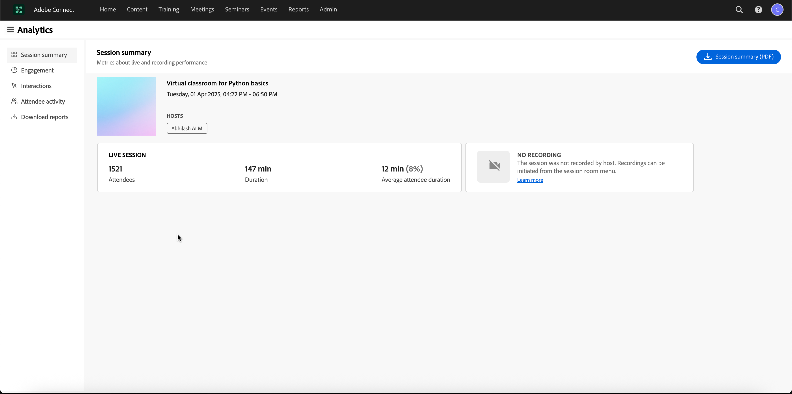

# Résumé des nouvelles fonctionnalités - Mai 2025

La prochaine version de Adobe Learning Manager introduit une variété de nouvelles fonctionnalités et d’améliorations visant à rationaliser la plate-forme et à améliorer ses capacités.

## Tableau de bord de réussite du groupe

Le tableau de bord de réussite de groupe (GSD) de Adobe Learning Manager permet aux administrateurs et aux responsables de surveiller la progression des élèves en temps quasi réel (60 minutes de retard entre l’inscription, la progression ou l’achèvement et la réflexion sur le tableau de bord) dans tous les services ou groupes d’utilisateurs. Il prend en charge le suivi proactif de l’achèvement des cours, de l’inscription et des actions en attente, ce qui facilite la gestion de l’apprentissage pour les équipes. Le tableau de bord de réussite de groupe simplifie le suivi de la progression en remplaçant les relevés de notes Excel par une interface facile à utiliser, ce qui facilite la révision des activités des élèves dans des scénarios tels que les évaluations de performances ou les contrôles de conformité. Elle est particulièrement utile pour les responsables qui supervisent de petites équipes (moins de 50 personnes), telles que les responsables de magasins ou les équipes internes, ce qui leur permet de surveiller rapidement l’achèvement des cours et de suivre l’apprentissage.

Consultez cet [article](/help/migrated/administrators/feature-summary/group-success-dashboard.md) pour plus d&#39;informations sur le tableau de bord de réussite des groupes.

## Améliorations apportées aux rôles personnalisés

Adobe Learning Manager permet désormais aux utilisateurs d’avoir plusieurs rôles personnalisés, ce qui répond au besoin des administrateurs personnalisés de gérer diverses responsabilités. Chaque rôle peut comporter jusqu’à 500 utilisateurs, et chaque utilisateur jusqu’à 50 rôles, ce qui permet une certaine flexibilité dans la délégation des tâches. Les utilisateurs peuvent facilement basculer entre les rôles qui leur sont attribués via une nouvelle option de leur profil, assurant une gestion transparente des différentes responsabilités. Les administrateurs peuvent attribuer ou modifier des rôles pour les utilisateurs via un nouveau lien dans la page utilisateur, ce qui leur permet d’ajouter ou de supprimer des rôles selon leurs besoins. Ces améliorations simplifient la gestion des responsabilités multiples, en particulier pour les petites équipes dont les ressources sont limitées.

Consultez cet [article](/help/migrated/administrators/feature-summary/custom-role.md#assign-multiple-custom-roles-to-a-user) pour plus d&#39;informations sur les rôles personnalisés.

## Inscription, participation et achèvement en bloc de l’élève {#bulk-enrollment}

À l&#39;aide de la fonction d&#39;inscription en masse de Adobe Learning Manager, les administrateurs peuvent inscrire efficacement de grands groupes d&#39;élèves à des cours, des certifications ou des programmes d&#39;apprentissage en chargeant un fichier CSV. Ce processus permet de gagner du temps, assure la cohérence et prend en charge l’évolutivité organisationnelle. En outre, les administrateurs et les instructeurs peuvent mettre à jour les informations sur les élèves, la présence et les achèvements en bloc via des chargements CSV, ce qui réduit le travail manuel et garantit l’exactitude des données.

Consultez cet [article](/help/migrated/administrators/feature-summary/courses.md#learner-bulk-enrollment-attendance-and-completion) pour plus d&#39;informations sur l&#39;inscription en bloc, l&#39;assiduité et l&#39;achèvement.

## Suivi du contenu à l’aide de l’ID de contenu unique et des dates d’expiration

L’ID unique de contenu est un code unique donné à chaque élément de contenu dans Adobe Learning Manager. Il aide les administrateurs et les auteurs à trouver et à gérer facilement le contenu, en particulier lors de la mise à jour ou du déplacement entre les systèmes. Cet ID unique de contenu est également utile pour connecter le contenu à d’autres outils tels que les RH ou les systèmes de conformité. Le même ID unique de contenu est utilisé dans toutes les versions linguistiques, afin que tout reste cohérent pour les élèves.

La Date d’expiration marque le contenu qui peut être obsolète ou qui n’est plus nécessaire. Même après la date d’expiration, le contenu reste disponible, mais il rappelle aux auteurs et aux administrateurs de le vérifier et de le mettre à jour si nécessaire. En fonction des paramètres, le contenu expiré peut être supprimé des nouvelles inscriptions ou archivé. Comme l’ID unique de contenu, la Date d’expiration fonctionne de la même manière pour toutes les versions linguistiques, ce qui permet au contenu d’être propre et à jour pour tout le monde.

En outre, l’ID de contenu unique prend en charge l’intégration avec les processus de migration du contenu, ce qui facilite le transfert et la gestion du contenu entre différents systèmes.

* L’ID unique du contenu facilite la liaison du contenu entre les systèmes externes et Adobe Learning Manager.
* La Date d’expiration permet aux auteurs de suivre le contenu obsolète qui peut nécessiter une révision ou des mises à jour.

Consultez cet [article](/help/migrated/authors/feature-summary/content-library.md#add-content-unique-id-and-expiry-date) pour plus d&#39;informations sur l&#39;ID unique du contenu et la date d&#39;expiration.

## Admin AI Assistant (Beta)

Dans les configurations d’apprentissage complexes, les administrateurs peuvent avoir des difficultés à trouver du contenu ou à effectuer des tâches en raison de menus complexes et de workflows déconnectés. Par exemple, des tâches telles que l’exécution de rapports ou l’accès à des informations spécifiques peuvent nécessiter la navigation sur plusieurs écrans. L’Assistant Admin AI (Beta) vous aide à trouver les informations appropriées pour comprendre et effectuer des tâches efficacement.

L’Assistant Admin AI (Beta) de Adobe Learning Manager permet aux administrateurs de trouver rapidement des réponses aux questions courantes, d’explorer les fonctionnalités du système et de comprendre comment effectuer une tâche essentielle, simplement en posant des questions en langage clair. Que vous débutiez avec Adobe Learning Manager ou que vous recherchiez des moyens plus rapides de résoudre les problèmes, l’Assistant Admin AI (Beta) simplifie votre workflow en fournissant une aide contextuelle directement dans la plateforme.

Il utilise les fonctionnalités d’IA d’Adobe pour activer les requêtes en langage naturel dans le contenu d’apprentissage et les workflows système.  Les administrateurs peuvent poser des questions telles que **Comment ajouter des utilisateurs à Adobe Learning Manager** ou **Comment ajouter des parcours d’apprentissage**. L&#39;assistant Adobe Learning Manager Admin AI Assistant (Beta) est formé exclusivement à la documentation publique appartenant à l&#39;Adobe, telle que les ressources hébergées sur **[!UICONTROL Experience League]**. Il n’apprend pas ni n’accède au contenu client, au matériel de formation interne ou aux données générées par les utilisateurs.

Consultez cet [article](/help/migrated/administrators/feature-summary/alm-ai-assistant.md) pour plus d&#39;informations sur l&#39;Assistant IA (Beta).

## Nouvelles langues de contenu

Adobe Learning Manager est connu pour prendre en charge de nombreuses langues pour le contenu et l’interface, ce qui le distingue des autres plateformes d’apprentissage. À chaque étape, Adobe Learning Manager étend ses offres linguistiques pour mieux prendre en charge une base d’utilisateurs mondiale et diversifiée. Dans cette version, nous introduisons de nouvelles langues de contenu, renforçant ainsi notre engagement à fournir des expériences d’apprentissage inclusives et accessibles pour tous.

* Hong Kong traditionnel chinois (cn-HK)
* Norvégien Bokmal (nb-NO)
* Tamoul (ta-IN)
* Télougou (te-IN)
* Kannada (activé)
* Malayalam (ml-IN)

Consultez cet [article](/help/migrated/languages-supported.md) pour obtenir la liste des langues prises en charge dans Adobe Learning Manager.

## Améliorations apportées au Marché de contenus

Adobe Learning Manager introduit de nouveaux modèles d’achat pour l’acquisition de contenu, offrant ainsi plus de flexibilité et d’options pour l’acquisition de contenu : Essentials Premium et Essential Plus Premium. Essentials propose des solutions rentables pour stimuler l&#39;engagement des employés et comprend des fournisseurs de contenu comme Skillshub, Thomson Reuters et Emtrain. Le service Premium Essential Plus propose du contenu supplémentaire provenant de fournisseurs Premium tels que Blinkist, Pluralsight, Skillsoft, Traliant et Coursera.

Consultez cet [article](/help/migrated/administrators/feature-summary/content-marketplace.md) pour plus d&#39;informations sur les nouvelles formules d&#39;achat.

## Rapport d’accès à la connexion via FTP, FTP personnalisé et Box {#log-in-access-report}

Les rapports d’accès de connexion sont désormais disponibles pour les connecteurs Box, FTP et FTP personnalisé, en plus des API de tâche existantes. Ce rapport fournit des informations détaillées sur les activités de connexion utilisateur, notamment le statut d&#39;exécution, les paramètres de compression et les options de planification. Le rapport peut être généré à la demande ou de manière planifiée, et les données sont stockées dans le connecteur spécifié pour un accès et une analyse faciles. Cette amélioration améliore la capacité à surveiller et à auditer les activités de connexion des utilisateurs, assurant ainsi un meilleur suivi de la sécurité et de la conformité.
Le rapport est désormais disponible dans les champs FTP, FTP et Box personnalisés, ainsi que les rapports existants, tels que la progression de l’élève et l’achèvement du cours. Cette intégration permet aux administrateurs d’accéder à tous les rapports nécessaires à partir d’une source unique, ce qui facilite la gestion et l’analyse des données.

Le rapport facilite l’automatisation en permettant l’exportation des données de connexion et d’accès vers le FTP, où elles peuvent être jointes à d’autres rapports pour créer des tableaux de bord complets. Cette fonctionnalité est particulièrement utile pour les organisations qui s’appuient sur des processus automatisés pour l’analyse des données et la création de rapports.

Consultez cet [article](/help/migrated/integration-admin/feature-summary/connectors.md) pour plus d&#39;informations sur les connecteurs FTP, FTP personnalisé et Box.

## Mise à jour des préférences de langue de l’utilisateur lors de la connexion via SAML

Adobe Learning Manager est une plate-forme multilingue où les préférences linguistiques des élèves sont prises en charge de différentes manières, comme la langue de l’interface, la langue du contenu, et les cours, ainsi que ses modules et instances, sont également multilingues.

Pour les utilisateurs de la plateforme native de Adobe Learning Manager, cette amélioration répond au besoin de provisionnement des utilisateurs juste-à-temps. Lorsque les utilisateurs créent des comptes et se connectent pour la première fois, cette fonctionnalité garantit que leurs préférences linguistiques sont capturées et appliquées avec précision.

Cette fonctionnalité garantit que les préférences linguistiques des utilisateurs sont mises à jour automatiquement lorsqu’ils se connectent via SAML. Cela permet de fournir une expérience personnalisée en affichant l’interface dans la langue préférée de l’utilisateur.
Lorsque les utilisateurs se connectent via SAML, leur préférence de langue (langue de l’interface et du contenu) est vérifiée et mise à jour en fonction des informations fournies pendant le processus de connexion.

La fonctionnalité s’intègre au processus de connexion SAML pour capturer et mettre à jour la préférence de langue de l’utilisateur en toute transparence.

Consultez cet [article](/help/migrated/administrators/feature-summary/set-up-interface-language-through-saml.md) pour plus d&#39;informations.

## Filtrage des utilisateurs supprimés avant la purge

Purger des utilisateurs signifie supprimer définitivement leurs données du système. Triez les utilisateurs par date de suppression, ce qui facilite la recherche et la gestion d’enregistrements spécifiques. En outre, un nouveau filtre permet aux administrateurs de sélectionner les utilisateurs en fonction de l’année et du mois de la suppression, en réduisant la liste à une période spécifique. Ces modifications rationalisent le processus de nettoyage des utilisateurs, permettant aux administrateurs de purger efficacement les utilisateurs en sélectionnant plusieurs enregistrements au cours d’une période définie.

Reportez-vous à cet [article](/help/migrated/administrators/feature-summary/purge-users.md#filter-deleted-users-before-purging) pour plus d&#39;informations.

## Améliorations du connecteur Adobe Connect

### Prise en charge de séminaires destinés à un large public

Adobe Learning Manager prend désormais également en charge la sélection de salles de séminaire dans Adobe Connect lors de la configuration d’une session VC dans Connect. Auparavant, l’administrateur pouvait uniquement sélectionner le type de salle de réunion. Cette amélioration permet aux administrateurs disposant d’une licence de séminaire valide de planifier et de gérer des événements uniques ou de grande envergure (jusqu’à 1 500 participants) dans Adobe Learning Manager.

Consultez cet [article](https://helpx.adobe.com/fr/adobe-connect/using/creating-seminars.html) pour en savoir plus sur la salle de séminaire.

### Prise en charge de l’accès à l’analyse des sessions

Adobe Learning Manager permet aux utilisateurs d’accéder à Session Analytics via une URL, qui redirige vers le tableau de bord Connect session Analytics. Ce tableau de bord fournit des informations détaillées sur la durée de la session, le nombre de participants et les détails de l’enregistrement, disponibles environ 20 minutes après la fin de la session.


_Sélectionner l&#39;URL de la session_


_Tableau de bord de session_

Consultez cet [article](https://helpx.adobe.com/in/adobe-connect/using/session-dashboard.html) pour plus d&#39;informations sur l&#39;analyse de la session Connect.

## Modifications apportées à la migration

### Critères de réussite pour le contenu utilisant la migration

Le processus de migration dans Adobe Learning Manager pour l’importation de modules prend désormais en charge la possibilité d’ajouter des paramètres pour définir des critères de réussite.
Cela est désormais pris en charge par l’ajout de trois nouvelles colonnes facultatives dans le fichier module_version.csv. Trois nouvelles colonnes facultatives sont : `successCriteria`, `successQuizData` et `successViewPercent`.

Ces champs acceptent uniquement des valeurs spécifiques et le connecteur ne peut pas traiter le fichier si des valeurs non valides sont saisies.
Un module de quiz peut utiliser trois types de critères de réussite. Soit il peut marquer la réussite si l’élève lance le contenu, en fonction d’une valeur de pourcentage notée (définie par `successViewPercent` : ci-dessous), soit il peut être basé sur le résultat du module de quiz (défini par `successQuizData` : ci-dessous). Cette valeur doit être remplie conformément aux instructions ci-dessous. Le paramètre successCriteria est utilisé pour déterminer cela.

`successCriteria` : accepte `LAUNCH_CONTENT`, `VIEW_PERCENT`, `QUIZ` ou `VIEWPERCENT_OR_QUIZ`.

* Si `LAUNCH_CONTENT` : laissez `successQuizData` et `successViewPercent` vides. L’élève sera marqué comme ayant réussi s’il lance le contenu.
* Si `VIEW_PERCENT` : entrez une valeur pour `successViewPercent`, laissez `successQuizData` vide. Cela marquera la réussite de l’élève en fonction de la valeur de pourcentage obtenue dans le quiz.
* Si `QUIZ` : entrez une valeur pour `successQuizData`, laissez `successViewPercent` vide. Selon le résultat du module du quiz, l’élève sera marqué comme ayant réussi.
* Si `VIEWPERCENT_OR_QUIZ` : entrez des valeurs pour `successQuizData` et `successViewPercent`. L’élève sera marqué comme ayant réussi selon le résultat du module du quiz ou le pourcentage de score.

Ce champ n&#39;est valide que si `hasQuiz` a la valeur true. En outre, si seul `completionCriteria` est transmis, `successCriteria` sera considéré comme identique à `completionCriteria` pour le contenu interactif.

`successQuizData` : accepte `QUIZ_ATTEMPTED`, `QUIZ_PASSED` ou `QUIZPASSED_OR_LIMITREACHED`.

* `QUIZ_ATTEMPTED` signifie que l&#39;élève sera marqué comme ayant réussi le quiz s&#39;il a tenté le quiz.
* `QUIZ_PASSED` signifie que l’élève sera marqué comme ayant réussi le quiz, s’il réussit le quiz conformément aux critères définis dans le contenu du quiz. Par exemple, le module Scorm définit les critères et les signale à Adobe Learning Manager.
* `QUIZPASSED_OR_LIMITREACHED` signifie que l’élève sera marqué comme ayant réussi le quiz si l’élève a réussi le quiz ou a dépassé le nombre limite.

`successViewPercent` : accepte les valeurs entières comprises entre 0 et 100.

* Ce critère accepte une valeur de pourcentage que l’élève doit obtenir pour réussir le quiz
Modifications apportées au webhook.

### Ajouter un ID de contenu unique et une date d’expiration pour le contenu à l’aide de la migration

L’ID unique du contenu et la date d’expiration sont désormais pris en charge pendant la migration. Deux colonnes supplémentaires : expiryDate et uniqueContentId ont été ajoutées au fichier module_version.csv pour activer cette fonctionnalité.

Consultez cet [article](/help/migrated/integration-admin/feature-summary/migration-manual.md) pour plus d&#39;informations sur le processus de migration.

## Améliorations apportées aux webhooks

Les webhooks prennent désormais en charge les événements pour les cours dans les parcours d’apprentissage (LP) et les certifications lorsque l’inscription, la désinscription ou l’achèvement se produisent.
Cela inclut les événements de support pour chaque cours dans le programme d’apprentissage ou la certification, en plus de l’événement d’apprentissage parent.

Consultez cet [article](/help/migrated/integration-admin/feature-summary/webhooks-usage-guide.md) pour plus d’informations sur les webhooks.

## Modifications de l’API

Toutes les API publiques prennent désormais en charge une meilleure gestion des erreurs en renvoyant des messages d&#39;erreur clairs et spécifiques lorsque des données incorrectes ou incomplètes sont transmises dans les demandes `POST` et `PATCH`. Cette amélioration s’applique en particulier aux champs de relation dans les charges utiles de requête.

Lorsqu’une demande inclut des types de données incorrects ou qu’il manque des informations requises dans la section des relations, l’API répond avec des messages descriptifs qui indiquent le problème exact. Cela permet d’identifier et de résoudre plus rapidement les erreurs lors de l’intégration ou des tests.

Les exemples de réponse suivants illustrent différents scénarios d’erreur :

```
{
  "status": "BAD_REQUEST",
  "title": "Field Type incorrect",
  "source": {
    "info": "incorrect relation type - Andrew"
  }
}
```

```
{
  "status": "BAD_REQUEST",
  "title": "Missing Param",
  "source": {
    "info": "skills"
  }
}
```

## Bogues corrigés dans cette mise à jour

* Correction d’horodatages inexacts dans la réponse API GET learningObject pour les assistances à la tâche où dateCompleted, dateEnrolled et dateStarted ne correspondaient pas correctement à dateModified.
* Le point de terminaison de l’API utilisateur affiche désormais des messages d’erreur spécifiques au niveau des champs au lieu de messages génériques.
* Le point de terminaison /learningObjects a renvoyé une réponse vide lors de l’appel du catalogue par défaut.
* Mise à jour des réponses API publiques pour afficher les assistances à la tâche précédemment exclues en raison d’un contrôle de version obsolète.
* Amélioration de la précision des recommandations en supprimant les compétences non liées de l’affichage de la section des recommandations de cours de l’élève.
* Synchronisation des noms de dossier avec les résultats de recherche afin que les dossiers de contenu renommés reflètent le nom mis à jour dans toutes les recherches de la plateforme.
* Le texte de la page Présentation du cours ne déborde pas. L&#39;expérience est beaucoup plus nette maintenant.
* Restauration des liens d’auto-inscription pour les comptes utilisant des domaines personnalisés pour prendre en charge une inscription utilisateur plus fluide.
* Le rapport d’abonnement empêche les inscriptions involontaires à des parcours d’apprentissage flexibles.
* Dans les configurations à plusieurs connexions SSO, tous les profils configurés sont désormais visibles, au-delà de la limite précédente de 20 profils.
* Les cours du Marché de contenus ont été exclus des inscriptions récurrentes à la certification lorsqu&#39;ils n&#39;étaient pas explicitement requis.
* Activation de la duplication de cours pour les utilisateurs disposant d’autorisations de modification dans les onglets Mes cours et Cours.
* L’inscription automatique se déclenche comme prévu pour les cours suivants dans les parcours d’apprentissage améliorés partagés via des catalogues.
* Les lancements inattendus du lecteur sont empêchés en gérant correctement les changements de date système avec les invites d’erreur appropriées.
* Stabilisation de la session d’un auteur après la suppression des modules d’un cours, afin d’éviter les terminaisons abruptes des sessions.
* Le logo de l’organisation s’affiche en taille réelle sur l’écran de déconnexion.
* Restauration de la fonctionnalité du bouton Supprimer lors de la création du parcours d’apprentissage même après plusieurs actions de glissement.
* Les responsables de boutique reçoivent des notifications par e-mail lorsque les élèves ne disposent pas d’un responsable attribué.
* Terminologie normalisée en mettant à jour les références de l’interface utilisateur de « session virtuelle » vers « salle de classe virtuelle ».
* Les badges supprimés ne sont plus visibles, les élèves ne voient plus ou ne déverrouillent plus les réussites obsolètes.
* Les descriptions de cours sont renseignées correctement dans les communications par e-mail en résolvant les problèmes avec le champ Description du cours.
* Les configurations du forum de discussion au niveau du compte ne sont pas remplacées par les paramètres au niveau du cours.
* Les limitations de longueur d’URL qui bloquaient les affectations d’instructeurs dans les modules de liste de contrôle ont été résolues.
* Les messages d’erreur sont plus clairs lorsque des colonnes en double sont détectées dans le fichier de téléchargement utilisateur.
* Rendu des données complètes dans les API de parcours d’apprentissage améliorées, en veillant à ce que les parcours d’apprentissage enfants soient correctement affichés.
* Ajout d’une mise en forme de texte enrichi pour les descriptions de cours dans l’application mobile pour une meilleure expérience utilisateur.

## Configuration requise

[Configuration requise pour Adobe Learning Manager](/help/migrated/system-requirements.md)

## Versions précédentes d’Adobe Learning Manager

* [Version de novembre 2024](/help/migrated/whats-new-nov-24.md)
* [Version de juillet 2024](/help/migrated/whats-new-july-2024.md)
